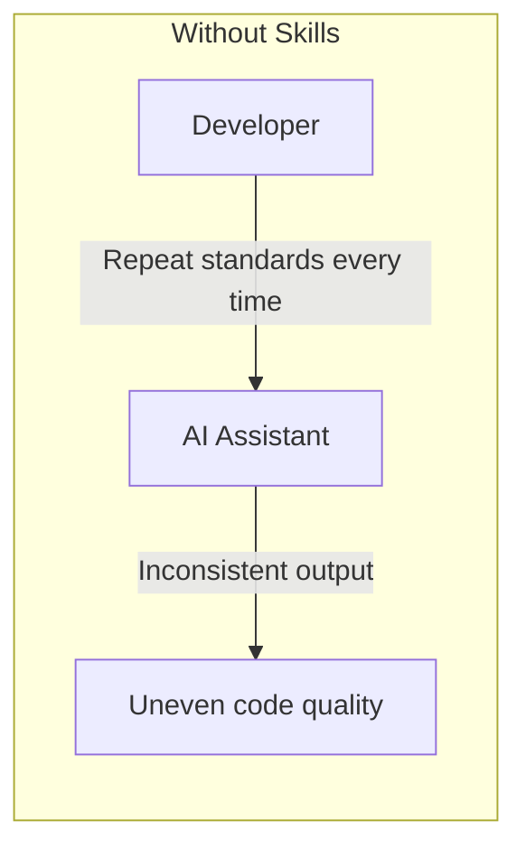
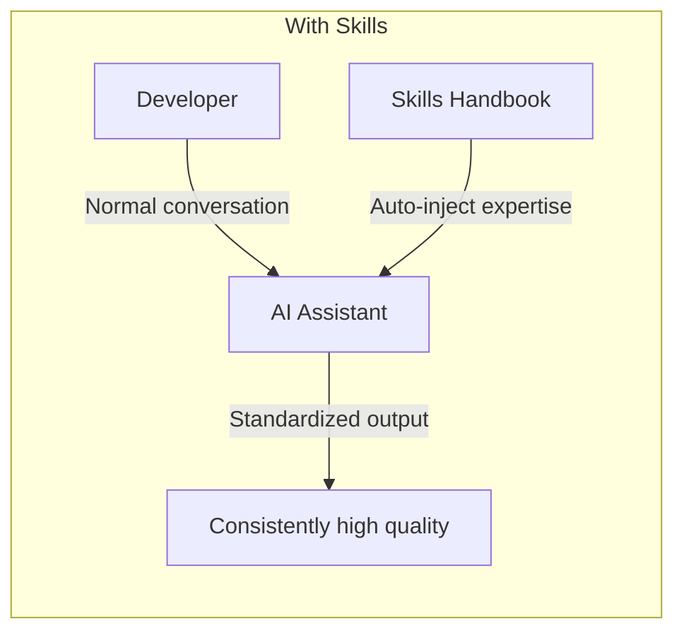
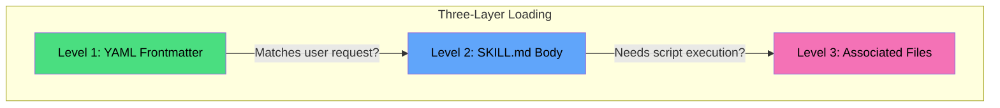
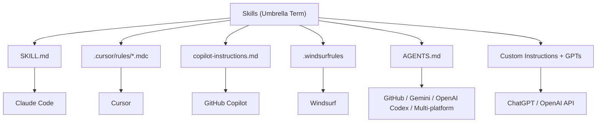
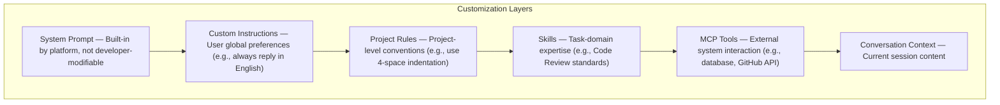
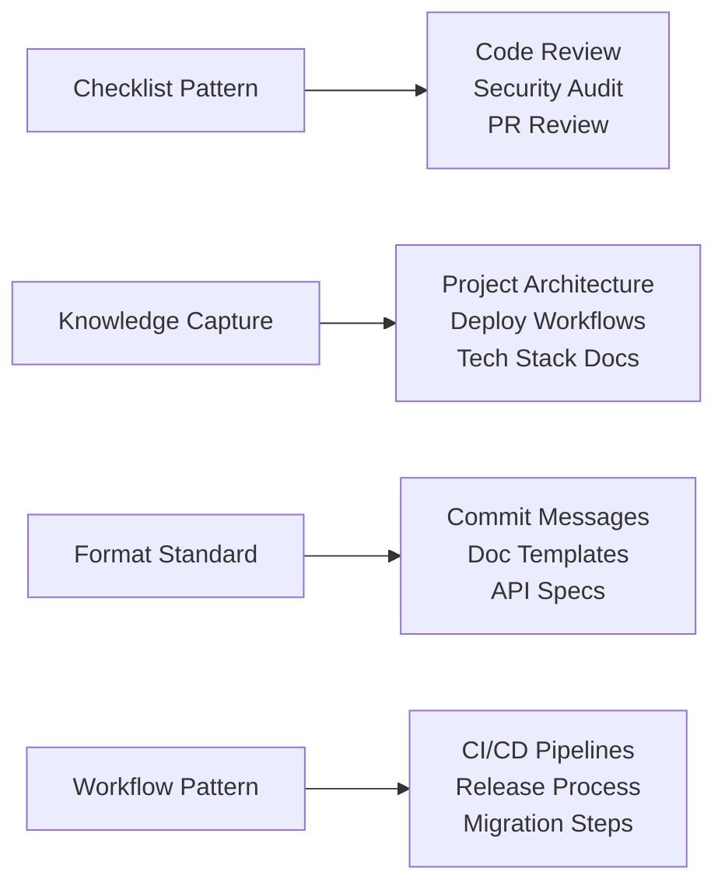
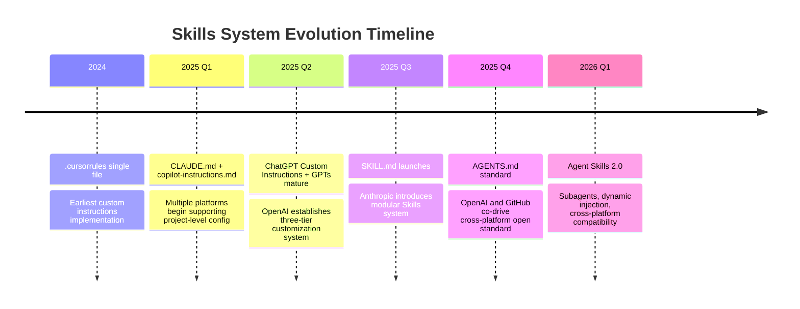
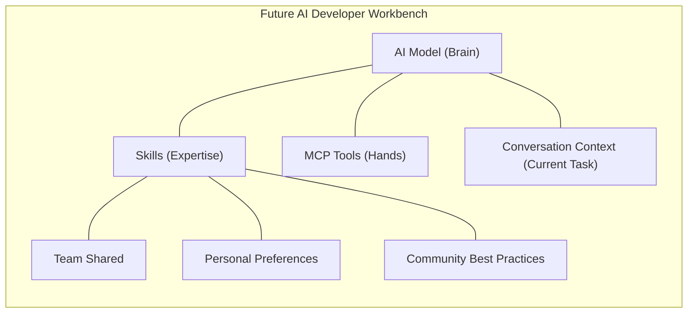

## What Are Skills?

Imagine you hired a brilliant new team member — incredibly smart, learns fast, but **knows nothing about your project**. They don't know your coding standards, aren't familiar with your tech stack, and have no idea about your team's Code Review checklist. Every time you assign a task, you have to explain everything from scratch.

**Skills are the employee handbook you prepare for this "AI new hire."**





Skills are **modular capability extensions for AI coding assistants** — structured Markdown files that inject your team's coding standards, best practices, and workflows into the AI's working context with a "write once, apply forever" approach. They don't change the AI's "IQ," but dramatically boost its "professionalism."

## Why Do You Need Skills?

| Pain Point | Without Skills | With Skills |
|------------|---------------|-------------|
| **Repetitive instructions** | Repeat "use 4-space indentation" and "functions under 50 lines" every conversation | Write Skills once, automatically enforced forever |
| **Inconsistent output** | Same Code Review task yields different review dimensions each time | Strictly follows Skills-defined checklists |
| **Context amnesia** | AI doesn't remember your project uses FastAPI + PostgreSQL | Skills auto-inject project tech stack context |
| **Team collaboration** | Each team member must individually train their AI | Skills ship with the repo, entire team stays aligned |
| **Limited capabilities** | AI only has generic abilities | Skills can include scripts and templates, extending execution capabilities |

## Core Mechanism: Three-Layer Progressive Loading

Using Claude Code's SKILL.md as the representative example, Anthropic designed an elegant "load-on-demand" architecture. The core design philosophy is **"Tokens are money"** — maximizing capability richness while minimizing context window consumption.



### Level 1: YAML Frontmatter (Always Resident)

On startup, the AI reads the `name` and `description` from all Skills, consuming minimal tokens. This layer's purpose is to **quickly determine "is this Skill relevant to the current task?"**

```yaml
---
name: code-review-assistant
description: Code review assistant that reviews code across security, performance, type safety, and test coverage dimensions
---
```

### Level 2: SKILL.md Body (Loaded On-Demand)

When a user's request matches a Skill's `description`, the AI loads that Skill's full instructions. For example, when a user says "review this code," it triggers the full `code-review-assistant` rules.

### Level 3: Associated Files (Deep On-Demand)

Skills can include scripts, reference docs, and templates as supporting files — **only read when referenced in SKILL.md and actually needed**.

```
skills/
└── code-review/
    ├── SKILL.md           # Required: core instructions
    ├── scripts/           # Optional: executable scripts
    │   └── lint-check.sh
    ├── references/        # Optional: reference docs
    │   └── security-checklist.md
    └── assets/            # Optional: templates and resources
        └── report-template.md
```

> **Difference from full loading**: Traditional custom instructions (like `.cursorrules`) inject all content into every conversation. The Skills three-layer mechanism lets the AI load only relevant knowledge when needed — like borrowing just the book you need from the library, instead of hauling the entire library home.

## SKILL.md Hands-On

### Standard Structure

```markdown
---
name: skill-name
description: One-line description of what this Skill does and when it triggers
---

# Skill Title

Explanation of when to use this Skill.

## Core Rules

### 1. Rule One
- Specific checklist items or action steps

### 2. Rule Two
- ...

## Output Format

Define the AI's standardized output template.

## Examples

Provide at least one high-quality input → output example.
```

### Example 1: Code Review Assistant

A "checklist-style" Skill that systematizes team Code Review standards:

```markdown
---
name: code-review-assistant
description: Code review assistant that reviews code across security, performance, type safety, and test coverage dimensions
---

# Code Review Assistant

Use this skill when the user asks for code review or PR review.

## Review Dimensions

Check in the following order, output structured review feedback:

### 1. 🔴 Security (Critical)
- SQL Injection: Are parameterized queries used?
- XSS: Is user input properly escaped?
- Auth: Do API endpoints have proper permission checks?
- Secrets: Are keys or passwords hardcoded?

### 2. 🟠 Performance (High)
- N+1 Queries: Are joinedload/selectinload used to avoid them?
- Caching: Are frequent queries leveraging Redis cache?
- Async: Are IO-heavy operations using async/await?

### 3. 🟡 Type Safety (Medium)
- Are there `any` types that could be replaced with more specific types?
- Do functions have type annotations?

### 4. 🟢 Code Quality (Low)
- Naming: Do variable and function names clearly express intent?
- Function length: Is any single function over 50 lines?
- DRY: Is there duplicate code that could be reused?

## Output Format

## Code Review Summary

### 🔴 Critical
- [file:line] Describe the issue and fix suggestion

### 🟠 Suggestions
- [file:line] Describe the optimization suggestion

### 🟢 Good Practices
- Noteworthy good practices

### 📊 Overall
- Score: X/10
- Recommendation: Approve / Approve with changes / Needs redesign
```

The brilliance of this Skill lies in: **priority ordering** (Security > Performance > Types > Quality > Tests) ensures the AI focuses on the most critical issues first; **enforced output format** makes every Code Review result comparable and trackable.

### Example 2: Git Commit Formatter

A "format-standard" Skill that enforces Conventional Commits:

```markdown
---
name: git-commit-formatter
description: Format Git commit messages following the Conventional Commits specification
---

# Git Commit Formatter

Use this skill when the user asks to commit code or generate a commit message.

## Commit Format

<type>(<scope>): <subject>

<body>

<footer>

## Type Reference

| Type | Description | Example |
|------|-------------|---------|
| feat | New feature | feat(auth): add JWT refresh tokens |
| fix | Bug fix | fix(api): fix pagination parameter parsing |
| docs | Documentation update | docs(readme): update deployment guide |
| refactor | Refactoring | refactor(ai-service): split model selection logic |
| perf | Performance optimization | perf(cache): optimize Redis cache hit rate |
| test | Test-related | test(api): add user registration integration tests |
| chore | Build/tooling changes | chore(deps): upgrade FastAPI to 0.115 |

## Rules

1. Subject must not exceed 50 characters, use imperative mood
2. Body explains **why** the change was made, not **what** was changed
3. Each commit does one thing only
```

### Example 3: Docker Deploy Assistant

A "knowledge-capture" Skill that codifies project containerization architecture:

```markdown
---
name: docker-deploy-assistant
description: Docker deployment assistant for Dockerfile writing, docker-compose orchestration, and deployment workflows
---

# Docker Deploy Assistant

Use this skill for Docker containerization, deployment, and environment orchestration tasks.

## Project Container Architecture

docker-compose.yml
├── backend    (FastAPI, Python 3.12, port 8001)
├── frontend   (Nginx + React build, port 5174)
├── db         (PostgreSQL, port 5432)
├── redis      (Redis, port 6379)
└── monitoring (Prometheus + Grafana, optional)

## Key Rules

1. **Multi-stage builds** — Reduce image size, separate build and runtime environments
2. **Non-root user** — Production images should run as non-root user
3. **Health checks** — Add HEALTHCHECK instructions to monitor container status
4. **Environment variables** — Inject sensitive info via .env or Docker secrets
5. **Network isolation** — Database and Redis only exposed to internal network
```

The value of this Skill: when a new team member joins, the AI automatically gains **complete deployment knowledge** for the project — no manual onboarding needed.

## Six-Platform Skills Comparison

By early 2026, all major AI coding assistants have launched their own "Skills" implementations. While the names differ, the core idea is the same — **configure files to make AI understand your project better**.

### Concept Family Tree



### Cross-Platform Comparison

| Dimension | Claude (SKILL.md) | Cursor (.mdc) | GitHub Copilot | OpenAI (Codex/GPTs) | Windsurf | Gemini |
|-----------|-------------------|---------------|----------------|---------------------|----------|--------|
| **Config path** | `.claude/skills/` | `.cursor/rules/` | `.github/` | `AGENTS.md` / GPT Builder | Project root | `.gemini/` |
| **File format** | YAML + Markdown | YAML + Markdown | Plain Markdown | Markdown / GUI | Plain Markdown | Plain Markdown |
| **Granularity** | One folder per skill | One file per rule | Repo-level + path-level | Repo-level + GPT-level | Global + project | Repo-level |
| **Script support** | ✅ | ❌ | ❌ | ⚠️ GPTs can attach files | ❌ | ❌ |
| **Smart loading** | ✅ Three-layer progressive | ✅ Glob matching | ⚠️ Full load | ⚠️ Full load | ⚠️ Full load | ⚠️ Full load |
| **Scope** | By skill domain | By file type | By path pattern | User-level / repo-level | Global/project | Directory hierarchy |
| **Cross-platform** | Claude only | Cursor only | Copilot only | OpenAI only | Windsurf only | Gemini only |

### Platform Deep Dives

#### Claude Code: SKILL.md + CLAUDE.md

Claude Code's Skills system is the most mature implementation to date. It provides two-layer configuration:

- **CLAUDE.md**: Global config at the project root, defining coding standards, architecture conventions, and tech stack info
- **SKILL.md**: Modular capability packs organized by **task domain** under `.claude/skills/`

**Unique advantage**: Skills can include executable scripts (`scripts/` directory), enabling AI to not just "guide" but actually "execute." Early 2026 updates added subagent support, dynamic context injection, and lifecycle hooks.

#### Cursor: Project Rules (.mdc)

Cursor evolved from a single `.cursorrules` file to a multi-rule system under `.cursor/rules/`:

```yaml
# .cursor/rules/python-style.mdc
---
description: Python code style rules
globs: ["**/*.py"]
---
- Use 4-space indentation
- Functions must include type annotations
- Use f-strings instead of .format()
```

**Unique advantage**: Fine-grained file type matching via the `globs` field — Python rules auto-apply to Python files, TypeScript rules to TS files. Rules can also be quickly created via the `/create-rule` command.

#### GitHub Copilot: copilot-instructions.md + AGENTS.md

Copilot offers a multi-tier instruction system:

- `.github/copilot-instructions.md`: Repo-level global instructions
- `.github/instructions/*.instructions.md`: Path-level fine-grained control
- `AGENTS.md`: Define custom Agent roles (e.g., `@docs-agent`, `@test-agent`)

**Unique advantage**: Supports **organization-level instructions**, enabling cross-repo shared coding standards at the GitHub organization level. The `/init` command can also auto-analyze a codebase and generate configuration.

#### OpenAI: Custom Instructions + GPTs + Codex

OpenAI has built a **three-tier system** in the Skills space, covering everyone from casual users to professional developers:

**① ChatGPT Custom Instructions (User-level)**

ChatGPT's custom instructions were one of the earliest "Skills" prototypes. Users can define persistent preferences in settings:

- Background: "I'm a Python backend engineer, primarily using FastAPI and PostgreSQL"
- Response preferences: "Keep answers concise, give code directly, use English comments"

These instructions are auto-injected into every conversation — no need to repeat. While not as flexible as file-system-level Skills, it's the lowest-barrier AI customization.

**② GPTs (Task-level Skills)**

GPTs are OpenAI's "Skills package" concept — users can create custom ChatGPT versions for specific tasks:

- Build with no code via GPT Builder: specify Instructions, Knowledge (file uploads), and Capabilities (tool permissions)
- Publish to the GPT Store for community sharing
- Upload reference docs and API schemas to give the GPT domain expertise
- **Essentially "Skills + Model + Tools" pre-packaged as a product**

**③ Codex Agent + AGENTS.md (Developer-level)**

OpenAI's Codex is an AI coding agent for professional developers. Codex natively supports the `AGENTS.md` open standard:

- Place `AGENTS.md` at the repo root, and Codex automatically reads project structure, coding standards, and build commands
- Supports nested `AGENTS.md` in monorepos for independent subproject context
- OpenAI is also a co-driver of the `AGENTS.md` open standard

**Unique advantage**: OpenAI's three-tier system has the widest coverage — from "product managers using GPTs without writing code" to "hardcore developers using Codex + AGENTS.md" — accommodating users of all technical levels.

#### Windsurf: .windsurfrules

Windsurf deeply integrates `.windsurfrules` files with its Cascade system:

- Supports global and project-level rules, with project-level overriding global
- Links with Write Mode / Chat Mode / Turbo Mode
- 2026 introduced a Code Integrity Layer that scans AI-generated code for security vulnerabilities before execution

#### AGENTS.md: The Emerging Cross-Platform Open Standard

`AGENTS.md` deserves special attention — it's an **open standard not tied to any vendor**:

```markdown
# AGENTS.md

## Project Overview
This is a full-stack web application built with FastAPI + React.

## Build Steps
- Backend: cd backend && pip install -r requirements.txt
- Frontend: cd frontend && npm install && npm run build

## Coding Standards
- Python follows PEP 8
- All API endpoints must have type annotations
- Test coverage must be at least 80%

## Important Notes
- Never modify migration files under alembic/versions/
- Inject sensitive configuration through environment variables
```

Already supported by GitHub Copilot, OpenAI Codex, Google Gemini, Claude Code, and more. OpenAI and GitHub are core drivers of this standard. It's positioned as a **"README for AI Agents"** — just as README.md is a project description for humans, AGENTS.md is a project description for AI.

## Where Skills Fit in the AI Customization Stack

To understand Skills' positioning, you need to see the **complete customization hierarchy** of AI coding assistants:



### Skills vs MCP: Complementary, Not Competing

Many people confuse Skills and MCP (Model Context Protocol). They operate at **entirely different levels**:

| Dimension | Skills | MCP |
|-----------|--------|-----|
| **Nature** | "Knowing how to do it" (knowledge and process) | "Being able to do it" (tools and capabilities) |
| **Analogy** | Employee handbook / SOP docs | Toolbox / Equipment |
| **Content** | Instructions, standards, templates, best practices | API endpoints, databases, filesystems |
| **Execution** | Guides AI behavior patterns | Lets AI call external tools |
| **Synergy** | Skills guide AI on **how to use** MCP tools | MCP provides the **actual capabilities** referenced in Skills |

> **In one sentence**: Skills are "knowledge in the AI's brain," MCP is "tools in the AI's hands." A complete AI coding workflow needs both — Skills tell the AI "check for N+1 queries during code review," MCP lets the AI "actually connect to the database to verify query performance."

### Skills vs Prompt Engineering

Skills also differ fundamentally from Prompt Engineering:

| Dimension | Prompt Engineering | Skills |
|-----------|-------------------|--------|
| **Duration** | Single conversation | Persistent, cross-session |
| **Granularity** | Entire prompt text | Modular, composable on-demand |
| **Maintenance** | Embedded in code or manually typed | Version controlled, team-shared |
| **Expertise needed** | Deep LLM understanding required | Just write Markdown |

## Best Practices for Writing Skills

### Six Core Principles

**1. Single Responsibility**

Each Skill solves one domain's problems. Don't combine Code Review, Git Commit, and deployment workflows in a single file.

**2. Clear Trigger Conditions**

State explicitly at the top of your SKILL.md when to use the Skill:

```markdown
Use this skill when the user asks for code review, PR review, or code quality checks.
```

**3. Specific, Not Abstract**

❌ "Write high-quality code"

✅ "Functions must not exceed 50 lines, use 4-space indentation, all public methods must have docstrings"

**4. Provide Output Templates**

Define structured output formats to ensure predictable, comparable outputs every time.

**5. At Least One Complete Example**

Humans need examples to understand docs; AI does too. One high-quality input→output example beats ten paragraphs of rules.

**6. Version Control and Iteration**

Skills should be managed via Git. Continuously refine based on usage feedback — if the AI frequently ignores a rule, the rule isn't written clearly enough.

### Four Skill Design Patterns



| Pattern | Use Cases | Key Characteristics |
|---------|-----------|-------------------|
| **Checklist** | Code Review, security audits | Priority-ordered check items |
| **Knowledge Capture** | Project architecture, deploy docs | Codify team knowledge, reduce onboarding cost |
| **Format Standard** | Commit messages, API design | Table-driven, strict formatting |
| **Workflow** | CI/CD, release processes | Multi-step ordered operations |

### Anti-Patterns (Avoid These)

- ❌ **Mega-Skill**: One file covering all scenarios, causing token waste and instruction conflicts
- ❌ **Vague description**: Writing `description` as "helps with programming" — AI can't determine when to trigger
- ❌ **No examples**: Rules-only without examples leads to AI misinterpretation
- ❌ **No output format**: AI outputs different formats each time, blocking standardization
- ❌ **Overlapping responsibilities**: Multiple Skills covering the same domain causes instruction conflicts

## Enterprise Skills Architecture

As team size grows, Skills management needs to be elevated to an architectural concern:

### 1. Layered Organization Strategy

```
project-root/
├── AGENTS.md              # Cross-platform universal project context
├── CLAUDE.md              # Claude Code global config
├── .github/
│   └── copilot-instructions.md  # GitHub Copilot config
├── .cursor/
│   └── rules/             # Cursor rules directory
│       ├── python.mdc
│       └── typescript.mdc
└── .claude/
    └── skills/            # Claude Skills directory
        ├── code-review/
        │   └── SKILL.md
        ├── git-commit/
        │   └── SKILL.md
        └── deploy/
            ├── SKILL.md
            └── scripts/
                └── deploy.sh
```

### 2. Multi-Platform Compatibility Strategy

If team members use different AI tools, adopt an **AGENTS.md as common layer + platform-specific configs** strategy:

- `AGENTS.md` defines project context and coding standards universal to all tools (OpenAI Codex, GitHub Copilot, Gemini, etc.)
- Platform-specific config files define tool-exclusive advanced features
- Git version control ensures team-wide synchronization

### 3. Team Skills Governance

- **Regular audits**: Quarterly review of Skills effectiveness, remove outdated rules
- **Usage metrics**: Track Skills trigger frequency and output quality
- **Tiered management**: Core rules (security-related) require Tech Lead approval; general rules are self-maintained by team members

## Trends and Outlook

### 2025-2026 Key Evolution



### Future Shape

1. **Standard convergence**: `AGENTS.md` is becoming the cross-platform de facto standard; a unified Skills protocol (similar to MCP) may emerge
2. **From instructions to execution**: Skills evolving from plain-text instructions to complete execution packages with scripts, MCP tool references, and automation workflows
3. **AI-generated Skills**: AI can auto-distill and generate Skills from developer work patterns, creating a "gets smarter the more you use it" positive feedback loop
4. **Skills marketplace**: Similar to the VS Code extension marketplace and OpenAI's GPT Store, community-driven Skills sharing platforms are emerging
5. **Deep MCP integration**: Skills serving as "user manuals" for MCP tools, both collaboratively building the complete AI development ecosystem



## FAQ

- **What's the difference between Skills and System Prompts?** System Prompts are built-in platform instructions that developers cannot modify. Skills are developer-defined, task-domain-specific knowledge extensions.
- **Do Skills consume extra tokens?** Yes, Skills content is injected into the AI's context window, consuming token quota. But the three-layer progressive loading mechanism ensures only relevant Skills are loaded, minimizing waste.
- **How do I choose between Skills and MCP?** If you need to **teach AI how to do things** (standards, workflows, templates), use Skills. If you need AI to **connect to external systems** (APIs, databases, filesystems), use MCP. They're complementary.
- **Can Skills work across platforms?** Most Skills formats are platform-specific. But `AGENTS.md` is an open standard supported by OpenAI, GitHub, Google, Anthropic, and more — currently the best cross-platform option.
- **Do OpenAI's GPTs count as Skills?** GPTs are essentially "Skills + Model + Tools" pre-packaged as a product. They bundle Instructions, Knowledge, and Capabilities together — a higher-level form of Skills.
- **How many Skills should a project have?** There's no fixed number. Follow the "single responsibility" principle — each Skill solves one specific domain's problems. Typically 3-8 Skills cover a mid-size project's main needs.
