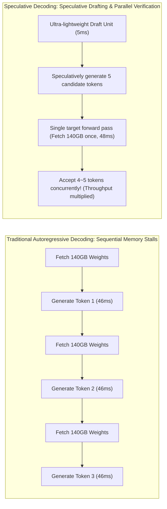
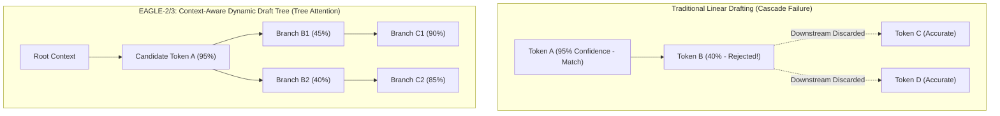
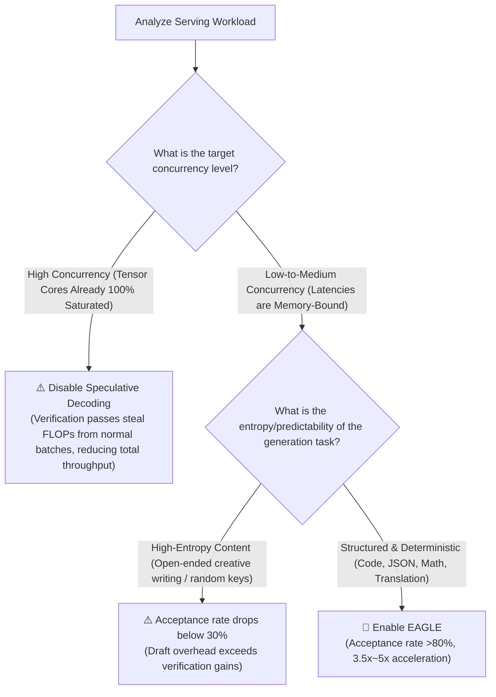

## Introduction: The Memory-Bandwidth Curse of Autoregressive Decoding

Before evaluating model acceleration techniques, we must confront the primary physical bottleneck of LLM inference: **autoregressive generation is profoundly memory-bandwidth bound**.

Consider serving an unquantized 70B parameter model in FP16 at single concurrency (Batch Size = 1):
* The static model weights occupy **140 GB** of VRAM;
* To generate a single new token, the GPU must fetch all 140 GB of weights from High Bandwidth Memory (HBM) into on-chip SRAM and registers;
* On a premier GPU delivering 3 TB/s of memory bandwidth, moving 140 GB requires approximately **46 milliseconds**;
* During those 46 milliseconds, the GPU Tensor Cores perform minimal floating-point operations. **For over 95% of each decoding cycle, expensive compute units idle waiting on memory bus transfers.**



To eliminate this memory bandwidth bottleneck, **Speculative Decoding** shifts the workload from memory-bound sequential fetching to compute-bound parallel verification, generating multiple tokens in a single forward pass of the target model.

---

## I. Mathematical Foundation: The Proof of Exact Lossless Invariance

Engineers often ask: "Does guessing tokens with a smaller auxiliary model degrade output quality or drift the target probability distribution?"

The answer is mathematically definitive: **The output distribution of speculative decoding is provably and strictly 100% identical to the target base model.**

### 1. Verification via Modified Rejection Sampling
Let the target LLM be $M_p$ with conditional distribution $p(x)$, and the speculative draft mechanism be $M_q$ with distribution $q(x)$.

Suppose the draft mechanism speculatively generates $K$ consecutive candidate tokens: $(x_1, x_2, \dots, x_K)$. The target model $M_p$ executes **a single parallel forward pass** across all $K$ positions, evaluating the target probabilities: $p(x_1), p(x_2), \dots, p(x_K)$.

For candidate token $x_k$, the engine executes a modified rejection sampling check:

1. **Calculate Acceptance Probability**:
   $$\alpha = \min\left(1, \frac{p(x_k)}{q(x_k)}\right)$$
2. **Sample Uniform Random Variable** $r \sim \text{Uniform}(0, 1)$:
   * If $r \le \alpha$, **accept** token $x_k$;
   * If $r > \alpha$, **reject** token $x_k$ and terminate verification for subsequent tokens in this draft branch.
3. **Residual Resampling upon Rejection**:
   If a token is rejected at position $k$, the engine samples an alternate replacement token directly from the normalized positive residual distribution:
   $$P_{resample}(x) = \frac{\max(0, p(x) - q(x))}{\sum_x \max(0, p(x) - q(x))}$$

**The Invariance Theorem**: As rigorously proven by Leviathan et al. (2023), marginalizing the joint distribution over the acceptance and residual branches recovers the exact target distribution $p(x)$. Whether employing greedy decoding or temperature-based stochastic sampling, **output fidelity is mathematically preserved**.

---

## II. The Four Generations of Speculative Decoding

Speculative decoding has evolved through four major architectural generations:

| Generation | Architectural Principle | Primary Strengths | Bottlenecks & Limitations | Key Citations |
|:---|:---|:---|:---|:---|
| **Gen 1: Dual-Model Drafting (Draft-Target)** | A small dense model (e.g. Llama-3.2-1B) generates drafts for a 70B target model. | Conceptually simple; uses off-the-shelf pre-trained models. | The draft model is still a full transformer, competing for HBM memory bandwidth on busy GPUs. | Leviathan et al. (2023) |
| **Gen 2: Parallel Multi-Head Prediction (Medusa)** | Eliminates independent draft models; appends multiple parallel MLP prediction heads directly to the target model's final transformer layer. | Zero additional model loading; no independent base model. | Heads lack causal self-attention across draft positions, causing acceptance rates to collapse beyond 3 tokens. | Medusa (2024) |
| **Gen 3: Feature Extrapolation & Dynamic Trees (EAGLE-1 / EAGLE-2)** | Autoregressively extrapolates features in the penultimate hidden state and introduces **Context-Aware Dynamic Draft Trees**. | Smooth feature representations boost acceptance rates above 80%, yielding >3x speedup. | Requires training a lightweight autoregressive head per target architecture. | SafeAILab / Tsinghua (2024) |
| **Gen 4: Multi-Scale Semantic Fusion (EAGLE-3)** | Fuses low-, mid-, and high-level hidden representations across transformer depths into the dynamic tree. | Significantly improves confidence on rare tokens and code syntax, unlocking **4x~5.6x speedups**. | Requires distributed offline synthetic feature extraction pipelines during training. | EAGLE-3 (2025/2026) |

---

## III. Dissecting EAGLE: Why Dynamic Draft Trees Dominate

Tsinghua University's open-source framework **[EAGLE (SafeAILab/EAGLE)](https://github.com/SafeAILab/EAGLE)** has become the standard speculative backend across both vLLM and SGLang.

### 1. From Linear Chains to Dynamic Trees
Traditional speculative drafting predicts a single linear sequence: $Token_1 \to Token_2 \to Token_3$.

**The Linear Bottleneck**: If the model has 95% confidence on Token 1, but Token 2 represents an ambiguous conjunction with only 40% confidence, a rejection at Token 2 **invalidates all subsequent tokens**, even if Tokens 3 and 4 were entirely accurate!



### 2. The Tree Attention Verification Mechanism
EAGLE flattens the multi-branch candidate tree into a single concatenated sequence, using a **2D Tree-Attention Mask** to allow the target model to verify all candidate branches in **one single forward pass**:
* If branch $B_1$ is rejected but branch $B_2$ matches, the engine accepts path $B_2 \to C_2$ seamlessly.
* Dynamically pruning unlikely paths keeps the average accepted tokens per step ($\tau$) reliably between **3.5 and 4.8**.

---

## IV. Production Deployment: vLLM & SGLang Integration

Here is how to deploy EAGLE speculative decoding for `Qwen/Qwen2.5-72B-Instruct` in production containers.

### 1. Deploying with vLLM

vLLM natively integrates EAGLE via the `--speculative-model` parameter:

```bash
vllm serve Qwen/Qwen2.5-72B-Instruct \
  --tensor-parallel-size 4 \
  --gpu-memory-utilization 0.90 \
  --max-model-len 8192 \
  --speculative-model yuhuili/EAGLE-Qwen2.5-72B-Instruct \
  --num-speculative-tokens 5 \
  --speculative-draft-tensor-parallel-size 1 \
  --port 8000
```

**Key Flag Rationale**:
* `--speculative-model`: Points to the dedicated EAGLE lightweight head weights on HuggingFace (~500MB to 1GB);
* `--num-speculative-tokens 5`: Drafting 5 tokens balances verification throughput with GPU latency;
* `--speculative-draft-tensor-parallel-size 1`: The draft head is small enough to run on a single GPU without cross-GPU communication overhead.

### 2. Deploying with SGLang

SGLang provides native tree-search kernels for EAGLE (for architectural comparisons, see our [SGLang vs vLLM Architecture Breakdown](/en/articles/sglang-vs-vllm-architecture/)):

```bash
python3 -m sglang.launch_server \
  --model-path Qwen/Qwen2.5-72B-Instruct \
  --speculative-algorithm EAGLE \
  --speculative-draft yuhuili/EAGLE-Qwen2.5-72B-Instruct \
  --speculative-num-steps 5 \
  --speculative-eagle-topk 4 \
  --speculative-num-draft-tokens 16 \
  --tp 4 \
  --port 30000
```
*Note: `--speculative-eagle-topk 4` and `--speculative-num-draft-tokens 16` activate dynamic tree exploration with depth 5 across 16 draft nodes.*

---

## V. When Does Speculative Decoding Fail? The Slowdown Trap

Speculative decoding is not universally beneficial. Under certain operating conditions, it can cause an inadvertent **performance regression (Negative Speedup)**:



### The Compute Saturation Boundary
* **Low Concurrency (Concurrency $\le 16$)**: GPU Tensor Cores sit underutilized during decoding. Speculative verification leverages idle compute to accelerate Inter-Token Latency (ITL) by 60%~75%.
* **High-Throughput Concurrency (Concurrency $\ge 128$)**: Batches are already dense enough to saturate memory bandwidth into a Compute-Bound state. Adding speculative verification passes can **reduce overall system throughput by 10%~15%**.

---

## Frequently Asked Questions (FAQ)

### Q1: Does speculative decoding require retraining the base model?
No. The base foundation model remains 100% frozen. EAGLE trains an auxiliary single-layer decoder head on frozen intermediate feature vectors, requiring only 0.5% to 1% of the base model's parameters and a few hours of commodity GPU training.

### Q2: Can speculative decoding be combined with FP8 weight quantization?
Yes, and this represents the standard high-performance inference stack in 2026. Deploying FP8/AWQ weights fits models within tight VRAM constraints (see our [Practical Quantization Guide](/en/articles/quantization-hands-on-guide/)), while an EAGLE speculative head bypasses memory-bandwidth bottlenecks.

### Q3: Why does real-world speedup sometimes lag behind theoretical benchmarks?
Realized acceleration is strictly bounded by the **empirical acceptance rate $\alpha$**. In programming languages (Python/Java) and JSON extraction where syntax is highly structured, acceptance rates exceed 85%, yielding 4x+ speedups. In open-ended conversational domains with high sampling temperatures ($T \ge 1.0$), acceptance rates drop toward 50%, yielding more modest 1.8x~2.2x speedups.
