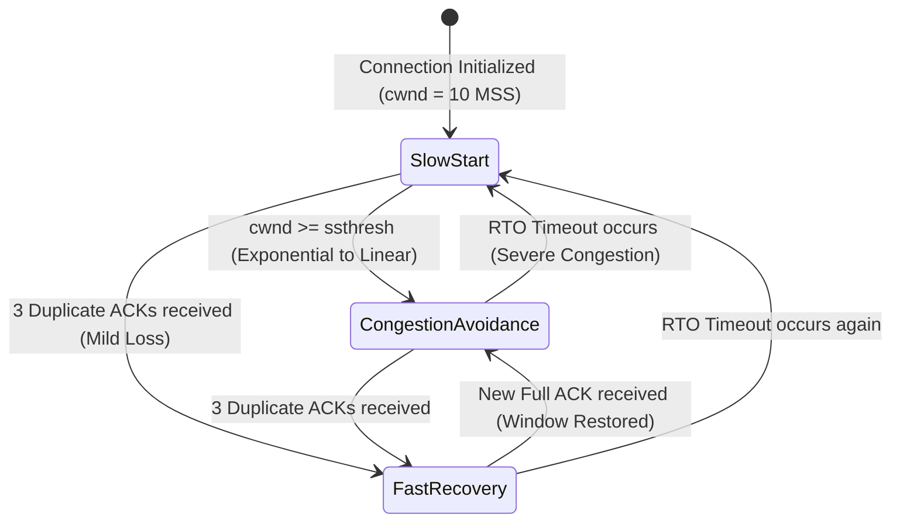
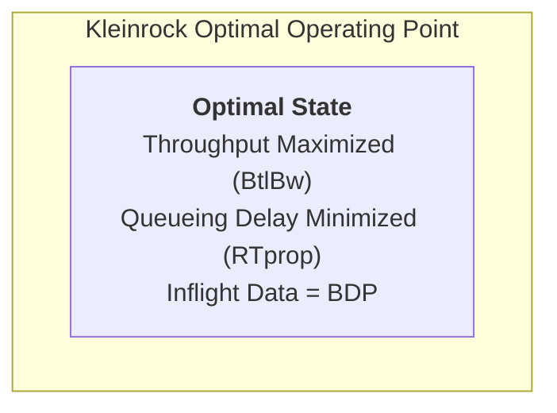
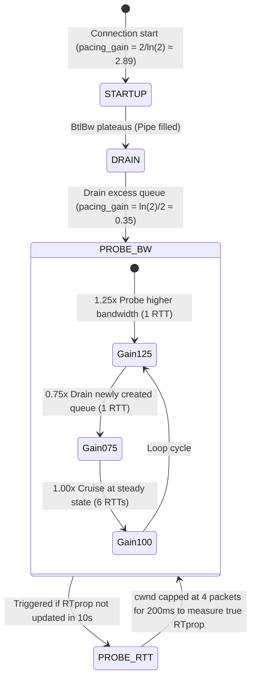

## Introduction: The Fundamental Division Between Flow Control and Congestion Control

In Chapter 5 of our series, [Network & Transport Layers in Depth: IP Routing, CIDR, TCP 11-State Machine, and Sliding Window First Principles](/en/articles/network-layer-transport-layer-ip-routing-tcp-state-machine/), we saw how TCP's sliding window uses the Advertised Window (`rwnd`) to protect the receiver's socket buffer.

However, network communications do not travel through an isolated two-party pipe; they traverse complex mesh fabrics composed of hundreds of physical switches and routers:
- **Flow Control**: An **end-to-end** local contract designed to prevent a fast sender from overrunning a slow receiver's application memory buffer;
- **Congestion Control**: A **global, fabric-wide** coordination mechanism designed to prevent participating hosts from injecting more aggregate traffic into the network than the intermediate switches' queues and optical links can physically sustain.

In 1986, the young Internet experienced its first catastrophic **"Congestion Collapse"**: throughput across the NSFnet backbone plummeted from 32 Kbps to 40 bps—an 800-fold collapse!

To rescue the Internet, Van Jacobson published his seminal 1988 paper defining modern congestion control algorithms. This article breaks down the three generational paradigm shifts in congestion control: **Loss-based classical control (Reno/Cubic) $\to$ Model-based delay-bandwidth control (Google BBR) $\to$ Application-layer transport unification (HTTP/3 QUIC)**.

---

## 1. Loss-Based Congestion Control: AIMD, Reno, and the Cubic Polynomial

### 1.1 Classical AIMD Philosophy and TCP Reno

Loss-based congestion control relies on a core premise: **the network is a black box, and packet loss signals congestion**. The sender tracks a **Congestion Window (`cwnd`)**, and the effective volume of inflight data permitted into the network is governed by:

$$W = \min(cwnd, rwnd)$$

TCP Reno introduced the iconic **AIMD (Additive Increase Multiplicative Decrease)** feedback loop:



1. **Slow Start**:
   For each Round-Trip Time (RTT), `cwnd` doubles exponentially ($1, 2, 4, 8 \dots$) until reaching the slow-start threshold `ssthresh`;
2. **Congestion Avoidance (Additive Increase)**:
   Once in steady state, `cwnd` grows by only 1 MSS per RTT (linear growth), cautiously probing for spare network bandwidth;
3. **Fast Retransmit & Fast Recovery (Multiplicative Decrease)**:
   Upon receiving 3 duplicate ACKs, the sender infers an isolated dropped segment rather than total route failure. It immediately retransmits the missing segment, cuts `ssthresh` in half ($\text{ssthresh} = \frac{cwnd}{2}$), sets `cwnd` to `ssthresh + 3`, and enters Fast Recovery, skipping a painful fallback to Slow Start.

#### The Fatal Flaw: Bufferbloat
Algorithms like Reno assume that "loss equals congestion." As a result, the sender continuously inflates `cwnd`, **filling up the deep buffers of intermediate routers**. While no packets are dropped initially, packets languish in router queues for hundreds of milliseconds or even seconds, producing **severe RTT inflation and devastating queueing delays** that destroy interactive real-time performance!

### 1.2 TCP Cubic: Cubic Polynomial Curve and RTT Independence

Over high-bandwidth, high-latency (High-BDP) optical networks, Reno's linear 1 MSS per RTT increment is painfully sluggish—taking hours to saturate a 10 Gbps transoceanic link.

Linux kernel 2.6.19 introduced **TCP Cubic**, making it the long-standing default. Cubic replaces linear growth with a **cubic polynomial function** governed by elapsed real time $t$:

$$W_{cubic}(t) = C \cdot (t - K)^3 + W_{max}$$

Where:
- $W_{max}$ is the congestion window size right before the previous packet loss event;
- $K = \sqrt[3]{\frac{W_{max} \cdot \beta}{C}}$ is the time constant required to scale the window back to $W_{max}$;
- $C$ is a scaling constant (typically ~0.4), and $\beta$ is the multiplicative decrease factor (typically ~0.2).

```
Cubic Window Growth Curve (Concave and Convex Phases):
      cwnd ^                                    / (Convex Phase: Probing New Capacity)
           |                                  /
           |                                /
   W_max --+---------------------+        /
           |   (Concave Phase)     \    /
           |   (Rapid Catch-up)     \  /
           |                         \/
           +---------------------------------------------> Time t
                                  t = K
```

- **Concave Phase**: Following packet loss, the window climbs rapidly, decelerating as it nears $W_{max}$ to gently approximate past capacity;
- **Plateau Phase**: Around $t \approx K$, growth stays relatively flat, maximizing link saturation with minimal risk of triggering buffer drops;
- **Convex Phase**: If no packet loss occurs, window growth accelerates exponentially upward, aggressively discovering whether more physical bandwidth is available;
- **Mathematical Advantage**: Cubic's growth is **solely driven by wall-clock time $t$ and is decoupled from link RTT**, resolving Reno's unfair bias where short-RTT flows starved long-RTT flows.

---

## 2. Model-Based Congestion Control: Google BBR Physical Modeling

Both Reno and Cubic are **loss-based** algorithms. However, loss is an indirect, lagging indicator of congestion, and on wireless links, random electromagnetic noise drops packets without any queue overflow.

In 2016, Google introduced **BBR (Bottleneck Bandwidth and RTT)**, a revolutionary model-driven algorithm.

### 2.1 The Kleinrock Optimal Operating Point and BDP



According to queueing theory, the physical capacity of any communication network is governed by two independent physical parameters:
1. **$BtlBw$ (Bottleneck Bandwidth)**: Dictated by the slowest physical switch or optical interface along the route;
2. **$RTprop$ (Round-Trip Propagation Time)**: Dictated by the speed of light through physical fiber and the physical distance between endpoints.

This defines the ideal volume of in-flight data—the **Bandwidth-Delay Product (BDP)**:

$$BDP = BtlBw \times RTprop$$

- **Region 1 (Underutilized, $\text{Inflight} < BDP$)**: The pipe is not filled, and available capacity is wasted;
- **Region 2 (Optimal Kleinrock Point, $\text{Inflight} = BDP$)**: **Throughput reaches physical maximum, router queues remain empty, and latency equals the minimum speed-of-light propagation delay!**
- **Region 3 (Bufferbloat, $\text{Inflight} > BDP$)**: The pipe is saturated; additional packets queue up in switch buffers, inducing latency spikes;
- **Region 4 (Congestion Collapse)**: Switch buffers overflow, triggering severe packet loss.

**BBR's Core Breakthrough**: Never let traffic spill into Regions 3 and 4. By continuously estimating both $BtlBw$ and $RTprop$, BBR pins network inflight data precisely to the **Kleinrock optimal point ($\text{Inflight} = BDP$)**!

### 2.2 BBR State Machine and Pacing Rate Control

BBR replaces sliding window packet bursts with an autonomous **Pacing Engine**, dispatching individual packets at precise nanosecond intervals:

```
pacing_rate = pacing_gain * BtlBw
```



1. **STARTUP Phase**: Uses a high pacing gain ($2.89\times$) to rapidly probe physical bottleneck bandwidth;
2. **DRAIN Phase**: Drops pacing gain to $0.35\times$ to flush out the queue accumulated during STARTUP;
3. **PROBE_BW Phase (Cruising)**: Cycles through 8 phases ($1.25 \to 0.75 \to 1.0 \times 6$). It accelerates briefly to discover new capacity, slows down to drain queues, and cruises smoothly for the remaining cycles;
4. **PROBE_RTT Phase**: Every 10 seconds, caps `cwnd` at 4 packets for 200ms to completely empty all in-flight buffers, exposing the pristine speed-of-light $RTprop$.

---

## 3. Application and Transport Protocol Unification: HTTP/1.1, HTTP/2 to HTTP/3 (QUIC)

Even with optimal congestion control algorithms, **TCP's kernel-bound architecture and single-stream abstraction** remained a major bottleneck for modern web applications.

### 3.1 Protocol Stack Evolution and Head-of-Line (HoL) Blocking

```mermaid
flowchart TD
    subgraph HTTP1["HTTP/1.1: Plaintext Sequential Execution"]
        H1_Req1["GET /index.html"] --> H1_Wait["Wait for response..."]
        H1_Wait --> H1_Req2["GET /style.css"]
        H1_Note["Drawback: Head-of-line blocking; requires 6 parallel TCP connections workaround"]
    end

    subgraph HTTP2["HTTP/2: Multiplexing over Single TCP (Binary Framing)"]
        H2_Stream1["Stream 1 (HTML)"] & H2_Stream2["Stream 2 (CSS)"] & H2_Stream3["Stream 3 (JS)"] --> TCP_Pipe["Single TCP Connection Pipe"]
        TCP_Pipe --> Drop["1 TCP Packet Lost in Transit!"]
        Drop --> TCP_HoL["<b>Fatal TCP HoL Blocking</b>: Kernel stalls all multiplexed streams<br/>waiting for TCP retransmission, blocking all application data!"]
    end

    subgraph HTTP3["HTTP/3: QUIC Independent Streams over UDP"]
        H3_Stream1["Stream 1 (Healthy)"] & H3_Stream2["Stream 2 (Packet Lost)"] & H3_Stream3["Stream 3 (Healthy)"] --> UDP_Pipe["Independent UDP Datagrams"]
        UDP_Pipe --> H3_Fix["<b>Zero HoL Blocking</b>: Packet loss on Stream 2 only retransmits Stream 2<br/>Streams 1 and 3 are delivered immediately to the application!"]
    end
```



### 3.2 Five Revolutionary Capabilities of HTTP/3 (QUIC)

1. **Elimination of Cross-Stream Head-of-Line Blocking**:
   QUIC operates over UDP, maintaining independent packet sequencing and sliding windows for each logical Stream. Dropped packets on Stream A stall only Stream A; Streams B and C continue uninterrupted;
2. **0-RTT Instant Handshakes**:
   By merging the TCP transport handshake (1 RTT) with the TLS 1.3 cryptographic handshake (1 RTT), QUIC completes connection establishment in 1 RTT for initial requests and **0-RTT** for repeat visits, embedding encrypted HTTP requests in the initial flight;
3. **Connection Migration**:
   Traditional TCP binds sockets to a 4-tuple (Source IP, Source Port, Dest IP, Dest Port). When a mobile user steps outside and switches from Wi-Fi to 5G, the IP changes, tearing down the TCP connection.
   QUIC binds sessions using a 64-bit **Connection ID (CID)**. As the physical IP shifts, the logical connection migrates transparently without interrupting active video calls or downloads;
4. **User-Space Congestion Control & Agile Upgrades**:
   TCP resides in the Linux kernel; rolling out updates requires kernel reboots across millions of machines. QUIC implementations live in user-space libraries, allowing teams to deploy modern congestion algorithms via regular software releases;
5. **End-to-End Encryption and Anti-Tampering**:
   Except for a minimal set of UDP header flags, all QUIC metadata (packet numbers, stream offsets, ACK frames) is encrypted via TLS 1.3, preventing middlebox manipulation and rogue ISP injection.

---

## 4. Production Tuning: Enabling Google BBR and Fair Queueing

To enable BBR on modern Linux servers (Linux kernel 4.9+, recommended 5.15+ or 6.x):

```bash
# 1. Inspect current congestion control algorithms
sysctl net.ipv4.tcp_congestion_control
sysctl net.ipv4.tcp_available_congestion_control

# 2. Append production configuration
cat << 'EOF' >> /etc/sysctl.conf
# BBR pacing strictly requires the Fair Queueing (FQ) packet scheduler
net.core.default_qdisc = fq
# Set TCP congestion control to BBR
net.ipv4.tcp_congestion_control = bbr
EOF

# 3. Reload configuration immediately
sysctl -p

# 4. Verify BBR module activation
lsmod | grep bbr
```

---

## 5. Summary and Next Steps

From physical links to IP routing, TCP state machines, sliding windows, and the transition from Reno/Cubic to BBR and HTTP/3 QUIC, we have surveyed how modern Internet communication guarantees reliability across wide-area networks.

However, we have yet to open one critical black box: **when an electrical or optical pulse arrives at a Linux server's network adapter, how does the operating system kernel retrieve bytes in nanoseconds, schedule multi-core CPUs, and deliver payloads into socket buffers?**
- Why did early hardware-interrupt-only designs trigger fatal interrupt storms, and how did NAPI hybrid polling resolve them?
- How does Linux's core `sk_buff` data structure use pointer arithmetic to achieve zero-copy protocol traversals?
- Why do standard kernel stacks become bottlenecks on 100 Gbps interfaces, and how does **eBPF XDP** achieve 20M+ PPS wire-speed packet processing inside the network driver?

In Chapter 7 of our masterclass, we dive straight into the Linux networking subsystem: **[Linux Kernel Networking Subsystem in Depth: From NIC Drivers, NAPI, and Ring Buffers to eBPF XDP Wire-Speed Forwarding](/en/articles/linux-kernel-networking-napi-ring-buffer-skbuff-xdp/)**!

---

## Frequently Asked Questions (FAQ)

### Q1: Why does Google BBR strictly require the `fq` (Fair Queueing) scheduler instead of the default `pfifo_fast`?
**The core reason is that BBR relies on fine-grained pacing, which `pfifo_fast` cannot enforce.**
Traditional Linux stacks write data in large packet bursts directly to the network driver. BBR eliminates burst-induced bufferbloat by pacing packets out evenly at calculated nanosecond intervals (`pacing_rate`).
The `fq` scheduler maintains per-socket timers that enforce precise transmission timestamps. If run with a standard FIFO queue like `pfifo_fast`, packets are released in bursts, causing momentary buffer spikes in intermediate switches and corrupting BBR's real-time measurements of bottleneck bandwidth and propagation delay.

### Q2: Under random packet loss (e.g., 10% loss on weak Wi-Fi or satellite links), why does Cubic's throughput collapse while BBR maintains near line-rate?
**Because of a fundamental difference in how they define congestion:**
- **Cubic is loss-driven**: It interprets any packet loss as a sign of catastrophic buffer overflow. With 10% random loss, Cubic continually triggers multiplicative decrease, halving `cwnd` until it drops to ~1 MSS, causing throughput to plummet;
- **BBR is model-driven**: It estimates delivery rate from received ACKs and tracks minimum RTT. BBR recognizes that as long as the delivery rate matches the bottleneck physical bandwidth $BtlBw$, the pipe is not congested, regardless of packet drops. BBR maintains its pacing rate, promptly retransmits lost packets, and saturates more than 90% of available physical bandwidth.

### Q3: Since HTTP/3 runs on top of UDP, how does it prevent packet loss and remain secure in production environments?
**QUIC implements reliable transport in user space and enforces end-to-end TLS 1.3 encryption by default.**
1. **Full-stack reliability**: QUIC implements monotonic packet numbering, selective acknowledgments (SACK), user-space congestion control (Cubic/BBR), and retransmission timers. UDP is merely used as a stateless transport container to traverse existing switch ASICs and NAT gateways;
2. **Protocol ossification defense**: Legacy middleboxes frequently drop or alter unknown TCP options. Because QUIC encrypts virtually its entire payload—including headers, stream IDs, and ACK frames—via TLS 1.3, intermediate network appliances cannot inspect or tamper with its internal state, ensuring secure, high-performance transport over untrusted public networks.
