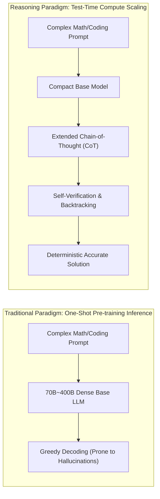
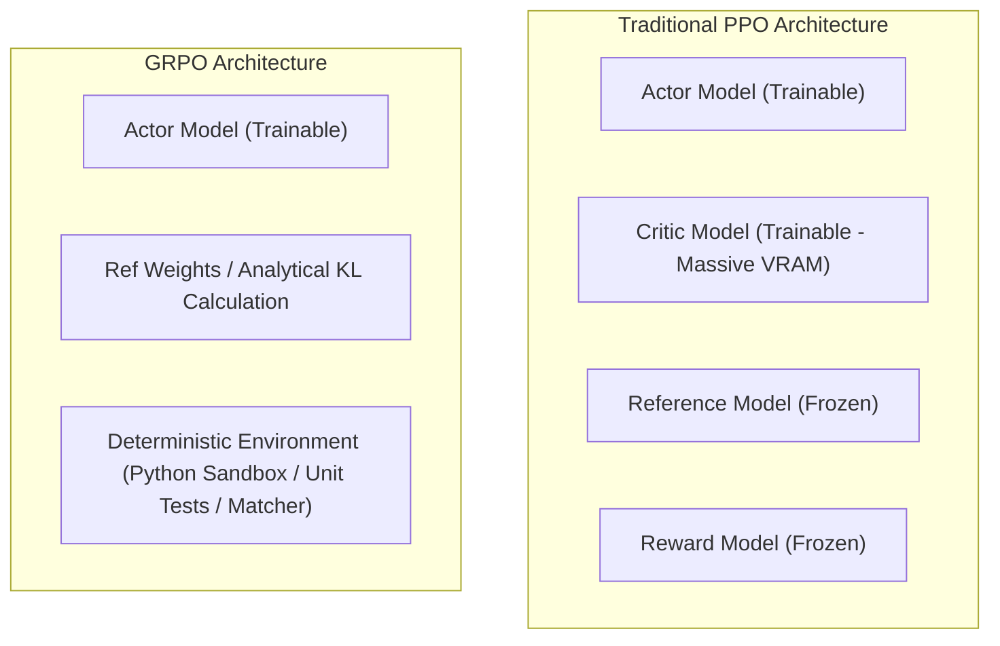

## Introduction: The Pre-training Wall and the Dawn of Test-Time Scaling

For the past several years, the foundational law of frontier LLM development was Chinchilla's **Pre-training Scaling Laws**: stack deeper transformer layers, ingest multi-trillion token corpora, and burn increasingly massive GPU clusters.

However, entering 2026, this brute-force approach has encountered formidable physical and thermodynamic bottlenecks:
1. **The Human Knowledge Depletion Wall**: High signal-to-noise public internet text has been virtually exhausted. Naive ingestion of low-quality synthetic web dumps risks "model collapse" and entropy degeneration during unsupervised pre-training.
2. **Diminishing Returns on Model Scale**: Pushing model parameters from 70B to 700B incurs exponential spikes in capital expenditures, cluster interconnect overhead, and power consumption, yet returns only marginal improvements on everyday reasoning.

As pre-training scaling slows, frontier reasoning engines (such as OpenAI o1/o3 and DeepSeek-R1) have ignited a secondary growth curve: **Test-Time Compute Scaling Laws**.



Rather than spending millions of dollars during pre-training to memorize answers to every conceivable question, test-time scaling trains models to allocate dynamic computation at inference time—thinking, calculating, and self-correcting before providing a response.

---

## I. The Three Regimes of Test-Time Compute Scaling

In modern literature, extending test-time compute falls into three primary architectural regimes:

| Scaling Regime | Core Mechanism | Primary Compute Bottleneck | Representative Work | Bottlenecks & Failure Modes |
|:---|:---|:---|:---|:---|
| **1. Sequential CoT Expansion** | The model outputs multi-thousand token chains of thought (`<think> ... </think>`), enabling backtracking and scratchpad verification. | Autoregressive decoding latency | DeepSeek-R1, OpenAI o1 | Prone to "overthinking" loops on trivial prompts; latency increases substantially. |
| **2. Leaf-level Sampling & Voting** | Parallel sampling of $N$ diverse paths, combined with majority voting or verifiers. | Batch concurrency capacity | Best-of-N, Self-Consistency | Search space is unguided; incorrect trajectories waste full GPU decode cycles. |
| **3. Prefix-level Search with PRMs** | Process Reward Models (PRMs) score intermediate steps within tree search (Beam Search / MCTS). | Step-level verifier evaluation | AlphaGo-style MCTS, Step-PRMs | Step-level PRM annotations are costly; imperfect verifiers invite "reward hacking." |

The breakthrough of DeepSeek-R1 lies in fusing **sequential chain-of-thought expansion** with **critic-free reinforcement learning**, proving that pure rule-based RL can induce deep reasoning behaviors without manually engineered step-by-step PRMs.

---

## II. From PPO to GRPO: Why Traditional RLHF Breaks on Long Reasoning Traces

For years, **PPO (Proximal Policy Optimization)** was the standard algorithm for post-training alignment. However, when applied to reasoning models with 10k+ token outputs, PPO collapses under severe infrastructure and mathematical constraints.

### 1. The Quad-Model VRAM Explosion
A classic PPO training setup requires hosting and synchronizing **four distinct neural networks**:
* **Actor Model ($\pi_\theta$)**: The trainable policy generating tokens.
* **Critic Model ($V_\phi$)**: Typically matching the Actor's size, tasked with estimating scalar state values $V(s)$.
* **Reference Model ($\pi_{ref}$)**: A frozen copy computing per-token KL divergence to prevent policy drift.
* **Reward Model ($R_\psi$)**: A frozen network scoring terminal outputs.



In a 70B parameter setup, loading the Actor and Critic alongside their respective AdamW optimizer states easily demands over **600GB of VRAM**. This forces teams to deploy complex tensor and pipeline parallelism merely to fit the training loop. For low-level driver and memory bus topology guidelines, consult our [NVIDIA GPU Package Architecture Deep Dive](/en/articles/nvidia-gpu-package-architecture/).

### 2. Value Function Drift Across Long Horizons
When a model reasons through intricate mathematical proofs, trajectories stretch across 8,000 to 16,000 tokens. Training a Critic to accurately predict the expected discounted return at every intermediate token is mathematically fragile. Critic errors amplify gradient variance, causing loss values to explode into NaNs.

---

## III. Mathematical Derivation of GRPO: The Critic-Free Revolution

**GRPO (Group Relative Policy Optimization)** was pioneered by DeepSeek in the DeepSeekMath paper and scaled in DeepSeek-R1.

Its core thesis is remarkably elegant: **Eliminate the Critic network entirely, sample a group of completions for each prompt, and use the group's empirical distribution as the baseline.**

### 1. Group Sampling and Normalized Advantage
For any input query $q$, the policy $\pi_{\theta_{old}}$ generates a group of $G$ distinct candidate completions:

$$\{o_1, o_2, \dots, o_G\} \sim \pi_{\theta_{old}}(q)$$

The verification environment (e.g., a regex answer parser or a compiler test runner) assigns scalar rewards to each completion:

$$\{r_1, r_2, \dots, r_G\}$$

Rather than evaluating an absolute value network $V(s)$, GRPO computes the relative advantage $A_i$ of completion $o_i$ normalized against its peers:

$$A_i = \frac{r_i - \text{mean}(\{r_1, \dots, r_G\})}{\text{std}(\{r_1, \dots, r_G\}) + \epsilon}$$

* If $o_i$ outperforms the group average, $A_i > 0$, reinforcing the token trajectory.
* If $o_i$ underperforms, $A_i < 0$, penalizing the trajectory.
* Normalizing by the standard deviation dynamically stabilizes variance across batches.

### 2. The GRPO Objective Function
Retaining the clipped surrogate mechanism from PPO, GRPO optimizes the following objective:

$$\mathcal{J}_{GRPO}(\theta) = \mathbb{E}_{q \sim P(Q), \{o_i\}_{i=1}^G \sim \pi_{\theta_{old}}(q)} \left[ \frac{1}{G} \sum_{i=1}^{G} \frac{1}{|o_i|} \sum_{t=1}^{|o_i|} \left( \min \left( \frac{\pi_\theta(o_{i,t} \mid q, o_{i,<t})}{\pi_{\theta_{old}}(o_{i,t} \mid q, o_{i,<t})} A_{i,t}, \; \text{clip}\left(\frac{\pi_\theta(o_{i,t} \mid q, o_{i,<t})}{\pi_{\theta_{old}}(o_{i,t} \mid q, o_{i,<t})}, 1-\epsilon, 1+\epsilon\right) A_{i,t} \right) - \beta D_{KL}(\pi_\theta \parallel \pi_{ref}) \right) \right]$$

where the per-token KL divergence approximation is computed directly:

$$D_{KL} = \frac{\pi_{ref}(o_{i,t} \mid \cdot)}{\pi_\theta(o_{i,t} \mid \cdot)} - \log \frac{\pi_{ref}(o_{i,t} \mid \cdot)}{\pi_\theta(o_{i,t} \mid \cdot)} - 1$$

This architectural shift achieves two immediate advantages:
1. **Over 50% Reduction in Training Memory**: Eliminating the Critic model discards its weights, gradients, and optimizer states.
2. **Zero Value-Model Misalignment**: The baseline is derived directly from empirical sampling statistics, providing stable convergence.

---

## IV. The "Aha Moment" and the Emergence of Self-Reflection

In the DeepSeek-R1-Zero experiment, researchers demonstrated that **without a single human SFT demonstration**, training a pure base model with GRPO induced complex reasoning behaviors:

### 1. Deterministic Rule-Based Rewards
Instead of relying on a learned neural reward model (which often suffers from reward gaming), the environment enforces strict rule-based verifiers:
1. **Accuracy Reward**: Verifies if the mathematical result matches ground truth or if the unit tests pass in a sandboxed interpreter (1.0 for success, 0.0 for failure).
2. **Format Reward**: Enforces that reasoning is encapsulated strictly between `<think>` and `</think>` tags, with the final answer inside `<answer>`.

### 2. Spontaneous Emergence of Self-Correction
After several thousand iterations, as trajectory length expanded, logs revealed models discovering self-correction unprompted:

```text
User: Is 9.11 larger than 9.9?
Assistant:
<think>
First, compare 9.11 and 9.9.
The integer part is both 9.
Now compare the tenths place: 9.11 has 1 in the tenths place, while 9.9 has 9 in the tenths place.
Wait! Let me rethink this... Am I confusing decimal places with software version numbers?
In software engineering, v9.11 is newer than v9.9, but mathematically, 9.9 = 9.90.
Since 9.90 > 9.11, 9.9 is strictly larger.
Let me double check the calculation: 9.9 - 9.11 = 0.79 > 0. Yes, absolutely correct.
</think>
<answer>
No, 9.9 is larger than 9.11.
</answer>
```

From a reinforcement learning perspective, exploratory paths that verified intermediate results achieved a higher pass rate on difficult tasks than one-shot guesses. The group-relative advantage mechanism amplified these self-questioning trajectories.

---

## V. Hands-on Implementation: A Minimal GRPO Training Pipeline

Using Hugging Face's **TRL (Transformer Reinforcement Learning)** library, here is an end-to-end runnable script training a lightweight base model (such as `Qwen/Qwen2.5-1.5B-Instruct`) with GRPO:

### 1. Environment Setup
```bash
pip install torch transformers trl peft datasets accelerate
```

### 2. Complete Training Code

```python
import re
import torch
from datasets import Dataset
from transformers import AutoTokenizer, AutoModelForCausalLM
from trl import GRPOTrainer, GRPOConfig

# 1. Prepare deterministic verification dataset
train_data = [
    {
        "prompt": "Solve this equation: 3 * x + 7 = 22. What is x? Present your reasoning inside <think> and final value in <answer>.",
        "target": "5"
    },
    {
        "prompt": "A train travels 180 km in 3 hours. What is its speed in km/h? Think first in <think>, give value in <answer>.",
        "target": "60"
    },
    {
        "prompt": "If a square has an area of 64 cm^2, what is its perimeter in cm? Reason in <think>, answer in <answer>.",
        "target": "32"
    }
] * 100  # Expand dataset scale

dataset = Dataset.from_list(train_data)

# 2. Define deterministic rule-based reward functions
def correctness_reward_func(prompts, completions, target, **kwargs):
    """Verify if the content in <answer> strictly matches ground truth."""
    rewards = []
    for completion, true_target in zip(completions, target):
        match = re.search(r"<answer>(.*?)</answer>", completion, re.DOTALL)
        if match:
            pred = match.group(1).strip()
            rewards.append(2.0 if pred == true_target.strip() else 0.0)
        else:
            rewards.append(0.0)
    return rewards

def format_reward_func(completions, **kwargs):
    """Reward proper reasoning tag encapsulation."""
    rewards = []
    pattern = r"^<think>.*?</think>\s*<answer>.*?</answer>$"
    for completion in completions:
        if re.search(pattern, completion.strip(), re.DOTALL):
            rewards.append(0.5)
        else:
            rewards.append(0.0)
    return rewards

# 3. Load model and tokenizer
model_id = "Qwen/Qwen2.5-1.5B-Instruct"
tokenizer = AutoTokenizer.from_pretrained(model_id)
if tokenizer.pad_token is None:
    tokenizer.pad_token = tokenizer.eos_token

# 4. Configure GRPO Hyperparameters
training_args = GRPOConfig(
    output_dir="./grpo_output_qwen",
    learning_rate=2e-5,
    per_device_train_batch_size=2,
    gradient_accumulation_steps=4,
    num_generations=4,          # Group size G=4
    max_prompt_length=256,
    max_completion_length=1024,  # Ample space for CoT exploration
    temperature=0.7,
    warmup_ratio=0.1,
    logging_steps=10,
    max_steps=100,
    save_strategy="steps",
    save_steps=50,
    bf16=True,
    report_to="none"
)

# 5. Launch the Critic-Free Trainer
trainer = GRPOTrainer(
    model=model_id,
    reward_funcs=[correctness_reward_func, format_reward_func],
    args=training_args,
    train_dataset=dataset,
)

print("🚀 Launching critic-free GRPO reinforcement learning pipeline...")
trainer.train()
```

*For foundational training workflows and adapter memory tuning, review our [Comprehensive LLM Fine-Tuning Guide](/en/articles/fine-tuning-guide/).*

---

## VI. Production Pitfalls: Overthinking and Dynamic Compute Governance

Deploying reasoning models in production requires addressing these operational considerations:

1. **The Overthinking Trap**: When asked trivial factual queries ("What is the capital of France?"), models may output 800 tokens of self-questioning, adding seconds of unnecessary Time-To-First-Token (TTFT) latency.
2. **Two-Stage Routing Architecture**:
   * Direct standard conversational requests and retrieval tasks to lightweight models or [RAG retrieval pipelines](/en/articles/rag-in-practice/).
   * Reserve thinking endpoints for complex logical synthesis, math, and code generation with bounded token limits (`max_thinking_tokens`). For high-throughput infrastructure setup, refer to our [vLLM Production Serving Guide](/en/articles/vllm-serving-guide/).

---

## Frequently Asked Questions (FAQ)

### Q1: How does GRPO converge reliably without an explicit Critic network?
GRPO replaces the parametric state-value estimation of the Bellman equation with empirical Monte Carlo group sampling. By generating a group of $G$ responses for the same prompt, the group mean serves as a dynamic, unbiased baseline. As long as the group size is sufficient ($G \ge 4 \sim 8$), the normalized advantage $\frac{r_i - \mu}{\sigma}$ accurately signals relative trajectory quality.

### Q2: Does GRPO eliminate the need for Supervised Fine-Tuning (SFT) data entirely?
While DeepSeek-R1-Zero proved that cold-start reasoning can emerge from pure RL, practical production workflows benefit significantly from a lightweight initial SFT phase. Pure RL on raw base models frequently generates multilingual gibberish, formatting anomalies, and infinite repetition early in training. Starting with a few thousand curated chain-of-thought demonstrations accelerates convergence by over 5x while preserving readability.

### Q3: What is the fundamental difference between GRPO and DPO?
DPO (Direct Preference Optimization) is an offline supervised preference algorithm operating on static pairs of chosen and rejected responses $(y_w, y_l)$. It cannot discover novel reasoning pathways absent from the static dataset. GRPO is an active, online reinforcement learning algorithm where the model generates real-time samples evaluated dynamically by verifiable environment rewards, enabling open-ended exploration and spontaneous self-correction.
