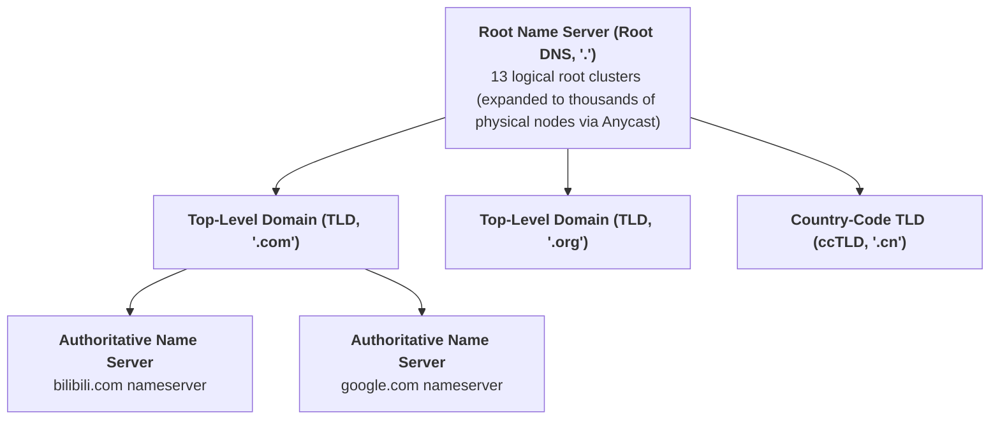
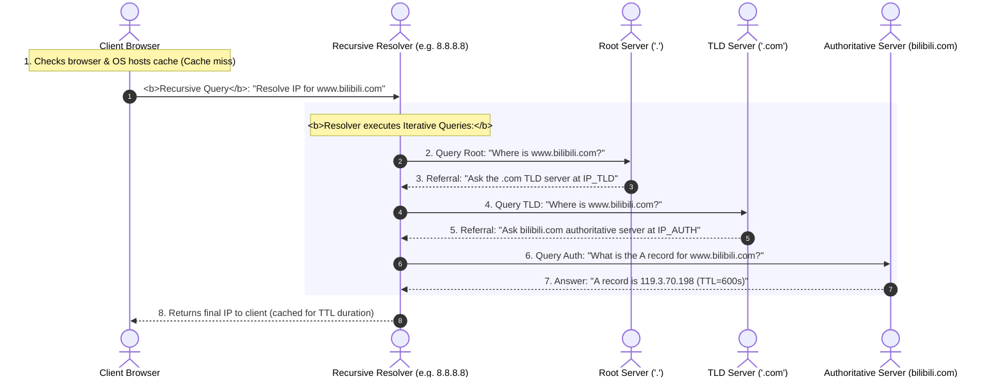

## Introduction: The "Last Mile" from Human Language to Host Processes

In the preceding three chapters, we explored computer networking from physical copper wires and optical fiber links through Layer 2 Ethernet switching, Layer 3 IP subnetting, and enterprise VLAN/NAT infrastructure.

At this point, a computer can route packets to any reachable server across the globe. Yet, real-world networking involves more than simply delivering raw frames between physical machines:
- **Humans do not memorize raw numbers**: Rather than typing `142.250.72.206` into a browser, people type `www.google.com`. How does the network resolve human-readable text into routable IP addresses within milliseconds?
- **Multiplexing across operating system processes**: A single production server concurrently runs an HTTP reverse proxy (Nginx), a relational database (MySQL), and an in-memory cache (Redis). When an IP packet arrives from across the Atlantic, how does the OS kernel route the payload to the intended process?
- **Sustaining high concurrency on a single port**: How can a web server listening on port 80 sustain one million concurrent client sessions without cross-talk?
- **Unreliable UDP vs rigorous TCP**: Why do real-time multiplayer games and live video feeds run over UDP, while financial transactions and web pages demand TCP?

As **Chapter 4 of our masterclass**, this article examines the bridge connecting applications to the transport layer: from the **global Domain Name System (DNS)** to **ports, OS socket abstractions, and 5-tuples**, along with the fundamental differences between **UDP and TCP**.

---

## 1. The Domain Name System (DNS): The Internet's Distributed Directory

The **Domain Name System (DNS)** is a globally distributed, hierarchical database designed to translate human-friendly domain names (e.g., `www.bilibili.com`) into routable IP addresses (e.g., `119.3.70.198`).

### 1.1 The Hierarchical Inverted Tree Architecture



1. **Root Name Servers**:
   Represented by the trailing dot `.` (e.g., `www.google.com.`). Globally, there are **13 logical root server clusters** (named A through M). Using **Anycast routing**, these 13 IP addresses are advertised across thousands of physical server nodes worldwide, providing DDoS resilience;
2. **Top-Level Domain (TLD) Servers**:
   Manage generic top-level domains (e.g., `.com`, `.net`, `.org`) and country-code top-level domains (e.g., `.cn`, `.uk`, `.jp`);
3. **Authoritative Name Servers**:
   Hold the definitive DNS records for a specific domain. The domain owner configures host records (A, AAAA, CNAME) directly on these servers.

### 1.2 Resolving a Domain: Recursive vs Iterative Queries



- **Recursive Query**: The client makes a single request to a recursive resolver (such as an ISP resolver or public DNS like `8.8.8.8`), delegating the end-to-end resolution process;
- **Iterative Query**: The recursive resolver queries each tier in sequence (Root $\to$ TLD $\to$ Authoritative), following referrals until it receives an authoritative answer.

---

## 2. Ports and Operating System Sockets

An IP address routes packets to a destination host. But once the packet arrives, **how does the operating system determine which running application should receive it?**

### 2.1 Ports: Process-Level Addressing

The transport layer introduces **Port Numbers** to multiplex multiple application streams across a single network interface:
- A port is an **unsigned 16-bit integer (2 bytes)**, ranging from **$0$ to $65535$**;
- **Well-Known Ports (0 to 1023)**: Reserved for privileged core services (HTTP: 80, HTTPS: 443, SSH: 22, DNS: 53);
- **Registered Ports (1024 to 49151)**: Assigned to common applications (MySQL: 3306, Redis: 6379, Kafka: 9092);
- **Dynamic / Ephemeral Ports (49152 to 65535)**: Allocated dynamically by the client OS as source ports for outbound sessions.

### 2.2 The Socket Abstraction and the 5-Tuple

In Linux systems, following the principle that "everything is a file," **a Socket is an operating system file descriptor (FD) representing a network communication endpoint**.

Any network connection is uniquely identified inside the kernel by its **5-Tuple**:

$$\text{Connection ID} = \{\text{Source IP, Source Port, Dest IP, Dest Port, Transport Protocol}\}$$

```
+---------------------------------------------------------------------------------+
| Linux Kernel TCP Established Connection Hash Table (eHash):                     |
| Key: Hash(SrcIP, SrcPort, DstIP, DstPort, Protocol)  --->  Value: struct sock * |
+---------------------------------------------------------------------------------+
```

#### How Can Port 80 Sustain One Million Concurrent Connections?
A common misconception is that a server is limited to 65,535 connections because port numbers cap at 65,535.
**This is incorrect:**
- The server binds locally to port 80 on a static IP;
- Incoming connections originate from diverse client IP addresses and client ephemeral ports;
- As long as **any single element of the 5-tuple differs**, the kernel hash table maps the incoming packet to a distinct `struct sock` instance;
- **Actual Scalability Bounds**: Connection capacity is bounded by **file descriptor limits (`nofile`) and system RAM** (each socket buffer consumes roughly 3 KB of memory), not by the 16-bit port number space.

---

## 3. Transport Layer Comparison: UDP vs TCP

At Layer 4, applications typically choose between two primary transport protocols: **message-oriented UDP** or **stream-oriented TCP**.

```
UDP Header Structure (Fixed 8 Bytes):
 0                   1                   2                   3
 0 1 2 3 4 5 6 7 8 9 0 1 2 3 4 5 6 7 8 9 0 1 2 3 4 5 6 7 8 9 0 1
+-+-+-+-+-+-+-+-+-+-+-+-+-+-+-+-+-+-+-+-+-+-+-+-+-+-+-+-+-+-+-+-+
|          Source Port          |       Destination Port        |
+-+-+-+-+-+-+-+-+-+-+-+-+-+-+-+-+-+-+-+-+-+-+-+-+-+-+-+-+-+-+-+-+
|            Length             |           Checksum            |
+-+-+-+-+-+-+-+-+-+-+-+-+-+-+-+-+-+-+-+-+-+-+-+-+-+-+-+-+-+-+-+-+
|                     Application Data Payload                  |
+-+-+-+-+-+-+-+-+-+-+-+-+-+-+-+-+-+-+-+-+-+-+-+-+-+-+-+-+-+-+-+-+
```

```
TCP Header Structure (Fixed 20 Bytes without Options):
 0                   1                   2                   3
 0 1 2 3 4 5 6 7 8 9 0 1 2 3 4 5 6 7 8 9 0 1 2 3 4 5 6 7 8 9 0 1
+-+-+-+-+-+-+-+-+-+-+-+-+-+-+-+-+-+-+-+-+-+-+-+-+-+-+-+-+-+-+-+-+
|          Source Port          |       Destination Port        |
+-+-+-+-+-+-+-+-+-+-+-+-+-+-+-+-+-+-+-+-+-+-+-+-+-+-+-+-+-+-+-+-+
|                        Sequence Number                        |
+-+-+-+-+-+-+-+-+-+-+-+-+-+-+-+-+-+-+-+-+-+-+-+-+-+-+-+-+-+-+-+-+
|                    Acknowledgment Number                      |
+-+-+-+-+-+-+-+-+-+-+-+-+-+-+-+-+-+-+-+-+-+-+-+-+-+-+-+-+-+-+-+-+
|DataOff| Reserved  |C|E|U|A|P|R|S|F|    Window Size            |
+-+-+-+-+-+-+-+-+-+-+-+-+-+-+-+-+-+-+-+-+-+-+-+-+-+-+-+-+-+-+-+-+
|          Checksum             |        Urgent Pointer         |
+-+-+-+-+-+-+-+-+-+-+-+-+-+-+-+-+-+-+-+-+-+-+-+-+-+-+-+-+-+-+-+-+
```

### 3.1 UDP vs TCP Architectural Matrix

| Metric | User Datagram Protocol (UDP) | Transmission Control Protocol (TCP) |
| :--- | :--- | :--- |
| **Connection State** | **Connectionless**: No preliminary handshake; packets are sent immediately | **Connection-Oriented**: Requires a 3-way handshake prior to data exchange |
| **Reliability** | **Best-Effort**: No ordering guarantees, acknowledgments, or automatic retransmits | **Strictly Reliable**: Guarantees in-order delivery, retransmissions, and deduplication |
| **Data Framing** | **Datagram-Oriented**: Preserves application message boundaries per packet | **Byte-Stream Oriented**: Continuous byte stream without message boundaries |
| **Header Overhead** | **8 Bytes**: Minimal protocol overhead | **20 Bytes minimum**: Includes sequence numbers and control flags |
| **Congestion Control** | **None**: Transmits at application-provided line rates | **Built-in**: Uses sliding windows and congestion control algorithms (Cubic, BBR) |
| **Transmission Model** | Unicast, Broadcast, and Multicast supported | Point-to-point unicast only |
| **Primary Use Cases** | DNS lookups, DHCP, real-time gaming, VoIP, video streaming, QUIC | Web (HTTP/HTTPS), email (SMTP), file transfers, databases |

---

## 4. Practical Inspection Commands on Linux

Inspect DNS resolution and socket state on Linux systems:

```bash
# 1. Trace the iterative DNS resolution path (+trace)
dig www.bilibili.com +trace

# 2. Inspect active TCP and UDP listening sockets
ss -tulnp

# 3. View socket allocation statistics across the system
ss -s

# 4. Identify the process and PID bound to a specific port
lsof -i :80
```

---

## 5. Summary and Next Steps

This chapter examined the boundary between applications and the transport layer:
- **DNS** translates human-readable domain names into IP addresses through a distributed hierarchy of Root, TLD, and Authoritative servers;
- **Ports** allow the operating system to demultiplex incoming packets to specific application processes;
- **Sockets and 5-Tuples** allow single server ports to manage millions of concurrent connections;
- **UDP** provides low-latency datagram transmission, while **TCP** delivers reliable, ordered byte streams.

How does TCP deliver reliable, in-order transport over an unreliable IP substrate?
- Why does the **TCP 3-way handshake** require three steps rather than two or four?
- How does the Linux kernel mitigate **SYN Flood attacks** using **SYN Cookies**?
- Why must terminating connections pass through **4-way teardown** and remain in **`TIME_WAIT` for 2MSL**?
- How do **Sliding Windows** manage flow control, and what causes the **40ms latency standoff** between Nagle's algorithm and Delayed ACK?

In Chapter 5 of our masterclass, we examine TCP state transitions in detail: **[Network & Transport Layers in Depth: IP Routing, CIDR, TCP 11-State Machine, and Sliding Window First Principles](/en/articles/network-layer-transport-layer-ip-routing-tcp-state-machine/)**!

---

## Frequently Asked Questions (FAQ)

### Q1: Why does DNS query over UDP port 53 by default, but fall back to TCP port 53 under specific conditions?
**To balance transport efficiency with packet size constraints:**
1. **UDP for Standard Lookups (Low Latency)**: Loading a modern web page triggers dozens of DNS lookups. TCP requires a 3-way handshake (1 RTT) plus teardown, adding latency. UDP's connectionless 8-byte header allows resolution in a single round trip;
2. **When DNS Switches to TCP**:
   - Standard DNS over UDP limits responses to **512 bytes** to prevent IP fragmentation over paths with small MTUs. If a response with multiple IPv6 addresses or DNSSEC signatures exceeds 512 bytes and the client lacks EDNS0, the server sets the `TC` (Truncated) bit in the header. The client then **re-issues the query over TCP port 53** to receive the complete payload;
   - **Zone Transfers (AXFR)**: Secondary DNS servers synchronizing complete zone databases from primary servers require reliable bulk transfer and use TCP port 53 exclusively.

### Q2: Since UDP does not guarantee packet delivery, why do real-time video conferencing (e.g., Zoom) and multiplayer games choose UDP over TCP?
**Because TCP's Head-of-Line (HoL) blocking introduces latency jitter that degrades real-time experiences.**
- **TCP Retransmission Overhead**: TCP enforces strict in-order delivery. If packet 1 is lost while packets 2, 3, and 4 arrive safely, the kernel buffers subsequent packets until packet 1 is retransmitted (often taking hundreds of milliseconds), causing real-time audio or gameplay to stutter;
- **Real-Time Tolerance**: In voice calls, a dropped 20ms audio frame is barely noticeable. However, stalling the call for 500ms to recover that frame disrupts conversation flow. Late frames are obsolete in real-time contexts; applications prefer to drop them and process the latest packet. Real-time media stacks implement framing over UDP (via RTP/RTCP or WebRTC) to manage jitter directly.

### Q3: Why do high-throughput clients running frequent short-lived connections exhaust local ports (`Cannot assign requested address`), and how is this tuned?
**Due to the ephemeral port range limit and sockets lingering in the `TIME_WAIT` state.**
When a client closes short-lived connections, the OS draws source ports from the ephemeral port range (`net.ipv4.ip_local_port_range`, typically 32,768 to 60,999, or ~28,000 ports). Sockets that initiate close remain in `TIME_WAIT` for 60 seconds (2MSL).
If a client initiates 500 short connections per second, $500 \times 60 = 30,000$ sockets accumulate in `TIME_WAIT`, exhausting available ephemeral ports and causing connection attempts to fail with `Cannot assign requested address`.
**Production Tuning**:
1. Use persistent **Connection Pools** to reuse existing sockets rather than opening and closing them repeatedly;
2. Expand the ephemeral port range: `sysctl -w net.ipv4.ip_local_port_range="1024 65535"`;
3. Enable safe port reuse for outbound connections: `sysctl -w net.ipv4.tcp_tw_reuse=1`.
