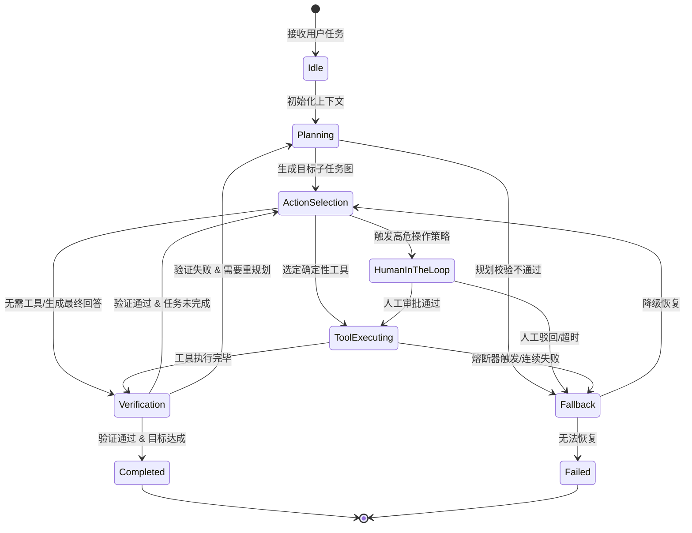

在构建大模型智能体（AI Agent）的过程中，许多开发者最初接触的范式往往非常轻巧：写一段包含工具定义的 System Prompt，交给大模型（LLM）驱动一个 `while (has_tool_call)` 循环，根据模型的输出不断解析工具、执行并回填结果。

在简单的演示 Demo 或单步骤任务中，这种基于 **ReAct（Reasoning + Acting）** 的自由循环运作良好。然而，一旦将这样的系统推向严肃的企业级生产环境——面对数十步复杂的调用链、网络抖动、脏数据与多分支业务逻辑时，未加约束的 ReAct 循环几乎 100% 会遭遇灾难性的崩溃。

核心根因在于：**大语言模型在本质上是基于概率采样的非确定性推理器（Probabilistic Reasoner），而不是强状态约束的确定性控制器（Deterministic Controller）**。如果你将整个系统的控制权、状态流转和重试逻辑完全托付给概率采样，就等于在生产网络中运行着一个随时可能失控的死循环。

本文作为**《AI Agent 生产级架构师手册》**的开篇之作，将系统解构 Agent 执行循环的脆弱根源，并深入探讨如何引入**有限状态机（Finite State Machine, FSM）**与**图控流（Graph-based Control Flow）**，为 AI Agent 注入确定性、可预测性与高弹性的工业级生命力。

---

## 一、自由 ReAct 循环的四大生产致命伤

经典 ReAct 范式将大模型的推理分为三个交替阶段：**思考（Thought）** $\rightarrow$ **行动（Action）** $\rightarrow$ **观察（Observation）**。其伪代码骨架通常如下：

```python
messages = [SystemMessage, UserPrompt]

while not is_done:
    response = llm.chat(messages, tools=tools)
    if response.has_tool_calls():
        for call in response.tool_calls:
            result = execute_tool(call.name, call.args)
            messages.append(ToolMessage(call_id=call.id, content=result))
    else:
        is_done = True
        return response.content
```

这一极简逻辑在实验室中优雅自洽，但在真实的高并发生产运行时，往往会迅速暴露以下四大失效模式：

### 1. 无限工具重试风暴（Infinite Tool Retry Storm）
当外部工具因网络波动、鉴权失效或参数不匹配抛出异常时，LLM 会在 `Thought` 阶段反思：“*参数可能有问题，我再尝试一次*”。然而，如果没有确定性的状态熔断机制，概率采样会导致 LLM 反复生成语义完全相同但格式微调的无效请求。在几十秒内，系统可能空转 20 次工具调用，瞬间耗尽几百美元的 Token 预算，最终被网关超时强制截断。

### 2. 上下文雪崩与注意力稀释（Context Snowball & Attention Dilution）
每一次工具调用的入参、原始返回（经常是长篇 JSON 或大段 HTML）都会直接沉淀在 `messages` 列表中。随着任务步数增加至 15 步以上，Prompt 迅速膨胀至数十万 Token。
正如我们在[《大模型上下文工程实战指南》](/articles/context-engineering-guide/)中所分析的那样，这不仅带来首字延迟（TTFT）的指数级上升，更致命的是触发大模型的**“注意力迷失”（Lost in the Middle）**：模型开始遗忘用户最初的核心约束，推理逻辑产生漂移，甚至开始调用与当前子目标完全不相干的奇葩工具。

### 3. 级联幻觉与脏状态扩散（Cascading Hallucination）
在未分层的循环中，工具执行层缺乏强类型验证。如果某一步工具返回了语义上的弱错误（例如数据库查询返回空列表 `[]` 或非结构化报错文本），模型可能会脑补出看似合理的伪造数据，并将该数据作为下游关键写操作（如发起转账、删除表项）的输入，导致灾难性的不可逆副作用。

### 4. 缺乏确定性回滚与安全逃生通道（Deadlock without Fallback）
在纯代码编写的业务系统中，当流程受阻时，我们拥有明确的事务回滚（Transaction Rollback）与降级兜底逻辑。而在自由 ReAct 循环中，由于没有预先定义的状态迁移规则，Agent 无法在遭遇死胡同时回退至上一个已知安全状态，更无法优雅地将控制权移交给人类专家（Human-in-the-loop），只能在错误轨迹中越陷越深。

---

## 二、从自由循环到确定性图控流：状态机架构设计

破解上述困局的核心思想是**“职责分离（Separation of Concerns）”**：

> **大语言模型（LLM）负责“节点内的计算与意图理解”（Actor），而有限状态机（FSM）负责“跨节点的拓扑流转与合法性约束”（Director）。**

大模型绝不能既当演员又当导演。系统的整体路由图谱必须由工程代码在启动时静态固化，模型只能在状态机分配给它的特定状态节点内行使受限的自由度。

### 1. 生产级 Agent 状态集划分

一个工业级的 Agent 状态机通常被划分为以下核心状态：



### 2. 状态机的核心三要素在 Agent 中的重塑

1. **State Snapshot（状态快照）**：
   与将所有对话消息堆叠在一起不同，生产级状态机维护一个结构化的 `AgentState` 对象。它显式区分：
   - **核心目标（Goal）**：不可被执行过程污染的原始任务指令。
   - **规划树（Plan Tree）**：当前正在执行的步骤索引、已完成步骤及下一步计划。
   - **工作记忆（Working Scratchpad）**：当前步骤所需的临时中间量，步骤结束后即被垃圾回收，避免污染长期上下文。
   - **工具健康计数器（Circuit Status）**：记录当前任务中各个工具的调用频次、失败次数和耗时指标。

2. **Transition Matrix & Guards（迁移矩阵与守卫函数）**：
   任何两个状态之间的跳变都必须经过确定性的 **Guard 断言**。例如：
   - 规则：`ToolExecuting` 绝对不允许直接跳回 `ActionSelection`，必须强制流经 `Verification`。
   - 守卫条件：只有当 `pydantic_schema_check(output) == True` 且 `circuit_breaker.is_open() == False` 时，才允许向下一阶段迁移。

3. **Time-Travel & Checkpointing（时间旅行与检查点）**：
   状态机的每次跳变都是不可变事件（Event-Driven）。状态机引擎将当前 `state_dict` 序列化并落地至持久化介质（如 SQLite / Redis / PostgreSQL）。这样设计带来两个决定性的生产收益：
   - **真正的 Human-in-the-loop**：当遇到高风险操作挂起等待人工确认时，Worker 进程可以安全退出并释放显存与内存；待人工通过 Webhook 点击批准后，根据 `thread_id` 和 `checkpoint_id` 反序列化瞬间恢复现场。
   - **可重放的调试溯源**：如果 Agent 在第 7 步由于数据异常崩溃，开发者可以回退到第 6 步的快照，调整引导参数进行分叉重试，彻底摆脱“黑盒排查”的痛苦。关于可观测性深入实践，可参阅后续的[《Agent 可观测性与调试》](/articles/agent-observability-debugging/)。

---

## 三、Tool Calling 容错与熔断器（Circuit Breaker）机制

在确定性控制流中，工具调用不再是简单的 `try...except`，而是一套立体的防御工程体系。

```
                   ┌───────────────────────────────────────────────┐
                   │               LLM Tool Call                   │
                   └───────────────────────┬───────────────────────┘
                                           ▼
                   ┌───────────────────────────────────────────────┐
                   │  Layer 1: Deterministic Schema Validation    │
                   │  (Pydantic V2 / JSON Schema 静态校验拦截)       │
                   └───────┬───────────────────────────────┬───────┘
                           │ 合法                          │ 格式非法
                           ▼                               ▼
      ┌────────────────────────────────────┐     ┌─────────────────┐
      │  Layer 2: Circuit Breaker Inspection│     │ Inject Schema   │
      │  (检查当前 Tool 是否处于熔断拦截状态) │     │ Error Hint      │
      └───────┬────────────────────┬───────┘     └────────┬────────┘
              │ 正常 (Closed)       │ 熔断 (Open)          │ (返回自愈)
              ▼                    ▼                      ▼
      ┌───────────────┐    ┌─────────────────┐   ┌─────────────────┐
      │ Execute Tool  │    │ Route to        │   │ Retry in Current│
      │ Real API Call │    │ Fallback Tool   │   │ Node (Max 2)    │
      └───────┬───────┘    └─────────────────┘   └─────────────────┘
              │ 异常
              ▼
      ┌────────────────────────────────────┐
      │ Increment Failure Counter          │
      │ If failures >= 3 -> Open Circuit   │
      └────────────────────────────────────┘
```

### 1. 严格 Schema 拦截与自愈重试（Self-Correction）
大模型在调用工具时经常犯一些低级语法错误：把时间戳传成了字符串、缺少必填字段、或者给数字字段传入了带逗号的格式。
如果把这类错误直接传给真实的后端 API，不仅徒增后端压力，还会得到五花八门的业务错误码，反向误导 LLM。

**正确的防御姿势**：
在真实 API 之前部署第一道静态校验网关。若解析失败，**直接在 Runtime 层截断**，由运行时自动生成清晰的结构化反馈（如：`"Field 'timeout_seconds' must be an integer, but got '5s'. Please correct this argument."`），并将此反馈重新交还给决策节点。此时不必重新发起全局 ReAct 循环，仅在本地决策节点内限制最多进行 2 次参数修复。

### 2. 工具熔断器状态转换（Stateful Circuit Breaker）
当某个底层工具因第三方宕机或网络中断连续失败时，必须切断调用：
- **Closed（闭合 / 正常）**：失败计数为 0，允许工具调用通行。
- **Open（开启 / 熔断）**：连续调用失败达到阈值（如连续 3 次），立刻熔断。在此状态下，该工具的后续调用请求将被运行时直接拒绝，状态机自动路由至备用降级方案（如从“实时 SQL 执行”降级为“读取只读副本”，或从“实时爬虫”降级为“读取离线缓存”）。
- **Half-Open（半开 / 试探）**：经过冷却时间窗口后，允许放行单次探测流量。若成功则恢复 Closed 状态，若仍失败则重置冷却时间保持 Open。

---

## 四、生产级实战：构建带熔断与自愈机制的状态机引擎

接下来，我们脱离庞大臃肿的高层框架黑盒，使用 **纯 Python 3.11+ 标准库与 Pydantic V2**，手把手实现一个确定性 Agent 状态机引擎。代码结构清晰、具备零逃逸的熔断保护与完备的日志流转。

```python
"""
deterministic_agent_fsm.py
工业级确定性 Agent 状态机引擎（包含熔断器、严格参数校验与状态隔离）
"""

import json
import logging
from enum import Enum
from typing import Any, Callable, Dict, List, Optional
from pydantic import BaseModel, Field, ValidationError

logging.basicConfig(level=logging.INFO, format="%(asctime)s [%(levelname)s] %(message)s")
logger = logging.getLogger("AgentFSM")


# ==========================================================
# 1. 核心状态与数据模型定义
# ==========================================================

class NodeState(str, Enum):
    IDLE = "IDLE"
    PLANNING = "PLANNING"
    ACTION_SELECT = "ACTION_SELECT"
    TOOL_EXECUTION = "TOOL_EXECUTION"
    VERIFICATION = "VERIFICATION"
    FALLBACK = "FALLBACK"
    TERMINAL_SUCCESS = "TERMINAL_SUCCESS"
    TERMINAL_FAILED = "TERMINAL_FAILED"


class SearchDatabaseArgs(BaseModel):
    query: str = Field(..., min_length=2, description="搜索关键词")
    limit: int = Field(default=5, ge=1, le=50, description="最大返回条数，1-50之间")


class ToolResult(BaseModel):
    success: bool
    data: Optional[Any] = None
    error_message: Optional[str] = None


class AgentMemory(BaseModel):
    user_goal: str
    current_step: int = 0
    max_steps: int = 10
    scratchpad: List[Dict[str, Any]] = Field(default_factory=list)
    final_output: Optional[str] = None
    circuit_failures: Dict[str, int] = Field(default_factory=dict)
    circuit_max_failures: int = 3


# ==========================================================
# 2. 模拟真实环境与熔断工具
# ==========================================================

class ExternalServiceSimulator:
    """模拟外部数据库或 API，可注入故障以验证熔断逻辑"""
    def __init__(self, failure_trigger_count: int = 3):
        self.call_count = 0
        self.failure_trigger_count = failure_trigger_count

    def search_database(self, query: str, limit: int) -> Dict[str, Any]:
        self.call_count += 1
        # 模拟外部服务前 3 次持续故障，触发熔断
        if self.call_count <= self.failure_trigger_count:
            raise ConnectionError(f"Database cluster connection timeout (Attempt {self.call_count})")
        return {"status": "ok", "items": [f"Result #{i} for '{query}'" for i in range(1, limit + 1)]}


# ==========================================================
# 3. 确定性有限状态机执行引擎
# ==========================================================

class DeterministicAgentFSM:
    def __init__(self, user_goal: str, db_service: ExternalServiceSimulator):
        self.memory = AgentMemory(user_goal=user_goal)
        self.db_service = db_service
        self.current_state = NodeState.IDLE
        self.history: List[str] = []

    def transition_to(self, next_state: NodeState, reason: str = ""):
        log_msg = f"Transition: [{self.current_state.value}] -> [{next_state.value}]"
        if reason:
            log_msg += f" (Reason: {reason})"
        logger.info(log_msg)
        self.history.append(f"{self.current_state.value} -> {next_state.value}")
        self.current_state = next_state

    def is_circuit_open(self, tool_name: str) -> bool:
        failures = self.memory.circuit_failures.get(tool_name, 0)
        return failures >= self.memory.circuit_max_failures

    def record_tool_failure(self, tool_name: str):
        self.memory.circuit_failures[tool_name] = self.memory.circuit_failures.get(tool_name, 0) + 1
        logger.warning(f"Tool [{tool_name}] failure count: {self.memory.circuit_failures[tool_name]}/{self.memory.circuit_max_failures}")

    def reset_tool_failure(self, tool_name: str):
        if tool_name in self.memory.circuit_failures:
            self.memory.circuit_failures[tool_name] = 0

    # ---------------- 节点执行逻辑 ----------------

    def step_idle(self):
        logger.info(f"Received goal: '{self.memory.user_goal}'")
        self.transition_to(NodeState.PLANNING, "Goal initialized")

    def step_planning(self):
        # 模拟基于任务目标进行确定性分解规划
        self.memory.current_step += 1
        logger.info("Decomposing goal into verifiable steps...")
        # 确定需要检索目标库
        self.transition_to(NodeState.ACTION_SELECT, "Plan ready")

    def step_action_select(self):
        self.memory.current_step += 1
        if self.memory.current_step > self.memory.max_steps:
            self.transition_to(NodeState.FALLBACK, "Step limit exceeded")
            return

        # 检查工具是否已被熔断
        if self.is_circuit_open("search_database"):
            logger.error("Circuit breaker is OPEN for 'search_database'. Denying execution.")
            self.transition_to(NodeState.FALLBACK, "Tool circuit breaker open")
            return

        # 假装大模型做出了工具调用决策，输入了待校验参数
        mock_model_raw_args = {"query": "production_incident_report", "limit": 3}
        
        # Layer 1: 严格 Pydantic 校验拦截
        try:
            validated_args = SearchDatabaseArgs(**mock_model_raw_args)
            # 暂存工作记忆
            self.memory.scratchpad.append({
                "action": "search_database",
                "args": validated_args.model_dump()
            })
            self.transition_to(NodeState.TOOL_EXECUTION, "Schema validation passed")
        except ValidationError as e:
            logger.error(f"Schema validation rejected: {e.errors()}")
            # 本地自愈或直接拒绝
            self.transition_to(NodeState.PLANNING, "Schema repair requested")

    def step_tool_execution(self):
        last_action = self.memory.scratchpad[-1]
        tool_name = last_action["action"]
        args = last_action["args"]

        logger.info(f"Executing tool '{tool_name}' with args: {args}")
        try:
            # 实际调用外部服务
            raw_response = self.db_service.search_database(args["query"], args["limit"])
            self.reset_tool_failure(tool_name)
            last_action["result"] = ToolResult(success=True, data=raw_response)
            self.transition_to(NodeState.VERIFICATION, "Tool executed successfully")
        except Exception as err:
            logger.error(f"Execution failure: {err}")
            self.record_tool_failure(tool_name)
            last_action["result"] = ToolResult(success=False, error_message=str(err))
            
            # 检查是否刚触发了熔断
            if self.is_circuit_open(tool_name):
                self.transition_to(NodeState.FALLBACK, f"Tool [{tool_name}] reached max failure threshold")
            else:
                self.transition_to(NodeState.ACTION_SELECT, "Retry with remaining budget")

    def step_verification(self):
        # 验证节点：对工具输出进行后置契约校验
        last_action = self.memory.scratchpad[-1]
        result: ToolResult = last_action.get("result")

        if result and result.success:
            logger.info("Verification passed: Tool returned structured data.")
            self.memory.final_output = f"Successfully fetched {len(result.data['items'])} items."
            self.transition_to(NodeState.TERMINAL_SUCCESS, "Goal completed")
        else:
            logger.warning("Verification failed: Data incomplete or invalid.")
            self.transition_to(NodeState.PLANNING, "Re-planning required")

    def step_fallback(self):
        logger.info("Entered FALLBACK node. Activating degradation protocol...")
        # 降级逻辑：例如从本地离线冷备份读取数据，或向管理员通知人工介入
        self.memory.final_output = "System gracefully degraded: Returning cached incident summaries."
        self.transition_to(NodeState.TERMINAL_SUCCESS, "Recovered via Fallback degradation")

    # ---------------- 状态机主循环调度 ----------------

    def run(self) -> str:
        handlers: Dict[NodeState, Callable[[], None]] = {
            NodeState.IDLE: self.step_idle,
            NodeState.PLANNING: self.step_planning,
            NodeState.ACTION_SELECT: self.step_action_select,
            NodeState.TOOL_EXECUTION: self.step_tool_execution,
            NodeState.VERIFICATION: self.step_verification,
            NodeState.FALLBACK: self.step_fallback,
        }

        while self.current_state not in (NodeState.TERMINAL_SUCCESS, NodeState.TERMINAL_FAILED):
            handler = handlers.get(self.current_state)
            if not handler:
                raise RuntimeError(f"Unhandled FSM state: {self.current_state}")
            handler()

        logger.info(f"FSM Terminated at [{self.current_state.value}]. Final Output: {self.memory.final_output}")
        return self.memory.final_output


# ==========================================================
# 4. 运行验证：测试在持续故障下的状态机确定性熔断
# ==========================================================

if __name__ == "__main__":
    print("\n--- [测试场景 1: 模拟服务持续失败触发熔断与优雅降级] ---")
    failing_service = ExternalServiceSimulator(failure_trigger_count=3)
    agent = DeterministicAgentFSM(
        user_goal="查询最新的生产故障诊断报告",
        db_service=failing_service
    )
    result = agent.run()
    
    print("\n--- 状态迁移全链路轨迹 ---")
    for idx, transition in enumerate(agent.history, 1):
        print(f"Step {idx:02d}: {transition}")
```

### 运行该状态机输出的关键日志轨迹

当运行上述脚本时，控制台将输出如下极其规整、确定且绝对可控的状态流转：

```text
2026-09-20 10:15:01 [INFO] Received goal: '查询最新的生产故障诊断报告'
2026-09-20 10:15:01 [INFO] Transition: [IDLE] -> [PLANNING] (Reason: Goal initialized)
2026-09-20 10:15:01 [INFO] Decomposing goal into verifiable steps...
2026-09-20 10:15:01 [INFO] Transition: [PLANNING] -> [ACTION_SELECT] (Reason: Plan ready)
2026-09-20 10:15:01 [INFO] Transition: [ACTION_SELECT] -> [TOOL_EXECUTION] (Reason: Schema validation passed)
2026-09-20 10:15:01 [INFO] Executing tool 'search_database' with args: {'query': 'production_incident_report', 'limit': 3}
2026-09-20 10:15:01 [ERROR] Execution failure: Database cluster connection timeout (Attempt 1)
2026-09-20 10:15:01 [WARNING] Tool [search_database] failure count: 1/3
2026-09-20 10:15:01 [INFO] Transition: [TOOL_EXECUTION] -> [ACTION_SELECT] (Reason: Retry with remaining budget)
2026-09-20 10:15:01 [INFO] Transition: [ACTION_SELECT] -> [TOOL_EXECUTION] (Reason: Schema validation passed)
2026-09-20 10:15:01 [ERROR] Execution failure: Database cluster connection timeout (Attempt 2)
2026-09-20 10:15:01 [WARNING] Tool [search_database] failure count: 2/3
2026-09-20 10:15:01 [INFO] Transition: [TOOL_EXECUTION] -> [ACTION_SELECT] (Reason: Retry with remaining budget)
2026-09-20 10:15:01 [INFO] Transition: [ACTION_SELECT] -> [TOOL_EXECUTION] (Reason: Schema validation passed)
2026-09-20 10:15:01 [ERROR] Execution failure: Database cluster connection timeout (Attempt 3)
2026-09-20 10:15:01 [WARNING] Tool [search_database] failure count: 3/3
2026-09-20 10:15:01 [INFO] Transition: [TOOL_EXECUTION] -> [FALLBACK] (Reason: Tool [search_database] reached max failure threshold)
2026-09-20 10:15:01 [INFO] Entered FALLBACK node. Activating degradation protocol...
2026-09-20 10:15:01 [INFO] Transition: [FALLBACK] -> [TERMINAL_SUCCESS] (Reason: Recovered via Fallback degradation)
```

**对比可见**：在传统的自由 ReAct 循环中，由于没有熔断器和状态转移矩阵，大模型在遭遇第三次超时后很可能继续循环第 4 次、第 5 次，直至触发 Gateway Timeout。而状态机引擎在底层断路器开启的毫秒级时间内，**硬性截断了无效调用**，将控制权无缝移交至 `FALLBACK` 节点，输出了具备业务弹性的保底结果。

---

## 五、状态存储与短期/长期记忆隔离设计

很多 Agent 在运行到长程任务时，开发者习惯于把每一次工具的输入和输出一股脑追加到同一个上下文列表中。这种做法在状态机设计中是大忌。

### 1. 双层上下文隔离架构

为了保证 Agent 在执行 50 步以上任务时依然敏捷，必须在状态机层面建立**分层上下文管理**：

| 上下文层级 | 存储内容 | 生命周期 | 目标模型窗口 |
| :--- | :--- | :--- | :--- |
| **短期工作记忆 (Scratchpad)** | 当前状态节点内的工具输入、原始输出、临时计算结果 | 仅在当前节点及其下游验证节点存活，离开节点即被压缩或销毁 | 仅注入当前单次 LLM 推理请求 |
| **任务状态快照 (Checkpointer)** | 当前规划树（Plan）、各子任务完成状态（Done/Todo）、结构化关键实体字典 | 任务全生命周期持久化（写入 SQLite / Redis） | 仅在需要重规划（Re-planning）时格式化为摘要注入 |
| **长期情节记忆 (Episodic Memory)** | 跨任务经验、用户核心画像、已成功沉淀的全局知识库 | 跨会话永久持久化（写入向量库 / 图数据库） | 通过语义检索检索少量 Top-K 项注入 |

关于长期会话与检索增强的落地细节，可以参考我们的实战篇[《企业级 RAG 生产实践指南》](/articles/rag-in-practice/)。

---

## 六、《AI Agent 生产级架构师手册》导读与路线规划

状态机控制流是构筑高可靠生产 Agent 的**第一块基石**。只有锁死了确定性控制骨架，大模型的高阶推理与工具调用能力才能真正发挥工业级威力。

本专栏后续章节将沿着工业级智能体落地演进的全流程展开，读者可按照以下技术脉络深入研读：

1. **[第 1 篇（本文）· Agent 执行循环与状态机设计：从 ReAct 到确定性控制流](/articles/agent-loop-state-machine/)**  
   *确立状态机、拓扑迁移与熔断降级的控制流基石。*
2. **[第 2 篇 · 从零搭建 AI Agent 应用：ReAct 循环与架构设计](/articles/build-ai-agent/)**  
   *以单测驱动的工程模式，从零编码实现自主 Agent 核心组件与基础工具调度。*
3. **[第 3 篇 · 做 AI Agent 的 7 条运行时实践](/articles/agent-runtime-practices/)**  
   *深入企业级 Runtime 深水区，解析超时防抖、并发隔离与生产容错经验。*
4. **[第 4 篇 · MCP 协议深度解析：AI 的「USB-C 接口」](/articles/mcp-guide/)**  
   *解构 Anthropic 提出的 Model Context Protocol，掌握工业级自研 MCP Server 与标准化工具治理。*
5. **[第 5 篇 · Skills 深度解析：给 AI 编程助手装上「专业大脑」](/articles/skills-guide/)**  
   *探索渐进式上下文加载机制与 Coding Agent 插件规范，实现高阶能力即插即用。*
6. **[第 6 篇 · 突破 10 万 Star 的 Browser-use 架构深度剖析：DOM 树提纯与视觉定位](/articles/browser-use-agent-architecture/)**  
   *从纯 API 调用跨越至 GUI 自动化，剖析视觉 Grounding 与极度精简 DOM 树的网页 Agent 架构。*
7. **[第 7 篇 · 让模型在运行中进化：从基础反思到基于 MCTS 的 Test-Time Compute 搜索](/articles/agent-reflection-self-correction/)**  
   *解构 Reflexion、自我纠错与 Monte Carlo Tree Search 在推理时计算扩展中的实战结合。*
8. **[第 8 篇 · 2026 AI 开发范式：对抗复合误差的分布式 Agent 编排与量化 Evals 体系](/articles/agent-orchestration-evals/)**  
   *从单 Agent 走向多智能体团队协作，剖析 LangGraph、Swarm 与生产级可靠性基准评测。*
9. **[第 9 篇 · Agent 可观测性与调试：从黑盒到白盒的进阶之路](/articles/agent-observability-debugging/)**  
   *引入 OpenTelemetry、LangSmith 与 Langfuse，建立全链路 Trajectory 评估与执行回放。*
10. **[第 10 篇 · 环境缩放 (Environment Scaling) 如何重塑自主 Agent：沙箱博弈与强化学习](/articles/environment-scaling-agent-guide/)**  
    *进阶探索后训练时代的环境交互扩展，掌握零逃逸安全容器沙箱与自主探索智能体。*

---

## 常见问题 (FAQ)

### Q1: 既然大模型已经具备强大的自主推理能力，为什么不在 Agent 中直接使用全自主动态循环（Autonomous Loop），而要用状态机强制限制状态流转？
大模型的“自主推理”本质上是概率分布上的最大后验生成，在数学上无法提供**确定性安全性保证（Deterministic Safety Guarantees）**。在真实工业界场景中，一个任务往往涉及跨外部系统的状态修改（如扣款、发信、配置写入）。如果允许模型全自主决定下一步动作，在不可预知的网络抖动、边界数据或对抗性 Prompt 注入下，模型可能在单点反复震荡、跳过关键审批节点，或调用灾难性的高危指令。有限状态机（FSM）将业务的“硬红线”编码为代码级别的不可跨越边（Immutable Edges），让模型在安全沙箱内发挥灵活推理，两者结合才是兼具灵活性与企业安全合规的唯一解法。

### Q2: 在复杂长任务中，状态机每次迁移如何处理不断膨胀的执行历史，以避免触发上下文窗口溢出与注意力衰减？
核心是实行**“短期工作记忆与长期状态快照的严格分离”**。在状态机中，节点执行产生的大段原始数据（如 100KB 的数据库查询响应或网页 HTML）只临时存在于当前节点的 Scratchpad 中。在进入 `Verification` 验证节点后，由轻量模型或确定性代码将结果精炼为结构化摘要或关键事实字典，并存入 Checkpointer。原始的冗长日志则写入离线可观测性系统（如 Langfuse / ElasticSearch），绝对不作为全量 Prompt 带入后续节点，从而将核心模型的上下文消耗始终控制在恒定的轻量级区间。

### Q3: 生产级 Agent 状态机如何设计 Human-in-the-loop（人机协同中断），在等待人工审批期间如何保证状态不丢失且不阻塞进程？
基于**“持久化检查点（Persistent Checkpoint）+ 异步事件驱动”**设计。当状态机路由至 `HumanInTheLoop` 节点时，引擎将当前的 `AgentState` 进行 JSON 序列化并写入持久化数据库（如 PostgreSQL / Redis），记录对应的 `session_id` 与 `checkpoint_id`，随后立即将 Worker 线程/协程释放回进程池，避免产生挂起阻塞。系统向管理员端（如企业微信、Slack 或内部审批系统）推送带回调 Webhook 的审批卡片。当人工点击“批准”或“驳回”时，Webhook 接收服务根据 `checkpoint_id` 反序列化取出完整的状态快照，在空闲的 Worker 上直接恢复现场并向下一状态推进，兼具资源利用率与百分之百的状态一致性。
