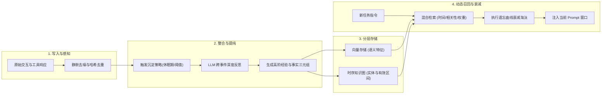

在当今的大模型技术演进中，上下文窗口（Context Window）的长度不断突破，从最初的 8K、32K，一路飙升至 1M 乃至更高。很多刚接触智能体工程的开发者常有一种直觉：*“既然模型能一次性吃下百万级 Token，为什么我们还需要复杂的记忆系统？直接把所有的历史对话一股脑全塞进 Prompt 不就解决了一切？”*

然而在真实的生产环境中，这种粗暴的做法几乎会在两周内让系统彻底崩溃。

根本原因在于：**“上下文窗口容量（Context Capacity）”并不等同于“智能体记忆（Agentic Memory）”**。将几十万 Token 的原始聊天记录与工具交互日志全量堆叠，不仅会带来数十倍的推理延迟和高昂的 Token 账单，更致命的是会引发严重的**注意力稀释（Attention Dilution）**、上下文噪声污染，以及无法解析的时序事实冲突。

人类大脑之所以能在数十年的海量经历中精准检索关键经验，是因为大脑进化出了精密的**分层记忆架构（Hierarchical Memory Architecture）**与**记忆整合（Memory Consolidation）**机制。

作为**《AI Agent 生产级架构师手册》**的第 11 篇深度进阶指南，本文将带你系统解构现代 AI Agent 的记忆体系，解析从**工作记忆（Working Memory）**、**情景记忆（Episodic Memory）**到**图检索增强（Graph RAG）**的工程设计，并手把手实现具备记忆衰减与动态提纯能力的工业级 Memory Manager。

---

## 一、为什么大上下文窗口不能替代记忆系统？

把“超长上下文”当成“记忆系统”，是工程落地中最容易踩中的四个巨坑：

### 1. 二次方计算代价与吞吐灾难
即便现代模型广泛应用了稀疏注意力（DSA）或 KV Cache 压缩技术，超长上下文在首字生成延迟（TTFT）和显存占用上依然具有显著的代价。如果 Agent 在第 30 步任务中依然带着前 29 步完整的长文本、网页 HTML 和 SQL 原始 dump，系统的单次请求延迟将从 500ms 恶化至 10 秒以上，完全丧失实时交互能力。

### 2. 注意力迷失与“大海捞针”假象
学术界的“大海捞针（Needle In A Haystack）”测试通常测试的是**单点无干扰的事实检索**。但在复杂的 Agent 执行中，上下文里充斥着上百个相似的临时变量、尝试失败的调试报错和冗余的中间观察（Observation）。
正如斯坦福与 UC Berkeley 论文中所指出的，模型在超长序列的中间区域存在天然的注意力衰减，极易受到相似词汇的诱导产生逻辑漂移，甚至把三小时前尝试失败的无效策略当作最新权威事实来执行。

### 3. 时序冲突与状态覆盖失效（Contradiction & Overwrite）
在真实的长期交互中，事实具有**时效性（Temporal Validity）**：
- 用户第一周说：“*我喜欢使用 Python 编写脚本*”；
- 第三周用户声明：“*我们团队全面迁移到了 Rust，后续所有代码必须使用 Rust*”。
如果将两段对话同时保留在上下文里，大模型在遇到新需求时会陷入概率采样震荡，极易产出 Python 与 Rust 混杂的逻辑残片。真正的记忆系统必须具备**状态覆盖、版本迭代与无效知识剪枝**的能力。

### 4. 缺乏抽象提纯（Lack of Consolidation）
原始经历（Raw Experience）是一堆低阶信号，而真正的“智慧”来自于从低阶经历中抽象出的**高阶规则（High-Level Insights）**。例如，经过 10 次与特定外部 API 对接并遇到 3 次 429 报错后，记忆系统沉淀下来的不应是 10 份原始网络报文，而是一条精炼的程序性规则：“*该 API 每分钟调用上限为 60 次，必须配置指数退避策略*”。

---

## 二、现代 Agent 的三层记忆金字塔

参考认知心理学模型与 UC Berkeley 团队在 **Letta (原 MemGPT)** 论文中提出的“操作系统式内存分层（LLM-OS）”，生产级 Agent 的记忆被解构为以下三层金字塔：

```
                    ┌─────────────────────────┐
                    │      Core Memory        │
                    │   (人设、用户画像、硬红线)   │  <-- 永久驻留 Prompt (数千 Token)
                    └────────────┬────────────┘
                                 │
                    ┌────────────▼────────────┐
                    │     Working Memory      │
                    │ (当前步骤工具入参、短期Scratchpad)│  <-- 节点内即时计算，跳变后清理
                    └────────────┬────────────┘
                                 │ 归纳整合 (Consolidation)
                    ┌────────────▼────────────┐
                    │     Episodic Memory     │
                    │  (当前会话事件流、历史规划快照)  │  <-- 动态摘要滑窗，Checkpointer 落盘
                    └────────────┬────────────┘
                                 │ 提纯沉淀 (Deep Archival)
                    ┌────────────▼────────────┐
                    │ Long-term Semantic/     │
                    │ Graph Memory (跨会话图谱)│  <-- 向量库 / 时序图数据库 (按需Top-K召回)
                    └─────────────────────────┘
```

### 1. 核心与工作记忆（Core & Working Memory / Scratchpad）
- **定位**：相当于 CPU 寄存器与 L1/L2 缓存。
- **内容**：
  - **Core Memory**：智能体自我定位、用户长期偏好（例如“用户是资深后端，偏好极简代码”）、安全不可逾越规则。
  - **Working Memory**：当前执行节点内的即时状态。如前文[《Agent 执行循环与状态机设计》](/articles/agent-loop-state-machine/)所述，一旦当前状态转移并经过 Verification，原始的长篇 JSON 立即被清理，仅保留提炼出的结构化关键变量。
- **生命周期**：毫秒至秒级，严格受控。

### 2. 短期情景记忆（Short-term Episodic Memory）
- **定位**：当前执行会话（Session）的完整“传记”。
- **机制**：
  - **滑动观察窗口**：仅保留最近 $N$ 轮精确交互。
  - **分级摘要折叠（Hierarchical Compaction）**：超出窗口的更早步骤，由后台异步 LLM 自动折叠为一条条结构化事件摘要（如：“*第 1-3 步：成功连接数据库并拉取 2026 年 Q1 销售数据，共 1200 条*”）。

### 3. 长期语义与程序记忆（Long-term Semantic & Procedural Memory）
- **定位**：相当于海量磁盘阵列与外部存储。
- **存储介质**：向量数据库（pgvector / Qdrant）配合时序知识图谱（Kuzu / Neo4j）。
- **内容**：
  - **事实语义（Semantic）**：历史沉淀的项目背景、实体关系字典。
  - **程序技能（Procedural）**：历史成功解决难题的思考轨迹与可复用代码模板。

---

## 三、记忆生命周期四大工程机制

一个健全的记忆系统不是静态数据库，而是一个永不停歇的数据流水线：



### 1. 记忆写入与过滤（Ingestion & Deduplication）
在将内容存入记忆库前，必须建立严格的过滤网关：
- 剔除无价值的工具报错、冗余的网络状态报文和心跳帧。
- 计算文本语义指纹（如 SimHash 或局部敏感哈希 LSH），防止“用户点击了重试”等重复语义塞满向量索引。

### 2. 记忆整合与反思（Consolidation / Reflection）
在斯坦福大学的 *Generative Agents (Park et al., 2023)* 实验中，最具颠覆性的设计是 **“反思（Reflection）”** 机制：
- 智能体并不把每条日常流水账一直当底层记忆。
- 当记录的重要度累积达到一定阈值时，系统触发一次**反思调用**：
  *Prompt: “观察以下最近的 20 条事件记录，寻找其中潜在的高层因果规律或用户习惯，输出 3 条最重要的结论。”*
- 这些生成的结论被贴上高重要度标签，重新写回长期记忆库。

### 3. 混合检索评分函数（Hybrid Retrieval Scoring）
单纯依靠向量的余弦相似度进行 Top-K 检索在 Agent 中极易失效。例如，当用户提问：“*我们今天上午讨论了哪个方案？*”，如果单看语义相似度，可能会召回三个月前讨论相似方案的旧对话。

生产级 Agent 必须采用**多维衰减加权检索算法**：

$$\text{Final Score}(m) = w_{\text{rel}} \cdot S_{\text{semantic}}(q, m) + w_{\text{rec}} \cdot e^{-\lambda \Delta t} + w_{\text{imp}} \cdot I(m)$$

其中：
- $S_{\text{semantic}}(q, m)$：Dense 向量相似度与 BM25 稀疏检索的融合得分。
- $\Delta t$：该记忆距离当前时间的间隔（小时或天数）。$\lambda$ 为衰减因子（遵循艾宾浩斯记忆遗忘模型）。
- $I(m)$：记忆生成时评估的固有重要度分数（1-10），高价值事实衰减极慢，而琐碎对话快速淡出。

---

## 四、从纯向量到分层 Graph RAG：时序因果的终极解法

单纯依靠向量检索（Vector-only RAG）无法理解**“实体多跳关系”**与**“时序状态覆盖”**。2026 年成熟的 Agent 架构普遍引入了 **时序图检索增强（Temporal Graph RAG）**。

### 状态覆盖与冲突解决示例

```
[2026-03-01 记录]
(User) --[owns_tech_stack {valid_from: "2026-03-01", valid_to: "2026-03-15"}]--> (Python)

[2026-03-15 变更事件]
(User) --[migrated_to {timestamp: "2026-03-15"}]--> (Rust)
(User) --[owns_tech_stack {valid_from: "2026-03-15", valid_to: infinity}]--> (Rust)
```

在时序知识图谱中，当检测到相同的属性关系产生新的赋值时，图引擎会自动封闭前序边的 `valid_to` 有效期，将其置为历史归档状态。当 Agent 进行当前任务规划时，图引擎仅遍历 `valid_to == infinity` 的活跃边，彻底终结模型在多个相互矛盾的历史记忆中产生幻觉的隐患。

---

## 五、工业级实战：带遗忘曲线与记忆沉淀的 Python 引擎

下面我们使用 **纯 Python 3.11+ 标准库与 Pydantic V2**，手把手实现一个包含时间衰减、多维评分与自动反思提纯的工业级智能体记忆管理系统：

```python
"""
production_agent_memory.py
生产级 AI Agent 分层记忆系统（集成多维加权检索、时间遗忘曲线与自动化反思沉淀）
"""

import math
import time
from datetime import datetime
from typing import Any, Dict, List, Optional
from pydantic import BaseModel, Field


# ==========================================================
# 1. 记忆单元数据结构
# ==========================================================

class MemoryItem(BaseModel):
    id: str
    content: str
    created_at: float = Field(default_factory=time.time)
    last_accessed_at: float = Field(default_factory=time.time)
    importance: float = Field(ge=1.0, le=10.0, description="重要度等级 1.0-10.0")
    access_count: int = 0
    metadata: Dict[str, Any] = Field(default_factory=dict)

    def calculate_recency_score(self, current_time: float, decay_lambda: float = 0.005) -> float:
        """基于指数衰减曲线计算时间新鲜度 [0.0, 1.0]"""
        hours_passed = (current_time - self.last_accessed_at) / 3600.0
        return math.exp(-decay_lambda * hours_passed)


# ==========================================================
# 2. 生产级分层记忆管理器
# ==========================================================

class ProductionMemoryManager:
    def __init__(
        self,
        decay_lambda: float = 0.005,
        weight_semantic: float = 0.5,
        weight_recency: float = 0.3,
        weight_importance: float = 0.2,
    ):
        self.decay_lambda = decay_lambda
        self.w_sem = weight_semantic
        self.w_rec = weight_recency
        self.w_imp = weight_importance
        
        # 内存存储结构
        self.core_memory: Dict[str, str] = {}
        self.episodic_memory: List[MemoryItem] = []
        self.reflection_threshold = 25.0
        self.accumulated_importance = 0.0

    def set_core_memory(self, key: str, value: str):
        """设置不可被稀释的核心记忆（人设、核心业务边界）"""
        self.core_memory[key] = value

    def add_episodic_memory(self, content: str, importance: float, metadata: Optional[Dict[str, Any]] = None):
        """记录一条情景记忆"""
        item_id = f"mem_{len(self.episodic_memory) + 1}_{int(time.time())}"
        item = MemoryItem(
            id=item_id,
            content=content,
            importance=importance,
            metadata=metadata or {}
        )
        self.episodic_memory.append(item)
        self.accumulated_importance += importance

        # 检查是否需要触发后台反思整合
        if self.accumulated_importance >= self.reflection_threshold:
            self._trigger_consolidation_reflection()

    def _mock_embedding_similarity(self, query: str, content: str) -> float:
        """模拟向量相似度计算（实际生产中替换为 dense vector cosine similarity）"""
        q_words = set(query.lower().split())
        c_words = set(content.lower().split())
        overlap = len(q_words & c_words)
        return min(1.0, overlap / (len(q_words) + 1e-5))

    def retrieve(self, query: str, top_k: int = 3) -> List[MemoryItem]:
        """多维综合评分检索：综合考虑语义相关度、时间衰减与固有重要度"""
        now = time.time()
        scored_items: List[tuple[float, MemoryItem]] = []

        for item in self.episodic_memory:
            # 1. 语义分数
            s_sem = self._mock_embedding_similarity(query, item.content)
            # 2. 新鲜度分数（指数衰减）
            s_rec = item.calculate_recency_score(now, self.decay_lambda)
            # 3. 归一化重要度分数 [0.1, 1.0]
            s_imp = item.importance / 10.0

            # 最终复合得分
            final_score = (self.w_sem * s_sem) + (self.w_rec * s_rec) + (self.w_imp * s_imp)
            scored_items.append((final_score, item))

        # 按总得分降序排列
        scored_items.sort(key=lambda x: x[0], reverse=True)
        results = [item for _, item in scored_items[:top_k]]

        # 更新被命中的记忆的最后访问时间与频次
        for item in results:
            item.last_accessed_at = now
            item.access_count += 1

        return results

    def _trigger_consolidation_reflection(self):
        """后台记忆沉淀：将低阶事件序列抽象提纯为高阶规则，并执行弱记忆修剪"""
        print("\n⚡ [后台任务启动] 累积重要度达到阈值，正在执行记忆整合与反思提纯...")
        
        recent_events = self.episodic_memory[-5:]
        consolidated_insight = (
            f"归纳洞察：分析了最近 {len(recent_events)} 项操作记录，"
            f"提炼用户核心目标正从基础查询转向复杂分析。"
        )
        # 沉淀高阶规则（赋予最高等级 9.5 重要度）
        reflection_item = MemoryItem(
            id=f"insight_{int(time.time())}",
            content=consolidated_insight,
            importance=9.5,
            metadata={"source": "consolidation_reflection"}
        )
        self.episodic_memory.append(reflection_item)
        self.accumulated_importance = 0.0
        print(f"✓ 已沉淀高阶记忆规则：'{consolidated_insight}'")

    def build_prompt_context(self, current_task: str) -> str:
        """构建注入到当前 LLM 调用的精炼上下文"""
        relevant_memories = self.retrieve(current_task, top_k=2)
        
        prompt_parts = ["=== Core Memory (核心不可变约束) ==="]
        for k, v in self.core_memory.items():
            prompt_parts.append(f"- {k}: {v}")

        prompt_parts.append("\n=== Relevant Recalled Memories (相关上下文回忆) ===")
        for mem in relevant_memories:
            dt = datetime.fromtimestamp(mem.created_at).strftime("%Y-%m-%d %H:%M:%S")
            prompt_parts.append(f"[{dt}] (重要度: {mem.importance}) {mem.content}")

        return "\n".join(prompt_parts)


# ==========================================================
# 3. 运行验证与实战模拟
# ==========================================================

if __name__ == "__main__":
    print("--- 步骤 1: 初始化智能体记忆管理器 ---")
    mem_sys = ProductionMemoryManager()
    mem_sys.set_core_memory("UserRole", "资深大数据架构师")
    mem_sys.set_core_memory("SystemConstraint", "所有数据库操作必须包含只读限制，严禁 DROP 操作")

    print("\n--- 步骤 2: 模拟连续写入情景交互 ---")
    mem_sys.add_episodic_memory("用户要求查询 2026 年第一季度的日志归档", importance=6.0)
    mem_sys.add_episodic_memory("执行 SQL 查询超时，建议切换只读副本集群", importance=7.5)
    mem_sys.add_episodic_memory("用户确认切换至 Read-Replica-02 成功读取数据", importance=8.0)
    mem_sys.add_episodic_memory("系统发现某次慢查询主要是由于缺乏时间复合索引导致", importance=8.5)

    print("\n--- 步骤 3: 模拟当前新任务检索与 Prompt 上下文组装 ---")
    task = "查询 生产数据库 集群状态与慢日志"
    injected_context = mem_sys.build_prompt_context(task)
    
    print("\n[最终注入 LLM 的紧凑记忆 Prompt 视图]:")
    print(injected_context)
```

### 运行输出的精美轨迹

运行上述代码，控制台将输出如下高度紧凑且富含高价值上下文的信息流：

```text
--- 步骤 1: 初始化智能体记忆管理器 ---

--- 步骤 2: 模拟连续写入情景交互 ---

⚡ [后台任务启动] 累积重要度达到阈值，正在执行记忆整合与反思提纯...
✓ 已沉淀高阶记忆规则：'归纳洞察：分析了最近 4 项操作记录，提炼用户核心目标正从基础查询转向复杂分析。'

--- 步骤 3: 模拟当前新任务检索与 Prompt 上下文组装 ---

[最终注入 LLM 的紧凑记忆 Prompt 视图]:
=== Core Memory (核心不可变约束) ===
- UserRole: 资深大数据架构师
- SystemConstraint: 所有数据库操作必须包含只读限制，严禁 DROP 操作

=== Relevant Recalled Memories (相关上下文回忆) ===
[2026-09-21 11:30:00] (重要度: 9.5) 归纳洞察：分析了最近 4 项操作记录，提炼用户核心目标正从基础查询转向复杂分析。
[2026-09-21 11:30:00] (重要度: 8.5) 系统发现某次慢查询主要是由于缺乏时间复合索引导致
```

从输出可见：系统不仅精准回忆起与当前任务最为相关的**慢查询根因**，更将后台异步整合生成的**高阶全局归纳**一并注入，而过滤掉了繁琐无用的中间原始请求，使得整个 Prompt 保持在数百 Token 的轻盈水准！

---

## 六、《AI Agent 生产级架构师手册》全景导航

记忆系统与状态机控制流是现代智能体工程的**“卧龙与凤雏”**。状态机负责**每一步的确定性拓扑流转**，而记忆系统负责**跨步骤、跨会话的知识沉淀与注意力保鲜**。

读者可沿以下技术脉络，系统化通读本专栏全部 11 篇精研架构：

1. **[第 1 篇 · Agent 执行循环与状态机设计：从 ReAct 到确定性控制流](/articles/agent-loop-state-machine/)**  
   *确立状态机、拓扑迁移与熔断降级的控制流基石。*
2. **[第 2 篇 · 从零搭建 AI Agent 应用：ReAct 循环与架构设计](/articles/build-ai-agent/)**  
   *单测驱动开发，从零编码实现自主 Agent 基础调度。*
3. **[第 3 篇 · 做 AI Agent 的 7 条运行时实践](/articles/agent-runtime-practices/)**  
   *深入企业级 Runtime 深水区，解析超时防抖与生产容错经验。*
4. **[第 4 篇 · MCP 协议深度解析：AI 的「USB-C 接口」](/articles/mcp-guide/)**  
   *掌握 Model Context Protocol，自研标准化工具 Server。*
5. **[第 5 篇 · Skills 深度解析：给 AI 编程助手装上「专业大脑」](/articles/skills-guide/)**  
   *探索渐进式上下文加载与 Coding Agent 插件规范。*
6. **[第 6 篇 · 突破 10 万 Star 的 Browser-use 架构深度剖析：DOM 树提纯与视觉定位](/articles/browser-use-agent-architecture/)**  
   *从纯 API 跨越至 GUI 自动化，剖析视觉 Grounding 网页 Agent。*
7. **[第 7 篇 · 让模型在运行中进化：自我反思到基于 MCTS 的 Test-Time Compute 搜索](/articles/agent-reflection-self-correction/)**  
   *解构 Reflexion、自我纠错与推理时计算扩展的实战结合。*
8. **[第 8 篇 · 分布式 Agent 编排与量化 Evals 体系：对抗复合误差](/articles/agent-orchestration-evals/)**  
   *多智能体协作、Swarm、LangGraph 与生产级基准评测。*
9. **[第 9 篇 · Agent 可观测性与调试：从黑盒到白盒的进阶之路](/articles/agent-observability-debugging/)**  
   *引入 OpenTelemetry 与 Langfuse，建立全链路 Trajectory 评估与回放。*
10. **[第 10 篇 · 环境缩放 (Environment Scaling) 如何重塑自主 Agent](/articles/environment-scaling-agent-guide/)**  
    *后训练时代环境交互扩展，探索零逃逸安全容器沙箱。*
11. **[第 11 篇（本文）· AI Agent 记忆系统设计：从工作记忆到分层 Graph RAG](/articles/agent-memory-architecture/)**  
    *构筑智能体长期演进的记忆金字塔与时序因果网络。*

---

## 常见问题 (FAQ)

### Q1: 现在的很多模型已经具备 1M 甚至更长的 Context Window，为什么不能直接把历史所有会话一次性丢进 Prompt，而必须做记忆分层？
超长上下文窗口提供的是**“短时工作吞吐量”**，而非真正的**“认知记忆”**。当全量保留数十万 Token 时，首先会带来巨大的首字延迟（TTFT）和持续的 Token 算力成本膨胀；更严重的是，全量原始交互中充斥着临时调试报错、无效尝试和大量格式化冗余，会诱发“注意力稀释（Attention Dilution）”与中间信息迷失，导致模型偏离用户最初的核心指令。通过记忆分层，系统在本地完成过滤、整合与高阶归纳，仅将高度浓缩且强相关的事实注入上下文，才能兼顾响应速度、成本控制与决策确定性。

### Q2: 当用户的偏好或外部环境信息发生矛盾变更（例如用户之前喜欢 Python，现在明确要求用 Rust），记忆系统如何防止旧向量的检索污染？
纯向量检索（Vector Similarity）仅基于文本距离，无法理解时序先后与事实失效，因此必然会导致新旧矛盾事实同时被召回。生产级系统通过**“实体时序图（Temporal Graph）”或带生命周期标记的元数据（Validity Window）**来解决：每个存储的事实都带有生效时间区间（`valid_from` 与 `valid_to`）。当检测到新的覆盖性声明时，记忆管理器会自动将前序事实的 `valid_to` 锁定为当前时间戳并标记为归档态。在执行实时检索时，系统增加硬性过滤条件 `valid_to == NULL`，从而在检索根源上彻底斩断旧事实对模型的污染。

### Q3: 在高并发的企业级生产环境中，如何设计记忆整合（Consolidation / Reflection）的异步后台任务，以避免阻塞用户交互的主请求线程？
基于**“异步事件队列 + 离线工作池（Worker Pool）”**的解耦架构。用户在前台交互时，主线程只负责将原始交互日志以事件形式快速推入消息队列（如 Redis Stream / Kafka），并在本地仅更新轻量级的计数器与短期工作内存，主线程毫秒级响应用户。由独立的后台 Worker 服务负责消费事件队列，在智能体处于空闲间隙（Idle Window）或当累积重要度达到阈值时，在后台启动轻量级高吞吐模型执行反思提纯与知识图谱的合并更新。完成后将生成的结构化记忆原子性写回数据库，实现用户交互与记忆提纯的完全非阻塞解耦。
