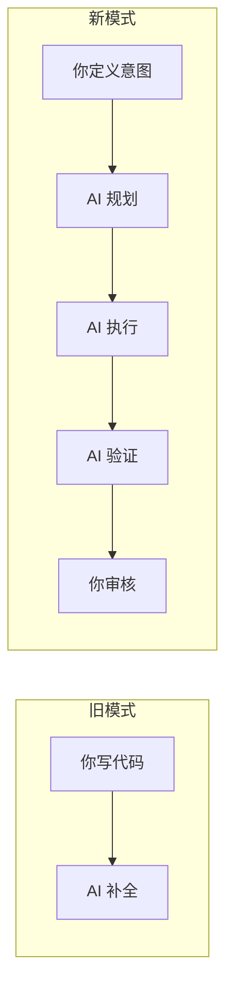
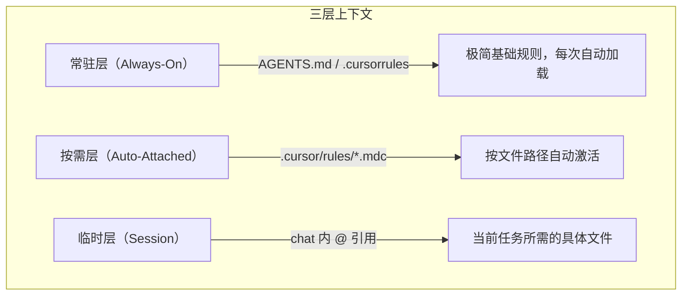
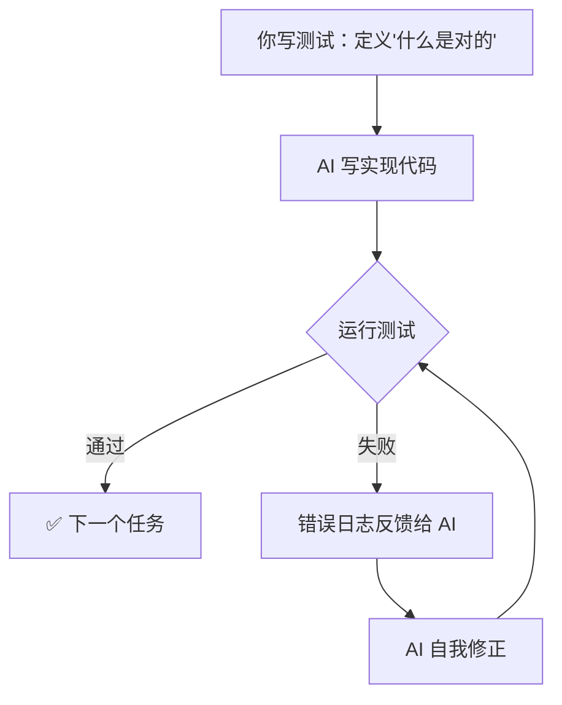
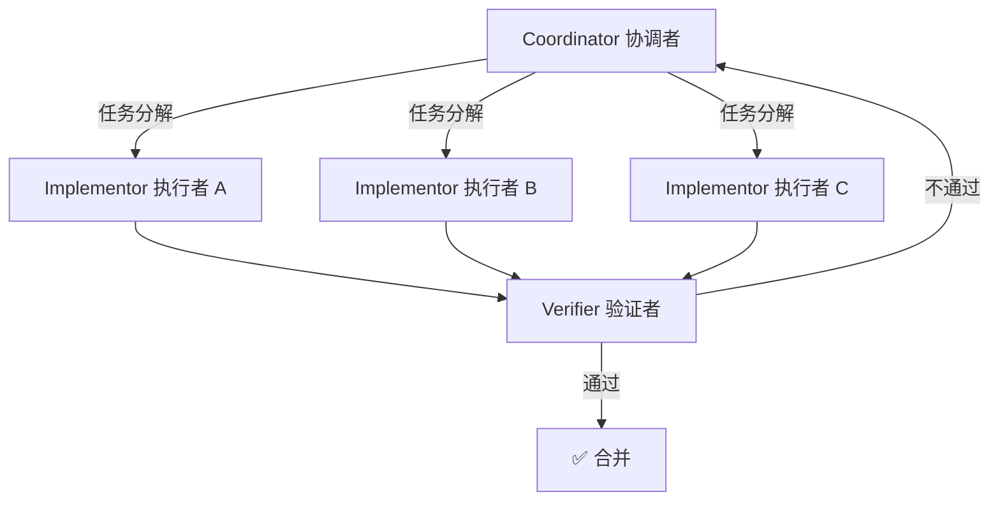
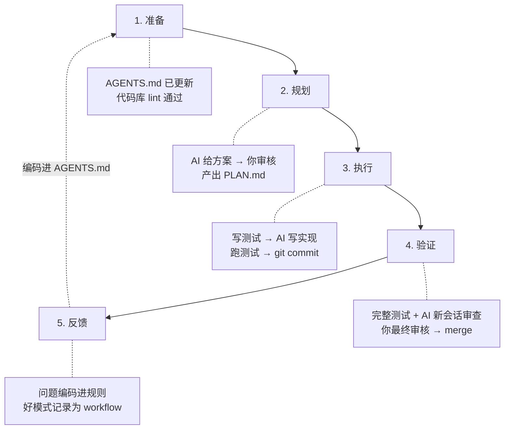

## 前言：你可能一直在"被 AI 用"，而不是"用 AI"

你是不是也有过这样的经历？

- 让 AI 做个功能，它给了你 500 行代码，你看了半小时后发现它用了项目根本不允许的框架
- 对话进行到第 30 轮，AI 开始自相矛盾，之前定好的方案它自己推翻了
- AI 写的代码"看起来对"，合并后上线直接炸了——因为它没处理你们业务里的空值边界
- 你觉得 Cursor 比 Copilot 好用，但换了工具后踩坑依旧

这不是 AI 不行，也不是工具没选对——而是**你驾驭 AI 的方式不对**。

2026 年了，AI 编程工具已经从"Tab 补全"进化到了能够自主规划、执行、验证的 [Agent 形态](/articles/build-ai-agent)。Claude Code 可以直接跑你的测试套件；GitHub Copilot Coding Agent 能从 Issue 自动开 PR；OpenAI Codex CLI 在沙盒里执行命令。工具不缺——缺的是**把工具用对的方法论**。

这篇文章要回答一个核心问题：**怎样才能让 AI 稳定地、可靠地帮你写出生产级代码？**

```text
本文结构：

Part 1: 思维转变 ——— 从编码者到架构编排者
Part 2: 六大驾驭方法论 — 实操手册
Part 3: 五大反模式 ——— 避坑指南
Part 4: 工具全景 ———— 20+ 工具选型速查
```

---

## Part 1：思维转变——你的角色变了



2026 年的 AI 编程，开发者的角色从"逐行写代码的人"变成了 **"架构师 + 教练"**。Andrej Karpathy 在 2025 年提出"Vibe Coding"时说：*"I just see things, say things, run things, and copy-paste things."* 很多人误解这意味着"随手让 AI 写代码"——恰恰相反，真正的高手花 70% 的时间在**定义约束、审核方案和编码经验**上。

你的核心价值不再是写语法，而是四件事：

1. **定义意图** — 清晰描述"做什么"和"不做什么"，给 AI 一个可量化的成功标准
2. **设计约束** — 通过规则文件（`AGENTS.md`）和规格说明给 AI 划定边界
3. **验证结果** — 用测试、linter、对抗性审查确认 AI 的输出符合架构
4. **编码经验** — 每次踩坑后把修正编入规则文件，让 AI 永久学会

高手与新手的行为差异一目了然：

| 新手的做法 | 高手的做法 |
|-----------|-----------|
| "帮我做个登录系统" | "先别写代码，先读完项目结构，再给我一个实现方案" |
| 一次让 AI 干完所有事 | 拆成原子任务，每步验证后才继续 |
| 接受 AI 给的第一个方案 | 让 AI 给出 2-3 个方案，分析利弊后选择 |
| 看不懂也合并了 | "解释一下这段代码为什么这么写" |
| AI 犯了错就重新 prompt | 把错误编码进项目规则文件，让 AI 永久学会 |
| 用一个超长 chat 完成一切 | 子任务完成后，总结成果，开新会话 |

---

## Part 2：六大核心驾驭方法论

### 方法一：Spec-Driven Development（规格驱动开发）

**核心思想：让 AI 先理解"做什么"再动手写代码。改计划永远比改代码便宜 10 倍。**

一个完整的 Spec-Driven 循环分为四个阶段：

```text
Phase 1: SPECIFY（定义）
│  "你要做什么、不做什么、成功标准是什么"
│  → 产出: SPEC.md
│
Phase 2: PLAN（规划）
│  AI 在只读模式下提出架构方案，你审核修正
│  → 产出: PLAN.md
│
Phase 3: TASKS（拆解）
│  将方案分解为可独立验证的原子任务
│  → 产出: TASKS.md
│
Phase 4: IMPLEMENT + VERIFY（实现 + 验证）
   逐个任务执行 → 测试 → 通过后才继续下一个
   → 产出: 可工作的代码 + 测试
```

**实战技巧**：

- **不是所有任务都需要 Spec**。判断标准：如果这个任务跨会话、高风险、涉及多文件，就需要 Spec；如果是单函数、低风险，直接开干
- **使用 Plan Mode**：在 Claude Code 中说 `"先别写代码，给我一个计划"`；在 Cursor 中开 Agent 前先 describe
- **让文档活起来**：让 AI 在执行过程中实时更新 SPEC.md，保持计划和实际同步

> 经验法则：如果你发现自己在反复让 AI "重做"，说明你跳过了 SPECIFY 和 PLAN 阶段。**回到起点，先对齐意图**。

---

### 方法二：上下文工程（Context Engineering）

**核心思想："Prompt Engineering"已过时。2026 年的关键能力叫"Context Engineering"——不是怎么问问题，而是怎么让正确的信息在正确的时机自动出现在 AI 面前。**

AI 的输出质量是上下文质量的函数：`Output = f(Context)`。你给它什么，它还你什么。

#### 上下文的三层架构



#### 项目规则文件——给 AI 写的"岗位说明书"

这是驾驭 AI 最关键的基础设施。没有它，再好的 AI 也只能给你通用的、可能不符合项目约定的代码。

| 文件 | 定位 | 适用工具 | 优先级 |
|------|------|---------|--------|
| `AGENTS.md` | 通用"机器 README" | 全平台（Cursor / Copilot / Claude Code...） | ⭐⭐⭐ 必须创建 |
| `CLAUDE.md` | Claude 专属指令 | Claude Code | ⭐⭐ Claude 用户推荐 |
| `.cursor/rules/*.mdc` | 分层规则系统 | Cursor | ⭐⭐ Cursor 用户推荐 |
| `.github/copilot-instructions.md` | Copilot 全局指令 | GitHub Copilot | ⭐ |
| `.goosehints` | Goose 指令 | Goose | ⭐ |

一个好的 `AGENTS.md` 长什么样？以我这个 Hugo 技术博客为例：

```markdown
# 项目：ifnodoraemon.github.io（Hugo 技术博客）

## 技术栈
- Hugo SSG + Vanilla JS + CSS
- 双语架构：content/zh/ 和 content/en/

## 关键命令
- hugo server -D     # 本地预览
- npm run build      # 生产构建

## 文章规范
- 中文文章放 content/zh/articles/{slug}.md
- 英文文章放 content/en/articles/{slug}.en.md
- frontmatter 必须包含：title / slug / date / tag / tagClass / description
- tagClass 可选值：tag-blue / tag-green / tag-violet / tag-emerald

## 写作风格
- 开篇用痛点场景引入，不要写"本文将介绍..."
- 深度技术分析 + 可直接复制的代码
- 善用 mermaid 图和表格对比

## 安全边界
- ❌ 永远不要修改 public/ 目录（构建输出）
- ❌ 不要引入新的 CSS 框架
- ❌ 不要修改 .github/workflows/ 中的 CI 配置
```

> 注意：这个文件只有 25 行。精简是关键——每多一行无用指令，都在稀释真正重要的规则。

**四条黄金规则**：

1. **控制在 200 行以内** — LLM 存在 ["lost-in-the-middle"](https://arxiv.org/abs/2307.03172) 效应：模型对上下文中间位置的信息关注度最低。超长规则反而被忽略
2. **只写 AI 推断不出来的内容** — 不要重复 linter 和类型检查已经做的事。"使用 TypeScript" 不用写；"API 路由用 kebab-case" 要写
3. **通过摩擦迭代** — AI 反复犯同一个错（比如总是忘记给 Hugo 文章加 `tagClass`）？立即编码进规则文件
4. **提供标杆文件路径** — 相比千言万语，"新文章请参考 `content/zh/articles/mcp-guide.md` 的格式"一句话胜过一切

跨工具通用是 `AGENTS.md` 的核心优势。无论你用 Cursor、Copilot、Claude Code 还是 Aider，它们都会自动读取项目根目录下的这个文件。一次配置，全平台生效。

---

### 方法三：TDD + Agent 验证环

**核心思想：用测试作为 AI 的"刹车系统"。让测试告诉 AI 对不对，而不是让你肉眼判断。**

这是目前最可靠的 AI 编程驾驭模式，没有之一。原因很简单——AI 最擅长的就是"给定一个可量化目标，迭代逼近"。



**为什么这是最可靠的模式？**

- **可量化的成功标准**：不是"写得好不好"的主观判断，而是"测试过不过"的客观事实
- **自动的守卫机制**：后续 AI 修改代码时，已有测试能立即发现回归
- **文档即测试**：测试本身就是最好的行为文档

**实操路径**：

1. **你来写红色测试**（定义预期行为）
2. **AI 来写绿色实现**（让测试通过）
3. **AI 来做重构**（测试保持绿色）

**真实场景**：假设你要给博客站点加一个 RSS 生成器。不要说"帮我写个 RSS 功能"，而是先写测试：

```python
# test_rss.py — 你来写这个
def test_rss_contains_latest_articles():
    feed = generate_rss(articles[:10])
    assert "<rss version" in feed
    assert articles[0].title in feed

def test_rss_escapes_html_in_description():
    article = Article(title="Test", description="<script>alert('xss')</script>")
    feed = generate_rss([article])
    assert "<script>" not in feed  # 必须转义
```

然后告诉 AI："请实现 `generate_rss` 函数，让所有测试通过。" AI 拿到的是一个**可执行的规格说明**，不是一段模糊的自然语言描述。

在 Claude Code / Codex CLI / Aider 等终端 Agent 中，AI 可以直接运行 `pytest` 并读取错误输出，自动进入 Red→Green→Refactor 循环，直到所有测试通过。

---

### 方法四：多 Agent 编排（CIV 模式）

**核心思想：不要让一个 AI 同时担任"架构师"和"码农"和"测试员"。角色分离，各司其职。**

CIV（Coordinator-Implementor-Verifier）架构将 AI 工作流分为三个角色：



你不需要什么复杂框架。日常工作中，用现有工具就能实现：

| 角色 | 工具选择 | 职责 |
|------|---------|------|
| **协调者** | Cursor Chat / Claude Code（Plan Mode） | 分析需求，制定方案，分解任务 |
| **执行者** | Cursor Agent / Codex CLI / Aider | 按方案逐个实现任务 |
| **验证者** | 你 + 测试套件 + linter | 审查代码，跑测试，确认符合规格 |

**进阶技巧——对抗性验证**：

写完代码后，开一个**新的 AI 会话**，专门用来找 bug：

```text
"假设你是一个安全审计员。审查以下代码的所有潜在问题：
 1. 安全漏洞
 2. 边界情况
 3. 性能瓶颈
 4. 与项目架构的不一致

[粘贴代码]"
```

这种"让 AI 审查 AI 的代码"的模式，效果远胜于"写完就合并"。

---

### 方法五：高级 Prompt 技术

工具和方法论确定后，日常交互中还有几个关键技巧能显著提升 AI 输出质量：

#### 5.1 角色定义——RTF 模式（Role-Task-Format）

```text
❌ 差："帮我写个 API"

✅ 好："你是一个资深 Python 后端工程师，精通 FastAPI 和 SQLAlchemy。
      你的任务是为用户偏好表添加 CRUD API。
      遵循项目已有的 Repository Pattern（参考 src/api/users.ts）。
      输出格式：先给出方案概要，待我确认后再写代码。"
```

区别在于：角色限定了知识域，任务限定了范围，格式限定了输出结构。三者缺一不可。

#### 5.2 链式任务——拒绝一步到位

```text
❌ 差："做完整个用户认证系统"

✅ 好：
  Prompt 1: "分析当前项目的认证依赖和中间件结构"
  Prompt 2: "基于分析，设计 JWT 认证的实现方案"
  Prompt 3: "实现认证中间件（**先写测试**）"
  Prompt 4: "实现登录 API（**先写测试**）"
```

每一步都能独立验证，每一步都有回退点。

#### 5.3 计划先行——三问法

在让 AI 动手之前，先要求它回答三个问题：

```text
"先别写代码。回答以下三个问题：
  1. 你打算修改哪些文件？
  2. 每个文件具体要改什么内容？
  3. 可能有哪些风险和边界情况？
  等我确认后你再开始。"
```

#### 5.4 反思修正——不要说"试试别的"

AI 犯错时，大多数人会说"这个不对，试试别的方法"。这是最低效的做法。正确的方式：

```text
① 观察："单元测试在第 42 行报了 JSONDecodeError"
② 分析："看起来你没有处理当输入是 JSON 字符串的情况"
③ 指令："请扩展解析逻辑，同时支持 dict 和 JSON 字符串两种输入格式"
```

给 AI 的错误反馈越精确，修复越准确。模糊的反馈只会导致模糊的修复。

---

### 方法六：会话卫生与上下文管理

**核心问题：长会话 → 旧信息堆积 → AI 混乱 → 质量断崖式下降**

LLM 的上下文窗口不是"越大越好"。即使 [Gemini 3.1 Pro 有 1M token 上下文](/articles/ai-trends-2026)，模型对长上下文中间位置信息的注意力仍然最低。更重要的是——每轮对话的历史消息都在消耗你的有效上下文空间。30 轮对话 × 每轮平均 2000 token ≈ 60K token 的历史噪音，留给真正重要信息的空间越来越少。

**解决方案：会话分段法**

```text
会话 1: 分析需求 → 产出 SPEC.md → 结束
会话 2: 基于 SPEC.md 设计方案 → 产出 PLAN.md → 结束
会话 3: 基于 PLAN.md 实现任务 1-3 → commit → 结束
会话 4: 基于 PLAN.md 实现任务 4-6 → commit → 结束
```

**关键原则**：

- **每个新会话注入必要文档**：开头让 AI 读 SPEC + PLAN，2000 token 的精炼文档就能恢复完整上下文
- **定期总结**："请总结我们目前为止做了什么，还剩什么没做"，保存为文件作为下次会话的输入
- **30 轮法则**：单个会话超过 30 轮对话，质量大概率开始下降。及时换新
- **中间产出物是接力棒**：SPEC.md → PLAN.md → TASKS.md，每个文档都是会话之间的"状态持久化"

---

## Part 3：五大反模式——避坑指南

| # | 反模式 | 典型症状 | 修复方法 |
|---|--------|---------|---------|
| 1 | **厨房水槽** | 把 20 个文件全灌进上下文，AI 反而更迷糊 | 只给当前任务需要的 2-3 个文件 |
| 2 | **一锤子买卖** | "帮我做完整个功能"，结果哪里都差一点 | 拆成 5-10 个原子任务，逐个完成验证 |
| 3 | **缺乏护栏** | AI 引入了项目禁止的库或违反约定的模式 | 在 `AGENTS.md` 中明确禁止列表和标杆文件 |
| 4 | **上下文腐烂** | 30+ 轮后 AI 自相矛盾、忘记之前的决定 | 分段会话 + 中间产出文档（SPEC/PLAN） |
| 5 | **不验证就合并** | AI 代码"看着对"，上线后在边界情况下崩溃 | TDD 验证环 + 对抗性代码审查 |

**反模式 1 的底层原因**：LLM 不是数据库——你给它越多文件，它对每个文件的关注度越低。200 行代码精准上下文的效果，远胜于 5000 行代码的"全量倾倒"。

**反模式 5 为什么最危险**：AI 生成的代码有一个"致命吸引力"——它格式工整、注释齐全、看起来比你自己写的还专业。但这种"表面整洁"会让你放松警惕，而 bug 往往藏在你不会检查的边界情况里（空数组、并发竞争、时区问题...）。

如果你只记住一条：**永远不要合并你不理解的代码**。哪怕 AI 说"这是最佳实践"。

---

## Part 4：工具全景矩阵

说完方法论，最后才是工具选型。**工具服务于方法论，而不是反过来。**

2026 年的一个关键变化是 [MCP 协议（Model Context Protocol）](/articles/mcp-guide)的全面普及——它就像 AI 工具界的 USB-C，让不同的 AI 编程工具可以通过统一协议连接数据库、GitHub、文件系统等外部资源。选工具时，MCP 支持程度已成为重要指标。

### AI 原生 IDE——从底层为 AI 重新设计的编辑器

| 工具 | 核心优势 | MCP | 定价 |
|------|---------|-----|------|
| **Cursor** | AI-first 编辑器，深度代码库索引，分层规则系统（`.cursor/rules/*.mdc`） | ✅ | $20/月 |
| **Windsurf** | 高性价比，Cascade 多步任务链 | ✅ | $15/月 |

### IDE 扩展——在你熟悉的编辑器里加 AI 能力

| 工具 | 核心优势 | 开源 |
|------|---------|------|
| **GitHub Copilot** | 生态最广，Agent Mode + Coding Agent（云端异步）+ MCP 支持 | ❌ |
| **Cline** | 人类在环的自治 Agent 先驱，MCP 社区生态丰富 | ✅ |
| **Roo Code** | Cline fork，角色化执行模式（Architect / Code / Debug） | ✅ |
| **Continue** | 完全开源，支持自定义模型 | ✅ |
| **Augment Code** | 企业级语义上下文引擎，理解 10 万+ 文件代码库 | ❌ |
| **Amazon Q Developer** | AWS 生态深度感知（Lambda / CloudFormation / CDK） | ❌ |
| **Gemini Code Assist** | Google Cloud 生态集成 | ❌ |
| **Tabnine** | 隐私优先，支持本地模型和企业自定义安全规则 | ❌ |

### 终端 Agent（CLI）——2025-2026 增长最快的品类

| 工具 | 核心优势 | 开源 | 安装 |
|------|---------|------|------|
| **Claude Code** | 前沿推理能力，大规模重构首选 | ❌ | `npm i -g @anthropic-ai/claude-code` |
| **OpenAI Codex CLI** | Rust 构建，ChatGPT 订阅直接用，沙盒执行 | ✅ | `npm i -g @openai/codex` |
| **Gemini CLI** | 免费层大方，1M token 上下文，ReAct 循环 | ✅ | `npm i -g @google/gemini-cli` |
| **OpenCode** | 模型无关（支持 75+ LLM），TUI 界面，隐私优先 | ✅ | `curl -fsSL https://opencode.ai/install \| bash` |
| **Aider** | 终端结对编程先驱，每次编辑自动 Git commit | ✅ | `pip install aider-chat` |
| **Goose** | Block 出品，可扩展插件系统，自治任务执行 | ✅ | — |

### 自治 / 云平台 Agent——Issue → PR 全自动

| 工具 | 核心优势 |
|------|---------|
| **GitHub Copilot Coding Agent** | 基于 GitHub Actions，收到 Issue 后自动分析、建分支、写代码、开 PR |
| **Devin** | 全栈自治 Agent，独立完成复杂应用开发 |
| **Bolt / Lovable** | 自然语言 → 全栈应用，适合快速原型 |
| **Augment Intent** | 多 Agent 编排，"活文档"驱动并行开发 |

### 选型速查——一句话告诉你该用什么

```text
最快上手       → GitHub Copilot（生态最广）
最强推理       → Claude Code（复杂重构首选）
完全免费       → Gemini CLI（1M 上下文 + 免费层）
不绑定厂商     → OpenCode（支持 75+ 模型）
Git 自动化     → Aider（每次编辑自动 commit）
VS Code 自治   → Cline / Roo Code
企业大仓       → Augment Code
异步后台       → GitHub Copilot Coding Agent
```

> **2026 年的最佳实践：不要只用一个工具**。专业开发者通常用 Cursor/Copilot 做日常编码，用 Claude Code 做复杂推理和大规模重构，用 Aider 做 Git 集成任务，用 Gemini CLI 处理超长上下文分析。关键不在于选哪个工具——而在于用同一套方法论（Spec → Plan → TDD → 验证）统一驾驭它们。

---

## 完整驾驭工作流——黄金路径

最后把六大方法论串成一个完整的工作流：



这个循环的精髓在于最后一步：**反馈闭环**。每次踩坑都强化规则文件，每次成功都沉淀为标准流程。经过几十次迭代，你的 `AGENTS.md` 就变成了整个团队的"AI 使用手册"——新人加入项目，AI 立即知道该怎么干活。

---

## 最终总结

记住这四条箴言：

1. **"先规划再执行"是 10 倍杠杆**。让 AI 解释它的方案，比让它直接写代码，成功率高出一个数量级
2. **测试是最好的驾驭**。你写测试定义"什么是对的"，AI 负责让测试通过——这是 AI 最擅长的事
3. **规则文件是永久记忆**。每次踩坑都编码进 `AGENTS.md`，你的 AI 队友就会越来越懂你的项目
4. **会话是消耗品**。别惧怕开新 chat。30 轮后换新会话，注入必要文档重新开始，质量比续聊高得多

最后一句话：**AI 编程工具的天花板，不是模型智商，而是你驾驭它的方法论。** 本文的六大方法加上五大反模式，就是你从"被 AI 用"到"用 AI"的完整路线图。
