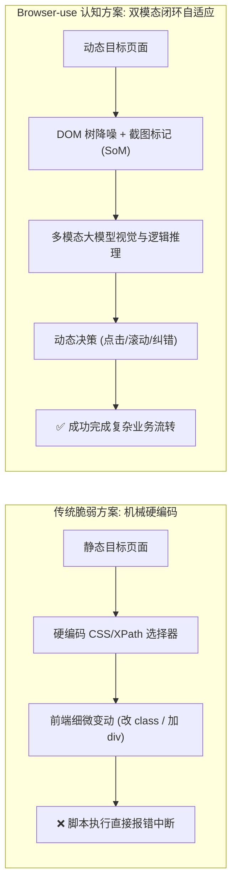
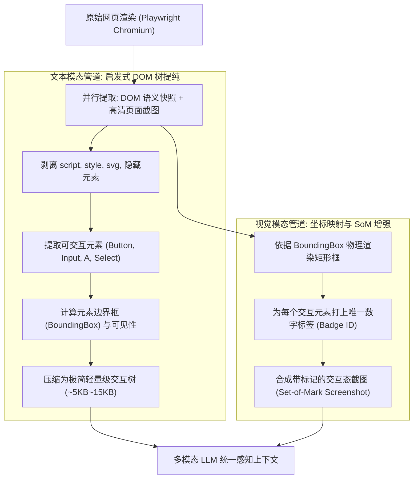

## 引言：传统 RPA 与脆弱自动化脚本的终结

在过去的十余年里，无论是网页数据采集、端到端测试还是政企 RPA（机器人流程自动化），开发者都受困于同一个梦魇：**以 XPath 和 CSS 选择器为核心的自动化脚本极其脆弱。**

只要前端工程师重构了一次 UI 组件库、修改了一个 `div` 的嵌套层级、或者网站采用了带有随机哈希的 Tailwind 类名（如 `class="flex_a8f9z bg-blue_39kd"`），耗费数周编写的 Playwright/Selenium 脚本就会在半夜**毫无悬念地报错崩溃**。

进入 2026 年，这一范式被彻底颠覆。以 **[Browser-use](https://github.com/browser-use/browser-use)** 为代表的自主浏览器智能体，在 GitHub 上迅速跨越 **10 万 Star** 门槛。它不再依赖死板的选择器规则，而是赋予大模型“像人类一样浏览互联网”的视觉与认知能力：**用眼睛看屏幕截图、用大脑理解 DOM 结构、自主规划多步点击与滚动、并对意外弹窗和风控进行自适应容错。**



本文将深度拆解 Browser-use 的底层技术内核，剖析其如何解决 Token 爆炸、视觉定位漂移以及反爬风控对抗，并提供完整的生产级企业实战代码。

---

## 一、双模态感知内核：DOM 树智能提纯与视觉坐标定位

如果直接将一个现代单页面应用（SPA）的完整 HTML 源码（通常有数兆字节、包含几万行冗余代码）无脑喂给大模型，不仅会瞬间打爆上下文窗口、消耗数十万 Token 费用，而且模型会被海量无意义的 `script`、`style` 和嵌套 `div` 深度干扰。

Browser-use 的第一大核心架构壁垒，在于其**极具艺术感的双模态感知提纯流水线**：



### 1. 启发式 DOM 树降噪算法
Browser-use 通过在浏览器页面中注入定制的 JavaScript 遍历脚本，执行激进的剪枝与提纯：
* **过滤不可见节点**：利用 `window.getComputedStyle()` 检查元素的 `display === 'none'`、`visibility === 'hidden'` 或 `opacity === '0'`，以及是否处于当前视口之外；
* **剔除无交互价值的代码**：彻底抹杀所有 `<script>`, `<style>`, `<link>`, `<meta>` 标签以及复杂的 SVG 路径数据；
* **语义扁平化折叠**：将多层嵌套的空白包装 `<div>` 折叠为单一逻辑节点，仅提取包含文本、语义属性（`aria-label`, `placeholder`, `role`, `href`）的核心交互节点；
* **压缩结果**：原本 2MB 的臃肿 HTML，被瞬间压缩为仅消耗 **1,500 ~ 3,000 Token** 的极简树状文本！关于大模型长上下文管理与信息信噪比优化，可参阅 [上下文工程全景指南](/articles/context-engineering-guide/)。

### 2. Set-of-Mark (SoM) 视觉定位法
大模型在直接输出像素绝对坐标（如 `x=1240, y=850`）时，由于分辨率缩放和跨屏幕渲染，空间感知误差极大。

Browser-use 采用了顶级的 **Set-of-Mark (SoM) 视觉标记法**：
1. JavaScript 脚本在获取到每个可交互元素的 `BoundingBox` 后，直接在页面顶层浮动绘制带有**明艳彩色边框和数字编号（如 `[1]`, `[2]`, `[15]`）的标签**；
2. 对当前打好标记的视口截取一张快照；
3. **大模型的决策交互极简纯粹**：Prompt 不再要求模型猜坐标，而是让其直接下发行动指令，例如：`click_element(index=14)` 或 `input_text(index=3, text="admin@company.com")`！这种设计彻底消除了点击偏移，召回准确率直接飙升至 95% 以上。

---

## 二、智能体认知执行回路与状态机容错

在真实的复杂业务场景中，智能体执行的任务绝非单步调用，而是涵盖十几步交互的长流程。Browser-use 在调度层建立了一套严格的 **O-P-A-V（观察-规划-行动-验证）状态机执行回路**：

```text
┌─────────────────────────────────────────────────────────────┐
│                 Browser-use 核心认知状态机循环                 │
└─────────────────────────────────────────────────────────────┘
                             │
                             ▼
 1. 观察 (Observe)  ───► 注入 JS 提纯 DOM，抓取带 SoM 编号的高清截图
                             │
                             ▼
 2. 思考 (Reason)   ───► LLM 结合用户目标评估：当前处于流程的哪一步？
                             │
                             ▼
 3. 规划 (Plan)     ───► 决策下一个原子动作：Click / Type / Scroll / Switch Tab
                             │
                             ▼
 4. 行动 (Act)      ───► 通过 Playwright CDP 协议模拟真实人类物理输入
                             │
                             ▼
 5. 校验 (Verify)   ───► 等待网络闲置与 DOM 重绘，校验目标动作是否生效
                             │
                             ├─► [成功] 进入下一轮观察循环
                             └─► [失败/报错] 触发自愈重试或动态降级
```

### 1. 动态滚动与视口局部探索
许多复杂的报表系统需要无限滚动或深层嵌套滚动条。Browser-use 在动作集中内建了智能滚动机制：
* `scroll_down(amount=500)`：模型在当前视口找不到目标信息时，自主决定向下滚动并触发新视口的二次 SoM 标定；
* 维持轻量级的“空间记忆”列表，防止在页面顶部与底部之间做无谓的往复死循环震荡。关于智能体循环流转与自反思架构，可参阅 [智能体反思与自我纠错全景解析](/articles/agent-reflection-self-correction/)。

### 2. 状态自愈与死循环熔断
当智能体连续 3 次尝试点击同一个元素却发现 DOM 结构与截图未发生任何改变时，系统内置的“状态停滞判定器”会介入：
* 强制触发一次页面刷新；
* 或者注入指令提示模型：“*你刚才的点击操作未引发页面状态迁移，请排查是否存在遮罩弹窗 (Modal) 或需先行滚动。*”

---

## 三、生产落地三大生死深坑与攻防对抗

将 Browser-use 从本地玩具推向企业级 7x24 小时无人值守生产环境，必须攻克以下三道工程鬼门关：

### 1. 反爬与指纹风控对抗 (WAF / Cloudflare Evasion)
默认启动的 Headless Chrome 具有极其明显的自动化指纹特征（如 `navigator.webdriver = true`、WebGL 渲染器标识缺失、固定屏幕分辨率等），会在 Cloudflare、DataDome 等防爬网关前被直接拦截。

**生产级加固方案**：
* 接入 `playwright-stealth` 抹除全部自动化指纹；
* 随机化 User-Agent、屏幕分辨率与硬件并发度（`navigator.hardwareConcurrency`）；
* 模拟真实人类的贝塞尔曲线鼠标轨迹与按键随机延迟（Jitter）。

### 2. 动态 CAPTCHA 与两步验证 (2FA) 的人机接管
任何声称“能 100% 自动破解复杂 3D 旋转或无序点选验证码”的方案在生产中都是不可靠的。

**最佳实践**：**Human-in-the-Loop（人机协同接管）机制**。
当智能体在视口中识别到强阻断验证码时，状态机暂停自动化执行，通过 WebSocket 向企业工作台或钉钉/企微发送实时警告，并弹出一个基于 CDP 远程调试协议的交互视窗，由人工在 30 秒内完成滑动解锁，随后 Agent 自动接管恢复后续工作流。

---

## 四、动手实战：构建生产级企业财务报表采集智能体

下面是一个可直接运行的企业级实战脚本，演示如何使用 `browser-use` 配合多模态大模型，自主登录后台、搜索特定月份报表并下载数据。

### 1. 安装核心依赖
```bash
pip install browser-use playwright langchain-openai
playwright install chromium
```

### 2. 完整 Python 智能体工程代码

```python
import os
import asyncio
from browser_use import Agent, Browser, BrowserConfig
from browser_use.browser.context import BrowserContextConfig
from langchain_openai import ChatOpenAI

# 1. 配置具备视觉能力的多模态大模型底座
# 生产环境强烈推荐使用具备强大视觉定位能力的模型 (如 GPT-4o, Claude 3.7 Sonnet 或 Qwen2.5-VL)
llm = ChatOpenAI(
    model="gpt-4o",
    temperature=0.0,
    api_key=os.getenv("OPENAI_API_KEY")
)

# 2. 工业级浏览器环境防封与稳定性配置
browser_config = BrowserConfig(
    headless=False,            # 调试阶段设为 False 观察执行过程，生产部署可配置为 True
    disable_security=True,     # 忽略企业内网自签名 SSL 证书报错
    extra_chromium_args=[
        "--disable-blink-features=AutomationControlled", # 抹除 Webdriver 自动化标记
        "--no-sandbox",
        "--window-size=1920,1080"
    ]
)

# 3. 配置持久化用户会话与存储上下文
context_config = BrowserContextConfig(
    viewport={"width": 1920, "height": 1080},
    save_recording_path="./recordings", # 录制每一步操作视频用于审计排错
    locale="zh-CN"
)

async def run_enterprise_workflow():
    # 初始化受控浏览器实例
    browser = Browser(config=browser_config)
    context = await browser.new_context(config=context_config)

    # 4. 定义具备自然语言业务意图的复杂目标
    task_prompt = """
    1. 访问 https://example-finance-portal.com/login
    2. 如果需要登录，在用户名输入框填入 'finance_bot'，密码输入框填入 'Secr3t_Pass!'，并点击登录
    3. 登录成功后，在左侧导航栏找到并点击 '财务对账中心'
    4. 将查询时间段筛选为 '2026年Q2'，点击 '导出汇总 CSV'
    5. 等待下载完成，并验证屏幕上是否弹出 '导出成功' 提示
    """

    # 5. 实例化 Browser-use 智能体
    agent = Agent(
        task=task_prompt,
        llm=llm,
        browser_context=context,
        use_vision=True,               # 开启 SoM 视觉截图双模态定位
        max_failures=3,                # 允许单步连续失败的最大重试次数
        max_actions_per_step=4         # 允许单轮循环中执行复合动作以提升速度
    )

    print("🚀 启动 Browser-use 企业级自主网页智能体...")
    history = await agent.run(max_steps=25)

    print("\n✅ 任务执行报告汇总:")
    print(history.final_result())

    # 清理并安全关闭会话
    await context.close()
    await browser.close()

if __name__ == "__main__":
    asyncio.run(run_enterprise_workflow())
```

*通过上述代码，智能体摆脱了一切脆弱的硬编码 XPath。即便页面改版升级，多模态大脑凭借文字与视觉标记，依然能如同人类员工一样精准完成复杂交互流转。关于智能体生产环境持久化运行与可观测性，请参阅 [智能体可观测性与生产调试指南](/articles/agent-observability-debugging/)。*

---

## 五、企业选型总结与成本控制

在 2026 年的技术演进路线中，浏览器智能体并不会完全抹杀传统接口调用。企业架构师应当建立明晰的**分层调度架构**：

| 技术手段 | 适用场景 | 执行速度 | 单次成本 | 稳定性 |
|:---|:---|:---|:---|:---|
| **传统 REST/GraphQL API** | 具备官方文档、权限完备的标准数据流 | 极快 (<100ms) | $0.000 | 极高（强类型契约） |
| **Playwright 原生确定性脚本** | 界面极其固定、需高频执行的高并发冒烟测试 | 快 (<1s) | $0.000 | 中等（UI 改版易损坏） |
| **Browser-use 视觉智能体** | 无接口遗留系统、反爬严重平台、探索式调研与跨系统长流程流转 | 中等 (~3s/步) | 视 Token 消耗 ($0.01~$0.05/次) | 极高（自适应容错） |

---

## 常见问题 (FAQ)

### Q1: Browser-use 每步都需要上传截图，会不会导致 Token 费用失控？
不会。Browser-use 默认会对截图进行动态压缩和缩放（通常将宽度约束在 1280px 以内），单张多模态截图上传消耗仅数百 Token。同时结合激进的 DOM 提纯，单步循环的平均 Token 成本在 **800 ~ 2,500 Tokens** 之间。对于高频场景，推荐搭配本地部署的高性能视觉模型（如 Qwen2.5-VL-72B，详见 [vLLM 生产级部署全指南](/articles/vllm-serving-guide/)），推理成本趋近于零。

### Q2: 遇到多标签页（Multiple Tabs）弹窗切换时，智能体如何保持上下文不丢失？
Browser-use 内置了多标签页管理器。当网页发生 `window.open` 或点击触发新 Tab 时，底层 Playwright 会捕获 `context.on('page')` 事件，向 LLM 的感知状态中注入 `available_tabs: [Tab 0: 主页, Tab 1: 详情页]`。大模型可以通过 `switch_tab(tab_id=1)` 自由在多个窗口之间穿梭，而历史上下文和执行栈依然在主控制器中统一持久化。

### Q3: Browser-use 是否支持在无头环境（Headless）以及 Docker 容器中运行？
完全支持。在生产环境中，最推荐的部署架构是将其封装在轻量级 Linux Docker 容器内，运行 Xvfb（虚拟帧缓冲）来虚拟出屏幕显示设备。这样既能保证纯无头环境的高并发部署，又能保留完整的截图多模态视觉感知能力。
