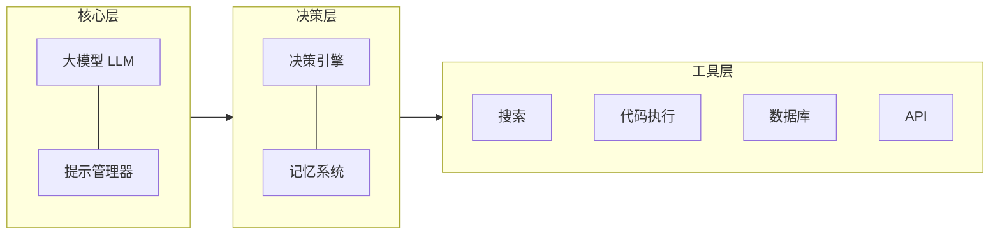

## 什么是 AI Agent？

AI Agent（智能代理）是能够**感知环境、自主决策、执行行动**的 AI 系统。与传统的单次 API 调用不同，Agent 可以：

- 🔄 **循环执行**：根据反馈不断调整行动
- 🛠️ **调用工具**：搜索网页、执行代码、操作数据库
- 📋 **规划任务**：将复杂目标分解为可执行的步骤
- 🧠 **记忆管理**：在长对话中维护上下文和状态

## 架构设计

一个完整的 AI Agent 系统通常包含以下核心组件：



## 实现步骤

### Step 1：安装依赖

```bash
pip install langchain langchain-anthropic tavily-python
```

### Step 2：定义工具

```python
from langchain.tools import tool
from datetime import datetime

@tool
def get_current_time() -> str:
    """获取当前时间"""
    return datetime.now().strftime("%Y-%m-%d %H:%M:%S")

@tool
def search_web(query: str) -> str:
    """搜索网页获取实时信息"""
    from tavily import TavilyClient
    client = TavilyClient()
    results = client.search(query, max_results=3)
    return "\n".join([r["content"] for r in results["results"]])

@tool
def execute_python(code: str) -> str:
    """执行 Python 代码并返回结果"""
    import subprocess
    result = subprocess.run(
        ["python", "-c", code],
        capture_output=True, text=True, timeout=10
    )
    return result.stdout or result.stderr
```

### Step 3：基于 LangGraph 构建状态机 (StateGraph)

2026 年的生产级 Agent 早已摒弃了黑盒式的 `AgentExecutor`，全面转向以**状态机 (State Machine)** 为核心的有向图架构。这种架构不仅可控性极高，还能严格定义数据流（State Schema）。

```python
from typing import TypedDict, Annotated
from langgraph.graph import StateGraph, END
from langgraph.prebuilt import ToolNode
from langchain_core.messages import AnyMessage, add_messages
from langchain_anthropic import ChatAnthropic

# 1. 严格定义 Agent 的全局状态 (State Schema)
class AgentState(TypedDict):
    messages: Annotated[list[AnyMessage], add_messages]
    current_task: str

# 2. 节点逻辑：模型推理节点
def call_model(state: AgentState):
    llm = ChatAnthropic(model="claude-sonnet-4-6-20260217")
    llm_with_tools = llm.bind_tools(tools)
    response = llm_with_tools.invoke(state["messages"])
    return {"messages": [response]}

# 3. 构建有向图
workflow = StateGraph(AgentState)
workflow.add_node("agent", call_model)
workflow.add_node("tools", ToolNode(tools)) # 内置的工具执行节点

# 4. 定义路由与边 (Edges)
workflow.set_entry_point("agent")
# 如果模型回复包含 tool_calls，流向 tools 节点，否则结束
workflow.add_conditional_edges("agent", lambda x: "tools" if x["messages"][-1].tool_calls else END)
workflow.add_edge("tools", "agent")

# 5. 编译成可执行应用
app = workflow.compile()
```

### Step 4：运行与追踪
通过图架构，我们可以精确地追踪每一步状态流转：
```python
inputs = {"messages": [("user", "帮我查一下大模型的最新发布时间。")]}
for event in app.stream(inputs, stream_mode="values"):
    message = event["messages"][-1]
    message.pretty_print() # 能够清晰看到 Thought -> Action -> Observation 的每一步断点
```

## 模型选择建议

| 需求 | 推荐模型 | 原因 |
|------|----------|------|
| 复杂 Agent 任务 | Claude Opus 4.6 | 最强的 Agentic 能力和 Computer Use |
| 日常 Agent 开发 | Claude Sonnet 4.6 | 速度与智能的最佳平衡 |
| 需要深度推理的 Agent | GPT-5.4 Thinking | 推理链透明，便于调试 |
| 高调用量生产环境 | Gemini 3.1 Flash-Lite | 性价比最优 |

## 最佳实践

1. **工具描述要精确**：LLM 通过工具的 docstring 决定何时调用，描述越清晰越好
2. **限制工具数量**：单个 Agent 不超过 10 个工具，太多会降低选择准确率
3. **添加安全护栏**：对代码执行、数据库操作等敏感工具设置权限控制
4. **实现优雅降级**：工具调用失败时，Agent 应能识别并切换策略
5. **监控与日志**：记录每次工具调用的输入输出，便于调试和优化

## 企业级 Agent 架构实践 (Phase 2 深度化)

在真实的生产环境中，Agent 在运行过程中可能会遭遇 API 熔断、数据库锁、或者是长达几小时的异步任务。常规的单体架构会瞬间崩溃，以下是业内最 hardcore 的落地实践：

### 1. 跨会话的持久化与中断恢复 (Redis Checkpointer)

为了让 Agent 在服务器重启后依然能记住用户的上下文，或者在执行高危操作（如转账）前暂停等待人类审批（Human-in-the-loop），必须严格配置 Checkpointer。2026 年的高并发标准方案是使用 **RedisSaver**，实现毫秒级状态序列化。

```python
from langgraph.checkpoint.redis import RedisSaver
import redis

# 建立底层 Redis 连接池
redis_conn = redis.Redis(host='localhost', port=6379, db=0)

# 使用持久化编译 Graph
with RedisSaver(redis_conn) as checkpointer:
    app = workflow.compile(
        checkpointer=checkpointer,
        interrupt_before=["tools"] # 在调用核心工具前实现硬中断，等待人工二次确认
    )
    
    # 通过 thread_id 区分不同用户会话，实现绝对的并发状态隔离
    config = {"configurable": {"thread_id": "user_10086_task_v2"}}
    
    # Agent 执行到 tools 节点前会自动挂起，状态安全保存在 Redis 中
    for event in app.stream(inputs, config=config):
        print(event)
```

### 2. 长耗时任务的异步事件驱动架构 (Temporal Orchestration)

由于后端 HTTP 请求在 60 秒后大概率会 Timeout，如果你的 Agent 需要在后台爬取 100 个网页并生成财报，传统的同步阻塞架构注定会崩溃。业界（如 OpenAI 的 Codex 架构实现）已经完全转向使用 **Temporal** 作为底层持久化工作流编排引擎。

**高并发容灾架构方案：**
1. **API Gateway 发号器**：接收用户请求，不阻塞执行，而是立即返回一个 UUID 凭证（`Job_ID`）。
2. **Temporal Worker 监听队列**：后台独立的 Worker 集群监听队列，拉起专属的 LangGraph 线程开始执行。
3. **休眠与自动轮询**：当 Agent 必须等待某个外部网页渲染时，调用 `await asyncio.sleep(300)`。此时 Temporal 会将当前 Agent 的完整内存树状结构 Checkpoint 落盘数据库，并释放 CPU 等待唤醒资源（100% Crash-safe）。
4. **状态双向全工真回调**：任务完成后，通过 Webhook 或 WebSocket 将最终答案精确推送回浏览器前端。

### 3. 多模态与多智能体的沙盒物理隔离
对于具备代码执行能力的 `Coder Agent`（如我们在 Step 2 写的 `execute_python` Tool），决不能直接在宿主机内执行其生成的代码（极易遭受 Prompt Injection 注入攻击而导致 rm -rf 悲剧）。企业级的唯一做法是通过 gRPC 接口，让 Agent 与完全物理隔离的极轻量级 MicroVM（如 AWS Firecracker 虚拟机或高度受限的 Docker 边车）进行沙盒通信。即使 Agent “越狱”生成了恶意指令，也只会导致当前纳秒级生命周期的沙盒熔断销毁，无法伤及宿主应用分毫。

## 总结
2026 年，优秀的 AI Agent 开发早已脱离了“写两句 Prompt 调调 API”的幼儿阶段。要想让大语言模型真正落地企业生产线，并扛住千万级别规模的恶意请求和流量洪峰，它已经变成了一门融合了**确切状态机拓扑设计、分布式持久化调度、微秒级缓存控制以及操作系统级沙盒防御**的超高维后端复杂系统工程学。
