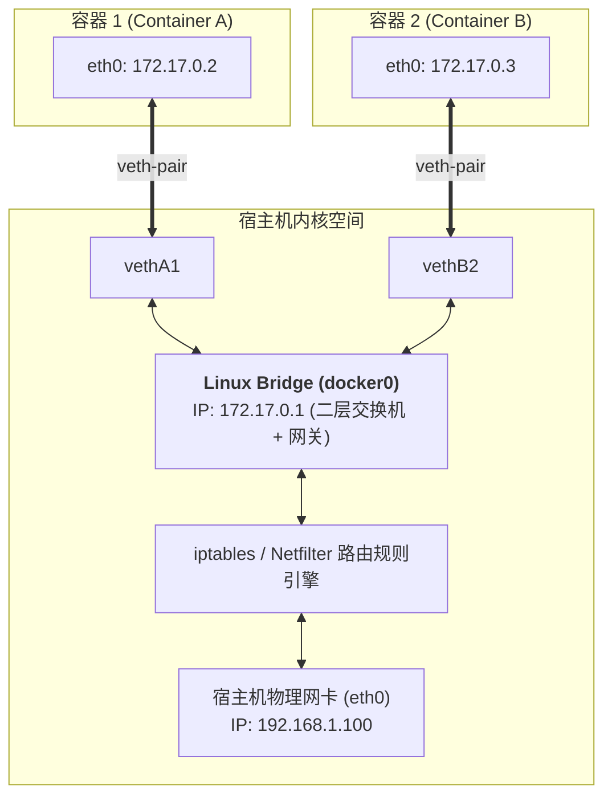
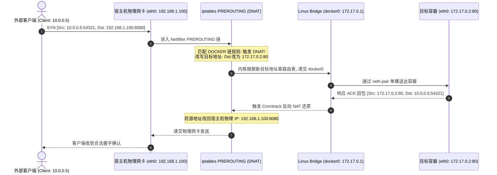
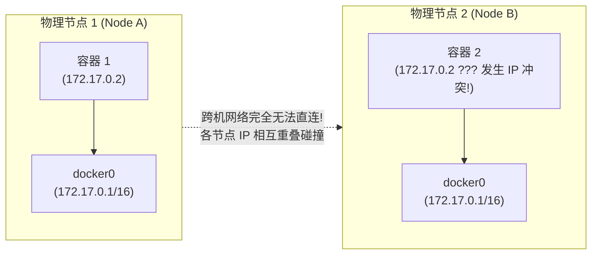

## 引言：被囚禁在“孤岛”中的网络命名空间

在专栏的第一讲 [Docker 内核第一性原理：Namespace 进程隔离、cgroups v2 资源配额与 OverlayFS 联合文件系统底层解密](/articles/docker-internals-namespace-cgroups-overlayfs/) 中，我们见证了 Linux 内核如何利用 `CLONE_NEWNET` 为容器进程铸造起一道绝对坚固的网络隔离高墙：

当一个进程步入独立的 **Network Namespace（网络命名空间）** 时，它在逻辑上拥有一套**完全空白且独立于宿主机的网络协议栈**：
- 独立的网络接口设备（仅有一个孤零零且处于 `DOWN` 状态的 `lo` 本地回环网卡）；
- 空空如也的 IP 路由表（`ip route` 为空）；
- 独立的端口监听空间（容器在 `80` 端口启动服务，宿主机的 `80` 端口毫无感知）；
- 独立的防火墙过滤表（`iptables / nftables`）。

如果内核只做到这一步，容器无异于一座**彻底与世隔绝的信息孤岛** —— 它既无法响应外部用户的 HTTP 请求，也无法访问公网数据库。

Linux 内核与 Docker 究竟施展了怎样的网络工程魔法，让数据包能够安全、高速地穿透命名空间的高墙？

本文作为**《从 Docker 到 Kubernetes：云原生容器与集群编排架构指南》**的第二篇深度拆解，将带你从网线两端的二层物理拓扑出发，逐帧剖析 **veth-pair**、**Linux Bridge**、**iptables NAT 转发** 以及跨主机通信的核心底层原理。

---

## 一、 穿透隔离墙的“虚拟网线”：veth-pair 原理与抓包验证

在物理网络世界中，如果你想把两台独立的物理服务器直连起来，最直接的办法是用一根双绞线（网线）分别插入两台机器的网卡中。

而在 Linux 虚拟网络子系统中，充当这根“虚拟网线”的内核技术，就是 **veth（Virtual Ethernet Pair，虚拟以太网对）**。


### 1.1 veth-pair 的内核第一性原理

veth 设备在内核中**永远成对出现（Peer-to-Peer）**。你可以将它理解为两端直接焊死的一根虚拟数据管道：
- 当一个网络数据包（`sk_buff`）从其中的一端（例如 `vethA`）被发送出去时；
- Linux 内核的网络子系统会立刻拦截该数据包，绕过所有物理硬件驱动，**直接将其塞入其配对端（`vethB`）的接收队列中**；
- 站在 `vethB` 的视角看来，这就等同于从物理网线接收到了一个全新的以太网帧！

### 1.2 动手实验：不用 Docker，纯手写打通跨 Namespace 网络

为了直观体会 veth-pair 的威力，我们在宿主机上用纯 Linux 命令模拟 Docker 创建网络接口的全过程：

```bash
# 1. 创建一个名为 "ns1" 的独立网络命名空间
ip netns add ns1

# 2. 创建一对互通的 veth 虚拟网卡: veth-host 与 veth-container
ip link add veth-host type veth peer name veth-container

# 3. 将 veth-container 这一端 "插入" 到 ns1 命名空间内部
ip link set veth-container netns ns1

# 4. 在 ns1 内部将其重命名为标准的 "eth0"，并配置 IP 地址与启用网卡
ip netns exec ns1 ip link set veth-container name eth0
ip netns exec ns1 ip addr add 192.168.100.2/24 dev eth0
ip netns exec ns1 ip link set eth0 up
ip netns exec ns1 ip link set lo up

# 5. 在宿主机侧为 veth-host 配置对端 IP 并启用
ip addr add 192.168.100.1/24 dev veth-host
ip link set veth-host up

# 6. 从宿主机直接 Ping 容器命名空间内部，测试连通性！
ping -c 2 192.168.100.2
```

此时执行 `ping` 命令，网络瞬间打通！通过这 6 行命令，我们剥离了 Docker 的所有外衣，直击容器拥有独立网卡与 IP 的底层真相。

---

## 二、 容器二层交换机：Linux Bridge (docker0) 的转发逻辑

单对 veth-pair 解决了“单容器与宿主机的一对一通信”问题。但如果我们在宿主机上启动了 20 个容器，如何让这 20 个容器之间能够相互通信，同时还能统一访问宿主机的外部物理网络？

如果在每个容器之间两两建立 veth-pair，连接数将呈 $O(N^2)$ 级爆炸，网络拓扑会彻底沦为不可维护的灾难。

在物理机房中，解决多台机器互通的成熟方案是引入**网络交换机（Switch）**。而在 Linux 内核中，软件实现的二层交换机就是 **Linux Bridge（网桥）**，在 Docker 环境中它默认被命名为 **`docker0`**。

### 2.1 Linux Bridge 的二层交换与 MAC 学习机制

当 Docker 守护进程启动时，会在宿主机上创建一个名为 `docker0` 的虚拟网桥设备，并为其分配一个私有子网网段（默认通常为 `172.17.0.1/16`）。

每当你使用 `docker run` 启动一个新容器时：
1. Docker 创建一对 `veth-pair`；
2. 一端塞进容器并改名为 `eth0`，分配 IP（如 `172.17.0.2`）与专属虚拟 MAC 地址；
3. 另一端（通常名为 `vethXXXX`）保留在宿主机，并通过内核命令 `br_add_if` **直接插上 `docker0` 网桥的虚拟端口上**。



### 2.2 同宿主机跨容器通信的报文生命周期（ARP 与二层转发）

当 **容器 A (`172.17.0.2`)** 试图访问 **容器 B (`172.17.0.3`)** 时，数据包在内核中的流转遵循标准的 IEEE 802.1D 二层转发：
1. **路由选路**：容器 A 查询内部路由表，发现 `172.17.0.3` 属于同一子网（`172.17.0.0/16`），决定直接通过二层发送；
2. **ARP 广播**：容器 A 发出 ARP 请求问询 `172.17.0.3` 的 MAC 地址；
3. **网桥泛洪**：ARP 请求顺着 `veth` 网线注入 `docker0` 网桥。网桥扮演二层交换机角色，向所有挂载在网桥上的端口进行广播；
4. **MAC 学习**：容器 B 收到 ARP 请求后回应自身的 MAC 地址。`docker0` 网桥将容器 B 的 MAC 地址与它所在的 `vethB2` 端口记录到转发表（Forwarding Database, FDB）中；
5. **单播飞渡**：后续的 ICMP 或 TCP 报文到达 `docker0` 后，网桥通过查表直接进行单播精准转发，报文流入 `vethB2` 并立刻送达容器 B 的 `eth0`！

**核心技术洞察**：同台宿主机内两个容器通过默认 Bridge 模式通信时，**报文全程在 Linux 二层网络流转，根本不需要经过宿主机的外部物理网卡，也无须触发任何复杂的网络地址转换（NAT）！**

---

## 三、 出海与入关：iptables SNAT 与 DNAT 流量全链路追踪

容器与外部物理世界的通信，面临两个相反方向的物理障碍：
- **出海难题（容器访问公网）**：容器持有的 IP（如 `172.17.0.2`）是 RFC 1918 规定的私有保留地址，公网路由器根本无法识别该源 IP，更无法回包；
- **入关难题（公网访问容器）**：外部用户只知道宿主机的物理公网 IP，根本不知道宿主机背后躲着哪个私有容器，更无法直接寻址 `172.17.0.2:80`。

为了粉碎这两个障碍，Linux 内核的流量守门人 —— **Netfilter / iptables** 出手了。

### 3.1 容器出海：POSTROUTING 链与 SNAT / MASQUERADE

当容器向外网（如 `8.8.8.8`）发送请求时，数据包从 `docker0` 网桥流出，宿主机内核在进行路由决策后发现该数据包的目标不在本机，于是将其递交给宿主机的物理网卡 `eth0` 转发。

在数据包真正离开物理网卡前的一瞬间，内核的 Netfilter 钩子在 `POSTROUTING` 链上捕获了它：

```bash
# 查看 Docker 在 iptables nat 表中自动注入的 SNAT 规则
sudo iptables -t nat -S POSTROUTING
# 输出关键规则:
# -A POSTROUTING -s 172.17.0.0/16 ! -o docker0 -j MASQUERADE
```

这条规则的物理意义是：
- **凡是源地址来自容器网段（`172.17.0.0/16`），且输出网卡不是 `docker0`（即要离开本机发往外网）的数据包**；
- **全部执行 MASQUERADE（动态源地址伪装，即 SNAT）！**
- 内核将数据包 IP 报头中的源 IP（`172.17.0.2`）强行抹去，**改写为宿主机物理网卡的真实 IP（例如 `192.168.1.100`）**，并分配一个宿主机的随机高位端口；
- 当公网服务器 `8.8.8.8` 响应回包时，它只认宿主机 IP；宿主机内核通过 Conntrack（连接跟踪表）瞬间还原目标地址，准确无误地将回包送回容器！

### 3.2 外部入关：PREROUTING 链与 DNAT 端口映射

当你在启动容器时指定了 `-p 8080:80`，外部用户访问 `http://宿主机IP:8080`，流量是如何精准降落到容器 `80` 端口的？

在数据包刚刚抵达宿主机物理网卡的一刹那，Netfilter 在 `PREROUTING` 链上执行了 **DNAT（目标地址转换）**：

```bash
# 查看 Docker 自动注入的 DOCKER 自定义链规则
sudo iptables -t nat -S DOCKER
# 输出关键规则:
# -A DOCKER ! -i docker0 -p tcp -m tcp --dport 8080 -j DNAT --to-destination 172.17.0.2:80
```



正是这一连串毫秒级的源/目标地址动态改写，构成了我们在日常容器化开发中习以为常、却精妙绝伦的端口发布与容器出网基石！

---

## 四、 常见容器网络模式全景横评

Docker 提供了多种开箱即用的网络驱动，架构师在生产实践中必须根据具体的业务场景进行严密选型：

| 网络驱动模式 | 命名空间隔离状态 | 性能开销 | IP 可达性 | 适用场景与工程优劣 |
| :--- | :--- | :--- | :--- | :--- |
| **Bridge (桥接，默认)** | 独立 Network Namespace | 中等（需通过 Bridge 转发与 NAT 改写） | 仅宿主机与同网桥容器直连，外部需映射端口 | **绝大多数通用应用、微服务隔离环境的首选** |
| **Host (主机共享)** | **完全共享宿主机 Network Namespace** | **极低 (零开销，原生物理网卡性能)** | 容器直接独占宿主机端口，IP 即宿主机 IP | **高吞吐超低延迟场景（如 vLLM/SGLang 推理服务、音视频推流）** |
| **None (无网络)** | 拥有独立 Namespace，但只有 `lo` | 无网络开销 | 完全无法进行任何外部网络通信 | 安全离线批处理、敏感密码计算、沙箱测试 |
| **Container (容器共享)** | **强行复用另一个已存在容器的 Network Namespace** | 极低（同 Namespace 内部通过 `localhost` 通信） | 与目标容器共享 IP、网卡与所有端口 | **Kubernetes Pod 内部多个容器（Sidecar 模式）的基石！** |
| **Macvlan (直接二层)** | 拥有独立 Namespace，直接绑定物理网卡二层子接口 | **极低 (接近裸金属性能，无 NAT)** | 容器拥有局域网真实物理网段 IP，可被物理机直连 | 传统虚拟化网络平迁、电信级别严苛网络 SLA |
| **Overlay (跨主机网络)** | 跨节点的虚拟大二层网络 | 中等偏高（VXLAN 额外封装 50 字节报头开销） | 跨物理主机集群全扁平互通 | **Docker Swarm 与 Kubernetes 经典网络集群的核心基石** |

> [!NOTE]
> **Kubernetes Pod 的底层网络秘密**：在 K8s 中，一个 Pod 内部往往包含多个业务容器与辅助容器（Sidecar）。它们之所以能直接通过 `localhost` 互相调用且共享同一个 IP，正是底层首先启动了一个极轻量的 **Infra / Pause 容器**（分配独立的 Network Namespace），随后该 Pod 内的其他业务容器全部通过 `--net=container:pause` 方式加入同一个网络命名空间！

---

## 五、 从单机走向集群：跨主机网络的物理鸿沟

通过 Bridge 与 iptables，我们彻底驯服了单台物理机内部的容器网络。然而，当单机的计算资源被耗尽、业务必须扩展为 10 台、100 台服务器组成的分布式集群时，现有的网络范式瞬间暴露出致命的物理破绽：



1. **IP 空间孤岛与重叠冲突**：默认情况下，每台物理机各自生成的 `docker0` 都是孤立的 `172.17.0.0/16` 网段。节点 A 上的容器很可能与节点 B 上的容器分配了完全相同的 IP（如 `172.17.0.2`），根本无法直接寻址；
2. **端口暴动困境**：如果全靠 `-p` 暴露宿主机端口进行跨机调用，一旦集群运行数千个微服务，宿主机的端口资源将迅速枯竭，服务之间的路由映射与负载均衡将演变为不可维护的深渊。

要跨越这道物理鸿沟，集群编排系统必须在分散的物理节点之间，架设起一层能够**打破物理机边界、统一调度 IP 与路由的分布式大二层覆盖网络（Overlay Network）**。

在接下来的**专栏第三讲**中，我们将正式推开集群编排的大门，深入剖析轻量级生产集群利器 —— **[轻量级集群编排：Docker SwarmKit 架构、Raft 分布式共识与 Ingress Routing Mesh 服务发现](/articles/docker-swarm-architecture-raft-routing-mesh/)**，解密基于 VXLAN 的跨主机 Overlay 网络如何无缝跨越机柜线速飞渡！

---

## 常见问题 (FAQ)

### Q1: 在高并发 API 场景下，为什么基于 iptables 端口映射的 Bridge 模式容器会出现明显的延迟抖动与吞吐瓶颈？
主要原因在于 **Linux 内核连接跟踪（Netfilter Conntrack）表的容量上限与锁竞争**：
每个经过 NAT 改写的 TCP 连接都必须在宿主机内核的 Conntrack 表中建立追踪记录。当每秒瞬时并发突增（例如数万短连接涌入）时，Conntrack 表会被迅速填满，触发 `nf_conntrack: table full, dropping packet` 导致大量网络包直接被丢弃。此外，每一个连接建立和关闭都需要竞争更新连接表哈希桶的自旋锁，在大规模多核服务器上会引发严重的 CPU 软中断争抢。
**解决方案**：在高吞吐在线服务中，可改用 `--net=host` 模式彻底绕过 Bridge 与 iptables NAT；或者调大内核参数 `net.netfilter.nf_conntrack_max` 并采用更现代的 eBPF 替代方案。

### Q2: 为什么两台容器都在同一个宿主机上，即使各自加入了默认的 bridge 网络，它们之间却无法通过容器名（Container Name）直接 Ping 通？
这是 Docker 历史设计的安全权衡：
在默认的全局 `bridge`（即 `docker0`）网络中，Docker **出于安全考虑默认禁用了内置的自动 DNS 服务发现**，容器之间只能通过彼此的原始 IP 进行通信。
如果需要实现容器名互访，必须通过 `docker network create my-custom-net` 创建一个**自定义用户桥接网络（User-defined Bridge）**并将容器挂入其中。在自定义桥接网络中，Docker 会在后台为每个容器自动配置一个内建的 DNS 解析服务器（监听在 `127.0.0.11:53`），从而实现容器名到动态 IP 的零配置自动解析。

### Q3: Macvlan 模式性能既然无限逼近物理裸金属，为什么在企业云原生和公有云环境中应用并不广泛？
Macvlan 是通过物理网卡衍生出带有不同 MAC 地址的虚拟子接口直接连入物理二层网络。其局限性主要表现在：
1. **物理网络基础设施限制**：交换机物理端口有 MAC 学习表容量上限，一旦单台服务器运行上百个 Macvlan 容器，物理交换机可能由于 MAC 地址表爆满而瘫痪；
2. **公有云安全限制**：AWS、阿里云等公有云的虚拟私有云（VPC）出于防网络欺骗（Anti-Spoofing）考量，强制要求虚拟机的弹性网卡只能使用其分配的合法 MAC，会直接在底层丢弃所有非法的 Macvlan 数据包；
3. **宿主机与容器互访死锁**：出于内核安全设计，默认情况下宿主机自身无法直接通过自身物理 IP 访问本机的 Macvlan 容器，需要额外配置独立的 Macvlan 子接口桥接，运维复杂度显著上升。
