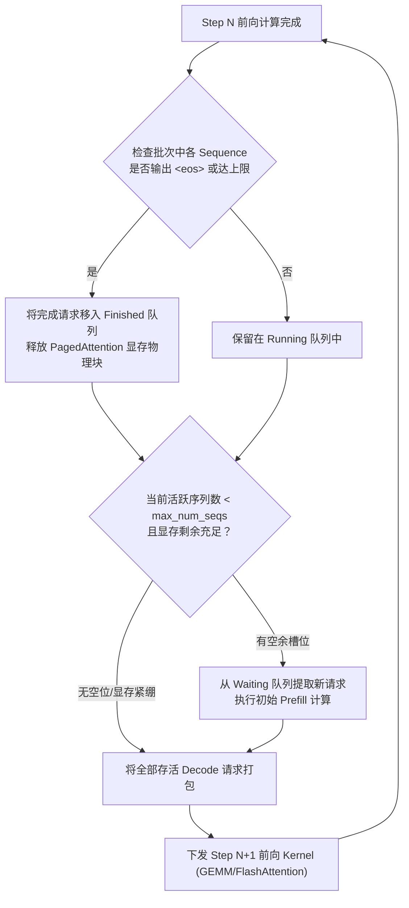
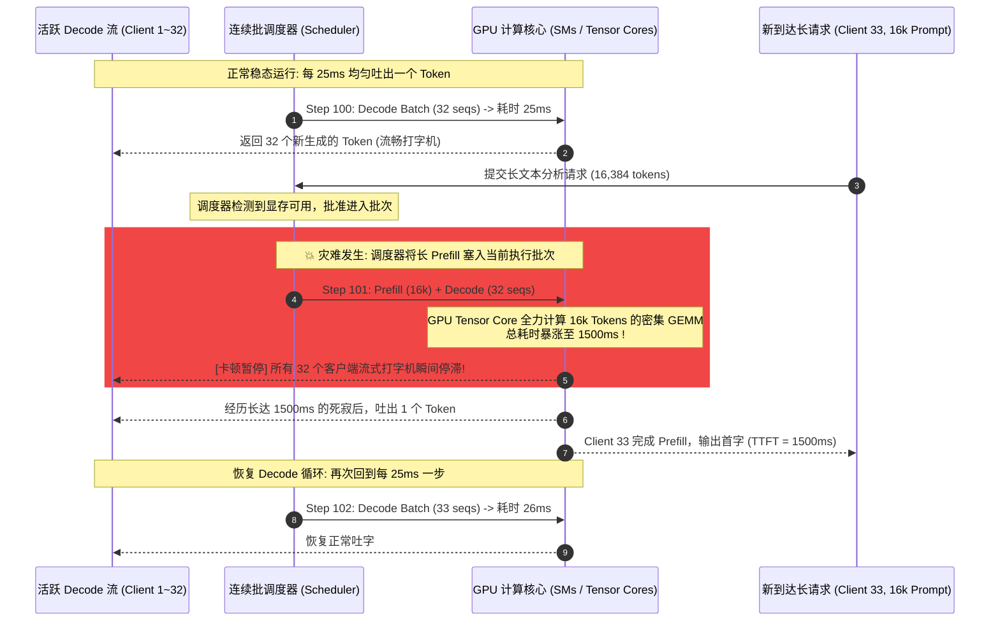
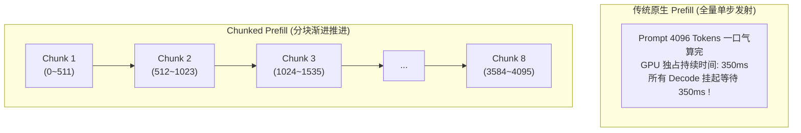
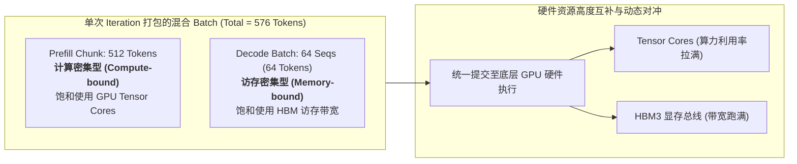
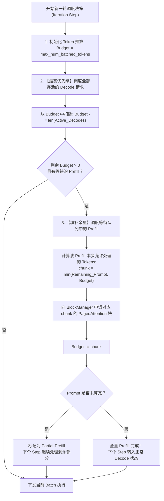

## 引言：显存墙跨过之后，调度墙降临

在前两讲中，我们完成了大模型推理系统底层物理与显存架构的奠基：
1. 在 [Roofline 模型与 Prefill/Decode 的物理撕裂](/articles/inference-roofline-prefill-decode/) 中，我们量化了 Prefill 的**计算密集（Compute-bound）**与 Decode 的**访存带宽密集（Memory-bandwidth bound）**，确立了“提升 Batch Size 是拯救 Decode 访存利用率唯一解”的核心信条；
2. 在 [PagedAttention 内存虚拟化与显存碎片终结](/articles/pagedattention-memory-virtualization/) 中，我们借助分页内存池与动态映射，将显存浪费从 80% 压制到 4% 以下，扫清了并发批大小扩张的物理容量阻碍。

然而，当许多团队满怀信心地在集群中拉大并发数时，生产环境却迎来了令人绝望的“第二堵墙”——**调度墙（Scheduling Wall）**。

在业务监控大盘上，你常常会观察到这样诡异的场景：
- **GPU 利用率忽高忽低**：整体平均算力利用率看似维持在合理的 50%~60%，但请求输出的单字时延（Time Per Output Token, TPOT）却出现了**极其恶劣的断崖式尖刺（P99 抖动高达数秒）**；
- **流式输出断断续续**：终端用户看到的打字机效果不是均匀流出的，而是正在以每秒 40 个字流畅输出时，**突然毫无征兆地卡死 1~2 秒**，随后像“开闸泄洪”一样瞬间吐出一大段文字。

这种时延抖动的根源，正是自回归大模型多轮长文本服务中最臭名昭著的幽灵：**排头阻塞（Head-of-Line Blocking, 简称 HoL Blocking）**。

为了斩断排头阻塞，大模型调度架构在过去几年经历了一场波澜壮阔的演进：**从早期深度学习时代僵化的“静态批处理（Static Batching）”，跃迁至 Orca 开创的“迭代级连续批处理（Continuous Batching）”，再进一步演变为由 Sarathi-Serve 与 vLLM 发扬光大的“分块预填充（Chunked Prefill）”**。

本文将带你深入调度器内核，剖析每一次范式更迭背后的状态机转移、算力与访存的“动态拼车”物理学，以及工程落地中极其棘手的算子异构困境。

---

## 一、 古典时代的困局：静态批处理与木桶效应

在 2022 年大模型爆发初期，工业界普遍采用由传统 CNN/BERT 时代沿袭下来的**静态批处理（Static / Request-level Batching）**机制。

### 1.1 静态批处理的工作模式

```mermaid
gantt
    title 静态批处理 (Static Batching) 的严重木桶效应与资源空转
    dateFormat X
    axisFormat %s
    section Request 1 (40 toks)
    Prefill (20)       :active, p1, 0, 5
    Decode (20)        :crit, d1, 5, 25
    Pad 空转等待        :done, w1, 25, 100
    section Request 2 (10 toks)
    Prefill (5)        :active, p2, 0, 3
    Decode (5)         :crit, d2, 3, 8
    Pad 空转等待        :done, w2, 8, 100
    section Request 3 (100 toks)
    Prefill (10)       :active, p3, 0, 4
    Decode (90)        :crit, d3, 4, 94
    完成释放           :done, w3, 94, 100
    section Request 4 (最长请求)
    Prefill (15)       :active, p4, 0, 5
    Decode (95)        :crit, d4, 5, 100
    section 队列新到达
    Request 5 (阻塞排队) :milestone, m1, 10, 10
    在队列苦苦等待静态批次结束... :done, q1, 10, 100
```

在静态批处理范式下，调度器会维护一个批次缓冲队列。当请求凑齐预设的 Batch Size（例如 $B=4$）或到达最大等待窗口后，系统将这组请求打包，并在整个推理生命周期中**强行绑定为一个固定的张量形状**，直到该批次中**所有的请求全部遇到 `<eos>` 终止符才释放 GPU**。



### 1.2 静态批处理的两大原罪

这种简单的批处理方式在自回归文本生成场景下直接引发了灾难性的效率塌陷：

1. **填充气泡浪费（Padding Waste）**：
   自回归生成的长度完全由模型输出决定，不可预知。如果 Request 2 仅生成了 5 个 token 就结束了，而同一批次的 Request 4 需要生成 95 个 token，那么在后续的 90 次迭代循环中，Request 2 必须持续用无意义的 `<pad>` 填充占位。
   
   设一个批次内有 $B$ 个请求，各请求实际迭代步数为 $L_i$，则有效计算占比为：
   $$\eta_{\text{compute}} = \frac{\sum_{i=1}^B L_i}{B \times \max_{1 \le i \le B}(L_i)}$$
   当输入输出长度方差极大时，$\eta_{\text{compute}}$ 往往不足 20%，**超过 80% 的前向传播 FLOPs 都在对无效的 Padding 矩阵进行无用功**。

2. **排队排头锁死（Head-of-Line Queue Delay）**：
   在静态批次执行的数十秒时间内，GPU 被完全独占。即使队列中积压了大量轻量级请求（如只需要分类或输出单字），也必须在队列中苦等整个批次完成，导致平均等待时间与 P99 队列时延急剧飙升。

---

## 二、 Orca 的革命：迭代级调度（Continuous Batching）

2022 年，来自微软亚洲研究院与首尔国立大学的团队在 OSDI 2022 发表了里程碑论文《Orca: A Distributed Serving System for Transformer-Based Generative Models》，正式确立了现代大模型推理引擎的标准调度骨架——**迭代级调度（Iteration-level Scheduling）**，工业界更通俗地称之为**连续批处理（Continuous Batching / Dynamic Batching）**。

### 2.1 范式转换：将调度粒度下沉至单次 Step

Orca 的核心洞察极其深刻：**Transformer 自回归生成的本质是一个个离散的、逐步推进的前向传播步骤（Forward Steps）。因此，调度的基本原子单位不应该是“请求生命周期”，而应该是“单次迭代计算（Single Iteration Step）”。**

在每一次自回归 Step 之间，调度器都有一次**重新洗牌批次（Re-batching）**的机会：
- **即时退役（Immediate Retirement）**：只要某个序列生成了 `<eos>`，在该 Step 结束后立刻剔除出运行批次，归还其显存槽位；
- **即时插入（Dynamic Insertion）**：调度器检测到批次中有空余容量（Slot），在下一个 Step 立即从未完成队列中抓取新请求塞入计算流水线。



### 2.2 运行态对比：彻底粉碎 Padding 气泡

在连续批处理架构下，不同请求的生命周期完全解耦。短请求生成完毕后瞬间让位，新请求立刻填补空缺，批次始终维持在高度饱和状态：

| 调度指标 | 静态批处理 (Static Batching) | 迭代级连续批处理 (Orca Continuous Batching) |
| :--- | :--- | :--- |
| **调度基本粒度** | 请求生命周期 (Request-level) | 单步生成迭代 (Iteration-level) |
| **Padding 气泡开销** | 极高（由批次内最长序列决定，常年浪费 50%~80%） | 接近 0（序列结束立即退出，无须填充） |
| **GPU 算力利用率** | 随执行时间推移快速衰减，呈锯齿状锯齿暴跌 | 全程高位平稳，批次槽位动态填满 |
| **系统有效吞吐量** | 基线（1.0x） | **大幅提升 3x ~ 10x** |
| **新请求入队排队延迟** | 极差（必须等待整批请求生成结束） | **极优（下一个 Step 即可插队抢占槽位）** |

Orca 奠定了 vLLM、TGI、TensorRT-LLM 与 SGLang 共同的调度基石。然而，当工程师们正准备为“彻底解决调度问题”举杯庆贺时，大模型长上下文（Long-Context）时代的到来，却向连续批处理抛出了致命的毒刃。

---

## 三、 致命的缺陷：长 Prefill 引发的排头阻塞（HoL Blocking）

连续批处理能够完美运转的前提，暗含了一个关键假设：**每一个 Step 的计算耗时应该是大致均匀且短暂的。**

但在真实的在线服务中，请求的输入 Prompt 长度差异极大。当包含超长上下文（如 8k、16k 甚至 32k 的代码仓库或财报 PDF）的请求到达时，这个假设被彻底粉碎。

### 3.1 物理现实：Prefill 与 Decode 的不对称时间鸿沟

在 [Roofline 模型分析](/articles/inference-roofline-prefill-decode/) 中我们已知，Decode 阶段每个 Step 仅计算 1 个 Token，计算量极小：
- **Decode 单步耗时**：对于 LLaMA-3-70B 在 8x A100/H100 节点上，在合理的并发批大小下，单步 Decode 耗时通常在 **$15\text{ms} \sim 35\text{ms}$** 之间。这保证了用户可以获得稳定的 30~60 Tokens/s 的流畅流式体验；
- **超长 Prefill 耗时**：如果一个包含 16,384 个 Token 的超长 Prompt 到达，系统必须对其做一整次前向传播以构建其初始 KV Cache。Prefill 计算复杂度随长度呈 $O(L^2)$ 扩张，在 70B 模型上执行一次 16k Prefill，前向耗时高达 **$800\text{ms} \sim 2500\text{ms}$**！

### 3.2 排头阻塞的物理现场

当连续批处理调度器在某个 Step 决定“接纳这个长文本新请求”时，整个 GPU 计算流水线陷入了凝滞：



在上述时序中，正在享受每 25ms 吐出一个字的 32 个既有用户，其前端界面会**瞬间卡死长达 1.5 秒**！

- **对于既有用户**：单字时延 TPOT 从 25ms 瞬间恶化到 1500ms，P99 / P99.9 延迟曲线呈现极其丑陋的垂直高耸毛刺；
- **对于新到达用户**：不仅长请求自身首字时延（TTFT）漫长，若队列中积压了多个长 Prefill，后续更短的请求也会被堵在队列中动弹不得。

这就是现代大模型服务集群中最棘手的系统瓶颈：**计算密集的巨大 Prefill 霸占了共享执行流水线，导致访存密集的细碎 Decode 请求被暴力挂起，发生灾难性的排头阻塞。**

---

## 四、 Sarathi-Serve 的突围：Chunked Prefill 与动态拼车

为了根除排头阻塞，来自微软亚洲研究院与印度理工学院的研究团队在 OSDI 2024 上发表了震撼业界的论文《Taming Throughput-Latency Tradeoff in LLM Serving with Sarathi-Serve》，正式提出了**分块预填充（Chunked Prefill）**与**解码最大化批处理（Decode-Maximal Batching）**。

这一技术随后被全面引入 **vLLM**（成为其核心特性，在 vLLM V1 引擎中作为默认基石）与 **SGLang**。

### 4.1 Chunked Prefill 的核心思想：切片化

既然一次性执行 16,384 个 Token 的 Prefill 会耗时 1500ms，那**为什么一定要强求在单次迭代中把整个 Prompt 全部计算完？**

Chunked Prefill 的做法极其直观却威力巨大：**为 Prefill 设立一个严格的单次 Token 计算配额（Chunk Size，记为 $C$，工业界常用 512 或 1024）。当长 Prompt 到达时，调度器将其切分成多个 Chunk，分摊到连续的多个 Step 中渐进式完成。**

一个长度为 $L = 4096$ 的 Prompt，如果设定 $C = 512$：
- 它不再是单步耗时 350ms 的“大块头”；
- 而是被切分为 $(4096 / 512) = 8$ 个细碎切片；
- 调度器在接下来的 8 个连续 Step 中，**每个 Step 仅处理其 512 个 Token**，并持续将计算出的中间 KV Cache 写入 PagedAttention 物理块中。



### 4.2 算力与访存的“动态拼车”（Piggybacking）

如果仅仅是将 Prefill 切小，它依然要占用算力，凭什么能提升系统整体吞吐量？

答案隐藏在我们在第 1 讲所推导的 **Roofline 模型算力余量** 中。

- **Decode 的算力悲剧**：在自回归解码时，即使批大小达到 $B=64$，其算术强度（Operational Intensity）通常依然在 $10 \sim 30\text{ FLOPs/Byte}$ 之间，远远低于 H100 的物理转折点（$I_{\text{ridge}} \approx 150\text{ FLOPs/Byte}$）。此时，**GPU 的 Tensor Cores 大部分时间都在闲置等待 HBM 显存颗粒搬运数据**；
- **Prefill Chunk 的算力饱和**：单次处理 512 个 Token 的 GEMM 矩阵乘法，其算术强度足以直接越过 Ridge Point，将 Tensor Cores 的计算管线彻底塞满；
- **拼车效应（Piggybacking）**：调度器在一个 Step 中，**同时打包“1 个 Prefill Chunk（如 512 tokens）”和“所有的活跃 Decode 序列（如 64 个 tokens）”**！



这种混部创造了令人惊叹的系统增益：
1. **Decode 请求“零成本搭便车”**：因为 GPU 本身在执行 512 Token 的计算密集 GEMM 时已经唤醒了大量的 SM 单元，顺便处理 64 个 Decode Token 所带来的额外时延微乎其微（通常从 35ms 仅微增至 40ms）；
2. **彻底抹平时延断崖**：单次 Step 的执行时长上限被 $C=512$ 的计算量强行锚定，绝不可能出现 1500ms 的死寂！活跃客户端的打字机流式输出得以在稳定的 $\sim 35\text{ms}$ 节奏下持续吐字，**P99 TPOT 尖刺被削平 80%~95%**；
3. **系统吞吐量不降反升**：通过将计算密集与访存密集在单核内重叠，GPU 的整体浮点利用率（MFU）大幅攀升。

---

## 五、 工程实现的深水区：调度状态机与异构算子挑战

Chunked Prefill 思想优雅，但在工程引擎（如 vLLM / SGLang）中落地，却需要攻克极其凶险的底层挑战。

### 5.1 vLLM 的 Token 预算调度状态机

在启用了 Chunked Prefill 的调度器中，调度决策的核心不再是“序列数量”，而是**“Token 预算（Token Budget）”**。

在 vLLM 中，最重要的参数即是 `max_num_batched_tokens`（每次 Iteration 允许打包的最大 Token 总数，例如设定为 2048）：



> **调度铁律：Decode 绝对优先**。
> 调度器永远优先保障正在流式输出的 Decode 序列，确保其单字时延不中断；只有在 Decode 占不满 `max_num_batched_tokens` 时，剩余的“算力空额”才会被切给 Prefill Chunk 享用。

### 5.2 异构计算形状的 GEMM 融合难题

当一个批次内既有 Prefill Chunk（例如 512 个 Token）又有 Decode 序列（例如 64 个 Token，每个序列 1 个 Token）时，神经网络底层的权重矩阵乘法遇到了严重的形状冲突：

在自回归注意力与 FFN 计算中：
- Prefill 部分输入形状为：$X_{\text{prefill}} \in \mathbb{R}^{512 \times D}$
- Decode 部分输入形状为：$X_{\text{decode}} \in \mathbb{R}^{64 \times D}$

如果将它们拼在一起，总输入是一个展平的一维张量 $X_{\text{batched}} \in \mathbb{R}^{576 \times D}$。对于前馈网络（MLP/FFN）的线性映射，这仅仅是一个 $M=576$ 的标准 GEMM，CUBLAS 或 CUTLASS 可以极高效率地执行。

**然而，在自注意力机制（Self-Attention）中，两者的因果掩码（Causal Mask）和 KV 访问逻辑完全相反：**
1. **Prefill Chunk 的 Attention**：需要进行 Chunk 内部的因果自注意力（Causal Self-Attention），同时还要对**该序列此前所有步已经存入 Paged KV Cache 的历史 Token** 进行交叉注意力；
2. **Decode 的 Attention**：输入只有 1 个 Token（$Q$ 的长度为 1），纯粹是对其在 Paged KV Cache 中完整的历史上下文进行检索（$Q \times K^T$ 是一维向量点乘矩阵）。

**如何在一个 GPU Kernel 内统一解决这两种截然相反的 Attention 算子？**
- **早期的折中方案（Dual-Launch）**：调度器发射两个不同的 CUDA Stream，分别运行 `FlashAttention`（算 Prefill）和 `PagedAttention`（算 Decode）。但两个 Stream 共享 GPU SM 资源，会产生激烈的 L2 Cache 震荡与硬件资源争抢；
- **现代终极方案（如 FlashInfer / vLLM V1 Unified Kernel）**：采用专门定制的统一混合注意力内核（Batch Hybrid Attention Kernel）。内核利用 CUDA 线程块的分片逻辑，动态识别当前处理的 Token 属于 Prefill 切片还是 Decode 单字，在同一个 Kernel 内完成内存寻址与算力折叠，彻底消除多流并发的同步开销。

---

## 六、 生产落地指南：核心参数调优与权衡陷阱

在 vLLM 等引擎的生产部署中，启用并调优 Chunked Prefill 是一门极需严谨经验的艺术。

### 6.1 关键启动参数矩阵

```bash
# vLLM 生产推荐启动配置 (以 8x H100 部署 LLaMA-3-70B-Instruct 为例)
vllm serve meta-llama/Meta-Llama-3-70B-Instruct \
    --tensor-parallel-size 8 \
    --enable-chunked-prefill \
    --max-num-batched-tokens 2048 \
    --max-num-seqs 256 \
    --gpu-memory-utilization 0.90 \
    --block-size 16
```

各项核心参数的物理含义与调优守则如下：

1. **`--enable-chunked-prefill`**：
   开启分块预填充。在 vLLM V1 架构中，该特性已内建并默认深度启用；
2. **`--max-num-batched-tokens`（关键调控阀门）**：
   单步允许前向传播的最大 Token 阈值。
   - **如果设得太小（如 512）**：Prefill 被切得过碎，GPU Tensor Cores 无法达到完全饱和的算术强度，虽然 TPOT 极其平稳，但长 Prompt 的整体首字时延（TTFT）会显著变长，且系统整体吞吐量下降；
   - **如果设得太大（如 8192）**：单步迭代耗时再次拉长（可能达到 150ms~300ms），削弱了削平 TPOT 尖刺的效果；
   - **黄金平衡点**：在 A100/H100 硬件上，结合 70B 级别模型，**通常设置在 2048 至 4096 之间**，能在打平 TTFT 与维持 $\sim 40\text{ms}$ 极低 TPOT 之间取得最佳帕累托平衡；
3. **`--max-num-seqs`**：
   控制批次内最大并发请求条数。必须与显存总量配合，防止并发拉得过高导致频繁触发显存抢占（Preemption）。

### 6.2 必须直面的两点副作用

Chunked Prefill 并非没有代价，架构师在上线时必须清醒认知其物理置换边界：

1. **TTFT 的微量延长**：
   原本可以一次性在 350ms 内完成的 4096 Prompt，现在由于被切为 8 步并与 Decode 混部，总前向时间可能会增加至 $380\text{ms} \sim 420\text{ms}$。这是为了拯救几十个在线用户的交互体验而做出的极具性价比的置换；
2. **中间 KV 缓存写入带宽开销**：
   由于长 Prompt 是分阶段写入 PagedAttention 显存池的，在前序 Chunk 计算完成后，中间激活值必须及时下刷到 KV Cache 显存块中供后续 Chunk 寻址。调度器对物理块分配的生命周期管理复杂度显著提高。

---

## 七、 三大批处理调度范式全景横评

为了建立系统性的技术全景认知，我们将三大调度演进阶段的物理特性横向对比如下：

| 评估维度 | 静态批处理 (Static Batching) | Orca 连续批处理 (Continuous Batching) | Chunked Prefill 混合批处理 (vLLM / Sarathi) |
| :--- | :--- | :--- | :--- |
| **首创出处** | 早期深度学习框架通用模式 | OSDI 2022 (Orca 论文) | OSDI 2024 (Sarathi-Serve 论文) |
| **调度基本粒度** | 静态整批 (Request-level) | 动态单步 (Iteration-level) | Token 预算级动态分块 (Chunk-level) |
| **Padding 气泡** | 极严重（由批内最长请求决定） | 无 Padding 浪费 | 无 Padding 浪费 |
| **长 Prompt 干扰** | 整批阻塞数十秒 | **引发剧烈排头阻塞 (HoL)**<br/>Decode 被迫挂起数秒 | **彻底消除排头阻塞**<br/>以统一步长平稳迭代 |
| **单字时延 (TPOT) P99** | 极度不规律，尾部方差极大 | 遭遇长文本时**突发 10x~50x 尖刺** | **极度平滑稳定 (稳定在 20~40ms)** |
| **首字时延 (TTFT)** | 排队等待时间不可控 | 较快（下一个 Step 即可启动） | 略有折损，但排队时延大幅压降 |
| **GPU 硬件利用率** | 算力空转严重 (MFU &lt; 20%) | 中等 (MFU 30%~45%) | **高 (MFU 50%~65%，算力访存互补)** |
| **底层算子实现** | 原生静态形状 Dense GEMM | 动态变长 Ragged GEMM | 混合统一 Hybrid Attention 内核 |

---

## 常见问题 (FAQ)

### Q1: 既然 Chunked Prefill 会稍微拉长总的 Prefill 耗时，在什么业务场景下应该关闭它？

在**离线批处理任务（Offline Batch Processing）**中应该关闭 Chunked Prefill。例如：大规模文档离线信息抽取、代码库全量离线索引嵌入、离线评估打分等场景。

在离线场景下，没有“在线人类用户”守在屏幕前观察流式打字机，系统完全不需要关心 TPOT 抖动与单字流式交互 SLA，唯一追求的北极星指标是**整体吞吐量（Tokens per Second per Dollar）**。此时直接采用全量 Prefill 跑满最大 GEMM 矩阵尺寸，计算效率最高，无须承担分块切片与调度状态机碎片化的细微开销。

而在任何有**在线流式交互需求（如智能对话、Coding Copilot、实时语音 Agent）**的高并发场景下，Chunked Prefill 几乎是必须开启的强制选项。

### Q2: 开启 Chunked Prefill 后，如果显存依然耗尽，调度器会如何处理发生“显存争抢”的请求？

即使有 Chunked Prefill，当极端并发到来时，物理 KV 缓存池依然可能耗尽。此时调度器会触发**抢占机制（Preemption）**。

在 vLLM 中，抢占策略遵循“后进先出”或“低优先级优先”：
1. **重新计算模式（Recomputation / Drop & Recompute）**：调度器直接强行终止某些正在处于 Decode 阶段的末尾请求，将其已经生成的物理 KV 块直接释放归还系统，将请求重新丢回 Waiting 队列。待显存危机解除后，重新从头进行 Prefill 并恢复生成；
2. **换出模式（Swapping）**：将牺牲者的物理 KV 块通过 PCIe 链路拷贝到主机 CPU 内存中（Swap out），待 GPU 显存有空位后再换回（Swap in）。

因此，生产环境不能盲目将 `max_num_seqs` 设得无限大，必须根据 GPU 物理显存余量预留安全水位（如 `--gpu-memory-utilization 0.90`）。

### Q3: Chunked Prefill 已经能做到算力与访存混部，为什么业界（如 Mooncake、vLLM V1 Disaggregated Serving）还要追求更激进的 Prefill-Decode 分离（P/D Disaggregation）架构？

Chunked Prefill 是在**“单台物理节点内部”**对 Prefill 与 Decode 矛盾的极致调和，但它在物理上依然共享了同一套显存、同一套 PCIe/NVLink 总线和同一组 SM 计算核心：
1. **硬件选型妥协**：Prefill 需要极致的 FLOPs（算力芯片，如 H100 SXM），Decode 需要极致的显存带宽与容量（如大显存的 H200 或更廉价的带宽卡）。单机混部意味着所有机器都必须堆叠昂贵的高规格算力卡；
2. **KV Cache 跨节点隔离需求**：在超大规模集群中，长文档的 Prefill 可能会被路由到特定的大算力池，而 Decode 阶段可以通过高速 RDMA 远端直接读取其分布式 KV Cache。

在后续文章中，我们将专门拆解 **Mooncake 架构与 Prefill-Decode 分离（P/D Disaggregation）服务系统**，看业界顶级架构师是如何跳出单机思维、在数据中心网络层重塑推理服务范式的。
