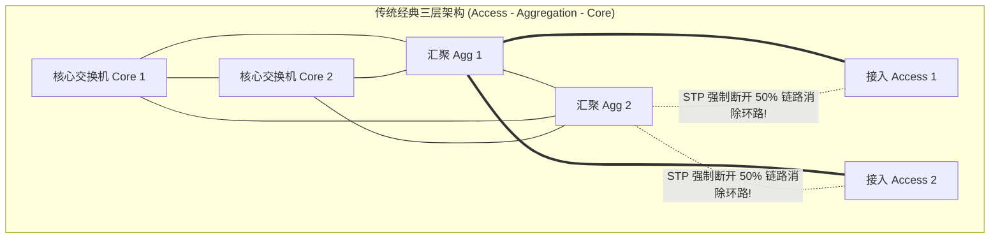
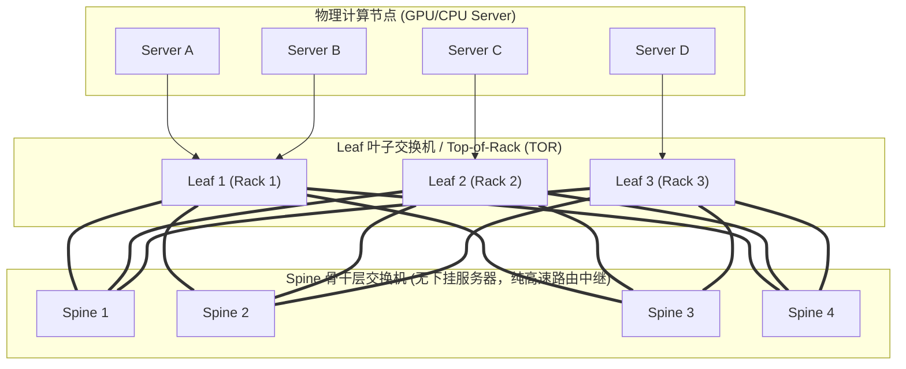
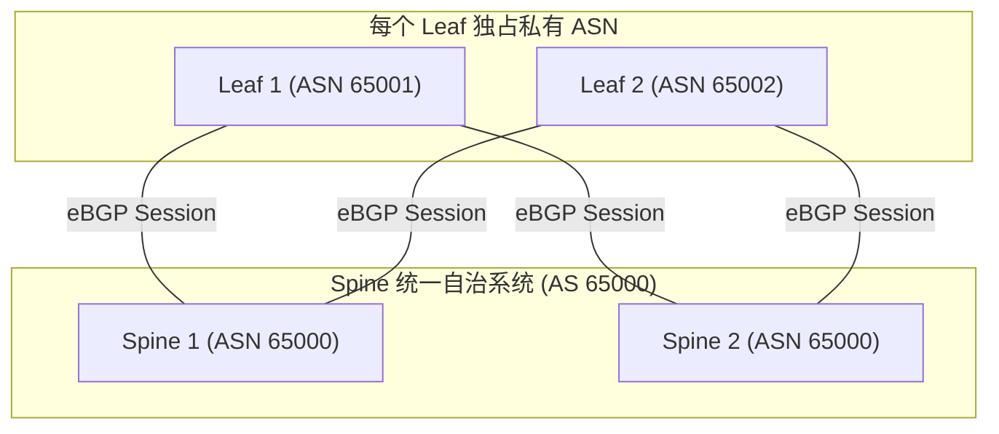
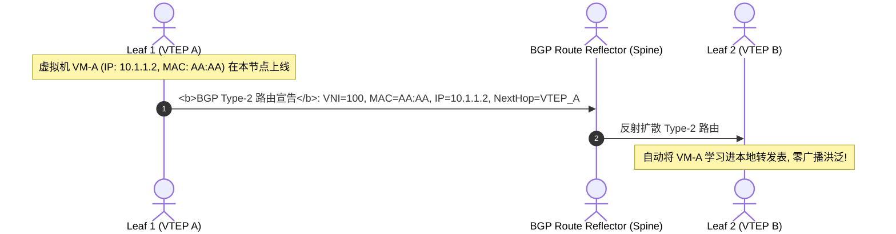

## 引言：从南北向传统网络，到东西向分布式算力洪流

在专栏第七讲 [Linux 内核网络子系统硬核剖析：从网卡驱动、NAPI 机制、Ring Buffer 到 eBPF XDP 极速转发](/articles/linux-kernel-networking-napi-ring-buffer-skbuff-xdp/) 中，我们见证了单台主机操作系统如何在内核驱动层与 eBPF 中实现微秒级的包收发流转。

然而，当数千台服务器被装入机架、汇聚成现代云计算中心与万卡 AI 智算集群时，网络世界的物理挑战被放大了数万倍。

在过去的传统企业 IT 时代，数据中心网络流量以**南北向（North-South Traffic，客户端到服务器）**为主。网络架构普遍采用经典的“接入层（Access）- 汇聚层（Aggregation）- 核心层（Core）”三层树状拓扑。

为了防止二层广播风暴，交换机强制运行 **STP（生成树协议）**，以人工阻断（Block）一半物理链路为代价来消除环路：
- **物理带宽利用率仅有 50%**：高昂采购的核心光纤常年处于闲置待命状态；
- **汇聚层收敛比严重畸变**：随着下挂服务器增多，汇聚交换机到核心交换机的上行带宽严重不足，收敛比高达 10:1 甚至 20:1；
- **东西向通信时延不可控**：服务器 A 到同一机房内的服务器 B 传输数据，数据包必须一路向上爬升到核心层，再原路下折，经历多跳排队延迟。

进入云计算、微服务、分布式存储以及 2026 年爆发的 **AI 大模型万卡分布式训练时代**，数据中心内部服务器之间相互交换模型权重、梯度与 RPC 的**东西向流量（East-West Traffic）占比突破了 80% 以上**！

传统的 STP 三层网络彻底瘫痪。为了支撑海量服务器之间任意两点的高带宽、低时延全互通，现代数据中心网络迎来了彻底的体系重构。

---

## 一、 架构范式革命：传统三层架构 vs 现代两层 Leaf-Spine

要透彻理解现代网络，必须先看透它所革新的对象 —— 传统三层架构。



### 1.1 传统三层架构的三大致命死穴
1. **STP 链路杀手**：为了防止二层环路广播风暴，生成树协议（STP）强行将汇聚层到接入层的一半物理光纤置为阻塞状态（Discarding/Blocking）。一半昂贵的光纤常年作为“冷备”在睡觉，利用率仅 50%；
2. **严重的带宽收敛瓶颈（Oversubscription）**：接入交换机下挂 48 台服务器（共 48Gbps），但上行到汇聚交换机往往只有 2 到 4 根千兆链路（2~4Gbps），**收敛比高达 12:1 到 24:1**！机架内的服务器一旦同时向外部通信，汇聚层瞬间爆仓丢包；
3. **东西向跳数抖动与长尾延迟**：相邻两个机架的服务器通信，数据包必须经历“接入 $\to$ 汇聚 $\to$ 核心 $\to$ 汇聚 $\to$ 接入”长达 4 跳的来回折返，每一跳的队列抖动都会成倍放大。

---

## 二、 Clos 交换理论与现代 Leaf-Spine 拓扑数学建模

现代数据中心网络物理架构的数学基石，源于贝尔实验室数学家 Charles Clos 在 1953 年发表的电话交换网络研究 —— **Clos 网络（Clos Network）**。现代网络将其折叠实现为 **两层 Leaf-Spine 架构**：

### 1.1 2-Tier Leaf-Spine（折叠 Clos 拓扑）



#### 拓扑铁律
1. **全互联（Full Mesh）**：每一台 Leaf 交换机必须且仅连接到所有的 Spine 交换机；
2. **同层隔离**：Spine 之间禁止互联，Leaf 之间禁止互联；
3. **两跳确定性时延（Deterministic 2-Hop Latency）**：任意机架的 Server A 到任意异构机架的 Server B，**数据包跨越交换机的路径永远且严格等于 3 跳（Leaf 1 $\to$ 任一 Spine $\to$ Leaf 2）**，消除了传统网络的跳数不确定性。

### 1.2 无阻塞（Non-blocking）与收敛比（Oversubscription Ratio）数学推导

衡量数据中心网络是否会出现拥塞的核心指标是**收敛比（Oversubscription Ratio）**：

$$R = \frac{\text{下行面向服务器的总物理带宽}}{\text{上行面向 Spine 的总物理带宽}}$$

假设一台 64 口 400Gbps 的 Leaf 交换机：
- 下行连接 32 台服务器，每台网卡 400Gbps：下行总带宽 $32 \times 400\text{Gbps} = 12.8\text{Tbps}$；
- 上行使用 32 个端口分别连接到 32 台 Spine 交换机：上行总带宽 $32 \times 400\text{Gbps} = 12.8\text{Tbps}$。

此时收敛比为：

$$R = \frac{12.8\text{Tbps}}{12.8\text{Tbps}} = 1:1$$

- **1:1 无阻塞网络（Non-blocking Fabric）**：即便机柜内所有服务器以 100% 线速全双工向外部同时发送流量，上行物理链路也绝对不会发生任何带宽瓶颈！在高性能 AI 训练网络中，1:1 收敛比是刚性底线；
- **超大规模 3-Tier Clos 拓扑**：当集群服务器数量突破单层 Leaf-Spine 端口承载极限（数千台到数万台）时，业界采用 Pod 化设计，在 Spine 之上引入 **Super-Spine**，形成五级 Clos（3-Tier Folded Clos）。

---

## 二、 Underlay 底层网络：eBGP 路由与 ECMP 五元组哈希极化

物理连线搞定后，如何在无环的前提下把流量均摊到所有 Spine 交换机？数据中心普遍采用 **L3 路由到机柜顶（Routing on the Host / ToR）**。

RFC 7938（由 Facebook/Meta 工程师联合制定）确立了现代超大规模数据中心的标准 Underlay 协议：**eBGP（外部边界网关协议）**。



### 2.1 为什么是 eBGP 而非 OSPF/IS-IS？
1. **故障爆炸半径最小化**：OSPF/IS-IS 是链路状态协议（Link-State），单根光纤抖动会触发全网洪泛计算 SPF，极易引发全网 CPU 占满雪崩；eBGP 是距离矢量路径协议（Path Vector），天然具备精准路由衰减与步步过滤机制；
2. **环路预防极简**：利用 BGP 属性 `AS_PATH`，只要发现路径包含自身 ASN 立刻丢弃，天然杜绝路由环路。

### 2.2 ECMP 等价多路径与“哈希极化（Hash Polarization）”灾难

Leaf 交换机到达目标目的 IP 时，拥有去往多个 Spine 的等价路由。交换机 ASIC 硬件通过计算报文的**五元组散列（五元组：源 IP、目的 IP、协议号、源端口、目的端口）**：

$$\text{Egress Port} = \text{Hash}(\text{SrcIP, DstIP, Protocol, SrcPort, DstPort}) \pmod N$$

#### 致命灾难：哈希极化（Hash Polarization）
在多层 Clos 网络中，如果 Leaf 交换机和 Spine 交换机采用**完全相同且无扰动的哈希多项式算法**：
- 第一层 Leaf 已经根据哈希值将奇数流分配给 Spine 1，偶数流分配给 Spine 2；
- 当流量抵达 Spine 时，Spine 再次运行相同的哈希函数，导致所有原本经过特定链路的流量**全部被映射到下一级的同一侧端口**，另一侧链路完全空置！
- **生产解法**：现代交换机 ASIC（如 Broadcom Tomahawk 系列）强制在每一层级引入独立的 **Hash Seed（哈希盐值）**，并在微秒级检测链路队列深度，支持 **DLB（Dynamic Load Balancing，动态流负载均衡）**。

---

## 三、 Overlay 虚拟化网络：EVPN-VXLAN 深度解密

物理 Underlay 虽好，但它是一个纯三层（L3）路由网络。而多租户云计算、容器跨节点漂移、K8s CNI 大二层通信，强烈要求在不同的物理宿主机之间保持**虚拟局域网（L2）的连通性**。

### 3.1 VXLAN：MAC-in-UDP 报文物理封装透视

VXLAN（RFC 7348）将虚拟机的二层 MAC 帧直接打包塞入标准物理 UDP 报文中：

```
VXLAN 数据包物理层层嵌套结构:
+-------------------------------------------------------------------------+
| 外层物理以太网头 (Outer MAC) : Egress NIC MAC -> Next-Hop Switch MAC   | 14B
+-------------------------------------------------------------------------+
| 外层物理 IP 头 (Outer IP)     : VTEP_A IP -> VTEP_B IP (物理路由寻址)    | 20B
+-------------------------------------------------------------------------+
| 外层 UDP 头 (Outer UDP)       : SrcPort(五元组Hash) -> DstPort(固定 4789)| 8B
+-------------------------------------------------------------------------+
| VXLAN 头部 (VXLAN Header)     : Flags(8b) + VNI(24b, 1600万虚拟网络)   | 8B
+-------------------------------------------------------------------------+
| 内层原始以太网头 (Inner MAC)  : VM_A MAC -> VM_B MAC                    | 14B
+-------------------------------------------------------------------------+
| 内层原始应用负载 (Inner Payload): 虚拟机实际发送的 TCP/IP 数据报文        | ~1460B
+-------------------------------------------------------------------------+
```

1. **突破 4096 VLAN 瓶颈**：VXLAN 拥有 **24 位 VNI（VXLAN Network Identifier）**，支持最多 $2^{24} \approx 1677\text{万}$ 个完全隔离的虚拟租户网络；
2. **UDP 源端口哈希**：VXLAN 将内层报文五元组计算出的 Hash 写入外层 UDP 的源端口（SrcPort），**使得物理网络中的 Spine/Leaf 交换机无需感知 VXLAN 内容，即可天然通过标准 ECMP 将同一个虚拟机的不同流均摊到所有物理光缆上！**
3. **Jumbo Frame（巨型帧）刚性要求**：外层封装额外增加了 $14 + 20 + 8 + 8 = 50$ 字节开销。为了防止虚拟机内部 1500 MTU 报文在物理层被分片撕裂，**Underlay 交换机物理端口必须强制将 MTU 调整为 9000 或 9216 字节！**

### 3.2 控制平面救星：MP-BGP EVPN

早期的传统 VXLAN 没有独立的控制平面，只能采用洪泛学习（Flood and Learn）机制，把 ARP 请求以组播方式广播给全网所有的 VTEP，极易造成大二层网络瘫痪。

**EVPN（RFC 7432 / RFC 8365）** 引入了 MP-BGP 作为统一的控制平面。VTEP 节点通过 BGP NLRI 路由宣告，在安静的控制平面中交换虚拟机的 MAC 和 IP：



- **Type-2 路由（MAC/IP Advertisement Route）**：用于宣告单个终端主机的 MAC 和 IP 地址绑定关系，彻底告别 ARP 组播广播；
- **Type-3 路由（Inclusive Multicast Ethernet Tag Route）**：用于 VTEP 之间动态建立无状态的 BUM（广播、未知单播、组播）头端复制通道；
- **Type-5 路由（IP Prefix Route）**：用于跨网段、跨租户的纯三层路由宣告，打通跨 VPC 与跨机房的高性能互联。

---

## 四、 Linux 宿主机原生 VXLAN 实战配置

在两台物理宿主机（Host A: `192.168.10.1`, Host B: `192.168.10.2`）之间手工拉起 VXLAN 互通隧道：

```bash
# 1. 在 Host A 上创建 VXLAN 设备 (VNI=100, 物理网卡为 eth0, 默认目的端口 4789)
ip link add vxlan100 type vxlan \
    id 100 \
    dev eth0 \
    local 192.168.10.1 \
    remote 192.168.10.2 \
    dstport 4789

# 2. 为虚拟 VXLAN 接口配置大二层私网 IP 并拉起
ip addr add 10.100.0.1/24 dev vxlan100
ip link set vxlan100 up

# 3. 在 Host B 上对向配置
ip link add vxlan100 type vxlan \
    id 100 \
    dev eth0 \
    local 192.168.10.2 \
    remote 192.168.10.1 \
    dstport 4789
ip addr add 10.100.0.2/24 dev vxlan100
ip link set vxlan100 up

# 4. 宿主机双向 ping 测试 (跨物理三层走 VXLAN 大二层打通)
ping 10.100.0.2
```

---

## 五、 总结与进阶预告

从 Clos 网络拓扑的数学收敛比推导，到 eBGP Underlay 与 ECMP 哈希极化破除，再到 EVPN-VXLAN 的 MAC-in-UDP 报文隧道化与控制平面信令，现代数据中心网络完成了对物理拓扑与逻辑业务的彻底解耦。

然而，哪怕我们将 Leaf-Spine 网络的带宽堆到 400Gbps / 800Gbps，**传统的以太网传输范式在超级 AI 算力集群面前依然迎来了死局**：
- **CPU 拷贝与内核上下文切换的毁灭性开销**：当网络吞吐达到 400Gbps 时，CPU 需要把 80% 以上的核心全部拿来处理 TCP 协议栈的中断与内存拷贝，导致算力被严重吞噬；
- **微秒级延迟的刚性需求**：在万卡并行分布式大模型训练中，GPU 的每一次 All-Reduce 同步都需要等待最慢的节点。传统的毫秒级 TCP 延迟直接导致价值数十亿的 GPU 算力集群全面陷入等待饥饿！
- 究竟什么是 **RDMA（远程直接内存访问）**？它如何通过 **内核旁路（Kernel Bypass）与零拷贝（Zero-Copy）** 将端到端通信延迟压缩至 1 微秒以内？
- 在没有昂贵专用交换机的情况下，基于以太网的 **RoCEv2** 是如何通过 PFC（优先级的流控）与 ECN/DCQCN 打造“无损以太网”的？

在接下来的**专栏第九讲**中，我们将全面踏入高性能计算与 AI 通信的绝对硬核领域 —— **[RDMA 高性能通信基石：Kernel Bypass、Zero-Copy、Queue Pair 机制与无损以太网 RoCEv2 (PFC/ECN) 全景透视](/articles/rdma-kernel-bypass-zero-copy-queue-pair-rocev2-lossless/)**！

---

## 常见问题 (FAQ)

### Q1: 为什么超大规模数据中心 Underlay 普遍抛弃 OSPF/IS-IS，而全面倒向 eBGP？
**根本原因：自治域隔离（Blast Radius Control）、策略控制粒度以及 SPF 计算的 CPU 瓶颈。**
1. **链路抖动雪崩**：OSPF 和 IS-IS 是基于 Dijkstra 算法的链路状态协议（Link-State）。在拥有数万根光纤和千台交换机的大规模 Clos 拓扑中，任何一根光模块或跳线的偶发抖动（Flap），都会导致全网交换机泛洪 LSA 报文并重算最短路径树（SPF），极易将交换机控制引擎的 CPU 瞬间打满并引发路由全网振荡；
2. **eBGP 的天然优势**：eBGP 是基于路径矢量的协议，路由信息逐跳更新。通过在机柜顶（Leaf）配置独立私有 ASN，路由更新具备极强的阻尼（Damping）和过滤能力。同时 BGP 拥有最丰富的属性控制（Community、MED、Local-Preference），让网络团队能够精细实现流量工程（Traffic Engineering）和无损发布（BGP Maintenance Mode）。

### Q2: 什么是 Clos 网络中的 ECMP“哈希极化（Hash Polarization）”，工程上有哪些硬核解法？
**定义**：在 2-Tier 或 3-Tier Clos 拓扑中，当多级交换机运行完全相同的多项式哈希函数对五元组进行寻路时，上一级交换机散列后的流量特征在下一级被重复计算，导致进入特定交换机的流量被全部集中导向下一级的同一个出口，使得其他等价链路处于完全饥饿状态的现象。
**工程治理方案**：
1. **逐级添加不同的 Hash Seed（哈希盐值）**：让每一层交换机（Leaf 层、Spine 层、Super-Spine 层）使用不同的盐值扰动哈希结果；
2. **硬件级动态负载均衡（Dynamic Load Balancing, DLB）**：现代 ASIC（如 Tomahawk 4/5）放弃静态逐包哈希，转为**流粒度（Flowlet）或报文微突发感知**。交换机实时监控各出口队列的拥塞深度，一旦发现某条路径有积压，自动将新的 Flowlet 动态调度至轻载链路，从物理芯片层面消灭极化与微拥塞。

### Q3: 在 EVPN-VXLAN 分布式网关设计中，对称 IRB（Symmetric IRB）与非对称 IRB（Asymmetric IRB）有什么本质区别？
**根本区别在于跨子网（跨 VNI）三层路由时，VTEP 节点是否需要在两端都配置目标子网的 L2 VNI。**
- **非对称 IRB（Asymmetric IRB）**：源 VTEP 负责执行三层路由，将流量直接转入目的子网的 L2 VNI，然后通过 VXLAN 封装发往目的 VTEP；目的 VTEP 收到后仅做二层桥接转发。**致命缺陷**：源 VTEP 必须预先配置全网所有租户的 L2 VNI 和 ARP 表项，在大规模多租户网络中导致 VTEP 交换机硬件转发表项（TCAM）迅速爆仓；
- **对称 IRB（Symmetric IRB）**：引入全局统一的**三层 VNI（L3 VNI / Tenant VRF）**。源 VTEP 执行一次路由，将报文封装至 L3 VNI 隧道中发给目的 VTEP；目的 VTEP 解封装后，在其本地 VRF 中再次执行一次路由转入目标本地子网。**优势**：两端 VTEP 只需要关心自己本机挂载的子网和通用的 L3 VNI，各交换机转发表项体积缩小一个数量级，是现代云数据中心绝对的标准架构。
