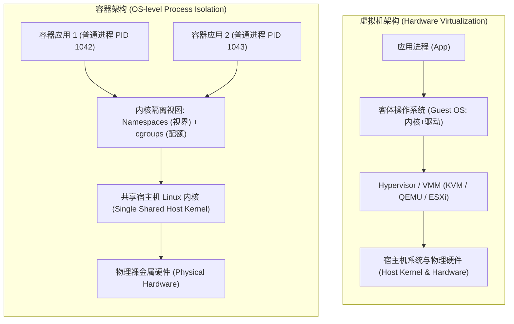
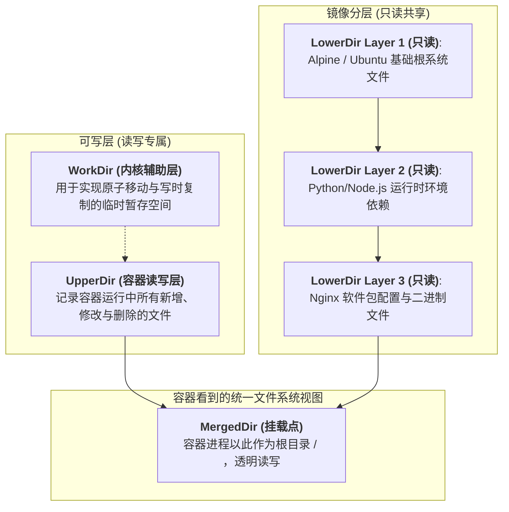
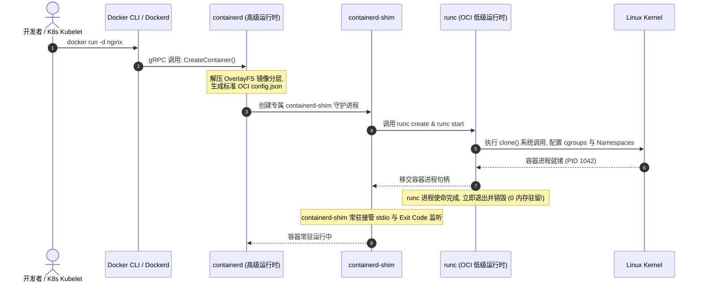

## 引言：打破“容器是轻量级虚拟机”的认知幻觉

在云计算与云原生技术普及的今天，许多开发者在初识 Docker 时常常听到这样一句形象的比喻：**“容器是一种轻量级的虚拟机”**。

在教学层面，这个比喻非常便于理解应用打包与隔离的概念；但在系统工程与生产架构层面，**“容器是轻量级虚拟机”在底层物理现实中完全是一个彻底的认知幻觉**。



从真实的 Linux 操作系统视角来看：
- **虚拟机（Virtual Machine）**：拥有自己独立且完整的 Guest OS 内核，通过 Hypervisor（如 KVM）进行指令拦截与硬件模拟。哪怕空载运行，一个虚拟机也需要启动完整的虚拟 CPU、虚拟内存页表以及独立的内核系统调用表，初始化耗时往往长达数十秒，内存开销数以百兆计；
- **容器（Container）**：**在宿主机内核中，根本不存在所谓的“容器”这种独立硬件实体！** 每一个在 Docker 中运行的容器，本质上都只是**宿主机内核直接调度的一个普普通通的 Linux 进程**。你用 `docker run` 跑起来的 Nginx，在宿主机的 `ps -ef` 进程树里就是一个实实在在的进程，由同一个 Linux 内核分配时间片、共享同一套系统调用接口。

容器之所以能让我们产生“独立小电脑”的错觉，完全归功于 Linux 内核提供的三大约束与障眼法技术：
1. **Namespace（命名空间）**：障眼法，障其“视界”（让你只能看到容器自己的进程、网络、挂载点）；
2. **cgroups（控制组）**：紧箍咒，限其“资源”（限制其最大能吃多少 CPU、内存与 IO 带宽）；
3. **rootfs & OverlayFS（联合文件系统）**：改其“天地”（将其根目录替换为打包好的镜像视图，并支持分层复用与写时复制）。

本文作为**《从 Docker 到 Kubernetes：云原生容器与集群编排架构指南》**的开篇之作，将抛弃一切应用层概念包装，带你钻入 Linux 内核空间的第一性原理，彻底解构容器的底层生命轨迹。

---

## 一、 视界隔离：Linux Namespaces 机制与“手写最小容器”

Linux Namespace 解决的核心命题是：**如何让一个普通进程以为自己拥有整台物理机？**

在 Linux 内核中，全局资源（如进程树 PID、网络设备网卡、挂载点、用户 ID）原本是全系统单例共享的。Namespace 机制允许内核为不同的进程组分配独立的视图副本。当进程在某个 Namespace 内查询系统状态时，内核只向其返回该 Namespace 局部的视图。

### 1.1 六大核心 Linux Namespace 矩阵

| 命名空间 (Namespace) | 内核引入版本 | 隔离的物理系统资源 | 容器中的直观表现 |
| :--- | :--- | :--- | :--- |
| **PID (Process ID)** | Linux 2.6.24 | 进程编号树 | 容器内部主进程的 PID 永远为 `1`，看不到宿主机其他进程 |
| **Mount (mnt)** | Linux 2.4.19 | 文件系统挂载点 | 容器内部拥有专属的 `/` 根目录挂载视图，与宿主机目录解耦 |
| **Network (net)** | Linux 2.6.29 | 网络协议栈、设备、路由、端口 | 拥有独立的 `eth0`、IP 地址、`iptables` 规则表与端口监听空间 |
| **UTS (UNIX Timesharing)**| Linux 2.6.19 | 主机名（Hostname）与域名 | 容器可以拥有独立的自定义 Hostname，不污染宿主机主机名 |
| **IPC (Inter-Process)**| Linux 2.6.19 | 进程间通信（共享内存、信号量） | 阻止不同容器之间通过 SysV 消息队列或 POSIX 共享内存窥探通信 |
| **User** | Linux 3.8 | 用户与用户组 ID (UID/GID) | 容器内部的 `root` 用户在宿主机映射为非特权普通普通用户（安全加固） |

### 1.2 系统调用第一性原理：用 30 行 C 语言手写一个容器

Docker 底层并没有任何魔法。所有容器的诞生，在内核层全部源于三个基础系统调用：
- `clone()`：创建新进程的同时，传入 `CLONE_NEW*` 标志位创建新的命名空间；
- `unshare()`：允许当前已有进程脱离原来的 Namespace 并步入新 Namespace；
- `setns()`：将一个进程加入到一个已经存在的 Namespace 中（这正是 `docker exec` 的底层原理！）。

我们来看一段极简的 C 语言程序，它展示了容器启动的最本源代码：

```c
#define _GNU_SOURCE
#include <sched.h>
#include <stdio.h>
#include <stdlib.h>
#include <sys/wait.h>
#include <unistd.h>

#define STACK_SIZE (1024 * 1024)
static char child_stack[STACK_SIZE];

// 容器内部执行的“主进程”
int container_main(void* arg) {
    printf("[容器内部] 当前进程 PID: %d\n", getpid());
    sethostname("my-isolated-container", 21);
    
    // 替换为交互式 Shell
    char* const args[] = {"/bin/sh", NULL};
    execv("/bin/sh", args);
    return 0;
}

int main() {
    printf("[宿主机] 正在为容器进程分配独立 Namespaces...\n");

    // 关键内核系统调用: clone + 传入各大 CLONE_NEW* 隔离标志
    int flags = CLONE_NEWPID | CLONE_NEWUTS | CLONE_NEWNS | CLONE_NEWNET | CLONE_NEWIPC | SIGCHLD;
    
    pid_t child_pid = clone(container_main, child_stack + STACK_SIZE, flags, NULL);
    if (child_pid < 0) {
        perror("clone 失败");
        exit(1);
    }

    printf("[宿主机] 容器子进程已创建，其在宿主机真实 PID 为: %d\n", child_pid);
    waitpid(child_pid, NULL, 0);
    printf("[宿主机] 容器子进程已退出。\n");
    return 0;
}
```

编译并执行这段代码后：
- 在宿主机通过 `ps aux | grep sh` 查看，这个 Shell 的 PID 可能是 `18423`；
- 但在 Shell 内部执行 `echo $$`，你会惊奇地发现它的 PID **恰恰是 1**！

**这就是容器的本质**：内核在创建进程时，将进程描述符（`task_struct`）中的 `nsproxy` 指针重定向到了一组新建的命名空间结构体中。

在宿主机上，你可以通过 `/proc/<PID>/ns/` 目录下的一组符号链接，直观地看到任何一个运行中容器的 Namespace inode 节点：

```bash
# 查看某个容器进程在宿主机内部挂载的各 Namespace 唯一 inode
ls -l /proc/18423/ns/
# 输出类似:
# lrwxrwxrwx 1 root root 0 net -> 'net:[4026532489]'
# lrwxrwxrwx 1 root root 0 pid -> 'pid:[4026532492]'
# lrwxrwxrwx 1 root root 0 mnt -> 'mnt:[4026532490]'
```

---

## 二、 资源紧箍咒：cgroups 从 v1 割裂到 v2 单根树的工业级重构

有了 Namespace，进程虽然无法窥探其他进程的视界，但如果容器内部运行着一个恶意死循环脚本（如 `while true; do :; done`），它依然能够将宿主机的 64 核 CPU 瞬间占满，或者通过不断 `malloc()` 申请内存把物理机内存榨干导致整机死机崩溃。

为了限制进程对物理计算资源的消耗，Linux 内核引入了 **cgroups（Control Groups，控制组）**。

### 2.1 cgroups 的底层实现与调度器钩子

cgroups 并不是在进程外部运行监控守护进程，而是**直接内嵌在 Linux 内核的物理调度器（如 CFS 完全公平调度器）与内存子系统中**：
- **CPU 限制**：通过在 CFS 调度器中为 cgroup 分配配额（Quota）与时间周期（Period）。如果一个容器被限制使用 1 个核心，CFS 在每一个周期（默认 $100\text{ms}$）内最多只允许该容器内的所有线程执行 $100\text{ms}$ 的 CPU 时间。配额耗尽后，该容器的所有线程会被调度器强制移出运行队列（Throttled），直到下一个周期到来；
- **内存限制**：在内核物理页帧分配函数 `alloc_pages()` 中插入计数钩子。当 cgroup 申请的物理内存总量（RSS + Swap + Page Cache）达到上限时，内核会立刻触发局部页面回收（Page Reclaim）；若仍不足，直接对该 cgroup 内部的进程唤醒 **OOM Killer（Out of Memory Killer）** 给予致命的 `SIGKILL` 终止，而宿主机的其他进程安然无恙。

### 2.2 cgroups v1 的致命设计缺陷

在早期的 Linux 内核（Linux 4.5 以前）中，工业界广泛使用的是 cgroups v1。v1 采用了**多层级独立树（Multi-hierarchy Tree）**的设计：

```text
cgroups v1 割裂的独立目录树:
/sys/fs/cgroup/
  ├── cpu/docker/<container_id>/      <-- CPU 子系统单独一棵树
  ├── memory/docker/<container_id>/   <-- Memory 子系统单独一棵树
  └── blkio/docker/<container_id>/    <-- Block IO 子系统单独一棵树
```

这种割裂设计在生产环境中引发了灾难性的系统级痛点：
1. **协同死锁与记账不一致**：Page Cache（页面缓存）的写回同时涉及“内存分配”与“块设备 IO（blkio）”。但在 v1 中，`memory` 与 `blkio` 属于两棵完全平行的树，内核根本无法知道某一块脏页面属于哪个具体的 blkio 组，导致**容器的文件写入 IO 限速长期处于失效状态**；
2. **多线程归属混乱**：一个多线程进程的内部不同线程，可以被随意塞入不同的 cgroup 节点，导致资源层级混乱不堪。

### 2.3 cgroups v2 单根树重构与现代工业标准

为了彻底终结 v1 的混乱，Linux 内核自 4.5 起由内核维护者 Tejun Heo 全面重构并推出了 **cgroups v2**，并在 2022~2026 年成为各大主流 Linux 发行版（Ubuntu 22.04+、RHEL 9+、Debian 12+）以及 Kubernetes 生产集群的唯一默认标准。

cgroups v2 确立了**单一联合层级树（Single Unified Hierarchy）**与**“仅叶子节点可包含进程（No Internal Process Constraint）”**的核心原则：

```text
cgroups v2 统一单根树架构:
/sys/fs/cgroup/
  └── docker/
      └── <container_id>/
          ├── cgroup.controllers   # 声明该组启用的子系统: "cpu memory io pids"
          ├── cgroup.procs         # 加入该组的进程 PID
          ├── cpu.max              # CPU 配额: "200000 100000" (代表限额 2.0 核)
          ├── memory.max           # 内存硬上限: "2147483648" (2GB)
          ├── memory.high          # 内存软预警上限 (自动平滑回收，避免突发 OOM)
          ├── io.max               # 磁盘读写 IOPS 与 带宽限制
          └── pids.max             # 限制最大进程数 (彻底防范 fork 炸弹)
```

在 cgroups v2 下，`memory`、`cpu` 与 `io` 实现了严格的闭环统一记账：
- **`memory.high` 与 `memory.max` 分级缓冲**：当容器内存冲破 `memory.high` 时，内核开始异步对该容器进行剧烈的主动页面写回与内存回收，并适度降频限速，只有真正突破 `memory.max` 且无法回收时才触发 OOM 杀进程。这种缓冲机制使得生产环境的内存利用率提升了 30% 以上，极大地避免了毛刺流量下的虚假 OOM 重启。

---

## 三、 存储魔术：OverlayFS 联合挂载与镜像分层复用

有了视界与配额，我们还必须回答一个关键问题：**容器启动后，它所看到的那个干干净净的 Ubuntu 或 Alpine 根文件系统（rootfs），到底是从哪来的？**

如果每次 `docker run` 都完整地从磁盘拷贝一份 2GB 的 Ubuntu 操作系统文件，那么磁盘空间会在几分钟内耗尽，容器启动也会慢如蜗牛。

Docker 的神来之笔，正是引入了 **联合文件系统（Union File System, UnionFS）**，而今天工业界无可争议的绝对王者就是内核原生的 **OverlayFS（overlay2）**。

### 3.1 OverlayFS 四层目录核心架构

OverlayFS 的核心魔法，在于将多个不同物理路径的目录，在内存中“透明叠加”并呈现为一个统一的合并目录（Merged Directory）：



四层目录的职责划分清晰严谨：
1. **LowerDir（底层只读层）**：构成容器镜像的不可变层。一个镜像由多层 `LowerDir` 堆叠而成（每个 Dockerfile 指令如 `RUN`、`COPY` 生成一层）。**无论你在单机上启动 100 个基于同一镜像的容器，这 100 个容器都完全共享同一份底层的只读磁盘数据，物理占用只有 1 份！**
2. **UpperDir（上层读写层）**：当容器被创建时，Docker 为该容器分配一个专属的、私有的、可读写的小目录。容器在运行期间的所有写入操作，全都落在这里；
3. **WorkDir（工作层）**：Linux 内核 OverlayFS 的内部临时缓冲目录，用于处理跨层移动文件与权限变更时的事务原子性；
4. **MergedDir（合并挂载层）**：操作系统向容器主进程暴露的最终根视图（`rootfs`）。容器通过 `chroot` 或 `pivot_root` 系统调用将进程的根目录绑定到此。

### 3.2 动态读写流：写时复制（CoW）与白化删除（Whiteout）

容器在运行中操作文件时，OverlayFS 的内核驱动遵循极其精妙的动态路由规则：

#### 1. 读操作（Read）
- 如果文件存在于 `UpperDir`（容器已修改过该文件），直接从 `UpperDir` 读取；
- 如果文件不在 `UpperDir`，内核会自顶向下穿透各层 `LowerDir` 进行查找，命中后直接从底层只读镜像层读取；
- 由于底层文件是只读的，内核 Page Cache 可以被跨容器极其高效地共享。

#### 2. 写操作（Copy-on-Write, 写时复制）
- 当容器试图修改一个来自基础镜像的文件（例如修改 `/etc/nginx/nginx.conf`）时，内核会触发 **写时复制（CoW）**：
  1. 将该文件从底层的 `LowerDir` 完整拷贝一份到上层的 `UpperDir` 中；
  2. 容器进程在 `UpperDir` 的这一份本地拷贝上进行写入修改；
  3. 底层 `LowerDir` 中的原始文件完好无损，其他共享该镜像的容器完全不受影响！

> [!WARNING]
> **性能避坑指南**：如果容器需要对一个体积长达 10GB 的大文件进行原地修改，OverlayFS 在首次写入时会触发完整的大文件跨层拷贝，引发短暂的磁盘 IO 剧烈毛刺！这也是为什么高 IO 负载的数据库（如 MySQL、PostgreSQL）必须通过 **Docker Volume（数据卷）** 挂载外部原生目录，绕过 OverlayFS 联合文件系统层。

#### 3. 删除操作（Whiteout，白化文件机制）
如果一个文件只存在于底层的只读 `LowerDir`，容器进程执行了 `rm -f file.txt`，底层文件显然不能被物理删除，那么 MergedDir 是如何向容器隐藏该文件的呢？
- 内核会在 `UpperDir` 中创建一个与被删文件同名的**特殊字符设备文件（Device 0,0），这被称为“白化文件（Whiteout）”**；
- 当 MergedDir 向容器进程列出目录内容时，一旦扫描到 Whiteout 文件，内核就会自动过滤并隐藏掉底层同名文件，从而在逻辑上呈现出“该文件已被彻底删除”的效果。

---

## 四、 现代容器运行时生态标准：OCI、containerd 与 runc

在理解了 Namespace、cgroups 与 OverlayFS 之后，整个现代容器生态在宏观层面的调用链路便豁然开朗。

在 2015 年以前，Docker 是一个庞大且臃肿的单体守护进程（Monolithic Daemon），所有的网络、镜像下载、存储驱动与进程启动全部塞在同一个 `dockerd` 进程中。一旦守护进程崩溃重启，宿主机上运行的所有容器会全部无情挂掉。

为了解决这一问题，整个开源社区联合制定了 **OCI（Open Container Initiative，开放容器倡议）标准**，将容器技术分层解耦为标准化生态：



这套三层架构体现了工业级设计的极致优雅：
1. **高级运行时（High-level Runtime: containerd）**：
   负责镜像拉取、镜像解压、OverlayFS 存储分配、网络配置（CNI 调用）以及容器元数据生命周期管理；
2. **OCI 规范与低级运行时（Low-level Runtime: runc）**：
   `runc` 严格遵循 OCI Runtime Spec。它只做一件事：读取包含 Namespace 和 cgroups 配置的 `config.json`，调用 Linux 内核系统调用拉起容器进程，**随后立刻自我销毁退出**，完全不常驻占用系统内存；
3. **无缝守护者（containerd-shim）**：
   每个容器对应一个轻量的 `shim` 进程，它作为容器主进程的父进程。**这彻底解耦了容器进程与后台守护服务的强绑定** —— 哪怕 `containerd` 或 `dockerd` 升级、崩溃或重启，容器进程依然能毫无感知地在后台持续运行，不会掉线！

---

## 五、 总结与专栏全景导读

回顾 Linux 容器的第一性原理：
- **容器不是虚拟机**：它是由 Linux 内核直接调度的物理进程；
- **Namespace 构筑了它的视界**：让普通进程拥有了专属的 PID 树、网络协议栈与挂载视图；
- **cgroups v2 铸造了它的牢笼**：以统一单根层级树精确掌控 CPU 时间片、内存弹性水线与 IO 带宽；
- **OverlayFS 赋予了它轻盈的肉身**：以只读层共享与写时复制（CoW），实现了秒级容器启停与极致的磁盘复用。

掌握了单机容器进程与存储的核心本质后，下一个摆在所有系统架构师面前的核心命题是：**隔离在独立 Network Namespace 中的容器，到底是如何与宿主机、同机其他容器、以及浩瀚的外部网络进行数据包通信的？**

在接下来的**专栏第二讲**中，我们将深入内核网络子系统，解剖 **[容器单机与跨主机网络进阶：veth-pair、Linux Bridge、iptables NAT 与跨主机网络拓扑](/articles/container-networking-veth-bridge-iptables/)**，带你用 `ip route` 与 `iptables` 物理追踪每一个网络报文的飞渡轨迹！

---

## 常见问题 (FAQ)

### Q1: 为什么在容器内部执行 `top` 或 `free -m` 时，看到的依然是宿主机的整机 CPU 核心数和总内存大小？
这是由 Linux 内核的历史设计决定的：
`top`、`htop` 与 `free` 命令底层并不是通过特定的系统调用读取数据，而是直接读取 `/proc` 伪文件系统下的 `/proc/meminfo` 与 `/proc/stat`。而在 Linux 内核中，`/proc` 文件系统中的大部分硬件指标属于全局共享视图，**并不受容器 cgroups 配额的自动映射拦截**。
如果容器被 cgroups 限制使用 2GB 内存，但宿主机拥有 128GB 内存，容器内的 Java/JVM 或 Node.js 运行时如果不加干预，会误以为自己可用 128GB 内存并据此按比例预分配堆空间，从而瞬间打爆 2GB 的 cgroups 硬限制并被内核 OOM 斩杀！
现代工业界的解决方案包括：
1. **升级现代运行时**：Java 11+ / 17+ 已原生支持 cgroups 探测（`-XX:+UseContainerSupport`）；
2. **挂载 LXCFS**：通过 FUSE 用户态文件系统，将针对该容器 cgroups 算出的局部虚拟数值动态覆写挂载到容器的 `/proc/meminfo` 和 `/proc/stat` 上，使传统运维工具显示真实配额。

### Q2: 为什么生产环境中必须坚决废弃 `--privileged`（特权模式）？
当给容器赋予 `--privileged` 标志时，Docker 会关闭几乎所有的内核安全防护：
1. 容器能够直接绕过 Device 白名单，访问宿主机的所有物理硬件设备节点（如 `/dev/sda`、物理网卡等）；
2. 容器内部的 root 用户拥有真实的 `CAP_SYS_ADMIN` 等全部 Linux Capabilities 特权；
3. 容器内部进程可以随意挂载宿主机的真实文件系统并注入内核模块，**这等同于容器逃逸的零门槛开放**。
生产级安全最佳实践应当是遵循“最小特权原则”：永远禁用特权模式，仅通过 `--cap-add` 精确授予业务所需的特定能力（例如网络抓包仅赋予 `NET_ADMIN`），并结合只读根文件系统（`--read-only`）构筑纵深防御。

### Q3: 容器镜像的只读层如果在底层发生物理损坏，会不会扩散波及到所有正在运行的容器？
会受到影响，因为所有基于该镜像的容器在 `LowerDir` 物理上都直接只读映射到宿主机存储路径下的同一组文件块（如 `/var/lib/docker/overlay2/<layer_id>`）。
如果宿主机底层的 NVMe/SSD 产生物理坏道导致特定只读层文件损坏，所有尝试从该层读取该文件的容器进程都会抛出 `IO Error`。
然而，由于容器的任何修改操作都会强制先将副本写时复制（CoW）到各自独立的 `UpperDir`，一个容器被破坏或写脏的数据**在物理机制上绝对不可能反向渗透污染到共享的底层镜像层**，因此一个容器逻辑上的崩溃不会污染其他容器的只读数据。
