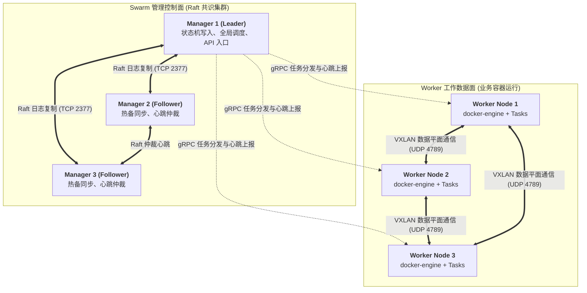
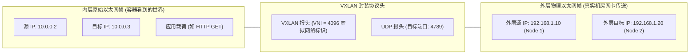
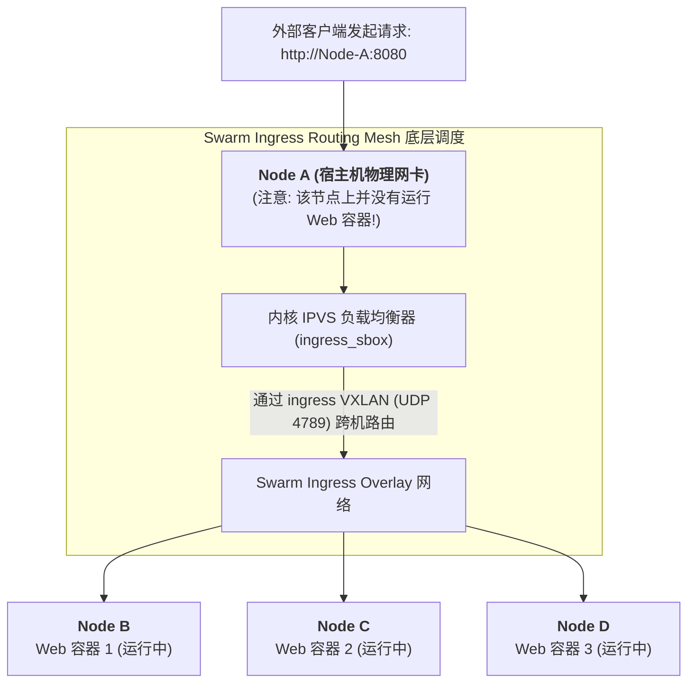

## 引言：为什么我们需要轻量级集群编排？

在过去的十年里，云原生领域发生了一场波澜壮阔的容器编排战争。最终，功能极其庞大、生态无边无际的 Kubernetes 赢得了这场战争，成为了无可争议的事实工业标准。

然而，在严肃的企业级工程实践中，许多架构师常常忽视了一个冷酷的现实：**Kubernetes 的强大是以极度陡峭的学习曲线、昂贵的运维人力和巨大的控制面开销为代价的**。
- 为了搭建并维护一个生产级高可用 K8s 集群，你需要独立规划 `etcd` 集群、深入调试复杂的 CNI/CSI 插件、配置证书轮换、维护 Ingress Controller，并在成百上千个 YAML 资源清单中疲于奔命；
- 对于由 3~30 台服务器组成的中小型业务集群、边缘计算节点、或追求极速交付的工程团队而言，**K8s 往往成了“杀鸡用牛刀”的典型过度设计（Over-engineering）**。

在单机 Docker 与复杂的 Kubernetes 之间，存在一个优雅的折中点：**Docker Swarm（SwarmKit）**。

一条 `docker swarm init` 命令，你不需要安装任何外部依赖，不需要配置第三方数据库，Docker 瞬间就地变身为一个具备**跨节点调度、自愈容错、滚动升级、服务发现与跨机网络负载均衡**的分布式生产级集群！

本文作为**《从 Docker 到 Kubernetes：云原生容器与集群编排架构指南》**的第三篇，将带你跳出单机思维，深入 SwarmKit 内核，彻底解构其内置的 **Raft 共识机制**、**VXLAN 跨机覆盖网络** 以及 **Ingress Routing Mesh（路由网格）** 的精巧设计。

---

## 一、 SwarmKit 核心架构：Manager 与 Worker 节点拓扑

Docker Swarm 的底层引擎是 **SwarmKit**。它将物理节点清晰划分为两类角色：**Manager（管理节点）** 与 **Worker（工作节点）**。



### 1.1 节点分工与声明式模型

1. **Manager 节点**：
   - 负责响应管理员的 API 请求，维护集群的全局期望状态（Desired State）；
   - 运行内置调度器（Scheduler），将服务拆解为具体的任务实例（Tasks / Containers）并分发给最空闲的 Worker；
   - 核心 Manager 之间通过 **Raft 算法** 维护分布式一致性内存数据库，**完全省去了类似 K8s 对外部 etcd 的强依赖**！
2. **Worker 节点**：
   - 纯粹的计算执行单元。运行常规的 Docker Engine，接收来自 Manager 派发的任务清单并拉起容器；
   - 定期通过安全的 TLS gRPC 连接向 Manager 汇报当前容器的运行状态与存活心跳（Heartbeat）。如果某个 Worker 节点失联超时，Manager 会自动将其上的容器重新漂移调度到健康节点上（自愈容错）。

### 1.2 为什么生产集群推荐 3 或 5 个 Manager 节点？

Swarm 的控制平面遵循典型的 **多数派原则（Quorum）**。若 Manager 节点数为 $N$，集群能够容忍的宕机节点数为：

$$F = \left\lfloor \frac{N - 1}{2} \right\rfloor$$

- 当部署 **3 个 Manager** 时，集群法定人数为 2，最多允许 1 台 Manager 宕机，集群控制面仍能持续决策；
- 当部署 **5 个 Manager** 时，集群法定人数为 3，最多允许 2 台 Manager 宕机；
- **偶数节点是反模式**：配置 4 个 Manager 并不能提升容错能力（容忍故障数依然为 1），反而增加了网络复制开销并更容易遭遇脑裂风险。

---

## 二、 零外部依赖：内置 Raft 分布式强一致状态机

在 Kubernetes 架构中，最令运维工程师头疼的组件之一莫过于 `etcd` 的独立维护、备份与调优。

而 Docker Swarm 的设计哲学是**“开箱即用（Batteries Included）”**。SwarmKit 直接在其代码库内部内嵌了一个基于 Go 语言实现的完整 **Raft 一致性引擎**：

```
SwarmKit 内存状态机存储流水线:
用户执行: docker service scale web=5
             │
             ▼
      Manager (Leader)
             │
   ┌─────────┴─────────┐
   ▼                   ▼
内存状态变更       Raft 事务日志预写 (WAL)
                       │
                       ▼
       通过 TLS 2377 同步广播至其他 Managers
                       │
                       ▼
           超过半数 (Quorum) 节点 ACK 确认
                       │
                       ▼
   正式提交并持久化至本地 BoltDB (/var/lib/docker/swarm/)
```

### 2.1 极简容灾与安全加密

- **全链路双向 mTLS 加密**：在执行 `docker swarm init` 的瞬间，集群便自动创建了一个内置的根证书颁发机构（Root CA）。所有新加入的节点必须携带加密令牌（Join Token），节点与 Manager 之间的所有通信全部通过 TLS 1.3 自动加密，证书默认每 90 天自动轮换，零运维介入！
- **自动解锁机制（Autolock）**：为了防止物理硬盘被盗导致 Raft 日志泄露，Swarm 提供了静态数据加密锁。管理员可配置解锁密钥，重启宿主机后必须输入密钥才能解锁并解密内存状态。

---

## 三、 跨主机虚拟大二层：VXLAN Overlay 覆盖网络剖析

在第二讲中我们提到，不同物理节点各自的 `docker0` 网桥会发生严重的 IP 重叠冲突。

Docker Swarm 的解法是引入 **Overlay 网络驱动**，其底层物理核心是 Linux 内核原生的 **VXLAN（Virtual Extensible LAN）** 协议。

### 3.1 VXLAN 的数据包封装机制（Mac-in-UDP）

VXLAN 的本质是**“跨越三层物理网络，凭空架设一条虚拟的二层局域网”**。

当 **Node 1 上的容器 (`10.0.0.2`)** 向 **Node 2 上的容器 (`10.0.0.3`)** 发送数据时，数据包在出网卡前被 Linux 内核赋予了神奇的二次封装：



1. **二层捕获**：容器发出的原始以太网帧被宿主机的虚拟网卡 `vxlan0`（VTEP 节点）捕获；
2. **内核打包（Encapsulation）**：Linux 内核给原始报文穿上一件“外衣”：加上一个 8 字节的 VXLAN 报头（包含 VNI 虚拟局域网编号），外面再套上一层标准的 **UDP 报头（目的端口为标准 `4789`）**，外层的源/目的 IP 填写真实的物理机 IP（`192.168.1.10` $\to$ `192.168.1.20`）；
3. **物理飞渡**：机房的普通物理路由器和交换机看到的只是一个普普通通的 UDP 单播包，以毫秒级线速直接送达 Node 2；
4. **解包还原（Decapsulation）**：Node 2 内核监听在 4789 端口，剥去外层 UDP 和 VXLAN 外壳，露出里面完整的内层原始报文，直接送入目标容器的 `eth0`！

两端的容器全程以为彼此插在同一台物理交换机上，根本不需要关心底层跨越了多少台物理路由器和防火墙。

---

## 四、 智能负载均衡之美：Ingress Routing Mesh（路由网格）

在生产环境中，外部用户发起请求时，面临一个严峻的现实：**业务容器可能随时在集群任意一台机器上漂移或水平扩容，外部负载均衡器（如阿里云 SLB 或公网 Nginx）如何知道请求该打向哪台物理机？**

Docker Swarm 给出了一个极其优雅的设计：**Ingress Routing Mesh（路由网格）**。

### 4.1 任意节点皆可接入

在 Swarm 集群中，当你创建一个发布了端口的服务（例如 `docker service create -p 8080:80 --replicas 3 my-web`）：
- **集群内的“每一个节点”（无论它上面是否真正运行着这个容器）都会在宿主机上静默监听 `8080` 端口！**
- 外部客户端请求集群中 **任意一台机器的 8080 端口**，Routing Mesh 都会自动通过内部网络将请求智能路由并负载均衡到真正运行该容器的健康节点上！



### 4.2 底层内核实现：专用网络命名空间与 IPVS

Routing Mesh 的高性能并不是由用户态的反向代理（如 Nginx）实现的，而是直接在 Linux 内核层通过 **IPVS（IP Virtual Server）** 完成的：
1. Swarm 在每台主机上创建一个隐藏的专用网络命名空间，名为 **`ingress_sbox`**；
2. 当数据包抵达物理节点的 `8080` 端口时，宿主机 iptables 规则直接将其无缝重定向到 `ingress_sbox` 中；
3. `ingress_sbox` 内部配置了高性能的内核级 **IPVS 负载均衡表**，使用轮询（Round-Robin）算法将流量直接线速分发给后端健康的容器虚拟 IP（VIP）；
4. 甚至连容器内部的 DNS 服务发现（`127.0.0.11`）也是完全去中心化的，请求服务名（如 `http://my-web`）时，DNS 直接返回 Swarm 统一分配给该服务的虚拟 IP。

---

## 五、 选型决战：Docker Swarm vs Kubernetes 全景工程权衡

面对两种截然不同的编排哲学，企业架构师该如何在 Swarm 与 K8s 之间做出明智的技术选型？

| 考量维度 | Docker Swarm (SwarmKit) | Kubernetes (K8s) |
| :--- | :--- | :--- |
| **架构哲学** | **极简主义、开箱即用、约定优于配置** | **无限扩展、完全解耦、万物皆对象模型** |
| **部署与上手门槛** | **极低**（克隆即跑，1 行命令集群就绪） | **极高**（需体系化掌握 30+ 种核心资源对象与底层插件） |
| **控制面资源开销** | **极小**（轻量进程，可常驻在 1GB 内存小机） | **较重**（推荐至少 2~3 节点且单节点 4~8GB 内存支撑 etcd） |
| **生态扩展与自定义** | 有限（通过 Docker 驱动扩展，无通用 CRD） | **无与伦比**（CRD、Operator、Webhook、自定义调度器） |
| **自动扩缩容能力** | 支持手动伸缩或简单的命令触发 | **工业级自动化**（HPA、VPA、KEDA 基于事件/指标弹性自愈） |
| **存储编排与有状态** | 基础 Volume 挂载，缺乏高级 CSI 抽象 | **成熟工业标准**（CSI、动态 PV/PVC 供给、StatefulSet） |
| **AI 智算与 GPU 调度**| 基础 GPU 直通，不支持精细拓扑与分时复用 | **统治级地位**（NVIDIA GPU Operator、MIG、NUMA 拓扑感知） |
| **适合业务体量** | 3 ~ 50 台主机、中小微企业、边缘物联网、内部平台 | 50 ~ 数万节点、大型互联网微服务、智算 GPU 大集群 |

---

## 六、 总结与进阶预告

Docker Swarm 展示了工业软件设计中**“如无必要，勿增实体（奥卡姆剃刀）”**的最高美学境界：
- 用最少的概念（Service、Task、Stack），解决了 80% 常见 Web 微服务集群的核心痛点；
- 内置 Raft 与 VXLAN，让中小团队在数分钟内拥有了生产级高可用与服务自愈能力。

然而，当企业的业务规模从数十台节点跨越到数百台节点，当无状态服务演进为包含复杂拓扑依赖的有状态分布式数据库，当我们的算力中心涌入成百上千张昂贵的 NVIDIA GPU 需要进行精细化调度与自动故障转移时，Swarm 的能力边界便显露无遗。

在接下来的**专栏第四讲**中，我们将正式跨入云原生的终极殿堂，全面剖析现代分布式操作系统的王牌中枢 —— **[Kubernetes 控制平面深度解密：声明式 API、etcd 状态机与控制器调谐循环 (Reconciliation Loop)](/articles/k8s-control-plane-declarative-reconciliation/)**，带你从底层理解 K8s 究竟如何用声明式控制理论统一全球数据中心！

---

## 常见问题 (FAQ)

### Q1: 在生产环境搭建 Docker Swarm 集群时，网络防火墙需要放行哪些关键端口？
必须严格确保物理节点之间放行以下核心端口：
1. **TCP 2377**：Swarm 集群管理通信端口（用于 Manager 节点之间的控制面 Raft 共识复制与 Worker 节点纳管）；
2. **TCP 与 UDP 7946**：节点之间的 Gossip 协议发现与健康检查心跳广播；
3. **UDP 4789**：Overlay 网络的数据平面 VXLAN 报文封装传输端口（**必须确保 UDP 放行，否则跨主机的容器网络将完全无法互通！**）；
4. **IP 协议 50 (ESP)**：如果为 Overlay 网络启用了数据包加密（`--opt encrypted`），还必须放行 IPsec ESP 协议流量。

### Q2: 为什么有时外部请求访问 Swarm Routing Mesh 时，后端的真实客户端 IP 会“丢失”，变成了 10.255.x.x？如何获取真实的 Client IP？
这是由 Routing Mesh 的二层反向转发机制导致的：
当请求打到物理机 A，而运行该容器的实际实例在物理机 B 上时，Node A 的 Ingress 路由网络会通过 SNAT 将源地址改写为内网的 Ingress 虚拟 IP，从而确保回包能够安全原路返回。
**解决方案**：
1. 在服务端口映射时配置 `mode=host`（例如 `published=80,target=80,mode=host`），绕过 Ingress Mesh，直接将端口绑定在实际运行该容器的主机网络上，保留原汁原味的 Client IP；
2. 在集群前端挂载标准的反向代理（如 Traefik 或 Nginx），通过 `X-Forwarded-For` HTTP 头穿透传递真实客户端 IP。

### Q3: 当 Swarm 集群发生网络分区（Network Partition）导致 Split-Brain 时，Manager 节点会如何表现？
Swarm 的 Raft 协议在底层天然免疫脑裂风险：
如果 5 个 Manager 节点由于机柜网络中断被切分为 2 个节点区（少数派）与 3 个节点区（多数派）：
- **多数派分区（3 节点）**：仍然满足 Quorum（$\ge 3$），能够正常选出 Leader，集群继续对外提供服务的更新、调度和弹性伸缩能力；
- **少数派分区（2 节点）**：由于无法凑齐多数票，其内部的所有 Manager 会立刻拒绝所有管理写操作（直接向管理员报错），自动降级为只读模式；
- **既有业务不受影响**：各节点上已经正常运行的业务容器不会被立刻杀死，依然保持数据面的平稳运行；待物理网络恢复后，少数派会自动拉取最新的 Raft 日志并同步归队。
