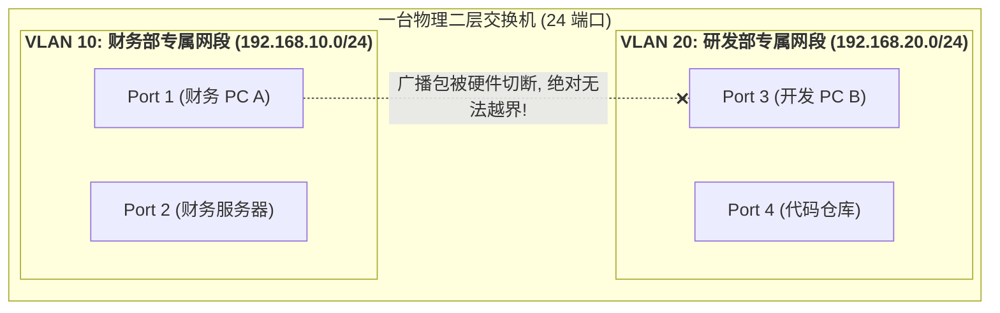
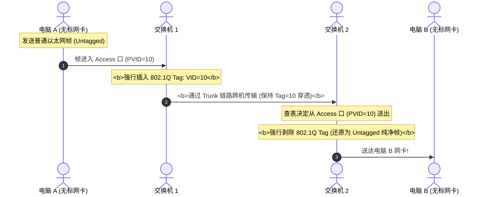
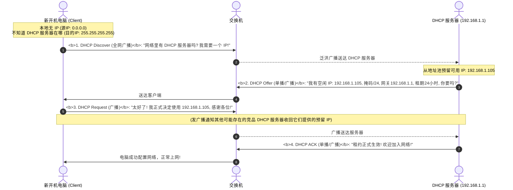
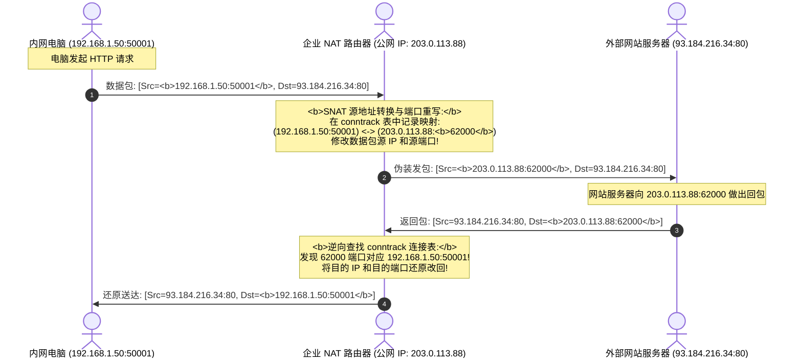

## 引言：当一个机房拥有数百名员工与多重部门

在专栏前两讲中，我们推导了二层交换机的 MAC 寻址与三层 IP 子网掩码的数学逻辑。

然而，当一家企业迅速扩张到 500 名员工、涵盖财务部、研发部、人力资源部时，**一个现实而严峻的网络管理危机随之爆发**：
- **安全隔离崩溃**：财务部的工资账单与服务器，如果和全公司所有普通电脑插在同一台交换机上，任何实习生都能用抓包软件窃听财务数据；
- **广播风暴瘫痪网络**：一台 Windows 电脑中毒狂发 ARP 广播，全公司 500 台电脑的 CPU 同时被垃圾广播包打满卡死；
- **IP 运维地狱**：总不能让网管每天拿着小本子，给每一位新入职员工的电脑手工配置 IP、子网掩码、网关和 DNS；
- **公网 IP 昂贵匮乏**：运营商只给公司分配了 1 个宝贵的公网 IP，如何让 500 台电脑同时刷网页看视频？

为了破解这四大工程难题，现代局域网诞生了三位不可或缺的“超级管家”：**VLAN（虚拟局域网）**、**DHCP（动态主机配置协议）** 与 **NAT（网络地址转换）**。

---

## 一、 VLAN（虚拟局域网）第一性原理：切碎广播域

**VLAN（Virtual Local Area Network）** 的核心思想非常简单：**在不花钱购买多台物理交换机的前提下，依靠软件逻辑，将一台物理交换机在芯片层面硬生生‘切碎’成多台完全隔离的虚拟交换机！**



- **隔离广播域**：VLAN 10 内主机发出的任何广播包（如 ARP 请求），交换机硬件**严禁向属于 VLAN 20 的端口转发**，彻底终结了广播风暴；
- **隔离安全域**：不同 VLAN 之间在二层物理上完全不通，天然阻断了局域网黑客嗅探。

---

## 二、 802.1Q 标签结构与 Access / Trunk 端口全流程

普通电脑的网卡只认标准的以太网帧。交换机是如何给数据帧打上“属于哪个 VLAN”的标记的？

答案是 IEEE 官方制定的国际标准 —— **IEEE 802.1Q 封装规范**。

### 2.1 802.1Q Tag 物理帧结构

802.1Q 协议在标准以太网帧的“源 MAC”与“类型字段”之间，强行插入了 **4 个字节（32 Bits）的 VLAN Tag**：

```text
标准以太网帧插入 802.1Q Tag 后的结构:
+-----------+-----------+-------------------------+-----------+---------------+---------+
| 目的 MAC  | 源 MAC    | 802.1Q 标签 (VLAN Tag)   | 协议类型  | 载荷数据      | FCS 校验|
| (6 Bytes) | (6 Bytes) | 4 字节 (32 Bits)        | (2 Bytes) | (46 ~ 1500B)  | (4 Bytes|
+-----------+-----------+-------------------------+-----------+---------------+---------+
                        |                         |
                        v                         v
       +------------------+-------+-----+------------------+
       | TPID (标签协议ID) | PCP   | DEI | VID (VLAN 标识符)|
       | 16 Bits (0x8100) | 3Bits | 1Bit| 12 Bits (1~4094) |
       +------------------+-------+-----+------------------+
```

1. **TPID（Tag Protocol Identifier，16 位）**：固定为 `0x8100`，告诉网卡与交换机“后面紧跟着的是 802.1Q 标签”；
2. **PCP（Priority Code Point，3 位）**：定义了 8 个优先级（0~7），用于企业网 QoS 语音/视频流量加急；
3. **VID（VLAN Identifier，12 位）**：
   $2^{12} = 4096$。其中 `0` 和 `4095` 保留，**合法可用的 VLAN ID 范围为 $1 \sim 4094$**！

### 2.2 交换机端口核心类型：Access 口 vs Trunk 口

一台交换机连接着普通员工的电脑，也连接着通往其他交换机的骨干光纤。两类端口的工作逻辑截然不同：

```text
+-------------------------------------------------------------------------------+
| Access 端口 (接入链路): 连接普通电脑、打印机、服务器                           |
|   - 特性: 只属于 1 个特定的 VLAN (如 PVID=10)                                 |
|   - 进站: 电脑发来的标准无标帧，交换机强行打上 PVID=10 的 Tag                  |
|   - 出站: 发给电脑前，交换机强行剥离 (Strip) Tag，还原为干净的标准帧送给电脑   |
+-------------------------------------------------------------------------------+
| Trunk 端口 (干道链路): 连接交换机与交换机、交换机与路由器                      |
|   - 特性: 允许携带多个不同 VLAN 的带标帧 (Tagged Frame) 同时穿透传输           |
|   - 进站/出站: 保持 802.1Q 标签毫发无损原样穿行，使得远端交换机能准确识别归属  |
+-------------------------------------------------------------------------------+
```



### 2.3 跨 VLAN 路由：单臂路由 vs 三层交换机（SVI）
划分了 VLAN 后，如果研发部（VLAN 10）确实需要访问财务部（VLAN 20）的发票系统，怎么连通？
- **单臂路由（Router-on-a-stick）**：用一根光纤将交换机的 Trunk 口连到路由器，在路由器物理接口上创建逻辑子接口（如 `eth0.10`、`eth0.20`），由路由器执行三层跨网段路由；
- **三层交换机（Layer 3 Switch）**：现代企业网标配。交换机硬件内置路由转发表芯片（ASIC），直接在交换机内部为每个 VLAN 配置**虚接口（SVI, Switch Virtual Interface，如 `interface Vlan 10`）**作为网关，以数万兆线速在片上芯片完成跨 VLAN 极速转发！

---

## 三、 DHCP 动态主机配置协议：DORA 四步握手机理

有了网段，员工开机插上网线，操作系统是如何在 1 秒钟内拿到 IP 地址的？

这依赖应用层基于 UDP 协议（服务端端口 67，客户端端口 68）运行的 **DHCP 协议**。其核心被称为 **DORA 四步流程**：



- **租期续约机制（Renewal）**：
  - **T1 计时器（租期过半，50%）**：电脑主动向原 DHCP 服务器单播发送 DHCP Request。若收到 ACK，租期刷新重新计时；
  - **T2 计时器（租期用掉 87.5%）**：若原服务器挂掉一直未响应，电脑破釜沉舟向全网发出广播 DHCP Request，向任意可用的备用 DHCP 服务器请求救命续约；若到 100% 仍无应答，立即释放 IP，退化回 `169.254.x.x` 瘫痪状态。

---

## 四、 NAT（网络地址转换）：一个公网 IP 承载全公司上网

### 4.1 核心问题：私网 IP 绝不出外网
我们在第二讲学过，RFC 1918 规定的私有地址（如 `192.168.x.x`、`10.x.x.x`）在公网骨干路由器上**会被强制无条件丢弃**。

如果整个公司只有一个运营商分配的公网 IP（例如 `203.0.113.88`），500 台内网电脑如何同时访问百度或谷歌？

**终极解法：NAPT（网络地址端口转换 / PAT）！**



### 4.2 SNAT 与 DNAT（端口映射）的本质区别

- **SNAT（Source NAT，源地址转换）**：
  - **方向**：内网电脑主动访问外网；
  - **行为**：在数据包流出路由器时，**修改源 IP 和源端口**，将私网身份伪装成公网 IP；
- **DNAT（Destination NAT / 端口映射）**：
  - **方向**：外网用户主动访问企业内网部署的 Web/SSH 服务器；
  - **行为**：在外部数据包进入路由器时，**修改目的 IP 和目的端口**。例如公网访问 `203.0.113.88:8080`，路由器硬件自动将目的地址改写为内网深处的 `192.168.1.200:80` 送达目标机器。

---

## 五、 Linux 生产级实战与网络排查命令

在 Linux 宿主机上，我们能够直接操纵 VLAN、监控连接跟踪与排查 NAT 状态：

```bash
# 1. 在物理网卡 eth0 上创建一个 802.1Q VLAN 虚拟接口 (VLAN ID = 10)
ip link add link eth0 name eth0.10 type vlan id 10
ip addr add 192.168.10.1/24 dev eth0.10
ip link set eth0.10 up

# 2. 查看 Linux 内核 Netfilter NAT 转发规则
iptables -t nat -L -n -v

# 3. 典型出网 SNAT 规则 (将所有从 eth0 离开的内网流量伪装为公网 IP)
# iptables -t nat -A POSTROUTING -s 192.168.0.0/16 -o eth0 -j MASQUERADE

# 4. 查询 Linux 内核深处的当前活跃 NAT 连接跟踪表 (conntrack)
conntrack -L -p tcp
# 关键字段解析:
# tcp 6 431999 ESTABLISHED src=192.168.1.50 dst=93.184.216.34 sport=50001 dport=80 \
#                          src=93.184.216.34 dst=203.0.113.88 sport=80 dport=62000 [ASSURED]
```

---

## 六、 总结与进阶预告

企业级局域网的三大支柱技术，构建了现代网络秩序的基石：
- **VLAN 与 802.1Q 标签** 通过 4 字节 Tag 和 Access/Trunk 端口，让单台物理交换机实现了多租户安全隔离与广播风暴粉碎；
- **DHCP** 以精妙的 DORA 四步握手，让成千上万终端设备的入网配置实现了完全自动化；
- **NAT / NAPT** 以连接跟踪表（`conntrack`）在公私网边缘动态重写 IP 与端口，解决了 IPv4 枯竭历史难题。

到目前为止，我们已经彻底征服了数据链路层（L2）与网络层（L3）的物理与逻辑世界。然而，当你的电脑成功连通网络、准备向目标服务器发起一次真正的业务请求时：
- 为什么你在浏览器里输入的是 `www.google.com` 这样的人类文本，而不是 `142.250.72.206`？全世界的 **DNS 域名解析系统** 是如何在树状根服务器中寻根究底的？
- 当数据包到达目标主机后，目标主机上同时运行着微信、浏览器、游戏、数据库，数据包怎么精确钻进那个特定的应用程序里？**端口（Port）与 Socket（套接字）** 在操作系统内核中究竟扮演什么角色？
- 为什么有些场景必须用 **UDP**，而有些场景必须用 **TCP**？

在接下来的**专栏第四讲**中，我们将跨入网络世界连接应用与传输的核心纽带 —— **[应用层与传输层枢纽：DNS 解析全流程、Socket 套接字本质与 TCP/UDP 核心对比](/articles/transport-bridge-dns-sockets-ports-udp-vs-tcp/)**！

---

## 常见问题 (FAQ)

### Q1: 为什么连在同一个交换机上的两台电脑，即使配置了完全相同的网段（如 `192.168.1.10/24` 和 `192.168.1.20/24`），只要划分在不同的 VLAN（如 VLAN 10 和 VLAN 20），就绝对无法 ping 通？
**根本原因：交换机芯片在二层转发引擎中强制执行的 VLAN ID 标签隔离与广播域阻断。**
当电脑 A 尝试 ping 电脑 B 时，由于同属 `192.168.1.0/24` 网段，电脑 A 会发出 ARP 请求广播以寻找电脑 B 的 MAC。
当该广播数据帧进入交换机的 Access 端口（属于 VLAN 10）时，交换机会在硬件层面给该帧标记上 `VID=10`。
交换机的二层转发表芯片有绝对刚性铁律：**带有 `VID=10` 的数据帧，严禁向任何 PVID 不为 10 的端口进行复制或转发**！因此电脑 B 所在的端口（属于 VLAN 20）甚至连一个电脉冲都收不到。电脑 A 永远收不到 ARP 应答，通信在二层彻底中断。

### Q2: 在单臂路由（Router-on-a-stick）组网中，为什么很容易出现所谓的“单臂带宽瓶颈（Bottleneck）”？三层交换机是如何在硬件层面根治这个问题的？
- **单臂路由的致命痛点**：所有不同 VLAN 之间的跨网段流量，都必须通过单根物理光纤先“爬上去”进入路由器的子接口，在路由器 CPU 中查表完成三层解封装与重新打标后，再沿着同一根物理光纤“滑下来”回到交换机。单根物理链路的双向带宽被瞬间腰斩，且路由器 CPU 极易因软中断打满而发生丢包和延迟飙升；
- **三层交换机的硬件根治**：三层交换机内部集成了专用的硬件交换芯片（ASIC/TCAM）与 SVI 虚接口。跨 VLAN 的流量在进入交换机后，直接由片上高速转发表在微秒级完成 IP 路由与二层标签替换，**数据包全程在交换机背板总线内以数百吉比特的线速转发，完全不经过任何外部物理路由器瓶颈**。

### Q3: 为什么两个处在不同内网中的私网设备（例如你家的电脑和你朋友家的电脑），默认无法直接发起 P2P 直连通话？所谓的“NAT 穿透（打洞，NAT Traversal）”底层原理是什么？
**根本原因：传统 NAT 路由器的安全单向性与外部未知流量拦截。**
当内网电脑没有向外部发送过数据包时，其家里的 NAT 路由器上的 `conntrack` 表中不存在任何针对外部 IP 的映射规则。当朋友从外部直接向你家的公网 IP 和端口发送 UDP 数据包时，你的路由器判定这是未知的外部恶意主动探测，会在外网入口处直接静默丢弃。
**NAT 打洞原理**：双方电脑同时借助一台位于公网的第三方中继服务器（STUN 服务器），探明各自在公网被 NAT 路由器转换后的 `<公网IP:外部映射端口>`。随后双方在微秒级时间内**同时向对端的公网端口反向发送 UDP 探测包**。这一动作强迫各自的 NAT 路由器在本地 `conntrack` 表中分别建立出站会话孔洞。当对方后续的数据包抵达时，路由器识别为“刚才我方主动联系过的合法回包”，从而顺利放行，实现穿透直连！
