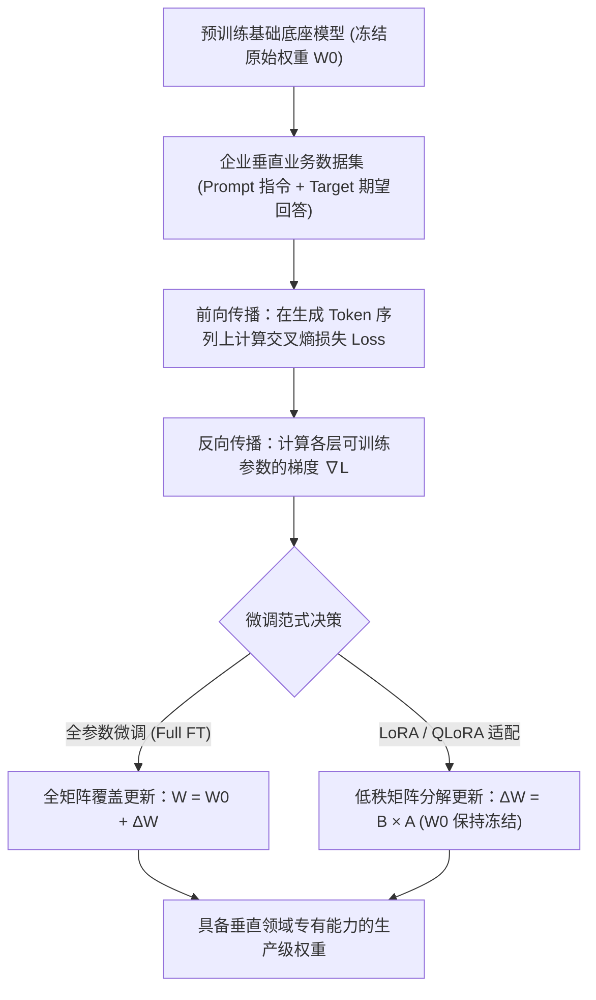

## 为什么需要微调？

尽管 GPT-5.4、Claude 4.6 等通用大模型能力强大，但在特定场景下仍存在局限：

- **领域知识不足**：医疗、法律、金融等专业领域的术语和逻辑
- **输出风格不匹配**：需要特定的语言风格、格式或行业规范
- **性能成本权衡**：用小模型 + 微调替代大模型调用，降低 80%+ 成本

> **何时微调 vs 何时用提示工程？**
> 
> 如果你的需求可以通过调整提示词和 Few-Shot 示例解决，优先使用提示工程。
> 当提示工程无法达到要求的精度/一致性时，再考虑微调。

## 大模型微调底层是如何工作的？(Under the Hood)

理解**大模型微调的底层工作原理**，必须跳出单纯的提示词范畴，从神经网络权重的数学反向传播与参数适配机制切入：



### 1. 自回归因果语言模型的目标优化函数
在监督微调（SFT）过程中，模型遵循自回归因果语言建模范式。给定长度为 $N$ 的完整输入序列 $x = (x_1, \dots, x_N)$，前序指令（Prompt）部分会被打上特殊掩码 `-100`，使反向传播计算仅严格发生在模型输出的应答 Token 上：

$$\mathcal{L}_{SFT}(\theta) = - \sum_{t=k}^{N} \log P_\theta(x_t \mid x_{<t})$$

通过梯度反向传播，算法自动更新神经网络的激活权重矩阵，使得期望的逻辑推导习惯、专有输出格式与行业术语在条件概率分布中占据统计绝对优势。

### 2. 全参数微调 vs LoRA 低秩适配原理
- **全参数微调 (Full Parameter Fine-Tuning)**：对模型中全部权重参数矩阵 $W \in \mathbb{R}^{d \times k}$ 同时计算梯度并更新。以一个 70B 模型为例，需同时加载模型本体、AdamW 优化器动量与梯度，显存开销轻松突破 1,100GB，必须依赖昂贵的多节点集群。
- **LoRA 低秩自适应 (Low-Rank Adaptation)**：前沿研究发现权重增量矩阵 $\Delta W$ 具有极低的“内在维度 (Intrinsic Dimension)”。LoRA 保持原始预训练矩阵 $W_0$ 绝对冻结，仅在旁路引入两个低秩小矩阵相乘模拟参数变化：
  $$W_{new} = W_0 + \Delta W = W_0 + \frac{\alpha}{r} (B \times A)$$
  其中 $A \in \mathbb{R}^{r \times k}$ 采用高斯分布初始化，$B \in \mathbb{R}^{d \times r}$ 初始化为全 0，秩 $r \ll \min(d, k)$（通常取 $r \in [16, 64]$）。由于仅需更新极小维度的 $A$ 和 $B$，可训练参数量骤降 99% 以上。
- **QLoRA 4-bit 极限压缩**：利用 4-bit NormalFloat (NF4) 数据格式将 $W_0$ 压缩至 4 位加载，并在前向计算时反量化至 BF16。直接将 70B 模型的底座显存从 140GB 砍至 39GB，使单张消费级 GPU 运行大模型微调成为现实。

## 企业级大模型微调高价值业务场景 (Enterprise Use Cases)

在业务决策中，究竟何时选择微调而非 RAG 或提示词工程？以下是投资回报率（ROI）最高的五大**微调核心落地场景**：

| 业务场景大类 | 企业真实落地案例 | 为什么提示词/RAG 单独无法搞定 | 推荐微调方案 |
|:---|:---|:---|:---|
| **1. 严苛结构化输出与 Schema 契约** | 生成零语法错误的高阶嵌套 JSON、特定数据库方言 SQL、工业控制 DSL 脚本。 | 依靠 Few-shot 提示词极其浪费上下文 Token，长并发下偶发语法漏括号或废话前缀。 | LoRA（基于 1,000~2,000 条清洁样本） |
| **2. 垂直行业专业行文风格与术语浸润** | 医疗临床病历规范转录、合规法律合同文本条款编写、符合财会准则的审计附注生成。 | 通用大模型经常退回泛化的“客服式客套话”，负向约束在多轮交互后容易被稀释失效。 | 行业专有语料 LoRA / QLoRA |
| **3. 复杂推理能力蒸馏 (Teacher-to-Student)** | 将顶级模型（如 Claude 3.7 / DeepSeek-R1）的思维链（CoT）能力提炼至 8B/14B 端侧轻量模型。 | 小模型原厂欠缺长链路多跳推理能力，单靠 Prompt 无法激活复杂推导逻辑。 | 合成高质量推理轨迹 + SFT 与 DPO 对齐 |
| **4. 绝对隔离的私有化数据安全主权** | 金融风控核心流水核验、军工与政务内网离线脱敏推理，彻底替代每月数十万的商业 API。 | 公有云商业 API 直接违背金融合规审查与数据出境法律；商用闭源底座无法私有化部署。 | QLoRA 蒸馏 + 本地 [vLLM 高并发推理](/articles/vllm-serving-guide/) |
| **5. 亚 50 毫秒级极速智能体工具路由** | 高频智能体运行时负责即时分发 API 调用的前端决策中枢（Router Agent）。 | 每次路由携带庞大的 Tool Definitions 提示词会成倍拉高首字延迟（TTFT）。 | 轻量级小模型 (3B~8B) 专属微调 |

## 三种微调方案对比

| 方案 | 可训练参数 | 显存需求 | 训练速度 | 适用场景 |
|------|-----------|----------|----------|----------|
| Full Fine-tuning | 100% | 极高 (80GB+) | 慢 | 资源充足、需极致性能 |
| LoRA | 0.1%~1% | 中等 (16GB) | 快 | 通用推荐方案 |
| QLoRA | 0.1%~1% | 低 (8GB) | 较快 | 消费级 GPU |

### 显存刺客：QLoRA 与 Gradient Checkpointing

在企业私有化部署中，最大的痛点永远是 **VRAM（显存）墙**。

传统的 70B 模型（如 Llama-3-70B）哪怕是做 16-bit LoRA 微调，也会轻易吃掉 150GB+ 的显存（因为你需要保存模型权重、激活值、梯度和优化器状态）。

**极致显存压缩方案 (单卡玩转 70B)：**
1. **QLoRA (4-bit NormalFloat 压缩)**：将基础底座加载为 4-bit 量化。这能将 70B 模型的静态显存占用从 140GB 暴降到约 **39GB**。关于 AWQ、GPTQ 与 NF4 的量化原理与实操选型，详见 [大模型量化实战指南](/articles/quantization-hands-on-guide/)。
2. **Gradient Checkpointing (梯度检查点)**：显存杀手的另一半是前向传播的激活值（Activations）。通过开启此功能，用**计算时间换存储空间**，丢弃中间激活值，在反向传播时重新计算。这能将激活值显存占用锐减 70%。

**权衡 (Trade-off)**：QLoRA + Gradient Checkpointing 会导致整体训练时间减慢约 25%-40%，但在显卡极度紧缺的 2026 年，这是最黄金的妥协方案。

## 完整微调流程

### Step 1：准备数据集

数据格式示例（JSONL）：

```json
{"messages": [
  {"role": "system", "content": "你是一个专业的医学问答助手"},
  {"role": "user", "content": "什么是高血压？"},
  {"role": "assistant", "content": "高血压是指动脉血压持续升高的慢性疾病..."}
]}
```

数据质量指南：
- **数量**：高质量 1000-5000 条通常足够
- **多样性**：覆盖目标场景的各种情况
- **一致性**：标注风格和格式保持统一
- **清洗**：去除重复、矛盾和低质量样本

### Step 2：配置 LoRA 训练

```python
from peft import LoraConfig, get_peft_model
from transformers import AutoModelForCausalLM, AutoTokenizer

# 加载基础模型
model = AutoModelForCausalLM.from_pretrained(
    "meta-llama/Llama-4-Scout-17B-16E-Instruct",
    torch_dtype=torch.bfloat16,
    device_map="auto",
)

# LoRA 配置
lora_config = LoraConfig(
    r=16,                    # rank：8~64，越大能力越强但越慢
    lora_alpha=32,           # 缩放系数，通常设为 2 * r
    target_modules=[         # 要注入 LoRA 的层
        "q_proj", "k_proj", "v_proj", "o_proj",
        "gate_proj", "up_proj", "down_proj",
    ],
    lora_dropout=0.05,
    bias="none",
    task_type="CAUSAL_LM",
)

# 应用 LoRA
model = get_peft_model(model, lora_config)
model.print_trainable_parameters()
# → trainable params: 13.6M || all params: 109B || 0.012%（若仅注入部分核心注意力投影层）
```

### Step 3：大规模多卡训练 (DeepSpeed ZeRO)

单卡 QLoRA 仅适合小规模验证。一旦进入生产环境的 Full Fine-Tuning 或 100 亿 Token 以上的全量 SFT，必须动用多机多卡集群，此时 **DeepSpeed ZeRO (Zero Redundancy Optimizer)** 是唯一选择：

- **ZeRO-1**：仅对优化器状态进行分片（每张卡只存 1/N）。
- **ZeRO-2**：同时分片优化器状态 + 梯度。适合 8x A100 单机训练，基本不掉速。
- **ZeRO-3**：将优化器、梯度、**以及模型权重本身**全部分片。适合百亿/千亿参数极限跨机训练，但由于通信极其频繁，如果 RDMA 网络不行，速度会灾难性下降。

```json

{
    "fp16": { "enabled": false },
    "bf16": { "enabled": true },
    "zero_optimization": {
        "stage": 2, 
        "allgather_partitions": true,
        "allgather_bucket_size": 2e8,
        "overlap_comm": true, 
        "reduce_scatter": true,
        "reduce_bucket_size": 2e8
    },
    "gradient_accumulation_steps": 1,
    "gradient_clipping": 1.0 
}
```

训练启动命令：
```bash
# 生产环境必开 --gradient_checkpointing True
accelerate launch \
    --config_file accelerate_deepspeed_config.yaml \
    train.py \
    --gradient_checkpointing True \
    --learning_rate 2e-5
```

### Step 4：评估与部署

```python
# 合并 LoRA 权重到基础模型
merged_model = model.merge_and_unload()
merged_model.save_pretrained("./merged_model")
```

### Step 5：模型对齐 (DPO 阶段)
在传统的监督微调(SFT)之后，企业级流程通常会加入**直接偏好优化 (DPO)** 来提升模型的安全性或调整语气偏好：
```python
from trl import DPOTrainer

dpo_trainer = DPOTrainer(
    model,
    ref_model=None, # PEFT 自动处理 reference
    args=training_args,
    beta=0.1,
    train_dataset=preference_dataset, # 包含 prompt, chosen, rejected 的数据集
    tokenizer=tokenizer,
)
dpo_trainer.train()
```

### Step 6：生产级部署部署 (vLLM / TGI)
在企业环境，我们不使用 HuggingFace `pipeline`，而是使用支持**连续批处理 (Continuous Batching)** 和 **PagedAttention** 的高性能推理引擎部署合并后的模型：

```bash
# 使用 vLLM 部署，并开启 OpenAI 兼容 API
python -m vllm.entrypoints.openai.api_server \
    --model /path/to/merged_model \
    --tensor-parallel-size 2 \
    --max-model-len 8192 \
    --port 8000
```

## 核心超参的工程哲学

在 2026 年，炼丹已经从“玄学调参”变成可量化的公式。请牢记以下企业级经验底线：

| 参数 | 工业标准 | 物理意义与破坏力 |
|------|----------|------------------|
| `rank (r)` | 16 ~ 128 | `r` 并不是越大越好。对于简单的语气转换模式匹配，`r=16` 足矣。对于复杂的逻辑推理或垂类知识注入，`r` 需拉高至 128。过大会导致极其严重的过拟合。 |
| `lora_alpha` | `2 × r` | 这是一个极其危险的乘数。它是 LoRA 权重添加到基础模型的缩放因子（Scaling factor）。如果你把 `r` 从 16 翻倍到了 32，请**务必**把 `alpha` 也同步翻倍到 64，否则你的学习率等同于隐性减半。 |
| `learning_rate`| 1e-4 ~ 5e-5| LoRA 需要比全参数微调高约 10 倍的学习率（通常 `2e-4` 是安全值）。如果 loss 出现锯齿状剧烈震荡，请调低 LR ；如果训练了半天 loss 不动，请优先检查是否忘记解冻（unfreeze）权重。 |
| `warmup_ratio` | 0.05 ~ 0.1 | 绝对不能设为 0。模型在刚开始训练时处于混沌状态，直接给最大 LR 会导致权重产生不可逆的破坏（Loss 爆炸成 NaN）。必须循序渐进。 |
| `dropout` | 0.05 ~ 0.1 | 当你的高质量数据集极其少（例如只有 500 条高质量问答）时，把 Dropout 提高到 `0.15`，这是你在低资源下对抗过拟合的最后一道护城河。 |

## 常见陷阱

1. **过拟合**：数据量少于 500 条时极易过拟合。解决方案：增加 dropout、减少 epoch、加入正则化
2. **灾难性遗忘**：微调后模型丧失通用能力。解决方案：混入 5-10% 的通用数据
3. **数据泄漏**：评估集与训练集有重叠。解决方案：严格划分数据集
4. **格式不一致**：训练数据的 chat template 与推理时不一致。解决方案：使用 tokenizer 的 `apply_chat_template`
5. **靠肉眼评估**：这是最常见的企业级错误。解决方案：使用 `lm-eval-harness` 跑客观题，使用 GPT-5.4 作为裁判 (LLM-as-a-Judge) 跑主观评测，量化微调前后的胜率（系统化评估体系请参考 [大模型系统化评测指南](/articles/llm-evaluation-guide/)）。

## 商业 API 微调

如果不想管理 GPU 基础设施，可以使用商业 API 的微调服务：

| 服务 | 支持模型 | 最低数据量 | 特点 |
|------|----------|-----------|------|
| OpenAI Fine-tuning | GPT-5-mini, GPT-5, GPT-5.4 | 10 条 | 最简单，支持监督微调和 DPO |
| Anthropic Fine-tuning | Claude 3 Haiku（via Bedrock） | 32 条 | 通过 Amazon Bedrock 托管 |
| Google Vertex AI | Gemini 3.x 系列 | 100 条 | 与 Google Cloud 深度集成 |

---

## 常见问题 (FAQ)

### Q1: 通俗解释大模型微调的底层工作机制是什么？
大模型微调本质上是在保留预训练底座海量常识通识的基础上，通过反向传播（Backpropagation）只在目标回答 Token 上计算交叉熵损失，定向调整神经网络关键连接的权重参数（如 LoRA 的低秩适配矩阵 $\Delta W = B \times A$），从而使特定业务的输出格式、推导逻辑和语言习惯成为模型最优先输出的高概率结果。

### Q2: 企业应该在哪些高价值场景下优先选择大模型微调？
最具工程回报率的场景包括：高确定性结构化格式输出（如零报错的 JSON/SQL）、特定垂直行业风格沉淀（医疗/法律文书）、将顶级大模型的复杂思维链推理能力蒸馏至 8B 级边缘小模型以大幅削减 API 成本，以及在金融政务等强监管环境下构建完全离线的自主可控底座。

### Q3: 全参数微调与 LoRA 应该如何选择？
工业界普遍以 LoRA 为默认首选，它能在保留基础通用知识的同时节省 80% 以上的显存和算力开销。若本地硬件处于极限受限状态，建议直接采用基于 4-bit 权重的 QLoRA（详见[大模型量化实战指南](/articles/quantization-hands-on-guide/)）。只有在需要重训全新基础底座语言或发生颠覆性结构范式迁移时，才建议启动昂贵的全参数微调。

### Q4: 微调到底需要多少条训练数据？
数据的质量和一致性远重于原始数据量。通常准备 500 至 2,000 条严格经过人工核验和去噪的示范样本，就足以训练出高可靠性的业务模型。盲目导入数万条未经清洗的低质语料，极易诱发灾难性遗忘与严重的模型过拟合。
