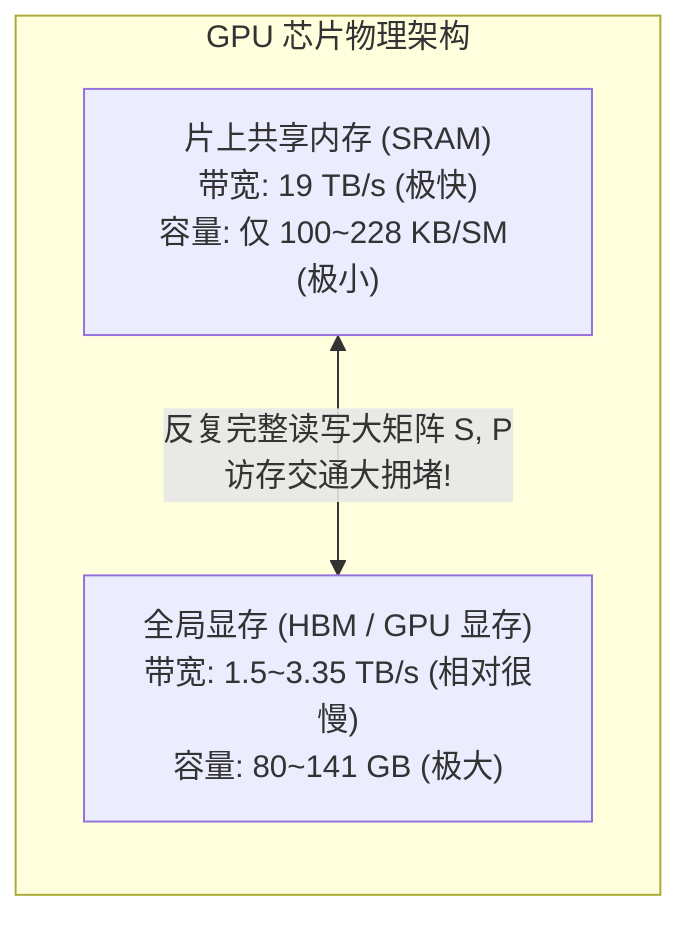
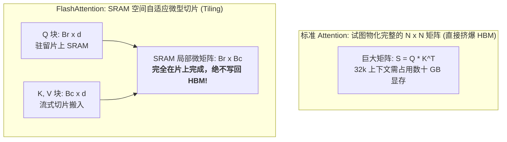
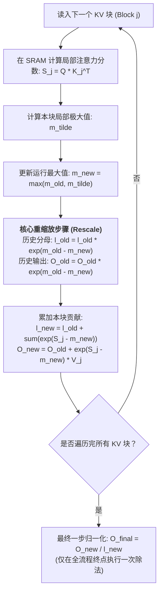
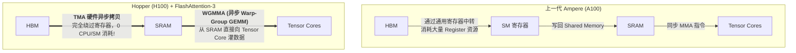
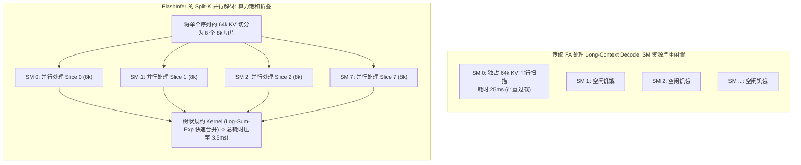

## 引言：自注意力算子的显存往返悲剧

在前面的章节中，我们已经深入探讨了推理引擎的宏观架构与调度机制：
- 在 [Roofline 模型与 Prefill/Decode 物理撕裂](/articles/inference-roofline-prefill-decode/) 中，我们确立了硬件吞吐受制于**计算瓶颈（Compute-bound）**与**访存带宽瓶颈（Memory-bandwidth bound）**的第一性原理；
- 在 [PagedAttention 显存虚拟化](/articles/pagedattention-memory-virtualization/) 与 [前缀缓存 RadixAttention](/articles/prefix-caching-radix-attention-internals/) 中，我们解构了如何在显存碎片消除与公共上下文复用上做到极致。

然而，无论上层调度与显存池设计得多么精巧，神经网络计算的每一次脉搏，最终都要落实到 GPU 底层的**算子内核（CUDA Kernels）**上。

而在大模型的所有算子中，耗时最显著、显存占用最凶猛、数学形式最特殊的，正是 Transformer 的核心引擎 —— **自注意力机制（Self-Attention）**。

### 1.1 标准 Attention 的显存带宽陷阱

标准的自注意力计算公式在数学上极为简洁：
$$S = Q K^T \in \mathbb{R}^{N \times N}$$
$$P = \text{Softmax}(S) \in \mathbb{R}^{N \times N}$$
$$O = P V \in \mathbb{R}^{N \times d}$$

其中 $N$ 为输入序列长度（Sequence Length），$d$ 为注意力头维度（Head Dimension，通常为 64 或 128）。

但在传统的深度学习框架（如原生 PyTorch）中，这段简单的数学公式在 GPU 硬件物理执行时却是一场灾难：

在原生执行流程中：
1. **第一步（$S = QK^T$）**：从 HBM 加载 $Q$ 和 $K$ 到 SRAM 计算，算完后将大小为 $N \times N$ 的分数矩阵 $S$ **写回 HBM**；
2. **第二步（$P = \text{Softmax}(S)$）**：从 HBM 重新完整读入 $S$，在 SRAM 计算完归一化概率后，将同样为 $N \times N$ 的概率矩阵 $P$ **再次写回 HBM**；
3. **第三步（$O = PV$）**：从 HBM 重新读入 $P$ 和 $V$，计算加权输出 $O$，最后写回 HBM。

当序列长度达到 $N = 32,768$（32k 上下文）时，$N \times N$ 的 FP16 浮点矩阵仅单个注意力头就需要消耗 **2 GB 显存**！对于一个拥有 32 个头的模型，每一层 Transformer 就需要产生 **64 GB** 的瞬时中间张量。

显存颗粒根本承受不起如此庞大的中间矩阵频繁往返。GPU 计算核心在绝大多数时间里，都被迫挂起等待 HBM 漫长的数据搬运，**实际浮点运算利用率（MFU）惨跌至 10%~20%**。

**破局的核心思路只有一个：绝对不能将 $N \times N$ 的中间矩阵物化（Materialize）到全局 HBM 显存中！必须在片上极小容量的 SRAM 内，一气呵成完成矩阵乘法与 Softmax 归一化。**

这引发了现代大模型算子史上最为激荡的一场技术革命。

---

## 一、 FlashAttention-1 的破晓之战：Tiling 与 Online Softmax

2022 年，斯坦福大学的 Tri Dao 等人在 NeurIPS 2022 发表了里程碑论文《FlashAttention: Fast and Memory-Efficient Exact Attention with IO-Awareness》，正式确立了 Attention 算子加速的核心哲学：**硬件 IO 感知（IO-Awareness）、分块分片（Tiling）与在线自适应 Softmax（Online Softmax）**。

### 1.1 Tiling：在 SRAM 的方寸之间跳舞

既然片上 SRAM 容量极其微小（A100 上每个流式多处理器 SM 仅有 192KB 共享内存），装不下完整的 $N \times N$ 矩阵，那就只能将其**切片（Tiling）**：
- 将 Query 划分为块大小为 $B_r \times d$ 的小切片；
- 将 Key 和 Value 划分为块大小为 $B_c \times d$ 的小切片；
- 每次只将一对子块从 HBM 加载到 SRAM 中，完成局部的 GEMM 计算。

### 1.2 核心数学难题：Softmax 的全局依赖

分块计算矩阵乘非常简单，但 Attention 中间夹着一个致命的非线性算子 —— **Softmax**：
$$P_{ij} = \frac{e^{S_{ij} - m_i}}{\sum_{k=1}^N e^{S_{ik} - m_i}} \quad \text{其中 } m_i = \max_{1 \le k \le N}(S_{ik})$$

在标准的 Softmax 计算中，为了数值稳定性，必须先遍历一整行的所有元素求得全局最大值 $m_i$，然后再次遍历整行求得指数和分母 $l_i = \sum_k e^{S_{ik} - m_i}$。

**如果按 Block 分块计算，当前 Block 根本无法知道后续 Block 的元素会不会比当前更大！每次只能看到当前局部的最大值 $\tilde{m}$ 和局部指数和 $\tilde{l}$。如何能在不知道全局信息的情况下，逐步推进并最终输出精确一致的归一化结果？**

### 1.3 Online Softmax 的优雅数学推导

FlashAttention 借鉴了 Milakov 与 Gimelshein 在 2018 年提出的在线 Softmax 算法，给出了精妙的**动态重缩放（Dynamic Rescaling）**状态机递推公式。

设当前已经处理到第 $j$ 个 Key/Value 块：
- 设此前历史 $j-1$ 个块累积的局部最大值为 $m^{(j-1)}$，局部指数分母和为 $l^{(j-1)}$；
- 当前第 $j$ 个新块计算出的局部最大值为 $\tilde{m}^{(j)}$，局部指数分母和为 $\tilde{l}^{(j)}$。

则合并后的全新全局最大值 $m^{(j)}$ 为：
$$m^{(j)} = \max\left(m^{(j-1)}, \tilde{m}^{(j)}\right)$$

由于基底最大值发生了漂移，此前历史累积的分母 $l^{(j-1)}$ 必须乘以一个修正因子 $e^{m^{(j-1)} - m^{(j)}}$ 予以重缩放！全新的累积分母更新为：
$$l^{(j)} = e^{m^{(j-1)} - m^{(j)}} \cdot l^{(j-1)} + e^{\tilde{m}^{(j)} - m^{(j)}} \cdot \tilde{l}^{(j)}$$

同理，对于正在累加的输出向量 $O$，此前历史累加的加权值也只需同步乘以相同的缩放因子：
$$O^{(j)} = \text{diag}\left(e^{m^{(j-1)} - m^{(j)}}\right) \cdot O^{(j-1)} + e^{\tilde{m}^{(j)} - m^{(j)}} \cdot P^{(j)} V^{(j)}$$

借助这套数学魔术，FlashAttention **彻底消除了对中间矩阵 $S$ 和 $P$ 的 HBM 读写**。HBM 访存总量从 $O(N^2)$ 巨幅骤降至 $O(N^2 d / M)$，在 A100 上跑出了传统 Attention 2x~4x 的颠覆性加速，且显存开销从 $O(N^2)$ 彻底压制到 $O(N)$。

---

## 二、 FlashAttention-2 的极致提炼：循环重构与 Warp 零通信

尽管 FlashAttention-1 实现了理论上的跨越，但其算力利用率依然只达到了 A100 理论峰值的 30%~50%。2023 年，Tri Dao 发布了 **FlashAttention-2**，从底层指令流水线角度对算法进行了外科手术般的精细重构。

### 2.1 循环对调（Loop Inversion）：寄存器常驻

FlashAttention-1 的一个隐秘性能瑕疵在于其**循环嵌套顺序**：
- **FA-1 的外层循环**遍历 Key/Value 块，内层循环遍历 Query 块；
- 这导致不同的外层迭代都会试图更新同一份 Query 的局部输出 $O$。为了防止多线程冲突，中间结果必须频繁写回甚至依赖全局内存原子操作（Atomic Add）。

**FA-2 做出了关键变革：对调内外层循环！**
- **外层循环**遍历 Query 块；
- **内层循环**遍历 Key/Value 块。

这一简单调换带来了巨大的硬件红利：**每个 Thread Block 独占处理一部分 Query，其对应的累加输出向量 $O$ 可以自始至终安全地锁死在 GPU 寄存器文件（Register File）中！** 只有当内层所有 KV 块全部扫完，才执行唯一一次最终写回，极大地释放了片上数据通路的带宽。

### 2.2 延迟除法与非 Matmul FLOPs 剥离

GPU 的 Tensor Cores 极其擅长做大矩阵乘法（GEMM），但对于加减法、指数运算（`exp`）和浮点除法（`div`）这类非矩阵乘指令（Non-Matmul FLOPs），吞吐能力通常要弱 8 到 16 倍。

在 FA-1 中，每处理完一个 Block，算法都会尝试对局部输出做一次归一化除法。FA-2 将除法操作彻底剥离出内层循环：**内层循环只做无除法的浮点累加，直到整个序列完全算完，在算子尾声才对全局寄存器执行一次向量并行除法**，使 Tensor Core 的运行占空比大幅提升。

### 2.3 Warp 调度拓扑：消灭 Shared Memory 通信屏障

在 CUDA 编程中，一个 Thread Block 包含多个 Warp（每个 Warp 32 线程）。
- 在 FA-1 中，所有的 Warp 共同切分 $Q$ 块和 $K, V$ 块，不同 Warp 之间需要通过 Shared Memory 频繁进行局部的归约同步（`__syncthreads()`）；
- FA-2 重新设计了 Warp 分割策略：**同一个 Thread Block 内的所有 Warp 共享相同的 $Q$ 块切片，但各自独立处理互不重叠的 $K, V$ 块片段**。Warp 之间完全消除了同步屏障，实现了纯粹的零通信并行推进。

经过这三项底层重构，FlashAttention-2 在 A100 上跑出了高达 **73% 的理论算力峰值（~225 TFLOPS）**，成为了整个大模型产业事实上的算子底座。

---

## 三、 FlashAttention-3：跨越代际，驾驭 Hopper 架构的异步洪流

2024 年，随着 NVIDIA Hopper 架构（H100 / H200）成为大模型算力绝对中枢，Tri Dao 团队联合 NVIDIA 推出了专门榨干 Hopper 物理特性的 **FlashAttention-3**。

Hopper 架构相比上一代 Ampere 引入了颠覆性的硬件单元，而 FA-3 的核心就是为这些全新硬件特性量身定制算子内核。

### 3.1 硬件利器一：TMA（Tensor Memory Accelerator）异步搬运

在 A100 及更早架构上，从 HBM 拷贝数据到 SRAM 是一件极其昂贵的操作：
- SM 必须发射 `LDG` 指令；
- 数据必须先被加载到**通用寄存器（General Purpose Registers）**中，再由寄存器写入 Shared Memory；
- 这不仅占用了宝贵的寄存器空间（导致编译时 Register Spilling 到慢速显存），而且白白消耗了 SM 的算术调度发射周期。

**Hopper TMA 是一套独立的硬件 DMA 引擎**：
- SM 只需要下发一条简单的 TMA 描述符指令；
- TMA 硬件电路便在后台自动、异步地将多维张量从 HBM 批量灌入 Shared Memory；
- **整个传输过程 0 寄存器占用，0 SM 算力开销**！

### 3.2 硬件利器二：WGMMA（Warp-Group 矩阵乘指令）

在 Ampere 上，Tensor Core 指令是以单个 Warp（32 线程）为粒度执行的 `mma.sync`，输入数据必须先从 Shared Memory 读取到每个线程的私有寄存器中。

而在 Hopper 上，NVIDIA 引入了 **Warp-Group GEMM（WGMMA）**：
- 4 个 Warp 组合成一个拥有 128 线程的“Warp-Group”；
- WGMMA 指令**直接从 Shared Memory 读取输入张量**送入 Tensor Cores，无须提前搬到寄存器；
- 并且 WGMMA 也是完全**异步发射（Asynchronous Launch）**的，Tensor Cores 在后台执行矩阵乘的同时，SM 核心可以并行执行 Softmax 的指数运算！

### 3.3 软件架构革新：Warp Specialization 生产者-消费者流水线

既然搬运（TMA）和计算（WGMMA）都可以完全异步化，FlashAttention-3 彻底打破了“所有线程步调一致”的传统编程范式，采用了经典的**硬件级生产者-消费者模型（Producer-Consumer Warp Specialization）**：

- **Producer Warps（生产者，通常分配 1 个 Warp）**：
  什么计算都不做，专门负责规划下一个 Block 的数据流动。它不断向硬件下发 TMA 搬运请求，并操作 Hopper 原生的硬件屏障对象（`mbarrier`）；
- **Consumer Warps（消费者，分配其余 3 个或更多 Warps）**：
  一旦收到 `mbarrier` 到达信号，立即发射异步 WGMMA 进行矩阵乘法，同时穿插计算 Softmax。

通过双缓冲（Ping-Pong Double Buffering）机制，当消费者正在计算第 $K$ 块时，生产者早已借助 TMA 把第 $K+1$ 块静默搬入 SRAM。**数据搬运的时延被 100% 完全掩盖在计算耗时之内**！

结合最新的 FP8 低精度与块级自适应缩放（Block Scaling），FlashAttention-3 在 H100 SXM5 上狂飙出 **700~800 TFLOPS** 的吞吐极限，将硬件利用率拉至逼近理论物理极值的 75%~85%。

---

## 四、 FlashInfer 的横空出世：专为 LLM Serving 打造的异构内核

看到这里，很多工程师会产生一个巨大的疑问：

> **“既然 FlashAttention-3 已经把 Hopper 架构榨干到了极致，为什么 vLLM、SGLang 等顶尖在线推理引擎还要重度集成由伯克利 LMSYS 团队主导的 [FlashInfer](https://github.com/flashinfer-ai/flashinfer) 呢？”**

答案是残酷的：**FlashAttention 天生是为“训练（Training）”和“超长 Prefill”设计的；而在真实的在线大模型推理（Serving）场景下，它遇到了严重的“水土不服”。**

### 4.1 传统 FlashAttention 在推理场景下的两大死穴

1. **死穴一：对 Paged KV Cache 的不适应**：
   在生产服务中，正如我们在第 2 讲和第 4 讲所见，KV Cache 全面采用了 PagedAttention 和 RadixAttention 分页管理，显存块在物理上是离散、非连续分布的。
   FlashAttention 原生只接受**物理地址连续的紧凑张量（Contiguous Tensors）**。要让 FA 处理 Paged Cache，系统要么先在显存里做一次代价高昂的连续内存拷贝，要么在内核里强行插入复杂的指针查表指令，这严重破坏了 FA 精心调校的内存对齐与向量化加载。

2. **死穴二：Decode 阶段的 GEMV 算力饥饿（算力利用率坍塌）**：
   在自回归解码（Decode）阶段，输入 Query 的长度**永远是 1（$L_q = 1$）**！
   此时，计算退化为向量-矩阵乘法（GEMV）。在 FlashAttention 的设计中，并行度主要是沿着 Query 的序列长度展开的。当 $L_q = 1$ 时，系统只能沿着 Batch 和 Head 维度分配 Thread Block。
   
   **如果此时系统的并发批次较小（如 Batch=4, Head=32），整个 GPU 上只能启动 $4 \times 32 = 128$ 个 Thread Block。面对拥有 132 个 SM 的 H100，几乎每个 SM 只能分到 1 个 Block！如果某个请求的上下文很长（如 64k），那单个 SM 必须串行扫完整整 64k 的 KV Cache，耗时长达数十毫秒，而其他 SM 却在无所事事地空转！**

### 4.2 FlashInfer 的破局秘籍

由陈天奇团队与 LMSYS 联合打造的 **FlashInfer**，正是专门为大模型在线服务量身打造的解题答案：

1. **原生 Paged KV Cache 深度支持**：
   FlashInfer 将 Paged 寻址内建为一等公民。其内核中的数据搬运指令直接绑定物理 Block Table，借助优化的间接寻址与局部缓存预取，消除了离散块映射带来的性能损耗；
2. **Split-K 并行解码加速（Split-K Decode Attention）**：
   针对 Decode 阶段长上下文单 SM 过载的问题，FlashInfer 引入了 **Split-K** 机制：
   - 沿 Key/Value 的时间维度（即 $K$ 维度）进行切片，将一个超长的单序列拆分给多个不同的 SM 并行计算；
   - 每个 SM 输出各自局部的输出向量与 Log-Sum-Exp 归一化标量；
   - 最终通过一个极度轻量的两阶段归约内核（Reduction Kernel）瞬间合并结果；
   - **在长文本 Decode 场景下，Split-K 将单字推理时延压缩了 3x 到 8x！**
3. **混合批次统一调度（Unified Hybrid Prefill/Decode Batching）**：
   正如我们在第 3 讲 [Chunked Prefill](/articles/continuous-batching-chunked-prefill-guide/) 所揭示的，在线推理批次中常常同时混合着 Prefill 切片与 Decode 单字。FlashInfer 提供了 `BatchPrefillWithPagedKVCache` 与 `BatchDecodeWithPagedKVCache` 的统一内核调度抽象，彻底消除了多 CUDA Stream 资源争抢与同步开销。

---

## 五、 Attention 算子加速史全景横评

| 维度 | 原生 PyTorch Attention | FlashAttention-1 | FlashAttention-2 | FlashAttention-3 | FlashInfer (Serving 专用) |
| :--- | :--- | :--- | :--- | :--- | :--- |
| **首创年份** | 传统框架基准 | 2022 (NeurIPS) | 2023 | 2024 | 2024 (LMSYS) |
| **HBM 访存量** | $O(N^2)$ (极其庞大) | $O(N^2 d / M)$ | $O(N^2 d / M)$ | $O(N^2 d / M)$ | $O(N^2 d / M)$ |
| **核心算法创新** | 无 (简单分步前向) | Tiling + Online Softmax | 循环重构 + Warp 优化 | TMA 异步 + WGMMA | Split-K 并行解码 + Paged 优化 |
| **A100/H100 效率** | MFU &lt; 20% | MFU 30%~50% | MFU 50%~73% | MFU 75%~85% (H100) | 在线服务吞吐最高 |
| **中间矩阵物化** | 完全物化到 HBM | 仅存在于片上 SRAM | 仅存在于寄存器/SRAM | 硬件 TMA 双缓冲流转 | 仅存在于寄存器/SRAM |
| **长文本 Decode 优化**| 极差 (内存溢出) | 一般 (算力空转) | 一般 (单 SM 瓶颈) | 较好 (算力弥补) | **极优 (Split-K 跨 SM 强并行)** |
| **Paged KV 支持** | 需连续拷贝重组 | 依赖补丁，效率打折 | 依赖补丁，效率打折 | 需专门包装 | **原生底层第一公民支持** |
| **最擅长战场** | 教学与小模型验证 | 奠定算子融合标准 | 模型训练与大块 Prefill | H100 训练与超密集 Prefill | **大模型高并发生产推理服务** |

---

## 常见问题 (FAQ)

### Q1: 为什么 FlashAttention 在反向传播（Backward Pass）中选择重新计算（Recomputation）注意力矩阵，而不是在正向传播时将其保存下来？这难道不会增加计算量吗？

**是的，重新计算确实增加了额外的乘加 FLOPs，但这恰恰是现代 GPU 体系结构下“以算力换带宽”的最高境界！**

在现代 GPU（如 A100/H100）上，算力的增长速度远超显存带宽的增长速度（算力增加了数十倍，而带宽仅增加数倍）。
- 如果选择在正向传播时把 $N \times N$ 的 Attention 分数矩阵保存下来供反向传播使用，GPU 必须将数百 GB 的数据写入慢速 HBM，反向时再完整读一遍。这个漫长的数据搬运所消耗的时间，远远超过了重新做一次矩阵乘法的时间；
- FlashAttention 选择在反向传播时**仅从 HBM 重新读入小尺寸的 $Q, K, V$，并在片上 SRAM 重新计算一次局部矩阵乘法**。虽然 FLOPs 增加了约 30%，但由于消除了几十倍的 HBM 访存，**端到端整体反向传播速度反而提升了 2 倍以上**。

### Q2: 在大模型推理服务中，既然 FlashAttention-3 在 H100 上跑分极高，为什么许多框架在生成阶段依然选择 FlashInfer？

因为**基准测试的跑分条件（Benchmark）与真实在线推理的物理形态存在巨大的结构性错位**：
- FlashAttention-3 的惊人跑分（700+ TFLOPS）主要是在**大输入长度的 Prefill（例如 $L_q = 4096, L_k = 4096$）**稠密矩阵下取得的，此时 Tensor Cores 被充分喂饱；
- 但在在线推理的大多数时间里，系统处于 **自回归 Decode 阶段（$L_q = 1$）**。此时的问题根本不是“Tensor Core 算得够不够快”，而是“单 Query 根本跑不满硬件并发”；
- FlashInfer 的核心价值在于其**针对推理微架构的精巧工程**：原生支持 PagedAttention 的离散块寻址、针对变长多轮请求的批处理融合、以及针对长上下文 Decode 的 **Split-K 多 SM 联合切片加速**。在真实的端到端在线服务压测中，FlashInfer 能够提供更平稳的 P99 单字输出时延与更高的服务并发容量。

### Q3: 为什么有的推理引擎在处理 64k/128k 超长上下文时会出现数值溢出（产生 NaN）或精度下降？Online Softmax 是如何通过浮点减最大值保证数值稳定性的？

在标准指数计算 $e^x$ 中，由于浮点数表示范围的限制，对于 FP16 精度，最大可表示的数值约为 $65504$。如果注意力得分 $S_{ij} = q_i \cdot k_j / \sqrt{d}$ 达到甚至超过 $11$，$e^{11} \approx 59874$，极易发生**数值上溢（Overflow，变成 `+inf` 并在除法后产生 `NaN`）**；反之，若负数过大则会发生**数值下溢（Underflow，变成纯 0）**。

传统的做法是在计算指数前，先减去整行的全局最大值 $m = \max(S)$，使得指数项的最大输入为 $e^0 = 1$，所有项均落在 $(0, 1]$ 的安全数值区间内。

而在分块计算的 **Online Softmax** 中，由于全局最大值在不断更新，算法必须在每个迭代步**严格执行指数修正**：
$$l^{(j)} = e^{m^{(j-1)} - m^{(j)}} \cdot l^{(j-1)} + \sum e^{S_k^{(j)} - m^{(j)}}$$
因为 $m^{(j)} \ge m^{(j-1)}$，所以指数差值 $m^{(j-1)} - m^{(j)} \le 0$。这意味着缩放因子 $e^{m^{(j-1)} - m^{(j)}} \in (0, 1]$，保证了历史累加项在调整时**只会缩小、绝不上溢**。如果某个自定义内核在编写时未严格遵循局域最大值的减法更新，一旦上下文长度放大到数万 Token，指数累加便会瞬间冲破 FP16 的动态范围，导致模型输出乱码或直接崩溃。
