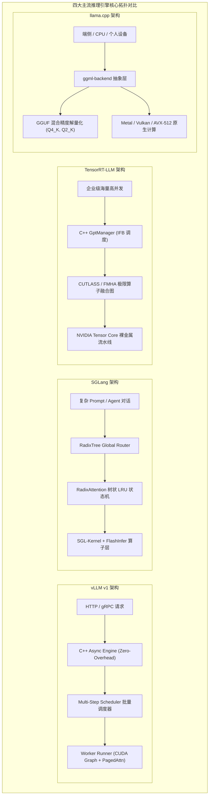
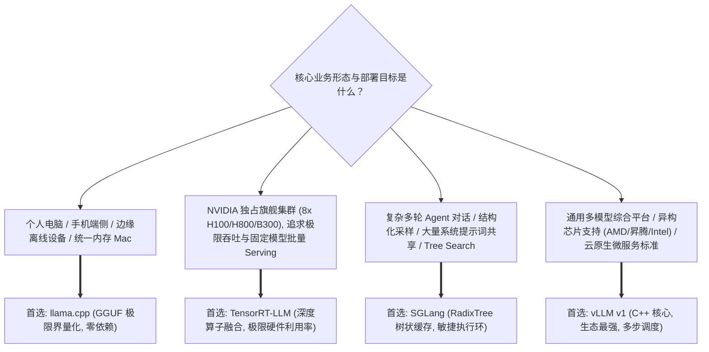

## 引言：从玩具脚本到工业级高并发推理底座

在 2023 年大模型浪潮之初，绝大多数开发者运行大模型的方式是在单张显卡上执行一段简单的 Python 脚本：

```python
# 早期朴素的自回归推理原型 (Naive PyTorch)
for _ in range(max_new_tokens):
    outputs = model(input_ids)
    next_token = torch.argmax(outputs.logits[:, -1, :], dim=-1)
    input_ids = torch.cat([input_ids, next_token.unsqueeze(-1)], dim=-1)
```

这段基于原生 PyTorch 的原型虽然具备可解释性，但在真实的工业级生产环境中却是一场灾难：
1. **静态显存预留造成 $60\% \sim 80\%$ 严重显存碎片**；
2. **请求必须静态对齐 Padding，导致无谓的无效计算**；
3. **Python 解释器的全局解释器锁（GIL）与调度开销在每一步自回归迭代中引入巨额 CPU 延迟（CPU Overhead），导致 GPU 频繁空转等待**；
4. **算子之间频繁进行全局内存（HBM）读写往返，算力利用率（MFU）通常不足 $15\%$**。

为了将 GPU 硬件的算力与显存带宽压榨到物理极致，开源社区与硬件巨头们在过去的三年中展开了史诗级的工程突围，孕育出当今支撑全球 AI 工业运转的四大顶级推理引擎底座：
- **vLLM（加州大学伯克利分校 LMSYS）**：凭借开创性的 PagedAttention 显存虚拟化奠定了现代推理系统标准，并在全新的 **vLLM v1** 架构中彻底重构了底层 C++ 执行引擎；
- **SGLang（LMSYS / 斯坦福大学）**：针对多轮复杂 Agent 交互与长系统提示，独创了 **RadixAttention 前缀树缓存** 与极致敏捷的高并发调度器；
- **TensorRT-LLM（NVIDIA）**：NVIDIA 官方倾力打造的“性能怪兽”，深度融合底层 CUTLASS、FMHA 算子与静态显存编排，代表了特定绿厂硬件上的吞吐极限；
- **llama.cpp（Georgi Gerganov）**：极致的极简主义瑞士军刀，纯 C/C++ 零依赖开发，开创了 GGUF 格式与端侧极限整数量化，统治了边缘计算与个人终端设备。

本文作为**《大模型推理引擎：从模型演进、内核架构到未来终局》**专栏第九章，将抛弃任何空洞的公关宣传与单纯的跑分刷榜，直击这四大引擎的核心架构源码、调度执行循环（Execution Loop）以及底层设计哲学，并给出生产环境下的全景决策矩阵。

---

## 一、 四大引擎设计哲学与整体拓扑鸟瞰

在深入代码细节之前，我们必须理解四大引擎在立项之初所设定的不同**第一性目标**，这直接决定了它们在架构设计上的取舍：



| 引擎维度 | vLLM v1 | SGLang | TensorRT-LLM | llama.cpp |
| :--- | :--- | :--- | :--- | :--- |
| **首要目标** | 生态通用性与高吞吐兼备的标准底座 | 多轮 Agent 对话、结构化输出与前缀重用 | NVIDIA 硬件上的极限吞吐与极致能效 | 跨平台零依赖极简运行与端侧极限界量化 |
| **核心语言栈** | C++ 核心调度器 + Python 灵活生态接入 | Python 调度编排 + C++/CUDA 算子 (SGL-Kernel) | 纯 C++ 核心引擎 + Python 构建期声明 | 纯 C/C++ (零外部第三方库依赖) |
| **显存管理** | PagedAttention 显存分页池 | RadixAttention 树状层级前缀缓存池 | 预分配静态平铺显存池 + In-Flight Paged KV | 统一内存直接内存映射 (mmap) 与张量切分 |
| **硬件主战场** | NVIDIA GPU、AMD ROCm、Intel Gaudi、昇腾等主流算力 | NVIDIA GPU、AMD ROCm | NVIDIA 独占 (Hopper, Blackwell, Ada) | Apple Silicon、x86 CPU、ARM 手机、低功耗边缘芯片 |

---

## 二、 vLLM v1：从 Python 泥潭到零开销 C++ 引擎重构

### 2.1 v0 架构的“隐性原罪”：Python 调度瓶颈

在早期广为人知的 vLLM v0 版本中，尽管其首创的 PagedAttention 彻底解决了显存碎片问题，但随着硬件计算速度的成倍跃升（如 H100/H800 的到来），系统暴露出了严重的 CPU 瓶颈：

在自回归解码阶段，单步 GPU Kernel 执行时间可能仅需 **$1.5 \sim 3 \text{ ms}$**。然而，v0 版本的 Python 调度循环在 CPU 侧需要执行繁重的请求状态维护、字典查找、Block 映射更新以及张量组装，这往往需要消耗 **$2 \sim 4 \text{ ms}$** 的 CPU 时间！
结果就是：**GPU 跑得比 CPU 调度器还要快，GPU 算力长期处于饥饿等待状态，硬件 MFU 遭遇天花板。**

### 2.2 v1 核心源码拆解：Zero-Overhead C++ 调度器与 Multi-Step 执行

为了彻底粉碎这一瓶颈，社区推出了全新的 **vLLM v1** 架构。v1 将原本用 Python 编写的调度核心与请求生命周期管理器全量下沉到了高效的 C++ 异步引擎中，并引入了核心杀手锏 —— **多步调度（Multi-Step Scheduling）**。

在传统单步引擎中，CPU 必须与 GPU 在每一个生成的 Token 之间进行一次同步与状态轮询：
```
传统单步调度流 (Step-by-Step):
[CPU: Schedule Step 1] -> [GPU: Kernel Launch] -> [CPU Wait & Sync] -> [CPU: Schedule Step 2] ...
```

而在 vLLM v1 中，调度器能够基于当前显存余量一次性预测并向 GPU 下发未来 $N$ 步（例如 $N=8$ 或 $16$）的执行计划：

```cpp
// vLLM v1 核心调度决策伪代码拆解 (Scheduler::schedule)
SchedulerOutputs Scheduler::schedule() {
    // 1. 优先推进正在运行的解码请求 (Running Queue)
    std::vector<SequenceGroup*> running_batch;
    for (auto& seq_group : running_queue_) {
        // 一次性预检未来 num_steps 步的显存块需求
        if (block_allocator_->can_allocate_multi_steps(seq_group, num_steps_)) {
            block_allocator_->allocate_for_multi_steps(seq_group, num_steps_);
            running_batch.push_back(seq_group);
        } else {
            // 显存承载告急，触发抢占并换出至 CPU (Preempt & Swap Out)
            preempt(seq_group);
        }
    }

    // 2. 检查是否有算力余量容纳新的等待队列请求 (Waiting Queue - Prefill)
    std::vector<SequenceGroup*> prefill_batch;
    size_t remaining_token_budget = max_num_batched_tokens_ - get_num_tokens(running_batch);
    while (!waiting_queue_.empty() && remaining_token_budget > 0) {
        auto next_req = waiting_queue_.front();
        if (can_prefill(next_req, remaining_token_budget)) {
            prefill_batch.push_back(next_req);
            remaining_token_budget -= next_req->get_prompt_len();
            waiting_queue_.pop_front();
        } else {
            break;
        }
    }

    return SchedulerOutputs(running_batch, prefill_batch, num_steps_);
}
```

通过将 $N$ 步的执行循环直接固化在 GPU 端驱动运行（结合持久化的 CUDA Graph 执行链），CPU 只需在 $N$ 步执行完毕后接收一次输出回调。**CPU 开销被稀释了近 $N$ 倍，端到端吞吐量在小 Batch 场景下直接激增 $30\% \sim 50\%$！**

---

## 三、 SGLang：树状前缀驱动与敏捷 Agent 交互基座

如果说 vLLM 是通用高并发场景下的重装步兵，那么 **SGLang** 则是专为多轮 Agent 交互、Few-shot 模板复用与复杂工作流打造的高速突击队。

### 3.1 RadixAttention 树状状态机的源码真相

我们在专栏第四章[《前缀缓存架构演进：RadixAttention 树状缓存》](/articles/prefix-caching-radix-attention-internals/)中从理论上推导了前缀树。在 SGLang 的实际源码实现中，其核心维护了一个 `RadixTree` 数据结构：

```python
# SGLang RadixTree 核心匹配与更新逻辑节选
class RadixTree:
    def __init__(self):
        self.root = TreeNode(key_tokens=[])
        self.eviction_lru = DoublyLinkedList()

    def match_prefix(self, token_ids: List[int]) -> Tuple[List[int], TreeNode]:
        """
        在 O(K) 时间复杂度内寻找最长公共前缀的 KV 物理块，K 为公共深度
        """
        curr = self.root
        matched_blocks = []
        idx = 0
        while idx < len(token_ids):
            child = curr.find_child(token_ids[idx])
            if child is None:
                break
            # 检查前缀匹配长度
            matched_len = child.match_prefix(token_ids[idx:])
            matched_blocks.extend(child.get_block_ids(matched_len))
            idx += matched_len
            if matched_len < len(child.key_tokens):
                # 命中部分前缀，准备分叉 (Split Node)
                break
            curr = child
            
        # 刷新命中的树节点在 LRU 中的热度
        self.eviction_lru.touch(curr)
        return matched_blocks, curr
```

### 3.2 极致轻量的执行模型与 SGL-Kernel 协同

SGLang 摒弃了过重的抽象层，调度器与底层的 **FlashInfer** 和自研 **SGL-Kernel** 算子库进行极其紧密的端到端联合优化：
- **Token-Level 极速派发**：对于 Agent 频繁产生的结构化 JSON 约束采样（Constrained Decoding / Outlines），SGLang 直接在底层的 C++ Logit Processor 中维护正则状态机，无需将庞大的词表张量来回拷贝回 Host 端；
- **分叉与合并的零开销**：在多 Agent 协同或 Tree Search（MCTS / 思考树分支）场景下，多个并发分支共享祖先节点的 KV Cache 物理块引用计数，只有当衍生分支产生独占输出时才执行写时复制（Copy-on-Write）。这使得 SGLang 在复杂 Agent 基准评测中展现出恐怖的领先优势。

---

## 四、 TensorRT-LLM：NVIDIA 原生极致深度优化

对于在纯 NVIDIA 硬件（特别是配备 NVLink 与 NVSwitch 的 8 卡 H100/H800/B300 服务器）上追求极致吞吐的私有化部署而言，**TensorRT-LLM** 是无可争议的性能王者。

### 4.1 In-Flight Batching (IFB) 与静态显存流水线

传统的 Continuous Batching 在执行时仍然会受到动态显存分配的细微开销干扰。而 TensorRT-LLM 采用了近乎严苛的**静态显存与预编译计算图（Pre-compiled Engine）哲学**：
- 在启动前，TRT-LLM 会针对目标卡型、张量并行维度（TP）与最大并发上下文预先生成一套优化后的 `.engine` 序列化文件；
- 底层调度由纯 C++ 编写的 `GptManager` 接管，实现了真正的 **In-Flight Batching（运行时连续批处理）**：将每个 Transformer 层的 Attention 与 MLP 细化为若干个由 CUDA Stream 并发驱动的计算阶段，最大化隐藏通信延迟。

### 4.2 极致算子融合（Extreme Kernel Fusion）

TRT-LLM 性能恐怖的核心源泉在于其无所不用其极的算子融合：

```
标准 Transformer Layer 内存流:
[RMSNorm] --(写回HBM)--> [QKV GEMM] --(写回HBM)--> [RoPE] --(写回HBM)--> [FlashAttention] ...

TensorRT-LLM 深度融合流:
┌────────────────────────────────────────────────────────────────────────┐
│ Fused RMSNorm + QKV Projection + RoPE (单次 Kernel，全部寄存器/SRAM完成) │
└───────────────────────────────────┬────────────────────────────────────┘
                                    ▼
┌────────────────────────────────────────────────────────────────────────┐
│ Fused Paged-KV Attention + Output Linear Projection                    │
└───────────────────────────────────┬────────────────────────────────────┘
                                    ▼
┌────────────────────────────────────────────────────────────────────────┐
│ Fused SwiGLU MLP (Gate + Up Projection + Activation 彻底融合)           │
└────────────────────────────────────────────────────────────────────────┘
```

普通的推理引擎通常使用通用的 FlashAttention 算子搭配独立的 PyTorch GEMM。而 TRT-LLM 借由 NVIDIA CUTLASS 深度调优，直接将 **RMSNorm -> GEMM -> RoPE 旋转位置编码** 融合为一个不可分割的超巨型 Kernel。中间张量甚至根本不需要写入 GPU HBM，全程在 SM 核心的寄存器和片上 L1/Shared Memory 中闪电式流转完成，彻底杀死了中间显存带宽开销。

*缺点与代价：* 灵活性极差，模型架构如果有非标修改，需要手写修改 C++ TensorRT Plugin 并重新漫长编译。

---

## 五、 llama.cpp：端侧与异构环境的极简主义瑞士军刀

与前三者全力征服数据中心多卡集群不同，**llama.cpp** 走了一条完全截然相反的技术路径：**它致力于让任何一台配置平平的普通设备，甚至是一台只有 8GB 内存的 MacBook 或一部智能手机，都能以流畅的帧率跑通百亿大模型。**

### 5.1 零外部依赖的纯 C/C++ 哲学

llama.cpp 由著名黑客 Georgi Gerganov 开创，其最大的工程奇迹在于：**整个项目不依赖 PyTorch，不依赖 CUDA Toolkit，不依赖任何第三方运行时，仅凭纯 C/C++ 与手写的底层汇编/SIMD 指令集构建而成。**

底层核心张量库 `ggml` 提供了统一的算子抽象：
- 在 x86 CPU 上：手写 AVX-512 与 AVX2 矢量指令集优化；
- 在 Apple Silicon 上：深度调用原生 Metal Performance Shaders（MPS），打通统一内存架构（Unified Memory Architecture, UMA）的零拷贝直读；
- 在移动端或异构芯片上：原生支持 Vulkan、OpenCL 与 ARM NEON 指令加速。

### 5.2 GGUF 格式设计与极限非对称量化

llama.cpp 奠定了开源端侧模型的通用容器标准 —— **GGUF 格式**。
与传统多碎片且依赖外部 JSON 配置的 Hugging Face Safetensors 相比，GGUF 是一个单文件自包含的二进制容器：模型的全部超参数、词表、量化元数据以及对齐张量均保存在一个文件中。

更重要的是，llama.cpp 实现了极为夸张的 **k-quants 混合低比特量化**：

```
llama.cpp k-quants 精度层级剖析:
┌───────────────────────────────────────────────────────────────┐
│ Q4_K_M: 注意力层核心权重采用 4.5-bit，非关键层采用 4-bit (黄金平衡点)│
│ Q3_K_S: 极度紧凑的 3-bit 量化，显存骤降 75%，PPL 仅轻微上升          │
│ Q2_K  : 极限 2-bit 压缩，让 70B 模型在单张消费级 24G 显卡上强行唤醒 │
└───────────────────────────────────────────────────────────────┘
```

在推理时，llama.cpp 利用精心调优的查找表与位运算解量化（Dequantization on-the-fly），以几乎可以忽略的精度损失换取了数十倍的显存缩减，成为本地个人 Agent、私有化离线终端与嵌入式边缘计算的绝对统治者。

---

## 六、 生产级全景决策矩阵：我们究竟该选谁？

面对业务落地的具体场景，系统架构师绝不能盲目迷信跑分，而应当根据自身业务的核心特征匹配最合适的技术栈：



### 生产级多维度选型评分表 (1~5 星)

| 选型考量维度 | vLLM v1 | SGLang | TensorRT-LLM | llama.cpp |
| :--- | :---: | :---: | :---: | :---: |
| **纯吞吐上限 (Throughput)** | ⭐️⭐️⭐️⭐️☆ | ⭐️⭐️⭐️⭐️☆ | ⭐️⭐️⭐️⭐️⭐️ (无出其右) | ⭐️⭐️☆☆☆ |
| **首字延迟 (TTFT) 表现** | ⭐️⭐️⭐️⭐️☆ | ⭐️⭐️⭐️⭐️⭐️ (前缀复用极强) | ⭐️⭐️⭐️⭐️☆ | ⭐️⭐️⭐️☆☆ |
| **多轮对话 / Agent 适配** | ⭐️⭐️⭐️☆☆ | ⭐️⭐️⭐️⭐️⭐️ (天选之子) | ⭐️⭐️☆☆☆ | ⭐️⭐️⭐️☆☆ |
| **模型支持广度与新架构适配** | ⭐️⭐️⭐️⭐️⭐️ (最快适配新模型) | ⭐️⭐️⭐️⭐️☆ | ⭐️⭐️☆☆☆ (需官方适配) | ⭐️⭐️⭐️⭐️☆ |
| **异构硬件泛化 (AMD/国产算力)**| ⭐️⭐️⭐️⭐️⭐️ (社区支持最丰富) | ⭐️⭐️⭐️☆☆ | ⭐️☆☆☆☆ (严格绑定N卡) | ⭐️⭐️⭐️⭐️⭐️ (全平台通吃) |
| **部署与二次开发门槛** | ⭐️⭐️⭐️⭐️☆ (文档完善) | ⭐️⭐️⭐️⭐️☆ (代码轻巧易改) | ⭐️☆☆☆☆ (门槛极高,编译慢) | ⭐️⭐️⭐️⭐️⭐️ (克隆即可编译) |

---

## 总结与专栏终局预告

从 vLLM v1 的 C++ 零开销重构，到 SGLang 的 Radix 树状动态前缀，再到 TensorRT-LLM 的极限算子融合与 llama.cpp 的端侧极简主义 —— 现代开源大模型推理引擎并非彼此割裂，而是在相互借鉴与融合中飞速演进。

至此，我们已经完整走过了算子、显存、批处理、缓存、稀疏并行、P/D 物理隔离与引擎内核源码的全部核心版图。在接下来的**专栏第十章（全专栏终局之作）**中，我们将站在整个行业的最前沿，直面即将重塑所有推理系统的终极变革：**《长思维链 (Reasoning / Test-Time Compute) 与大集群推理系统的未来终局》**，全面探讨面对拥有数万 Token 思考过程的长推理模型时代，底层的调度器、投机采样与多级分层存储体系将迎来怎样的颠覆与重构！

---

## 常见问题 (FAQ)

### Q1: 在企业自建统一大模型服务平台（Model-as-a-Service, MaaS）时，为什么很多团队会混合搭配 vLLM 与 SGLang？
这是一种非常明智且符合业务第一性原理的分工：
- **将 vLLM v1 作为通用基座网关**：负责处理通用的单轮问答、文本总结、代码补全以及第三方开源冷门模型的托管，利用其庞大的社区生态和对各种异构加速卡（如昇腾、AMD ROCm）的极佳兼容性；
- **将 SGLang 专门挂载在 Agent 与多轮对话业务线**：例如连接了复杂系统提示词（System Prompt 往往包含上千字约束与几十个工具描述）的 Coding Agent 或客服机器人，充分利用 RadixAttention 对相同前缀的高达 $90\%+$ 命中率，将交互延迟和并发计算开销降低数倍。

### Q2: TensorRT-LLM 既然性能如此优越，为什么没有彻底垄断开源界？
TensorRT-LLM 的性能是以极高的**工程工程代价（Engineering Trade-off）**换取的：
1. **编译部署极其沉重**：构建一个 TRT-LLM 引擎需要根据具体显卡架构、Tensor Parallelism 数量和最大 Batch 显式编译几十甚至上百分钟，一旦更换不同硬件或调整上下文上限，往往需要重新构建；
2. **源码黑盒与调试困难**：其核心全部封装在极深的 C++ 与闭源 TensorRT 驱动内部，一旦线上遇到非标输入引发崩溃，外部工程师几乎无法通过常规手段打断点调试排查；
3. **新模型支持滞后**：当学界或开源界发布全新的注意力机制（如 DeepSeek MLA 或 KDA）时，vLLM 和 SGLang 通常在 48 小时内就能由社区合入 Python/Triton 支持，而 TRT-LLM 往往需要等待 NVIDIA 官方团队重写底层 C++ 融合插件。

### Q3: llama.cpp 的统一内存（Unified Memory）零拷贝与数据中心 GPU 的显存有什么区别？
在配备 M 系列芯片的苹果设备（如 Mac Studio / MacBook Pro）上，CPU 与 GPU 共享同一组高带宽物理 LPDDR 内存条（统一内存架构，带宽可达 400~800 GB/s）。
在传统 PC 或数据中心服务器中，模型必须从宿主机内存（Host RAM）经过漫长的 PCIe 总线拷贝到独立的显存（GPU HBM）中才能计算。而在统一内存架构下，llama.cpp 借助操作系统的 `mmap()` 系统调用，直接让 GPU 核心就地读取内存中的模型权重，**完全省去了漫长的加载显存搬运过程，且能直接加载超过单卡独立显存上限（如 128GB 内存跑 70B 模型）的庞大参数**。但在绝对算力密度与双精度/半精度 TFLOPS 指标上，它依然远落后于专用的数据中心 Tensor Core 芯片。
