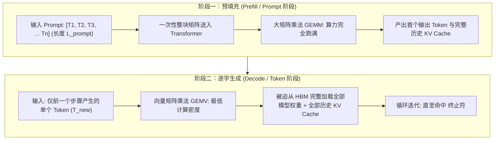
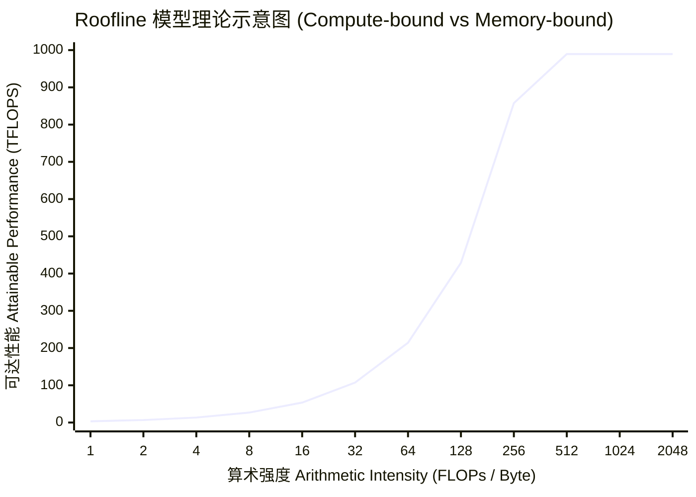
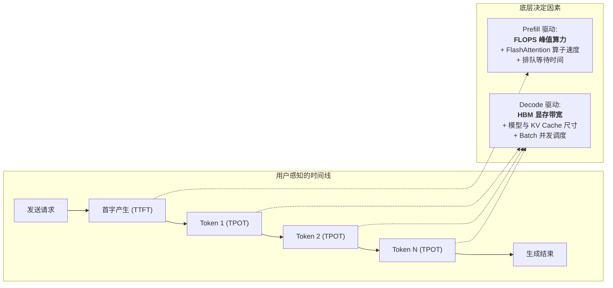
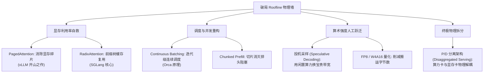

## 引言：从 `model.generate()` 说起 —— 沉睡的 Tensor Core

在开启大模型系统研发时，几乎每一位工程师写下的第一行推理代码都类似这样：

```python
import torch
from transformers import AutoModelForCausalLM, AutoTokenizer

tokenizer = AutoTokenizer.from_pretrained("meta-llama/Llama-3.1-8B-Instruct")
model = AutoModelForCausalLM.from_pretrained(
    "meta-llama/Llama-3.1-8B-Instruct", 
    torch_dtype=torch.bfloat16, 
    device_map="cuda"
)

input_ids = tokenizer("Explain quantum computing in 200 words:", return_tensors="pt").input_ids.cuda()
# 启动自回归生成循环
output = model.generate(input_ids, max_new_tokens=128)
```

这段代码直观而优雅，但只要你使用 **Nsight Systems (`nsys`)** 或 **PyTorch Profiler** 对其 GPU 运行状态进行一次微秒级切片采样，就会目睹一个令硬件架构师大跌眼镜的现实：

```
[GPU Profiling Snapshot on NVIDIA H100 SXM5 (80GB)]
--------------------------------------------------------------------------------
Phase 1: Prompt Processing (Prefill)  -> Duration: ~12.4 ms | Tensor Core: 82.4%
Phase 2: Token 001 Generation (Decode)-> Duration: ~16.1 ms | Tensor Core:  2.1%
Phase 2: Token 002 Generation (Decode)-> Duration: ~16.2 ms | Tensor Core:  2.0%
...
Phase 2: Token 128 Generation (Decode)-> Duration: ~17.5 ms | Tensor Core:  1.9%
--------------------------------------------------------------------------------
Average Tensor Core Utilization across entire Generation: 3.4%
HBM Memory Bandwidth Utilization: 88.6%
```

**昂贵的 80GB HBM3 高带宽显存被吃得满满当当，700W 功耗的风扇在轰鸣，然而 GPU 最核心的算力资产 —— 峰值高达 989 TFLOPS 的 BF16 Tensor Core，在长达 95% 以上的生成时间里，竟然处于近乎空转的“极度饥饿”状态。**

为什么会发生这种极端的算力浪费？为什么我们在单卡上哪怕换用最先进的 GPU，每秒生成的 Token 数依然被死死限制在几十个？

本文作为**《大模型推理引擎：从模型演进、内核架构到未来终局》**专栏的奠基之作，将抛弃任何黑盒框架封装，从底层硬件第一性原理出发，推导现代推理系统必须对抗的物理边界 —— **Roofline 模型**，并彻底解剖 **Prefill（预填充）** 与 **Decode（自回归解码）** 之间不可调和的物理撕裂。

---

## 一、 自回归生成的物理双态：Prefill 与 Decode

大语言模型（Decoder-only Transformer）之所以表现出冰火两重天的计算特征，根源在于其**自回归（Autoregressive）因果依赖性**。

一次完整的推理请求在物理执行上被天然切分为两个独立阶段：



### 1. Prefill 阶段（预填充 / Prompt 阶段）
* **计算行为**：用户输入的 Prompt 包含 $L_{\text{prompt}}$ 个 Token。在这一步中，上下文序列的所有 Token 已经完全就绪，彼此之间的因果注意力（Causal Attention）可以被表达为高度规整的下三角大矩阵乘法（GEMM）。
* **数据流特征**：模型权重矩阵 $W \in \mathbb{R}^{d_{\text{in}} \times d_{\text{out}}}$ 只需从 GPU 显存加载一次，便可同时对输入批次中的这几千个 Token 进行并行投影。
* **物理瓶颈**：**算力密集型（Compute-bound）**。计算规模随序列长度呈平方或高线性增长，硬件的浮点计算单元（Tensor Cores）全速运转。

### 2. Decode 阶段（自回归解码阶段）
* **计算行为**：模型每次前向传播只能生成 **1 个** 新 Token。由于下一个 Token 的概率分布条件依赖于当前步骤生成的 Token（$P(x_t \mid x_{<t})$），整个过程无法在时序上展开并行，必须串行循环。
* **数据流特征**：为了计算这仅仅 1 个 Token 的线性投影，GPU 必须把数十 GB 的模型权重矩阵（全量权重）**重新完整读取一遍**到片上缓存！此时矩阵乘法退化为向量-矩阵乘法（GEMV）。
* **物理瓶颈**：**访存带宽密集型（Memory-bandwidth bound）**。算力单元每做一次乘加运算，都需要漫长地等待从高带宽显存（HBM）把权重和历史 KV Cache 搬运过来。

---

## 二、 Roofline 模型推导：算力边界与访存边界的数学标定

为了定量描述这种状态，计算机体系结构中使用 **Roofline 模型（屋顶模型）** 来标定算法在给定硬件平台上的性能天花板。



Roofline 模型的数学定义极其简洁：

$$\text{Attainable Performance (P)} = \min\left(P_{\text{peak}}, \; I \times B_{\text{mem}}\right)$$

* $P_{\text{peak}}$：硬件平台的理论峰值计算性能（$\text{FLOPs/s}$）。
* $B_{\text{mem}}$：硬件平台的理论显存带宽（$\text{Bytes/s}$）。
* $I$：算法的**算术强度（Arithmetic Intensity）**，定义为每从显存传输 1 字节数据所执行的浮点运算次数（$\text{FLOPs/Byte}$）：
  $$I = \frac{\text{Total Operations (FLOPs)}}{\text{Total Memory Traffic (Bytes)}}$$

### 硬件拐点（Ridge Point）：分界岭

当斜坡上的访存受限区与平顶上的算力受限区相交时，交点处的算术强度被称为**硬件拐点（Ridge Point, $I_{\text{ridge}}$）**：

$$I_{\text{ridge}} = \frac{P_{\text{peak}}}{B_{\text{mem}}}$$

只有当程序的算术强度 $I \ge I_{\text{ridge}}$ 时，硬件的计算核心才有可能被 100% 榨干；一旦 $I < I_{\text{ridge}}$，无论你编写的代码逻辑多么精妙，实际达到的算力都会被物理显存带宽牢牢死锁在斜坡上！

我们汇总业界主流 AI 加速芯片在 **BF16 / FP16 密集张量计算** 下的真实物理参数与硬件拐点：

| 芯片型号 | 架构代号 | 显存类型与容量 | 物理显存带宽 ($B_{\text{mem}}$) | 理论密计算力 ($P_{\text{peak}}$, BF16) | 硬件拐点 ($I_{\text{ridge}}$) |
| :--- | :--- | :--- | :--- | :--- | :--- |
| **NVIDIA A100** | Ampere (SXM4) | 80 GB HBM2e | **2,039 GB/s** (~2.04 TB/s) | **312.0 TFLOPS** | **~153.0 FLOPs/Byte** |
| **NVIDIA H100** | Hopper (SXM5) | 80 GB HBM3 | **3,350 GB/s** (~3.35 TB/s) | **989.4 TFLOPS** | **~295.3 FLOPs/Byte** |
| **NVIDIA H200** | Hopper (SXM5) | 141 GB HBM3e | **4,800 GB/s** (~4.80 TB/s) | **989.4 TFLOPS** | **~206.1 FLOPs/Byte** |
| **NVIDIA B200** | Blackwell | 192 GB HBM3e | **8,000 GB/s** (~8.00 TB/s) | **2,250.0 TFLOPS** | **~281.3 FLOPs/Byte** |

> [!IMPORTANT]
> **关键洞察**：在先进算力芯片（从 Ampere 到 Hopper 再到 Blackwell）的演进过程中，计算能力（$P_{\text{peak}}$）的提升速度（3.1x ~ 7.2x）远超显存带宽（$B_{\text{mem}}$）的提升速度（1.6x ~ 3.9x）。
> 这导致 **硬件拐点 $I_{\text{ridge}}$ 不断向右偏移**（从 153 暴增至 295+ FLOPs/Byte）。硬件变得对“内存搬运”愈发敏感，大模型如果无法维持极高的算术强度，芯片就会被显存带宽死死卡死。

---

## 三、 两阶段算术强度的严密数学推导

现在，我们将一个典型 Transformer 模型的数学计算代入 Roofline 模型中，看看 Prefill 与 Decode 究竟落在了哪里。

假设一个模型具有 $P$ 个参数（Parameters）。在半精度（BF16/FP16）下，每个参数占据 2 字节（Bytes）。批大小设为 $B$，序列长度设为 $L$。

### 1. 权重线性层（Linear Layer）的数据搬运与计算

Transformer 的主体由 Self-Attention 的投影矩阵（$W_Q, W_K, W_V, W_O$）与 MLP/FFN 层（Gate, Up, Down 投影）构成。每个前向传播步中，浮点运算量约为 ${2} \times P$ FLOPs/Token（乘加各算一次）。

对于包含 $B \times L$ 个 Token 的计算批次：
* **计算量**：$\text{FLOPs} = 2 \times P \times B \times L$
* **权重访存量**：从显存读取全量权重一次，$\text{Bytes}_{\text{weights}} = 2 \times P$（字节）

在忽略 KV Cache 读写的前提下，纯权重投影的算术强度公式为：

$$I_{\text{weights}} = \frac{2 \times P \times B \times L}{2 \times P} = B \times L \quad (\text{FLOPs/Byte})$$

这个公式呈现出极其美妙而纯粹的第一性原理规律：**线性层的算术强度在数值上恰好等于一次处理的 Token 总数（$B \times L$）！**

#### (A) Prefill 阶段算术强度分析
在 Prefill 阶段，$L = L_{\text{prompt}}$。即使是单并发（$B=1$），用户输入一段典型的长提示词（例如 $L_{\text{prompt}} = 2048$）：

$$I_{\text{prefill}} = 1 \times 2048 = 2048 \text{ FLOPs/Byte}$$

对比 H100 的硬件拐点 $I_{\text{ridge}} = 295.3 \text{ FLOPs/Byte}$：
$$I_{\text{prefill}} \; (2048) \gg I_{\text{ridge}} \; (295.3)$$

Prefill 的算术强度**高出硬件拐点近 7 倍**！它稳稳落在了 Roofline 模型的最右侧平顶区。GPU 的 Tensor Core 能够全速满载运转，此时制约推理速度的纯粹是芯片的原始浮点算力（TFLOPS）。

#### (B) Decode 阶段算术强度分析
在自回归 Decode 阶段，每个请求每一步前向传播只能生成 1 个 Token，即 $L = 1$。
此时公式退化为：

$$I_{\text{decode}} = B \times 1 = B \text{ FLOPs/Byte}$$

对于开发者本地调试、或者私有化部署中的单请求交互（$B=1$）：

$$I_{\text{decode}} = 1 \text{ FLOPs/Byte} \lll 295.3 \text{ FLOPs/Byte}$$

此时将 $I_{\text{decode}} = 1$ 代入 Roofline 公式，计算在 H100 上的实际可达性能：

$$P_{\text{attainable}} = I_{\text{decode}} \times B_{\text{mem}} = 1 \text{ FLOPs/Byte} \times 3,350 \text{ GB/s} = 3.35 \text{ TFLOPS}$$

$$\text{算力利用率} = \frac{3.35 \text{ TFLOPS}}{989.4 \text{ TFLOPS}} \approx \mathbf{0.34\%}$$
！

**这就是为什么开头 Profiler 抓出的 Tensor Core 利用率常年徘徊在冰点的数学铁证。在单并发 Decode 阶段，即使是全球最昂贵的高性能芯片，99.66% 的算力也是被硬生生闲置的！**

哪怕在生产环境中，你将并发拼命拉高到 $B = 32$，算术强度 $I = 32 \text{ FLOPs/Byte}$ 依然远远低于 295.3 的硬件拐点，系统依然处于严重的访存受限斜坡区。

---

### 2. 雪上加霜：Attention 阶段的 KV Cache 访存风暴

上面的推导仅仅计算了模型权重的读取，而现实世界中还有一个更加致命的显存吞噬者 —— **KV Cache**。

在 Decode 阶段，生成当前 Token 时，Attention 算子需要将当前 Token 的 Query 向量（${1} \times d_{\text{head}}$）与历史上下文所有的 Key 和 Value 向量（$L_{\text{ctx}} \times d_{\text{head}}$）进行点积与加权求和。

对于具有 $n_{\text{layers}}$ 层、每个 Attention 块具有 $n_{\text{kv\_heads}}$ 个 KV 头、头维度为 $d_{\text{head}}$ 的模型，单步生成需要从显存读取的 KV Cache 字节数为：

$$\text{Bytes}_{\text{KV\_read}} = 2 \times 2 \times n_{\text{layers}} \times n_{\text{kv\_heads}} \times d_{\text{head}} \times L_{\text{ctx}} \times B$$
*(前系数 2 表示 Key 和 Value 两个矩阵，第二个 2 表示 BF16 占据 2 字节)*

我们推导 Attention 阶段对 KV Cache 读取的算术强度：
* **计算量**：$Q \times K^T$ 需要 ${2} \times L_{\text{ctx}} \times d_{\text{head}}$ FLOPs，乘以 $V$ 又需要 ${2} \times L_{\text{ctx}} \times d_{\text{head}}$ FLOPs，跨头汇总后约为 ${4} \times n_{\text{layers}} \times n_{\text{heads}} \times d_{\text{head}} \times L_{\text{ctx}} \times B$。
* **算术强度**：
  $$I_{\text{KV}} = \frac{4 \times n_{\text{layers}} \times n_{\text{heads}} \times d_{\text{head}} \times L_{\text{ctx}} \times B}{4 \times n_{\text{layers}} \times n_{\text{kv\_heads}} \times d_{\text{head}} \times L_{\text{ctx}} \times B} = \frac{n_{\text{heads}}}{n_{\text{kv\_heads}}}$$

**这个结论极度颠覆直觉：**
* 在原始的 **Multi-Head Attention (MHA)** 架构下，$n_{\text{heads}} = n_{\text{kv\_heads}}$，因此读取 KV Cache 的算术强度**恒等于 ${1} \text{ FLOPs/Byte}$**！它与 Batch Size 无关，与上下文长度无关，无论如何并发，它都是绝对的显存带宽杀手。
* 在采用了 **Grouped-Query Attention (GQA)** 的架构（如 Llama-3 8:1 比例）下，算术强度也仅仅被抬高到 ${8} \text{ FLOPs/Byte}$。
* 随着用户对话轮数增加，$L_{\text{ctx}}$ 越来越长。当序列达到 32K 或 128K 时，每步 Decode 读取 KV Cache 的显存流量甚至会数倍于模型自身权重（详细分析请参阅 [Kimi KDA 与 DeepSeek MLA 显存墙突围](/articles/kimi-kda-deepseek-mla-architecture/)）！

---

## 四、 核心生产指标的物理撕裂：TTFT 与 TPOT 的不可调和矛盾

这种底层的硬件物理撕裂，直接投射到了上层业务系统的黄金 SLA（服务等级协议）度量体系中：



### 1. 首字延迟 (Time to First Token, TTFT)
用户点击发送到屏幕上跳出第一个字的时间，对应 Prefill 阶段：

$$\text{TTFT} \approx \frac{2 \cdot P \cdot L_{\text{prompt}}}{\text{Achieved FLOPS}} + T_{\text{queue}}$$

* **决定性因素**：**GPU 峰值计算算力（TFLOPS）**、Prompt 输入长度、以及前向算子优化。
* **业务体感**：TTFT 过长会让用户觉得系统“卡死”或反应迟钝。

### 2. 词间延迟 (Time Per Output Token, TPOT / ITL)
输出流式打印时，每两个相邻 Token 之间的间隔延迟，对应单个 Decode 步骤：

$$\text{TPOT} \approx \frac{\text{Bytes}_{\text{Weights}} + \text{Bytes}_{\text{KV\_Cache}}(L_{\text{ctx}})}{\text{Achieved Memory Bandwidth}} \times \frac{1}{B}$$

* **决定性因素**：**HBM 物理显存带宽**、模型量化位宽、KV Cache 压缩率。
* **业务体感**：TPOT 决定了阅读时的“吐字打字机速度”。正常人阅读速度约为 10~20 Token/s（TPOT 为 50ms~100ms），一旦 TPOT 超过 150ms，就会产生肉眼可见的卡顿顿挫感。

### 3. 不可调和的工程拉扯

在单一硬件节点上，系统架构师面临着永恒的矛盾抉择：

| 调度倾向 | 操作手段 | 对 TTFT 的影响 | 对 TPOT 的影响 | 总体吞吐量 (Throughput) |
| :--- | :--- | :--- | :--- | :--- |
| **极致低延迟 (SLA-first)** | 保持低 Batch Size，一有请求立刻 Prefill | **极佳 (亚 100ms 快速响应)** | **极佳 (单步生成极快)** | **灾难 (算力被 95% 闲置，成本极高)** |
| **极致高吞吐 (Cost-first)** | 积攒大 Batch 并发，连续批处理 | **恶化 (大量请求在队列等待合并)** | **恶化 (显存带宽被多请求分摊)** | **极佳 (单卡 Token/s 翻数倍)** |

更为致命的是：**如果把长 Prompt 的 Prefill 和流式 Decode 混合在同一张卡上执行，Prefill 巨大的算力抢占会瞬间阻断 Decode 的每步输出，导致正在打字的用户遭遇剧烈的“卡字抖动”（即排头阻塞 Head-of-Line Blocking）！**

---

## 五、 破局之路：为什么必须重写整个推理系统栈？

回顾整个物理图景，我们可以清晰地得出一个结论：**原生 PyTorch 的执行循环（HuggingFace 风格）根本无法胜任现代大模型在线服务。**

要打破 Roofline 模型的物理诅咒，整个工业界在过去几年中掀起了一场浩浩荡荡的“推理系统重构革命”：



1. **显存碎片治理**：既然 Decode 阶段主要卡在显存带宽与容量上，就绝不能浪费任何一兆 HBM。**[PagedAttention](/articles/sglang-vs-vllm-architecture/)** 借鉴操作系统的虚拟内存分页机制，彻底消除了预分配带来的内部碎片；
2. **多轮前缀复用**：Agent 和多轮对话中大量的 Prompt 是完全重复的。**RadixAttention（基数树缓存）** 让系统无需再次执行 Prefill，直接在微秒级找回历史 KV Cache；
3. **调度切片**：**Chunked Prefill** 将庞大的 Prefill 矩阵乘切成碎片，与 Decode 算子交替推进，斩断排头阻塞；
4. **算法换带宽**：**[EAGLE-3 动态投机采样](/articles/speculative-decoding-eagle-guide/)** 敏锐地抓住了 Decode 阶段 Tensor Core 空转 95% 的特点，用一个小草稿头在单步内推测验证多个 Token，用冗余的算力换取宝贵的显存带宽；
5. **计算解耦终局**：既然 Prefill 和 Decode 的物理需求水火不容，未来的系统（如 Mooncake、DistServe）索性将两者拆开，让 Prefill 运行在高算力集群，Decode 运行在高带宽集群，通过超高速 RDMA 网络实时传输 KV Cache。

在接下来的篇章中，我们将顺着这条充满因果推演的工程主线，逐一拆解现代推理引擎如何一步步冲破硬件枷锁。

---

## 常见问题 (FAQ)

### Q1: 既然 Decode 阶段是显存带宽受限，为什么不无限增大 Batch Size 把算力跑满？
理论上，当 Batch Size 增大到突破硬件拐点 $I_{\text{ridge}}$（例如在 H100 上 $B \ge 295$）时，Decode 确实会转变为算力受限（Compute-bound），Tensor Core 也会被榨干。

但在生产实际中，这面临两座不可逾越的大山：
1. **显存物理容量爆炸（OOM）**：当并发数达到数百时，每个请求所持有的 KV Cache 随着生成长度线性膨胀，80GB 显存会在极短时间内被吃光，根本没有空间容纳超大 Batch；
2. **单请求 SLA（TPOT）急剧劣化**：显存带宽总量是固定的。当并发数从 1 暴增到 256 时，虽然整个集群总吞吐（Tokens/s）提升了，但分配到每个并发请求上的有效带宽被稀释，导致单用户的词间延迟（TPOT）从 20ms 恶化到数百毫秒，严重破坏人机交互体验。

### Q2: 为什么在 Hopper / Blackwell 架构上，FP8 量化对 Prefill 和 Decode 的提速机制完全不同？
这两者的加速机制遵循完全不同的物理通道：
* **对 Prefill 阶段**：加速主要源于 **FP8 Tensor Core 计算吞吐翻倍**（例如 H100 上 FP8 稠密算力为 1978.9 TFLOPS，是 BF16 的 2 倍）。矩阵乘法以两倍的物理速度直接执行完毕；
* **对 Decode 阶段**：加速主要源于 **显存读取字节数减半**。Decode 并不缺算力，瓶颈在于从 HBM 把模型权重和 KV Cache 搬进芯片。FP8 让权重体积减少 50%，在显存带宽固定的情况下，搬运耗时直接缩短约一半，从而显著压低 TPOT。
详细实测对比请参阅 [大模型量化精度无损选型手册](/articles/quantization-precision-guide/) 与 [量化实操指南](/articles/quantization-hands-on-guide/)。

### Q3: 为什么使用 FlashAttention-3 后，Decode 阶段的延迟下降远不如 Prefill 阶段显著？
**FlashAttention 的核心收益在于通过 Tiling 分块将 $O(N^2)$ 的 Attention 中间结果留在 SRAM（片上高速缓存）中，避免向 HBM 频繁换入换出。**

* 在 **Prefill 阶段**，序列长度 $N$ 很大，$N \times N$ 的 Attention Map 非常巨大，FlashAttention 能砍掉数十倍的 HBM 显存读写，收益极其恐怖；
* 在 **Decode 阶段**，Query 长度仅仅为 ${1}$，计算实质上是 ${1} \times N$ 的向量矩阵乘法（GEMV），根本不存在庞大的 $N \times N$ 矩阵。Decode 阶段的核心开销是必须完整读取历史长度为 $N$ 的整个 KV Cache。即使使用了 FlashAttention 或 FlashInfer，这部分固定的 HBM $\rightarrow$ SRAM 搬运代价依然无法被消除，因此其对单步 Decode 的相对加速幅度天然弱于 Prefill。
