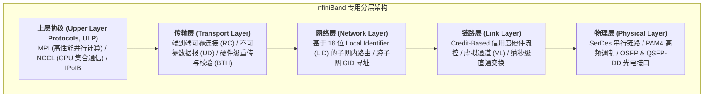
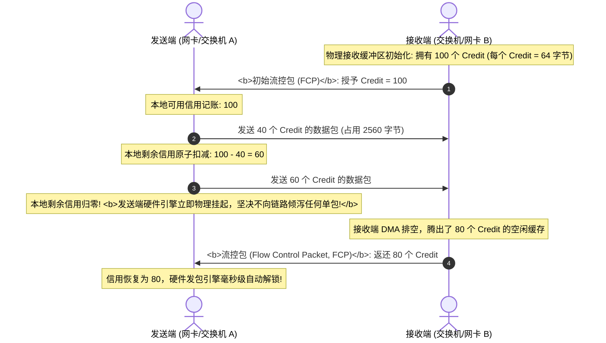
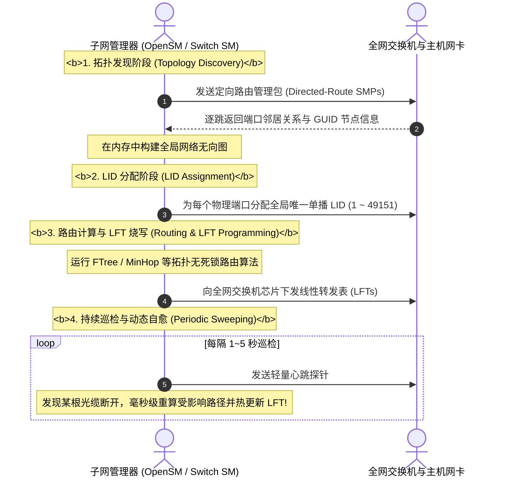

## 引言：超级算力的专属血管 —— 纯血 InfiniBand

在专栏第五讲 [RDMA 高性能通信基石：Kernel Bypass、Zero-Copy、Queue Pair 机制与无损以太网 RoCEv2 全景透视](/articles/rdma-kernel-bypass-zero-copy-queue-pair-rocev2-lossless/) 中，我们见证了以太网为了承载 RDMA 所做的妥协与改造 —— 依靠复杂的 PFC 反压与 DCQCN 拥塞控制在有损介质上拼装“无损环境”。

然而，在人类对极限算力的终极追求中，还有一条完全不同的技术道路：**不向历史遗留的以太网兼容性妥协，从物理电气层、链路层到管理平面，从零重新发明一套专为分布式超算与 AI 大模型而生的专用网络 —— InfiniBand（简称 IB）**。

InfiniBand 诞生于 1999 年的 InfiniBand Trade Association (IBTA)。历经 20 余年演进，在 2026 年生成式 AI 与万卡算力中心的大爆发中，InfiniBand 凭借其**硬件级绝对无损、亚微秒级超低交换时延以及高度集中的全局控制拓扑**，成为了顶尖 AI 超级计算机不可替代的基石。

本文将深入剖析 InfiniBand 协议栈第一性原理：从 **物理层速率演进与高频调制**、**链路层信用度流控与直通交换**，到智算网络的大脑 **子网管理器（Subnet Manager）编排机理**。

---

## 一、 InfiniBand 分层架构与物理层速率演进

InfiniBand 摒弃了以太网臃肿的传统体系，设计了精炼高效的四层专用协议栈：



### 1.1 物理层速率演进路线图：从 SDR 到 2026 年 XDR 800G

InfiniBand 物理链路通常采用 4 条物理通道（4x 聚合宽度）并行传输。随着电气与光子技术的发展，单通道速率经历了跨越式的演进：

| 世代名称 | 缩写 | 单通道速率 (Per-Lane) | 4x 聚合物理带宽 | 编码/调制技术 | 交换芯片代表 | 工业落地时间节点 |
| :--- | :--- | :--- | :--- | :--- | :--- | :--- |
| Single Data Rate | **SDR** | 2.5 Gbps | 10 Gbps | 8b/10b NRZ | 早期 HPC 交换机 | 2001 |
| Double Data Rate | **DDR** | 5.0 Gbps | 20 Gbps | 8b/10b NRZ | Mellanox 早期芯片 | 2005 |
| Quad Data Rate | **QDR** | 10.0 Gbps | 40 Gbps | 8b/10b NRZ | IS5000 系列 | 2008 |
| Fourteen Data Rate | **FDR** | 14.0625 Gbps | 56 Gbps | 64b/66b NRZ | SwitchX-2 | 2011 |
| Enhanced Data Rate | **EDR** | 25.78125 Gbps | 100 Gbps | 64b/66b NRZ | Switch-IB / ConnectX-4 | 2014 |
| High Data Rate | **HDR** | 50 Gbps | 200 Gbps | **PAM4** 调制 | Quantum-1 (QM8700) | 2018 |
| Next Data Rate | **NDR** | 100 Gbps | **400 Gbps** | 100G PAM4 | **Quantum-2 (QM9700)** | 2022~2024 (主流主力) |
| eXtreme Data Rate | **XDR** | 200 Gbps | **800 Gbps** | 200G PAM4 | **Quantum-X800 (Q3400)** | **2026 (顶尖超算标配)** |

- **PAM4 脉冲幅度调制**：从 HDR 世代开始，InfiniBand 弃用传统的 NRZ 二电平调制，引入 PAM4（4 个电压电平），单个脉冲符号即可携带 2 位比特数据（00, 01, 10, 11），在物理波特率不变的前提下将传输速率直接翻倍；
- **2026 工业前沿**：在最新的超算架构中，单台 DGX/HGX 节点配备 8 块 ConnectX-8 网卡，配合 Quantum-X800 交换机，双向带宽达到惊人的 **1600 Gbps（800G 全双工）**！

---

## 二、 链路层第一性原理：Credit-Based 流控与 Cut-Through 交换

以太网本质上是“尽力而为（Best-Effort）”的排队机制，交换机缓冲区爆满时只能粗暴丢包；而 RoCEv2 引入的 PFC 是“事后告警反压”。

InfiniBand 在物理链路层从根本上杜绝了丢包可能 —— **发送端发包的前提，是必须确凿知道接收端有空闲内存！**

### 2.1 Credit-Based 信用度硬件流控模型



#### 数学铁律
- **绝对无损（Zero Packet Drop）**：任何一个数据帧（Flit）向光纤链路打出之前，必须在发送端 ASIC 硬件计数器中完成信用抵扣。如果接收端缓冲区满，发送端物理停止发包；
- **零死锁风险**：流控发生在最底层的点对点物理链路跳步之间，完全基于已分配缓冲区的精准循环计数，不涉及上层的有损网络排队，**天然免疫了以太网 PFC 机制中臭名昭著的拓扑死锁与风暴问题**。

### 2.2 Cut-Through 直通交换：突破 100 纳秒极限

在传统以太网交换机中，普遍采用**存储转发模式（Store-and-Forward）**：交换机必须把整整 1500 字节或 9000 字节的完整数据包全部收齐在片上 SRAM 中，校验 CRC 无误后，才开始查找 MAC/IP 表进行转发，导致单跳交换时延高达数微秒。

InfiniBand 交换机全面强制采用 **直通交换（Cut-Through Switching）**：

```
InfiniBand 报文帧首部结构:
+------------------------------------+--------------------------+-----------------------+
| 本地路由头 (Local Route Header, LRH)| 基本传输头 (BTH)         | 有效载荷 (Payload) ... |
| 仅 8 字节: 包含 Destination LID (16b)| 包含 QP 编号与操作码      | 真实数据               |
+------------------------------------+--------------------------+-----------------------+
     ^
     | 交换机仅读取前 8 字节 LRH
     | 耗时约 30 纳秒直接确定出端口!
```

- 交换机芯片 ASIC 刚接收到报文的前 8 个字节（LRH）并解析出目的端 **DLID（Destination LID）**，内部交叉开关（Crossbar Switch）就**在报文尾部甚至还没从发送端光纤发出的瞬间，直接将数据头部送入目标出口物理通道！**
- **性能飞跃**：单跳交换时延被极致压缩至 **100 纳秒（ns）以内**，仅为传统以太网交换机的 $\frac{1}{20}$！

---

## 三、 控制中枢：子网管理器（Subnet Manager, SM）全局编排

InfiniBand 网络中没有像以太网那样复杂的分布式广播和自主学习机制。整个 InfiniBand 织网（Fabric）是一个高度严密、中央集权的管理系统，其大脑称为 **子网管理器（Subnet Manager, 简称 SM，工业开源实现为 OpenSM）**。

### 3.1 寻址三剑客：GUID、LID 与 LMC

```
InfiniBand 标识体系:
+--------------------------------------------------------------------------+
| 节点全球唯一标识 (Node GUID / Port GUID): 64-bit 硬件唯一烧录 (类似 MAC)   |
+--------------------------------------------------------------------------+
                                    |
                                    v (由 Subnet Manager 在初始化时动态全局编排映射)
+--------------------------------------------------------------------------+
| 本地标识符 (Local Identifier, LID): 16-bit 拓扑路由寻址 (范围 1 ~ 49151)   |
+--------------------------------------------------------------------------+
```

1. **GUID（Global Unique Identifier，64 位）**：
   在芯片出厂时烧录在物理网卡和交换机 ASIC 中的全球唯一身份证；
2. **LID（Local Identifier，16 位）**：
   子网内的拓扑寻址地址，交换机依靠 LID 进行纯硬件高速转发表（Linear Forwarding Table, LFT）查询。**LID 不是网卡固有的，而是 SM 在扫描拓扑后动态分配给每个物理端口的！**
3. **LMC（LID Mask Count，掩码计数）**：
   允许为一个物理端口分配 $2^{LMC}$ 个连续的 LID。例如当 $LMC=3$ 时，单个物理网卡端口可以拥有 8 个不同的合法 LID。上层应用可以利用不同的 LID 在 Fat-Tree 拓扑中走不同的 Spine 交换机，**实现超轻量的多路径硬件流量均衡！**

### 3.2 子网管理器工作全生命周期



### 3.3 主备高可用（Master / Standby SM）
在大规模智算集群中，通常会有多个 SM 实例同时运行（例如部署在两台独立的 Head 节点或两台骨干 Director 交换机上）：
- 各 SM 之间通过优先级参数（`priority`）进行仲裁，选出唯一的 **Master SM** 拥有全网控制权；
- 其余 SM 作为 **Standby SM** 实时同步拓扑。一旦 Master SM 崩溃超时，Standby SM 在毫秒级接管，全网现存的数据面通信完全不受干扰。

---

## 四、 生产环境 InfiniBand 状态诊断实战

登录配备 Mellanox/NVIDIA HCA 的 Linux 节点，执行底层 IB 状态巡检：

```bash
# 1. 查看本地 HCA 网卡物理端口状态、链路速率 (EDR/HDR/NDR) 与分配的 LID
ibstat

# 输出关键字段剖析:
# State: Active                <- 端口成功被 SM 激活
# Physical state: LinkUp       <- 物理光纤信号连通
# Rate: 400 Gb/s (4X NDR)      <- 运行在 400G NDR 线速
# Base lid: 42                 <- SM 分配的本地 LID
# LMC: 0                       <- LID 掩码计数

# 2. 探查当前子网活跃的 Subnet Manager (SM) 信息
sminfo

# 3. 抓取全网拓扑拓扑发现概览 (发现全网多少台交换机和主机)
ibnetdiscover -C mlx5_0 -P 1

# 4. 统计物理链路错误计数器 (定位脏光纤/坏模块导致的物理抖动)
perfquery -C mlx5_0 -P 1
```

---

## 五、 总结与进阶预告

InfiniBand 以专为高性能计算而生的物理架构，构建了与以太网截然不同的网络世界：
- **物理层** 从 HDR、NDR 跨越至 2026 年的 XDR 800G，PAM4 高频调制将单机带宽推向太比特时代；
- **链路层** 依靠 Credit-Based 硬件流控实现 100% 物理级绝对无损，Cut-Through 直通交换消灭了微秒级排队延迟；
- **管理层** 依靠集中式的 Subnet Manager，消除了传统网络广播泛洪，实现全局最优的拓扑编排。

然而，掌握了单条链路与单台交换机之后，**如何把成千上万台配备 8 块 GPU 的服务器（如 DGX H100/H200/B200）用成千上万根光纤织成一张万卡超级网络？**
- 什么是真正意义上的 **Fat-Tree（胖树）** 架构？收敛比如何计算？
- 针对 8-GPU 节点的 **Rail-Optimized（轨道优化）** 拓扑，为什么能让跨节点 GPU 通信彻底免除跨轨道冲突？
- 为什么胖树路由算法必须采用 **FTree 与 Up/Down** 来从数学上严格证明“零信道死锁”？
- NVIDIA 独家的 **自适应路由（Adaptive Routing, AR）** 与 **网内计算减法器（SHARP）** 是如何在交换机物理芯片内部直接替 GPU 算完 All-Reduce 的？

在接下来的**专栏第七讲**中，我们将全面攻入万卡集群组网的最高技术殿堂 —— **[InfiniBand 智算集群组网实战：Fat-Tree 胖树拓扑、Rail-Optimized 轨道优化设计、自适应路由 (AR) 与 SHARP 网内计算](/articles/infiniband-fat-tree-rail-optimized-topology-adaptive-routing-sharp/)**！

---

## 常见问题 (FAQ)

### Q1: InfiniBand 的 Credit-Based 链路流控是如何在保证零丢包的同时，彻底免除以太网 PFC 死锁困扰的？
**根本原因：流控作用域的局部确定性与基于缓冲区的因果隔离。**
- **以太网 PFC 的死锁根源**：PFC 是反应式的端到端流控信号。当交换机队列满载时，交换机向上一跳发送 Pause 帧暂停整条优先级的发包；如果网络拓扑中存在横向链路或多路径循环，多个交换机相互等待对方释放队列，形成闭环等待死锁；
- **InfiniBand Credit 流控的数学本质**：流控是点对点纯物理层硬件行为。每一跳的发送方严格维护一个剩余信用计数器，只有当下游明确发送流控包告知“我有 64 字节的空余物理 SRAM”时，计数器才增加。没有额度就绝对不出芯片。每一跳的物理缓冲区大小是固定的、确定的，配合严格的无环拓扑，数据包单向流水线式推进，从数学模型上杜绝了循环依赖与死锁。

### Q2: 为什么 InfiniBand 一个物理网卡端口可以配置多个 LID（通过 LMC 参数）？这对高性能通信有何关键价值？
**核心价值在于硬件级多路径流量工程与无冲突散列。**
InfiniBand 交换机的转发依靠线性转发表（LFT），根据数据包的目的 LID 决定出端口。如果一台服务器的物理端口只有一个固定的 LID，那么全网其他节点发往该端口的所有流量，在经过中间各级交换机时，都会被哈希/映射到同一条固定的物理链路上，极易造成局部链路打爆；
当在子网管理器中配置 `LMC = 3` 时，该物理端口将同时拥有 $2^3 = 8$ 个合法的单播 LID（例如 Base LID 100 到 107）。通信发起方在建立 Queue Pair 时，可以通过轮询或加权将不同的流发往目标主机的不同 LID，使得中间交换机将它们沿不同的 Spine 交换机物理链路转发，**在无需复杂上层调度的情况下，直接在硬件层面实现完美的多路径负载均衡！**

### Q3: 在超大规模生产集群中，如果运行中的 Master Subnet Manager 进程意外崩溃，正在进行的 AI 大模型万卡训练会立刻中断吗？
**不会立即中断，数据面与控制面完全解耦。**
InfiniBand 架构将控制平面（SM）与数据平面（物理网卡与交换机芯片 ASIC）进行了绝对的物理与逻辑解耦。
当子网管理器完成初始化后，所有主机的 LID 分配与全网交换机的 LFT 线性转发表已经全部固化烧写在交换机芯片的本地 SRAM 硬件表中。即使 Master SM 突然宕机或被杀死，现存的所有 QP 连接和数据流依然能够全速在硬件转发表引导下正常转发。只有当网络中发生物理链路拔插、交换机宕机等拓扑变更，或者有新节点尝试加入网络时，才需要备用 SM（Standby SM）接管来重新计算并更新拓扑。
