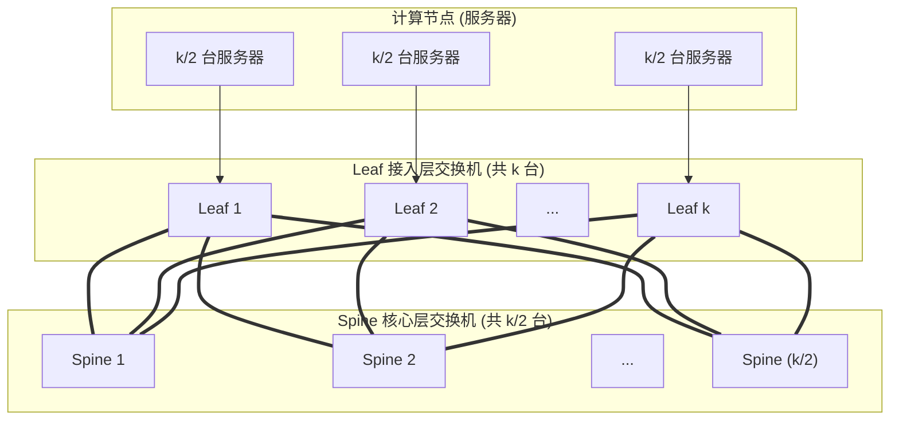
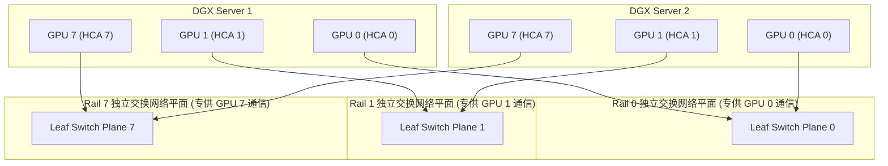
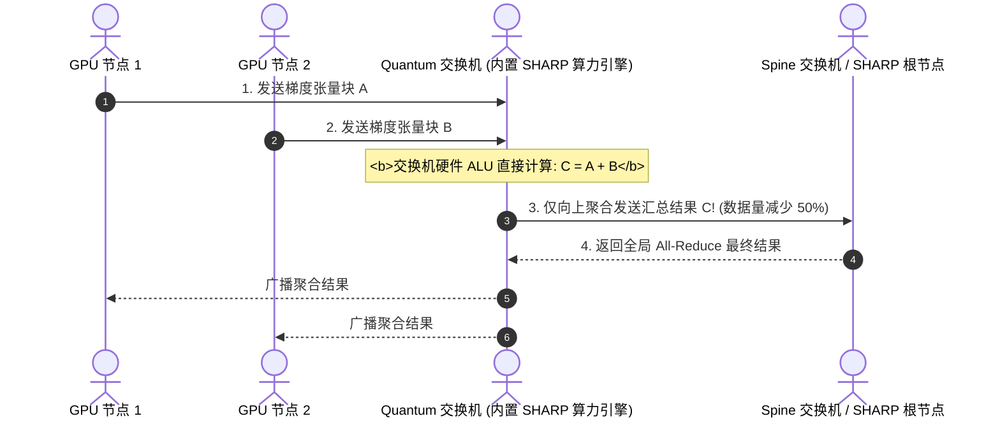

## 引言：当万卡分布式训练遭遇“通信墙”

在上一讲 [InfiniBand 架构第一性原理：物理链路速率演进、Credit-Based 链路级流控与子网管理器 (Subnet Manager) 全局编排](/articles/infiniband-architecture-hardware-rates-credit-flow-subnet-manager/) 中，我们剖析了单机与交换机端口的硬件流控与控制面原理。而在 2026 年的前沿大模型（LLM）与多模态万亿参数训练中，万卡级 GPU 集群已成为工业界标准底座。

训练这类超级模型必须深度结合**张量并行（Tensor Parallelism, TP）**、**流水线并行（Pipeline Parallelism, PP）**与**数据并行（Data Parallelism, DP / ZeRO-3）**：
- **节点内部（Intra-Node）**：8 块 GPU 之间依靠第三代/第四代 NVSwitch 物理总线进行 900 GB/s ~ 1.8 TB/s 的超高速全互联；
- **跨节点（Inter-Node）**：成千上万个 GPU 之间频繁触发海量梯度的 `All-Reduce` 与 `All-to-All` 集合通信。随着算力芯片计算速度呈指数级暴涨，**通信耗时（Communication Overhead）往往占到了单步训练总耗时的 30% ~ 50% 以上！**

如果网络拓扑设计不合理、链路发生哈希拥塞或发生路由死锁，昂贵的万卡 GPU 算力将瞬间发生雪崩式降速。

如何用成千上万根高频光纤，将数千台服务器连接成一张**全局无阻塞（Non-blocking）、绝对零死锁、纳秒级抖动**的超级网络？本文将带你攻入智算网络架构的核心腹地。

---

## 一、 Fat-Tree（胖树）拓扑数学推导与规模极限

传统的计算机网络是“瘦树（Thin Tree）”——越靠近树根，链路越少，带宽越窄。1985 年，麻省理工学院 Charles Leiserson 提出了 **Fat-Tree（胖树）** 理论：**越靠近树根，链路越粗；任意对半切分，双向总带宽恒定不变**。

### 1.1 基于 $k$ 口交换机的 2-Tier 无阻塞胖树数学推导

现代数据中心使用相同端口数 $k$ 的交换机芯片（例如 64 口 400G NDR Quantum-2 QM9700 交换机，$k = 64$）构建标准胖树：



1. **Leaf 层配置**：
   每台 Leaf 交换机拥有 $k$ 个物理端口：
   - $\frac{k}{2}$ 个端口面向下联，直连计算节点；
   - $\frac{k}{2}$ 个端口面向上联，连接到所有的 Spine 交换机；
   - 此时 Leaf 层总交换机数量为 $k$ 台；
2. **Spine 层配置**：
   每台 Spine 交换机拥有 $k$ 个下联端口，分别连接到所有的 $k$ 台 Leaf 交换机；
   - 因此 Spine 层总交换机数量为 $\frac{k}{2}$ 台；
3. **最大支持物理节点数计算公式**：
   
   $$N_{2\text{-tier}} = k \times \frac{k}{2} = \frac{k^2}{2}$$

- **案例计算**：采用 64 口 NDR 交换机（$k=64$），一张两层无阻塞胖树网络最多可接入：
  
  $$N = \frac{64^2}{2} = \frac{4096}{2} = 2,048\text{ 个物理网络端口}$$

### 1.2 3-Tier 胖树：支撑 65,536 个端口的极限规模

当集群规模突破 2,048 节点时，网络必须引入 **Core（核心层）**，构建三层胖树（Pod 化设计）：

$$N_{3\text{-tier}} = 2 \times \left(\frac{k}{2}\right)^3 = \frac{k^3}{4}$$

- **案例计算**：当 $k=64$ 时：
  
  $$N = \frac{64^3}{4} = \frac{262,144}{4} = 65,536\text{ 个 400G 端口！}$$

这足以支撑全球最大的单体 AI 智算中心，且保证任意两点间的收敛比达到**绝对的 1:1 无阻塞**！

---

## 二、 8-GPU 节点的 Rail-Optimized（轨道优化）物理组网

在顶尖 AI 智算服务器（如 NVIDIA DGX H100/H200/B200）中，单台服务器内部挂载 **8 块 GPU** 与 **8 块独立的高速 HCA 网卡**（通过 PCIe Switch/CPU NUMA 严格 1:1 亲和绑定）。

```
DGX 节点内部拓扑与网卡绑定关系:
[ GPU 0 ] <---> [ HCA 0 (mlx5_0) ]
[ GPU 1 ] <---> [ HCA 1 (mlx5_1) ]
[ GPU 2 ] <---> [ HCA 2 (mlx5_2) ]
[ GPU 3 ] <---> [ HCA 3 (mlx5_3) ]
[ GPU 4 ] <---> [ HCA 4 (mlx5_4) ]
[ GPU 5 ] <---> [ HCA 5 (mlx5_5) ]
[ GPU 6 ] <---> [ HCA 6 (mlx5_6) ]
[ GPU 7 ] <---> [ HCA 7 (mlx5_7) ]
```

### 2.1 为什么朴素组网会导致致命的“轨道争抢（Rail Contention）”？
如果采用朴素的组网方式，将单台服务器的 8 块网卡全部插在机架顶部的同一台 Leaf 交换机上：
- 节点内 GPU 0 在执行数据并行 All-Reduce 时，数据包与 GPU 1、GPU 2 的流量在同一台交换机的出入队列发生物理碰撞；
- 多个 GPU 的通信互相挤占缓冲区，引发严重尾部时延抖动。

### 2.2 Rail-Optimized（轨道优化）拓扑架构设计

业界前沿标准采用了极其精巧的 **Rail-Optimized（轨道优化）物理平面隔离**：



#### 架构第一性原理
1. **物理网络切分为 8 个完全平行的 Rail 平面（Rail 0 ~ Rail 7）**；
2. 机房内所有服务器的 **GPU 0（网卡 0）统一接入 Rail 0 专属交换机**，所有服务器的 **GPU 1 统一接入 Rail 1 专属交换机**，以此类推；
3. **零跨轨道冲突**：在大规模数据并行训练中，每个 GPU $i$ 只需要与跨机节点的对等 GPU $i$ 交换梯度。由于所有流量在各自独立的物理轨道平面内狂飙，**GPU 之间彻底消除了交叉干扰与缓冲区争用，整体集合通信性能提升 30% 以上！**

---

## 三、 路由算法与信用死锁破除：FTree 与 Up/Down 模型

在传统网络中，Dijkstra 最短路径算法被广泛使用。但在基于 Credit 流控的胖树网络中，**自由寻路是致命的毒药！**

```
信用死锁循环依赖图 (Credit Loop Deadlock):
[Switch A 缓冲区] ---> 等待 ---> [Switch B 缓冲区]
       ^                                |
       |                                v
[Switch D 缓冲区] <--- 等待 <--- [Switch C 缓冲区]
```

如果允许数据包在交换机之间任意“先下后上”或水平转向，数据包在缓冲区形成的依赖关系将闭合成环，瞬间触发**全网 Credit 死锁，整张网络瞬间冰冻！**

### 3.1 转向模型与 Up/Down 规则
Up/Down 路由算法为网络建立了一套严格的方向规则：
- **铁律：只能“先向上（Up），后向下（Down）”，绝对禁止“先向下，后向上”！**
- 数据包在树形拓扑中向根部攀升时，可以经过任意数量的 Up 跳步；
- 一旦开始向下（Down）朝着目标叶子节点前进，**后续所有跳步只能单向向下（Down），严禁再次向上掉头**；
- **数学证明**：这一规则彻底打破了依赖图中的环路条件，从拓扑逻辑上 100% 证明了**无死锁性（Deadlock-Free）**。

### 3.2 FTree（Fat-Tree 专用路由引擎）
在大规模胖树集群中，OpenSM 提供了专门针对对称胖树优化的 **FTree 引擎**：
- 它不仅继承了严格的 Up/Down 无死锁原则；
- 还能感知胖树的层级结构，自动将下行路径与上行路径在所有等价 Spine 链路上进行**确定性、绝对均摊的单播流分发**，消除了局部拥塞。

---

## 四、 硬件级黑科技：自适应路由 (AR) 与 SHARP 网内计算

### 4.1 自适应路由（Adaptive Routing, AR）

传统的 ECMP 路由根据静态五元组/LID 哈希将数据流绑定在一条物理链路上。当两条大象流（Elephant Flow）不幸哈希到同一根光纤时，该链路立即拥塞，而旁边的空闲光纤却在闲置。

NVIDIA Quantum 交换机芯片内置了硬件级的 **自适应路由（Adaptive Routing, AR）**：
- 交换机芯片在纳秒级周期内实时检测各出口端口的**内部队列深度与信用度消耗速度**；
- 当发现预定出口发生轻微积压时，交换机在物理芯片内部**实时动态修改数据包出口，将其引流至轻载的备用 Spine 链路**；
- **乱序重排支持**：动态引流会导致报文在不同路径传输产生轻微乱序。ConnectX-7/8 网卡内部拥有专用的硬件重排缓冲区，能够在用户态程序无感知的前提下将数据包秒级重组还原，**使整个网络的有效利用率从 65% 跃升至 95% 以上！**

### 4.2 SHARP：交换机网内规约计算（In-Network Reduction）

在传统的分布式深度学习中，All-Reduce 操作需要经过复杂的环形（Ring）或树形（Tree）算法，数据必须先从 GPU 发给网络，再跨网络发给对端 GPU，由对端 GPU 的 Tensor Core 执行浮点加法运算，最后再把结果广播回来。

**SHARP（Scalable Hierarchical Aggregation and Reduction Protocol）颠覆了这一范式：把浮点加法直接搬进交换机芯片！**



- **数据吞吐减半**：网络中流淌的通信数据包数量直接减半；
- **GPU 算力解放**：GPU 无需消耗自身昂贵显存带宽和计算单元去执行规约加法；
- **极速低时延**：通信步骤由 $2(N-1)$ 步锐减至接近树形常数步，大幅压缩集合通信等待时间。

---

## 五、 生产环境 OpenSM 路由与加速配置实战

在主控节点的 `/etc/opensm/opensm.conf` 中配置生产级无死锁与加速引擎：

```ini
# 1. 强制启用 FTree 路由引擎 (若非严格对称胖树，回退到 updn)
routing_engine ftree,updn

# 2. 启用自适应路由 (Adaptive Routing) 支持
ar_enable 1

# 3. 配置子网轮巡周期 (单位秒，保持对物理链路微秒级故障的快速收敛)
sweep_interval 3

# 4. 优化多路径均衡 (配置每个端口的 LID 掩码计数，开启多 LID 硬件分流)
lmc 2

# 5. 开启 SHARP 集合通信硬件拓扑树构建
sharp_enable 1
```

---

## 六、 总结与进阶预告

从 Leiserson 胖树拓扑的严格数学推导，到专为 8-GPU 节点定制的 Rail-Optimized 八平面独立物理布线；从 FTree/UpDown 转向模型打破信用死锁，到 Adaptive Routing 与 SHARP 硬件级网内聚合，我们彻底掌握了万卡 AI 智算超级网络的架构精髓。

然而，掌握了网络架构理论后，**如何在真实的物理机房中落地部署、调试与调优一张万卡 InfiniBand 网络？**
- 生产环境中 **MLNX_OFED / DOCA 驱动** 如何精准编译安装？
- 如何配置双机 **OpenSM 主备高可用仲裁**，避免脑裂？
- 面对数万根光纤，如何使用 `ibdiagnet`、`iblinkinfo` 与 `flint` 固件工具在几秒钟内揪出单根掉速的“脏光纤”与“坏模块”？
- 在 GPU 应用程序层，如何通过 **GPUDirect RDMA (`nvidia-peermem`)** 彻底打通显存与网卡直通？NCCL 的核心环境变量（`NCCL_IB_HCA`, `NCCL_NET_GDR_LEVEL=5`）该如何极限调优？

在专栏的**最终收官第十二讲**中，我们将踏入真实的裸金属运维战场 —— **[InfiniBand 生产级集群落地运维与 NCCL 极限调优：OFED 驱动、OpenSM 主备高可用、ibdiagnet 巡检与 GPUDirect RDMA 实战](/articles/infiniband-production-deployment-opensm-ofed-nccl-tuning/)**！

---

## 常见问题 (FAQ)

### Q1: 为什么 Rail-Optimized（轨道优化）组网能对大模型训练中的张量并行（TP）与数据并行（DP）产生巨大的加速效果？
**根本原因在于集合通信通信模式与物理拓扑的完美正交映射。**
在分布式 LLM 训练中，计算被划分为不同维度的通信子环：
1. **张量并行（TP）通信频次最高、数据量极大**：它被严格限制在单台服务器内部的 8 块 GPU 之间，通过纳秒级的 NVSwitch 物理总线完成，完全不走外部网络；
2. **数据并行（DP / ZeRO）通信覆盖跨机节点**：每个 GPU $i$ 只需要与所有其他机器上的同序号 GPU $i$ 进行梯度同步。
在 Rail-Optimized 拓扑中，GPU 0 到 GPU 7 的外部流量被分别强制锁定在 8 个相互隔离的物理交换机平面（Rail 0 ~ Rail 7）中。GPU 0 的通信绝不与 GPU 1 的通信共享任何一根光纤或交换机队列，消除了跨流争抢与排队抖动，使跨机 All-Reduce 跑满 100% 物理极限线速。

### Q2: 什么是转向模型（Turn Model），为什么 Up/Down 路由算法必须严格禁止“先下后上”？
**根本原因：打破死锁资源依赖环（Resource Dependency Loop）的充分必要条件。**
在 Credit 流控机制下，每个交换机端口的接收缓冲区都是一个有限的资源。当数据包跨跳传输时，它占有着当前缓冲区并请求下一跳的缓冲区。
如果允许数据包“先沿树向下走，再掉头沿树向上走”，网络中就会形成“上 $\to$ 下 $\to$ 上 $\to$ 下”的依赖闭环。一旦网络发生微拥塞，闭环内的交换机全部陷入互相等待对端释放缓冲区的僵局（即 Credit Loop Deadlock）。
Up/Down 规则从图论层面规定：**每个数据包的路径由零个或多个 Up 跳步、后跟零个或多个 Down 跳步构成**。由于任何路径都无法从 Down 状态逆转回 Up 状态，依赖图严格呈现单向拓扑排序，数学上不可能构造出任何有向环，从而彻底消除死锁。

### Q3: SHARP 网内计算技术是如何在 GPU 集合通信中实现近乎 2 倍的性能跃升的？
**通过把规约运算从端点（GPU）转移到网络中继点（交换机 ASIC），将双向通信流量折半。**
在传统的 GPU Ring All-Reduce 中，数据必须在全网 GPU 之间环形传递两次（Reduce-Scatter 阶段与 All-Gather 阶段），网络总数据传输量为 $2 \times \frac{N-1}{N} \times \text{DataSize}$，且每个 GPU 都要耗费 Tensor Core 周期去计算浮点加法。
在启用 SHARP 技术的 InfiniBand 网络中：
1. 各 GPU 节点只需向各自接入的 Leaf 交换机单向推送自己的局部梯度；
2. 交换机硬件内置的浮点运算单元（ALU）在数据穿透交换芯片的纳秒间，**实时就地将下联多个端口的数据执行并行累加**，并只将单一聚合结果向上送往 Spine；
3. Spine 最终汇聚出全网结果后，沿树形拓扑多播广播返回给所有节点。
通信链路上的实际数据搬运量直降约 50%，同时 GPU 算力得到 100% 释放，直接斩获接近翻倍的集合通信加速比。
