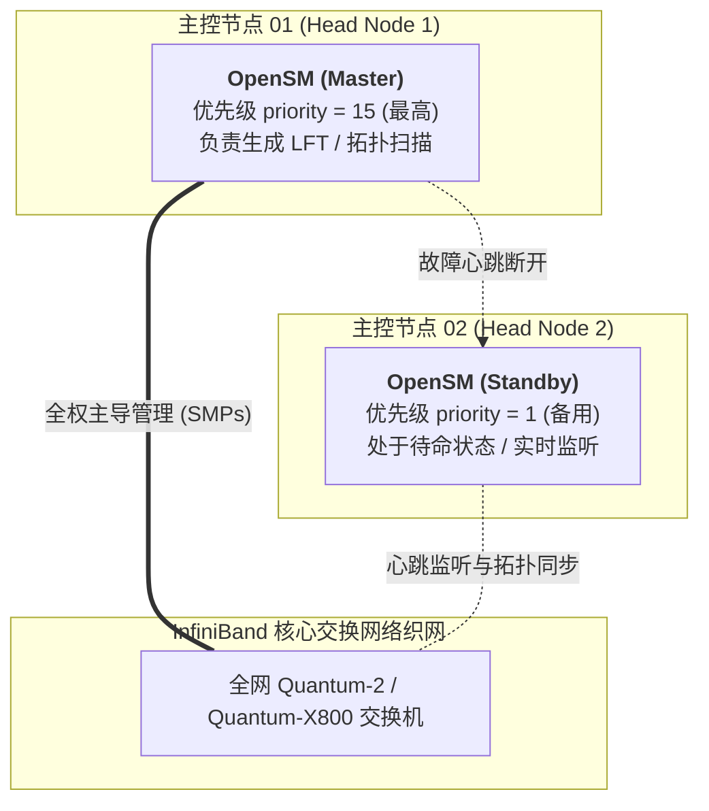
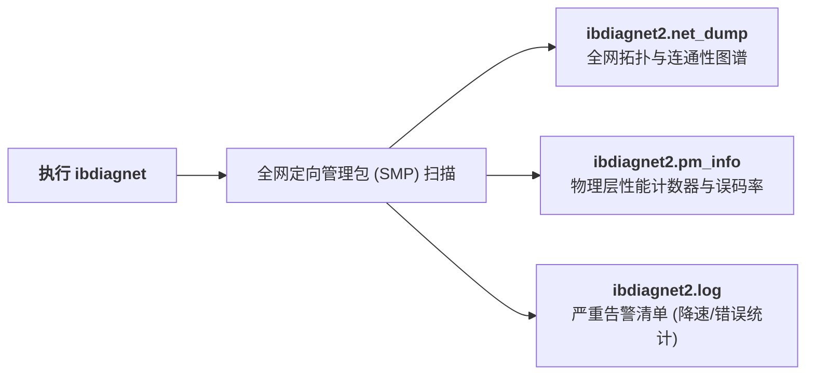
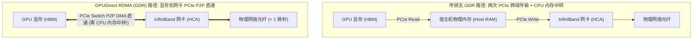
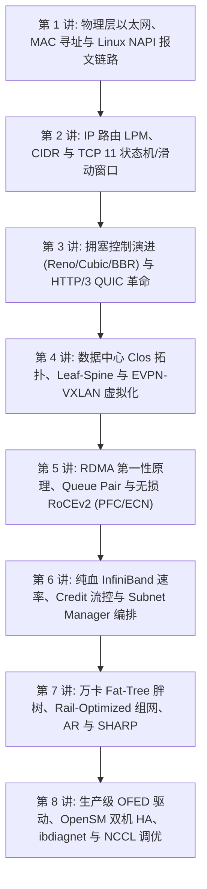

## 引言：从拓扑图纸到万卡机房运维的“深水区”

在前面的七个章节中，我们从最底层的以太网物理信号与 Linux 内核收发包链路，一路走到了 Clos Leaf-Spine 组网、RDMA 零拷贝、InfiniBand 物理信道与 Rail-Optimized 胖树架构。

然而，在真实生产机房中落地一个由数千台 8-GPU 节点（如 DGX H100/H200/B200）、数万根高速光纤组成的超级 InfiniBand 集群时，**理论上的“完美拓扑”往往会撞上残酷的物理现实**：
- **光模块脏污与降速协商**：某根光纤在插入时沾染微尘，400G NDR 网卡在未经告警的情况下自动降速协商至 200G HDR 甚至 1X 链路，引发全网 All-Reduce 长尾等待；
- **子网管理器脑裂与雪崩**：控制中枢 OpenSM 进程意外崩溃或配置冲突，导致全网交换机转发表混乱；
- **GPUDirect RDMA 静默失效**：由于内核模块未加载，NCCL 静默降级回“显存 $\to$ 主机内存 $\to$ 网卡”的低效双重拷贝，万卡集群集合通信带宽暴跌 70%！

本文作为**《深入浅出计算机网络：从以太网原理到万卡 InfiniBand 架构实战》的收官终章**，将带你踏入真实的裸金属运维战场，全景式攻克驱动部署、OpenSM 双机高可用、ibdiagnet 全网巡检与 NCCL 极限调优。

---

## 一、 主机驱动栈与固件管理：MLNX_OFED 与 DOCA

在 Linux 宿主机上，InfiniBand 与 RoCE 依赖一套深度的内核与用户态驱动体系 —— **MLNX_OFED（OpenFabrics Enterprise Distribution）** 或集成于 **NVIDIA DOCA** 环境中。

```
主机 InfiniBand 驱动分层体系:
+-------------------------------------------------------------------------+
| 用户态应用层: PyTorch / NCCL / MPI / ibverbs 测试工具 (ib_write_bw)       |
+-------------------------------------------------------------------------+
| 用户态驱动库: libibverbs.so, libmlx5.so, librdmacm.so                    |
+-------------------------------------------------------------------------+
| 内核协议层  : ib_core.ko, ib_uverbs.ko, ib_ipoib.ko, rdma_cm.ko           |
+-------------------------------------------------------------------------+
| 硬件驱动层  : mlx5_core.ko, mlx5_ib.ko                                   |
+-------------------------------------------------------------------------+
| 物理网卡硬件: ConnectX-7 / ConnectX-8 HCA ASIC (PCIe Gen5 x16)           |
+-------------------------------------------------------------------------+
```

### 1.1 驱动编译与内核模块加载
在 Ubuntu/Debian 或 RHEL/Rocky Linux 上安装 OFED 驱动的标准流程：

```bash
# 1. 挂载 OFED ISO 镜像并静默编译安装 (保留内核 DKMS 支持)
./mlnxofedinstall --without-fw-update --add-kernel-support --dkms -q

# 2. 重启驱动服务并加载核心模块
/etc/init.d/openibd restart

# 3. 验证关键内核模块是否成功驻留内存
lsmod | grep -E "mlx5_core|mlx5_ib|ib_uverbs"
```

### 1.2 固件诊断与光模块巡检工具（flint & mlxlink）

在生产集群中，网卡固件版本必须与集群基线严格保持一致，光纤物理状态可通过 Mellanox 专属工具秒级透视：

```bash
# 1. 探测当前 PCIe 总线上挂载的所有 Mellanox 设备
mst start
mst status -v

# 2. 使用 flint 查询指定网卡固件版本与 ROM 信息
flint -d /dev/mst/mt4129_pciconf0 query

# 3. 诊断物理光模块电气指标 (发射光功率、接收光功率与误码率)
mlxlink -d /dev/mst/mt4129_pciconf0 -m
```

---

## 二、 子网管理器双机热备（OpenSM HA）高可用架构

在专栏第六讲中，我们知道 **Subnet Manager（SM）** 是整个 InfiniBand 织网的神经中枢。如果集群中唯一的 SM 节点掉电，虽然现存连接不受影响，但网络将彻底丧失拓扑自愈能力。

在生产环境中，必须在两台独立的物理主控节点（Head01 与 Head02）上配置 **Master / Standby 仲裁高可用**：



### 2.1 生产级 `/etc/opensm/opensm.conf` 核心参数

在主节点 Head01 上配置高优先级：
```ini
# 1. 仲裁优先级 (取值范围 0 ~ 15，值越大优先级越高)
priority 15

# 2. 指定无死锁 FTree 胖树路由算法
routing_engine ftree,updn

# 3. 子网轮巡周期 (秒)
sweep_interval 3

# 4. 启用硬件级自适应路由与 SHARP
ar_enable 1
sharp_enable 1

# 5. 日志与转发表输出路径
log_file /var/log/opensm.log
dump_files_dir /var/log/opensm_dump/
```

在备用节点 Head02 上，除配置 `priority 1` 外，其余参数保持完全对称。

### 2.2 验证主备选举状态
通过 `sminfo` 命令实时查询当前子网选举出的 Master SM：

```bash
sminfo
# 输出解析:
# sminfo: sm lid 1 sm guid 0x08c0eb030085a120, priority 15 state 3 (MASTER)
```
- `state 3` 代表当前节点成功当选为 **MASTER**；
- 若主节点宕机，备节点的 `state` 将在 3 秒（`sweep_interval`）内从 `STANDBY` 自动跃迁至 `MASTER`，平滑接管全网！

---

## 三、 全网健康巡检：ibdiagnet 自动化体检

在包含数万根高频光纤的集群中，物理线缆松动、光纤弯曲过度或光模块老化是家常便饭。NVIDIA 官方提供了工业级巡检利器 —— **`ibdiagnet`**。



### 3.1 运行全网深度体检
```bash
# 针对 mlx5_0 端口执行全网物理层扫描并输出到指定目录
ibdiagnet -c 50000 -v -o /var/log/ibdiagnet_report/
```

### 3.2 揪出物理层隐患的核心指标
打开 `/var/log/ibdiagnet_report/ibdiagnet2.log`，重点排查三大致命告警：

1. **链路速率降级（Link Speed Degradation）**：
   ```
   -W- Marked link speed mismatch: Port 12 of Switch GUID 0x... is running at 200G (HDR) instead of 400G (NDR)!
   ```
   **排查**：两端光模块没有插紧，或者线缆存在物理折损，强制重新拔插或更换光纤；
2. **符号错误溢出（SymbolErrorCounter）**：
   网卡在物理电光转换过程中出现误码。若该计数器每秒持续递增，代表光纤受强干扰或激光器老化，必须立即下线维修；
3. **链路完整性错误（LinkErrorRecoveryCounter）**：
   链路曾多次发生微秒级断连并重新协商，极易引发集合通信集体超时。

---

## 四、 GPU 极致加速：GPUDirect RDMA 与 NCCL 调优实战

在分布式大模型训练中，GPU 之间的数据传输默认需要通过 CPU 内存做二次中转。**GPUDirect RDMA（GDR）** 彻底打破了这一桎梏。



### 4.1 激活 GPUDirect RDMA：`nvidia-peermem` 内核驱动

GPUDirect RDMA 依赖 NVIDIA 官方内核桥接模块 `nvidia-peermem`，用于在 NVIDIA GPU 驱动与 Mellanox OFED `ib_core` 驱动之间传递显存物理地址指针：

```bash
# 1. 确认内核已加载 nvidia-peermem 驱动模块
modprobe nvidia-peermem
lsmod | grep nvidia_peermem

# 2. 设置开机自启
echo "nvidia-peermem" >> /etc/modules-load.d/modules.conf
```

### 4.2 NCCL 生产级环境变量黄金配置

在拉起 PyTorch / Megatron-LM / DeepSpeed 分布式大模型训练前，必须在脚本中注入以下核心调优参数：

```bash
# 1. 开启极致调试信息，排查 GDR 是否成功握手激活
export NCCL_DEBUG=INFO
export NCCL_DEBUG_SUBSYS=INIT,ENV,NET

# 2. 严格指定节点内 8 块 GPU 对应的 8 块 InfiniBand 网卡 (严格 1:1 NUMA 亲和映射)
export NCCL_IB_HCA=mlx5_0,mlx5_1,mlx5_2,mlx5_3,mlx5_4,mlx5_5,mlx5_6,mlx5_7

# 3. 强制开启最高等级的 GPUDirect RDMA (级别 5: 允许跨 PCIe 根复合体跨域 GDR)
export NCCL_NET_GDR_LEVEL=5

# 4. 优化环形缓冲区内存大小 (NDR 400G / XDR 800G 推荐设置为 8MB，大幅提升并发流吞吐)
export NCCL_BUFFSIZE=8388608

# 5. 开启自适应路由协同与 SHARP 支持 (在支持的集群中)
export NCCL_NET_GDR_READ=1
export NCCL_COLLNET_ENABLE=1
```

### 4.3 压测验收：NCCL Tests 性能基准测试

使用官方 `nccl-tests` 验证跨机 All-Reduce 真实总线带宽（Bus Bandwidth）：

```bash
# 在两台 DGX 节点上运行 8 卡 All-Reduce 性能测试 (从 64MB 压测至 8GB)
mpirun -np 16 \
    -H dgx-node-01:8,dgx-node-02:8 \
    --bind-to numa \
    -x NCCL_DEBUG=INFO \
    -x NCCL_IB_HCA=mlx5_0,mlx5_1,mlx5_2,mlx5_3,mlx5_4,mlx5_5,mlx5_6,mlx5_7 \
    -x NCCL_NET_GDR_LEVEL=5 \
    /opt/nccl-tests/build/all_reduce_perf -b 64M -e 8G -f 2 -g 1
```

- **合格基线标准**：
  在 DGX H100（8 块 400G NDR 网卡）集群中，单节点跨机 All-Reduce 的总线带宽（Bus Bandwidth）必须稳定在 **360 GB/s 以上**（接近理论物理极限 400 GB/s 的 90%+）；
  如果测得的带宽仅有 50 ~ 100 GB/s，说明 GPUDirect RDMA 发生了静默降级或某张网卡降速协商，需立即根据日志排查！

---

## 五、 全专栏终局总结与全景技术版图

行文至此，我们的八讲硬核长文**《深入浅出计算机网络：从以太网原理到万卡 InfiniBand 架构实战》**迎来了最终的圆满收官！

让我们重新回顾这条波澜壮阔的计算机网络登顶之路：



从人类早期在铜线与光纤中对电光信号的朴素调度，到互联网时代在混乱丢包的物理信道上抽象出可靠有序的 TCP 字节流；从数据中心时代打破 STP 枷锁走向全无阻塞的 Leaf-Spine 与 Overlay 虚拟化，再到 AI 算力军备竞赛中粉碎 CPU 拷贝枷锁、依靠 RDMA 与纯血 InfiniBand 在万卡矩阵间以纳秒级时延搬运海量张量 ——

**计算机网络的发展史，本质上是人类计算文明不断对抗物理延迟、粉碎带宽瓶颈、征服数据熵增的伟大史诗！**

---

## 常见问题 (FAQ)

### Q1: 在运行 `nccl-tests` 时，如何排查 GPUDirect RDMA 是否在底层发生了“静默降级（Silent Fallback）”？
**排查手段：查看 NCCL 日志输出中的通信传输方式（Transport）关键字。**
在环境变量中配置 `export NCCL_DEBUG=INFO` 并执行压测。
- **正常启用 GDR**：日志中会显式打印出 `NET/IB : Using GPUDirect RDMA`，并且对于跨机 GPU 之间的通道，传输模式标记为 `NET/IB/0/GDRDMA`；
- **静默降级为 CPU 中转**：日志中会显示 `NET/IB : GPU Direct RDMA Disabled` 或传输模式变为 `NET/IB/0/Shared-Memory`。
**常见诱因**：
1. 宿主机内核未加载 `nvidia-peermem` 模块；
2. PCIe 拓扑中，网卡与 GPU 没有插在同一个 PCIe Switch 或同一个 CPU NUMA 节点下，且未配置 `NCCL_NET_GDR_LEVEL=5` 允许跨 Root Complex 传输；
3. BIOS 中未开启 `ACS (Access Control Services)` 绕行设置或未启用 `IOMMU` 对应直通配置。

### Q2: 在包含数千根光纤的超大规模 InfiniBand 集群中，如何使用 `ibdiagnet` 极速定位单根掉速的“脏光纤”或坏模块？
**排查步骤与过滤方案**：
1. 在主控节点运行 `ibdiagnet -o /tmp/ibdiag_out` 生成巡检报告；
2. 过滤降速协商（Speed Mismatch）：
   在输出的 `ibdiagnet2.log` 中搜索字符串 `speed mismatch` 或 `width mismatch`。此项会直接列出本应运行在 4X NDR (400G) 却意外降速协商在 2X 或 HDR (200G) 的具体交换机 GUID 与端口号；
3. 过滤高误码端口（Symbol Errors）：
   在 `ibdiagnet2.pm_info` 中，查找 `SymbolErrorCounter` 计数器非零且数值最大的端口。
定位后，运维工程师直接携带光纤清洁笔或备用光模块，按照报告给出的机架位置精确定向更换，无需盲目排查全网。

### Q3: 在双机 OpenSM（主备 HA）部署中，如果两台主控节点之间的网络出现异常，如何防止“脑裂（Split-Brain）”引发全网震荡？
**根本机制：InfiniBand 规范原生内置的优先级抢占仲裁与单 Master 事务机制。**
在 InfiniBand 架构中，子网管理包（SMP）是直接在物理织网内点对点传输的。
1. **Master SM 心跳权威性**：Master SM（优先级 15）会以固定周期（如 3 秒）向全网交换机发送心跳和轮询包。全网交换机只接受当前有效持有 Master 租约的 SM 所下发的 LFT 线性转发表；
2. **仲裁机制**：即使两台主控节点的带外以太网断开，备用 SM（优先级 1）也会通过 InfiniBand 物理光纤探测到网络中仍有高优先级的 Master SM 在正常工作，因此会一直安分地停留在 `STANDBY` 状态，坚决不会主动发起夺权；
3. **只有当主节点彻底掉电**、全网所有交换机连续多个周期收不到优先级 15 的心跳包时，备用节点才会正式升主，从而在硬件协议层面彻底杜绝了脑裂发生。
