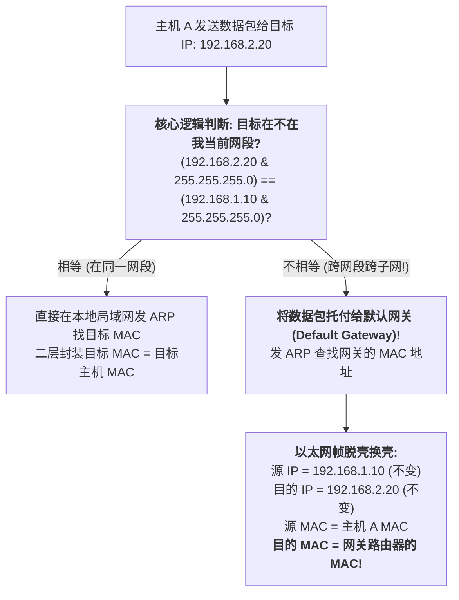
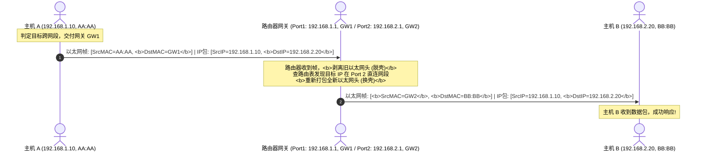

## 引言：当整个地球都需要互相寻址

在专栏第一讲 [从零认识计算机网络：比特信号、网线介质、集线器冲突域到交换机 MAC 寻址第一性原理](/articles/network-fundamentals-bits-cables-hubs-switches-mac-arp/) 中，我们见证了二层交换机如何依靠网卡的物理 MAC 地址在局域网内精准转发数据。

但我们也留下了一个巨大的悬念：**如果全世界几十亿台电脑只用 MAC 地址通信，网络会瞬间毁灭！**
- **MAC 地址没有“地理层级”**：它就像身份证号，不包含任何“你在哪个城市、哪栋楼”的位置信息。全世界的交换机就算把内存撑爆，也存不下全球数十亿块网卡的物理端口位置；
- **ARP 广播风暴会摧毁一切**：二层寻址依赖广播找人。如果全球都在一个大局域网里，只要有一台电脑发出一声 ARP 广播，全世界几十亿台电脑必须同时停下手头工作来处理这个广播包！

为了让网络具备跨越城市、国家和大洋的寻址能力，计算机科学家在物理 MAC 之上，抽象出了**网络层（Layer 3）**与**逻辑 IP 地址**。

本讲将**从最基础的二进制数学开始**，带你手把手推导：**IP 地址到底长什么样？子网掩码（Subnet Mask）是如何精确划分网络号与主机号的？跨网段通信时，默认网关究竟是如何工作的？**

---

## 一、 IPv4 地址物理形态：32 位二进制与点分十进制

我们在电脑上配置的形如 `192.168.1.1` 的 IP 地址，在计算机硬件和路由器芯片内部，本质上是一个**严格的 32 位二进制数字（32 Bits）**。

### 1.1 为什么每个数字最大只能是 255？

为了方便人类阅读和记忆，网络工程师发明了**点分十进制表示法（Dotted-Decimal Notation）**：
1. 将 32 位二进制数，每 **8 位（8 Bits = 1 Byte，1 字节）** 切成一段，分成 4 个段（也称 4 个 Octet）；
2. 段与段之间用英文圆点 `.` 隔开；
3. 将每个 8 位二进制段，分别换算为人类熟悉的十进制数字。

```
32 位 IPv4 地址的物理二进制结构:
 二进制:   11000000  .  10101000  .  00000001  .  00000001
 长度:     8 Bits       8 Bits       8 Bits       8 Bits   = 32 Bits (4 字节)
 权值:    128+64=192   128+32+8=168     1            1
 十进制:     192     .     168    .      1     .      1
```

- **数学第一性原理**：
  8 位二进制能表达的最小数值是 `00000000`（十进制为 $0$）；最大数值是 `11111111`（即 $128+64+32+16+8+4+2+1 = 255$）。
  **因此，IPv4 地址的每一个分段，数值范围必须且只能在 $0 \sim 255$ 之间，绝对不可能出现类似 `192.168.1.300` 这样的荒谬地址！**

---

## 二、 子网掩码（Subnet Mask）核心机理与数学推导

如果说 IP 地址相当于一个快递收件地址，那么它必须同时包含两个部分：
1. **网络号（Network ID）**：指明你属于“哪个城市、哪条街”（确定目标局域网/网段）；
2. **主机号（Host ID）**：指明你是这条街上的“几号门牌”（确定局域网内具体的某台电脑）。

问题来了：面对一个光秃秃的 `192.168.1.100`，路由器怎么知道前多少位是“街区号”，后多少位是“门牌号”？

**答案是：依靠子网掩码（Subnet Mask）的掩护与切割！**

### 2.1 什么是子网掩码？

子网掩码同样是一个 32 位的二进制数字。它的结构有着极其严苛的数学铁律：
- **前面必须是一长串连续的 `1`**（代表网络号对应的位置，不允许间隔）；
- **后面必须是一长串连续的 `0`**（代表主机号对应的位置）。

```
经典子网掩码示例 (255.255.255.0):
 十进制:      255    .     255    .     255    .      0
 二进制:   11111111  .  11111111  .  11111111  .  00000000
 含义:    | <--------- 连续 24 个 1 (网络位) ---------> | <- 8个0(主机位) -> |
```

### 2.2 二进制按位与（Bitwise AND）与网络地址计算

计算机底层判定一个 IP 属于哪个网段，执行的是极速的硬件级**按位与（`&`）运算**：
- 按位与规则：`1 & 1 = 1`；`1 & 0 = 0`；`0 & 1 = 0`；`0 & 0 = 0`（只有两者皆为 1，结果才为 1）。

**网络地址（Network Address）计算公式**：

$$\text{网络地址} = \text{IP 地址} \ \& \ \text{子网掩码}$$

### 2.3 手把手推导实战：以 `192.168.1.130/26` 为例

在现代网络工程中，我们常用斜杠表示法（CIDR），例如 `192.168.1.130/26`。其中 `/26` 代表**子网掩码前 26 位全部是 1**。

让我们手工进行一次严谨的数学推导：

```
步骤 1: 将子网掩码 /26 展开为二进制与十进制
掩码二进制: 11111111.11111111.11111111.11000000  (共 26 个 1，后面补 6 个 0)
第四段权值: 128 + 64 = 192
掩码十进制: 255.255.255.192

步骤 2: 将 IP 192.168.1.130 展开为二进制
第四段十进制 130 转换为二进制: 128 + 2 = 10000010
IP 二进制 : 11000000.10101000.00000001.10000010

步骤 3: 逐位执行按位与 (Bitwise AND) 运算:
   IP  地址: 11000000 . 10101000 . 00000001 . 10000010 (192.168.1.130)
   子网掩码: 11111111 . 11111111 . 11111111 . 11000000 (255.255.255.192)
--------------------------------------------------------------------------
   网络地址: 11000000 . 10101000 . 00000001 . 10000000 (192.168.1.128)
```

至此，我们推导出了该网段的**网络地址为 `192.168.1.128`**！

### 2.4 广播地址与可用主机范围（为什么容量要减 2？）

在划分出来的子网中，还剩下最后 $32 - 26 = 6$ 位作为主机位（$H = 6$）。
- 主机位共有 $2^6 = 64$ 种组合（从 `000000` 到 `111111`）；
- **全 0 保留为网络地址**：主机位全为 0 的地址（`192.168.1.128`）代表这个网段本身，不能分配给任何电脑；
- **全 1 保留为广播地址（Broadcast Address）**：主机位全为 1 的地址代表向该网段内所有主机同时广播喊话：
  第四段为 `10111111`，换算十进制为 $128 + 32 + 16 + 8 + 4 + 2 + 1 = 191$。
  **该网段的定向广播地址为 `192.168.1.191`！**

**可用主机 IP 容量计算公式**：

$$\text{有效主机数} = 2^H - 2 = 2^6 - 2 = 62\text{ 台}$$

- **有效可分配 IP 范围**：
  从网络地址加 1，到广播地址减 1 —— 即 **`192.168.1.129` 至 `192.168.1.190`**！

---

## 三、 从传统有类网络（Classful）到 CIDR 与私网地址

### 3.1 早期分类寻址的致命缺陷

在互联网诞生早期，计算机科学家将 IPv4 划分为固定分类：
- **A 类（前 8 位网络号，默认 `/8`）**：每个网段拥有 $2^{24} - 2 \approx 1677\text{万}$ 台主机！
- **B 类（前 16 位网络号，默认 `/16`）**：每个网段拥有 $2^{16} - 2 = 65,534$ 台主机；
- **C 类（前 24 位网络号，默认 `/24`）**：每个网段只有 $2^{8} - 2 = 254$ 台主机。

**历史悲剧**：一家拥有 500 台电脑的公司，申请 C 类不够用，只能申请一个 B 类网段，导致剩余的 65,000 个 IP 被永久白白闲置，导致全球公网 IPv4 地址迅速濒临枯竭！

### 3.2 CIDR（无类别域间路由）与变长子网掩码（VLSM）
1993 年推出的 **CIDR（RFC 1519）** 彻底撕毁了 ABC 类的刻板边界，允许网络前缀长度为任意数值（如 `/21`、`/26`、`/30`），从而实现了 IP 资源的极致按需切分。

### 3.3 私有保留 IP 地址池（RFC 1918）
为了进一步节约公网 IP，互联网管理机构规定了一组**私网 IP（Private IP）**。任何人在家庭、办公室或机房内部都可以免费使用，这些地址绝对不会在公网互联网中被路由转发：

| 级别 | 私有网段范围 | CIDR 前缀 | 包含的 IP 数量 | 典型应用场景 |
| :--- | :--- | :--- | :--- | :--- |
| **A 类私网** | `10.0.0.0` ~ `10.255.255.255` | `10.0.0.0/8` | $16,777,216$ | 大型云计算 VPC、数据中心内网 |
| **B 类私网** | `172.16.0.0` ~ `172.31.255.255` | `172.16.0.0/12` | $1,048,576$ | 企业中型园区网、Kubernetes Pod 网段 |
| **C 类私网** | `192.168.0.0` ~ `192.168.255.255` | `192.168.0.0/16` | $65,536$ | 家庭 Wi-Fi 路由器、小型办公室局域网 |

- **特殊地址警示**：
  - `127.0.0.0/8`：**环回地址（Loopback）**，最常见的是 `127.0.0.1`（localhost），数据包不经网卡硬件，直接在内核协议栈内部折返；
  - `169.254.0.0/16`：**链路本地地址（APIPA）**，当电脑开启 DHCP 自动获取 IP 却联系不上 DHCP 服务器时，操作系统临时给自己随机分配的“瘫痪兜底 IP”。

---

## 四、 跨网段通信与默认网关（Default Gateway）的本质

现在，两台电脑配置好了 IP 和掩码：
- 主机 A：`192.168.1.10/24`（MAC: `AA:AA`）
- 主机 B：`192.168.2.20/24`（MAC: `BB:BB`）

当主机 A 在终端敲下 `ping 192.168.2.20` 时，**操作系统底层究竟在经历怎样的判定逻辑？**



### 4.1 初学者最大误区：跨网段通信的“脱壳与换壳”

很多初学者容易产生一个致命误解：“跨网段发包，既然目标是主机 B，那以太网帧的目的 MAC 肯定是主机 B 的 MAC 呀！”

**这是绝对错误的！**
1. 主机 A 的物理网线只连在本地交换机上，它发出的 ARP 广播根本穿不透路由器，**它根本不可能直接拿到主机 B 的 MAC 地址**；
2. 主机 A 发现目标 IP 和自己不在同一个子网，它唯一能依靠的人是**默认网关（Default Gateway，通常是路由器的内网接口，如 `192.168.1.1`）**；
3. 主机 A 的网卡打包数据包时：
   - **三层 IP 报头（端到端不变）**：源 IP 是主机 A（`192.168.1.10`），目的 IP 仍然是主机 B（`192.168.2.20`）；
   - **二层以太网帧头（逐跳重写）**：源 MAC 是主机 A（`AA:AA`），**目的 MAC 必须写网关路由器的 MAC（`GW:GW`）！**



- **第一性原理真谛**：
  在整个人类互联网的路由转发过程中，**IP 报文头部记录了数据传输的终极起点与终极大结局（端到端不变）；而以太网帧头部只记录了数据包从当前跳步前往下一个中继站的物理坐标（逐跳替换）！**

---

## 五、 Linux 路由表实战排查命令

在 Linux 宿主机上，我们可以通过原生命令行清晰观测到操作系统做出网关决策的完整路由表：

```bash
# 1. 查看本地所有网卡的 IP 地址与子网掩码前缀
ip -4 addr show

# 2. 查询 Linux 内核路由转发表
ip route show
# 典型输出解析:
# default via 192.168.1.1 dev eth0 proto dhcp metric 100
# 192.168.1.0/24 dev eth0 proto kernel scope link src 192.168.1.10 metric 100

# 3. 模拟内核路由选路决策 (查询发往 8.8.8.8 会走哪个网关)
ip route get 8.8.8.8
# 输出示例:
# 8.8.8.8 via 192.168.1.1 dev eth0 src 192.168.1.10 uid 1000
# 内核明确告知: 该地址跨子网，通过 eth0 端口丢给默认网关 192.168.1.1!
```

---

## 六、 总结与进阶预告

本讲我们完成了计算机网络从“物理局部”向“逻辑全局”的伟大跨越：
- **IP 地址** 确立了全球层级寻址的坐标系，32 位二进制以点分十进制呈现；
- **子网掩码** 以连续的 1 和 0，通过**按位与运算**精确切分出网络号与主机号；
- **子网划分推演** 揭示了网络地址（全 0）、广播地址（全 1）以及可用主机容量公式（$2^H - 2$）的数学本质；
- **默认网关** 揭秘了跨网段通信时，三层 IP 端到端不变、二层 MAC 逐跳脱壳换壳的核心运行奥秘。

然而，掌握了单网段与基础网关之后，企业真实网络的大规模治理依然面临诸多现实挑战：
- 当一个公司有数百名员工、几十个部门时，如果所有人都在同一个网段，广播包会瞬间淹没网络，如何用 **VLAN（802.1Q）** 将一台物理交换机在逻辑上拆分成几十台独立交换机？
- 员工每天带着笔记本上班，是谁在毫秒级自动给他们分配 IP、掩码和网关的？**DHCP 协议** 是如何运转的？
- 家用宽带或公司出口只有一个昂贵的公网 IP，为什么几百台电脑能同时畅游互联网？**NAT 端口映射** 的内部转换表究竟施展了什么魔法？

在接下来的**专栏第三讲**中，我们将全面攻克企业级局域网三大核心基建 —— **[局域网企业级基建：VLAN 划分 (802.1Q)、DHCP 动态分配与 NAT 端口映射机制](/articles/enterprise-lan-vlan-8021q-dhcp-nat-port-forwarding/)**！

---

## 常见问题 (FAQ)

### Q1: 两台电脑用一根网线直连，电脑 A 设置 IP 为 `192.168.1.10/24`，电脑 B 设置 IP 为 `192.168.2.20/24`（不配网关），它们之间能 ping 通吗？为什么？
**绝对无法 ping 通！即使物理网线连接完好且双工协商正常。**
**根本原因在于电脑 A 的操作系统在发包前执行的子网匹配逻辑**：
当电脑 A 尝试 ping `192.168.2.20` 时，电脑 A 会将目标 IP 与自己的子网掩码进行按位与计算：`(192.168.2.20 & 255.255.255.0) = 192.168.2.0`。
电脑 A 发现计算结果与自己的本地网络号 `192.168.1.0` 不匹配，因此操作系统判定：**“目标主机不在我的局域网内，我必须把数据包交给默认网关！”**
然而两台电脑由于是直连且没有配置默认网关，电脑 A 在本地路由表中找不到任何关于网关的转发记录，操作系统协议栈会直接在本地抛出错误：`connect: Network is unreachable`（网络不可达），**甚至连一个以太网电脉冲都不会向网线中发出！**

### Q2: 为什么在计算子网内可用主机 IP 数量时，公式必须是 $2^H - 2$（一定要减 2）？全 0 和全 1 的地址到底有什么特殊用途？
**这是网络层协议规定的专用保留地址：**
1. **主机位全为 0 的地址代表“网络本身”（Network Address）**：例如在 `192.168.1.0/24` 中，`192.168.1.0` 是全网路由器路由表中记录的整体网段前缀标识。如果把这个地址分配给某台具体的电脑，其他路由器在寻址时将无法区分是发往该网段内的单机还是指向整个网段路由；
2. **主机位全为 1 的地址代表“定向广播”（Directed Broadcast）**：例如在 `192.168.1.0/24` 中，`192.168.1.255` 是该子网的广播信道。任何主机向该 IP 发送数据包，二层 MAC 会被封装为 `ff:ff:ff:ff:ff:ff`，交换机会强制向该子网内所有的主机进行广播复制。为了保证广播机制的唯一性，该地址严禁分配给具体单机。

### Q3: 为什么有的服务器子网掩码配置为 `/30` 甚至 `/31`？它们通常用于什么极端场景？
- **`/30` 子网掩码（`255.255.255.252`）**：
  主机位仅剩 2 位，总 IP 数为 $2^2 = 4$。减去网络号和广播地址后，**可用主机 IP 恰好只有 2 个**（$4 - 2 = 2$）。这在传统的路由器与路由器点对点互联（Point-to-Point Link）中被极广泛使用，既打通了两台路由器的点对点通信，又最大化杜绝了宝贵公网 IP 的浪费；
- **`/31` 子网掩码（RFC 3021）**：
  主机位只有 1 位，总 IP 数为 2。在传统规则下 $2 - 2 = 0$ 无法使用。但 RFC 3021 专门为现代纯点对点光纤链路做了革新：在点对点光纤两端，既不需要二层广播，也不需要独立的网段标识，直接允许两台路由器分别使用这 2 个 IP，**可用率达到 100%**，在超大规模数据中心和骨干网互联中极为常见。
