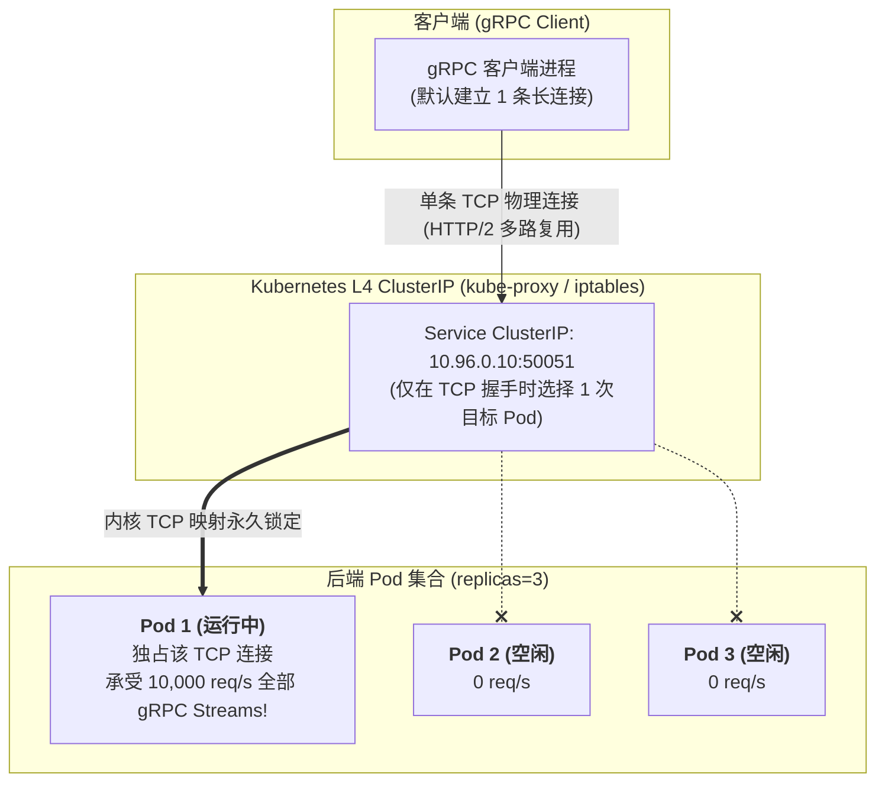
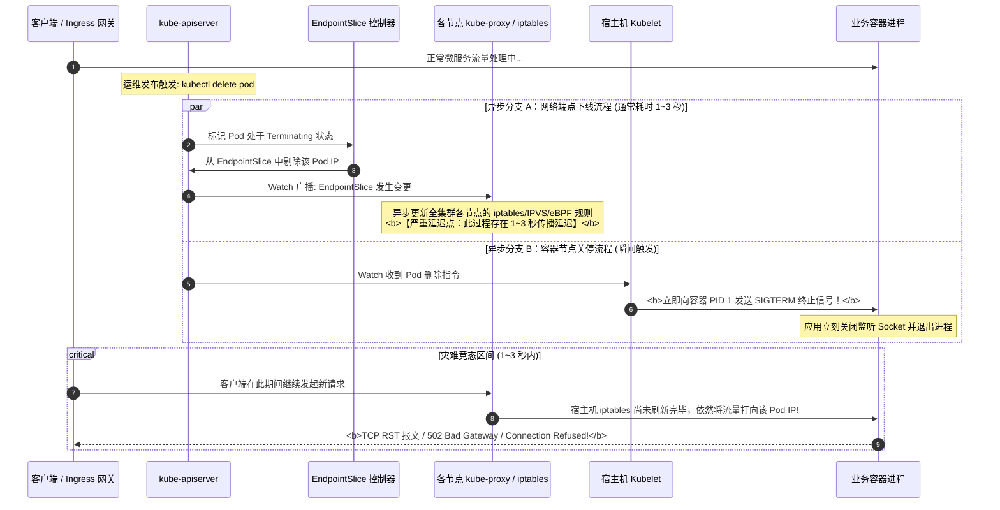

## 引言：当经典软件架构撞上云原生动态网络

在专栏的第五讲 [Kubernetes 网络模型全景](/articles/k8s-networking-cni-cilium-ebpf-gateway-api/) 中，我们搞清楚了 CNI、Calico BGP、Cilium eBPF 以及 Gateway API 的底层包转发路径。

然而，在真实的业务架构落地中，无数将 Java (Spring Boot)、Go、Rust 或 Python 微服务迁移到 Kubernetes 的研发团队，往往在上线的第一天就遭遇了“当头一棒”：
- **故障现象一**：后端明明扩容了 10 个 Pod 副本，但通过 gRPC 压测时，监控显示 **99% 的流量全都被打到了同一个 Pod 上**，该 Pod 甚至被压到 CPU 爆满被驱逐，而其余 9 个 Pod 完全处于闲置状态！
- **故障现象二**：每次执行 Deployment 滚动发布（Rolling Update）时，前端调用方或网关总会偶发几秒钟的 **`502 Bad Gateway`** 或 **`Connection reset by peer`**，造成线上偶发交易失败和告警毛刺。
- **故障现象三**：Java 客户端调用 K8s 内部微服务时，哪怕后端 Pod 经历了重启或重新调度，客户端却疯狂报错 `UnknownHostException` 或持续向已经被销毁的死 Pod IP 发送请求长达数小时！

为什么传统的负载均衡经验在 Kubernetes 内部完全失灵？业务系统在应用代码层、协议层和生命周期上，究竟该如何与云原生的网络物理现实精确对齐？

本文作为**《从 Docker 到 Kubernetes：云原生容器与集群编排架构指南》**的第七篇，将从应用层协议物理现实出发，带你彻底攻克 **gRPC 长连接负载均衡陷阱**、**微服务连接池四大致命盲区**，以及 **Pod 销毁/切流微秒级时序竞态**。

---

## 一、 gRPC 负载均衡陷阱：四层代理与七层多路复用的物理撕裂

要理解为什么 gRPC 流量在 Kubernetes 中无法均衡分发，首先必须看清 **kube-proxy（无论是 iptables 模式还是 IPVS 模式）的物理本质**。

### 1.1 kube-proxy 只是一个四层（TCP/UDP）数据包转发器
我们在前面讲过，Kubernetes 原生的 `ClusterIP` 并不是一块真实的网卡，而是内核中的 NAT 规则。
- 当客户端发起 TCP 连接握手（SYN）时，内核 iptables/IPVS 规则会随机选中一个后端 Pod IP，执行一次 DNAT 转换；
- **一旦 TCP 三次握手成功，该 TCP 连接在内核中就被永久绑定到了该 Pod 上**，直到连接断开为止！



### 1.2 HTTP/2 多路复用的“副作用”
传统的 HTTP/1.1 每个请求都需要新建连接或通过有限的连接池并发，每次新连接都会重新经历四层负载均衡；
而 gRPC 深度依赖 **HTTP/2 协议**：
- **多路复用（Multiplexing）**：一个客户端与服务端之间，**通常只建立且维持 1 条 TCP 长连接**！
- 客户端成千上万个并发 RPC 方法调用，全被封装为该 TCP 连接上的不同虚拟 Stream（数据流）；
- 结果显而易见：**既然只有一个 TCP 连接，kube-proxy 就只能把它路由给某一个 Pod！**无论你后面水平扩容了 10 个还是 100 个 Pod，如果没有新连接建立，新增的 Pod 连哪怕 1 个字节的请求都分不到。

---

## 二、 生产血泪：gRPC 与微服务连接池的四大致命陷阱

许多团队在意识到长连接问题后，试图通过客户端连接池来解决，但由于缺乏对底层时序与 DNS 机制的理解，往往踩入更深的大坑。以下是必须规避的四大生产雷区：

### 陷阱 1：缺失 `MaxConnectionAge` 导致连接长生不老
如果服务端没有配置连接最大生命周期，长连接可以存活数月之久。当进行滚动发布时，新的 Pod 启动后没有任何客户端会主动向其发起连接，旧的 Pod 即将被销毁前依然承受着全部流量。
**生产级服务端配置（Go 语言示例）**：
```go
import (
    "time"
    "google.golang.org/grpc"
    "google.golang.org/grpc/keepalive"
)

func newProductionGRPCServer() *grpc.Server {
    return grpc.NewServer(
        grpc.KeepaliveParams(keepalive.ServerParameters{
            // 关键参数 1: 强制连接最大存活时间，例如 5 分钟
            // 达到 5 分钟后，服务端会优雅发送 GOAWAY 帧，通知客户端重连并重新解析 DNS
            MaxConnectionAge: 5 * time.Minute,
            // 关键参数 2: 允许给客户端 30 秒的缓冲期来完成在途 RPC 调用
            MaxConnectionAgeGrace: 30 * time.Second,
            // TCP 空闲保活检测间隔
            Time: 30 * time.Second,
            Timeout: 5 * time.Second,
        }),
    )
}
```

### 陷阱 2：Java JVM DNS TTL 默认“永久缓存”惨案
在 Java (Spring Boot) 微服务中，JVM 默认的安全策略（Security Manager）会将 **DNS 解析结果永久缓存在内存中（TTL = -1）**！
- 当后端的 Kubernetes Pod 发生故障漂移或重启后，IP 已经变成了新的 `10.244.2.18`；
- 但 Java 客户端由于永久缓存，依然持续向已销毁的旧 IP 发送数据，引发海量超时崩溃！
- **生产必配启动参数**：在容器启动脚本中强制覆盖 JVM 参数：
  ```bash
  -Dsun.net.inetaddr.ttl=5 -Dnetworkaddress.cache.ttl=5
  ```
  将 DNS 缓存时间硬性限制在 5 秒以内，确保容器漂移后客户端能够秒级感知新 IP。

### 陷阱 3：重连风暴（Thundering Herd on Reconnect）
当某个后端 Pod 崩溃或主动重启断开连接时，成百上千个并发客户端如果同时瞬间发起重连，会导致刚刚拉起的健康 Pod 瞬间遭遇“连接洪峰”，直接将新 Pod 再次压垮击穿！
**解法：指数退避与全抖动算法（Full Jitter Backoff）**：
客户端在重连时必须在计算退避时长后加入随机抖动：
$$t_{\text{sleep}} = \text{random}(0, \min(t_{\text{max}}, t_{\text{base}} \times 2^{\text{attempt}}))$$
将重连请求在时间轴上均匀打散，平滑吸收流量。

### 陷阱 4：客户端负载均衡 (Headless Service) 的正确姿势
利用 Kubernetes **Headless Service（无头服务，`clusterIP: None`）** 搭配客户端负载均衡，是性能损耗最低的官方推荐解法：

```go
// 生产级 Go 客户端直连 Headless Service 并开启轮询
target := "dns:///my-service-headless.default.svc.cluster.local:50051"
conn, err := grpc.Dial(
    target,
    grpc.WithInsecure(),
    // 强制声明使用 round_robin 轮询算法，而非单一连接
    grpc.WithDefaultServiceConfig(`{"loadBalancingConfig": [{"round_robin":{}}]}`),
)
```

---

## 三、 零停机发布的噩梦：Pod 销毁与网络切流的时序竞态

解决了请求分发之后，微服务在 K8s 上面临的第二个巨大挑战是：**为什么执行更新发布时，总会出现 502 Bad Gateway 报错？**

大多数开发者的直觉以为：*“K8s 只要收到删除指令，就一定会先在网络上把这个 Pod 踢掉，然后再去杀进程。”*

**然而在 Kubernetes 底层物理现实中，这两件事完全是异步且并行的！**



### 时序竞态的致命真相：
1. 当 Pod 被删除时，`kube-apiserver` 同步兵分两路：一路通知控制器去刷网络端点，另一路通知目标节点的 Kubelet 去杀进程；
2. 全集群各节点的 `kube-proxy` 或 Cilium 刷新 iptables 规则需要经历 **Informer 监听 $\to$ 批量合流 $\to$ 内核规则写回**，在稍大规模集群中往往存在 **1 到 3 秒的网络规则残留窗口**；
3. 但后端的业务进程在收到 `SIGTERM` 后，通常在几十毫秒内就直接 `os.Exit(0)` 退出了；
4. **在这致命的 1~3 秒真空期内，外部新流入的数据包依然会被内核转发给已经死去的 Pod IP，直接触发 TCP Connection Refused 与 HTTP 502 报错！**

---

## 四、 黄金生产标准：打造坚不可摧的零停机下线流水线

要彻底消灭 502 错误，必须通过工程手段**人为重构生命周期时序**，确保“网络规则切除”必定严格发生在“业务进程退出”之前。

### 4.1 生产级 Pod YAML 配置模板

```yaml
apiVersion: apps/v1
kind: Deployment
metadata:
  name: production-microservice
spec:
  replicas: 3
  strategy:
    type: RollingUpdate
    rollingUpdate:
      maxSurge: 25%         # 保证发布期间永远有冗余算力支撑
      maxUnavailable: 0     # 绝不允许可用实例数低于预期值
  template:
    metadata:
      labels:
        app: production-microservice
    spec:
      # 1. 延长容器终止宽限期 (默认 30s，大并发服务建议设为 60s)
      terminationGracePeriodSeconds: 60
      containers:
      - name: app
        image: registry.example.com/api:v1.2.0
        # 2. 注入 preStop 钩子，强行制造等待缓冲期
        lifecycle:
          preStop:
            exec:
              command: ["/bin/sh", "-c", "sleep 15"]
        # 3. 严格配置就绪探针
        readinessProbe:
          httpGet:
            path: /healthz
            port: 8080
          initialDelaySeconds: 5
          periodSeconds: 3
          failureThreshold: 2
```

### 4.2 为什么必须在 `lifecycle.preStop` 中执行 `sleep 15`？
- 当 Kubelet 准备销毁容器时，如果配置了 `preStop`，**Kubelet 会首先同步阻塞执行该 Hook，绝对不会发送 `SIGTERM` 信号**；
- `sleep 15` 让业务容器故意“装死”空转 15 秒；
- 在这宝贵的 15 秒内，`EndpointSlice` 控制器有极其充裕的时间在全集群范围内完成 iptables/eBPF 规则刷新，**确保集群中所有的外部流量彻底不再向本 Pod 派发**；
- 15 秒过后，Hook 执行完毕，Kubelet 才正式向应用发送 `SIGTERM`；
- 此时应用进程接收到 `SIGTERM`，停止接收新连接，并将手中尚未处理完毕的历史连接平滑排空（Drain Connections），最后优雅退出，**真正实现 100.00% 零丢包与零 502 发布！**

### 4.3 生产级代码实战：微服务优雅退出状态机 (Go 语言实现)

在业务代码内部，仅靠捕获信号还不够，必须遵循严格的多阶段平滑退出状态机：

```go
package main

import (
    "context"
    "log"
    "net/http"
    "os"
    "os/signal"
    "syscall"
    "time"
)

func main() {
    server := &http.Server{Addr: ":8080", Handler: buildRoutes()}

    go func() {
        if err := server.ListenAndServe(); err != nil && err != http.ErrServerClosed {
            log.Fatalf("Server listen error: %v", err)
        }
    }()

    // 监听系统终止信号
    quit := make(chan os.Signal, 1)
    signal.Notify(quit, syscall.SIGINT, syscall.SIGTERM)
    sig := <-quit
    log.Printf("Received termination signal: %v. Initiating graceful shutdown...", sig)

    // 阶段 1: 标记就绪检查探针失败 (配合 readinessProbe 辅助切流)
    markHealthCheckUnready()

    // 阶段 2: 给在途长请求留出最多 30 秒的优雅排空窗口
    ctx, cancel := context.WithTimeout(context.Background(), 30*time.Second)
    defer cancel()

    // 阶段 3: 执行标准 http.Server Shutdown (优雅停止监听，等待在途请求处理完毕)
    if err := server.Shutdown(ctx); err != nil {
        log.Printf("Server forced to shutdown due to timeout: %v", err)
    }

    // 阶段 4: 关闭下层数据库连接池与消息队列消费者
    closeDatabaseConnections()
    flushLogsToDisk()

    log.Println("Graceful shutdown completed successfully. Process exiting.")
}
```

---

## 五、 总结与进阶预告

在云原生网络体系中，纯粹的基础设施转发只是舞台，业务系统在应用层的适配才是主角：
- **gRPC 的长连接与 HTTP/2 多路复用** 撕裂了传统的 L4 代理模式，必须通过 Headless Service 客户端解析或 Envoy 七层网格来实现细粒度流控；
- **微服务连接治理四大陷阱**（MaxConnectionAge、JVM DNS TTL 永久缓存、重连风暴抖动退避）是每一个高可用系统必须筑牢的防线；
- **Pod 销毁与网络规则更新的异步竞态** 是生产发布 502 抖动的万恶之源，通过 `preStop` 强制注入时延缓冲配合业务内层优雅停机，是保障业务 99.999% SLA 的终极法宝。

然而，网络只是业务软件在 K8s 上遇到的第一个拦路虎。当软件本身包含持久化状态与核心数据库（MySQL, TiDB, RocksDB, Kafka）时：
- 我们究竟该选用云盘（EBS）、分布式文件系统（Ceph），还是直接裸挂物理机的 **Local NVMe SSD**？
- Linux 内核的 Page Cache 脏页回写与 cgroups v2 内存超卖会对数据库刷盘造成怎样的致命抖动？
- 当宿主机发生网络抖动时，如何通过 **Node Fencing（隔离防护）** 彻底杜绝主从双写导致的物理脑裂？

在接下来的**专栏第八讲**中，我们将全面攻克有状态业务的核心存储关卡 —— **[生产级分布式存储与数据库落地：Local NVMe 物理直通、RocksDB/WAL 刷盘调优与 Fencing 防脑裂架构](/articles/k8s-database-storage-local-nvme-tuning-fencing/)**！

---

## 常见问题 (FAQ)

### Q1: 为什么明明部署了 5 个 Pod 并挂载在同一个 Service 下，某个 gRPC 客户端的压测流量却只压爆了其中 1 个 Pod？
**根本原因：HTTP/2 单 TCP 物理连接多路复用与 L4 代理的局限**。
Kubernetes 的普通 Service（ClusterIP）工作在网络第四层（TCP/UDP）。当 gRPC 客户端发起连接时，仅在初始 TCP 握手瞬间执行一次 DNAT 选中了一个目标 Pod。随后该客户端的所有 RPC 调用全部复用这一条 TCP 隧道发送，第四层代理无法感知内部的 HTTP/2 帧结构，导致流量无法在多个 Pod 间重新分发。
**解决办法**：
1. 将 Service 改为 `clusterIP: None`（Headless Service），客户端使用 `dns:///service-name:port` 并开启 `round_robin` 负载均衡器；
2. 或者在微服务间引入七层代理网格（如 Envoy / Istio），由代理在第七层逐个解析并分发请求；
3. 服务端必须显式配置 `MaxConnectionAge: 5m`，强行让长连接定期优雅断开并触发重新解析。

### Q2: 既然应用代码中已经实现了优雅关停逻辑（捕获 SIGTERM 信号并处理现有请求），为什么滚动发布时依然会偶发 502 错误？
**根本原因：网络切流规则在物理主机上的同步延迟**。
哪怕你的应用收到 SIGTERM 后不立即强制退出，只要它的监听套接字（Listening Socket）关闭、或者开始拒绝新连接，而此时其他物理节点上的 `kube-proxy` 尚未完成规则同步，就会有客户端的新请求继续打到该 Pod 上，导致内核直接回包 `RST`。
**解决办法**：
必须配置 `lifecycle.preStop` 并在其中挂起 10~20 秒（如 `sleep 15`），让容器“先等网络切完，再收 SIGTERM 关停”。

### Q3: 生产环境中所有的微服务都无脑加上 `sleep 15` 的 preStop 钩子，会带来什么副作用吗？如何权衡？
**主要副作用是发布等待时间的轻微延长**。
每个 Pod 销毁时都需要额外等待 15 秒，对于超大集群有成百上千个 Pod 的滚动发布而言，整体部署时长会增加几分钟。
**工程权衡与最佳实践**：
1. 确保 `terminationGracePeriodSeconds` 的值大于业务实际处理时长加上 preStop 等待时间（例如设为 60s），防止 Kubelet 在超时后粗暴发送 `SIGKILL`；
2. 通过合理配置 `maxSurge: 25%` 或 `50%`，让新 Pod 先充分就绪并承接流量，使等待过程对业务完全无感。
