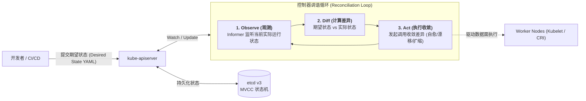
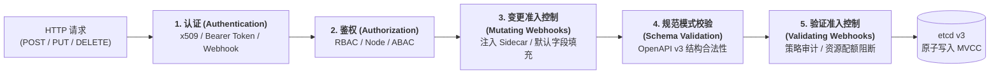
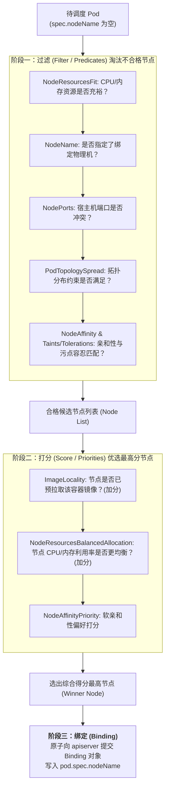
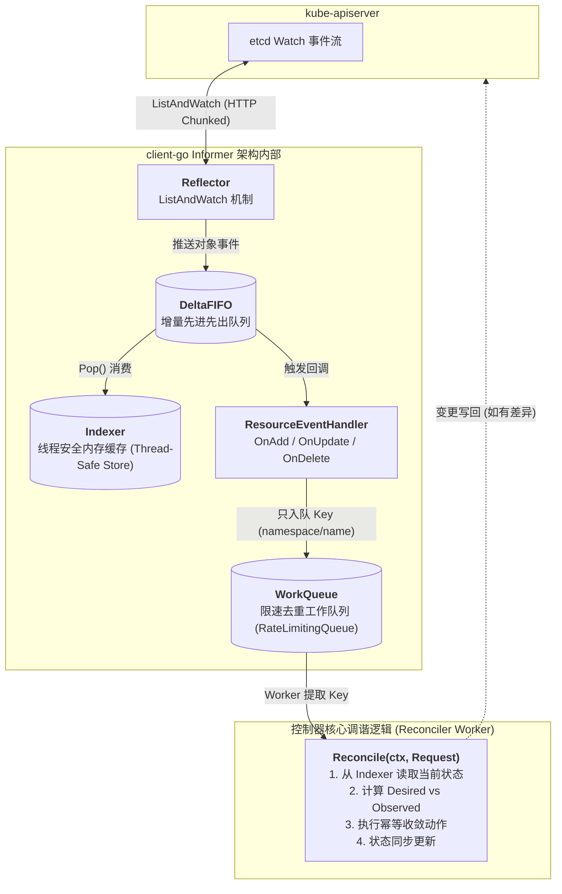

## 引言：从命令式运维到控制理论的范式转移

在传统单机容器以及 Docker Swarm 的实践中，工程师大多习惯于**命令式（Imperative）**的操作心智：
- *“启动 3 个 Web 容器”*（`docker run ...`）；
- *“如果容器挂了，执行重启脚本”*；
- *“给容器追加 2G 内存配额”*。

这种命令式思维本质上依赖操作员发送一系列步骤指令，并假设每一步都必定按预期成功执行。然而，当物理节点数量增长到成百上千台，硬件故障、网络抖动、机柜掉电变成家常便饭时，**命令式步骤极其脆弱，极易导致集群状态与操作员预期发生不可逆的严重漂移**。

Kubernetes 彻底打破了这一桎梏，将其核心哲学奠基在现代控制理论的**声明式（Declarative）范式**之上：
- 工程师从不告诉 Kubernetes **“怎么做（How）”**，而只提交一份 YAML 资源清单，描述系统的**最终期望状态（Desired State）**；
- 系统底层通过无数个永不停歇的**调谐循环（Reconciliation Loops）**，持续对比**实际观测状态（Observed State）**与**期望状态**，并通过负反馈控制动作将两者之间的误差收敛至零：

$$\lim_{t \to \infty} |\text{Observed State}(t) - \text{Desired State}(t)| = 0$$



本文作为**《从 Docker 到 Kubernetes：云原生容器与集群编排架构指南》**的第四篇，将深入拆解 Kubernetes 控制平面四大核心支柱：**kube-apiserver** 的准入流水线、**etcd v3** 的状态存储与 MVCC、**kube-scheduler** 的双阶段决策，以及支撑整个系统自愈中枢的 **Informer 架构与控制器调谐循环**。

---

## 一、 控制平面的中枢神经：kube-apiserver 请求准入流水线

在 Kubernetes 集群中，**`kube-apiserver` 是唯一允许直接与底层数据库 etcd 通信的组件**。无论是集群外部的 `kubectl`、CI/CD 系统，还是集群内部的 Scheduler、Controller-Manager 与 Kubelet，所有的状态读取与状态变更都必须作为 RESTful API 请求穿过 apiserver 的防线。

每一个写入或更新请求抵达 `kube-apiserver` 时，必须严格依次经历以下五个阶段的处理流水线：



### 1. 认证阶段 (Authentication)
apiserver 验证请求方的身份（Who are you?）。它支持插件化认证链：
- **x509 客户端证书**：常用于集群核心组件（如 kubelet、controller-manager）与集群管理员；
- **ServiceAccount Token**：运行在 Pod 内部的工作负载凭证（JWT 结构，由 apiserver 签名并在 1.24+ 采用短生命周期的 Bound ServiceAccount Tokens）；
- **OIDC (OpenID Connect) / Webhook**：对接企业级 SSO（如 Okta、Keycloak、GitHub）。
*认证成功后，请求被赋予对应的 `User`、`Groups` 与 `Extra` 身份凭证元数据。*

### 2. 鉴权阶段 (Authorization)
apiserver 验证该身份是否具备操作指定命名空间下特定资源的权限（Are you allowed to do this?）：
- **RBAC (基于角色的访问控制)**：生产中最核心的鉴权机制。通过 `Role` / `ClusterRole` 定义权限规则（如对 `pods` 的 `get`, `list`, `watch`），通过 `RoleBinding` / `ClusterRoleBinding` 绑定到用户或 ServiceAccount；
- **Node 鉴权**：专门针对 Kubelet 的白名单鉴权，确保节点只能修改调度至自身的 Pod 状态，防止被入侵节点横向劫持整个集群。

### 3. 变更准入控制 (Mutating Admission Webhooks)
允许在对象持久化到数据库之前对其进行**动态拦截与修改**。
- **经典应用**：服务网格（Istio / Linkerd）自动向 Pod Spec 中注入 Envoy Sidecar 容器；或者根据企业合规规范自动填充默认的 `securityContext` 与资源限制。

### 4. 规范校验 (Schema Validation)
校验该资源对象的字段是否严格符合 Kubernetes OpenAPI v3 的规范定义（如数据类型、必填项、枚举限制）。

### 5. 验证准入控制 (Validating Admission Webhooks)
在修改生效前进行最后一道安全合规门禁检查（只读判定，不能修改对象内容）。
- **经典应用**：OPA Gatekeeper、Kyverno 策略引擎。例如，禁止运行具备 `privileged: true` 的特权容器，或者强制要求必须声明 `resources.limits.cpu`。只要验证准入控制器返回拒绝，整个请求立刻被拦截并向客户端返回 403 错误。

---

## 二、 集群真实的唯一数据源：etcd v3 状态存储与 MVCC

Kubernetes 的所有持久化状态全部保存在 **etcd** 中。etcd 是一个采用 Go 语言编写的高可用、强一致性分布式键值存储系统，其底层基于 Raft 共识协议。

与传统关系型数据库或 Redis 覆盖写模式不同，**etcd v3 采用了极其硬核的 MVCC（Multi-Version Concurrency Control，多版本并发控制）架构**：

```text
etcd 逻辑存储架构:
逻辑键空间 (B-Tree 内存索引):
  /registry/pods/default/nginx-pod ──► Revisions: [v3, v8, v15(tombstone)]

底层持久化存储 (bbolt B+ Tree 磁盘文件):
  Revision(3, 0)  ──► JSON/Protobuf Data (Pod Pending)
  Revision(8, 0)  ──► JSON/Protobuf Data (Pod Running, IP 10.244.1.5)
  Revision(15, 0) ──► Tombstone (Deleted)
```

### 2.1 MVCC 与全局单调递增 Revision
- 在 etcd 中，每一次写操作（无论新增、修改还是删除），整个集群的全局版本号 **`revision`** 都会严格加 1；
- 历史记录在物理磁盘上是追加写入（Append-only）的，因此 etcd 天然记录了每一次对象变更的完整时间线；
- **乐观并发控制 (OCC)**：Kubernetes 中的 `resourceVersion` 字段本质上映射的就是 etcd 的 `revision`。当两个控制器试图同时更新同一个 Pod 时，后提交的写请求会因为版本不匹配而遭遇著名的 `409 Conflict: Operation cannot be fulfilled`，从而彻底杜绝了并发盲写覆盖。

### 2.2 Watch 机制与事件流驱动
传统轮询数据库（Polling）会随着集群规模暴涨而迅速压垮 IO。etcd 提供了基于 gRPC 的高性能 **Watch 流式订阅接口**：
- 客户端可以指定从某一个具体的 `revision` 开始监听变更（例如 `Watch(from_revision=8)`）；
- 如果网络发生临时中断，客户端重连后只需携带上次处理完的 `revision`，etcd 就能将断网期间错过的所有增量事件按序回放给客户端，确保**零事件丢失**。

> **生产避坑要点**：由于 MVCC 持续保留历史版本，etcd 会随着时间推移出现碎片膨胀。生产集群必须定期配置 `auto-compaction`（历史版本压缩）与 `etcdctl defrag`（磁盘碎片整理），并且 etcd 的存储盘必须挂载在高性能 NVMe SSD 上（确保护道 fsync 延迟在 10ms 以内），否则 Raft 心跳超时会导致集群选主震荡。

---

## 三、 智能大脑：kube-scheduler 双阶段调度算法

当用户创建一个新 Pod 时，其 `spec.nodeName` 字段最初是为空的。此时 Pod 处于 `Pending` 状态，`kube-scheduler` 负责监听到这个未分配的 Pod，并为其精准寻找一个最适宜的物理宿主机。

调度器的决策过程分为严格的两个阶段：**过滤（Filter）** 与 **打分（Score）**。



1. **过滤阶段 (Filter)**：
   - 调度器遍历集群中的所有节点，运行一系列硬性谓词算法（Predicates）。只要有一项条件不满足，该节点立刻被一票否决淘汰出局；
   - 如果所有节点都被淘汰，Pod 将持续保持 `Pending`，事件记录显示 `0/N nodes are available: Insufficient memory/cpu`。
2. **打分阶段 (Score)**：
   - 过滤后剩余的候选节点进入打分优先级算法（Priorities）。每个打分插件在 0 到 100 分之间给出权重分值；
   - 调度器将各项插件的得分加权求和，最终挑选出综合得分最高的一个节点作为胜出者。
3. **乐观绑定 (Binding)**：
   - 调度器更新本地内存缓存（Assume Pod 已绑定到该节点，防止并发调度冲突），并异步向 `kube-apiserver` 发送一个 `Binding` 子资源请求，正式将节点名称写入 Pod 的元数据中。

---

## 四、 控制理论落地：Informer 架构与控制器调谐循环

如果说 apiserver 是网关，etcd 是记忆，那么 **`kube-controller-manager`** 就是让整个集群具备生命力与自愈能力的心脏。

每个控制器（如 DeploymentController、ReplicaSetController、NodeLifecycleController）内部都运行着一个 **调谐循环（Reconciliation Loop）**。

为了避免成百上千个控制器频繁直接向 apiserver 发起全量查询，Kubernetes 在 client-go 库中设计了名垂青史的高性能缓存组件 —— **Informer 架构**。



### 4.1 Informer 核心组件运作剖析

1. **Reflector (反射器)**：
   - 启动时执行一次全量 `List` 获取当前命名空间下的所有对象，并记录返回的最新 `resourceVersion`；
   - 紧接着切换为持久长连接的 `Watch` 机制。仅接收增量变化事件（Added, Modified, Deleted），并将事件压入 **`DeltaFIFO`** 队列。
2. **DeltaFIFO & Indexer**：
   - Informer 不断从 `DeltaFIFO` 中取出事件，将其存入本地由读写锁保护的高性能内存索引器 **`Indexer`** 中；
   - **至关重要的性能优化**：之后控制器在进行状态读取时，全部走的是本地内存 Indexer，**对 apiserver 的读取压力降为零**！
3. **WorkQueue (限速队列)**：
   - 触发的事件回调函数（`OnAdd`, `OnUpdate`, `OnDelete`）**绝对不直接执行复杂的业务逻辑**，而是仅仅将变更对象的元数据标识（例如 `default/my-nginx`）压入 `WorkQueue`；
   - **去重与限速**：同一个对象的多次频繁更新在队列中会自动合并去重；如果调谐失败触发重试，队列会自动施加指数退避算法（Exponential Backoff），防止集群发生雪崩风暴。

### 4.2 水平触发 (Level-Triggered) vs 边沿触发 (Edge-Triggered)

许多开发者误以为 Kubernetes 是“事件驱动（Event-Driven）”系统。从底层控制论角度看，**Kubernetes 是典型的水平触发（Level-Triggered）系统，而非边沿触发（Edge-Triggered）**：

| 触发模式 | 概念与机理 | 应对网络中断与丢包的表现 |
| :--- | :--- | :--- |
| **边沿触发 (Edge-Triggered)** | 系统仅对“状态发生变化的时刻”（上升沿/下降沿脉冲）做出反应。如：收到一条“新建了 1 个 Pod”的消息就执行 +1 动作。 | **极度脆弱**。如果网络分区导致该脉冲消息丢失，系统将永远无法得知状态已变更，导致永久性数据不一致。 |
| **水平触发 (Level-Triggered)** | 系统只关注“当前所处的状态水平”（State Level）。控制器每次拿到 Key，都会重新抓取该对象的完整最新快照，对比期望值。 | **具备天然自愈力**。哪怕中间丢了 10 个事件，只要最终抓取的当前状态与期望状态不符，控制器就会立刻纠正。 |

---

## 五、 控制器调谐循环实现骨架

在实际编写生产级 Kubernetes Controller（如使用 Controller-Runtime 或 KubeBuilder）时，核心调谐逻辑遵循严格的幂等闭环。以下是控制器调谐函数的精简伪代码实现：

```go
// Reconcile 每一个调谐工作线程执行的核心循环
func (r *DeploymentReconciler) Reconcile(ctx context.Context, req ctrl.Request) (ctrl.Result, error) {
    // 1. 从本地 Indexer 缓存中获取该资源的最新期望状态 (Desired State)
    var deployment appsv1.Deployment
    if err := r.Get(ctx, req.NamespacedName, &deployment); err != nil {
        if errors.IsNotFound(err) {
            // 对象已被物理删除，清理资源已完成，直接返回
            return ctrl.Result{}, nil
        }
        return ctrl.Result{}, err
    }

    // 2. 查询当前集群中属于该 Deployment 的真实 ReplicaSet (Observed State)
    var rsList appsv1.ReplicaSetList
    if err := r.List(ctx, &rsList, client.MatchingLabels(deployment.Spec.Selector.MatchLabels)); err != nil {
        return ctrl.Result{}, err
    }

    // 3. 计算期望副本数与实际存活副本数的偏差 (Diff)
    desiredReplicas := *deployment.Spec.Replicas
    currentReplicas := computeActiveReplicas(rsList)

    // 4. 误差收敛动作 (Act) - 具备完全幂等性
    if currentReplicas < desiredReplicas {
        // 发现副本不足，发起扩容补齐
        if err := r.scaleUp(ctx, &deployment, desiredReplicas - currentReplicas); err != nil {
            // 失败后返回错误，WorkQueue 会自动使用指数退避机制重试
            return ctrl.Result{Requeue: true}, err
        }
    } else if currentReplicas > desiredReplicas {
        // 发现副本冗余，发起优雅缩容
        if err := r.scaleDown(ctx, &deployment, currentReplicas - desiredReplicas); err != nil {
            return ctrl.Result{Requeue: true}, err
        }
    }

    // 5. 调谐成功，状态完全收敛，重置退避计时器
    return ctrl.Result{}, nil
}
```

---

## 六、 总结与进阶预告

Kubernetes 控制平面向全世界展示了现代大型分布式软件工程的优雅范式：
- **kube-apiserver** 作为无状态网关，以声明式模型统领一切；
- **etcd v3** 用不可变 MVCC 时间线为集群筑造强一致基石；
- **kube-scheduler** 精确计算全集群资源拓扑与分配；
- **Informer 与调谐循环** 则以负反馈控制理论，赋予了数以万计容器自愈、弹性漂移与连续收敛的生命力。

然而，在计算与控制面齐备之后，分布式系统最大的瓶颈与复杂度往往落在**网络**之上。

跨主机的 Pod 之间究竟如何做到免 NAT 互联互通？经典的 Linux iptables 与 IPVS 为何会在大规模集群中遭遇性能瓶颈？下一代云原生网络霸主 Cilium 又如何利用 Linux 内核 eBPF 彻底重构网络世界？

在接下来的**专栏第五讲**中，我们将全面进入容器网络的核心深水区 —— **[Kubernetes 网络模型全景：CNI 规范演进、Calico BGP、Cilium eBPF 与 Gateway API 架构解密](/articles/k8s-networking-cni-cilium-ebpf-gateway-api/)**！

---

## 常见问题 (FAQ)

### Q1: 如果 etcd 集群遭遇网络分区丧失 Quorum 多数派，物理节点上正在运行的业务 Pod 会立刻停止提供服务吗？
**不会。**
这是很多初学者的误区。必须明确区分 Kubernetes 的**控制平面（Control Plane）**与**数据平面（Data Plane）**：
- 当 etcd 丧失 Quorum 时，受影响的仅仅是**控制平面**：apiserver 会转为只读或拒绝写请求，导致无法执行新的 Deployment 部署、扩缩容、Pod 创建或自愈调度；
- 但是在 **数据平面**，各个 Worker 节点上的操作系统内核、Kubelet、容器运行时（containerd）以及 CNI 路由转发规则依然在正常运转。已经拉起并处于监听状态的业务容器不会被杀掉，现有的网络数据流与服务通信依然完全顺畅；
- 一旦 etcd 节点恢复并重新选举出 Leader，控制平面即可重新恢复写操作。

### Q2: 为什么 Kubernetes 严格禁止任何外部组件或控制器直接读取写入 etcd，而必须强制全部经过 kube-apiserver？
这种中心化单一入口设计带来了无可替代的架构价值：
1. **统一的安全治理屏障**：所有的 API 访问必须在此处经过统一的 TLS 认证、RBAC 细粒度权限管控、审计日志（Audit Logging）记录以及准入 Webhook 拦截；
2. **状态校验与数据一致性**：apiserver 负责维护所有资源对象的 Schema 合法性校验，防止格式不正确的脏数据破坏底层存储；
3. **架构解耦与平滑迁移**：各控制器和外部客户端仅感知统一的 RESTful API 规范，对底层究竟使用的是 etcd v3、或者未来的替代存储引擎完全无感；同时屏蔽了复杂的底层分布式事务细节。

### Q3: 在编写自定义控制器或操作 CRD 时，遭遇 `409 Conflict: Operation cannot be fulfilled on ... the object has been modified` 的本质原因是什么？该如何优雅处理？
**本质原因**：
这是 Kubernetes 基于 etcd `resourceVersion` 实现的**乐观并发控制（Optimistic Concurrency Control）**安全机制。
当你的控制器从本地缓存 Indexer 读取了一个对象（例如带有 `resourceVersion: 100`），在执行本地计算的这几毫秒内，另一个控制器（例如 Kubelet 或 HPA）抢先一步向 apiserver 提交了更新，导致该对象在 etcd 中的版本提升为了 `101`。此时你的控制器再拿着 `100` 去提交写操作，apiserver 就会果断拒绝并返回 409 冲突，防止你用过期的旧数据覆盖掉别人的最新修改。

**最佳工程实践**：
1. **利用 client-go 重试机制**：使用 `k8s.io/client-go/util/retry` 包提供的 `retry.RetryOnConflict(retry.DefaultRetry, func() error { ... })`，在发生 409 冲突时重新从 apiserver 获取最新对象副本，重新应用修改并提交；
2. **区分 Spec 与 Status 更新**：在设计 CRD 与控制器时，使用单独的 `r.Status().Update()` 子资源更新逻辑，避免业务 Spec 的并发修改干扰运行状态的汇报。
