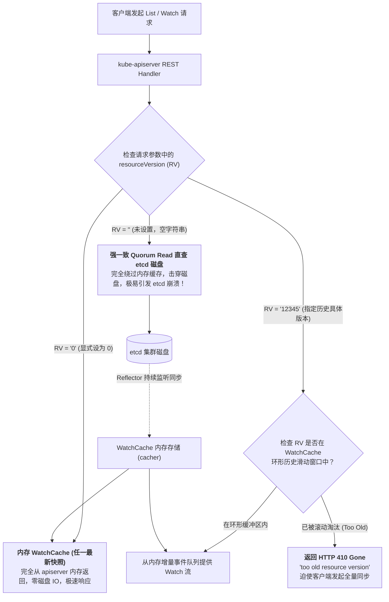
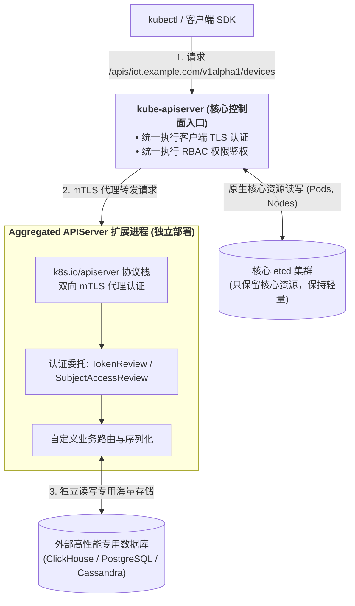
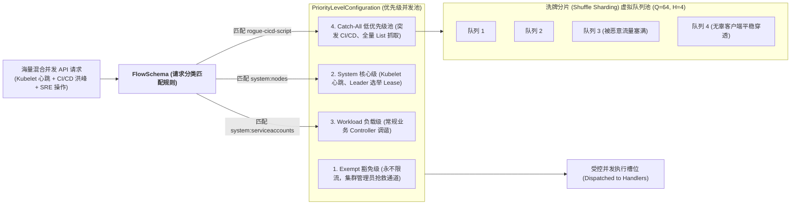

## 引言：当集群规模迈向万级节点与千万对象

在前面的章节中，我们深入掌握了通过 CRD（自定义资源定义）和 KubeBuilder 编写 Operator 来扩展 Kubernetes 的能力。

对于绝大多数常规中间件（如 MySQL、Redis 集群），CRD 确实是首选方案。然而，当你的平台团队开始承担**超大规模物联网（IoT）设备管理、高频指标时序监控、海量安全审计流水日志**等极端业务场景时，CRD 的底层缺陷便会引发致命的灾难：

1. **etcd 的物理“死亡红线”**：
   Kubernetes 默认的所有 CRD 数据全部存储在底层的 `etcd` 中。而 etcd 作为一个基于 Raft 协议的强一致内存/bbolt 数据库，其推荐的健康物理存储上限**仅为 2GB ~ 8GB**！一旦数百万个自定义资源对象持续写入，etcd 会瞬间触发空间配额报警（`database space exceeded`），导致整个 Kubernetes 控制面彻底瘫痪！
2. **WatchCache 击穿与失控客户端的“雪崩踩踏”（Thundering Herd）**：
   在拥有上万个节点的大型集群中，某个编写有 Bug 的 CI/CD 自动化流水线或者第三方巡检脚本，可能会在 1 秒内向 `kube-apiserver` 发起几十万次带有 `resourceVersion=""` 的高并发全量 `List Pods` 查询，瞬间击穿 apiserver 内存缓存直插 etcd，导致核心 Kubelet 心跳和控制器 Lease 租约续期全部超时，诱发不可挽回的全集群节点假死级联雪崩！

要突破这些工业级天花板，我们必须直接**对 Kubernetes 控制平面的神经中枢动刀**。

本文作为**《从 Docker 到 Kubernetes：云原生容器与集群编排架构指南》**的第十一篇，将带你深入控制面改造的最前沿：掌握 **WatchCache 环形缓冲区与 resourceVersion 机制**、**Aggregated APIServer 独立存储扩展**、**APF 流量优先级洗牌分片数学算法**，以及支撑万级节点的 **etcd 双物理盘与分库架构**。

---

## 一、 控制面查询命门：WatchCache 环形缓冲与 resourceVersion 语义

要保护 `kube-apiserver` 免遭瞬时并发流量打垮，必须彻底搞懂它内部的**内存多级缓存与版本机制**：



### 1.1 `resourceVersion` 的三大致命语义陷阱
很多高并发客户端由于混淆了 `resourceVersion` 的取值，直接把 apiserver 送进重症监护室：
1. **`resourceVersion = ""`（危险，空字符串）**：
   **语义**：要求返回**绝对强一致性（Quorum Read）的最新数据**。
   **内部机理**：`kube-apiserver` 会**强制绕过本地 WatchCache**，直接向底层的 etcd 发起跨节点 Raft 强一致性读取。一旦数千个客户端并发发起此类查询，etcd 的磁盘 I/O 和 CPU 会瞬间打满，控制面彻底瘫痪！
2. **`resourceVersion = "0"`（安全推荐）**：
   **语义**：要求返回**当前 apiserver 内存中已缓存的最新数据**。
   **内部机理**：直接由 `WatchCache` 内存返回，允许存在几十毫秒的微小主从同步延迟，**零 etcd 磁盘开销**，吞吐量提升两个数量级！
3. **`resourceVersion = "<具体数字>"`**：
   **语义**：从指定版本开始监听变更。
   **内部机理**：apiserver 内部维护着一个固定长度的循环事件环形缓冲区（Cyclic Buffer）。如果客户端请求的版本仍在环形队列中，直接从内存吐出增量事件；如果该版本因时间太久已被环形队列覆盖淘汰，apiserver 会立即返回 **`HTTP 410 Gone (Too old resource version)`**，要求客户端重新发起一次 `resourceVersion="0"` 的全量 List。

---

## 二、 突破 etcd 8GB 极限：Aggregated APIServer 独立扩展架构

当自定义数据模型存在以下特征时，**必须坚决放弃 CRD，转向 Aggregated APIServer（聚合 API 服务器）**：
- 数据体量极其庞大（数十万到数千万级对象，远超 etcd 承载上限）；
- 数据变更极其频繁（微秒级高频刷新，如 `metrics.k8s.io` 监控时序数据）；
- 数据底层需要存放在专门的分布式数据库中（如 PostgreSQL、ClickHouse、Redis 或 Cassandra）。



### 2.1 工作机理：APIService 动态路由注册
Aggregated APIServer 的核心在于 **`APIService`** 资源。你可以编写一个完全独立的 Go 进程，并向集群注册代理端点：

```yaml
apiVersion: apiregistration.k8s.io/v1
kind: APIService
metadata:
  name: v1alpha1.iot.example.com
spec:
  group: iot.example.com
  version: v1alpha1
  groupPriorityMinimum: 1000
  versionPriority: 15
  service:
    name: iot-aggregated-apiserver
    namespace: kube-system
    port: 443
  caBundle: LS0tLS1CRUdJTi... # 验证后端扩展服务器的 TLS 证书
```

### 2.2 核心架构优势：
1. **统一用户心智**：终端用户完全感受不到底层差异，依旧可以用 `kubectl get devices.iot.example.com` 访问；
2. **认证鉴权委托（Auth Delegation）**：请求首先穿过核心 `kube-apiserver`，完成统一的证书认证与 RBAC 权限校验后，再通过带鉴权头的内网 mTLS 连接转发给后端扩展服务；
3. **彻底解放核心 etcd**：扩展资源的增删改查全流程**零接触核心 etcd**，数千万条数据直接沉淀进专用的高性能外部存储集群中！

---

## 三、 抵御流量雪崩：API Priority and Fairness (APF) 洗牌分片流控

在没有 APF 的早期版本中，Kubernetes 仅提供粗暴的 `--max-requests-inflight` 参数。当突发并发请求数超限时，apiserver 只能无差别随机丢弃请求，极易导致最重要的节点心跳和控制器写操作被连带误杀。

Kubernetes 引入的 **APF（API 优先级与公平性）**，深度融合了通信领域的**公平排队（Fair Queuing）与洗牌分片（Shuffle Sharding）算法**：



### 3.1 洗牌分片（Shuffle Sharding）的数学魔法
假设低优先级池包含 $Q = 64$ 个虚拟队列，每个客户端在发起请求时，APF 会对其标识（如用户名或命名空间）计算哈希，随机抽取 $H = 4$ 个队列组成其专属队列手牌（Hand）。

这组队列手牌的所有可能组合数为：
$$C = \binom{Q}{H} = \frac{Q!}{H!(Q - H)!} = \frac{64 \times 63 \times 62 \times 61}{4 \times 3 \times 2 \times 1} = 635,376$$

**抗冲突数学概率**：
- 即使恶意 CI/CD 脚本发送数万次全量查询打爆了它所命中的 4 个队列；
- 另一个无辜的常规客户端哈希出的 4 个队列与恶意客户端完全重合的概率**仅为六十三万分之一（$\approx 0.000157\%$）**！
- 只要无辜客户端抽中的 4 个队列中有任意 1 个未被恶意流量塞满，其请求就能顺畅入队执行，彻底杜绝了“一人作恶、全员株连”的传统哈希悲剧！

### 3.2 生产级 APF 策略配置示例
```yaml
apiVersion: flowcontrol.apiserver.k8s.io/v1
kind: FlowSchema
metadata:
  name: protect-system-heartbeats
spec:
  priorityLevelConfiguration:
    name: system
  matchingPrecedence: 50
  rules:
  - subjects:
    - kind: Group
      group:
        name: system:nodes
    resourceRules:
    - verbs: ["*"]
      apiGroups: ["*"]
      resources: ["nodes", "nodes/status", "leases"]
```

---

## 四、 万级节点基石：etcd 物理双盘隔离与极限性能调优

在由 5,000 ~ 15,000 台物理节点组成的超大型生产集群中，单个 etcd 集群无论如何调优都会被写入风暴击垮。

### 4.1 物理铁律：WAL 盘与数据盘彻底物理隔离
etcd 内部的写入包含两个截然不同的物理阶段：
1. **WAL（预写日志）写入**：要求极速顺序写入，并且每笔事务必须调用 `fdatasync()` 强制刷盘，延迟必须低于 **1ms**；
2. **BoltDB 数据盘写入**：进行随机页面修改，涉及复杂的 B+ 树分裂与树重平衡，I/O 行为高度抖动。

**架构铁律**：**严禁将 WAL 日志目录与数据目录放在同一块物理 SSD 上！**
在 etcd 启动参数中：
```bash
--wal-dir=/mnt/nvme-wal/etcd-wal \
--data-dir=/mnt/nvme-db/etcd-data
```
将两块不同的物理企业级 NVMe SSD 分别挂载到这两个目录，杜绝 BoltDB 页面刷盘排队对 Raft WAL 顺序刷盘的心跳干扰，彻底终结 Raft 偶发选主震荡。

### 4.2 治本之策：事件独立分库 (`/events` 分流)
在大型集群中，**80% 以上的高频临时写入全部来自 Kubernetes 的 `Event` 对象**。
在 `kube-apiserver` 的启动参数中配置分流：
```bash
--etcd-servers=https://etcd-core-1:2379,https://etcd-core-2:2379,https://etcd-core-3:2379 \
--etcd-servers-overrides=/events#https://etcd-events-1:2379,https://etcd-events-2:2379,https://etcd-events-3:2379
```
- **核心 etcd 集群**：专心存储 Pod、Node、Service 等核心元数据，读取平稳，零事件写入干扰；
- **事件 etcd 集群**：独立承载所有高频产生的临时事件，即便被突发事件浪涌冲垮，核心业务与集群控制面也毫发无损！

### 4.3 生产级 etcd 关键参数极限调优
```bash
# 1. 突破默认的 2GB 容量限制，扩容至推荐极限 8GB (8589934592 字节)
--quota-backend-bytes=8589934592

# 2. 启用高频激进自动版本压缩 (每 5 分钟压缩一次历史版本，杜绝快照膨胀)
--auto-compaction-retention=5m
--auto-compaction-mode=periodic

# 3. 调优心跳与选举超时，抵御大规模网络抖动
--heartbeat-interval=250      # 心跳间隔调高至 250ms
--election-timeout=1250       # 选举超时设为 1250ms (防止网络偶发抖动引发反复选主)

# 4. 单次请求包上限调整 (针对大型集群超大 List 响应)
--max-request-bytes=33554432  # 提升至 32MB
```

---

## 五、 总结与进阶预告

对 Kubernetes 控制面动刀，展示了超大型分布式系统在面对规模与性能极限时的架构哲学：
- **WatchCache 与 resourceVersion** 揭示了 apiserver 内存防护的深层机理，通过合理利用 `resourceVersion="0"` 消除击穿风险；
- **Aggregated APIServer** 打破了 etcd 单一数据库的物理牢笼，用统一的 Kubernetes API 外观实现了异构高性能存储的无限横向扩展；
- **APF 洗牌分片流控** 借助组合数学的精妙概率，为高并发集群筑造起不可被击穿的隔离护盾；
- **etcd 物理双盘隔离与事件分流** 则从物理硬件层面为万级节点的超大规模集群夯实了强一致基石。

至此，我们已经完成了从业务软件在 K8s 上的网络/存储工程落地，到对 K8s 调度器、节点运行时与控制平面的全方位深度改造。

然而，所有这些复杂的底层技术与架构模式，最终都需要在生产中沉淀为**易于交付、易于维护、具备自主生命力的高级自动化运维载体**。

- 如何将所有这些高级特性综合在一起，打造属于企业私有云的工业级 **Operator**？
- 生产级 Operator 的核心控制流与 Day-2 Operations 应该如何设计？

在接下来的**专栏第十二讲**中，我们将全面聚焦云原生软件工程的巅峰范式 —— **[Kubernetes 扩展核心：Operator 模式、CRD 自定义资源与 KubeBuilder 生产级实战](/articles/k8s-operator-pattern-kubebuilder-crd/)**！

---

## 常见问题 (FAQ)

### Q1: 在高并发查询中，为什么请求参数中 `resourceVersion` 的取值会决定整个集群控制面的生死？
**根本原因：是否绕过 WatchCache 击穿 etcd 磁盘**。
- 当 `resourceVersion=""` 时，客户端要求强一致读（Quorum Read），apiserver 必须绕过本地内存缓存，向底层的 etcd 发起实时读。当大量客户端并发请求全量 List 时，etcd 的磁盘 I/O 排队打满，导致节点心跳写入失败，引发全集群瘫痪；
- 当 `resourceVersion="0"` 时，请求直接由 apiserver 内存中的 WatchCache 返回，耗时仅需数毫秒，不产生任何 etcd 磁盘开销；
- 当 `resourceVersion="<rv>"` 时，apiserver 从其环形缓冲区（Cacher Ring Buffer）中读取增量变更，如果该版本已被压缩淘汰，返回 410 Gone，驱使客户端平滑重新同步。

### Q2: 在什么具体业务场景下，平台架构师必须选择构建 Aggregated APIServer 而不是创建 CRD？
1. **数据体量庞大且频繁更新**：如采集全集群每秒数百万个容器的细粒度性能指标（如 `metrics-server`），写入 CRD 会在几小时内撑爆 etcd 8GB 的物理限制；
2. **底层需要专用数据库的高级查询能力**：例如需要利用 ClickHouse 的时序 OLAP 向量化统计分析，或 Elasticsearch 的全文检索能力；
3. **既有异构系统的虚拟呈现**：以标准的 Kubernetes REST API 风格（支持 `kubectl`）将既有的企业 CMDB 资产系统只读暴露给云原生平台，无需在 etcd 中重复持久化。

### Q3: APF (API Priority and Fairness) 中的 Shuffle Sharding 与普通哈希分流有何本质不同？
普通哈希分流将请求按客户端哈希直接映射到单一固定队列。如果恶意客户端命中了队列 3，那么所有同样被哈希到队列 3 的无辜客户端都会 100% 跟着被堵死陪葬。
**Shuffle Sharding（洗牌分片）的突破**：它不是给客户端分配单一队列，而是为每个客户端按哈希分配**一组队列组合（如 64 个队列中任选 4 个）**。只有当两个客户端分配的全部 4 个队列完全相同时，才会产生完全冲突；只要无辜客户端有哪怕 1 个队列未被污染，其请求就能被正常调度执行，从而将单点恶意流量对其他租户的附带伤害降低了数个数量级。
