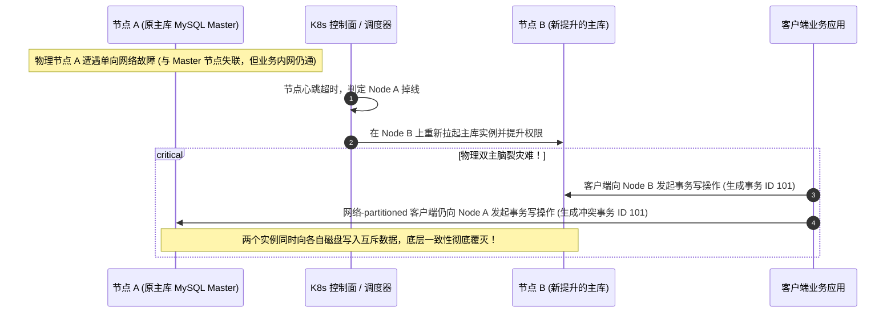

## 引言：数据库上 K8s 的“性能死线”与“数据底线”

在专栏的第六讲 [Kubernetes 有状态存储中枢](/articles/k8s-storage-csi-statefulset-deep-dive/) 中，我们系统解析了 CSI 插件规范与 StatefulSet 的拓扑保证。

然而，在严肃的企业级数据库生产实践中，很多团队仅仅配置了一个云厂商的 StorageClass（如 AWS gp3 或阿里云 ESSD），就匆忙把 **MySQL、PostgreSQL、TiDB、Kafka 或 Elasticsearch** 部署上线。不久之后，两大致命灾难便接踵而至：
1. **性能断崖**：核心业务的写入延迟 P99 从裸机时代的 1ms 暴增至 15ms，高并发写入时磁盘 I/O 彻底打满，数据库连接池瞬间耗尽并引发雪崩；
2. **静默数据腐化（脑裂）**：某台宿主机遭遇网络抖动失联，Kubernetes 调度器在另一台节点上拉起了新的主库 Pod，但由于原主库节点的进程仍在向未卸载的旧卷盲写，导致两边各自推进事务序列号，造成无法逆转的物理数据双写灾难！

数据库是企业所有业务系统的最后底线。**软件不能仅仅被动地“容纳”在容器里，而必须针对云原生的物理约束进行深度重构与底层调优**。

本文作为**《从 Docker 到 Kubernetes：云原生容器与集群编排架构指南》**的第八篇，将带你深入分布式存储落地的最底层：解构 **Local NVMe 裸盘直通与 XFS 格式化**、**Linux Page Cache 与 WAL 刷盘参数调优**，以及阻断双写灾难的 **Node Fencing / IPMI STONITH 防脑裂体系**。

---

## 一、 存储介质天梯：为什么高性能数据库必须选择 Local PV？

在 Kubernetes 中，常见的存储解决方案主要分为三大阵营：

```mermaid
flowchart TD
    subgraph NetStorage["1. 集中式网络存储 (Ceph / NFS / 经典云盘)"]
        direction LR
        App1["业务 Pod"] --> VFS1["Linux VFS 虚拟文件系统"]
        VFS1 --> TCP1["TCP/IP 网络协议栈封装"]
        TCP1 --> NIC1["物理宿主机网卡"]
        NIC1 -->|"经过 2~3 跳数据中心交换机"| SAN["集中式存储集群 / 存储控制器"]
        SAN --> Disk1["远端物理磁盘 (P99 延迟: 3~15 ms)"]
    end

    subgraph LocalStorage["2. 本地高速直通 (Local Persistent Volume)"]
        direction LR
        App2["数据库 Pod"] --> VFS2["Linux VFS (XFS / O_DIRECT)"]
        VFS2 --> PCIe["宿主机 PCIe 5.0 / NVMe 控制器"]
        PCIe --> Disk2["<b>本地企业级 NVMe 裸盘 (P99 延迟: 50~100 μs)</b>"]
    end
```



| 存储方案 | 典型实现 | 物理传输链路 | 随机写 P99 延迟 | 故障恢复模式 | 适用业务场景 |
| :--- | :--- | :--- | :--- | :--- | :--- |
| **网络云块存储** | AWS EBS (gp3/io2)、阿里云 ESSD | 宿主机网卡 $\to$ VPC 网络 $\to$ 存储集群控制器 | 1 ~ 5 ms | 节点宕机后，云盘直接漂移挂载至新节点 | 中小型业务库、无极端延迟要求的通用微服务 |
| **分布式网络文件系统** | CephFS、NFS、Portworx | 宿主机内核 $\to$ FUSE / 网络驱动 $\to$ 多副本网络复制 | 3 ~ 15 ms | 由分布式存储软件层保障数据冗余 | 共享只读资源、静态媒体文件、跨 Pod 共享读写 |
| **本地持久化卷 (Local PV)** | 宿主机本地 NVMe SSD (PCIe 直通) | **宿主机本地 PCIe 总线直连，零网络开销** | **50 ~ 100 μs (低 20~50 倍!)** | 节点物理损毁后，依赖数据库应用层自身协议重建 | **核心高并发数据库 (TiDB, MySQL, Kafka, ClickHouse)** |

### 核心设计哲学权衡：
- 网络云盘在底层提供了 3 副本冗余，但为此付出了巨大的**网络跳步延迟（Network Hops）**与带宽瓶颈；
- 现代高性能分布式数据库（如 TiDB 的 TiKV、Kafka、Elasticsearch）在应用架构层**已经自带了基于 Raft 或多数派的分布式复制协议**；
- 如果在底层使用网络云盘跑 Raft 数据库，本质上是**“在 3 副本分布式存储上再跑了一层 3 副本分布式数据库”**，造成了严重的双重放大开销！
- **因此，互联网大厂的核心数据库坚决采用 Local PV（本地企业级 NVMe 裸盘直通）**，将数据容灾的责任完全交给数据库的应用层协议。

---

## 二、 生产级 Local PV 架构与 XFS 格式化深度调优

要在 Kubernetes 中使用 Local PV，绝不能使用原始粗暴的 `hostPath`（缺乏配额管理与调度感知）。必须配置具备强节点亲和性的 **Local PersistentVolume**。

### 2.1 物理盘初始化：消除 XFS 元数据与锁竞争
在物理机挂载 NVMe 盘时，必须采用针对高并发 I/O 深度优化的 XFS 参数格式化：
```bash
# 格式化企业级 NVMe 磁盘
mkfs.xfs -f \
  -n ftype=1 \          # 强制开启 ftype=1 (OverlayFS 和容器运行时依赖项)
  -l size=128m \        # 增大日志区 (Log Buffer) 至 128MB，消除高频 WAL 刷盘时的元数据日志锁争用
  -d agcount=32 \       # 增加分配组 (Allocation Groups) 至 32，最大化并行写入分配并发度
  /dev/nvme0n1

# 生产级挂载参数
mkdir -p /mnt/disks/nvme0n1
mount -o noatime,nodiratime,allocsize=64M,logbufs=8,logbsize=256k /dev/nvme0n1 /mnt/disks/nvme0n1
```
- `noatime,nodiratime`：彻底禁止文件每次读取时写入访问时间戳，消除 30% 隐藏写入；
- `allocsize=64M`：延迟预分配缓冲区大小，极大降低超大 WAL 日志文件的碎片化。

### 2.2 Local PV 资源声明清单

```yaml
apiVersion: v1
kind: PersistentVolume
metadata:
  name: local-nvme-pv-node1
spec:
  capacity:
    storage: 1.6Ti
  volumeMode: Filesystem
  accessModes:
  - ReadWriteOnce
  persistentVolumeReclaimPolicy: Retain
  storageClassName: local-nvme-sc
  local:
    path: /mnt/disks/nvme0n1     # 宿主机上独立格式化好的物理 NVMe 挂载点
  nodeAffinity:
    required:
      nodeSelectorTerms:
      - matchExpressions:
        - key: kubernetes.io/hostname
          operator: In
          values:
          - k8s-worker-node-1     # 强物理绑定：该卷物理存在于此节点
---
apiVersion: storage.k8s.io/v1
kind: StorageClass
metadata:
  name: local-nvme-sc
provisioner: kubernetes.io/no-provisioner
# 关键铁律：必须延迟绑定！
volumeBindingMode: WaitForFirstConsumer
```

- **调度协同**：`volumeBindingMode: WaitForFirstConsumer` 确保调度器在做出决策前，同时考量节点的 CPU/内存水位与本地磁盘的物理位置；
- 一旦数据库 Pod 与该 Local PV 绑定，Kubernetes 会永久将该 Pod 钉在该物理节点上，无论重启多少次，都始终读写同一块物理高速 NVMe 硬盘。

---

## 三、 Linux 内核与存储引擎底层调优

把数据库跑在容器里，另一个常见陷阱是 **Linux Page Cache 脏页积压引发 cgroups v2 OOM 崩溃**。

### 3.1 内存陷阱：Page Cache 为什么会导致容器被杀？
在默认的 Linux 内核配置下，当应用执行文件写入时，数据首先被缓存在操作系统的 Page Cache 中，标记为“脏页（Dirty Pages）”，随后由内核线程 `pdflush/flusher` 异步刷盘。
- 在 cgroups v2 体系下，**Page Cache 占用的内存被一并计入该容器的 `memory.current` 总内存消耗中**！
- 如果数据库写入极快，而物理磁盘一时刷盘不及，Page Cache 会迅速暴涨，直接顶满容器的 `resources.limits.memory`；
- 此时 Linux 内核为了回收内存会强制触发回写（Direct Reclaim），导致业务线程被强制卡顿数秒甚至直接触发容器 OOMKiller！

```
宿主机与容器内核参数黄金调优配置 (/etc/sysctl.conf):
# 1. 降低脏页触发异步刷盘的阈值 (默认通常为 10%，调低至 5% 保持频繁平滑刷盘)
vm.dirty_background_ratio = 5

# 2. 限制脏页绝对上限，防止单次暴增堵塞 IO (调低至 10%)
vm.dirty_ratio = 10

# 3. 缩短脏页驻留生命周期 (单位为 1/100 秒，从默认 3000 降至 500，即 5 秒内必须落盘)
vm.dirty_expire_centisecs = 500
```

### 3.2 数据库存储引擎优化：绕过 Page Cache 的 Direct I/O
对于极度追求稳定吞吐的数据库（如 MySQL InnoDB 或基于 RocksDB 的存储底座），最彻底的方案是在应用配置中**开启 Direct I/O (`O_DIRECT`)**：
- **MySQL 配置**：`innodb_flush_method = O_DIRECT`；
- **RocksDB 配置**：`use_direct_io_for_flush_and_compaction = true`，`use_direct_reads = true`。
- **WAL 刷盘模式**：数据库的 Write-Ahead Log（预写式日志）必须将 `fsync()` 优化为 `fdatasync()`。`fsync()` 会强制刷新 inode 元数据，引发磁盘磁头寻址抖动；而 `fdatasync()` 仅刷数据本身，性能提升高达 40%！
- 数据读写直接在用户空间 Buffer 与物理 NVMe 磁盘之间通过 DMA 传输，**彻底绕过操作系统 Page Cache，从根本上杜绝了 Page Cache 引起的内存超限与 Double Buffering 二次拷贝损耗！**

---

## 四、 终极防御：分布式脑裂与 Node Fencing 隔离架构

在分布式数据库架构中，最恐怖的故障莫过于**网络分区导致的双主脑裂（Split-Brain）**：



### 4.1 Node Fencing（隔离防护）的核心法则
为了彻底消灭双主灾难，系统必须引入严密的 **Fencing（隔离防线）**。其核心准则在于：**“在不能百分之百确认旧主节点已经物理死亡之前，绝对不允许新主节点对外提供写服务！”**

工业界常用的三种 Fencing 防御级别：

1. **资源级隔离 (Resource Fencing / Storage Fencing)**：
   利用底层存储的 SCSI-3 PR（Persistent Reservation）持久保留锁，或者云存储的 `VolumeAttachment` 互斥锁。新节点在接管前，向底层存储控制器发送指令，**强制注销并踢掉旧节点的存储访问凭证**。旧节点即使想写，也会收到内核级 I/O 错误。
2. **节点级硬隔离 (Node Fencing / STONITH)**：
   **STONITH (Shoot The Other Node In The Head)**。一旦控制平面判定 Node A 异常，集群管理代理立刻通过物理服务器的主板管理口（IPMI / iLO / Redfish API）向 Node A 发送硬件级强制断电指令，直接物理掐断其电源！
3. **应用级软件租约 (Software Lease Fencing)**：
   主库进程在内存中维护一个极短生命周期的分布式租约（Lease，例如基于 Kubernetes API 的 `Lease` 资源或分布式 Raft，时长 5 秒）。主库必须每秒持续续约；一旦发现自身与外部通信中断且超过 5 秒未能续约，**主库进程必须立刻执行自杀（Panic / abort）退出**，从而在软件层面掐断写入通道。

---

## 五、 总结与进阶预告

数据库与有状态存储在 Kubernetes 上的落地，绝不是写几个 YAML 文件那么简单：
- **存储介质选型**：核心高并发数据库坚决采用 Local PV 裸盘物理直通，利用应用层自身的分布式协议规避网络云盘的跳步损耗；
- **XFS 与内核参数调优**：通过 `mkfs.xfs -l size=128m` 消除日志锁争用，精准控制 Linux 脏页回写比例，利用 `O_DIRECT` 绕过操作系统的 Page Cache 陷阱；
- **容灾防线构筑**：利用硬核的 Node Fencing、STONITH 硬件断电与 Lease 租约机制，彻底堵死网络分区引发的物理双写灾难。

然而，当我们解决了应用层在网络与存储上的所有顽疾之后，平台架构师往往会发现：**Kubernetes 原生的控制面与调度机制，开始成为下一道新的枷锁**。

- 为什么默认的 `kube-scheduler` 调度器无法处理复杂的分布式任务组，常常导致 AI 训练任务发生严重的死锁？
- 我们如何才能**深入 Kubernetes 调度内核**，利用官方的 **Scheduling Framework** 机制编写属于我们自己的自定义调度插件？
- 什么是 **Gang Scheduling（成组调度）**？又该如何利用 **Descheduler（重调度器）** 对运行中的集群实施动态二次重平衡？

在接下来的**专栏第九讲**中，我们将正式对 Kubernetes 调度中枢全面“动刀” —— **[对 K8s 调度器动刀：基于 Scheduling Framework 插件架构定制开发、Gang Scheduling 批处理调度与 Descheduler 重调度](/articles/k8s-scheduling-framework-custom-plugin-gang-scheduling/)**！

---

## 常见问题 (FAQ)

### Q1: 为什么像 TiDB (TiKV)、Kafka 和 ElasticSearch 这种分布式系统，在 Kubernetes 生产环境中强烈推荐使用 Local PV 而非 Ceph 或公有云网络云盘？
**核心原因：消除双重网络复制开销并获得百倍级延迟提升**。
这些分布式系统内部已经通过 Raft、ISR 或主备复制机制在应用层实现了跨节点的 3 副本数据容灾。如果底层使用 Ceph 或 AWS EBS，数据在底层存储系统又会被跨网络复制 3 次，导致单次写入需要经历两层网络传输和 9 次磁盘 I/O，网络开销放大 3 倍，P99 写入延迟高达数毫秒。
采用 Local PV 时，写入直接走宿主机本地 PCIe 总线，读写延迟仅需数十微秒，且消除了云盘昂贵的网络 IOPS 账单。

### Q2: 为什么在格式化用于数据库持久化的 XFS 磁盘时，必须指定 `-l size=128m`？
XFS 的内部架构包含专门的日志区域（Journaling Area）。默认情况下，XFS 的日志缓冲区大小较小（仅几兆字节）。在高吞吐并发写入事务日志（如 RocksDB WAL 或 MySQL Binlog）时，由于大量事务同时提交，XFS 的内部日志锁（Log Ticket Lock）会发生极其严重的争用，导致线程在内核态卡死。将日志区显式扩大到 128MB，可以为并发事务日志提交提供极大的缓冲队列，消除 80% 以上的元数据提交锁等待。

### Q3: 什么是 Node Fencing，为什么仅凭 Kubernetes 的 Pod 健康探针无法彻底解决主从数据库的脑裂问题？
Pod 健康探针（Liveness/Readiness Probe）只能检测本节点内的容器存活性，它无法区分“节点网络单向中断”与“容器真正死亡”。
在单向网络分区场景下，旧主节点的容器进程实际上还在正常运转，且完全可能继续接收来自同网段客户端的写请求。如果仅靠 K8s 判定其不健康并在新节点拉起新主库，就会导致两个主库同时对不同的数据卷进行写入，造成不可逆的数据冲突破坏。
**Node Fencing 的必要性**：它在物理或存储控制层面强制掐断旧节点的写入权限（如 IPMI 强制关电或存储锁剥离），确保旧节点在绝对无法写入后，才允许新主库上线。
