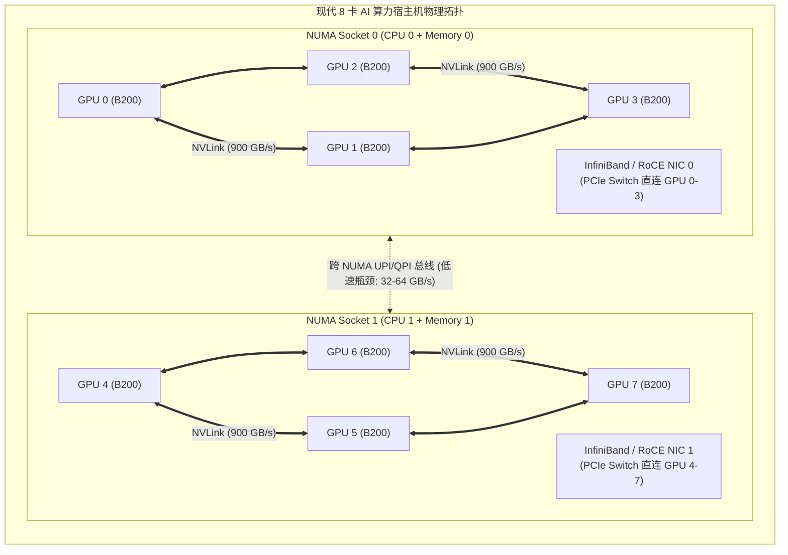
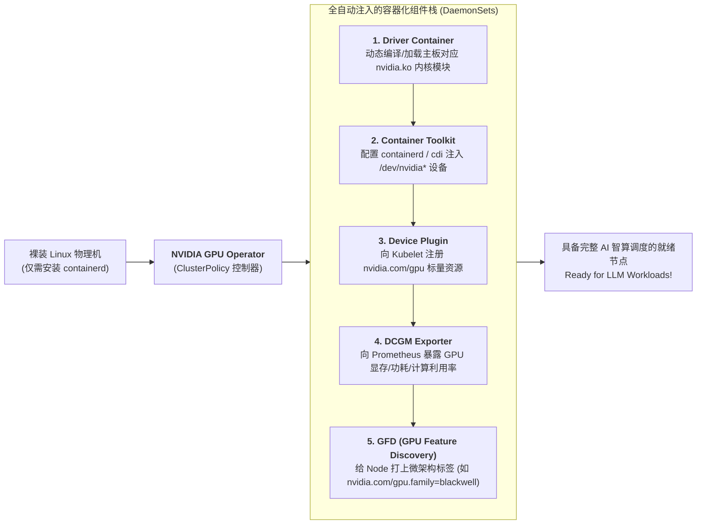
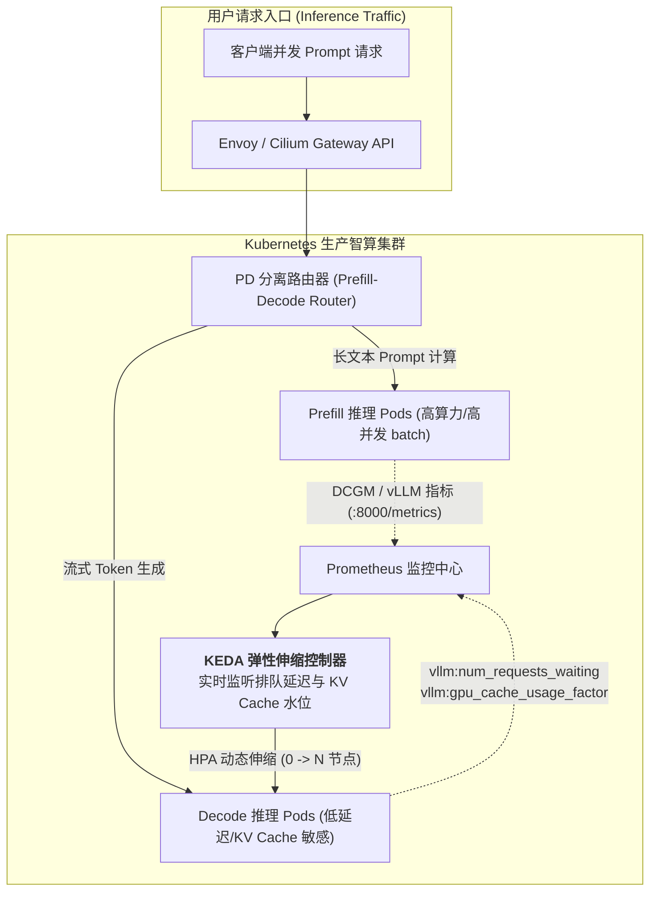

## 引言：从 CPU 标量调度到 GPU 智算拓扑的范式巨变

在过去十余年的云原生演进中，Kubernetes 调度的核心资源模型本质上是**标量（Scalar）且同质（Homogeneous）的**：
- 一个 Pod 申请 `cpu: "2"` 和 `memory: "4Gi"`；
- 调度器只需要在节点列表里做简单的整数减法：$Node_{\text{allocatable}} - Pod_{\text{requests}}$。无论这两个 CPU 核心来自哪块物理插槽、无论这 4Gi 内存挂在哪条内存总线上，对传统 Web 微服务几乎毫无感知。

然而，在 2026 年大语言模型（LLM）、多模态大模型与具身智能全面爆发的智算时代，**这套天真的标量调度假设被彻底撕得粉碎**：
1. **极致的硬件昂贵度与拓扑敏感性**：一台配备 8 张 NVIDIA H100/H200/B200 的算力节点价值数百万人民币；
2. **NUMA 与 NVLink 跨拓扑“性能深渊”**：在进行张量并行（Tensor Parallelism, TP=4）推理时，如果调度器随意挑选中了 4 张并未处于同一组 NVSwitch 直连拓扑下的 GPU、或者跨越了 CPU NUMA 内存节点，跨卡通信延迟将暴增 5 到 10 倍，导致大模型 Token 生成速度（Tokens/s）遭遇断崖式下跌；
3. **资源粒度的非标化**：全卡独占极易造成算力闲置，而轻量任务需要更细粒度的硬件级物理切片（MIG）与安全多租户隔离。



本文作为**《从 Docker 到 Kubernetes：云原生容器与集群编排架构指南》**的收官之作，将带你全面攻占 2026 年云原生智算的最前沿高地：解构 **NVIDIA GPU Operator** 全自动化组件矩阵、攻克 **MIG 硬件切片与拓扑感知调度**、并在真实生产中落地面向 **vLLM / SGLang** 大模型推理集群的智能弹性伸缩。

---

## 一、 NVIDIA GPU Operator：万卡集群的零接触运维中枢

在早期 Kubernetes 中使用 GPU，运维工程师必须先登录每台物理机，手动安装匹配内核版本的 NVIDIA 显卡驱动、安装 CUDA Toolkit、配置 `nvidia-docker`（或 NVIDIA Container Toolkit），并配置 Device Plugin DaemonSet。

在大规模动态节点扩缩的智算中心里，这种手工配置模式会引发灾难性的驱动版本漂移与节点离线。

**NVIDIA GPU Operator** 将我们上一讲介绍的 [Operator 模式](/articles/k8s-operator-pattern-kubebuilder-crd/) 发挥到了极致。它在 Kubernetes 内部以全生命周期容器化方式，实现了物理节点从裸机到具备 GPU 算力的**“零接触（Zero-Touch）全自动装配”**：



### 核心组件协同工作流水线：
1. **Driver Container**：利用容器内预置的编译器或预编译驱动包，在宿主机内核中动态编译并加载 `nvidia.ko`、`nvidia-uvm.ko` 等内核驱动模块，**物理机操作系统保持绝对纯净**；
2. **NVIDIA Container Toolkit**：重构容器运行时的配置文件（`/etc/containerd/config.toml`），配置 CDI（Container Device Interface）规范，使得普通容器在启动时能够安全地透传 `/dev/nvidia*` 字符设备与 CUDA 动态链接库；
3. **NVIDIA Device Plugin**：通过 gRPC 向本机 Kubelet 汇报可分配的 GPU 列表；
4. **DCGM Exporter**：基于 NVIDIA 数据中心 GPU 管理器（DCGM），以微秒级精度采集 GPU 显存使用率、Tensor Core 利用率、NVLink 吞吐与温度健康状态；
5. **GPU Feature Discovery (GFD)**：自动为物理节点注入海量精细标签（如 `nvidia.com/gpu.product=NVIDIA-H100-80GB-HBM3`、`nvidia.com/gpu.count=8`），为上层精细化调度提供数据支撑。

---

## 二、 算力切片演进：Time-Slicing、MIG 与 DRA 动态分配

并非所有 AI 任务都需要整张昂贵的 80GB/140GB HBM 显卡。为了提升万卡集群的整体利用率，云原生体系经历了三代算力切分技术的演化：

| 算力切片方案 | 隔离机制与底层原理 | 显存与算力硬件隔离度 | 适用生产场景 |
| :--- | :--- | :--- | :--- |
| **Time-Slicing (时间切片)** | 纯软件级时间片轮转。一个物理 GPU 虚拟为多个逻辑资源暴露给 Kubelet。 | **无物理隔离**。显存共享，一个容器显存超限将导致所有同卡容器共同 OOM 崩溃。 | 内部轻量开发调试、CI/CD 测试、极小特征抽取模型。 |
| **MIG (多实例 GPU)** | **硬件物理硬切片**。在硅片层面将 GPU 划分为独立的计算实例（CI）与显存实例（GI）。 | **绝对硬件级隔离**。具备专属的 SM 计算单元、独立的显存控制器与 DMA 引擎，零噪音干扰。 | 企业级多租户推理服务、生产级小模型部署（如 Embedding/Rerank）。 |
| **DRA (动态资源分配)** | Kubernetes 1.30+ 引入的声明式 Claim 资源分配模型。解耦简单的标量计数，支持参数化请求。 | **支持多维拓扑声明**。可直接请求“2 张具备 NVLink 互联的 GPU”并附带特定带宽策略。 | 大语言模型分布式训练、混合拓扑异构推理集群。 |

```text
NVIDIA MIG 硬件物理切片拓扑 (以 H100 80GB 为例):
┌─────────────────────────────────────────────────────────────┐
│ 物理 NVIDIA H100 80GB HBM3 GPU                              │
├──────────────────┬──────────────────┬───────────────────────┤
│ Instance 1       │ Instance 2       │ Instance 3            │
│ Profile: 3g.40gb │ Profile: 2g.20gb │ Profile: 1g.10gb (x2) │
│ • 42 个 SM 单元  │ • 28 个 SM 单元  │ • 14 个 SM 单元       │
│ • 40GB 独占显存  │ • 20GB 独占显存  │ • 10GB 独占显存       │
│ • 1.6 TB/s 带宽  │ • 800 GB/s 带宽  │ • 400 GB/s 带宽       │
│ (部署 14B LLM)   │ (部署 7B LLM)    │ (部署 BGE-Embedding)  │
└──────────────────┴──────────────────┴───────────────────────┘
```

通过配置 GPU Operator 的 `mig.strategy=mixed`，集群管理员可以通过 YAML 声明将不同物理卡划分为各种尺寸的独立 MIG 设备（例如 `nvidia.com/mig-3g.40gb: 2`），由 Kubernetes 调度器当作原生不可挤占的物理设备进行精准分配。

---

## 三、 拓扑感知调度：NUMA 亲和性与 NVLink 互联防护

在大模型推理中，多卡并行（如 Tensor Parallelism, TP）对跨卡互联带宽的要求极高。如果调度器盲目指派 GPU，将遭遇严重的“拓扑踩坑”：

### 3.1 跨 NUMA 内存穿刺
在典型的双路服务器中，CPU 0 管理插槽 0 的本地内存与 GPU 0~3，CPU 1 管理插槽 1 的本地内存与 GPU 4~7。
- 如果一个 Pod 被分配了 `CPU Core 2`（位于 Socket 0），却分配了 `GPU 5`（挂在 Socket 1 的 PCIe 总线上）；
- 每次 CPU 与 GPU 之间进行张量权重拷贝（Host-to-Device）时，数据包必须艰难穿过脆弱的 CPU 间互联总线（如 Intel UPI 或 AMD Infinity Fabric），带宽瞬间从本地 PCIe 的 64 GB/s 暴跌至跨插槽的 15 GB/s 以下！

### 3.2 Kubelet Topology Manager 的铁律对齐
为了彻底解决这一硬件不匹配问题，Kubernetes 在节点层提供了 **Topology Manager（拓扑管理器）**。它协同 CPU Manager、Memory Manager 与 Device Plugin，实施严密的局部资源对齐：

```yaml
# Kubelet 配置参数: /var/lib/kubelet/config.yaml
topologyManagerPolicy: single-numa-node
topologyManagerScope: container
cpuManagerPolicy: static
```

当配置为 `single-numa-node` 时：
1. 调度器在将 Pod 交付给节点后，节点的 Topology Manager 执行严格的联合判定；
2. **只有当该节点能够在同一个物理 NUMA 节点内，同时凑齐该容器所申请的所有独占 CPU 核心、大页内存（HugePages）、以及指定的全部 GPU 设备时**，该容器才被允许启动；
3. 如果无法在单一 NUMA 节点内完成对齐，Kubelet 会直接拒绝启动该容器（返回 `TopologyAffinityError`），触发调度器去寻找其他拓扑对齐的节点，从而**在硬件源头保证了大模型算力的零损耗性能输出**！

---

## 四、 2026 大模型推理集群实战：vLLM / SGLang 弹性伸缩架构

在大规模生产环境中，如何将像 **vLLM** 或 **SGLang** 这样的大模型推理引擎安全、高效地运行在 Kubernetes 集群之上？

我们在专栏兄弟篇 [大模型推理引擎架构](/articles/inference-engines-core-architecture-internals/) 中深入剖析过，现代大模型推理具有两大约束：
1. **显存预分配机制**：vLLM 启动后会立即向操作系统申请占满 90% 的物理显存作为 PagedAttention KV Cache 资源池。因此，**传统的 Kubernetes CPU/Memory HPA 伸缩指标在此完全失效**（因为显存利用率永远维持在 90% 恒定不动）；
2. **P/D 分离（Prefill / Decode 分离）**：Prefill 是算力密集型，Decode 是内存带宽与吞吐密集型。

针对这些特性，2026 年工业界标准的云原生架构是**基于 KEDA（Kubernetes Event-driven Autoscaling）结合 vLLM 自定义 Prometheus 核心指标驱动的弹性集群**：



### 4.1 生产级 KEDA 弹性伸缩配置清单 (ScaledObject)

以下是针对生产级 vLLM 推理 Pod 的真实 KEDA 伸缩声明清单：

```yaml
apiVersion: keda.sh/v1alpha1
kind: ScaledObject
metadata:
  name: vllm-inference-autoscaler
  namespace: llm-serving
spec:
  scaleTargetRef:
    apiVersion: apps/v1
    kind: Deployment
    name: vllm-qwen-72b-instruct
  minReplicaCount: 2
  maxReplicaCount: 16
  cooldownPeriod: 300       # 缩容冷却时间 300 秒，防止模型反复加载卸载导致显存震荡
  pollingInterval: 5        # 每 5 秒轮询一次指标，秒级响应突发洪峰
  advanced:
    horizontalPodAutoscalerConfig:
      behavior:
        scaleUp:
          stabilizationWindowSeconds: 0
          policies:
          - type: Percent
            value: 100      # 洪峰到来时允许立即扩容 100% 实例
            periodSeconds: 15
        scaleDown:
          stabilizationWindowSeconds: 300 # 平滑缩容窗口
  triggers:
  # 触发器 1: 基于 vLLM 正在排队的请求数量 (等待进入计算队列)
  - type: prometheus
    metadata:
      serverAddress: http://prometheus-k8s.monitoring.svc.cluster.local:9090
      metricName: vllm_num_requests_waiting
      query: sum(vllm:num_requests_waiting{model="qwen-72b"})
      threshold: '5'        # 只要排队等待处理的请求数超过 5 个，立即触发扩容
  # 触发器 2: 基于 PagedAttention KV Cache 显存块的实际使用率
  - type: prometheus
    metadata:
      serverAddress: http://prometheus-k8s.monitoring.svc.cluster.local:9090
      metricName: vllm_gpu_cache_usage_factor
      query: avg(vllm:gpu_cache_usage_factor{model="qwen-72b"})
      threshold: '0.80'     # 当集群的 KV Cache 平均使用率突破 80% 时，提前扩容防止换入换出卡顿
```

---

## 五、 全专栏终局知识体系回顾与全景总结

行文至此，**《从 Docker 到 Kubernetes：云原生容器与集群编排架构指南》**全套 13 篇深度技术长文正式完整收官！

让我们重新审视这一贯穿整套专栏的系统性认知认知阶梯：

```mermaid
flowchart TD
    Ch1["<b>第 1 讲：Docker 内核第一性原理</b><br/>Namespace 视界隔离、cgroups v2 单根树、OverlayFS 写时复制与 runc 链路"]
    Ch2["<b>第 2 讲：容器网络全景解密</b><br/>veth-pair 穿透、Linux Bridge docker0、iptables NAT 与跨机拓扑"]
    Ch3["<b>第 3 讲：轻量级集群编排 Docker Swarm</b><br/>SwarmKit 架构、内置 Raft 状态机、VXLAN 覆盖网络与 IPVS Routing Mesh"]
    Ch4["<b>第 4 讲：Kubernetes 控制平面深度解密</b><br/>声明式控制理论、etcd MVCC 状态机、调度器双阶段决策、Informer 与调谐循环"]
    Ch5["<b>第 5 讲：Kubernetes 网络模型全景</b><br/>四大网络公理、CNI 规范、Calico BGP 直连、Cilium eBPF 与 Gateway API 架构"]
    Ch6["<b>第 6 讲：Kubernetes 有状态存储中枢</b><br/>CSI 存储插件四阶段调用链、PV/PVC 动态供给与 StatefulSet 拓扑铁律保证"]
    Ch7["<b>第 7 讲：业务网络实战</b><br/>gRPC 长连接负载均衡陷阱、Service Mesh 与零停机平滑切流时序"]
    Ch8["<b>第 8 讲：业务存储实战</b><br/>Local NVMe 物理直通、RocksDB/WAL 刷盘调优与 Fencing 防脑裂架构"]
    Ch9["<b>第 9 讲：调度内核定制</b><br/>Scheduling Framework 插件架构、Gang Scheduling 批处理调度与 Descheduler"]
    Ch10["<b>第 10 讲：节点与运行时定制</b><br/>NRI 节点资源接口插件、Kata/gVisor 多安全沙箱运行时与 Sysctl 参数隔离"]
    Ch11["<b>第 11 讲：控制面内核定制</b><br/>Aggregated APIServer 独立扩展、APF 流量优先级洗牌分片与 etcd 分库调优"]
    Ch12["<b>第 12 讲：Kubernetes 扩展核心 Operator 模式</b><br/>CRD 数据模型扩展、KubeBuilder 生产脚手架、Split Client、Reconcile 与 Finalizer"]
    Ch13["<b>第 13 讲：2026 AI 智算调度终局</b><br/>GPU Operator 零接触运维、MIG 硬件切片、Topology Manager 与 vLLM/SGLang 弹性伸缩"]

    Ch1 --> Ch2 --> Ch3 --> Ch4 --> Ch5 --> Ch6 --> Ch7 --> Ch8 --> Ch9 --> Ch10 --> Ch11 --> Ch12 --> Ch13
```



- **从底层内核到单机容器（第 1~2 讲）**：我们打破了“容器是虚拟机”的幻觉，看清了它只是一个被 Linux 系统调用限制了视界与资源的普通进程，并通过网络设备对和路由规则实现了单机互联；
- **从轻量集群到工业级声明式中枢（第 3~6 讲）**：我们体验了 Docker Swarm 开箱即用的 Raft 优雅极简，随后跨入 Kubernetes 的宏大殿堂，领悟了如何用负反馈控制理论、CNI/eBPF 扁平网络与 CSI 有状态持久化掌控大规模集群；
- **从业务软件实战到对 K8s 核心动刀（第 7~11 讲）**：我们解决了真实业务落地中的 gRPC 长连接倾斜、零停机发布 502 竞态、Local NVMe 裸盘直接挂载与 Fencing 防脑裂；并深入 K8s 内核，完成了 Scheduling Framework 插件定制、NRI 容器硬件拦截与 Aggregated APIServer 聚合存储扩展；
- **从自动化 Operator 到 2026 AI 智算之巅（第 12~13 讲）**：我们将资深架构师的经验固化为自主运行的工业级软件，并最终将现代云原生操作系统与大规模 GPU 算力拓扑完美融合，建立起从底层硬件 NUMA 对齐到上层大语言模型分布式弹性伸缩的完整工程闭环。

---

## 常见问题 (FAQ)

### Q1: 为什么 vLLM / SGLang Pod 刚拉起完成，Prometheus 就报告其 GPU 显存利用率（`memory.used`）达到了 90% 以上？这会导致 Kubernetes 判定 OOM 吗？
**不会。**
这是由于 vLLM 的 **PagedAttention 显存预分配机制（KV Cache Pre-allocation）** 导致的：
- 启动时，vLLM 会首先加载模型权重参数（例如 Qwen-72B 占用约 144GB 显存，分摊在两张 80GB 卡上）；
- 加载完成后，vLLM 会默认将剩余所有可用物理显存的 90%（由 `--gpu-memory-utilization=0.9` 参数控制）**全部预先申请并锁定**，用于构建高效的逻辑内存块分页表；
- **Kubernetes 视角的区别**：Kubernetes 的 OOMKiller 监控的是**系统物理主机内存（RAM）**，而不是 GPU 显存（VRAM）。只要主机的系统内存没有超出 Pod 的 `resources.limits.memory`，Pod 就绝不会被 Kubernetes OOM 杀死；
- **伸缩建议**：不能基于 DCGM 采集的显存占用率去编写 HPA，而必须基于 vLLM 内部暴露的 `vllm:gpu_cache_usage_factor`（实际被 Token 占用的有效缓存块比例）进行精准自动扩容。

### Q2: 在 8 卡 GPU 宿主机中，为什么任意分配 4 张 GPU 给 Tensor Parallelism (TP=4) 的大模型推理会引发灾难性延迟？Topology Manager 如何避免该问题？
**根本原因：NVLink 拓扑不对称性**。
在现代 HGX/MGX 架构服务器中，8 张 GPU 并不是任意两两全互联的。它们通常被组织在特定的一组 NVSwitch 交换矩阵下，每 4 张 GPU（如 GPU 0~3，或者 GPU 4~7）形成一个极速的全互联闭环（双向带宽达 900 GB/s）。
如果调度器随意挑选中了 GPU 0、1、4、5：
- GPU 0 与 GPU 1 之间走极速 NVLink；
- 但 GPU 1 与 GPU 4 之间的数据交换将被迫绕行低速的 PCIe 总线甚至是跨 CPU 插槽的 UPI 总线（带宽骤降至数十 GB/s）；
- 张量并行要求每一层注意力计算后必须执行全局 `All-Reduce` 集合通信，**木桶效应会导致所有卡必须停下来等待那条跨拓扑慢链路**，整体推理吞吐直接暴跌 80%！
**Topology Manager 方案**：
配置 `topologyManagerPolicy: single-numa-node` 或利用 Kubernetes 1.30+ 的 **DRA（动态资源分配）** 驱动，在调度清单中显式声明拓扑约束（`TopologyHint`），强制调度器只能选择在同一组 PCIe/NVLink 拓扑树下的紧凑 GPU 组合。

### Q3: 为什么说 2026 年主流的动态资源分配（DRA）相比传统的 Device Plugin 是云原生智算调度的革命性跃升？
**传统 Device Plugin 的致命短板**：
它只能向 Kubernetes 报告简单的标量整数（如 `nvidia.com/gpu: 4`）。调度器在决策时完全是“抓瞎”的，根本不知道它挑选出来的这 4 张卡是否属于同一个 NUMA 节点、相互之间是否有 NVLink 连接、或者是否直连了特定的 RoCE 智算网卡。

**DRA（Dynamic Resource Allocation）的革命性突破**：
1. **参数化与 Claim 模式**：Pod 不再申请抽象数字，而是提交一个 `ResourceClaim`，可以像写 SQL 一样声明复杂的硬件参数；
2. **结构化参数与拓扑感知**：DRA 允许厂商驱动将硬件的复杂拓扑图（如 NVLink 连通矩阵、RDMA 网卡亲和性、MIG 尺寸）直接暴露给调度器；
3. **跨多设备联合协同决策**：调度器在单次调度决策中，能够同时且原子性地匹配“最佳的 GPU 组合 + 直连在同一 PCIe 交换机下的 InfiniBand 网卡”，彻底终结了拓扑错配引发的算力损耗。
