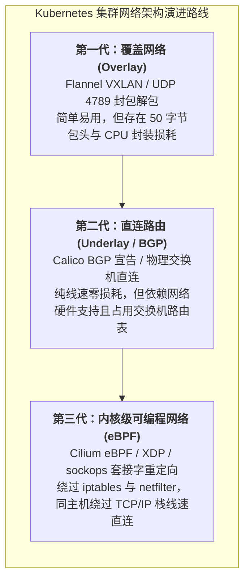
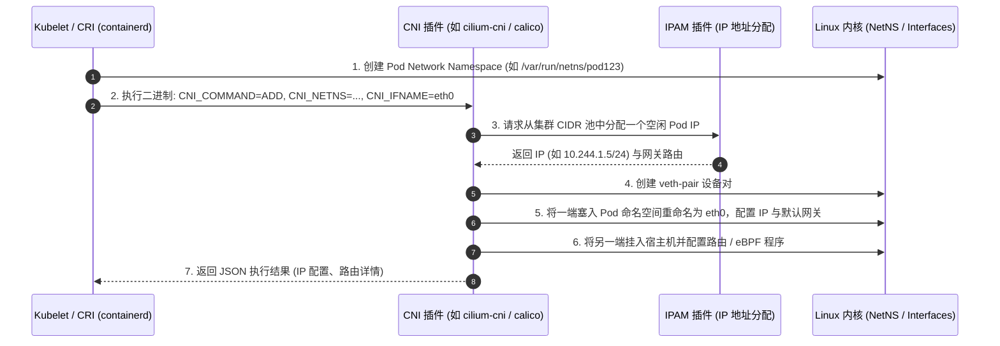
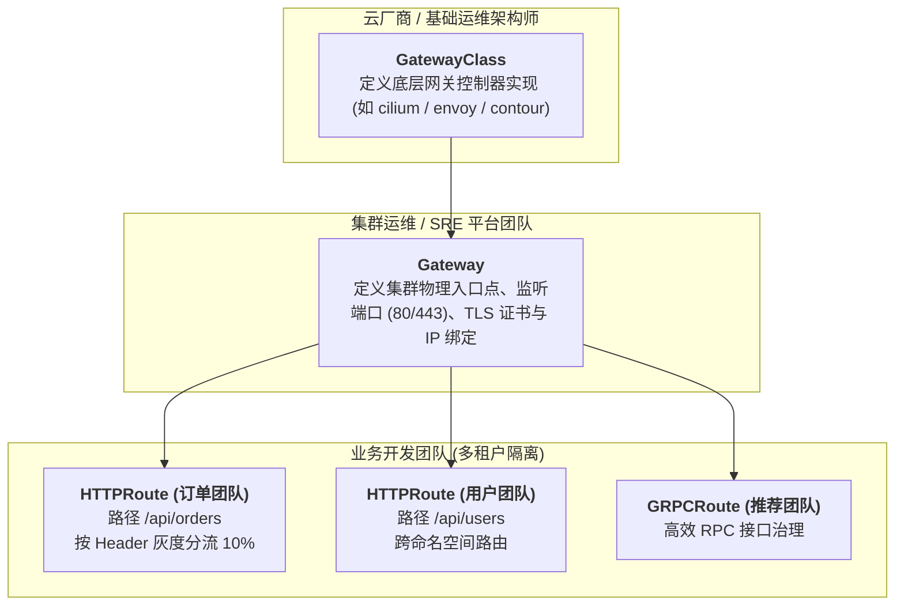

## 引言：云原生网络的终极演进之战

在专栏的第二讲 [容器网络全景解密：veth-pair、Linux Bridge、iptables NAT 与跨主机网络拓扑](/articles/container-networking-veth-bridge-iptables/) 中，我们见证了单机 Docker 时代如何利用 Linux Bridge 和 iptables NAT 构建简易的容器局域网。

然而，当系统跨越到由数千台宿主机、上万个微服务 Pod 组成的超大规模 Kubernetes 集群时，传统的单机 NAT 网络方案彻底崩溃：
- 如果每个容器都通过宿主机端口映射（Port Mapping）对外暴露服务，整个集群的端口资源将瞬间冲突殆尽；
- 容器在跨物理节点调用时，如果反复经过复杂的 NAT 地址转换，双向抓包排错、安全网络策略（NetworkPolicy）以及链路追踪将陷入无休止的“黑盒”梦魇。

为此，Kubernetes 在创立之初便树立了一套极其激进却极其优雅的**经典网络基本公理**，并在其上孵化出了繁荣的 **CNI（Container Network Interface）插件生态**与近年来彻底颠覆内核协议栈的 **eBPF 革命**。



本文作为**《从 Docker 到 Kubernetes：云原生容器与集群编排架构指南》**的第五篇，将带你全面剖析 Kubernetes 网络模型的四大公理、CNI 插件生命周期、Calico BGP 路由机制、Cilium eBPF 内核重构，以及替代传统 Ingress 的下一代 **Gateway API**。

---

## 一、 Kubernetes 网络的四大公理与扁平拓扑

Kubernetes 对集群网络施加了非常硬核的“四大网络公理（Axioms）”：

1. **IP-per-Pod（每个 Pod 拥有全集群唯一的独立 IP）**：
   Pod 内部的所有容器共享相同的 Network Namespace，彼此之间直接通过 `localhost` 极速通信，而每个 Pod 都分配有一个可在集群内被直接寻址的独立 IP。
2. **所有 Pod 之间通信免 NAT（All Pods can communicate with all Pods without NAT）**：
   任何一个节点上的 Pod 向集群内任意其他 Pod 发送数据包时，源 IP 和目标 IP 在整个流转链路上必须保持纯净，绝不能经过源地址转换（SNAT）或目的地址转换（DNAT）。
3. **节点上的代理程序与本节点所有 Pod 之间免 NAT**：
   宿主机上的 Kubelet 和系统 Daemon 可以直接通过 Pod IP 与其顺畅通信，反之亦然。
4. **处于宿主机网络（HostNetwork）的 Pod 与其它 Pod 免 NAT 通信**。

```
经典 Kubernetes 扁平二层网络视界 (Flat Network):
Node A (192.168.1.10)              Node B (192.168.1.20)
┌──────────────────────┐          ┌──────────────────────┐
│ Pod 1 (10.244.1.5)   │          │ Pod 3 (10.244.2.8)   │
│ Pod 2 (10.244.1.6)   │          │ Pod 4 (10.244.2.9)   │
└──────────┬───────────┘          └──────────┬───────────┘
           │                                 │
           └────────── 跨机直通无 NAT ─────────┘
        (Src: 10.244.1.5  ──►  Dst: 10.244.2.8)
```

这四大公理彻底消除了传统网络中的端口争抢与 NAT 损耗，使 Kubernetes 集群呈现为一个纯净、透明的**扁平二层网络（Flat Layer 3/Layer 2 Network）**。

---

## 二、 CNI 插件规范：容器网络沙箱的装配流水线

Kubernetes 自身并不内置具体的网络实现，而是通过 **CNI（Container Network Interface，容器网络接口）** 规范将网络方案完全插件化。

当 Kubelet 监听到调度至本机的 Pod 时，它首先通过 CRI（如 containerd）创建容器的 Network Namespace 沙箱，然后通过标准环境变量和 JSON 配置文件调用 CNI 二进制插件。



CNI 规范极其精简，其二进制仅需实现四个核心指令：
- **`ADD`**：为容器沙箱创建网络接口、分配 IP、配置路由规则并加入网络；
- **`DEL`**：从容器沙箱中撤销网络接口、释放 IP 地址、清理路由表；
- **`CHECK`**：检查当前容器的网络状态是否与预期一致；
- **`VERSION`**：输出 CNI 插件所支持的规范版本。

---

## 三、 Underlay vs Overlay：网络流派的终极抉择

在选择 CNI 插件时，架构师首先面临的是网络底层的架构范式选型：**覆盖网络（Overlay）** 还是 **直连路由（Underlay）**？

```
Overlay (VXLAN) 报文封装:
[物理以太头][物理外层 IP][UDP 4789][VXLAN 头 8B][内层原始 Pod IP 包] -> MTU 需下调 50 字节

Underlay (Calico BGP) 直连报文:
[物理以太头][原始 Pod IP 包 (Src: 10.244.1.5, Dst: 10.244.2.8)] -> 纯线速，无额外包头
```

### 1. Overlay 方案（以 Flannel / Cilium Geneve 为代表）
- **核心原理**：无论底层物理网络拓扑多么复杂，只要节点之间 UDP 互通，便在原始 Pod 数据包外层封装一层 UDP/VXLAN 报文，在物理网络之上“凭空架设”一条虚拟隧道；
- **优势**：**极度普适**。对物理网络硬件与公有云 VPC 毫无依赖，即插即用；
- **劣势**：每个数据包额外增加 50 字节的协议开销，必须将宿主机网卡 MTU 下调至 `1450`（防止超长丢包）；CPU 需要消耗计算周期进行频繁的封包与解包，高吞吐场景下约有 5%~15% 的性能损耗。

### 2. Underlay / BGP 方案（以 Calico BGP 为代表）
- **核心原理**：将每台物理宿主机都视作一台自治的 **BGP 路由器**。通过内置的 Bird 守护进程，利用边界网关协议（BGP）向物理交换机（Top-of-Rack Switch, ToR）直接宣告当前节点所拥有的 Pod 子网网段；
- **优势**：**真正的硬件纯线速**。完全没有封包解包开销，网络延迟与直接访问物理机毫无二致；
- **劣势**：要求必须具备数据中心物理交换机的配置控制权；当集群规模达到上千台节点时，成千上万条路由表项可能会直接撑爆老旧物理交换机的三层硬件路由表容量。

---

## 四、 Service 负载均衡的进化：从 iptables 到 Cilium eBPF

Kubernetes 的 Service 是一个虚拟抽象，背后对应着一组随时可能销毁漂移的 Pod 集合（由 EndpointSlice 维护）。负责将请求从 Service 虚拟 IP（ClusterIP）分发至实际 Pod 的经典组件是 **`kube-proxy`**。

### 4.1 kube-proxy 的两次阵痛：Userspace 与 iptables
1. **Userspace 模式（早年已被废弃）**：流量进出内核态与用户态反复拷贝，性能极差；
2. **iptables 模式（长期默认）**：
   - 为每个 Service 和 Pod 创建一系列复杂的 iptables 规则链；
   - **痛点**：iptables 是一张扁平线性的规则链表，时间复杂度为 $O(N)$。当集群拥有 5,000+ 个 Service 和数万个 Pod 时，iptables 规则数量突破数十万条；
   - 只要任何一个 Pod 发生漂移，内核必须对全量 iptables 进行全局加锁并全量刷新，引发严重的 CPU 抖动与网络延迟毛刺。

### 4.2 eBPF 革命：Cilium 如何颠覆网络协议栈

**Cilium** 的横空出世彻底终结了 iptables 的时代。它利用 Linux 内核的 **eBPF（Extended Berkeley Packet Filter）** 虚拟机技术，在内核网络事件触发点直接动态注入沙箱字节码：

```mermaid
flowchart TD
    subgraph TraditionalLinux["传统 Linux 网络协议栈 (kube-proxy + iptables)"]
        direction TB
        T1["网卡接收报文"] --> T2["Linux Netfilter 框架"]
        T2 --> T3["遍历数十万条 iptables 规则链 (O(N) 线性查找)"]
        T3 --> T4["内核 conntrack 连接跟踪锁"]
        T4 --> T5["跨 veth-pair 两次协议栈串行拷贝"]
        T5 --> T6["交付容器 Socket"]
    end

    subgraph CiliumeBPF["Cilium eBPF 架构 (完全旁路 Netfilter)"]
        direction TB
        E1["网卡接收报文 (XDP 网卡线速 Hook)"] --> E2["eBPF BPF_MAP B-Tree 查找 (O(1) 极速匹配)"]
        E2 --> E3["直接重写数据包元数据 (完全绕过 conntrack 与 iptables)"]
        E3 --> E4["<b>sockops / sk_msg: Socket 层直接内存重定向</b>"]
        E4 --> E5["直接送达容器 Socket (同主机免入 TCP/IP 栈)"]
    end
```



#### Cilium eBPF 的三大黑科技：
1. **$O(1)$ 常数级寻址**：使用高效的内核 BPF Map 哈希表维护服务路由，无论集群内有 10 个还是 100,000 个 Service，分发耗时完全恒定；
2. **完全剔除 kube-proxy 与 iptables**：在 `kube-proxy-replacement=strict` 模式下，宿主机无需启动任何 kube-proxy，iptables 规则表保持绝对清爽；
3. **`sockops` 套接字层直接短路**：当同一台宿主机上的两个 Pod 进行 TCP 通信时，Cilium 在套接字层（Socket Layer）直接捕获 `sendmsg`，通过内核指针直接将数据包写入目标容器的 Socket 接收队列，**彻底绕过了 veth-pair、网卡驱动和整个下层 TCP/IP 协议栈**，性能提升高达 300%！

---

## 五、 北向流量治理进化：从 Ingress 到 Gateway API

解决了东西向（Pod-to-Pod）的通信之后，南北向（集群外部流量进入）的管理同样经历了一场重大重构。

长期以来，Kubernetes 使用 **Ingress** 资源暴露 HTTP 服务。然而，Ingress 存在与生俱来的严重缺陷：
- **规范过于简陋**：不支持基于 Header、Method 路由，不支持高级金丝雀分流、流量镜像，各个网关供应商（Nginx, Envoy, Traefik）只能通过在 YAML 中塞满杂乱的供应商注解（`annotations`）来实现扩展，完全丧失了可移植性；
- **缺乏多租户职责分离**：基础设施运维人员、集群安全管理员与业务开发工程师必须在同一个 Ingress YAML 文件中互相挤压修改。

### 5.1 Gateway API 的角色解耦设计
为了彻底解决这一痛点，Kubernetes 社区推出了面向未来的 **Gateway API**。它将网络控制权按组织职责清晰划分为三层抽象：



1. **`GatewayClass`（基础设施层）**：定义集群中可用的网关实现类（例如是 AWS ALB、Envoy 网关还是 Cilium 网关）；
2. **`Gateway`（集群管理员层）**：声明具体的网络流量入口，配置物理端口、全局 TLS 证书以及跨命名空间允许绑定的路由权限；
3. **`HTTPRoute` / `GRPCRoute` / `TCPRoute`（业务应用开发层）**：业务开发人员只需在自己的独立命名空间内定义路由规则、金丝雀权重分流（如 90% 到 v1，10% 到 v2）、重写与重试策略，不再需要向运维人员申请修改核心 Ingress 文件。

---

## 六、 总结与进阶预告

Kubernetes 网络体系的演进，本质上是云原生软件栈对 Linux 操作系统底层能力不断深挖与重塑的壮丽史诗：
- **四大公理** 确立了扁平、透明、无 NAT 的优雅基准；
- **CNI 规范** 将网络实现彻底解耦，促成了 Underlay 与 Overlay 百花齐放的工程格局；
- **Cilium eBPF** 打破了 Linux iptables/Netfilter 几十年的性能桎梏，在内核可编程层为下一代智算网络插上了翅膀；
- **Gateway API** 则以清晰的角色分离，重新定义了面向多租户时代的北向流量治理标准。

当计算与网络均已就位，真正的持久化生产挑战才刚刚开始：**状态**。

无状态的 Web 服务可以随时销毁，但有状态的数据库（MySQL, PostgreSQL, Redis, Elasticsearch）该如何安全运行在 Kubernetes 之上？PVC 与 PV 的动态绑定底层如何流转？CSI 插件规范如何驱动物理块存储的挂载与格式化？StatefulSet 又如何提供不可动摇的拓扑一致性保证？

在接下来的**专栏第六讲**中，我们将全面攻克云原生领域最坚固的堡垒 —— **[Kubernetes 有状态存储中枢：CSI 插件规范、动态 PV/PVC 供给与 StatefulSet 拓扑保证](/articles/k8s-storage-csi-statefulset-deep-dive/)**！

---

## 常见问题 (FAQ)

### Q1: 为什么使用 VXLAN Overlay 网络时，部分大包请求（如大文件上传或 TLS 握手）会发生偶发性超时甚至静默丢包？
**根本原因：MTU（最大传输单元）配置失配**。
标准以太网物理网卡的 MTU 通常为 1500 字节。而 VXLAN 报文在封装时，必须额外添加外层 IP 头（20B）+ UDP 头（8B）+ VXLAN 头（8B）+ 内层以太头（14B），总计 **50 字节的封装损耗**。
如果容器内的虚拟网卡（`eth0`）MTU 依然保持为默认的 1500，当应用发送 1500 字节的 TCP 包且设置了 `DF`（Don't Fragment，禁止分片）标志时，外层封包后将达到 1550 字节，超过物理网络 MTU，导致数据包在物理交换机处被直接丢弃！
**解决方案**：
必须确保 CNI 插件（如 Flannel 或 Cilium）将容器网卡的 MTU 正确设置为物理网卡 MTU 减去 50（即 `1450`），并确保 Linux 内核启用了标准的 TCP MSS Clamping。

### Q2: Cilium 在完全替代 kube-proxy（`kube-proxy-replacement=strict`）后，底层究竟是如何处理 NodePort 流量的？
Cilium 在底层依靠 **eBPF XDP (eXpress Data Path) 与 tc (Traffic Control) 子系统**：
1. 当外部客户端访问宿主机的 `NodePort`（如 `30080`）时，网卡驱动刚收到数据包，挂载在网络驱动最底层的 **XDP eBPF 程序**便在内核分配 `sk_buff` 之前极速捕获该包；
2. Cilium 在内核 BPF Map 中执行 $O(1)$ 查找，确定该 NodePort 对应的健康后备 Pod IP；
3. 如果目标 Pod 在本机，eBPF 直接修改目标 IP 并通过 `sockops` 重定向交付；如果目标 Pod 在远端节点，Cilium 自动进行 DSR（Direct Server Return，直接服务器返回）或者快速 SNAT 封装转发，**整个过程完全绕过了 Linux 内核 conntrack 连接跟踪表与 iptables**，耗时仅微秒级。

### Q3: 生产集群何时应当从传统的 Ingress 全面迁移到 Gateway API？
如果你的业务满足以下任意一个场景，应尽早规划迁移：
1. **多团队/多租户协作冲突**：研发团队需要自主管理路由规则、重写路径与灰度策略，但运维团队希望严格管控入口证书与端口权限；
2. **需要跨命名空间路由或高级流量分流**：例如 Ingress 原生无法做到“将 5% 的请求按自定义 HTTP Header（如 `User-Group: Beta`）精准导入金丝雀服务”；
3. **消除供应商绑定**：厌倦了不同网关供应商（如 Nginx Ingress Controller 与 Envoy）之间完全不通用的海量 `annotations`，希望利用标准的 Kubernetes 原生 API 实现网关层面的无缝平滑替换。
