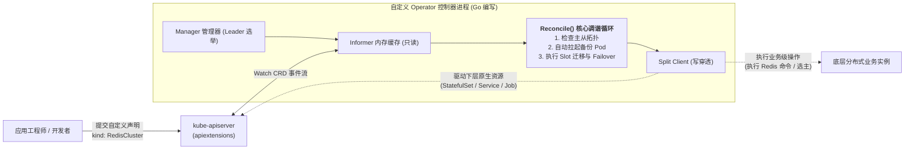
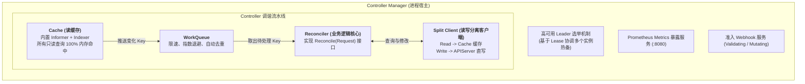

## 引言：从基础设施编排到“运维代码化”的跃迁

在专栏的前几讲中，我们见证了 Kubernetes 如何通过声明式 API 和原生控制器（Deployment、StatefulSet）管理通用的工作负载。

然而，在严肃的企业级生产环境中，基础设施软件的运维复杂度远远超出了“拉起几个 Pod 并挂载磁盘”的范畴：
- 部署一个企业级高可用 **MySQL 主从集群**，需要处理初始化主从复制、动态提升从库为新主库（Failover）、GTID 校验以及自动物理备份；
- 部署一个分布式 **Kafka / ZooKeeper** 集群，需要协调 Controller 选举、动态分配 Partition 副本与在线平滑扩容；
- 部署一套大型 **Prometheus** 监控平台，需要动态生成并热加载成百上千个微服务的抓取配置（Scrape Configs）。

面对这些高度依赖领域特定知识（Domain-Specific Knowledge）的复杂有状态系统，通用的原生控制器束手无策。传统的解决方案是编写大量的 Shell/Python 脚本，或者依赖运维工程师在告警半夜被叫醒手动执行运维手册（Runbook）。

2016 年，CoreOS 团队提出了一个颠覆性的架构模式 —— **Operator 模式**：

$$\text{Operator} = \text{Custom Resource Definition (CRD)} + \text{Custom Controller}$$

**它的核心哲学是：将人类顶级 SRE 专家的运维认知与决策树，全部固化并编写成运行在 Kubernetes 控制平面内的自动化软件代码！**



本文作为**《从 Docker 到 Kubernetes：云原生容器与集群编排架构指南》**的第七篇，将带你深入 Kubernetes 扩展性设计的皇冠明珠：剖析 CRD 底层模型、精解 Controller-Runtime 与 KubeBuilder 架构，并通过实战代码掌握生产级 Operator 的编写艺术与避坑指南。

---

## 一、 CRD 底层机制：让 Kubernetes 认识你的私有 API

在默认状态下，Kubernetes 只认识 `Pod`、`Service`、`Deployment` 等内建核心资源。**CRD（Custom Resource Definition，自定义资源定义）** 赋予了集群动态扩展数据模型的能力，而**无需修改一行 Kubernetes 核心代码或重新编译 apiserver**！

### 1.1 apiextensions-apiserver 动态注册
当管理员向集群提交一个 CRD 资源清单时，内核中的 `apiextensions-apiserver` 会动态拦截并为该类型在 REST 路径上注册全新的端点：
```
/apis/<group>/<version>/namespaces/<namespace>/<plural>
例如:
/apis/database.example.com/v1alpha1/namespaces/default/redisclusters
```

从这一刻起，开发者便可以像操作原生 Pod 一样，使用 `kubectl get rediscluster`、`kubectl apply -f my-cluster.yaml` 对该自定义资源进行全生命周期管理。

### 1.2 生产级 CRD 的四大关键设计要素

在设计面向生产的 CRD 时，必须严格遵循现代云原生规范：

1. **OpenAPI v3 结构化校验（Structural Schema）**：
   通过严密的 Schema 定义字段类型、默认值、必填项（`required`）与正则限制，所有非法格式在进入 apiserver 准入层时被直接拦截拒绝。
2. **状态子资源隔离（`/status` Subresource）**：
   ```yaml
   subresources:
     status: {}
   ```
   强制将用户声明的 `spec` 与控制器汇报的 `status` 物理隔离。普通用户只有修改 `spec` 的权限，唯有具备特定 RBAC 的 Operator 进程才能调用 `/status` 子资源更新运行状态，彻底杜绝状态被恶意篡改。
3. **弹性伸缩子资源（`/scale` Subresource）**：
   声明该 CRD 的副本字段路径（如 `.spec.replicas` 与 `.status.replicas`）。一旦开启，Kubernetes 原生的 **HPA（Horizontal Pod Autoscaler）** 即可直接挂载并根据业务指标对你的私有资源实施自动水平扩缩容！
4. **多版本协同与 Conversion Webhook**：
   当 CRD 经历版本演化（`v1alpha1` $\to$ `v1beta1` $\to$ `v1`）时，借助 Conversion Webhook 可以在 apiserver 内存中实现多版本定义的无缝透明双向转换。

---

## 二、 KubeBuilder 与 Controller-Runtime 核心架构

编写一个生产级 Operator 绝不能从零裸写 HTTP 请求或重复发明轮子。工业界事实标准是使用基于 Go 语言的 **Controller-Runtime** 框架（由官方维护）与 **KubeBuilder** 脚手架。

Controller-Runtime 内部各核心组件的协作拓扑如下：



### 核心组件职责剖析：
1. **Manager（管理器）**：
   整个 Operator 进程的心脏。负责统一管理集群的生命周期，包括启动所有的 Controller、提供内置的基于 Kubernetes `Lease` 锁的高可用 **Leader 选举**（确保任意时刻只有一个 Operator 实例执行写操作）、启动 Prometheus 监控端点以及证书管理。
2. **Split Client（读写分离客户端）**：
   Controller-Runtime 提供的高性能客户端。所有 `client.Get()` 和 `client.List()` 默认**全部走本地 Informer 内存 Cache**，绝不给 apiserver 造成任何压力；而 `client.Create()`、`client.Update()`、`client.Delete()` 则**直接穿透直写 apiserver**。
3. **Reconciler（调谐器）**：
   开发者唯一需要倾注心血编写业务代码的地方。它必须是一个**纯粹的幂等函数**，接收一个 `reconcile.Request{NamespacedName}`，返回 `reconcile.Result` 和 `error`。

---

## 三、 实战：构建一个高可用 RedisCluster Operator

让我们通过一段高工业水准的 Go 语言实战代码，剖析生产级 Operator 的核心调谐逻辑与生命周期管理。

### 3.1 定义 CRD Go 结构体

```go
package v1alpha1

import (
    metav1 "k8s.io/apimachinery/pkg/apis/meta/v1"
)

// RedisClusterSpec 定义用户期望状态
type RedisClusterSpec struct {
    // 期望的 Redis 实例副本数
    Replicas int32 `json:"replicas"`
    // 容器镜像版本
    Image string `json:"image"`
    // 是否开启自动故障切换
    EnableAutoFailover bool `json:"enableAutoFailover,omitempty"`
}

// RedisClusterStatus 定义系统实际运行状态
type RedisClusterStatus struct {
    // 当前就绪的实例副本数
    ReadyReplicas int32 `json:"readyReplicas"`
    // 当前选举出的主节点 Pod 名称
    CurrentMaster string `json:"currentMaster,omitempty"`
    // 集群当前阶段: Initializing, Running, Degraded
    Phase string `json:"phase"`
}

// +kubebuilder:object:root=true
// +kubebuilder:subresource:status
// +kubebuilder:subresource:scale:specpath=.spec.replicas,statuspath=.status.readyReplicas
// +kubebuilder:printcolumn:name="Replicas",type="integer",JSONPath=".spec.replicas"
// +kubebuilder:printcolumn:name="Ready",type="integer",JSONPath=".status.readyReplicas"
// +kubebuilder:printcolumn:name="Phase",type="string",JSONPath=".status.phase"

// RedisCluster 是 Redis 集群的 Schema 定义
type RedisCluster struct {
    metav1.TypeMeta   `json:",inline"`
    metav1.ObjectMeta `json:"metadata,omitempty"`

    Spec   RedisClusterSpec   `json:"spec,omitempty"`
    Status RedisClusterStatus `json:"status,omitempty"`
}
```

### 3.2 生产级 Reconcile 循环与 Finalizer 清理机制

在生产环境中，当用户执行 `kubectl delete rediscluster my-redis` 时，如果 Operator 没有介入，底层在外部云上创建的负载均衡器或未持久化的内存数据可能会发生泄漏。**Finalizer（终结器）** 是保障资源优雅注销的安全锁。

```go
package controllers

import (
    "context"
    "fmt"
    "time"

    corev1 "k8s.io/api/core/v1"
    "k8s.io/apimachinery/pkg/api/errors"
    ctrl "sigs.k8s.io/controller-runtime"
    "sigs.k8s.io/controller-runtime/pkg/client"
    "sigs.k8s.io/controller-runtime/pkg/controller/controllerutil"
    "sigs.k8s.io/controller-runtime/pkg/log"

    dbv1alpha1 "example.com/api/v1alpha1"
)

const redisFinalizer = "database.example.com/finalizer"

type RedisClusterReconciler struct {
    client.Client
}

func (r *RedisClusterReconciler) Reconcile(ctx context.Context, req ctrl.Request) (ctrl.Result, error) {
    logger := log.FromContext(ctx)

    // 1. 从内存 Cache 中获取当前的 RedisCluster 实例
    var cluster dbv1alpha1.RedisCluster
    if err := r.Get(ctx, req.NamespacedName, &cluster); err != nil {
        if errors.IsNotFound(err) {
            // 资源已不存在，调谐正常结束
            return ctrl.Result{}, nil
        }
        return ctrl.Result{}, err
    }

    // 2. 检查资源是否正在被删除 (DeletionTimestamp 是否非空)
    if !cluster.ObjectMeta.DeletionTimestamp.IsZero() {
        if controllerutil.ContainsFinalizer(&cluster, redisFinalizer) {
            // 执行业务级优雅清理逻辑 (例如: 保存 RDB 快照至 S3, 解除外部 DNS 绑定)
            logger.Info("Executing safe cleanup before resource deletion", "cluster", cluster.Name)
            if err := r.finalizeExternalResources(ctx, &cluster); err != nil {
                return ctrl.Result{}, err
            }

            // 清理完成，移除 Finalizer，允许 Kubernetes 正式物理删除 etcd 对象
            controllerutil.RemoveFinalizer(&cluster, redisFinalizer)
            if err := r.Update(ctx, &cluster); err != nil {
                return ctrl.Result{}, err
            }
        }
        return ctrl.Result{}, nil
    }

    // 3. 资源正常运行，确保注册了 Finalizer 保护锁
    if !controllerutil.ContainsFinalizer(&cluster, redisFinalizer) {
        controllerutil.AddFinalizer(&cluster, redisFinalizer)
        if err := r.Update(ctx, &cluster); err != nil {
            return ctrl.Result{}, err
        }
    }

    // 4. 调谐下层承载的 StatefulSet 与 Service (保障期望状态)
    if err := r.reconcileStatefulSet(ctx, &cluster); err != nil {
        return ctrl.Result{}, err
    }

    // 5. 执行特定的业务运维逻辑 (例如探测 Redis 存活并执行动态 Failover)
    readyReplicas, currentMaster, err := r.auditRedisNodes(ctx, &cluster)
    if err != nil {
        logger.Error(err, "Failed to audit Redis cluster nodes")
        return ctrl.Result{RequeueAfter: 5 * time.Second}, nil
    }

    // 6. 更新 Status 子资源 (具备乐观锁，绝不污染 Spec)
    cluster.Status.ReadyReplicas = readyReplicas
    cluster.Status.CurrentMaster = currentMaster
    cluster.Status.Phase = "Running"
    if err := r.Status().Update(ctx, &cluster); err != nil {
        return ctrl.Result{}, err
    }

    // 7. 定期轮询检查，确保持续收敛
    return ctrl.Result{RequeueAfter: 30 * time.Second}, nil
}
```

---

## 四、 生产 Operator 的反模式与黄金戒律

在工业界落地 Operator 时，许多团队常常写出看似合理但极易引发集群雪崩的代码。请务必牢记以下设计戒律：

### 1. 绝对戒律：Reconcile 函数必须严格保证幂等性 (Idempotence)
- **反模式**：在 Reconcile 中执行“每调谐一次就发送一封邮件告警”或“调用未去重的外部不可逆计费接口”；
- **核心法则**：同一个 Key 的 Reconcile 可能在 1 秒内被重复触发十几次（由于各种 Watch 事件抖动）。**无论 Reconcile 被执行 1 次还是 10,000 次，系统达到的最终稳态必须完全相同！**

### 2. 避免在 Reconcile 中执行耗时阻塞操作
- **反模式**：在调谐函数内直接执行长达 5 分钟的数据库大文件备份或同步等待 Pod 拉起；
- **核心法则**：Controller-Runtime 的 Worker 协程池默认大小有限（通常为 1~10 个并发）。任何长耗时任务必须异步委托给 Kubernetes 的 `Job` 资源去执行，Reconcile 函数本身必须在百毫秒内完成并安全退出。

### 3. 正确使用 OwnerReference 实现级联垃圾回收
- 每一个由 Operator 创建的下层子资源（如 StatefulSet、Service、Secret），都必须通过 `controllerutil.SetControllerReference(&cluster, childObj, r.Scheme)` 设置属主关系；
- 当父级 `RedisCluster` 被删除时，Kubernetes 原生的垃圾回收器（Garbage Collector）会自动级联清理所有属于它的孤儿资源。

---

## 五、 总结与进阶预告

Operator 模式赋予了 Kubernetes **无限进化的生命力**：
- 它超越了单纯的基础设施编排，将复杂的分布式软件运维知识提升为可版本化、可测试、可迭代的工业级代码资产；
- **CRD** 扩展了控制平面的数据模型；
- **KubeBuilder 与 Controller-Runtime** 则为全世界的平台架构师提供了极其坚固的生产级脚手架。

如今，随着以大语言模型（LLM）与生成式 AI 为核心的智算时代全面降临，Kubernetes 的 Operator 模式迎来了有史以来最辉煌的用武之地。

在动辄拥有成千上万张昂贵 NVIDIA GPU、超大 InfiniBand/RoCE 网络与复杂 NUMA 拓扑的万卡智算中心里：
- 究竟该如何使用 **NVIDIA GPU Operator** 自动化纳管驱动、Container Toolkit 与 MIG 分割？
- 动态资源分配（DRA）与拓扑感知调度（Topology Manager）如何避免跨 NUMA 内存瓶颈？
- 像 **vLLM、SGLang** 这样基于 P/D 分离与分布式 KV Cache 的前沿推理集群，又该如何在 Kubernetes 上基于真实缓存负载实现精准的自动弹性扩缩容？

在接下来的**专栏终局篇（第八讲）**中，我们将全面聚焦 2026 云原生最火热的前沿战场 —— **[2026 AI 智算调度终局：Kubernetes GPU Operator、MIG 分割、拓扑感知调度与 vLLM/SGLang 集群弹性扩缩容](/articles/k8s-gpu-operator-ai-inference-scheduling/)**！

---

## 常见问题 (FAQ)

### Q1: Helm Chart 与 Operator 有何本质区别？Operator 可以完全替代 Helm 吗？
**本质区别**：
- **Helm 是“安装配置模板工具（Package Manager）”**：它的生命周期通常仅在 `helm install` 或 `helm upgrade` 的瞬间生效，本质上是把参数动态渲染成 YAML 清单并提交给 apiserver。一旦安装完成，Helm 对应用运行期间发生的内部拓扑异常（如 MySQL 从库复制中断）完全无感知，更无法进行自动运维。
- **Operator 是“永不停歇的智能常驻机器人（Active Controller）”**：它不仅负责初始部署，更在应用的整个生命周期中（Day-2 Operations）以 7x24 小时的方式持续监听内部状态，执行自动故障转移、平滑升级、数据迁移和槽位重平衡。
- **两者关系**：两者不仅不冲突，反而通常协同工作 —— 生产中常常使用 Helm Chart 来一键打包部署 Operator 自身！

### Q2: 为什么自定义资源有时会无限期卡在 `Terminating` 状态无法删除？如何彻底排查与修复？
**根本原因：Finalizer（终结器）锁死**。
当资源的 `metadata.finalizers` 列表中包含未完成的字符串锁时，Kubernetes 会阻止物理删除该对象，仅打上 `deletionTimestamp` 时间戳，等待 Operator 执行清理。
如果此时该 Operator 进程已经崩溃停机、或者 Operator 在执行外部资源销毁（如清理云厂商存储）时持续报错，Finalizer 就永远无法被移除，导致对象永久卡在 `Terminating`。
**排查与恢复方法**：
1. 查看 Operator 容器日志，定位清理逻辑的具体报错；
2. 如果确认为废弃资源且外部资产已确认安全手动释放，可通过补丁命令强制剥离 Finalizer 锁：
   `kubectl patch rediscluster my-redis -p '{"metadata":{"finalizers":[]}}' --type=merge`，对象即可瞬间彻底注销。

### Q3: 为什么在 Controller 调谐逻辑中，强制要求将对 Status 的更新使用 `r.Status().Update()` 而不是普通的 `r.Update()`？
**两大关键原因**：
1. **防止乐观并发冲突（409 Conflict）死循环**：普通的 `r.Update()` 会同时提交对象的 `Spec` 与元数据。如果此时用户恰好修改了 YAML 中的期望副本数，Operator 盲目调用 `r.Update()` 就会产生版本冲突；使用专门的 `r.Status().Update()` 仅更新状态字段，减少并发锁冲突；
2. **遵循权限最小化与 RBAC 安全规范**：在企业集群中，业务开发团队通常被赋予修改 CRD `spec` 的权限，但被严厉禁止修改 `status`；而 Operator 拥有访问 `/status` 子资源的特权。将两者在代码层面严格解耦，是构建工业级安全 Operator 的基本要求。
