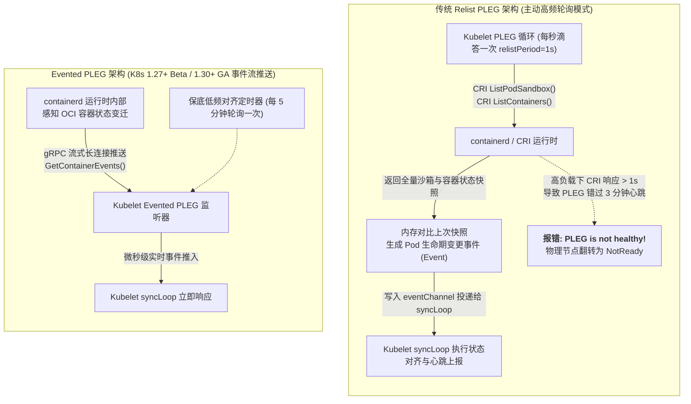
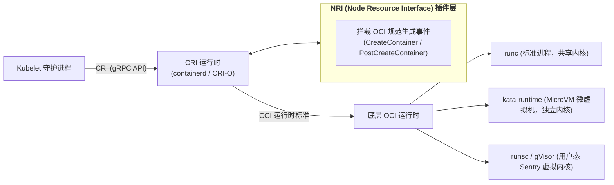
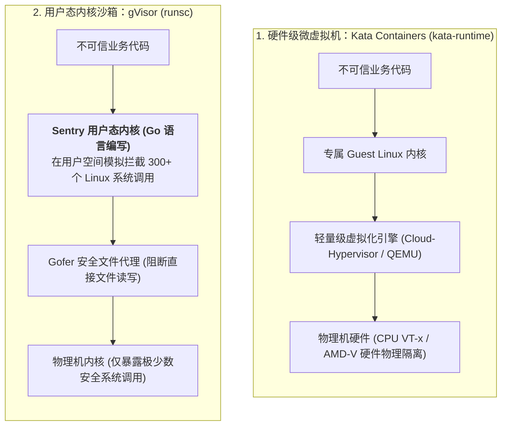

## 引言：打破 runc 共享内核的“安全原罪”与节点假死枷锁

在专栏的第一讲 [Docker 内核第一性原理](/articles/docker-internals-namespace-cgroups-overlayfs/) 中，我们确立了一个不可撼动的底层物理事实：**容器只是一个被 Linux Namespace 限制了视界、被 cgroups 限制了资源的普通宿主机进程，它与宿主机上成千上万的其他进程共享同一个 Linux 操作系统内核**。

这种“轻量级共享”带来了极速启动与零损耗性能，但在企业级多租户与超大规模高并发生产深水区，也带来了两大长期困扰平台架构师的致命难题：

1. **不可接受的零日逃逸风险（Multi-Tenant Isolation）**：
   当集群需要运行不受信任的第三方用户代码（如 SaaS 平台的 Serverless 函数计算、AI Agent 自动化代码解释器）时，一旦底层 Linux 内核曝出提权或逃逸漏洞（如著名的 Dirty COW、CVE-2024-21626 等），恶意代码就能瞬间穿透 Namespace 屏障，直接劫持物理宿主机乃至掌控整个 Kubernetes 控制平面！
2. **Kubelet PLEG 周期轮询引发的“节点假死震荡”**：
   在单机运行上百个 Pod 的高密计算节点上，或者在镜像拉取与磁盘 I/O 高峰期，Kubelet 会频繁抛出令 SRE 闻风丧胆的告警：`PLEG is not healthy: pleg was last seen active 3m5s ago; threshold is 3m0s`。紧接着，物理节点状态瞬间翻转为 `NotReady`，触发控制平面大规模驱逐级联故障。
3. **全局内核参数（Sysctl）与 cgroups 粗暴 OOM 的治理失控**：
   高并发服务需要将 TCP 半连接队列 `somaxconn` 调大至 4096，而默认的 Linux 内存限制 `memory.max` 在突发流量下会无情触发 OOMKilled，导致进程瞬间死绝，缺乏平滑缓冲手段。

要彻底解决这些工业级痛点，平台架构师必须深入 Worker 节点底层，**对 Kubelet 核心机制与容器运行时（CRI & OCI）进行彻底的二次定制与架构重塑**。

本文作为**《从 Docker 到 Kubernetes：云原生容器与集群编排架构指南》**的第十篇，将带你掌握对 Kubernetes 节点动刀的核心技术：**突破 PLEG 瓶颈的 Evented PLEG 机制**、**NRI 节点资源接口插件开发**、**Kata 与 gVisor 多安全沙箱运行时**，以及 **cgroups v2 与 Sysctl 深度调优实战**。

---

## 一、 突破节点假死：Kubelet PLEG 瓶颈与 Evented PLEG 事件流革新

在 Kubernetes 工作节点上，`kubelet` 进程的心脏是一个名为 **`syncLoop`** 的主控制循环，而它的脉搏则由 **PLEG（Pod Lifecycle Event Generator）** 驱动。



### 1.1 传统 Relist PLEG 的致命死穴
传统的 PLEG 采用极度短视的**全量快照比对机制（Relist）**：
- PLEG 每隔 1 秒调用一次 CRI 的 `ListPodSandbox` 和 `ListContainers`，抓取全节点所有容器的运行状态；
- 将当前快照与上一秒的快照进行全量对比，如果发现容器 ID 或状态发生变迁，便生成一个生命周期事件送入 `eventChannel`；
- **雪崩陷阱**：当单机运行超过 100 个 Pod，或者宿主机由于高频磁盘写入导致 D 状态进程卡死时，CRI 的 gRPC 调用耗时会迅速从 10ms 飙升至数秒。当连续 3 分钟未能完成一次完整的 Relist 时，Kubelet 会判定 PLEG 崩溃，将该节点状态标记为 `NotReady`，触发集群级大面积驱逐误杀！

### 1.2 生产级破局：Evented PLEG (事件流驱动)
为了终结 PLEG 的轮询灾难，社区在 Kubelet 与 containerd 之间重构了基于流式事件推送的 **Evented PLEG**（KEP-3386）：
1. **gRPC 流式事件监听**：Kubelet 启动时向 containerd 建立单向长连接 `runtimeService.GetContainerEvents()`；
2. **事件驱动推送到端**：当容器退出、暂停或启动时，containerd 内部直接将事件推送到 gRPC 流中，Kubelet 在**微秒级**时间内即可获知，完全摆脱了每秒全量扫描容器列表的沉重开销；
3. **保底兜底周期拉长**：为了防止网络丢包引发事件遗漏，将原先 1 秒一次的 Relist 保底对齐周期拉长至 **5 分钟（300秒）** 一次。
4. **调优收益**：在大规模高密度计算节点上，Kubelet 自身的 CPU 开销直接**降低 80%**，彻底终结了偶发的 `PLEG is not healthy` 假死震荡！

---

## 二、 运行时层次与 NRI：在容器诞生瞬间动态注入硬件意志

要对容器运行时动刀，必须厘清现代 Kubernetes 节点调用的多层体系：



### 2.1 什么是 NRI (Node Resource Interface)？
在过去，如果我们想在容器启动时动态修改它的 cgroups 配置、注入特殊的硬件设备挂载，或者根据特殊注解把进程绑定到特定的 CPU 物理插槽，通常必须维护高度耦合的 containerd 源码分支。
**NRI** 是 containerd 和 CRI-O 联合推出的工业标准插件规范（地位等同于网络领域的 CNI 和存储领域的 CSI）：
- 它允许第三方以完全解耦的独立进程方式运行；
- 在 containerd 准备调用底层 OCI 运行时创建容器的**微秒级生命周期窗口内**，NRI 插件可以安全地拦截并动态修改容器的 OCI 规范（如调整 `resources.cpu.cpus`、注入环境变量、修改挂载路径）！

### 2.2 实战编写生产级 NRI CPU 绑核与优先级插件 (Go 代码)

```go
package main

import (
    "context"
    "fmt"
    "log"

    "github.com/containerd/nri/pkg/api"
    "github.com/containerd/nri/pkg/stub"
)

type CPUPinningPlugin struct {
    stub stub.Stub
}

// CreateContainer 在容器创建前触发：允许直接修改 OCI Spec!
func (p *CPUPinningPlugin) CreateContainer(ctx context.Context, pod *api.PodSandbox, container *api.Container) (*api.ContainerAdjustment, []*api.ContainerUpdate, error) {
    // 检查 Pod 是否带有高优先级绑核注解
    pinCore, exists := pod.Annotations["highperf.example.com/pin-core"]
    if !exists {
        return nil, nil, nil // 普通 Pod，不介入
    }

    log.Printf("Intercepted container: %s in Pod: %s. Pinning to core: %s", container.Name, pod.Name, pinCore)

    // 动态构建 OCI 调整对象 (ContainerAdjustment)
    adjust := &api.ContainerAdjustment{}

    // 1. 强行将该容器的 cpuset 绑定到特定物理核心，消除跨 NUMA 切换抖动
    adjust.SetLinuxCPUSetCPUs(pinCore)

    // 2. 注入特定环境变量告知应用其底层物理隔离层级
    adjust.AddEnv("ISOLATION_TIER", "HARDWARE_PINNED")

    // 3. 返回调整项，containerd 会自动合并该修改并交由底层 runc 启动
    return adjust, nil, nil
}

func main() {
    plugin := &CPUPinningPlugin{}
    // 注册插件并连接到本地 containerd 的 NRI UNIX Domain Socket (/var/run/nri/nri.sock)
    stub, err := stub.New(plugin, stub.WithPluginName("cpu-pinner"))
    if err != nil {
        log.Fatalf("Failed to initialize NRI stub: %v", err)
    }
    plugin.stub = stub

    log.Println("NRI CPU-Pinner Plugin running successfully...")
    if err := stub.Run(context.Background()); err != nil {
        log.Fatalf("NRI Plugin exited with error: %v", err)
    }
}
```

通过这一轻量级插件，平台架构师无需改造任何 Kubernetes 核心源码，就能在 Worker 节点层实现微秒级硬件精细化管控！

---

## 三、 多运行时安全沙箱：Kata Containers vs gVisor

当集群面对不可信的多租户代码时，纯软件的 runc 隔离必须被替换为具备**强安全边界的沙箱运行时（Sandboxed Runtimes）**。目前工业界最成熟的两大流派分别是 **Kata Containers** 与 **gVisor**：



### 核心流派硬核技术对比：

| 评估维度 | Kata Containers | gVisor (runsc) |
| :--- | :--- | :--- |
| **隔离技术本质** | **硬件辅助虚拟化（MicroVM）** | **用户态系统调用拦截与模拟** |
| **内核独占性** | 每个 Pod 独占一个裁剪精简的完整 Guest Linux 内核 | 容器在用户空间运行由 Go 编写的 Sentry 虚拟内核 |
| **系统调用开销** | **纯硬件级执行，零系统调用拦截损耗** | 系统调用通过 ptrace/KVM 拦截，**系统调用密集型应用性能下降 10%~30%** |
| **内存开销底噪** | 相对较高（每个 Pod 启动 MicroVM 额外消耗约 30~50MB 内存） | **极低**（每个 Pod 仅增加约 15MB 内存开销） |
| **冷启动时延** | 约 200 ~ 500 ms | **极快**（50 ~ 100 ms） |
| **适用生产场景** | 算力密集型不可信任务、AI 代码执行、企业级硬多租户隔离 | Serverless 短生命周期无服务器函数、高密度不可信轻量脚本 |

### 3.1 通过 RuntimeClass 优雅混合调度
Kubernetes 提供了原生的 **`RuntimeClass`**，使得同一套集群能够同时支持 runc、Kata 和 gVisor 混合运行：

```yaml
apiVersion: node.k8s.io/v1
kind: RuntimeClass
metadata:
  name: kata-sandbox
handler: kata               # 映射到 containerd 配置中对应的 runtime_type: io.containerd.kata.v2
overhead:
  podFixed:
    memory: "64Mi"          # 声明 MicroVM 带来的内存底噪，调度器在计算资源时自动扣减
    cpu: "250m"
---
apiVersion: node.k8s.io/v1
kind: RuntimeClass
metadata:
  name: gvisor-sandbox
handler: runsc              # 映射到 containerd 的 io.containerd.runsc.v1
```

在业务 Pod 中直接按需声明：
```yaml
apiVersion: v1
kind: Pod
metadata:
  name: untrusted-ai-agent-runner
spec:
  runtimeClassName: kata-sandbox   # 强行放入独立 MicroVM 中硬件隔离！
  containers:
  - name: runner
    image: python:3.12-slim
    command: ["python", "-c", "exec(user_submitted_untrusted_code)"]
```

---

## 四、 内核隔离与 cgroups v2 进阶调优：从 Sysctl 到 PSI

### 4.1 容器级内核参数（Sysctl）安全突破
高并发网关（如 Ingress-Nginx）或海量长连接推送服务，经常遭遇客户端连接队列打满与丢包。此时必须定制修改 Linux 内核网络参数。

Kubernetes 将内核 Sysctl 参数严格划分为两类：
- **Safe Sysctls（安全参数）**：天然被命名空间完全隔离，不会波及宿主机和其他 Pod（如 `net.ipv4.ip_local_port_range`）；
- **Unsafe Sysctls（非安全参数）**：修改可能破坏宿主机网络稳定性（如 `net.core.somaxconn`）。

**生产放行与配置**：
1. 在物理机 Kubelet 配置文件 `/var/lib/kubelet/config.yaml` 中放行：
   ```yaml
   allowedUnsafeSysctls:
   - "net.core.somaxconn"
   - "net.ipv4.tcp_tw_reuse"
   ```
2. 在业务 Pod 中直接声明生效：
   ```yaml
   apiVersion: v1
   kind: Pod
   metadata:
     name: high-concurrency-gateway
   spec:
     securityContext:
       sysctls:
       - name: net.core.somaxconn
         value: "8192"           # 将 TCP 监听队列上限从默认的 128 提升至 8192!
       - name: net.ipv4.tcp_tw_reuse
         value: "1"
     containers:
     - name: gateway
       image: nginx:alpine
   ```

### 4.2 cgroups v2 调优：使用 `memory.high` 与 PSI 终结粗暴 OOM
在传统的 cgroups v1 中，Kubernetes 只能配置 `memory.limit_in_bytes`。当应用内存触顶时，Linux 内核会立即唤醒 OOM Killer 杀掉主进程，造成不可逆的流量毛刺。

在现代全面转向 **cgroups v2** 的 Linux 节点上，我们拥有了更优雅的缓冲机制：
1. **`memory.high` 节流缓冲（Proactive Throttling）**：
   当容器内存突破 `memory.high` 时，内核**不会立即触发 OOM 杀戮**，而是强行减缓该容器所有进程的 CPU 分配，迫使其进入 Page Cache 回收状态并主动减速申请内存。这为上层 HPA 弹性伸缩和指标告警赢得了宝贵的数十秒缓冲时间！
2. **`memory.oom.group = 1` 原子整组终结**：
   对于由多个复杂子进程协同工作的应用（如 PostgreSQL），如果只被 OOM 杀死其中一个子进程，残留进程可能引发严重的数据库数据错乱。启用 `memory.oom.group = 1` 确保在必须 OOM 时，整个 cgroup 内的所有进程会被原子性同时清空，避免半死不活的残留僵尸。
3. **PSI (Pressure Stall Information) 资源承压感知**：
   通过读取 `/proc/pressure/memory` 和 `/proc/pressure/io`，节点可以实时获知系统由于内存或磁盘 I/O 争抢而陷入“暂停等待”的真实 CPU 时钟占比（`some` 与 `full` 压力指标），成为高阶弹性自动化控制器的黄金输入。

---

## 五、 总结与进阶预告

对 Kubernetes 节点与运行时的改造，彻底打破了云原生底层的黑盒：
- **Evented PLEG** 将脆弱的每秒轮询革命为流式事件通知，彻底终结了大规模高密集群中的节点假死震荡；
- **NRI 插件架构** 赋予了我们在容器拉起的微秒级瞬间注入硬件绑核与 OCI 参数重写的极致操控权；
- **Kata Containers 与 gVisor** 终结了 runc 的共享内核安全原罪，利用 MicroVM 和用户态虚拟系统调用为现代 AI 时代构建了固若金汤的坚固防御；
- **RuntimeClass、Sysctl 与 cgroups v2** 实现了安全隔离与极致性能在同一套物理集群内的完美融合。

在攻克了单节点的运行时与调度内核之后，我们必须将视线拉回到整个集群的指挥中枢 —— **控制平面（Control Plane）**。

- 当我们的自定义业务对象（如海量设备数据、万级告警）规模突破数百万，导致 etcd 频繁逼近 8GB 容量上限并发生阻塞时，单纯靠 CRD 为什么会撞墙？
- 我们如何通过 **Aggregated APIServer（聚合 API 服务器）** 完全绕过 etcd，为 Kubernetes 挂载独立的高吞吐分布式存储后端？
- 在上万节点的大型集群中，如何利用 **APF（API Priority and Fairness）** 与 **etcd 分库架构** 抵御恶意的并发流量风暴？

在接下来的**专栏第十一讲**中，我们将正式对 Kubernetes 控制平面中枢全面动刀 —— **[对 K8s 控制面动刀：Aggregated APIServer 聚合扩展、APF 流量优先级与 etcd 万级节点分库调优](/articles/k8s-control-plane-hacking-aggregated-apiserver-apf-etcd/)**！

---

## 常见问题 (FAQ)

### Q1: 传统 Relist PLEG 为什么容易在生产中产生 \"PLEG is not healthy\" 的假死报错？Evented PLEG 是如何根治它的？
**根本原因：定时主动全量轮询的阻塞脆弱性**。
传统 PLEG 必须每秒遍历调用 CRI 运行时的 `ListPodSandbox` 和 `ListContainers`。当节点上的容器数量较多，或者遇到磁盘高 I/O 导致 containerd 响应变慢时，这个本该在毫秒内完成的调用可能会阻塞数秒甚至数分钟。当时间超过 3 分钟阈值时，Kubelet 会误以为运行时已死亡，导致节点状态跳变为 `NotReady`。
**Evented PLEG 的根治方案**：通过与 containerd 建立常驻的 gRPC 事件监听流，把“主动轮询快照比对”变为“被动事件推流”。每当有容器状态变迁，运行时主动推流给 Kubelet，并将低频保底对齐间隔从 1 秒大幅拉长至 5 分钟，彻底消除了轮询排队阻塞风险。

### Q2: 为什么 gVisor 在运行 I/O 密集型或高频系统调用（如频繁 read/write/epoll）的应用程序时性能损耗较大，而 Kata Containers 表现更好？
**根本原因：系统调用拦截的上下文切换损耗**。
gVisor 的核心组件 Sentry 运行在用户空间。应用程序发起的每一次系统调用，都必须通过 Linux ptrace 或 KVM 机制强制陷入 Sentry 进行安全沙箱检查和逻辑模拟，这会导致 CPU 在应用程序、宿主机内核和 Sentry 之间经历多次昂贵的上下文切换（Context Switch）。
而 Kata Containers 内部运行的是一个完整的轻量级 Guest Linux 内核，系统调用直接在 Guest 内核空间以原生的硬件纯速度执行，无需被用户态拦截模拟，因此在文件 I/O 和网络高吞吐场景下，Kata 的吞吐性能显著优于 gVisor。

### Q3: 为什么在 cgroups v2 下，推荐优先配置 `memory.high` 而非单纯依赖 `memory.max`？
在 Linux cgroups 体系中，`memory.max`（对应 K8s 的 hard memory limit）是一个硬断崖：一旦进程内存触顶，内核立即无情触发 OOM Killer 强杀进程，造成业务突发中断。
而 `memory.high` 是一个软限制与缓冲降速带：当内存跨过此阈值时，内核不会杀进程，而是启动激进的主动内存回收（Page Cache Reclaim），并对过度申请内存的进程施加 CPU 调度延迟惩罚（Throttling）。这让应用在面临短时内存毛刺时得以苟活，同时给监控指标报警、Pod 水平伸缩（HPA）或流量降级留出了宝贵的缓冲介入时间。
