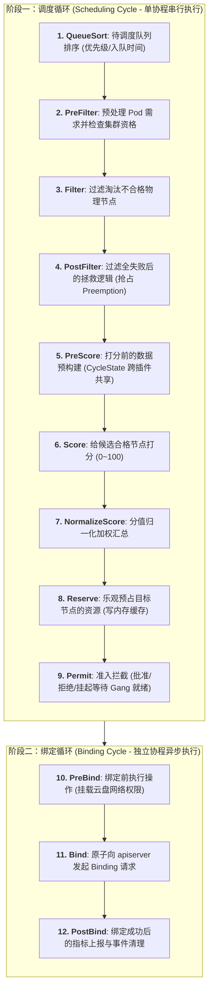
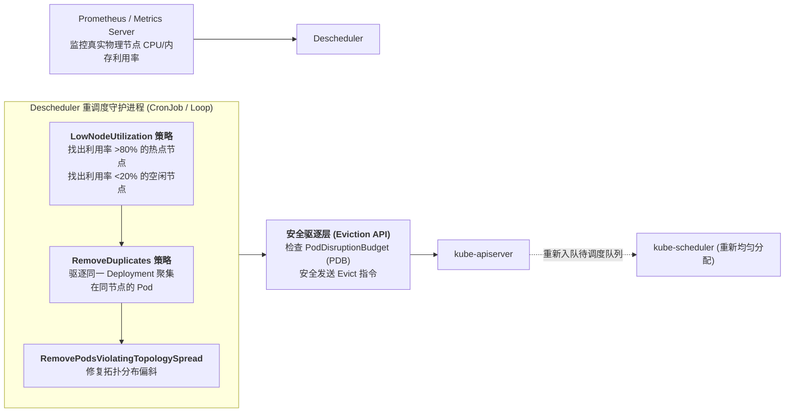

## 引言：为什么默认调度器无法满足复杂业务与 AI 智算？

在专栏的第四讲 [Kubernetes 控制平面深度解密](/articles/k8s-control-plane-declarative-reconciliation/) 中，我们分析了 `kube-scheduler` 经典的过滤（Filter）与打分（Score）双阶段算法。

对于传统的无状态 Web 微服务而言，默认调度器表现得足够出色。然而，当我们的集群开始承载**分布式 AI 大模型训练（PyTorch Distributed）、大数据批处理（Spark / Flink）或复杂跨业务拓扑**时，默认调度器的设计缺陷便暴露无遗：

1. **单 Pod 视角的“死锁深渊”（Deadlock）**：
   默认调度器是极其短视的，它**一次只评估一个 Pod**。假设有两个分布式训练任务各需要 4 张 GPU：
   - 调度器先给任务 A 分配了 2 张卡，随后把剩余 2 张卡分给了任务 B；
   - 任务 A 和任务 B 都无法凑齐 4 张卡启动训练，双方无限期霸占着各自的 2 张卡互相等待，整个集群瞬间陷入**死锁（Deadlock）**！
2. **缺乏多资源维度的公平分配能力（Fair Share）**：
   默认调度器无法感知不同租户之间 CPU、内存与 GPU 的混合比例倾斜，极易导致大任务长期饿死小任务，或者小任务碎片化占满集群关键资源。
3. **“一次性调度，终生绑定”的静态僵局**：
   调度器只在 Pod 创建的瞬间做一次决策。随着时间推移，某些节点可能因为业务内存泄漏而变成高危热点，而新扩容的空闲节点却无人问津；默认调度器永远不会主动迁移已运行的 Pod。

要解决这些深层次矛盾，平台架构师必须掌握对 Kubernetes 调度内核“动刀”的能力。

本文作为**《从 Docker 到 Kubernetes：云原生容器与集群编排架构指南》**的第九篇，将带你深入调度器源码级架构：掌握 **Scheduling Framework 插件机制**、拆解 **Volcano / DRF 主导资源公平算法**、从零编写一个生产级 **Gang Scheduling 插件**，并掌握利用 **Descheduler** 实施动态二次重平衡的绝技。

---

## 一、 Scheduling Framework 架构：11 大扩展点全景图

早期的 Kubernetes 支持通过外部 Webhook（Scheduler Extender）扩展调度，但由于每次调度决策都需要跨网络发起 HTTP JSON 调用，性能极差。

为了给调度器注入极致的扩展能力，社区在 `kube-scheduler` 内部设计了 **Scheduling Framework（调度框架）**。它将整个调度流水线细分为严格的两个大阶段与 **11 个扩展点（Extension Points）**：



### 1.1 两大周期的本质区别：
1. **调度周期 (Scheduling Cycle)**：
   必须极速执行。调度器内部为每个 Pod 串行分配一个节点，期间会加内存锁更新本地快照（NodeSnapshot）。如果插件在这里执行耗时网络 IO，整个集群的调度吞吐（Pods/s）将出现断崖式下跌。
2. **绑定周期 (Binding Cycle)**：
   允许异步并发执行。由于向 `kube-apiserver` 发起写入存在网络延迟，调度器利用独立 Go 协程异步调用 `Bind`，不阻塞下一个 Pod 的调度周期。

### 1.2 跨扩展点状态共享：CycleState
调度框架在整个周期的生命周期内传递一个线程安全的 `*framework.CycleState` 容器。
- 插件可以在 `PreFilter` 阶段计算好 Pod 的亲和性拓扑数据，通过 `state.Write("my-plugin-state", data)` 写入；
- 后续的 `Filter` 和 `Score` 扩展点通过 `state.Read("my-plugin-state")` 极速读取，**彻底避免了每个扩展点重复遍历集群带来的 $O(N^2)$ 计算浪费**。

---

## 二、 批处理核心：Volcano 架构与 DRF (主导资源公平调度) 数学原理

在面向大规模 AI 智算与弹性批处理时，很多大厂会引入基于 K8s 定制的专业调度引擎 —— **Volcano**。其核心灵魂在于 **DRF (Dominant Resource Fairness)** 算法与 **PodGroup CRD**。

### 2.1 DRF (主导资源公平调度) 数学模型
在多租户异构计算场景中，资源需求往往是多维的（CPU、内存、GPU）。DRF 的核心思想是：**“按每个租户消耗其最稀缺（主导）资源的比例进行全局均衡，确保没有任何单一租户能够霸占整个集群”**。

设集群总资源向量为 $R = \langle R_1, R_2, \dots, R_m \rangle$（如总 CPU、总 GPU）。
用户 $i$ 分配到的资源总量为 $U_i = \langle U_{i,1}, U_{i,2}, \dots, U_{i,m} \rangle$。
用户 $i$ 在第 $j$ 种资源上的使用占比为：
$$s_{i,j} = \frac{U_{i,j}}{R_j}$$

用户 $i$ 的**主导资源份额（Dominant Share）**定义为其在所有资源维度中的最大占比：
$$s_i^* = \max_{j=1}^m \{ s_{i,j} \}$$

**Volcano 调度策略**：在每一轮调度出队时，**永远优先调度当前主导份额 $s_i^*$ 最小的用户**！

```text
DRF 调度实例分析:
集群总算力: 100 CPU, 100 GPU
• 用户 A 每个任务申请: 2 CPU + 1 GPU
  主导资源: CPU (2/100 = 2% > GPU 1/100 = 1%)
• 用户 B 每个任务申请: 1 CPU + 2 GPU
  主导资源: GPU (2/100 = 2% > CPU 1/100 = 1%)

调度器轮流给 A 分配一个任务、给 B 分配一个任务:
当 A 和 B 各运行 33 个任务时，A 消耗 66 CPU + 33 GPU，B 消耗 33 CPU + 66 GPU；
双方的主导份额均为 66%，集群资源利用率达到完美的 99%，双方均无怨言！
```

---

## 三、 实战定制：编写一个 Gang Scheduling (成组调度) 插件

分布式训练的核心诉求是 **“All-or-Nothing”**：一个任务的所有 $N$ 个 Worker 必须全部找到宿主节点，才被允许同时启动；只要有 1 个无法调度，所有已占用的资源必须立刻全部退回。

在 Scheduling Framework 中，实现 Gang Scheduling 的最优雅位置就是 **`Permit` 扩展点**，配合 **`Reserve / Unreserve` 回滚机制**。

### 3.1 自定义 Permit 插件 Go 完整代码实现

```go
package gang

import (
    "context"
    "fmt"
    "sync"
    "time"

    v1 "k8s.io/api/core/v1"
    "k8s.io/apimachinery/pkg/runtime"
    "k8s.io/kubernetes/pkg/scheduler/framework"
)

const PluginName = "CustomGangScheduling"

// GangPlugin 维护集群中所有任务组的就绪状态
type GangPlugin struct {
    handle framework.Handle
    mu     sync.Mutex
    // 记录每个任务组已经到达 Permit 阶段的 Pod 集合
    gangTable map[string]*GangGroup
}

type GangGroup struct {
    MinAvailable int
    WaitingPods  []string
}

var _ framework.PermitPlugin = &GangPlugin{}
var _ framework.ReservePlugin = &GangPlugin{}

func New(_ runtime.Object, h framework.Handle) (framework.Plugin, error) {
    return &GangPlugin{
        handle:    h,
        gangTable: make(map[string]*GangGroup),
    }, nil
}

func (gp *GangPlugin) Name() string {
    return PluginName
}

// Reserve 扩展点: 记录预占资源
func (gp *GangPlugin) Reserve(ctx context.Context, state *framework.CycleState, p *v1.Pod, nodeName string) *framework.Status {
    return framework.NewStatus(framework.Success)
}

// Unreserve 扩展点: 当某 Pod 调度超时或失败时触发原子回滚
func (gp *GangPlugin) Unreserve(ctx context.Context, state *framework.CycleState, p *v1.Pod, nodeName string) {
    gangName, exists := p.Labels["gang.example.com/name"]
    if !exists {
        return
    }

    gp.mu.Lock()
    defer gp.mu.Unlock()

    if group, ok := gp.gangTable[gangName]; ok {
        // 组内有成员失败，通知所有仍在等待的同组 Pod 放弃等待，避免死锁
        for _, podName := range group.WaitingPods {
            gp.handle.IterateOverWaitingPods(func(waitingPod framework.WaitingPod) {
                if waitingPod.GetPod().Name == podName {
                    waitingPod.Reject(PluginName, "Gang member unreserved or timed out")
                }
            })
        }
        delete(gp.gangTable, gangName)
    }
}

// Permit 在节点预占 (Reserve) 之后执行，决定该 Pod 是否可以进入绑定周期
func (gp *GangPlugin) Permit(ctx context.Context, state *framework.CycleState, p *v1.Pod, nodeName string) (*framework.Status, time.Duration) {
    gangName, exists := p.Labels["gang.example.com/name"]
    if !exists {
        // 普通 Pod，不参与 Gang 调度，直接放行
        return framework.NewStatus(framework.Success), 0
    }

    minAvailable := getMinAvailable(p) // 从 annotation 中获取最少副本数，例如 4

    gp.mu.Lock()
    defer gp.mu.Unlock()

    group, exists := gp.gangTable[gangName]
    if !exists {
        group = &GangGroup{
            MinAvailable: minAvailable,
            WaitingPods:  make([]string, 0),
        }
        gp.gangTable[gangName] = group
    }

    group.WaitingPods = append(group.WaitingPods, p.Name)

    // 检查当前任务组是否已经全员到齐？
    if len(group.WaitingPods) >= group.MinAvailable {
        // 全员到齐！唤醒之前所有处于挂起等待状态的同组 Pod
        for _, podName := range group.WaitingPods {
            gp.handle.IterateOverWaitingPods(func(waitingPod framework.WaitingPod) {
                if waitingPod.GetPod().Name == podName {
                    waitingPod.Allow(PluginName) // 批准进入 Binding Cycle!
                }
            })
        }
        delete(gp.gangTable, gangName) // 清理状态
        return framework.NewStatus(framework.Success), 0
    }

    // 人数未凑齐：将当前 Pod 挂起，最长等待 60 秒
    timeout := 60 * time.Second
    return framework.NewStatus(framework.Wait, fmt.Sprintf("Waiting for gang %s to complete", gangName)), timeout
}
```

---

## 四、 动态二次平衡：生产级 Descheduler 重调度架构

调度器在初始时刻的决策往往是局部的、静态的。运行数周后，生产集群不可避免地会遭遇以下碎片化现象：
- **热点聚集**：某个物理节点上的业务实际 CPU 利用率飙升到了 95%，机器频频告警；而新加入集群的 3 台机器利用率只有 5%；
- **污点与亲和性失效**：节点被运维打上了新的标签或污点（Taint），但已经在上面运行的 Pod 依旧赖着不走。

为了打破“一次调度，终身锁定”的局限，Kubernetes 官方推出了 **Descheduler（重调度器）**。



### 4.1 核心策略：`LowNodeUtilization` (基于真实负载的重平衡)
```yaml
apiVersion: "descheduler/v1alpha2"
kind: "DeschedulerPolicy"
profiles:
- name: profile-rebalance
  pluginConfig:
  - name: "LowNodeUtilization"
    args:
      thresholds:
        "cpu": 20
        "memory": 20
      targetThresholds:
        "cpu": 70
        "memory": 70
```
- **工作机理**：Descheduler 定期扫描全集群。当发现某些节点的实际利用率超过目标阈值（70%），而另一些节点低于利用率阈值（20%）时，它会自动挑选高负载节点上的 Pod 发起驱逐。

### 4.2 生产级防震荡与 PDB 保护
为了防止 Descheduler 把同一个 Pod 在两个节点之间反复踢皮球（Ping-Pong 震荡）：
1. 配置 `maxNoOfPodsToEvictPerNode: 3`：限制每次单节点最多只驱逐 3 个 Pod，平滑渐进式泄压；
2. 强制调用 **Eviction API (`/pods/{name}/eviction`)** 并严格遵循 **PDB (PodDisruptionBudget)**；如果业务当前副本数正好达到 `minAvailable` 下限，驱逐动作被立即安全阻断，**确保线上高可用不被打扰！**

---

## 五、 总结与进阶预告

对 Kubernetes 调度器动刀，标志着平台工程从“使用者”向“掌控者”的关键蜕变：
- **Scheduling Framework** 以高度正交的 11 大扩展点与 `CycleState` 共享容器，让我们可以在不用 Fork 维护官方代码库的前提下，以原生插件方式注入极致的调度智力；
- **Volcano 与 DRF** 用严密的数学模型解决了多维异构资源环境下的主导资源公平调度难题；
- **Gang Scheduling** 解决了分布式训练全员成组调度的死锁痛点；
- **Descheduler** 打破了静态绑定的魔咒，通过运行时的负反馈驱逐赋予了集群自我平衡的流动生命力。

然而，仅仅改造调度控制面，仍不足以应对最底层的执行挑战：
- 在物理工作节点（Worker Node）上，容器是如何被拉起并绑定到特定 CPU 核心的？
- 传统的 `runc` 共享宿主机内核，在多租户运行不受信任的第三方代码时存在极高的逃逸风险。我们如何动用 **NRI（Node Resource Interface）**、**Kata Containers**（轻量级微虚拟机）与 **gVisor**（用户态内核沙箱）对节点运行时实施硬核加固？
- 容器的 Linux 内核参数（Sysctl）究竟该如何在安全与高并发之间找到最佳平衡？

在接下来的**专栏第十讲**中，我们将全面杀入 Worker 节点底层 —— **[对 K8s 节点与运行时动刀：NRI 节点资源接口插件、Kata/gVisor 多安全沙箱运行时与容器内核参数隔离](/articles/k8s-runtime-nri-kata-gvisor-kernel-tuning/)**！

---

## 常见问题 (FAQ)

### Q1: 在 Scheduling Framework 中，为什么说 Scheduling Cycle 和 Binding Cycle 的区分是极其关键的架构设计？
**根本原因：兼顾算法准确性与调度高吞吐**。
- **Scheduling Cycle 必须是轻量同步的**：在此阶段，调度器需要基于节点当前的资源快照（NodeSnapshot）做出分配决策并更新内存预占（Reserve）。如果允许多个协程在此并发执行，极易发生“两个 Pod 同时抢占同一台宿主机的剩余 CPU”的并发冲突；
- **Binding Cycle 是异步解耦的**：Binding 过程涉及向 `kube-apiserver` 发送 HTTP 请求并等待 etcd 写入完成，网络耗时相对漫长。将 Binding 移到独立协程异步执行，使得调度主线程可以在几十微秒内立刻开始调度下一个 Pod，从而将调度器的吞吐能力维持在数千 Pods/秒的极高水平。

### Q2: 什么是 DRF (Dominant Resource Fairness) 调度算法？它如何解决 GPU 与 CPU 混合集群的资源分配倾斜？
DRF 是一种经典的异构多资源博弈公平分配算法。在传统单一资源调度中，我们只能按 CPU 数量做轮询，这在包含 GPU、内存的多维环境中会彻底失效（例如一个任务只占 1 个 CPU 却霸占了 8 张 GPU）。
DRF 将每个租户所占用的各类资源除以集群对应总容量，计算出该租户的“主导资源（最大占比维度）”。调度器在每轮调度时，永远挑选当前“主导份额”最小的用户分配资源。通过数学证明，DRF 具备帕累托最优（Pareto Efficiency）、共享激励（Sharing Incentive）和防策略操纵（Strategy-Proofness）三大黄金博弈特性，彻底终结了跨维度的算力争抢。

### Q3: 编写自定义调度器插件时，是推荐编译进同一个调度器二进制，还是作为独立的 Secondary Scheduler 部署？
**生产推荐：编译为统一定制二进制或利用 Scheduling Framework 官方脚手架**。
虽然 Kubernetes 支持在一个集群中同时运行多个调度器（通过 Pod 的 `spec.schedulerName` 路由），但**多调度器架构在并发调度时存在严重的内存状态不一致风险**：
两个独立的调度器各自维护一套本地节点快照，极易在同一时刻把两个不同的 Pod 调度到同一台只有单卡剩余的宿主机上，导致其中一个 Pod 在 Kubelet 节点端被拒绝并报错。
**最佳实践**：使用官方的 `scheduler-plugins` 仓库，将自定义插件以扩展库的方式编译进单一的统一调度器中，确保全局资源决策树的原子唯一性。
