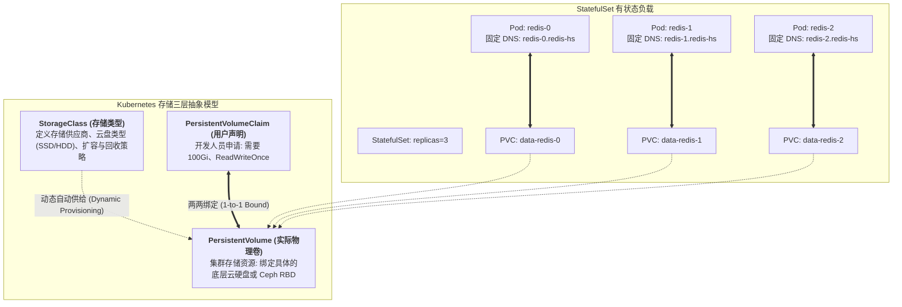
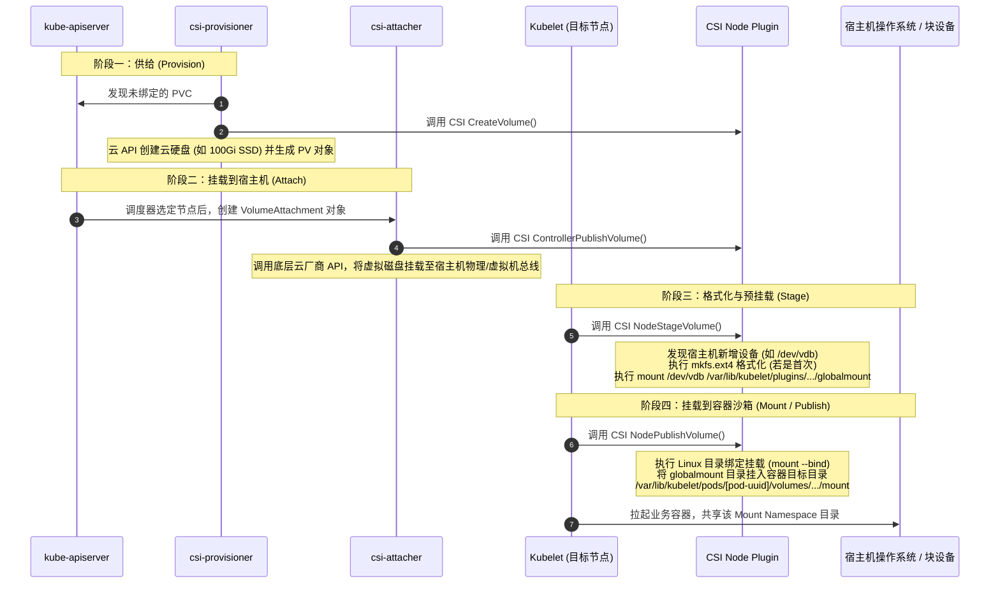

## 引言：打破“容器只能跑无状态应用”的桎梏

在云原生初期，“容器是短暂易逝的（Ephemeral）”理念深入人心。正如我们在专栏第一讲 [Docker 内核第一性原理](/articles/docker-internals-namespace-cgroups-overlayfs/) 中分析的，容器底层的 OverlayFS 写时复制层在容器销毁时会被一并抹去。

因此，在很长一段时间里，工程师们达成了心照不宣的默契：**Kubernetes 只适合运行无状态（Stateless）的 Web API 与微服务；而数据库（MySQL、PostgreSQL）、分布式缓存（Redis）与流式消息队列（Kafka），必须留在物理机或传统云主机上独立维护**。

然而，企业级系统不可能永远只有无状态算力：
- 随着微服务架构的裂变，数以百计的独立研发团队需要自主管理轻量级数据库实例；
- 如果每一套数据库都需要单独找运维申请物理机、手动分配存储卷并配置静态 IP，云原生架构宣称的“敏捷自动化”便成了一句空话。

为了征服这块最难啃的硬骨头，Kubernetes 团队设计了一整套精巧绝伦的有状态编排体系：**CSI 存储插件解耦**、**PV/PVC 动态生命周期管理**，以及赋予分布式工作负载铁律般拓扑秩序的 **StatefulSet 控制器**。



本文作为**《从 Docker 到 Kubernetes：云原生容器与集群编排架构指南》**的第六篇，将带你彻底攻克 Kubernetes 存储深水区：解构 CSI 插件的四阶段底层调用链、揭秘 StatefulSet 拓扑保证机理，并剖析生产环境中各类经典的存储故障避坑指南。

---

## 一、 存储解耦演进：从 In-Tree 到 CSI 工业规范

在早期 Kubernetes 源码中，所有云厂商的存储卷插件（AWS EBS、GCE PD、Azure Disk、Ceph、GlusterFS 等）全部直接编写在核心仓库 `k8s.io/kubernetes` 内部。

这种被称为 **In-Tree** 的架构带来了灾难性的工程灾难：
1. **发布周期被绑架**：存储供应商修一个微小的驱动 Bug，必须苦等 Kubernetes 发行版发版（通常长达 3~4 个月）；
2. **代码膨胀与特权安全漏洞**：核心 Kubernetes 二进制文件体积剧增，且第三方驱动代码在核心组件中运行，极易引发内存泄漏与权限逃逸。

为了实现彻底的松耦合，Kubernetes 社区联合 Mesos、Cloud Foundry 制定了统一的 **CSI（Container Storage Interface，容器存储接口）** 规范。从 Kubernetes 1.20+ 开始，所有 In-Tree 插件已被全面弃用，全面迁移至基于 gRPC 的 **Out-of-Tree CSI 插件架构**：

```text
CSI 插件控制与数据面分离架构:
┌──────────────────────────────────────────────────────────────┐
│ 控制平面 (CSI Controller Sidecars - Deployment)               │
│  ├── csi-provisioner : 监听 PVC，调用 CreateVolume/DeleteVolume│
│  ├── csi-attacher    : 监听 VolumeAttachment，调用 Attach/Detach│
│  ├── csi-resizer     : 监听扩容事件，调用 ControllerExpandVolume│
│  └── csi-snapshotter : 监听卷快照，调用 CreateSnapshot       │
└──────────────────────────────────────────────────────────────┘
                               │ gRPC (UNIX Domain Socket)
┌──────────────────────────────▼───────────────────────────────┐
│ CSI Driver Binary (存储厂商独立开发与发布)                     │
└──────────────────────────────────────────────────────────────┘
                               ▲ gRPC (UNIX Domain Socket)
┌──────────────────────────────┴───────────────────────────────┐
│ 数据节点 (CSI Node Plugin - DaemonSet)                       │
│  ├── node-driver-registrar: 向 Kubelet 注册本节点 CSI 驱动能力 │
│  └── csi-driver container : 执行 NodeStageVolume & NodePublish │
└──────────────────────────────────────────────────────────────┘
```

---

## 二、 卷挂载的四阶段生命周期与底层 Linux 挂载机理

当用户创建一个挂载了 PVC 的 Pod 时，物理块设备或网络文件系统究竟是如何一步步安全“穿透”并最终挂载到容器内部指定目录的？

整个流程必须严格经历四个阶段：**供给 (Provision) $\to$ 挂载至主机 (Attach) $\to$ 格式化与预挂载 (Stage) $\to$ 容器目录绑定 (Mount / Publish)**。



### 1. 供给阶段 (Provisioning)
- `csi-provisioner` sidecar 监听到新建的 PVC，检查其关联的 `StorageClass`；
- 调用存储厂商 API 动态分配底层物理存储（如 AWS 创建 EBS、阿里云创建云盘，或 Ceph 创建 RBD 镜像），并在 Kubernetes 中自动创建一个与其绑定的 `PersistentVolume (PV)`。

### 2. 挂载至宿主机阶段 (Attach)
- 调度器决定了该 Pod 运行在 `node-1` 上后，`kube-controller-manager` 中的 `attach-detach-controller` 创建 `VolumeAttachment` 资源；
- `csi-attacher` 监听到此事件，调用底层云厂商控制面 API，将这块云硬盘作为虚拟块设备挂载到 `node-1` 的宿主机操作系统总线上（等价于将一块硬盘插入主机的 SATA/NVMe 接口）。

### 3. 格式化与分阶段预挂载 (Stage)
- 目标节点上的 `Kubelet` 负责后续动作。Kubelet 侦测到物理块设备已附加（如 `/dev/vdb`），调用本地 CSI Node 插件的 `NodeStageVolume` 接口；
- CSI 驱动检查该设备是否已有文件系统，若为空则执行格式化（如 `mkfs.ext4` 或 `mkfs.xfs`）；
- 紧接着，驱动将该块设备挂载到该节点全局的“预挂载临时目录”（Global Directory，通常在 `/var/lib/kubelet/plugins/kubernetes.io/csi/...`）。

### 4. 容器目录绑定挂载 (Mount / Publish)
- Kubelet 调用 CSI Node 插件的 `NodePublishVolume` 接口；
- CSI 驱动执行经典的 Linux `mount --bind` 命令，将上一步中的全局预挂载目录，直接映射绑定到该 Pod 专属的私有挂载路径（`/var/lib/kubelet/pods/<pod-uuid>/volumes/kubernetes.io~csi/<pv-name>/mount`）；
- 最终，当容器被 containerd 拉起时，通过 Linux Mount Namespace 隔离机制，容器内的进程便能像访问本地普通目录一样高速读写该持久化卷！

---

## 三、 StatefulSet 的三大拓扑铁律

对于有状态数据库而言，光有 PVC 还远远不够。传统的 `Deployment` 控制器对待 Pod 的态度是“视如草芥（Cattle）”：Pod 名称带有随机哈希字符（如 `web-786d795b58-p4j2k`），并发创建并发销毁，且所有 Pod 只能共享或者临时挂载相同的卷。

如果用 Deployment 去跑 MySQL 主从架构或 Kafka 集群，集群重启后各个节点身份全乱，数据卷错配，主从拓扑将瞬间崩溃！

**`StatefulSet`** 专为有状态集群而生，它对待 Pod 的态度是“悉心呵护（Pets）”，并在底层提供三项不可动摇的拓扑铁律：

```text
StatefulSet 的确定性拓扑保证:
1. 确定性顺序命名:
   redis-0 (Ordinal 0) ──► redis-1 (Ordinal 1) ──► redis-2 (Ordinal 2)

2. 严格有序的启动与停止:
   扩容顺序: 0 启动就绪 ──► 1 启动就绪 ──► 2 启动就绪
   缩容顺序: 2 安全退出 ──► 1 安全退出 ──► 0 安全退出

3. 独占独立的 PVC 模板绑定 (volumeClaimTemplates):
   redis-0 ──► 绑定 PVC: data-redis-0 ──► 独占 PV 0 (数据不可篡改)
   redis-1 ──► 绑定 PVC: data-redis-1 ──► 独占 PV 1
   redis-2 ──► 绑定 PVC: data-redis-2 ──► 独占 PV 2
```

### 1. 唯一且稳定的网络身份 (Headless Service)
StatefulSet 必须搭配一个 `clusterIP: None` 的 **Headless Service（无头服务）** 协同工作。
- CoreDNS 会为每一个 Pod 实例生成确定性的内部域名：
  $$\text{<pod-name>}.\text{<service-name>}.\text{<namespace>}.\text{svc}.\text{cluster}.\text{local}$$
  例如：`redis-0.redis-service.default.svc.cluster.local`；
- 无论物理节点如何宕机重启，`redis-0` 永远代表主节点域名，`redis-1` 永远代表从节点域名，客户端与其他节点永远可以通过该静态域名定位到它！

### 2. 有序平滑的生命周期 (Ordered Lifecycle)
- **扩容与创建**：Pod 严格按照序号从 $0$ 到 $N-1$ 依次创建。只有当 `redis-0` 的就绪探针（Readiness Probe）变为 `Ready` 状态后，控制器才会开始拉起 `redis-1`；
- **缩容与销毁**：严格按照逆序从 $N-1$ 到 $0$ 依次关停。只有当 `redis-2` 彻底从数据面注销并安全退出后，控制器才会停止 `redis-1`，坚决杜绝因并发关停导致的主从脑裂与法定人数丢失。

### 3. 数据绑定的专属性 (volumeClaimTemplates)
StatefulSet 支持 `volumeClaimTemplates`（卷申请模板）：
- 当声明 3 个副本时，控制器会自动派生出 3 个带序号的独立 PVC（如 `data-redis-0`、`data-redis-1`、`data-redis-2`）；
- **核心容灾机制**：如果宿主机发生故障，`redis-0` 在另一台物理机上漂移重建，**新的 `redis-0` 会重新挂载完全属于它的旧 `data-redis-0` 存储卷**，确保数据库的历史 Binlog 与数据文件完好无损！

---

## 四、 生产存储踩坑血泪史与防坑指南

在生产环境中维护 Kubernetes 有状态存储时，稍有不慎就会导致严重生产事故。以下是经过实战验证的黄金法则：

### 1. 经典故障：`Multi-Attach error for volume` 导致 Pod 卡死
- **现象**：物理节点 Node A 异常断电，Kubelet 失联。调度器在 Node B 上拉起新的 Pod，但 Pod 长期卡在 `ContainerCreating`，事件报错：`Multi-Attach error for volume pvc-xxx. Volume is already exclusively attached to node Node A`；
- **根因**：多数云厂商的块存储（如 AWS EBS 或普通云盘）在物理层面只支持 **ReadWriteOnce (RWO)**，即同一时间只能挂载到一台宿主机。由于 Node A 突然失联，底层云控制台依然认为这块盘附加在 Node A 上；为了防止两台主机同时写入同一块盘导致文件系统元数据损坏，CSI 强制拒绝挂载；
- **排障方案**：
  1. 绝不能盲目执行 `kubectl delete pod --force --grace-period=0`！这会导致 Pod 从 etcd 中抹去，但底层卷锁依然残留；
  2. 应当排查并确认 Node A 彻底关机（Fencing），等待 `attach-detach-controller` 超时自动触发强制卸载，或手动在云控制台安全分离旧卷。

### 2. 多可用区（Multi-AZ）拓扑陷阱：`volumeBindingMode: WaitForFirstConsumer`
- **现象**：新创建的 PVC 瞬间被 Provision 出来，但是 Pod 却永远无法调度（`1 node had volume node affinity conflict`）；
- **根因**：在默认的 `volumeBindingMode: Immediate` 模式下，用户一提交 PVC，CSI 就立刻去云端创建云盘。此时调度器根本还没运行，CSI 随机在 `Zone-A` 创建了云盘；等到 Pod 调度时，由于集群在 `Zone-B` 才有充裕的 CPU/内存资源，调度器试图将 Pod 放去 `Zone-B`，结果发现跨可用区无法挂载 `Zone-A` 的云硬盘！
- **黄金法则**：在所有多可用区生产集群中，**必须将 StorageClass 的 `volumeBindingMode` 设置为 `WaitForFirstConsumer`**。让调度器先决定 Pod 落在哪个可用区，再就近在同一个可用区动态创建云硬盘！

---

## 五、 总结与进阶预告

Kubernetes 存储架构将看似不可调和的矛盾统一在了一起：
- **CSI 规范** 以干净的 gRPC 边界，使底层存储生态能够与 Kubernetes 核心版本解耦独立进化；
- **动态供给与四阶段挂载**，将复杂的物理硬件挂载、格式化与 Linux Bind-Mount 流程封装为高度可靠的自动化状态流；
- **StatefulSet** 筑起了坚固的拓扑防线，使得分布式有状态集群能够在云原生动态环境中具备坚如磐石的确定性。

然而，单纯掌握了底层的网络与存储抽象，距离成功运行高可用业务系统仍有巨大的鸿沟：
- 为什么在 K8s 上运行微服务时，传统的 gRPC 长连接会使得 kube-proxy 的四层负载均衡彻底失效？
- 为什么每次执行滚动发布时，前端网关总会出现短暂的 502 错误或 Connection Reset 报错？
- 容器内的进程下线与 Kubernetes 的网络 Endpoint 切除之间，究竟存在怎样惊心动魄的时序竞态？

在接下来的**专栏第七讲**中，我们将正式进入真实业务软件的云原生通信深水区 —— **[业务软件在 K8s 上的网络架构实战：gRPC 长连接负载均衡陷阱、Service Mesh 与零停机平滑切流时序](/articles/k8s-application-networking-grpc-service-mesh-zero-downtime/)**！

---

## 常见问题 (FAQ)

### Q1: 当一个节点发生硬件故障断电后，为什么 StatefulSet 上的 Pod 不会自动在其他节点重建？为什么会处于 Terminating 状态卡死？
**根本原因：防止分布式脑裂（Split-Brain）与数据静默破坏**。
如果 Kubernetes 在节点失联后立刻在其他节点启动带有相同身份的 `redis-0`，而原节点可能只是短暂网络分区（它上面的进程还在继续写入磁盘），就会产生两个 `redis-0` 同时对外写入的严重灾难！
因此，Kubernetes 默认采用保守的安全设计：当节点未被显式确认死亡前，系统绝不会自动漂移有状态 Pod。
**处理方式**：运维人员在物理层面确认故障节点彻底关机或下线后，通过安全节点排空（`kubectl drain`）或手动移除故障节点对象，控制平面才会安全地在健康节点上重新拉起有状态 Pod。

### Q2: 为什么在删除一个 StatefulSet 及其 Pod 时，Kubernetes 会故意保留其关联的 PVC 和 PV，而不是随之一同删除？
**这是 Kubernetes 刻意为之的最高级别数据安全防护**。
Pod 是计算实例，销毁代价极低；但 PVC 中存放的是极其宝贵的企业生产数据。
如果允许 `kubectl delete statefulset` 级联删除底层的数据卷，操作人员的一次手滑输入就可能导致数百 GB 甚至数 TB 的生产核心数据库物理灭失，且无法撤销！
因此，Kubernetes 强制要求：PVC 的生命周期必须与 StatefulSet 解耦。若确实需要清理数据，必须由管理员显式、独立地执行 `kubectl delete pvc <pvc-name>`。

### Q3: PersistentVolume 的 `persistentVolumeReclaimPolicy` 设置为 `Retain` 和 `Delete` 有何本质区别？生产中如何选择？
- **`Delete` 模式**：当对应的 PVC 被物理删除后，绑定的 PV 会被自动删除，且底层云厂商的物理块设备（如云盘）也会被立刻物理销毁。
- **`Retain` 模式**：当 PVC 被删除后，底层 PV 不会被销毁，而是转为 `Released`（已释放）保留状态，底层的物理磁盘数据毫发无损，防止误删。但此时其他 PVC 也无法直接复用该卷，需要管理员手动提取数据或格式化后重新标记可用。
- **生产推荐**：对于重要的生产核心数据库（MySQL, Mongo, PG），**强烈建议将 StorageClass 的回收策略配置为 `Retain`**，作为防止误操作导致物理数据灭失的最后一道安全护城河。
