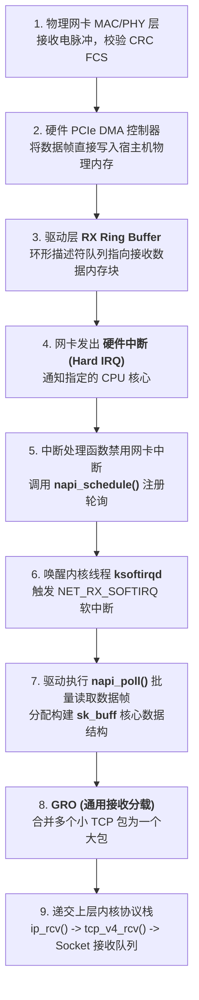
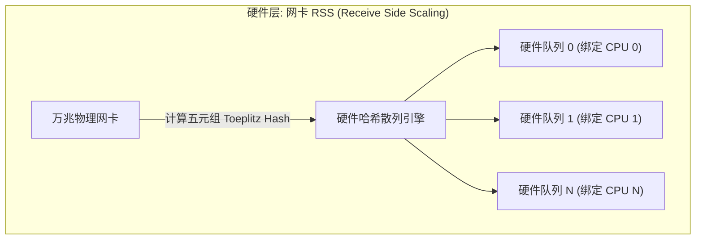
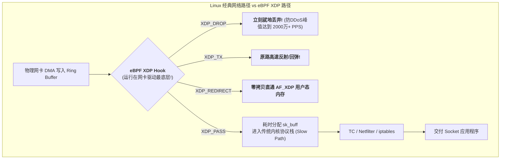

## 引言：解构操作系统的网络生命线

在前面的章节中，我们推导了局域网二层交换、三层 IP 寻址、VLAN/NAT 基建，以及 DNS 与 TCP/UDP 传输层的核心原理。

然而，在日常开发和高并发系统设计中，很多工程师往往把操作系统视作一个黑盒：
- 以为网卡收到数据包后，直接“推”给了应用程序；
- 当服务器遭受数百万 QPS 的高并发冲击时，CPU 的 `si`（软中断，Softirq）飙升至 100%，系统响应剧烈卡死，却不知道问题出在哪里；
- 面对数万兆网卡，传统的内核协议栈为什么会成为算力瓶颈？现代云原生与高频交易系统又是如何利用 **eBPF XDP** 在驱动层实现千万级包转发（Mpps）的？

本文作为**《深入浅出计算机网络》的第七讲**，将带你彻底穿透 Linux 操作系统的内核网络子系统：从 **物理网卡 Ring Buffer**、**硬中断到 NAPI 软中断轮询**，再到 **`sk_buff` 内存拓扑** 与 **eBPF XDP 极速转发架构**。

---

## 一、 Linux 内核收包全流程：从电光信号到 `sk_buff`

当一根网线或光纤中的物理脉冲抵达主机的以太网卡时，Linux 操作系统经历了一场精密严谨的接力赛跑：



### 1.1 网卡硬件与 RX Ring Buffer（环形缓冲区）
1. **Ring Buffer 本质**：它是网卡驱动在宿主机物理内存（DRAM）中预分配的一个**固定长度的环形数组**；
2. **描述符（Descriptor）**：Ring Buffer 里的槽位并不直接存数据包本体，而是存储指向真实数据内存地址（DMA Buffer）的指针与状态标志；
3. **零 CPU 拷贝（PCIe DMA）**：网卡收到数据后，网卡硬件控制器直接通过 PCIe 总线将数据写入 DMA 内存，**全程不需要主机 CPU 介入搬运！**

### 1.2 NAPI（New API）机制：为什么抛弃纯中断？
在早期的 Linux 内核中，网卡每收到一个数据包，就向 CPU 发送一次硬件中断（Pure Interrupt-Driven）。
- **中断风暴（Interrupt Storm）灾难**：在 10Gbps 或 100Gbps 高速网络中，每秒可能涌入几千万个小包。CPU 将把 100% 的时钟周期全部浪费在响应中断上下文切换上，导致操作系统瞬间冻结崩盘！
- **NAPI 混合机制（中断 + 轮询）**：
  1. 第一个数据包到来，触发**一次硬件中断**；
  2. CPU 响应中断后，**立刻关闭网卡的硬件中断**；
  3. 将网卡挂入 CPU 的轮询队列，唤醒软中断守护进程 `ksoftirqd`；
  4. `ksoftirqd` 开启批处理轮询（每次批量抓取 `weight` 个数据包，默认 64 个），持续清空 Ring Buffer；
  5. 只有当 Ring Buffer 里的数据全部处理完毕时，才**重新开启网卡硬件中断**。
  **这一设计彻底消灭了高并发下的中断雪崩！**

---

## 二、 内核神级数据结构：`sk_buff`（套接字缓冲区）

在 Linux 内核网络世界中，最核心、最庞大的数据结构就是 **`struct sk_buff`（简称 skb）**。从网卡驱动层一直到用户态套接字，数据包全程由它承载。

```
sk_buff 的核心指针拓扑 (零内存拷贝设计):
+-------------------------------------------------------------+
| struct sk_buff (元数据控制块)                                |
|   head  -------------------------\                          |
|   data  ------------------\      |                          |
|   tail  ------------\     |      |                          |
|   end   -----\      |     |      |                          |
+--------------|------|-----|------|--------------------------+
               |      |     |      |
               v      v     v      v
      +--------+------+-----+------+--------------------------+
      | 空闲预留区    | 报头 | 真实载荷 | 空闲尾部区             |
      +---------------+-----+------+--------------------------+
      ^               ^     ^      ^
      head            data  tail   end
```

### 2.1 零拷贝报头剥离与压入：`skb_push` 与 `skb_pull`
在网络分层模型中，数据包穿透各层协议时需要不断添加或剥离报头：
- **发送数据（封包）**：内核调用 `skb_push(skb, len)`，只需要简单地将 `data` 指针**向左移动**指定字节，并在腾出的空间里直接写入 TCP 头或 IP 头，**完全不需要重新分配内存或拷贝数据！**
- **接收数据（解包）**：内核调用 `skb_pull(skb, len)`，只需要将 `data` 指针**向右移动**对应报头长度，即可把控制权安全交给上层协议。

---

## 三、 多核 CPU 扩展：RSS、RPS 与 RFS

现代服务器拥有 64 核甚至 128 核 CPU。如何让数千万 QPS 的网络流量均匀散列在所有 CPU 核心上，而不是把 CPU 0 单核活活累死？



1. **RSS（硬件网卡多队列，Receive Side Scaling）**：
   网卡硬件支持多个独立的 RX/TX Ring Buffer。网卡 ASIC 计算数据包五元组哈希，将不同的 TCP 流直接硬分流到不同的硬件队列中，分别向不同的 CPU 触发独立中断；
2. **RPS（软件数据包重定向，Receive Packet Steering）**：
   若老旧网卡只有单队列，Linux 内核通过 RPS 机制，用软件模拟将单队列的数据包软中断散列到多个 CPU 核心上；
3. **RFS（接收流转向，Receive Flow Steering）**：
   与 CPU 缓存亲和性结合。RFS 能感知某个 Socket 的用户进程当前正在哪个 CPU 核心上运行，并**强制将该 Socket 的软中断也调度在同一个 CPU 核心执行**，使 CPU L1/L2 缓存命中率达到极致！

---

## 四、 突破内核天花板：eBPF 与 XDP 极速转发革命

即使经过了 NAPI 和多队列优化，**传统的 Linux 内核网络协议栈在超大规模场景下依然显得太重了**：
- 一个数据包进入传统协议栈，必须经历内存分配 `alloc_skb()`、元数据初始化、路由查表、iptables netfilter 过滤……处理一个包至少消耗数百纳秒；
- 在 40Gbps / 100Gbps 满线速下，单机每秒需要处理数千万个数据包（Mpps）。传统的 `ksoftirqd` 软中断会被瞬间打爆！

为了打破这一僵局，Linux 内核在 4.8 引入了颠覆性的黑科技 —— **XDP（eXpress Data Path）**。



### 4.1 XDP 的第一性原理：在 `sk_buff` 分配之前就截胡！
- **执行节点极度靠前**：XDP 程序是运行在内核虚拟机中的安全 eBPF 字节码，它直接挂载在**网卡驱动刚从 DMA 读取数据帧的第一微秒**；
- **零 `sk_buff` 内存开销**：在 XDP 处理阶段，内核**尚未分配昂贵的 `sk_buff`，尚未触发软中断**，数据包只是物理内存中的一段原始裸字节；
- **极致的性能飞跃**：单台普通 x86 服务器运行 XDP 过滤程序，单核能够轻松跑出 **每秒 2400 万数据包（24 Mpps）** 的过滤处理性能，彻底改写了防 DDoS 与高性能四层负载均衡（如 Cloudflare / Meta Katran）的工程格局！

---

## 五、 生产级内核网络调优与排查实战

```bash
# 1. 查询物理网卡当前 Ring Buffer 大小与最大支持上限
ethtool -g eth0
# 扩容 Ring Buffer 到硬件最大值 (防止高并发突发丢包):
# ethtool -G eth0 rx 4096 tx 4096

# 2. 查询并调整网卡硬件多队列数量
ethtool -l eth0

# 3. 实时监控软中断分布 (观察各 CPU 核心 NET_RX 分布是否均衡)
watch -n 1 "cat /proc/softirqs | grep NET_RX"

# 4. 查看网卡底层丢包与微突发溢出计数器
ethtool -S eth0 | grep -E "drop|miss|over|err"

# 5. 查看当前网卡是否挂载了 eBPF XDP 程序
ip link show eth0
```

---

## 六、 总结与进阶预告

Linux 内核网络子系统是现代高性能服务器的大脑与心脏：
- **Ring Buffer 与 DMA** 实现了数据在物理网卡与系统内存之间的零 CPU 拷贝搬运；
- **NAPI 机制** 通过中断与软中断轮询的动态切换，挽救了高并发下的 CPU 中断雪崩；
- **`sk_buff` 的指针拓扑** 保证了协议栈在跨层封装时零内存搬迁；
- **RSS/RFS** 实现了流量在多核 CPU 间的完美亲和散列；
- **eBPF XDP** 在驱动最底层截胡，将单机包转发性能推向了千万级 PPS 的新巅峰。

然而，无论我们把单台 Linux 服务器的内核协议栈优化得多么极限，当成千上万台服务器被部署进现代大型数据中心时：
- 传统以太网基于生成树协议（STP）的“接入-汇聚-核心”三层网络，在东西向流量爆发时瞬间被汇聚层掐死；
- 现代云数据中心是如何用 **Clos 架构与 2-Tier / 3-Tier Leaf-Spine** 拓扑彻底打破传统三层瓶颈的？
- 在云原生多租户大二层网络中，**BGP Underlay、VXLAN 与 EVPN** 又是如何协同编排海量虚拟机与容器漂移的？

在接下来的**专栏第八讲**中，我们将全面踏入现代大型智算数据中心的物理架构殿堂 —— **[现代数据中心网络架构第一性原理：Clos 拓扑、Leaf-Spine 组网、BGP Underlay 与 EVPN-VXLAN 大二层虚拟化](/articles/datacenter-network-clos-leaf-spine-bgp-evpn-vxlan/)**！

---

## 常见问题 (FAQ)

### Q1: 在高并发服务器上，`top` 命令显示某个 CPU 核心的 `%si`（软中断）飙到了 100%，而其他 CPU 核心却非常空闲，根本原因是什么？如何彻底解决？
**根本原因：网卡硬件中断或 RSS 哈希未均匀分散，导致单核被 `NET_RX_SOFTIRQ` 软中断霸占。**
当所有网络流量的硬件中断被绑定在同一个 CPU（例如 CPU 0），或者网卡未开启多队列时，`ksoftirqd/0` 内核线程必须独力承担全部的数据包接收、`sk_buff` 分配与协议栈解析，导致 CPU 0 的 `%si` 占满并引发严重丢包，而其他核心处于饥饿状态。
**治理方案**：
1. 开启网卡硬件多队列并启用 RSS；
2. 启动 `irqbalance` 服务，或手动配置 `/proc/irq/<IRQ_NUM>/smp_affinity`，将不同的网卡队列中断强行绑定在不同的物理 CPU 核心上；
3. 开启 RPS 与 RFS 软件转向，确保软中断与业务处理线程所在的 CPU 保持亲和。

### Q2: 为什么调整网卡 Ring Buffer 大小（`ethtool -G eth0 rx 4096`）能够有效防止丢包，但盲目调到极大又会带来什么副作用？
- **积极作用**：Ring Buffer 是网卡 DMA 与 CPU 软中断处理之间的缓冲水库。当瞬时突发流量（Incast / Microburst）涌入时，如果水库太浅（例如默认 256 或 512），软中断还没来得及批量取走，网卡硬件队列瞬间爆仓，直接产生物理丢包（`rx_dropped` / `rx_missed_errors`）。扩容到 4096 能显著平滑流量毛刺；
- **致命副作用（Bufferbloat 延迟膨胀）**：Ring Buffer 的本质是队列。如果水库被设置得过大，在持续过载的情况下，成千上万个数据包在 Ring Buffer 中排队积压长达数百微秒甚至毫秒，导致端到端 RTT 发生严重膨胀，剧烈劣化时延敏感型业务的 SLA。

### Q3: eBPF XDP 为什么能跑出比传统 Linux 内核协议栈快数倍的极速转发性能？它和 DPDK（数据平面开发套件）相比有何优劣？
**根本原因在于绕过 `sk_buff` 分配与极简上下文：**
- **XDP 性能秘密**：XDP 运行在网卡驱动接收 DMA 缓冲区的第一刻。此时系统尚未分配包含数十个字段的复杂 `sk_buff` 结构，数据包只是一片连续的裸内存指针（`xdp_buff`），直接由 JIT 编译后的原生机器码进行过滤转发，单包耗时仅数纳秒；
- **对比 DPDK 的权衡**：
  - **DPDK 优势**：完全接管物理网卡（PMD 轮询模式驱动），绕过内核运行在纯用户态，性能极高；**致命缺陷**：独占绑定 CPU 核心（单核永远 100% 满转）、剥夺了操作系统的所有网络管理工具（`tcpdump`、`iptables`、`iproute2` 全部失效）、开发门槛极高；
  - **XDP 优势**：**完美平衡了极致性能与操作系统生态**。XDP 依旧处于 Linux 内核原生管理之下，不需要独占锁死 CPU，能够随时与常规网络协议栈无缝协同，是现代云基础设施（如 Cilium CNI）的绝对首选。
