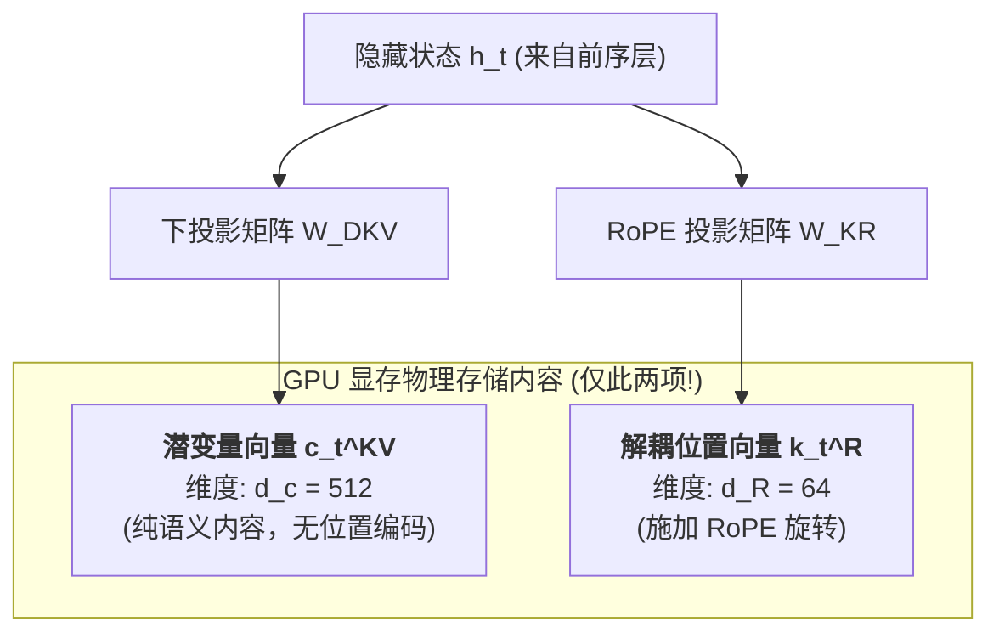
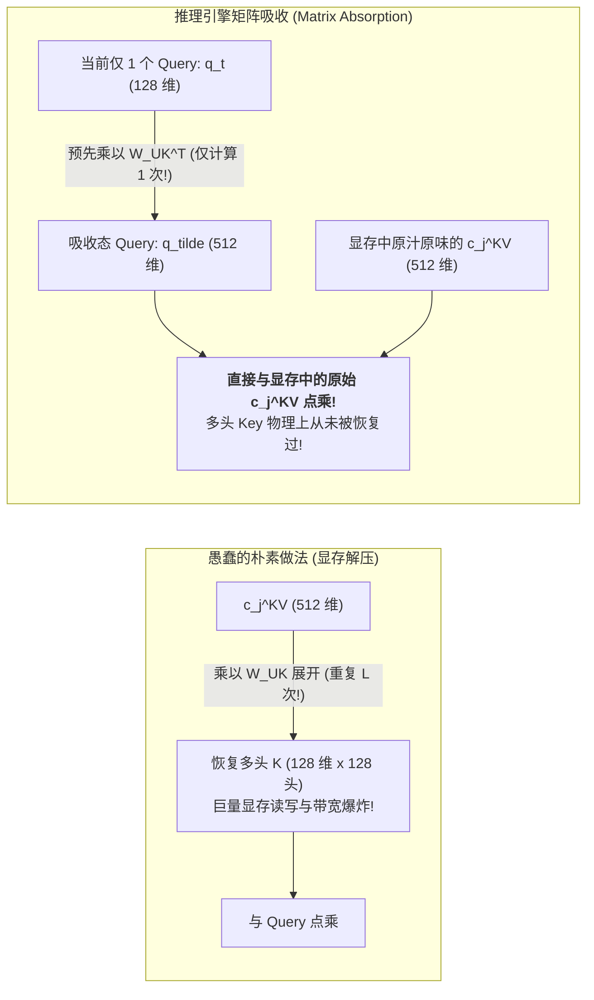

## 引言：当软件优化逼近物理极值

在前面的五讲中，我们作为系统架构师，已经将现代 GPU 硬件与编译调度榨取到了物理极限：
- 在 [Roofline 模型](/articles/inference-roofline-prefill-decode/) 中，我们标定了 Prefill 与 Decode 的计算与带宽物理天花板；
- 在 [PagedAttention 内存虚拟化](/articles/pagedattention-memory-virtualization/) 中，我们将显存碎片压制到了 4% 的极限；
- 在 [Continuous Batching 与 Chunked Prefill](/articles/continuous-batching-chunked-prefill-guide/) 中，我们抹平了并发时延的断崖式毛刺；
- 在 [RadixAttention 前缀树](/articles/prefix-caching-radix-attention-internals/) 与 [FlashAttention/FlashInfer 算子加速](/articles/flashattention-flashinfer-kernel-evolution/) 中，我们实现了公共上下文复用与片上 SRAM Tiling 深度重叠。

然而，当大模型全面跨入 **128k、1M 乃至千万级长上下文**，且智能体（Agent）动辄并发几十路多轮检索时，推理系统遭遇了由数学公式决定的**“物理绝对死局”**：

在自回归解码（Decode）阶段，单 Token 产生的 KV Cache 字节数严格由模型架构定义：
$$\text{KV Cache Bytes per Token} = 2 \times n_{\text{layers}} \times n_{\text{kv\_heads}} \times d_{\text{head}} \times \text{sizeof(dtype)}$$

以标准的 70B 级别模型（80 层，64 头，头维度 128，采用 FP16 存储）为例：
- 每个 Token 产生的 KV Cache 物理体积为 $2 \times 80 \times 64 \times 128 \times 2 = 2.62\text{ MB}$；
- 当上下文膨胀到 128k 时，**单次请求仅自身的 KV Cache 就需要独占整整 335 GB 显存！**
- 这意味着，哪怕在一台装备了 8 张 80GB H100（总显存 640GB）的顶配服务器上，**连区区 2 个并发请求的 128k 完整上下文都塞不下！**

当系统的优化在底层已经穷尽所有空间，唯一破局的可能，就落在了**“算法与模型架构的反向演进”**上。

从 **MHA（多头注意力）** 到 **MQA（多查询注意力）**，再到 **GQA（分组查询注意力）**，最后跃迁至以 **DeepSeek-V2/V3/R1 为代表的 MLA（Multi-Head Latent Attention，多头潜变量注意力）** —— 这场由模型架构反哺底层推理系统的波澜壮阔之战，彻底改写了大模型服务的经济学底色。

本文将带你推导这场架构突围的全部数学肌理，解构 DeepSeek 如何利用**解耦 RoPE（Decoupled RoPE）**实现低秩压缩，并揭秘推理引擎在自回归生成时神乎其技的**矩阵吸收（Matrix Absorption）**黑魔法。

---

## 一、 MHA 的原罪与 GQA 的妥协折中

要理解 MLA 的颠覆性，必须先看清前代架构在显存利用率上的挣扎。

```mermaid
graph TD
    subgraph MHA["1. 标准多头注意力 (MHA)"]
        direction TB
        Q1["Q0, Q1, ... Q63 (64 Heads)"]
        K1["K0, K1, ... K63 (64 Heads)"]
        V1["V0, V1, ... V63 (64 Heads)"]
        MHA_Note["KV 头数 == Q 头数<br/>KV Cache 体积极其庞大 (100% 基线)"]
    end

    subgraph MQA["2. 多查询注意力 (MQA, 2019)"]
        direction TB
        Q2["Q0, Q1, ... Q63 (64 Heads)"]
        K2["K_shared (仅 1 个 Head)"]
        V2["V_shared (仅 1 个 Head)"]
        MQA_Note["KV 压缩 64 倍<br/>但复杂逻辑与代码表征能力崩塌"]
    end

    subgraph GQA["3. 分组查询注意力 (GQA, 2023)"]
        direction TB
        Q3["Q0..Q7, Q8..Q15, ... (8 Groups)"]
        K3["K0, K1, ... K7 (8 Heads)"]
        V3["V0, V1, ... V7 (8 Heads)"]
        GQA_Note["LLaMA-3 / Mistral 行业黄金折中<br/>KV 压缩 8 倍，基本无损"]
    end
```

### 1.1 MHA（Multi-Head Attention）的致命膨胀

在初代 Transformer（如 LLaMA-1 65B）中，每一个注意力头都有独立专属的 Query、Key 和 Value 投影。
- 每个 Query 只能与同索引的 Key 和 Value 进行交互；
- $n_{\text{kv\_heads}} = n_{\text{heads}} = 64$；
- 这种设计的表征容量极高，但导致 KV Cache 随着头数和层数呈爆炸性线膨胀。在长文本推理中，HBM 带宽几乎被 Key 和 Value 的逐字搬运挤爆。

### 1.2 MQA（Multi-Query Attention）的激进冒进

2019 年，Noam Shazeer 在《Fast Transformer Decoding: One Write-Head is All You Need》中提出了极其激进的 MQA：
- 所有 64 个 Query 头强行共享**唯一一个** Key 头和 Value 头（$n_{\text{kv\_heads}} = 1$）；
- 显存占用直接被砍掉 64 倍！
- **代价是灾难性的**：多个注意力头失去了捕捉多元语法和复杂长距离依赖的能力，模型在代码、多轮推理和复杂数学任务上的准确率断崖式下滑。

### 1.3 GQA（Grouped-Query Attention）的工业界黄金折中

2023 年，Ainslie 等人提出了 GQA，并在 LLaMA-2/3、Mistral、Qwen 中迅速成为行业标配：
- 将 64 个 Query 头划分为 $G=8$ 个小组，每组 8 个 Query 头共享 1 个 KV 头；
- $n_{\text{kv\_heads}} = 8$，相比 MHA 实现了 **8 倍显存压缩**；
- 经过充分训练后，GQA 在绝大多数基准测试中几乎实现了对 MHA 的无损拟合。

**但 8 倍压缩就足够了吗？**
对于千亿大模型（如 LLaMA-3-70B），在 GQA 下，单个 Token 依然需要消耗约 **400 KB** 的 KV Cache 显存。面对 128k 上下文，单请求依然需要 50 GB 显存。要在有限的集群算力下普及长文本，整个产业迫切需要一次新的维度打击。

---

## 二、 DeepSeek MLA：低秩潜变量投影与显存极简主义

2024 年，深度求索（DeepSeek）团队在 DeepSeek-V2 论文中提出了名震业界的 **MLA（Multi-Head Latent Attention）**，并在 DeepSeek-V3 与 DeepSeek-R1 中进一步奠定了其统治地位。

MLA 的核心哲学极其颠覆：**既然高维空间中绝大多数特征维度都具有极强的相关性与低秩冗余性，为什么要在物理显存中直接存储展开后的多头 Key 和 Value？**

### 2.1 低秩潜变量压缩（Low-Rank Compression）

MLA 的做法是：在前向传播中，隐藏状态 $h_t \in \mathbb{R}^d$ **不再直接投影为高维多头 KV**，而是先通过一个下投影矩阵将其压缩为一个极小维度的**潜变量向量（Latent Vector）**：

$$c_t^{KV} = W^{DKV} h_t \in \mathbb{R}^{d_c}$$

在 DeepSeek-V2/V3 中：
- 隐藏层维度 $d = 5120$ 或 $7168$；
- 压缩潜变量维度 $d_c = 512$！
- 相比原本要展开成 128 个头的巨大 Key/Value 矩阵，这个潜变量的体积被急剧浓缩为一个 512 维的小向量。

在传统的直觉中，存储这 512 个浮点数就足够了。但此时，Transformer 历史上面临了一个最棘手的数学暗礁 —— **RoPE（旋转位置编码）的非线性不可交换性**。

### 2.2 核心暗礁：为什么 RoPE 无法直接低秩压缩？

RoPE（Rotary Position Embedding）是通过一个与 Token 绝对位置 $t$ 相关的块对角旋转矩阵 $R_t$ 施加在向量上的：
$$k_{t, i} = R_t (W^{UK}_i c_t^{KV})$$

注意这个乘法顺序：
1. $W^{UK}_i \in \mathbb{R}^{d_h \times d_c}$ 是上投影矩阵（将 512 维的潜变量展开为第 $i$ 个头的高维 Key）；
2. $R_t$ 旋转矩阵是**与位置 $t$ 强绑定的，且旋转算子不能穿透矩阵乘法！** 即：
$$R_t (W^{UK}_i c_t^{KV}) \neq W^{UK}_i (R_t c_t^{KV})$$

**如果为了在显存中只存 $c_t^{KV}$，我们就无法提前给它施加位置旋转 $R_t$；而如果等到解码时才施加 $R_t$，我们就必须在解码阶段把每一个历史 Token 的 512 维向量重新乘以 $W^{UK}$ 展开为多头，这会瞬间引爆计算量和显存重构开销！**

### 2.3 解耦 RoPE（Decoupled RoPE）：神来之笔

面对这个两难困境，DeepSeek 交出了一份令人拍案叫绝的数学答卷：**解耦 RoPE（Decoupled RoPE）**。

MLA 将 Key 和 Query **在物理上垂直切成两半**：
1. **内容向量（Content Key / Query）**：纯粹承载语义，**完全不带任何位置编码**，因此可以被安全、纯粹地进行低秩压缩；
2. **位置向量（RoPE Key / Query）**：单独分配极其微小的维度（$d_R = 64$），**专职承载 RoPE 旋转位置信息**。

$$k_{t, i} = \begin{bmatrix} k_{t, i}^C \\ k_t^R \end{bmatrix}, \quad q_{t, i} = \begin{bmatrix} q_{t, i}^C \\ q_{t, i}^R \end{bmatrix}$$

其中：
- 内容部分由低秩潜变量生成：$k_{t, i}^C = W^{UK}_i c_t^{KV} \in \mathbb{R}^{d_h}$；
- 位置部分由独立的下投影生成并旋转：$k_t^R = \text{RoPE}(W^{KR} h_t) \in \mathbb{R}^{d_R}$（**所有注意力头共享这同一个 64 维位置 Key！**）。

### 2.4 显存暴降：93.3% 物理抹除的震撼对比

在 MLA 架构下，GPU 显存中保存的每一个历史 Token 的 KV Cache，**不再是 128 个头的海量浮点矩阵，而仅仅是两个小巧的一维向量**：
1. 压缩内容潜变量：$c_t^{KV} \in \mathbb{R}^{512}$
2. 解耦位置 Key：$k_t^R \in \mathbb{R}^{64}$

让我们在相同的 70B~236B 规模基准下计算单 Token 每层的显存占用：

| 架构形态 | 每层每 Token 存储格式 | 单 Token 浮点数 (FP16) | 相对 MHA 显存节省 |
| :--- | :--- | :--- | :--- |
| **标准 MHA** | $2 \times 64 \text{ heads} \times 128$ | 16,384 浮点数 (32,768 Bytes) | 0% (基准) |
| **GQA (8 组)** | $2 \times 8 \text{ heads} \times 128$ | 2,048 浮点数 (4,096 Bytes) | 87.5% |
| **DeepSeek MLA** | $512 (c_t^{KV}) + 64 (k_t^R)$ | **仅 576 浮点数 (1,152 Bytes)** | **96.5% (显存暴跌至 1/28 !)** |

这意味着：**在相同的显存容量下，MLA 能够支持的并发批大小或上下文长度，是传统 MHA 的近 30 倍，是 GQA 的近 4 倍！**

---

## 三、 推理引擎的终极魔法：矩阵吸收（Matrix Absorption）

虽然显存中只需要存储 576 个浮点数，但如果计算注意力时，推理引擎依然要把这 512 维向量重新用矩阵乘法展开为 128 个头的全量 Key 和 Value，那么我们在第 1 讲所讨论的“显存读写带宽瓶颈”依然无法根除。

**在自回归 Decode 阶段，推理引擎究竟如何避免在物理上解压 Key 和 Value？**

这就是被誉为大模型系统工程中最精妙数学黑魔法的：**矩阵吸收（Matrix Absorption / Weight Absorption）**。

### 3.1 注意力分数阶段的 Query 吸收

回顾第 $i$ 个头的注意力得分点乘计算：
$$S_{t, j, i} = \frac{1}{\sqrt{d_h + d_R}} \left( (q_{t, i}^C)^T k_{j, i}^C + (q_{t, i}^R)^T k_j^R \right)$$

将内容 Key 的定义 $k_{j, i}^C = W^{UK}_i c_j^{KV}$ 代入前半部分：
$$(q_{t, i}^C)^T k_{j, i}^C = (q_{t, i}^C)^T \left( W^{UK}_i c_j^{KV} \right)$$

由于矩阵乘法满足结合律，我们可以**改变结合顺序**：
$$(q_{t, i}^C)^T \left( W^{UK}_i c_j^{KV} \right) = \left( (q_{t, i}^C)^T W^{UK}_i \right) c_j^{KV} = \left( (W^{UK}_i)^T q_{t, i}^C \right)^T c_j^{KV}$$

定义全新的“吸收态 Query”向量 $\tilde{q}_{t, i}^C$：
$$\tilde{q}_{t, i}^C = (W^{UK}_i)^T q_{t, i}^C \in \mathbb{R}^{d_c}$$

请注意这个恒等变形带来的巨大物理震撼：
- 在 Decode 阶段，当前步骤生成的 Query 只有 **1 个（$L_q = 1$）**，而历史 KV Cache 有 **$L$ 个（成千上万）**！
- 如果做 $W^{UK}_i c_j^{KV}$，你需要对历史上的全部 $L$ 个 Token 都要做一次展开矩阵乘法；
- **但现在，我们只对当前这 1 个单独的 Query 向量预先乘以 $(W^{UK}_i)^T$，将其从 128 维空间映射到 512 维空间！**
- **随后，算子直接拿着这个 512 维的 $\tilde{q}$，直接去与显存中未经任何解压的 $c_j^{KV}$ 做点乘！**

### 3.2 Value 聚合与输出投影吸收

Key 可以被吸收，那 Value 呢？难道加权求和后不需要乘以 $W^{UV}_i$ 恢复高维 Value 向量吗？

同样的数学魔法再次上演：
注意力加权输出向量为：
$$o_{t, i} = \sum_j P_{t, j, i} v_{j, i}^C = \sum_j P_{t, j, i} \left( W^{UV}_i c_j^{KV} \right)$$

在多头注意力之后，模型必须将所有头的输出拼接并通过线性输出矩阵 $W^O$：
$$u_t = \sum_i W^O_i o_{t, i} = \sum_i W^O_i \left( \sum_j P_{t, j, i} W^{UV}_i c_j^{KV} \right)$$

再次利用线性性质提取常数矩阵：
$$u_t = \sum_i \left( W^O_i W^{UV}_i \right) \left( \sum_j P_{t, j, i} c_j^{KV} \right)$$

定义融合后的全新输出投影矩阵：
$$\tilde{W}^O_i = W^O_i W^{UV}_i \in \mathbb{R}^{d \times d_c}$$

**又一个奇迹发生了：**
在整个自回归注意力循环中，算子直接用注意力权重 $P_{t, j, i}$ 对显存中原始的 512 维 $c_j^{KV}$ 进行加权求和，得到一个 512 维的中间向量；最后直接乘以融合矩阵 $\tilde{W}^O$ 输出！

**结论：在整个自回归 Decode 的物理执行期间，多头的 Key 和 Value 张量，在 GPU HBM 显存与 SRAM 中，自始至终从没有被完整物化过！**

---

## 四、 工业级工程落地：FlashMLA 与推理引擎生态

将矩阵吸收从纸面数学推导转变为每秒跑出数千 Token 的生产级内核，工业界经历了一场极其凶悍的代码重构。

### 4.1 DeepSeek 官方开源的 FlashMLA

为了在 NVIDIA Hopper 架构上榨干 MLA 的性能，DeepSeek 在 2025 年正式开源了 **FlashMLA**。

FlashMLA 专为 Hopper 架构的 Tensor Core 打造，具备三大底层特征：
1. **针对 $d_c = 512$ 定制切片**：专门针对潜变量维度 512 与位置维度 64 设计了极其严密的 Warp-Group Tiling 拓扑，完全契合 Hopper 的 128 线程指令；
2. **硬件级带宽逼近**：在 H800/H100 SXM 上，FlashMLA 解码内核跑出了超过 **3,000 GB/s** 的实测有效显存读取带宽，逼近芯片物理极限的 90%！
3. **原生支持 Paged Block（默认块大小 64）**：与现代分页内存池无缝对接，消除了任何非连续物理内存转换的额外开销。

### 4.2 vLLM 与 SGLang 的支持全景

目前，全球顶尖开源推理引擎均已将 MLA 与矩阵吸收纳为最核心的一等公民：

- **SGLang**：
  SGLang 在处理 DeepSeek-V3/R1 时表现出惊人的吞吐优势。它采用了动态双后端策略 —— 在 Prefill 阶段结合 FlashInfer 或 TileLang 进行长文本分块计算；在 Decode 阶段直接挂载高度优化的 **FlashMLA** 内核，配合其特有的 RadixTree 树状前缀缓存，把 DeepSeek-V3 的并发处理能力推向了前所未有的高度；
- **vLLM**：
  vLLM 官方在 V1 引擎中重构了针对 MLA 的张量分发器，支持在加载模型权重时自动完成 $W^O W^{UV}$ 的离线算子吸收（Offline Matrix Pre-fusion），避免在运行期做动态矩阵乘，使得 Decode 阶段的算子启动开销降至极限。

---

## 五、 四大注意力架构全景横向大对决

| 评估维度 | 标准 MHA | MQA (2019) | GQA (2023) | DeepSeek MLA (2024~2026) |
| :--- | :--- | :--- | :--- | :--- |
| **代表模型** | LLaMA-1, 初代 GPT-3 | Falcon-40B, StarCoder | LLaMA-2/3, Mistral, Qwen | DeepSeek-V2/V3/R1 |
| **KV 显存占用 (相对 MHA)**| 100% (极重) | ~1.5% (极轻) | 12.5% (轻) | **~3.5% (极致轻盈)** |
| **复杂推理与代码精度**| 最高 (理论基准) | 严重退化 (容量不足) | 极接近 MHA (几乎无损) | **完全匹敌甚至超越 MHA** |
| **位置编码处理** | 原生整体施加 RoPE | 原生整体施加 RoPE | 原生整体施加 RoPE | **天才级“解耦 RoPE”物理切分** |
| **Decode 算子物理形态**| GEMV 扫全量头 | GEMV 扫单头 | GEMV 扫分组头 | **矩阵吸收点乘 (直取 512 维潜变量)** |
| **中间多头物化** | 完全物化 | 仅 1 个头物化 | 仅分组头物化 | **完全无需物化多头 KV** |
| **128k 上下文并发容量**| 极低 (易触发 OOM) | 极高 (但模型不可用) | 中等 (需高规格卡) | **极高 (单机承载超大批次长文本)** |

---

## 常见问题 (FAQ)

### Q1: 既然 MLA 效果如此惊艳且能节省 90%+ 显存，为什么在所有开源模型（如 LLaMA-3、Mistral）中没有全面普及？训练 MLA 的代价是什么？

MLA 是典型的**“重度利好推理、但大幅增加训练收敛难度与超参数复杂度”**的架构设计：
1. **训练动态不稳定与秩塌陷（Rank Collapse）**：将隐藏状态压缩到 512 维的低秩潜变量中，本质是在注意力机制前强行插入了一层信息瓶颈（Bottleneck）。在预训练初期，如果优化器配置、梯度裁剪或学习率策略不当，低秩矩阵极易发生数值震荡或表征退化；
2. **多阶段精细退火依赖**：DeepSeek 能够把 MLA 训练得超越 MHA，依赖于其独步业界的超大规模预训练工程经验（包括针对 MLA 投影层的特殊初始化与专属学习率缩放）；
3. **老模型的历史资产包袱**：Meta（LLaMA）等机构拥有极其成熟的基于 GQA 的训练流水线与下游微调生态，切换全套注意力架构意味着必须废弃全部存量检查点，从头进行数万亿 Token 的预训练。

### Q2: 为什么矩阵吸收（Matrix Absorption）只能在自回归 Decode 阶段生效，而在 Prefill 阶段却无法直接使用？

这完全是由 **矩阵乘法的计算维度与硬件算力平衡** 决定的物理必然：
- **在 Decode 阶段**：Query 的序列长度只有 **1（$L_q = 1$）**。吸收操作将单个 128 维向量变换为 512 维向量，只花费了极微小的矩阵向量乘开销，却换取了在后续所有 $L$ 个历史 Token 上**完全免于解压**的巨大红利；
- **在 Prefill 阶段**：用户输入的 Prompt 长度通常是成千上万（例如 $L_q = 4096, L_k = 4096$）。此时 $Q$ 和 $K$ 都是巨大的二维矩阵。如果强行把 $W^{UK}$ 乘到整个输入矩阵 $Q \in \mathbb{R}^{4096 \times 128}$ 上，变换后的矩阵维度将膨胀至 $4096 \times 512$，这不仅不能节省计算量，反而在后续的 Attention 矩阵乘法中使 FLOPs 暴涨了 4 倍！

因此，顶尖推理引擎的标配实现是：**Prefill 阶段走专门优化的解压大 GEMM 算子；而在 Decode 阶段，瞬间切换至矩阵吸收算子，享受极限显存带宽节约。**

### Q3: 开启 MLA 后，KV Cache 已经压缩了 90% 以上，为什么在超大并发下服务器依然会遭遇显存瓶颈？此时系统的下限受制于什么？

尽管 MLA 将每个 Token 的 KV 缓存压缩到了区区 1.15 KB，但随着并发连接数（Concurrency）拉大到几百甚至上千路，系统面临着两个新的物理下限：

1. **静态模型权重的物理常驻**：
   以 DeepSeek-V3（671B MoE，激活参数 37B）为例，即使采用极限的 FP8 量化，整套静态模型权重的体积依然高达 **~350 GB**，必须常年死死驻留在显存中，占据了近一半的集群物理卡容量；
2. **超长长尾（Tail Sequences）并发的算力累积**：
   当几百个并发请求同时涌入，且每个请求都在执行复杂的思维链推理（DeepSeek-R1 式的长 CoT，动辄输出数千字）时，上千个并发流的中间激活值（Activation Memory）与工作区缓冲（Scratchpad Buffers）会瞬间膨胀。

此时，系统的瓶颈已经成功从“被 KV Cache 撑爆”转移到了**多节点之间的专家并行（Expert Parallelism）网络通信带宽**。我们在后续章节中，将进一步深入 MoE 与跨节点网络架构的深水区。
