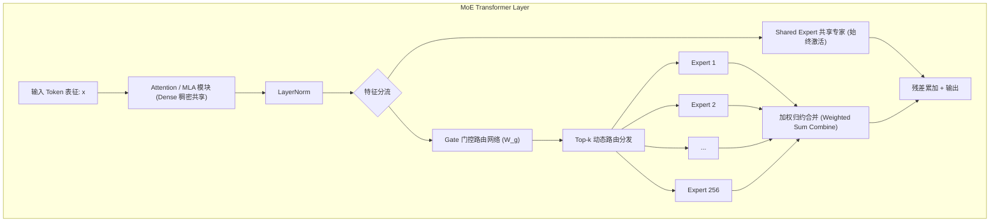
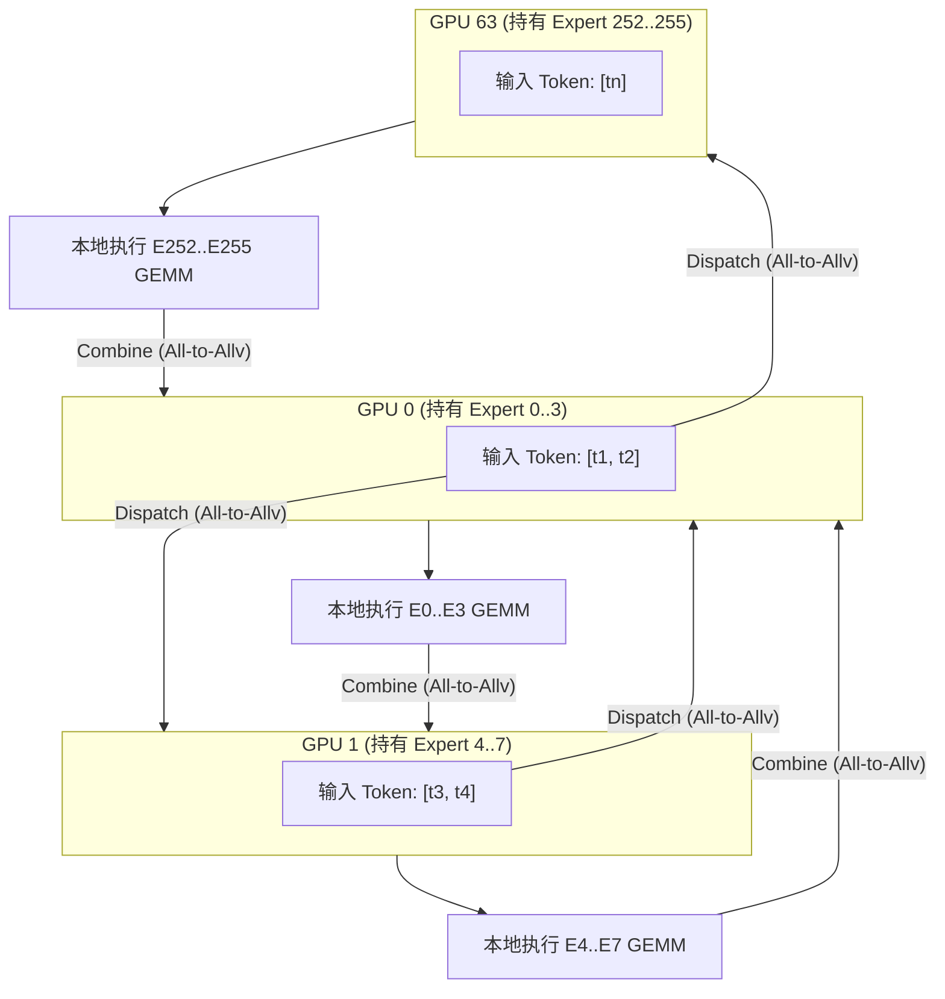
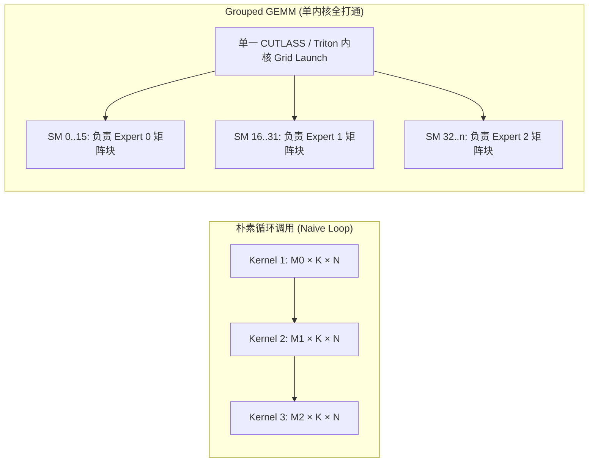
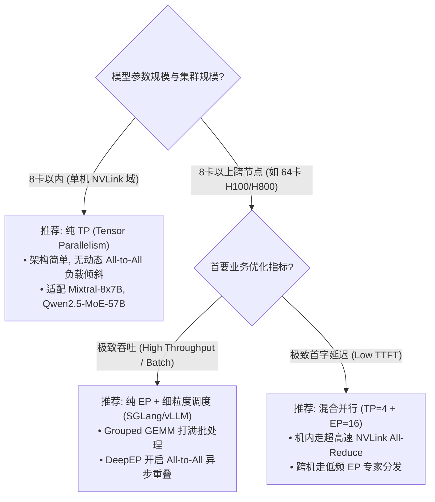

## 引言：671B 庞然大物的“稀疏”算力谜题

在专栏前六讲中，我们沿着自回归推理的底层演进脉络，从 [Roofline 模型与 Prefill/Decode 物理撕裂](/articles/inference-roofline-prefill-decode/)、[PagedAttention 显存池化](/articles/pagedattention-memory-virtualization/)、[Continuous Batching 调度](/articles/continuous-batching-chunked-prefill-guide/)、[Prefix Caching 前缀树缓存](/articles/prefix-caching-radix-attention-internals/)，一路深入到 [FlashAttention/FlashInfer 算子演进](/articles/flashattention-flashinfer-kernel-evolution/) 与 [DeepSeek MLA 矩阵吸收压缩](/articles/mha-gqa-mla-matrix-absorption-inference-engine/)。

这些技术无一例外地将 Dense（稠密）模型的显存利用率与计算效率推向了物理极限。然而，随着模型容量从 70B 跨越到 600B+，稠密模型撞上了不可逾越的**算力墙** —— 每次生成一个 Token 都必须无差别地激活所有权重矩阵进行乘加计算，导致单 Token 推理成本随模型规模呈严格的线性膨胀。

**混合专家架构（Mixture-of-Experts, MoE）** 彻底打破了这一桎梏。以享誉全球的 **DeepSeek-V3** 为例：
- **总参数量（Total Parameters）**：高达 **671B**；
- **每 Token 激活参数量（Active Parameters per Token）**：仅约 **37B**（含 1 个共享专家 + 8 个被动态选中的路由专家）；
- **稀疏率（Sparsity Ratio）**：高达 $94.5\%$，这意味着 $94.5\%$ 的 FFN 权重在当前 Token 的计算中处于静默状态！

```
DeepSeek-V3 计算稀疏度对比：
┌─────────────────────────────────────────────────────────────┐
│ 总参数量: 671B (每个 Layer 拥有 256 路由专家 + 1 共享专家)     │
│ 激活参数量: 37B (激活 8 个路由专家 + 1 个共享专家)             │
│ 计算节省率: ~94.5% FLOPs 削减                                │
└─────────────────────────────────────────────────────────────┘
```

表面上看，MoE 似乎实现了“千亿级模型的知识容量，百亿级模型的计算开销”的终极梦想。然而，一旦将 MoE 模型部署到生产级推理集群（如 vLLM, SGLang 或 TensorRT-LLM），系统工程师就会遭遇比稠密模型残酷数倍的全新瓶颈：

1. **Decode 阶段的“访存地狱”更加恶化**：在 Batch Size 较小时，被分配到每个专家的 Token 数极少（甚至为 0 或 1），导致 GEMM 运算退化为极低算术强度的 GEMV，显存带宽被严重耗尽；
2. **专家并行（Expert Parallelism, EP）引入跨节点网络风暴**：不同专家分散在不同 GPU 上，Token 必须跨越 GPU 甚至跨物理节点进行 **All-to-All** 动态路由重排（Token Dispatch）与归约合并（Token Combine），通信延迟迅速吞噬算力收益；
3. **负载倾斜（Load Imbalance）与掉队者效应（Straggler Effect）**：热门专家被 Token 挤爆形成计算木桶短板，冷门专家则长时间空转。

本文作为**《大模型推理引擎：从模型演进、内核架构到未来终局》**专栏第七章，将从 MoE 基础数学原理出发，深度解构动态路由门控算法、专家并行通信拓扑、CUTLASS Grouped GEMM 融合内核，以及生产级系统如何利用 **DualPipe** 实现极致的通信计算重叠。

---

## 一、 MoE 物理双态：计算稀疏性与访存带宽的二次撕裂

### 1.1 结构解剖：Shared Expert 与 Routed Expert

经典的 Transformer Block 由 Multi-Head Attention（或 MLA）和 Feed-Forward Network（FFN）串联构成。在 MoE 模型中，通常保持 Attention 层为稠密共享结构，仅将 FFN 层替换为一组平行的“专家网络”（Expert MLPs）：



以 DeepSeek-V3 为代表的现代架构引入了 **共享专家（Shared Experts）+ 细粒度路由专家（Fine-Grained Routed Experts）** 拓扑：
- **共享专家 $E_{\text{shared}}$**：无论 Token 的语义为何，无条件参与每个 Token 的计算，负责捕获通用语言知识与公理规则；
- **路由专家 $\{E_1, E_2, \dots, E_N\}$**：被细分为大量小尺寸专家（如 256 个，每个专家隐层维度仅 2048），每个 Token 仅由门控网络动态挑选其中的 $K$ 个（如 $K=8$）参与计算。

输出公式严谨表述为：

$$y = E_{\text{shared}}(x) + \sum_{i \in \text{TopK}(S, K)} s_i E_i(x)$$

其中 $s_i$ 为门控网络赋予专家 $i$ 的归一化路由权重。

### 1.2 Roofline 视角下的物理撕裂：为什么 MoE Decode 更怕小 Batch？

我们在 [专栏第一讲](/articles/inference-roofline-prefill-decode/) 中深入推导了 Roofline 模型：**算术强度（Arithmetic Intensity）$I = \frac{\text{FLOPs}}{\text{Memory Access Bytes}}$ 决定了硬件运行在算力受限区还是访存受限区**。

在 Dense 模型中，若 Batch Size 为 $B$，隐层维度为 $h$，前向计算权重访存量为 $W$ 字节，计算量为 $2 B W$ FLOPs，算术强度约为 $I_{\text{dense}} \approx \frac{2 B W}{W} = 2B$（与参数量大小无关，只与 $B$ 成正比）。

但在 MoE 架构中，情况发生了剧变：
假设每层有 $E$ 个专家，每个 Token 激活 $k$ 个专家。如果推理引擎正在处理并发较小的自回归解码请求（如 $B=8$），激活的 Token 总分配数为 $B \times k = 8 \times 8 = 64$ 个任务分配。
假定系统中有 $E=256$ 个专家：
- 平均每个专家分配到的 Token 数为：$M_e = \frac{B \cdot k}{E} = \frac{64}{256} = 0.25$！
- 绝大多数专家分配到的 Token 数为 **0**，而少数被选中的专家分配到的 Token 数仅为 **1 或 2**！

当一个 GPU 节点上的专家只分到一个 Token 时，GPU 必须从 HBM 显存完整加载该专家的全部权重矩阵（$W_{\text{gate}}, W_{\text{up}}, W_{\text{down}}$），却只对单向量做了一次矩阵-向量乘法（GEMV）！

```
MoE 单专家算术强度对比：
- Prefill 阶段 (长上下文 S=4096, B=4):
  总分配 Token 数 = 4096 * 4 * 8 = 131,072
  每专家平均分配 Token 数 M_e ≈ 131,072 / 256 = 512
  -> 标准大 GEMM, 算术强度 I ≈ 2 * 512 = 1024 FLOPs/Byte (打满 Tensor Core 算力受限区)

- Decode 阶段 (低并发 B=4):
  总分配 Token 数 = 4 * 8 = 32
  每专家平均分配 Token 数 M_e ≈ 32 / 256 = 0.125
  -> 退化为 GEMV, 算术强度 I ≈ 2 * 1 = 2 FLOPs/Byte (被死死锁在 HBM 访存受限区底端)
```

**结论一：MoE 架构在大幅降低单 Token 理论计算量的同时，将自回归 Decode 阶段推向了更为极致的“访存受限区”。如果没有足够的 Batch Size 聚合 Token，MoE 的实际加速比将大打折扣！**

---

## 二、 动态路由门控与负载均衡策略

### 2.1 传统 Softmax Top-k 门控与路由崩溃难题

最朴素的门控机制（如 Switch Transformer 与 Mixtral 8x7B）采用线性投影 + Softmax 机制：

$$P(x) = \text{Softmax}(x \cdot W_g)$$

$$\text{TopK}(x) = \operatorname{arg top-k}(P(x), K)$$

$$s_i = \frac{\exp(x \cdot W_{g,i})}{\sum_{j \in \text{TopK}(x)} \exp(x \cdot W_{g,j})}$$

这种方式在训练与推理初期极易发生**路由崩溃（Routing Collapse）**：门控网络发现某几个“初始表现好”的专家能更快降低 Loss，于是将越来越多的 Token 路由给它们。最终导致少数几个专家承担了 $90\%$ 以上的负载，而其余专家沦为从未被激活的“僵尸专家”。

为了防止崩溃，早期的 MoE 系统（如 GShard, Megatron-MoE）引入了**辅助损失函数（Auxiliary Balance Loss）**，在总损失中强行对专家的负载方差施加惩罚：

$$\mathcal{L}_{\text{balance}} = \alpha \cdot E \sum_{i=1}^E f_i \cdot P_i$$

其中 $f_i$ 是分配给专家 $i$ 的 Token 比例，$P_i$ 是路由到专家 $i$ 的平均概率，$\alpha$ 为惩罚系数。

**辅助损失的致命缺陷**：$\alpha$ 过小起不到均衡效果；$\alpha$ 过大会严重干扰主语言建模任务（Next-token Prediction Loss），导致模型为了“强行平均分配”而牺牲推理能力！

### 2.2 DeepSeek-V3 的创新：无辅助损失负载均衡（Auxiliary-Loss-Free Balancing）

为了在不损害模型表现的前提下达成完美的负载均衡，DeepSeek-V3 提出了一种完全**脱离 Loss 惩罚**的动态偏置调整策略。

门控网络在计算亲和度得分时，额外引入一个**专家级动态偏置项 $b_i$**：

$$S_i = \operatorname{Sigmoid}(x \cdot W_{g,i}) + b_i$$

- **路由判决阶段**：依据带有偏置的 $S_i$ 挑选 Top-$K$ 专家：
  $$\text{TopK}(x) = \operatorname{arg top-k}(\{S_i\}_{i=1}^E, K)$$
- **权重归约阶段**：计算实际归约乘积时，**剥离偏置 $b_i$**，仅保留原始未带偏置的亲和度得分归一化值：
  $$s_i = \frac{\operatorname{Sigmoid}(x \cdot W_{g,i})}{\sum_{j \in \text{TopK}(x)} \operatorname{Sigmoid}(x \cdot W_{g,j})}$$


在训练与推理调度过程中，推理引擎监控每个专家的瞬时负载（分配到的 Token 数 $C_i$）。若专家 $i$ 超载，则微调降低 $b_i$；若专家 $i$ 饥饿，则微调提高 $b_i$：

$$b_i \leftarrow b_i + \gamma \cdot \left(\frac{1}{E} \sum_{j=1}^E C_j - C_i\right)$$

这种巧妙的设计将“负载均衡控制”与“特征语义表达”彻底解耦：偏置仅改变路由流向，不污染输出特征的加权数学期望！

---

## 三、 并行策略决选：张量并行 (TP) vs 专家并行 (EP)

在部署具有数百个专家的巨型 MoE 时，单卡显存显然无法容纳 600B+ 参数。业界存在两种主流的并行拆分范式：**张量并行（Tensor Parallelism, TP）** 与 **专家并行（Expert Parallelism, EP）**。

### 3.1 方案 A：在专家内部做张量并行 (TP within MoE)

若将现有的 TP 方案直接套用到 MoE 上（如在 8 卡节点内做 TP=8）：
每个专家的权重矩阵被纵向或横向切分到 8 张 GPU 上（ColumnParallel Linear 1 + RowParallel Linear 2）。每个 GPU 均驻留全部 256 个专家的 $\frac{1}{8}$ 分片。

```
TP 模式下的数据与权重拓扑 (TP=8):
GPU 0: [E0_slice0, E1_slice0, E2_slice0, ... E255_slice0]
GPU 1: [E0_slice1, E1_slice1, E2_slice1, ... E255_slice1]
...
GPU 7: [E0_slice7, E1_slice7, E2_slice7, ... E255_slice7]

每个 Token 在单机 8 卡上均被完整保留，但在每个 Expert Layer 执行后，
必须执行一次 All-Reduce 同步 8 张卡的部分和 (Partial Sums)。
```

- **通信模式**：经典的 **All-Reduce**；
- **每 Token 单层通信量**：$2 \times h \times \frac{TP - 1}{TP} \times \text{bytes}$（与每层是否激活多个专家无关）；
- **致命瓶颈**：当模型规模达到 671B 时，单机 8 卡（即使是 8x 80GB H100）连模型静态权重都装不下（BF16 需 1342GB 显存）。必须跨机扩展！而在千兆/万兆跨节点跨机柜场景下，跨机的 All-Reduce 同步延迟是无法承受的灾难。

### 3.2 方案 B：专家并行 (Expert Parallelism, EP)

专家并行（EP）的哲学是：**权重不切分，专家整块分布在不同 GPU 上**。
例如系统有 $E=256$ 个专家，部署在 64 张 GPU（8 台 8 卡机器）组成的集群上，则 $EP=64$：
每张 GPU 仅驻留 $\frac{256}{64} = 4$ 个完整的专家！



在这种拓扑下，Token 的物理生命周期演变为典型的 **Dispatch-Compute-Combine** 三部曲：

1. **Token Dispatch（分发）**：GPU 0 上的门控网络计算出 $t_1$ 的 Top-2 专家分别是 Expert 5（在 GPU 1 上）和 Expert 253（在 GPU 63 上）。GPU 0 必须将 $t_1$ 的特征向量打包，通过高速网络精准投递给 GPU 1 和 GPU 63；
2. **Local Compute（本地计算）**：每张 GPU 收集来自全集群所有其他 GPU 路由给自己的 Token，与本地驻留的 4 个专家执行高效的 Grouped GEMM 矩阵计算；
3. **Token Combine（合并）**：计算完成后，GPU 1 和 GPU 63 将输出向量原路发回 GPU 0。GPU 0 接收来自远端专家的返回向量，按门控权重 $s_i$ 进行加权累加（Weighted Sum），完成本层计算。

### 3.3 通信模式剖析：All-to-All 与 All-to-Allv

在 EP 体系中，通信算子不再是简单的 All-Reduce，而是高度非对称的 **All-to-All**（在 PyTorch / NCCL 中通常为 `all_to_all_single` 或带变长偏移的 `all_to_allv`）。

| 特性维度 | 张量并行 (TP on MoE) | 专家并行 (EP on MoE) |
| :--- | :--- | :--- |
| **权重存储方式** | 每个专家切碎分散在所有卡 | 专家整体存储，不同卡存不同专家 |
| **单卡专家权重规模** | $\frac{\text{Total Weights}}{TP}$ | $\frac{\text{Total Weights}}{EP}$ |
| **底层核心通信算子** | `ncclAllReduce` | `ncclAllToAllv` (Ragged All-to-All) |
| **单 Token 通信量** | $2 \times h \times \frac{TP-1}{TP}$ | $2 \times k \times h$ ($k$ 个分发 + $k$ 个返回) |
| **网络延迟敏感度** | 极高（每次层同步必须等待最慢卡） | 高（依赖高性能 RDMA 全连接拓扑） |
| **扩展极限** | 通常限制在单机 8 卡 NVLink 域内 | 可扩展至 64~256 张跨机网络节点 |

**数学计算通信量**：
设隐层特征维度 $h = 7168$，采用 BF16（2 字节/元素），激活专家数 $k = 8$：
- EP Dispatch 阶段单 Token 发送数据量：$8 \times 7168 \times 2 = 114,688 \text{ Bytes} \approx 112 \text{ KB}$；
- EP Combine 阶段单 Token 接收数据量：同样约为 $112 \text{ KB}$；
- 单 Token 单层通信总量约为 **224 KB**。

若模型有 60 层 MoE，生成单个 Token 跨网络传输的数据量高达 $60 \times 224 \text{ KB} \approx 13.1 \text{ MB}$！若系统吞吐要求达到每秒 1000 Token，双向网络吞吐要求将突破 **$13.1 \text{ GB/s} \times 8 \approx 105 \text{ Gbps}$**！
这就是为什么 **DeepSeek-V3 必须依赖 8 节点 64 卡全双工 3.2Tbps InfiniBand / RoCE 网络** 的物理根因。

---

## 四、 算子级攻坚：CUTLASS Grouped GEMM 与 Token 重排

当跨节点的 All-to-All 完成 Token 投递后，每张 GPU 面临的挑战回到了本地计算核函数（Kernel）。

### 4.1 伪代码之殇：为什么 `for e in range(E)` 会摧毁 GPU 性能？

初学者在编写 MoE 时，最容易写出类似以下的串行循环逻辑：

```python
# 致命反面教材：千万不要在生产推理内核中这样写！
expert_outputs = torch.zeros_like(x)
for e in range(num_local_experts):
    mask = (expert_indices == e)
    tokens_for_e = x[mask]
    if tokens_for_e.shape[0] > 0:
        expert_outputs[mask] = local_experts[e](tokens_for_e)
```

这种朴素实现会彻底杀死 GPU 性能：
1. **Kernel Launch Overhead（内核启动开销）**：如果每个 Layer 遍历多次专家，GPU 发射了成百上千个微小的 GEMM 内核，CPU-GPU 流水线严重脱节；
2. **尾部效应与 Wave Quantization（波次量化空泡）**：当分配给专家 $e$ 的 Token 数 $M$ 很小时（如 $M=3$），根本无法填满 GPU 的 SM（流多处理器），大部分 Tensor Core 处于空闲状态，Wave 利用率极低。

### 4.2 Grouped GEMM 破局之道

为了彻底终结微小内核的发射开销，现代 MoE 引擎（如 vLLM, SGLang, FlashMoE）采用 **Grouped GEMM（分组通用矩阵乘，源自 NVIDIA CUTLASS）** 技术。



Grouped GEMM 允许在**单次内核启动（Single Kernel Launch）**中，计算多个 $M$ 维度各不相同、但 $K, N$ 维度对齐的独立矩阵乘法：

$$C_i = A_i \times B_i, \quad A_i \in \mathbb{R}^{M_i \times K}, B_i \in \mathbb{R}^{K \times N}, \quad i \in [0, E_{\text{local}}-1]$$

GPU 的硬件线程块（Thread Blocks）根据所有专家的累积 Token 偏移量（Offsets Array）自动索取工作分片。一旦专家 0 的小矩阵计算完毕，闲置的 SM 立即无缝滑入专家 1 的任务队列，彻底消除了硬件空泡。

### 4.3 生产级 Token Permute（重排）与 Triton 内核实战

在将 Token 送入 Grouped GEMM 之前，必须先将分散在不同位置的 Token 按照其目标专家 ID 进行物理内存重排（Permutation / Scatter）。

以下展示了工业级 MoE 路由分发与重排的 PyTorch/Triton 核心调度骨架：

```python
import torch
import torch.nn as nn
import torch.nn.functional as F

class FusedMoERouterAndDispatcher(nn.Module):
    def __init__(self, hidden_dim: int, num_experts: int, top_k: int):
        super().__init__()
        self.hidden_dim = hidden_dim
        self.num_experts = num_experts
        self.top_k = top_k
        self.gate = nn.Linear(hidden_dim, num_experts, bias=False)
        # 类似 DeepSeek-V3 的专家动态偏置参数 (无辅助损失)
        self.register_buffer("expert_bias", torch.zeros(num_experts))

    def forward(self, x: torch.Tensor):
        # x 形状: [B, hidden_dim]
        batch_size = x.shape[0]
        
        # 1. 计算路由亲和度
        raw_logits = self.gate(x) # [B, num_experts]
        biased_scores = torch.sigmoid(raw_logits) + self.expert_bias
        
        # 2. 挑选 Top-k 专家
        _, topk_indices = torch.topk(biased_scores, self.top_k, dim=-1) # [B, top_k]
        
        # 3. 归一化真实输出权重 (从原始 logits 计算，去除偏置污染)
        clean_scores = torch.sigmoid(raw_logits)
        selected_scores = torch.gather(clean_scores, dim=-1, index=topk_indices)
        routing_weights = selected_scores / (selected_scores.sum(dim=-1, keepdim=True) + 1e-6)
        
        # 4. Token 物理重排: Flatten -> argsort 获取目标专家连续内存索引
        flat_topk_ids = topk_indices.view(-1) # [B * top_k]
        # 对专家 ID 进行快速基数排序/稳定排序
        permuted_token_indices = torch.argsort(flat_topk_ids)
        
        # 映射回原始 Token 编号: [0, 0, 1, 1, ... B-1, B-1]
        source_token_ids = torch.arange(batch_size, device=x.device).repeat_interleave(self.top_k)
        gather_indices = source_token_ids[permuted_token_indices]
        
        # 5. 生成连续物理输入缓冲池 (Scatter 输入)
        permuted_inputs = x[gather_indices] # [B * top_k, hidden_dim]
        
        # 6. 计算每个专家的 Token 计数 (Histogram) 与偏移，供 Grouped GEMM 调用
        expert_token_counts = torch.bincount(flat_topk_ids, minlength=self.num_experts)
        expert_offsets = torch.cumsum(expert_token_counts, dim=0)
        
        return permuted_inputs, routing_weights, permuted_token_indices, expert_offsets
```

---

## 五、 终极加速：DualPipe 通信与计算重叠编排

无论本地的 Grouped GEMM 优化得多么登峰造极，在数以万计的线上请求中，专家并行跨节点 All-to-All 的物理链路传输时间依然是无法缩减的客观物理耗时。

**唯一的突破口，是让通信与计算在时间轴上实现真正的并发重叠（Overlapping）！**

### 5.1 DeepSeek-V3 的 DualPipe 流水哲学

在传统流水线中，Token 的计算顺序是严格线性的：
`Attention -> All-to-All Dispatch -> MoE GEMM -> All-to-All Combine -> Next Layer`。
网络在传输时，GPU Tensor Core 彻底空转；Tensor Core 在计算时，IB 网卡 DMA 通道彻底闲置。

DeepSeek-V3 提出了 **DualPipe（双向流水线）** 与精细化的计算通信交错技术。其关键洞察在于：
1. **Shared Expert 并不需要任何跨节点通信**，它是单卡本地计算；
2. **Attention / MLA 也是单卡本地（或机内 TP）计算**；
3. 将并发 Batch 切分为两个互不依赖的子批次（Chunk 0 与 Chunk 1），或者将当前层的 Routed Expert 计算与下层的 Attention / Shared Expert 计算交织！

```mermaid
sequenceDiagram
    autonumber
    participant Stream_Comm as CUDA Stream 1 (通信流: NVLink / RDMA)
    participant Stream_Comp as CUDA Stream 0 (主计算流: Tensor Core)
    
    Note over Stream_Comp: 执行 Chunk 0 的 MLA Attention 计算
    Note over Stream_Comp: 执行 Chunk 0 的 Shared Expert 计算
    
    rect rgb(30, 41, 59)
    Note over Stream_Comm,Stream_Comp: 【核心重叠区间 1】
    Stream_Comm->>Stream_Comm: 启动 Chunk 0 的 Token Dispatch (All-to-Allv 异步跨网)
    Stream_Comp->>Stream_Comp: 并行计算 Chunk 1 的 MLA Attention 与 Shared Expert
    end
    
    Note over Stream_Comp: 等待 Chunk 0 Dispatch 到达，执行 Chunk 0 的 Routed Grouped GEMM
    
    rect rgb(30, 41, 59)
    Note over Stream_Comm,Stream_Comp: 【核心重叠区间 2】
    Stream_Comm->>Stream_Comm: 启动 Chunk 0 的 Token Combine (All-to-Allv 异步跨网发回)
    Stream_Comp->>Stream_Comp: 并行执行 Chunk 1 的 Routed Grouped GEMM 本地计算
    end
```



### 5.2 异步流水线的多 CUDA Stream 实现

在实际工程落地上（如 DeepEP 库与 SGLang / vLLM 的底层通信后端），这依赖于显式的 CUDA Stream 依赖管理与事件同步（CUDA Events）：

```python
# 生产级通信计算重叠的流水线调度雏形
stream_comm = torch.cuda.Stream()
stream_comp = torch.cuda.current_stream()

# ----------------- Step 1: 异步分发 Chunk 0 -----------------
with torch.cuda.stream(stream_comm):
    # 非阻塞跨卡/跨机通信 (NVLink / RDMA)
    dispatch_handle_chunk0 = async_all_to_all_dispatch(tokens_chunk0)

# ----------------- Step 2: 并行计算 Chunk 1 的本地任务 -----------------
# 此时通信流在后台疯狂吞吐，主计算流全速跑 GEMM，算力利用率打满
out_shared_chunk1 = shared_expert(tokens_chunk1)
out_attn_chunk1 = mla_attention(tokens_chunk1)

# ----------------- Step 3: 汇合与交错执行 -----------------
# 主流等待 Chunk 0 通信完毕
stream_comp.wait_event(dispatch_handle_chunk0.event)

# 开始计算 Chunk 0 的本地路由专家 Grouped GEMM
out_routed_chunk0 = grouped_gemm_experts(dispatch_handle_chunk0.result)

# 再次启动异步 Combine，同时开启 Chunk 1 的路由计算...
```

通过将跨机 All-to-All 的漫长排队与网卡 DMA 传输时间完全“隐藏”在 Attention 和 Shared Expert 的大计算量矩阵乘之后，系统几乎观察不到纯粹的通信等待挂起，将 MoE 推理集群的整体吞吐推升了 **$40\% \sim 70\%$**！

---

## 六、 生产级技术选型与全景架构对比

面对不同业务场景与集群规模，MoE 模型的部署方式需要做出理性的架构权衡：



主流开源推理框架对 MoE 的底层支持现状：

| 引擎框架 | Grouped GEMM 实现 | EP 跨机通信支持 | 通信重叠能力 | 特色优化 |
| :--- | :--- | :--- | :--- | :--- |
| **SGLang** | CUTLASS / FlashMoE / DeepEP | 完善（支持 DeepSeek-V3 64卡部署） | 极佳（流水线 Chunk 级重叠） | 结合 RadixAttention 复用 MoE 路由结果 |
| **vLLM** | Marlin-MoE / CUTLASS | 原生集成，快速演进 | 良好（CUDA Graph + 多流调度） | 支持 FP8 / INT4 专家权重量化 |
| **TensorRT-LLM** | 深度定制 CUTLASS 双缓冲内核 | 卓越（NCCL + nvlink-tree） | 极致（C++ 原生流水线编排） | 极致榨干 H100 TMA 与异步拷贝引擎 |
| **llama.cpp** | CPU 多线程 / Metal 分组计算 | 仅支持单机多卡/单机 CPU | 基础 | 移动端与消费级显卡极致精简 |

---

## 常见问题 (FAQ)

### Q1: 在 MoE 自回归解码 (Decode) 时，如果某张卡上的专家分配到的 Token 数为 0，这会导致报错或等待死锁吗？
**不会报错，但会考验内核的调度设计。**
在标准的 PyTorch 简单循环中，空张量可能导致分支逻辑判断开销；但在工业级 Grouped GEMM（如 CUTLASS 或 Triton 实现）中，每个专家的输入被表示为一个连续缓冲区以及一个专家大小数组（`expert_counts` 或 `expert_offsets`）。
如果专家 $e$ 分配到的 Token 数为 0（即 $M_e = 0$），在偏移量数组中其区间长度为 0。GPU 调度器在为线程块分配任务时，直接跳过该区间，不会发射任何浮点乘加指令，更不会引发越界或死锁。但需要注意：**如果该专家被路由分配了 0 个 Token，其他卡发给它的通信数据量也为 0，底层 NCCL 的 `all_to_allv` 必须严格支持变长（ragged）甚至 0 字节的消息传输**。

### Q2: 为什么 DeepSeek-V3 宁可使用 256 个极小专家，也不使用 Mixtral 8x7B 那样的 8 个大专家？
这是经过严密消融实验的**帕累托最优架构决策**：
1. **更高的知识解耦纯度（Knowledge Specialization）**：专家越小、越多，每个专家就越能聚焦于极其精准的垂直概念或句法模式，而不是让一个 7B 大专家“既要懂写诗、又要懂编译原理”；
2. **更精细的组合灵活性**：从 256 个专家中选 8 个，可能激活的组合数高达 $\binom{256}{8} \approx 4.3 \times 10^{14}$ 种，而从 8 个专家中选 2 个仅有 $\binom{8}{2} = 28$ 种组合。细粒度专家在极低激活参数量下提供了几乎无限的表征容量；
3. **容忍小尺寸 Grouped GEMM**：配合 DeepSeek 自研的 DeepEP 和 1 个常驻共享专家，既保住了通用语言骨架，又利用海量小专家实现了极佳的计算压缩比。

### Q3: 混合并行中“TP+EP”的组合应该如何分配？例如 32 卡集群，是选 TP=8 + EP=4 还是 TP=4 + EP=8？
**必须依据物理网络的互联拓扑（Topology-Aware Hierarchy）来严格决定：**
- **黄金原则**：**将通信频次极高的张量并行（TP）锁死在单机内部的 NVLink 高速总线域内（通常单机 8 卡，带宽高达 900GB/s）；将专家并行（EP）放在跨节点的网络拓扑上（InfiniBand / RoCE）**。
- 如果你有 4 台 8 卡机器（共 32 卡）：
  - 若选择 **TP=4 + EP=8**：每台机器切分为 2 个独立的 TP=4 组（走片内 NVLink），跨越 8 个节点走 EP。通信量更加分散，是目前多数长序列高并发集群的主流配置；
  - 若选择 **TP=8 + EP=4**：每台机器整机作为 1 个 TP=8 组，4 个物理节点构成 EP=4。虽然跨机通信量极小，但 TP=8 带来的机内 All-Reduce 延迟在 Batch 较小时会增加 Kernel 启动等待。
系统工程师应结合具体硬件网络测速（`all_reduce_perf` vs `all_to_all_perf`）进行基准压测定夺。
