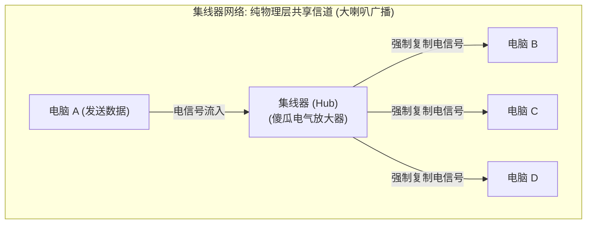
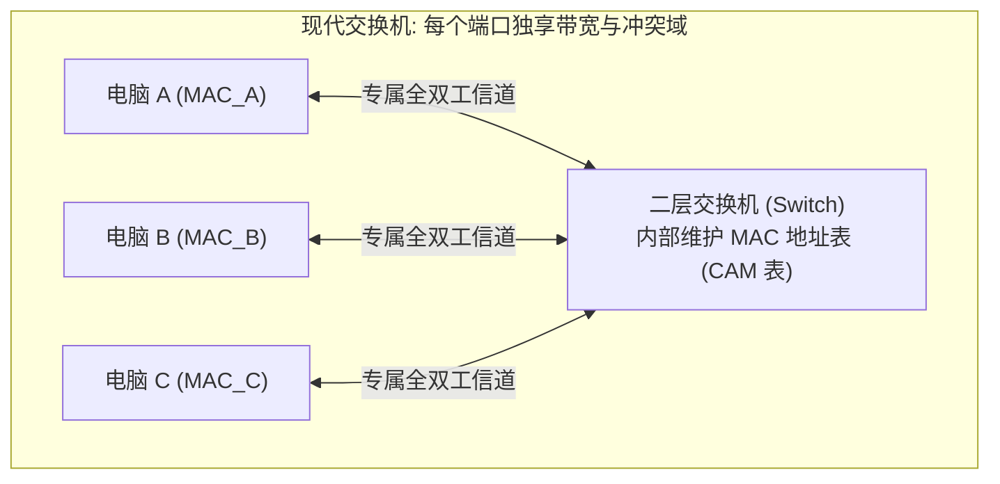
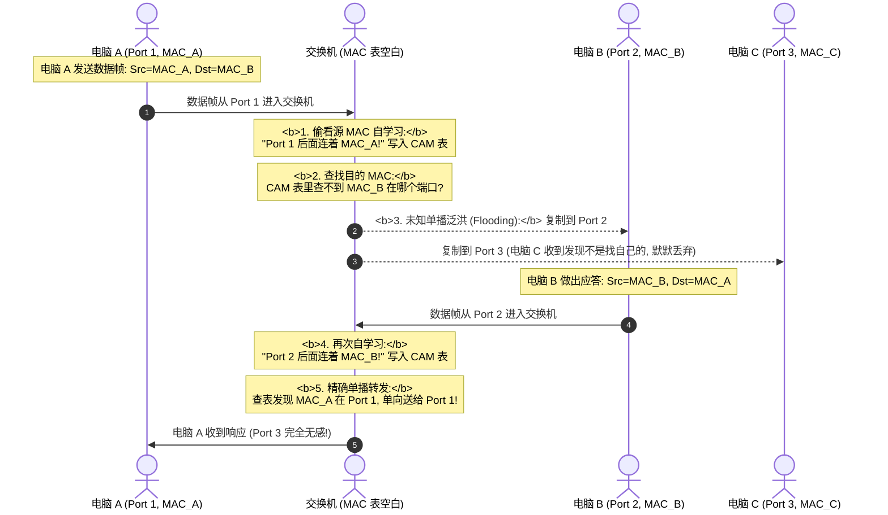
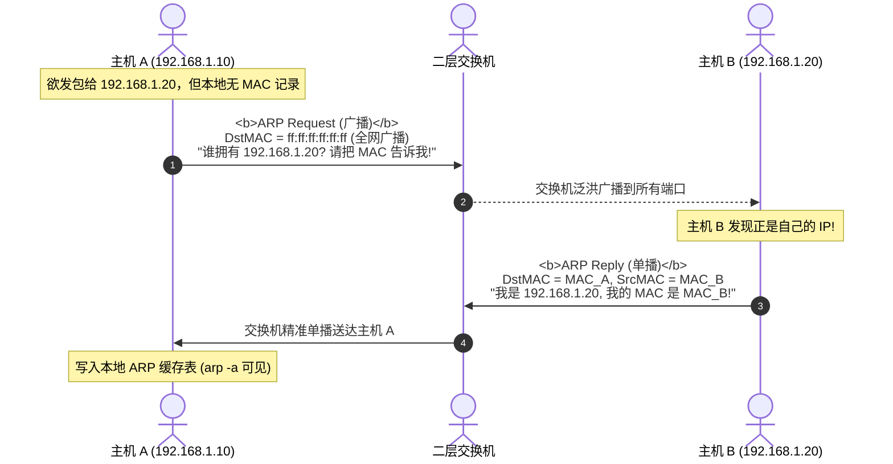

## 引言：网络通信的本质 —— 如何让两台机器“说上话”？

想象一个最纯粹的场景：你的桌子上有两台电脑，一台叫电脑 A，另一台叫电脑 B。你希望把电脑 A 里的一个文件传给电脑 B。

在物理世界中，计算机内部所有的文字、图片、视频，本质上都只是一串由 `0` 和 `1` 构成的二进制数字（比特，Bit）。
- 怎么把电脑 A 内存里的这串数字，准确无误地送到电脑 B 的内存里？
- 能不能直接找一根普通电线，把两台电脑的主板连起来？
- 如果办公室里有 100 台电脑，难道要在每两台电脑之间都拉一根电线吗？

这正是计算机网络在过去半个世纪里所解决的核心问题。

本文是**《深入浅出计算机网络：从以太网原理到万卡 InfiniBand 架构实战》的开篇第一讲**。我们将彻底抛开晦涩的学术术语，**从绝对零基础开始**，带你从物理铜线上的微弱电流、光纤里的激光脉冲出发，一步步推导**物理层、集线器冲突域、二层交换机与以太网 MAC/ARP 寻址的底层运转秘密**。

---

## 一、 物理层（Layer 1）：比特、电平、网线与光纤

### 1.1 0 和 1 的物理形态：电压与光脉冲

计算机是电子设备，它无法直接理解抽象的“数字”，它只能感知物理世界中的**电压变化**或**光信号有无**：

```text
高低电平编码比特 (以极简 NRZ 码为例):
   高电平 (+5V)  -------\       /-------\
                         \     /         \
   低电平 ( 0V)           \-----/           \-------
   对应比特流:      1       0       1           0
```

1. **电信号传输（铜缆）**：通过导线两端的电压跳变来表达数据。例如高电平代表 `1`，低电平代表 `0`；
2. **光信号传输（光纤）**：通过微型半导体激光器或 LED 发光，光亮代表 `1`，光灭代表 `0`。

### 1.2 双绞线（网线）为什么要“拧成麻花”？

我们日常见到的 RJ45 水晶头网线（如超五类 Cat5e、六类 Cat6），剥开外皮后会发现里面有 8 根细铜线，两两互相缠绕扭结在一起。**为什么不直接做成平行的直导线，而偏要大费周章拧成螺旋麻花？**

```text
双绞线差分信号抗干扰原理:
导线 1 (TX+) :  +  +  +  +  +  +  +  +  +  +  (传输正向信号)
导线 2 (TX-) :  -  -  -  -  -  -  -  -  -  -  (传输反向信号)
      \       /       \       /       \
       \     /         \     /         \  <- 相互螺旋缠绕
        \   /           \   /           \
外界电磁干扰 (Noise): ~~~~~ 侵入两根导线产生几乎相同的感应电动势 ~~~~~
接收端差分放大器计算: V_out = (TX+ + Noise) - (TX- + Noise) = TX+ - TX- (干扰被彻底抵消!)
```

- **第一性原理：抵消电磁干扰（EMI）**：
  现实空间中充斥着日光灯、电机、无线电等杂乱电磁波。双绞线采用**差分信号（Differential Signaling）**传输，两根线传输大小相等、极性相反的电压。
  当外界干扰侵入这对紧密缠绕的铜线时，两根线上产生的感应噪声完全相同；接收端只要计算**两根线的电压差值**，外界噪声就被完美对消，只留下纯净的数据信号！

### 1.3 光纤：单模光纤 vs 多模光纤

当传输距离超过 100 米（网线的物理极限距离），或者需要 100Gbps、400Gbps 超高带宽时，铜线的高频衰减变得无法承受，必须换用**光纤（Optical Fiber）**：

| 特性 | 多模光纤 (Multi-Mode Fiber, MMF) | 单模光纤 (Single-Mode Fiber, SMF) |
| :--- | :--- | :--- |
| **纤芯直径** | 较粗（$50\,\mu m$ 或 $62.5\,\mu m$） | 极细（约 $9\,\mu m$，接近光波长） |
| **光源** | 廉价 VCSEL 垂直腔面发射激光器 / LED | 高精度长波半导体激光器（LD） |
| **光传输模式** | 允许多束不同角度的光线在纤芯内全反射传播 | 只有单一模式的光线沿轴线直线传播 |
| **主要限制** | 存在**模态色散（Modal Dispersion）**，光脉冲展宽 | 几乎无模态色散，信号保真度极高 |
| **典型波长** | 850 nm | 1310 nm / 1550 nm |
| **传输距离** | 几十米到几百米（机柜与机房内部） | 数公里到上百公里（跨机房、城域网、跨洋光缆） |
| **外套颜色标识** | 橙色（OM1/OM2）或水蓝色（OM3/OM4） | 黄色（OS1/OS2） |

---

## 二、 从集线器（Hub）到交换机（Switch）：冲突域与广播域的演进

有了导线，如果一个房间里有 4 台电脑（A、B、C、D），怎么把它们连接在一起？

### 2.1 史前时代：集线器（Hub）与致命的“冲突域”

早期人类发明了**集线器（Hub）**。它的内部电路本质上就是把所有端口的铜线粗暴焊在一起的“物理分线器”：



- **工作机制**：只要电脑 A 从端口 1 发送一段电信号，集线器不问青红皂白，**原封不动把电信号放大并同时从端口 2、3、4 泼洒出去**；
- **致命灾难：冲突（Collision）**：
  如果电脑 A 正在发数据，电脑 B 也恰好同时发数据，两股电流在铜线里撞车，电压叠加彻底紊乱，导致两台电脑的数据全部报废！
- **冲突域（Collision Domain）**：**连接在同一个物理介质上、任意两台设备同时发送信号就会产生物理冲突的区域**。集线器连接的所有设备，全部处在同一个冲突域中！

#### 经典解法：CSMA/CD（载波侦听多路访问/冲突检测）
为了防止集线器网络彻底瘫痪，计算机网卡遵守一套类似“众人开会发言”的交通规则 —— **CSMA/CD**：
1. **先听后发（Carrier Sense）**：发包前先测量网线电压，如果有人在发，闭嘴等待；
2. **边发边听（Collision Detection）**：自己发包的同时，持续监听网线电压。如果发现电压异常升高，说明有人抢麦撞车了！
3. **冲突停发并强化冲突（Jamming）**：一旦检测到冲突，立刻停止发送，并补发一段干扰信号通知全网；
4. **随机退避（Binary Exponential Backoff）**：各自掷骰子，等待一个随机毫秒时间后再尝试重发，防止大家同时重试再次撞车。

### 2.2 二层革命：交换机（Switch）与 CAM 表自学习

集线器效率极其低下（10 台电脑共享带宽，网速直接缩水至 $\frac{1}{10}$）。为了消灭冲突域，计算机科学家发明了**网络交换机（Switch）**。

交换机工作在**数据链路层（Layer 2）**，它拥有自己的 CPU 和高速存储芯片，能够看懂数据包的内容！



#### 交换机如何消灭冲突域？
交换机的每一个端口都是一个**完全隔离的独立冲突域**。电脑 A 发给电脑 B 的数据，交换机芯片在内部定向交换，**电脑 C 和电脑 D 所在的线路完全静默，根本收不到任何无关电信号！**

---

## 三、 数据链路层（Layer 2）：MAC 地址与以太网帧结构

交换机凭什么能知道电脑 A 发出的数据究竟该送往哪一个端口？答案是依靠物理网卡的身份证 —— **MAC 地址**。

### 3.1 什么是 MAC 地址？

MAC（Media Access Control，介质访问控制）地址是烧录在物理网卡 ROM 芯片中的全球唯一硬件标识符：
- 长度固定为 **48 位二进制（6 个字节）**；
- 通常用 12 位十六进制表示，例如：`08:00:27:B2:3C:9A`；
- **前 24 位（OUI，组织唯一标识符）**：由 IEEE 官方统一分配给硬件厂商（如 Intel、Apple、华为、NVIDIA/Mellanox）；
- **后 24 位（扩展标识符）**：厂商自行分配给每一块出厂的物理网卡序列号。

### 3.2 以太网帧（Ethernet II Frame）标准物理结构

数据在数据链路层传递的基本物理单位称为**帧（Frame）**：

```text
标准以太网帧物理结构 (Ethernet II, IEEE 802.3):
+----------------+-----+-------------+-------------+------+---------------+---------+
| 前导码         | SFD | 目的 MAC    | 源 MAC      | 类型 | 载荷数据      | FCS 校验 |
| (Preamble, 7B) | 1B  | (Dst MAC,6B)| (Src MAC,6B)| 2B   | (46 ~ 1500B)  | (CRC, 4B)|
+----------------+-----+-------------+-------------+------+---------------+---------+
```

1. **前导码与帧定界符（Preamble & SFD，共 8 字节）**：
   连续的 `10101010...` 高低频方波，最后以 `10101011` 结尾。它的作用是让接收端网卡的物理时钟与发送端迅速同频振荡同步；
2. **目的 MAC 与源 MAC（各 6 字节）**：
   明确标明这封信由谁寄出、寄给局域网内的哪块网卡；
3. **类型字段（Type，2 字节）**：
   标识内部载荷包裹着的是什么上层网络协议：
   - `0x0800`：IPv4 报文；
   - `0x86DD`：IPv6 报文；
   - `0x0806`：ARP 协议报文；
4. **有效载荷（Payload，46 ~ 1500 字节）**：
   实际承载的高层数据包。最小必须有 46 字节（不足时强制填充 Padding，以保证以太网帧最小达到 64 字节，满足 CSMA/CD 最小帧长时槽限制）；最大默认不能超过 1500 字节（即经典 MTU）；
5. **帧校验序列（FCS / CRC32，4 字节）**：
   发送端网卡对整段数据进行多项式数学运算计算出校验码，接收端复算。如果导线电磁杂波导致任何 1 位比特翻转，校验失败直接硬件丢弃，防止脏数据污染内存。

---

## 四、 交换机 CAM 表自学习与 ARP 协议联动

### 4.1 交换机 MAC 地址表（CAM 表）自学习全过程

假设一台刚刚通电开机的交换机，其内部的 MAC 地址表一片空白：



- **老化机制（Aging Time）**：交换机为每一条学到的 MAC 记录设置生存倒计时（通常默认 300 秒）。如果 5 分钟内该设备再无发包，表项自动擦除，防止设备拔出换口后路由混乱。

### 4.2 ARP 协议：已知 IP，如何获取 MAC？

在日常使用中，我们在电脑里只输入对方的 IP 地址（如 `192.168.1.20`），但二层以太网只认物理 MAC 地址！网卡怎么知道对方的 MAC 是什么？

这依赖**地址解析协议（ARP，Address Resolution Protocol）**。



1. **ARP 广播请求（Broadcast）**：
   目的 MAC 填写 `ff:ff:ff:ff:ff:ff`（全 1 广播地址），交换机强制将该帧复制到局域网内的所有接口；
2. **ARP 单播应答（Unicast）**：
   拥有该 IP 的目标机器收到后，以单播形式向源主机精准回信；
3. **免费 ARP（Gratuitous ARP）**：
   主机刚插上网线配置 IP 时，主动向网络广播一条“询问自己 IP 的 ARP”。若有人回信，说明局域网内存在**IP 地址冲突**，操作系统立即弹窗报警！

---

## 五、 本地验证与实战排查命令

登录任何 Linux 服务器，使用原生工具探查底层物理层与二层状态：

```bash
# 1. 检查物理网卡光电链路状态、协商双工与线速 (Layer 1 状态)
ethtool eth0
# 核心输出字段:
# Speed: 1000Mb/s              <- 协商线速
# Duplex: Full                 <- 全双工 (消灭冲突域)
# Link detected: yes           <- 物理电信号连通!

# 2. 查询本地所有网卡的物理 MAC 地址
ip link show eth0
# 类似: link/ether 52:54:00:12:34:56 brd ff:ff:ff:ff:ff:ff

# 3. 打印操作系统本地 ARP 缓存表 (Layer 2 到 Layer 3 的映射关系)
ip neigh show
# 输出示例:
# 192.168.1.1 dev eth0 lladdr 00:50:56:c0:00:08 REACHABLE
```

---

## 六、 总结与进阶预告

在计算机网络的大厦中，物理层与数据链路层铸造了信息传输最基础的物理经纬：
- **物理层** 用电压跳变与光脉冲定义了比特，通过差分双绞线与低色散光纤抗击物理信道衰减；
- **集线器** 曾因共享信道将所有设备锁死在同一个“冲突域”，逼迫网卡使用 CSMA/CD 苦苦排队；
- **二层交换机** 依靠 **MAC 地址** 与 **CAM 表自学习机制** 终结了冲突域，开辟了全双工线速转发时代；
- **ARP 协议** 搭建起了连接抽象 IP 世界与物理网卡硬件的坚实桥梁。

然而，仅仅拥有 MAC 地址和二层交换机，人类能把全世界的电脑连成互联网吗？
- **广播风暴的物理上限**：如果全球 50 亿台设备都在一个由交换机构成的二层网络里，哪怕一台设备发出一声 ARP 广播，50 亿台设备都要同时被广播包轰炸瘫痪；
- **平面地址无法寻址**：MAC 地址是厂商出厂随机烧录的，没有地理层级关系，交换机根本不可能存下全球几十亿条 MAC 记录！
- 为什么必须在物理 MAC 之上，创造出具有严密层级逻辑的 **IP 地址**？
- 什么是 **子网掩码（Subnet Mask）**？它到底是如何通过数学二进制把“哪个网段”与“哪台电脑”精确切开的？
- 跨网段通信时，**默认网关（Default Gateway）** 究竟施展了怎样的“脱壳换壳”魔法？

在接下来的**专栏第二讲**中，我们将手把手带你用二进制推导网络层最核心的数学密码 —— **[IP 寻址全景数学推导：十进制/二进制、子网掩码 (Subnet Mask) 与默认网关第一性原理](/articles/ip-addressing-subnet-mask-cidr-default-gateway-routing/)**！

---

## 常见问题 (FAQ)

### Q1: 为什么有了物理网卡 MAC 地址，计算机网络还必须发明 IP 地址？只用 MAC 地址联网不行吗？
**根本原因：MAC 地址是“扁平的无序标识”，而 IP 地址是“层级化的寻址坐标”。**
- **MAC 地址如同个人的身份证号**：无论你走到北京、伦敦还是纽约，你的身份证号永远不变。如果全球互联网仅用 MAC 地址寻址，全世界的每一台路由器和交换机，都必须在内存中存储全人类数十亿个 MAC 地址及其所在的具体物理端口，硬件存储器瞬间爆炸；
- **IP 地址如同邮政快递地址**：格式严格为“中国 - 广东省 - 深圳市 - 南山区 - 某某路 - 某某号”。中间路由器只需要根据前缀（如看到“广东省”）即可粗粒度转发，只有到达最终的目的局域网时，才在最后一跳使用 ARP 将 IP 解析为具体的 MAC 地址。层级化的 IP 地址让互联网全球路由表的聚合与规模化成为可能。

### Q2: 什么是冲突域（Collision Domain）与广播域（Broadcast Domain）的本质区别？
- **冲突域（物理层概念）**：同一时间内如果有多台设备同时发送电信号，就会在物理介质上产生电磁波形叠加冲突的范围。集线器（Hub）无法隔离冲突域；**二层交换机（Switch）的每个端口都是一个独立的冲突域**；
- **广播域（数据链路层/网络层概念）**：一台设备发送广播数据帧（目的 MAC 为 `ff:ff:ff:ff:ff:ff`），网络中所有能够接收到该帧的设备的集合。普通二层交换机无法隔离广播域（全机所有端口属于同一个广播域）；**只有三层路由器（Router）或划分了 VLAN 的交换机才能彻底切断广播域**。

### Q3: 局域网中的 ARP 欺骗（ARP Spoofing）攻击是如何破坏网络安全的？交换机如何从硬件上进行防御？
**攻击原理**：ARP 协议是无状态且无鉴权的。黑客向局域网受害者电脑持续伪造发送虚假的 ARP 应答：“我是网关 `192.168.1.1`，我的 MAC 是黑客的 MAC `AA:AA:AA:AA:AA:AA`”。受害者电脑毫不怀疑地刷新本地 ARP 缓存表，导致随后发往外网的所有流量（网银、密码、通信）全部自动流向黑客电脑，形成中间人攻击（MITM）。
**硬件级防御方案**：现代企业级交换机开启 **DAI（Dynamic ARP Inspection，动态 ARP 检查）**。交换机根据 DHCP Snooping 建立的合法 `<IP-MAC-Port>` 信任绑定表，在硬件端口级别强制过滤并丢弃任何虚假或冒充的伪造 ARP 应答包。
