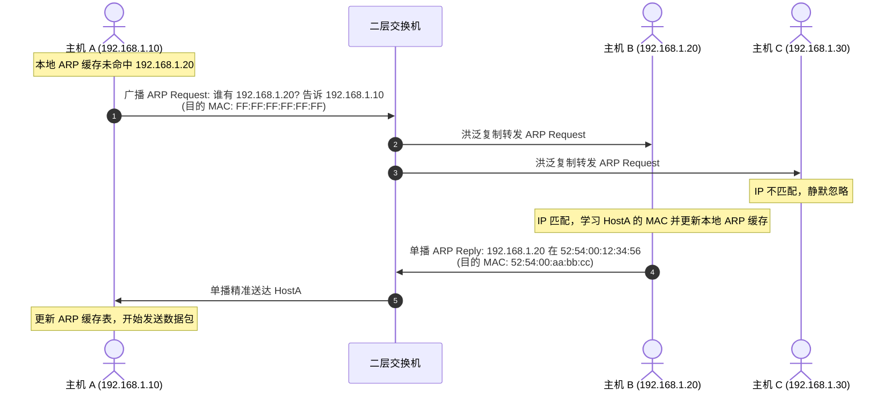
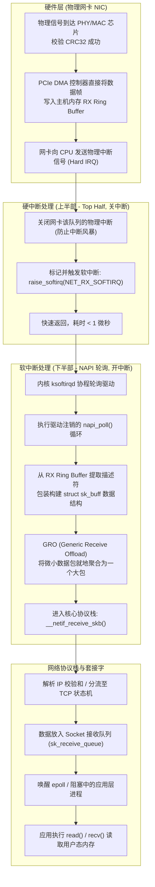

## 引言：打破网络“抽象黑盒”的第一性原理

在现代软件工程中，无论是微服务架构、分布式数据库，还是横跨万张 GPU 的超大 AI 训练集群，网络（Network）始终是决定系统吞吐、延迟与可靠性的物理基石。

对于绝大多数应用层工程师而言，网络常常被简化为一个高度抽象的概念 —— 仿佛只要调用一个 `socket.connect()` 或发送一个 HTTP 请求，数据便会自动飞向远端。然而，当流量洪峰瞬间压垮网关、当高并发长连接出现神秘的抖动、或者当数万台服务器需要在微秒级别同步梯度时，抽象的黑盒便会彻底破碎。

真实的物理世界中：
1. **网络没有魔法，只有物理信号与时间延迟**：光纤中的光信号传输速度约为真空光速的三分之二（约 $200\,\text{km/ms}$），从北京到上海的往返光纤物理延迟就注定无法突破 $10\,\text{ms}$；
2. **操作系统内核是性能的第一道鬼门关**：一个 100Gbps 的以太网接口在跑满小包时，每秒需要处理超过 **1.4 亿个数据包（Mpps）**。如果为每个数据包触发一次 CPU 中断，现代哪怕 128 核的服务器也会在几微秒内被中断风暴活活击穿！

要构建真正具备工业级弹性的分布式高吞吐系统，平台架构师必须掌握从物理层、数据链路层到操作系统内核驱动级的底层真机运作原理。

本文作为**《深入浅出计算机网络：从以太网原理到万卡 InfiniBand 架构实战》**专栏的开篇之作，将带你从最底层物理信号出发，逐层解密**以太网帧与 MAC 寻址**、**ARP 协议与欺骗防御**，并深入 Linux 操作系统内核，完整追踪网卡收发包的 **NAPI 与软中断生命周期**。

---

## 一、 物理层与数据链路层：以太网的物理现实

### 1.1 从双绞线到光纤：信号是如何变成比特的？
物理层（Layer 1）的核心使命是：**在物理传输介质上传输原始的非结构化比特流（0 和 1）**。
- **铜缆（双绞线 / DAC 直连铜缆）**：通过高低电平或差分电压传输电信号。在高速场景下（如 25G/100G DAC 铜缆），受限于高频信号衰减与趋肤效应，传输距离通常严格限制在 3 米至 5 米以内；
- **光纤（多模 MMF / 单模 SMF）**：利用光脉冲在玻璃纤维中的全反射传输。现代高速网络普遍采用 **PAM4（4 阶脉冲幅度调制）** 编码，一个波形符号能够承载 2 个比特信息，使得单波长速率从 50Gbps 跨越至 100Gbps 及 200Gbps。

### 1.2 以太网帧（Ethernet II）结构解剖

在物理信号之上，数据链路层（Layer 2）将散乱的比特流规整为具备明确界限的结构化数据块 —— **以太网帧（Frame）**：

```
以太网帧 (Ethernet II Frame) 物理布局:
+------------+-------+------------+------------+-----------+----------------------+-----------+
| 7 Bytes    | 1 B   | 6 Bytes    | 6 Bytes    | 2 Bytes   | 46 - 1500 Bytes      | 4 Bytes   |
| Preamble   | SFD   | Dest MAC   | Src MAC    | EtherType | Data Payload (MTU)   | FCS CRC32 |
| 前导码     | 定界  | 目的 MAC   | 源 MAC     | 上层协议  | 净荷数据 (IP/ARP)    | 帧校验序列|
+------------+-------+------------+------------+-----------+----------------------+-----------+
```

1. **Preamble（前导码，7 字节）与 SFD（帧起始定界符，1 字节）**：
   由周期性的 `10101010...` 组成，以 `10101011` 结尾。它的物理作用是让接收端网卡的物理层时钟电路（PHY）与发送端完成比特时钟同步并锁定帧边界；
2. **MAC 地址（6 字节 / 48 位）**：
   全球唯一的硬件物理地址（前 24 位为厂商 OUI，后 24 位为序列号）。广播 MAC 表现为全 1（`FF:FF:FF:FF:FF:FF`）；
3. **EtherType（2 字节）**：
   声明上层净荷的协议类型。常见数值包括：`0x0800`（IPv4）、`0x86DD`（IPv6）、`0x0806`（ARP）、`0x8100`（带 802.1Q VLAN Tag）；
4. **MTU（最大传输单元，Payload 长度）**：
   标准以太网要求净荷长度在 **46 ~ 1500 字节** 之间。如果净荷不足 46 字节（例如单个 TCP ACK 包仅 40 字节），必须填充（Padding）至 46 字节，保证整帧最小长度不低于 64 字节；
5. **FCS（帧校验序列，4 字节）**：
   采用循环冗余校验（CRC32）。网卡硬件会在发送前计算 CRC 并填入尾部；接收端物理芯片会重新计算，一旦不一致直接在硬件层静默丢弃，绝不浪费主机 CPU 资源。

> [!NOTE]
> **巨型帧（Jumbo Frames）的生产意义**：在标准以太网中，发送 9000 字节数据需要切分为 6 个 1500 字节的帧，产生 6 次头开销与 6 次 CPU 中断。在大型数据中心、分布式存储（Ceph/NFS）或 AI 训练中，全链路统一开启 **MTU=9000（Jumbo Frame）**，能使网络协议头开销骤降 80%，极大减轻网卡收发中断压力。

---

## 二、 链路层寻址之桥：ARP 协议与 Linux ARP 缓存防线

在以太网局域网（LAN）中，机器通信只认 MAC 地址；但上层应用程序只知道目标 IP 地址。如何将 32 位的虚拟 IP 地址翻译为 48 位的物理 MAC 地址？这正是 **ARP（Address Resolution Protocol，地址解析协议）** 的职责。



### 2.1 免费 ARP（Gratuitous ARP）的双刃剑
免费 ARP 是指主机主动向局域网广播查询“自己的 IP 地址”：
1. **IP 冲突检测**：机器开机配置静态 IP 后，先发送免费 ARP。如果收到回复，说明局域网内存在 IP 冒用冲突，立即告警报错；
2. **高可用 VIP 漂移（Keepalived / 浮动 IP）**：在主备负载均衡集群中，当 Master 节点宕机、Backup 节点接管虚拟 IP（VIP）时，Backup 节点会立即向全网狂发一波免费 ARP，强行刷新局域网所有交换机和服务器的 ARP 缓存，实现秒级平滑切流。

### 2.2 生产级高可用防御：LVS 与多网卡 ARP 抑制
当单台 Linux 服务器配置了多张物理网卡，或者在 LVS（DR 模式）下在 `lo` 回环网卡绑定了 VIP 时，Linux 默认的宽松 ARP 行为会引发灾难性的流量乱串。

必须在 `/etc/sysctl.conf` 中进行严格的内核级 ARP 抑制：
```bash
# 仅当目标 IP 确实配置在接收网卡上，且 ARP 请求属于同网段时才回复
net.ipv4.conf.all.arp_ignore = 1
net.ipv4.conf.eth0.arp_ignore = 1

# 在发送 ARP 请求时，严格忽略数据包源 IP，强制使用发包出口网卡的真实 IP 作为 ARP 源
net.ipv4.conf.all.arp_announce = 2
net.ipv4.conf.eth0.arp_announce = 2
```

---

## 三、 深入 Linux 内核：数据包收发 NAPI 链路全景追踪

从数据包接触物理网卡引脚，到应用程序通过 `recv()` 从套接字（Socket）读取数据，Linux 内核设计了一套兼顾**超低延迟与防死锁洪峰**的工业级流水线架构：



### 3.1 核心数据结构：Ring Buffer 与 `sk_buff`
1. **RX/TX Ring Buffer（环形缓冲区）**：
   位于物理网卡驱动与操作系统内存之间的一组环形指针数组。它存放的不是庞大的数据体本身，而是指向物理内存地址的**描述符（Descriptor）**。网卡通过 PCIe DMA（直接内存访问）在不需要 CPU 参与的情况下，把数据包直接搬运到物理内存中的 Ring Buffer；
2. **`sk_buff`（套接字缓冲区）**：
   Linux 内核网络子系统的灵魂容器。它贯穿整个网络协议栈，通过操作 `head`, `data`, `tail`, `end` 四个内部指针，使得数据在跨越各层协议（以太网首部、IP 首部、TCP 首部）时，**完全无需发生任何物理内存拷贝**，仅需增减指针偏移量！

### 3.2 为什么必须采用 NAPI（New API）混合轮询机制？
传统的网络驱动纯粹依赖硬件中断：来一个包中断一次。在高并发海量流量下，CPU 会把 100% 的时钟周期全耗费在“保存现场、执行中断上下文切换”上，系统瞬间陷入**活锁（Livelock）瘫痪**。
**NAPI 的精妙架构**：
- **初来乍到用中断**：平时流量稀少时，网卡以硬中断模式工作，保证毫秒级超低唤醒延迟；
- **洪峰过境切轮询**：第一个包到达触发硬中断后，网卡驱动**立即屏蔽物理网卡后续的硬中断**，并注册 NAPI 调度对象；
- **批量汲取（Batch Polling）**：Linux 内核软中断服务（`ksoftirqd`）在一个预算周期内（默认 `budget=300` 个包），持续在内存 Ring Buffer 中批量抓取处理数据；
- **风暴过去复原**：当 Ring Buffer 中的数据全被抽干后，驱动重新使能网卡硬件中断，退回低功耗待命状态！

---

## 四、 生产级高吞吐网卡调优实战

在每秒数十万至数百万 QPS 的核心网关或高密度计算宿主机上，使用默认的 Linux 网络参数极易导致莫名丢包。

### 4.1 监控与诊断：定位丢包物理位置
```bash
# 1. 检查物理网卡底层 Ring Buffer 丢包与错误统计
ethtool -S eth0 | grep -E "rx_dropped|rx_errors|rx_fifo_errors|rx_missed_errors"

# 2. 检查网络软中断在各个 CPU 核心上的消耗分布 (观察是否有单核被压满 100%)
cat /proc/softirqs | grep NET_RX

# 3. 检查系统全局软中断待处理队列溢出情况
cat /proc/net/softnet_stat
```

### 4.2 生产级内核参数与网卡极限调优
```bash
# 步骤 1: 将网卡硬件 Ring Buffer 扩大到芯片支持的物理极限 (杜绝 DMA 溢出丢包)
ethtool -G eth0 rx 4096 tx 4096

# 步骤 2: 开启网卡硬件卸载特性 (GRO 大包合并、TSO 硬件分片、硬件校验和)
ethtool -K eth0 gro on tso on gso on rxhash on

# 步骤 3: 优化内核软中断处理队列深度 (写入 /etc/sysctl.conf)
# 单次软中断允许轮询汲取的最大包数
net.core.netdev_budget = 600
# 软中断单次循环最大允许消耗的时间片 (毫秒)
net.core.netdev_budget_usecs = 4000
# 网卡接收队列溢出前允许在内核 backlog 排队的最大数据包数
net.core.netdev_max_backlog = 100000
```

---

## 五、 总结与进阶预告

从以太网电磁脉冲到操作系统内部的 `sk_buff`，我们剖析了计算机网络的底层机械结构：
- **以太网帧与 MTU** 划定了物理介质上数据传输的边界，Jumbo Frame 是提升吞吐的传统法宝；
- **MAC 寻址与 ARP** 构建了逻辑 IP 与物理网卡映射的纽带，免费 ARP 更是 VIP 高可用漂移的灵魂；
- **NAPI 与软中断流水线** 则是操作系统在物理硬件极速脉冲与主机算力之间筑起的最坚固防洪堤坝。

然而，掌握了单局域网内的单机收发包，仅仅是跨入了计算机网络的大门：
- 当一个数据包需要跨越数千公里、穿透数十个路由器跨网段传输时，IP 协议是如何计算路由条目并执行最长掩码匹配的？
- 在极度不可靠的广域网环境中，TCP 是如何凭借那张经典的“11 状态机”与“三次握手 / 四次挥手”构建出百分之百可靠的虚电路连接？
- 滑动窗口机制是如何在不压垮接收端内存的前提下榨干网络带宽的？

在接下来的**专栏第二讲**中，我们将正式升维至网络层与传输层中枢 —— **[网络层与传输层精解：IP 路由选路、CIDR、TCP 三次握手/四次挥手状态机与滑动窗口第一性原理](/articles/network-layer-transport-layer-ip-routing-tcp-state-machine/)**！

---

## 常见问题 (FAQ)

### Q1: 为什么以太网标准帧规定最小长度必须为 64 字节（净荷至少 46 字节）？
**根本原因：早期半双工以太网 CSMA/CD（载波侦听多路访问/冲突检测）的物理碰撞检测槽时间（Slot Time）要求**。
在早期的共享同轴电缆以太网中，信号在电缆中传播存在延迟（往返时延 RTT）。为了保证发送端在发送一个帧的整个过程中能够检测到可能发生的冲突碰撞，帧的传输时长必须大于信号在网络最远端来回跑一趟的最大往返传播时间（$51.2\,\mu\text{s}$）。
在 10Mbps 以太网中，$51.2\,\mu\text{s} \times 10\,\text{Mbps} = 512\,\text{bits} = 64\,\text{Bytes}$。如果允许发送小于 64 字节的超短帧，发送端早在碰撞信号传回之前就已经发完并误以为成功了，导致冲突无法被察觉。尽管现代全双工交换网络已彻底摒弃冲突域，但 64 字节最小帧长的设计作为兼容性标准被永久保留了下来。

### Q2: 为什么在生产监控中经常看到某个 CPU 核心的 `si`（软中断）利用率高达 100%，而其他核心却完全空闲？如何彻底根治？
**根本原因：网卡单队列或硬件中断亲和性（IRQ Affinity）失衡**。
默认情况下，网卡的硬件中断可能全部绑定在编号为 CPU 0 的核心上。即使服务器拥有 64 个 CPU 核心，网卡抛出的所有硬中断以及后续的 `NET_RX_SOFTIRQ` 软中断也只能由 CPU 0 单独处理，导致该核心被活活打满并出现剧烈丢包。
**根治方案**：
1. 确保网卡驱动开启多队列支持（RSS，Receive Side Scaling）：`ethtool -L eth0 combined 8`；
2. 启动并配置 `irqbalance` 服务，或者手动将各个队列的中断请求绑定到不同的物理核心：通过向 `/proc/irq/<irq_number>/smp_affinity` 写入 CPU 掩码实现流量的物理多核平摊。

### Q3: 物理网卡硬中断、软中断（ksoftirqd）与应用层系统调用（recv）三者之间是如何协同并保证数据安全的？
1. **DMA 写入保护**：网卡收到数据后通过 PCIe DMA 写入驱动预先在主机内存分配好的 Ring Buffer，网卡绝不触碰 CPU 缓存；
2. **硬中断触发通知**：网卡向 CPU 发送硬中断，CPU 记录中断源并关中断，在纳秒级时间内唤起 `NET_RX_SOFTIRQ` 软中断信号，随后迅速退出以保证响应其他关键硬件；
3. **软中断异步批量收割**：内核 `ksoftirqd` 协程被唤醒，在开中断状态下批量轮询 Ring Buffer，组装 `sk_buff` 并沿着协议栈推入对应 Socket 的接收队列；
4. **用户态内存复制隔离**：应用程序通过 `epoll` 被唤醒，调用 `recv()` 系统调用，内核将处于 Socket 接收队列中的有效数据安全地拷贝至应用程序的用户态内存缓冲区中，完成生命周期的最后闭环。
