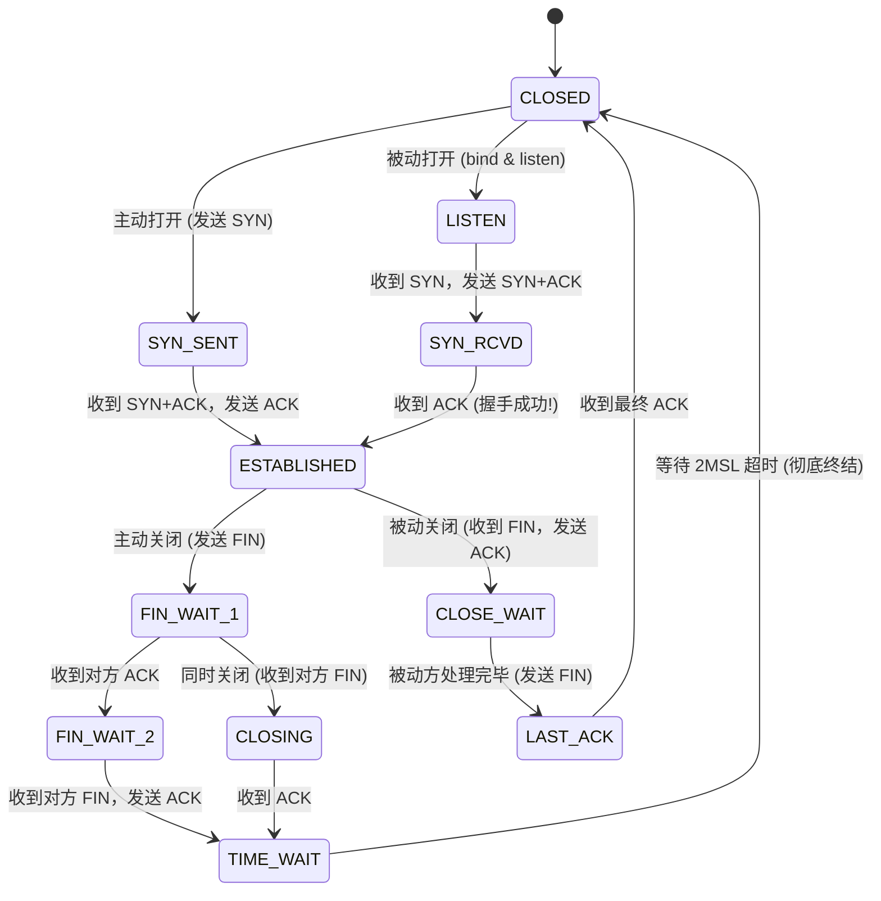
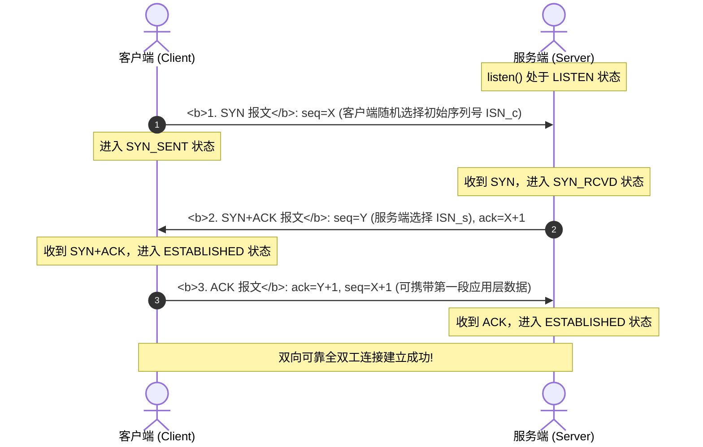
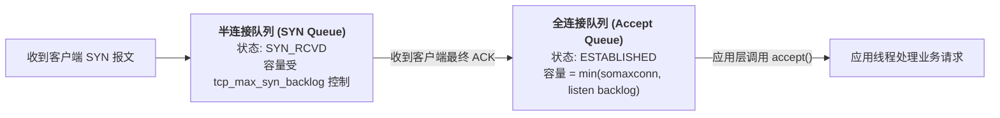

## 引言：在不可靠的不可信介质上，铸造确定性的基石

在专栏第四讲 [应用层与传输层枢纽：DNS 解析全流程、Socket 套接字本质与 TCP/UDP 核心对比](/articles/transport-bridge-dns-sockets-ports-udp-vs-tcp/) 中，我们剖析了 DNS 树状解析、端口门牌号与 Socket 套接字五元组的操作系统内核机理。

然而，真实的互联网是由成千上万个异构局域网通过路由器交织而成的庞大世界：
- **物理世界充满不确定性**：跨洲际海底光缆可能被物理切断、中间路由器的硬件队列可能随时因拥塞而爆仓丢包、无线信号可能随时受到强电磁干扰；
- **无状态的最佳努力交付（Best-Effort）**：IP 协议本身只负责根据地址尽力转发，它不保证数据包是否按序到达、不保证数据包是否在半路丢失，更不保证同一个数据包是否会被网络设备意外复制多份重放。

面对这样一个充满丢包、乱序、重复和延迟波动的混沌底层，人类计算机科学家设计出了计算机网络史上最伟大的杰作之一 —— **TCP（Transmission Control Protocol，传输控制协议）**。

它以精妙的**序列号（Sequence Number）确认机制、双向滑动窗口（Sliding Window）与严谨的 11 状态机**，在绝对不可靠的 IP 网络上凭空抽象出一条**无差错、不丢失、不重复且按序到达的全双工字节流（Byte Stream）通道**。

本文作为**《深入浅出计算机网络：从以太网原理到万卡 InfiniBand 架构实战》的第五讲**，将带你穿透网络层与传输层：从 **IP 路由选路与 CIDR** 开始，深入剖析 **TCP 三次握手与四次挥手状态机底层原理**，并解密 **滑动窗口与流量控制的核心设计细节**。

---

## 一、 网络层（Layer 3）：IP 报文结构与最长前缀匹配选路

### 1.1 IPv4 报文核心字段物理透视

```
IPv4 报文头部物理结构 (无 Options 时固定 20 字节):
 0                   1                   2                   3
 0 1 2 3 4 5 6 7 8 9 0 1 2 3 4 5 6 7 8 9 0 1 2 3 4 5 6 7 8 9 0 1
+-+-+-+-+-+-+-+-+-+-+-+-+-+-+-+-+-+-+-+-+-+-+-+-+-+-+-+-+-+-+-+-+
|Version|  IHL  |Type of Service|          Total Length         |
+-+-+-+-+-+-+-+-+-+-+-+-+-+-+-+-+-+-+-+-+-+-+-+-+-+-+-+-+-+-+-+-+
|         Identification        |Flags|      Fragment Offset    |
+-+-+-+-+-+-+-+-+-+-+-+-+-+-+-+-+-+-+-+-+-+-+-+-+-+-+-+-+-+-+-+-+
|  Time to Live |    Protocol   |         Header Checksum       |
+-+-+-+-+-+-+-+-+-+-+-+-+-+-+-+-+-+-+-+-+-+-+-+-+-+-+-+-+-+-+-+-+
|                       Source IP Address                       |
+-+-+-+-+-+-+-+-+-+-+-+-+-+-+-+-+-+-+-+-+-+-+-+-+-+-+-+-+-+-+-+-+
|                    Destination IP Address                     |
+-+-+-+-+-+-+-+-+-+-+-+-+-+-+-+-+-+-+-+-+-+-+-+-+-+-+-+-+-+-+-+-+
```

1. **TTL（Time to Live，生存时间，8 位）**：
   数据包在经过每一个路由器跳步（Hop）时，TTL 强制减 1。当减至 0 时，路由器直接丢弃并向源端发送 ICMP Time Exceeded。**这是防止网络因环路路由导致数据包在互联网中无限死循环的核心兜底机制**；
2. **Identification、Flags 与 Fragment Offset（分片三剑客）**：
   当 IP 数据包体积超过出口链路的 MTU（如 1500 字节）且 DF（Don't Fragment）标志未置 1 时，路由器会执行 IP 分片。所有分片具有相同的 Identification。接收端根据 Offset 组装。在现代高性能网络中，分片会导致严重的丢包重传放大，现代系统通过 **PMTUD（路径 MTU 发现）** 强制设置 DF=1，从源头杜绝网络层分片；
3. **Protocol（8 位）**：
   标识上层协议，`0x06` 代表 TCP，`0x11` 代表 UDP，`0x01` 代表 ICMP。

### 1.2 CIDR 无类别域间路由与最长前缀匹配（LPM）
在早期，IP 地址被粗暴划分为 A、B、C 类，导致公网 IP 迅速枯竭。1993 年引入的 **CIDR（无类别域间路由，形如 `192.168.1.0/24`）** 打破了分类边界。

在 Linux 内核或物理路由器转发数据包时，路由表可能同时匹配多条规则：
- 规则 A：`10.0.0.0/8` via `eth0`
- 规则 B：`10.1.0.0/16` via `eth1`
- 规则 C：`10.1.2.0/24` via `eth2`

**最长前缀匹配（Longest Prefix Match, LPM）原则**：当目的 IP 为 `10.1.2.55` 时，虽然三条规则全部匹配，但内核**永远挑选子网掩码最长、地址空间最精确的那条规则（规则 C，/24）执行转发！** 在 Linux 内核底层，该查询依赖高度优化的 Trie 树（LC-Trie）数据结构完成。

---

## 二、 传输层（Layer 4）：TCP 11 种状态全景变迁与握手挥手

TCP 协议将网络通信抽象为两个终端端点之间的状态机，其完整的生命周期由经典的 **11 种状态** 构成：



### 2.1 三次握手深度剖析：为什么两次不行？四次多余？



#### 为什么必须是三次？
1. **防止旧的历史重复连接初始化（Stale Connection Recovery）**：
   假设网络中滞留了一个已经超时的旧 SYN 报文。如果只有两次握手，服务端收到该滞留包后立刻回复 ACK 并建立连接，白白占用内存等待数据；而在三次握手中，客户端收到响应发现 `ack` 号不是自己当前期望的，会立即向服务端发送 **RST 报文** 终止异常连接；
2. **双方初始序列号（ISN）的双向对齐**：
   TCP 是全双工通信，每一方都必须独立向对方宣告自己的初始序列号（ISN），并得到对方的显式确认。客户端向服务端告知 $X$ 并获得确认（握手 1、2），服务端向客户端告知 $Y$ 并获得确认（握手 2、3），合并后恰好为 3 次交互！

### 2.2 半连接队列、全连接队列与 SYN Flood 洪水攻击防御

在三次握手期间，Linux 内核为服务端套接字维护着两个关键队列：



#### 致命灾难：SYN Flood 攻击
黑客通过伪造海量虚假源 IP 向服务端狂发 SYN 报文，且故意不回最后一个 ACK。服务端的半连接队列会在几毫秒内被挤爆，导致合法用户的正常连接全部被丢弃。

#### 生产解法：SYN Cookies 算法
在 `/etc/sysctl.conf` 中开启：
```bash
net.ipv4.tcp_syncookies = 1
```
- **工作机理**：当半连接队列满载时，内核**不再在内存中为新连接分配任何数据结构**；
- 而是利用源 IP、源端口、目的 IP、目的端口以及当前时间戳，通过散列算法秘密计算出一个特征值作为服务端序列号 $Y$（即 SYN Cookie）返回；
- 只有当客户端回包合法的 ACK 时，服务端逆向校验 Cookie 成功，才在最后一刻原子分配连接结构，**彻底化解内存被消耗殆尽的风险！**

### 2.3 四次挥手与 TIME_WAIT 状态的第一性原理
TCP 关闭连接必须经过四次握手，因为 TCP 支持“半关闭（Half-Close）”：一方数据发完发送 FIN，只代表自己不再发送数据，但仍然有能力接收对方尚未发送完毕的数据。

#### 为什么主动关闭方必须在 TIME_WAIT 状态停留 2MSL？
MSL（Maximum Segment Lifetime）是报文在网络中的最大生存时间（Linux 默认 30 秒，2MSL 约为 60 秒）。
1. **保证最后一个 ACK 能够可靠到达被动关闭方**：
   如果客户端发送的最后一个 ACK 丢失，服务端会重传 FIN。客户端留在 TIME_WAIT 状态能够捕获该重传 FIN 并重新发送 ACK；如果客户端发完立刻释放端口，服务端重传时会收到 RST 报错；
2. **使网络中滞留的所有旧报文彻底消逝**：
   停留 2MSL 能够保证本次连接产生的所有数据包在物理网络中彻底自然死亡，防止新连接复用了相同的 IP 和端口时收到迟到的旧数据包产生数据错乱。

---

## 三、 滑动窗口与流量控制（Flow Control）

TCP 之所以能够跑出极高的网络吞吐，核心在于其**流水线式滑动窗口机制**，它摆脱了“发一个包等一个 ACK”的低效停等模式。

```
TCP 发送端滑动窗口模型:
          已发送并已确认          已发送未确认       允许发送但尚未发送       不可发送 (超窗)
        [ ... 1 2 3 4 ]       [ 5 6 7 8 ]        [ 9 10 11 12 ]       [ 13 14 15 ... ]
                              |<---------- 发送窗口 (SND.WND) --------->|
                              ^                  ^                    ^
                           SND.UNA            SND.NXT              SND.UNA + SND.WND
```

1. **SND.UNA（Send Unacknowledged）**：最早未被确认的字节序列号；
2. **SND.NXT（Send Next）**：下一个待发送的字节序列号；
3. **通告窗口（Advertised Window, win）**：由接收端在 TCP 报文中实时回传，告诉发送端“我当前的内核接收缓冲区还剩下多少字节的空间”。

### 3.1 突破 64KB 限制：Window Scale (窗口缩放选项)
TCP 头部原本只预留了 16 位来记录窗口大小，最大只能声明 $2^{16} - 1 = 65,535\,\text{Bytes}$（64KB）。在高带宽长延迟（BDP 巨大）的现代光纤网络中，64KB 窗口连 100Mbps 带宽都无法跑满！
- 现代网络通过在握手时协商 **TCP Window Scale（RFC 7323）**，将窗口字段向左位移最多 14 位，使得最大滑动窗口扩展至 **1GB**！
- 生产配置：必须确保 `net.ipv4.tcp_window_scaling = 1` 处于启用状态。

### 3.2 糊涂窗口综合征与 TCP_NODELAY 实战
在高频交易、游戏网关或微服务 RPC 调用中，开发者经常遭遇延迟暴涨。这往往源于 **Nagle 算法与延迟确认（Delayed ACK）的致命冲突**：
- **Nagle 算法**：发送端如果积攒的数据不足一个 MSS 且存在未确认数据，强制等待攒够或者收到 ACK 才发，目的是防止网络充斥小包；
- **Delayed ACK**：接收端收到数据不立刻发 ACK，强制等待 40ms~200ms 试图捎带应用层响应；
- **死锁灾难**：发送端等 ACK，接收端等数据，两者面面相觑傻等 40ms！
- **生产必配**：所有面向低延迟 RPC（如 gRPC、Redis 客户端、网关）的套接字，必须在应用层显式开启：
  ```c
  int flag = 1;
  setsockopt(sock, IPPROTO_TCP, TCP_NODELAY, (char *)&flag, sizeof(int));
  ```

---

## 四、 生产级 TCP 内核参数极限调优

```bash
# 1. 扩容全连接队列与半连接队列
net.core.somaxconn = 65535
net.ipv4.tcp_max_syn_backlog = 65535

# 2. 启用客户端端口复用 (仅在客户端安全复用处于 TIME_WAIT 的套接字)
net.ipv4.tcp_tw_reuse = 1

# 3. 调优动态接收/发送缓冲区 (最小值 / 默认值 / 最大物理内存上限，单位字节)
net.ipv4.tcp_rmem = 4096 87380 16777216
net.ipv4.tcp_wmem = 4096 65536 16777216

# 4. 优化断连保活机制 (防止僵尸死连接霸占文件句柄)
net.ipv4.tcp_keepalive_time = 300     # 5 分钟无数据开始探测
net.ipv4.tcp_keepalive_intvl = 15     # 每隔 15 秒探测一次
net.ipv4.tcp_keepalive_probes = 3     # 连续 3 次无响应判定断开
```

---

## 五、 总结与进阶预告

网络层与传输层的架构，展示了分布式可靠通信的巅峰设计艺术：
- **IP 协议与 CIDR** 确立了全球网络图谱的寻址经纬，LPM 最长前缀匹配保证了高效转发；
- **TCP 三次握手与四次挥手** 以严密的因果序与 11 状态机，战胜了物理信道的异步不可靠与历史延迟包冲击；
- **滑动窗口与流量控制** 精准平衡了通信两端的内存水库。

然而，单纯的端到端流量控制，只能保护**通信接收方的内存不被冲垮**，却无法感知**中间物理网络链路与路由器的拥塞状态**：
- 当数千个客户端同时向网络中注入海量数据包时，路由器缓存区瞬间被打爆，网络迅速陷入吞吐暴跌的“拥塞崩溃”；
- 从经典的丢包驱动算法（Reno, Cubic），到 Google 颠覆性的瓶颈带宽与往返时延驱动模型 **BBR**，拥塞控制经历了怎样的数学革命？
- 为什么在 2026 年，甚至连 TCP 协议本身都开始被基于 UDP 的 **HTTP/3 (QUIC)** 所革新？

在接下来的**专栏第六讲**中，我们将全面杀入网络控制理论的最前沿 —— **[TCP 拥塞控制演进史与高性能传输：从 Reno、Cubic 到 BBR 数学模型，以及 HTTP/2 到 HTTP/3 (QUIC) 协议栈革命](/articles/tcp-congestion-control-reno-cubic-bbr-quic-http3/)**！

---

## 常见问题 (FAQ)

### Q1: 为什么 TCP 连接建立需要三次握手，而关闭连接却需要四次挥手？
**根本原因：全双工通道中“数据发送完成”与“对端处理完成”的异步性**。
- **握手时可以合并（3 次）**：在建立连接时，服务端收到客户端的 SYN 建立请求后，可以直接将对客户端的确认（ACK）与自己发起连接的请求（SYN）打包在**同一个报文（SYN+ACK）**中一次性发回给客户端，因此仅需 3 次交互；
- **挥手时无法立即合并（4 次）**：当客户端发送 FIN 表明自己没有数据要发时，服务端往往仍有尚未处理完毕的业务数据或排队数据需要发送给客户端。因此服务端必须**先单独回复一个 ACK** 确认收到断开请求；随后等待自身业务处理完毕、调用 `close()` 关闭套接字时，才独立向客户端发送 FIN 报文。由于服务端的 ACK 和 FIN 无法立即合并，导致挥手拆分为 4 个步骤。

### Q2: 生产服务器上累积了数万个 `TIME_WAIT` 连接，可以直接把 Linux 内核参数 `tcp_tw_recycle` 开启来强行快速回收吗？
**绝对禁止！在现代生产网络中开启 `tcp_tw_recycle` 会引发毁灭性的客户端连接随机丢弃！**
`tcp_tw_recycle` 依赖于每个 IP 的 PAWS（防止序列号回绕）时间戳单调递增。在现代互联网中，几乎所有移动端用户和家庭宽带都会穿透公网 NAT 网关出口。不同客户端设备的主机时间戳存在微小的快慢差异，一旦开启快速回收，NAT 网关后时间戳较慢的正常用户请求会被服务端判定为历史滞留包直接粗暴丢弃，导致大面积用户报 502/连接超时。
**正规治理手段**：开启 `net.ipv4.tcp_tw_reuse = 1`（仅对安全连接复用有效），并在服务端使用带有连接池的反向代理（如 Nginx/Envoy）向后端保持长连接。

### Q3: 什么是 Nagle 算法与 Delayed ACK 之间的“40ms 延迟死锁”陷阱？微服务架构中应如何彻底防范？
Nagle 算法的核心是“每次发送小包前，必须等待前一个数据包的 ACK 确认回来”；而接收端的 Delayed ACK 则策略性地等待（通常延迟 40ms），试图与后续的数据一同捎带回复。
当微服务发起一个包含小请求头与小请求体的 RPC 调用时，第一段数据发出后触发 Nagle 等待 ACK；而接收端由于没收到后续数据触发 Delayed ACK 延迟计时器。两者陷入双向等待僵局，导致即使在同一机房内，单个 RPC 请求耗时也会凭空飙升 40ms！
**防范方案**：在所有基于 TCP 的高性能服务（如 gRPC、Dubbo、数据库连接池、Netty）中，**无条件调用 `setsockopt(..., TCP_NODELAY)` 禁用 Nagle 算法**，确保小包数据能够被物理网卡立刻打向网络。
