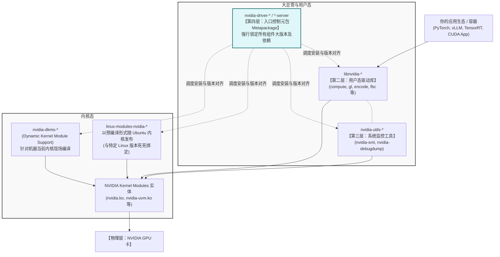

## 新手的梦魇：为什么总因为装驱动导致系统崩溃？

在配置深度学习工作站或大模型推理服务器时，NVIDIA GPU 驱动的部署可能是最让人抗拒的环节。

如果你曾直接下载 NVIDIA 官网的 `.run` 文件并在一阵无脑回车后导致桌面崩溃、或者因为 Ubuntu 内核自动更新导致 `nvidia-smi` 突然报错 `NVIDIA-SMI has failed...`，这说明你尚未掌握 Linux 环境下 NVIDIA 发行套件的真实逻辑。

在终端中输入 `apt search nvidia-driver` 时，长达百行的结果（`ubuntu-drivers`、`nvidia-dkms`、`libnvidia-compute`、带 `-server` 的包）常常让人迷失。

**要彻底治愈这种恐惧，唯一的出路是抛弃图形界面一键安装的惯性思维，真正理解 NVIDIA 驱动栈在 Linux 下的“五层分层包关系”。**

---

## 一分钟心法：理清命名的四句真言

在跳入复杂的系统架构图前，请把这四句话死死印在脑子里：

1. **`linux-modules-nvidia-*` 或 `nvidia-dkms-*` 才是真正的驱动本体**：它们运行在内核态（Kernel Space），直接与物理显卡硬件通信。
2. **`nvidia-driver-*` 只是一个空壳清单（Meta-package）**：它被称为入口元数据包，本身几乎不含代码，它的作用是将一堆配套的内核模块、用户库、管理工具统筹起来，确保它们版本严格对齐。
3. **`libnvidia-*` 是用户态的翻译官（Userspace Libraries）**：像 PyTorch 或 vLLM 这样的上层框架，根本不会直接找内核，而是直接调用这个库（比如 `libnvidia-compute`）。
4. **`nvidia-utils-*` 是系统工具箱**：大名鼎鼎的 `nvidia-smi` 监控面板，就存放在这个包里。

---

## 剖析到底：NVIDIA 驱动栈全景分层架构

了解了心法，我们来看看当你运行一行 Python PyTorch 当时代码时，信号是如何一层层穿越并到达显卡的。



### 第一层：物理接口层 (Kernel Modules)
这是所有应用的根基。无论你装了多少华丽的框架，如果 `.ko` 模块没有成功挂载到 Linux 内核上，GPU 对于操作系统就是一块发热的砖头。
* **分支 A：静态预编译路线 (`linux-modules-nvidia-xxx`)**：Ubuntu 官方将其与特定的 Ubuntu Kernel 绑定。安装极快，但**只要你的 Linux Kernel 升级了**，它直接罢工。
* **分支 B：动态现编路线 (`nvidia-dkms-xxx`)**：DKMS (动态内核模块支持) 机制的王者。它会自动拉取驱动源码 (`nvidia-kernel-source`) 和你当前内核的头文件 (`linux-headers`) 进行现场编译。**推荐使用，这能极大抵御 Linux 内核更新带来的驱动断裂**。

### 第二层：用户态驱动库 (Userspace Libraries)
**包名范例**：`libnvidia-compute-535`, `libnvidia-gl-535`, `libnvidia-decode-535`
你的 AI 框架需要的底层 CUDA Driver API，就是由 `libnvidia-compute` 收口的；搞图形图像的同学则靠 `libnvidia-gl`。
**避坑警告**：如果因为你的违规操作导致这部分库的版本（比如是 530）和第一层内核模块（比如是 535）对不上时，系统必报恶毒错误：`Driver/library version mismatch`。

### 第三层：管理与观测工具层 (Utilities)
**包名范例**：`nvidia-utils-535` 或 `nvidia-utils-535-server`
包含平时排错、监控的所有命令行工具。

### 第四层：版本对齐大总管 (Metapackage)
**包名范例**：`nvidia-driver-535` 或 `nvidia-driver-535-server`
平时你只需要通过包管理器告诉它就行了：`apt install nvidia-driver-535-server`。它犹如一位项目经理，会把前面三层所有的依赖按照正确且唯一兼容的版本全部拉扯下来，省去了你一个个手动指定的麻烦。

### 【特供补丁层】多卡高速公路维护部 (Fabric / NVSwitch)
**包名范例**：`nvidia-fabricmanager-*`, `libnvidia-nscq-*`
专门针对拥有 **NVSwitch 芯片**级别的多卡巨兽服务器（HGX / DGX）。
普通机器不需要装这个。HGX/DGX 如果不单独把 Fabric Manager （后台守护进程）跑起来并把它和具体的 NVIDIA Driver 大版本对齐，昂贵的 NVLink 就相当于一根断掉的光纤，卡与卡之间无法高速通信。

---

## 核心抉择：带 `-server` 后缀的包 vs 不带后缀的区别

在 `apt search` 结果中，最大的迷茫来自于到底选 `nvidia-driver-535` 还是选 `nvidia-driver-535-server`？一条清晰的准线是：

**你的屏幕用来开网页打游戏的，选通用版；你的机器藏在机房里跑矩阵相乘和 Docker 的，选 `-server`。**

| 对比维度 | 带 `-server` 尾缀的包 | 不带 `-server` 的通用包 |
|---------|---------------------|------------------------|
| **适用人群** | **数据中心运维、算法工程师、模型部署工程师** | 游戏玩家、CUDA 学习桌面用户、UI/UE 设计师 |
| **功能定位** | 服务器、计算优先 (Compute) | 桌面图形、显示优先 (Graphics) |
| **包含组件** | 包含底座、CUDA 支持、NVIDIA Container API 依赖。部分发行版默认切掉累赘的 3D/GL 库以追求极简。 | 必须包含 OpenGL/Vulkan/Xorg 全套图形界面驱动，让你的显示器亮起来。 |
| **生命周期** | 长周期稳定性（LTS）。极少因为小补丁断更。部分可配合 NVSwitch 组件。 | 短平快。频繁获取最新的桌面游戏渲染器优化补丁。 |

> 注：NVIDIA 官方在版本 >= 590 的部分仓库中启用了 Version Locking，包名体系有了简化（可能不会强显示后缀），此时一切以真实仓库策略为准，但它们仍然在概念上分为「生产服务线」和「图形显示线」。

---

## 实战四步曲：分场景最佳部署实践

这里为你剥离出企业级与个人研发中最常见的 4 种实际应用场景部署套路。所有操作均以 Ubuntu (APT 包管理器) 为例。

### 场景 1：现代企业标准方案 —— Docker 容器化大模型部署

**特征**：宿主机只提供基础设施能力，绝不安装任何易引起冲突的 AI 框架或 CUDA Toolkit。所有的依赖隔离在 Docker 容器内。

**实施步骤**：
1. **确认被识别**： `lspci | grep -i nvidia` (主板能摸到 GPU，此乃先决条件)。
2. **安装底座 (Metapackage)**： 
   ```bash
   sudo apt update
   # 强烈建议安装带 -server 后缀的。系统会自动采用预编译或 DKMS 编译内核模块
   sudo apt install nvidia-driver-535-server
   ```
3. **重启并自检**： 
   ```bash
   sudo reboot
   # 重启后应该能在面板上看到显卡型号和最高兼容的 CUDA 版本
   nvidia-smi 
   ```
4. **安装 NVIDIA Container Toolkit**（核心破局点）：
   过去使用 `nvidia-docker2` (已彻底淘汰)。你需要按照 NVIDIA 官方文档，将 `nvidia-ctk` 仓库导入，并执行：
   ```bash
   # 为 Docker 安装并配置钩子
   sudo apt-get install -y nvidia-container-toolkit
   sudo nvidia-ctk runtime configure --runtime=docker
   sudo systemctl restart docker
   ```
5. **部署真身**：
   无需在外部安装庞大的 CUDA Toolkit。直接在 Docker 中拉模型：
   ```bash
   # 容器内跑通了 nvidia-smi，就意味着所有的链条严丝合缝
   docker run --rm --gpus all nvidia/cuda:12.1.1-base-ubuntu22.04 nvidia-smi
   ```

### 场景 2：个人极客工作站部署 —— "我只有一块 4090，要跑 AI 兼顾写代码"

**特征**：显示器直插在这块显卡上，既需要加载桌面 GUI，又需要在本地终端里直接跑本地模型测试。

**实施步骤**：
1. **安装通用版底座**（切勿使用 `-server`，否则可能会失去桌面/进入黑屏）：
   ```bash
   sudo ubuntu-drivers autoinstall
   # 或者手动指定
   sudo apt install nvidia-driver-535
   ```
2. **安装宿主机 CUDA Toolkit**（因为不在 Docker 跑）：
   使用官方网站下载并安装对应版本的 `cuda-toolkit` 即可。这时候编译器 `nvcc` 会被直接种在你主机的 PATH 里。

### 场景 3：传统裸机 ML 训练服务器 (不使用 Docker 方案)

**特征**：实验室共用机器，多人通过 SSH 登录。因为历史原因没有上容器方案，必须在物理机配置所有炼丹环境。

**部署逻辑**：
这其实是从**场景1**延伸：先打通这五层驱动栈 (`nvidia-driver-535-server`)。随后，这台物理机还要作为巨大的软件容器，被层层套上去：
驱动 -> `CUDA Toolkit` -> `cuDNN` -> `TensorRT` -> `Python Env` -> `框架`。

**致命痛点**：因为全部叠在系统层面，一旦张三需要跑 TensorFlow（依赖旧 CUDA），李四需要跑最新的 vLLM（依赖最新 CUDA），环境就会发生冲突撕裂。这就是我们疯狂推崇**场景1**的原因。

### 场景 4：数据中心怪兽 —— HGX / DGX NVSwitch 节点

**特征**：一般为昂贵的单节点 8 卡系统。
一旦到了这一步，绝不是靠 `apt install nvidia-driver` 就能躺平的。你必须遵循严格的驱动纪律。

1. **部署常规驱动**：按照场景 1 部署并确认模块运行正常。
2. **部署 Fabric Manager**：
   这一步不仅要装，而且它的版本必须跟当前实际生效的 Driver **极其精准地匹配 (精确到次要版本号)**！
   ```bash
   sudo apt install nvidia-fabricmanager-535
   sudo systemctl enable --now nvidia-fabricmanager
   ```
3. 如果这步失败或版本不匹配，GPU 集群将在日志中抛出 NVSwitch 无法初始化的问题，跨卡大模型张量并行 (TP>1) 将会彻底死机。

---

## 惊魂时刻：故障排查与版本平滑跨越策略

系统环境在漫长的使用中，一定会面临驱动大版本跨越或内核更新等棘手维护场景，这里是最常摔倒的三个大坑。

### 必修课：如何从低版本驱动跨越升级到高版本？

**场景描述**：你现有的驱动是旧版本（如 `525` 甚至更早），为了跑最新的模型框架或匹配新的 CUDA 12.x 生态，必须要把底座升级到更高的大版本（如 `535` 甚至 `550`）。

**致命错误**：直接敲 `apt install nvidia-driver-550-server` 覆盖安装。这极容易导致新版本的包试图覆盖旧包时产生依赖死锁，特别是 Userspace 和 Kernel Module 极其容易发生残留混装，导致 `dpkg` 甚至进入无法自我恢复的崩溃状态。

**真正企业级无损升级四步曲**：
1. **停机并清理旧战场 (Purge)**：必须将旧分支连根拔起。
   ```bash
   # 停掉所有占用 GPU 的守护进程 (如 Docker, Kubelet)
   sudo systemctl stop docker
   
   # 彻底卸载带 nvidia 和各类关联 cuda/cublas 字段的旧包
   sudo apt-get purge -y "*nvidia*" "*cublas*" "*cufft*" "*cufile*" "*curand*" "*cusolver*" "*cusparse*" "*gds-tools*" "*npp*" "*nvjpeg*" "nsight*"
   sudo apt-get autoremove -y
   ```
2. **清理残留模块链接**：如果机器跑过 DKMS，有时候卸载并不会自动抹掉编译残留，这会暗杀你的新驱动。
   ```bash
   sudo rm -rf /var/lib/dkms/nvidia*
   ```
3. **犹如新机般安装目标分支**：
   ```bash
   sudo apt update
   sudo apt install nvidia-driver-550-server   # 填入你需要的目标版本
   ```
   > 提醒：如果你是多卡 NVSwitch (场景 4) 用户，在此刻必须一并安装 `nvidia-fabricmanager-550`。
4. **重启生效**：内核驱动层的更迭，唯有彻底重启（`reboot`）方能生效。重启完毕后输入 `nvidia-smi` 验证升级大业。

### 巨坑 1：内核静默更新导致的 `nvidia-smi` 罢工

**现状描述**：
机房平时好好的，周末因为安全更新 Ubuntu 偷偷执行了 `apt-get upgrade`，顺手把 Linux Kernel 从 `5.15.0-70` 升到了 `5.15.0-80`，重启后 `nvidia-smi` 失联。

**底层原因**：由于使用预编译的 `.ko` 模块，它死死绑在了旧内核目录 `/lib/modules/5.15.0-70/` 下。全新的内核启动后，在自己的目录下找不到 NVIDIA 驱动。

**抢救姿势**：
* 如果你是 DKMS 用户，只需让 DKMS 对着新内核重写即可：
  ```bash
  sudo apt install linux-headers-$(uname -r)
  sudo dpkg-reconfigure nvidia-dkms-535
  ```
* 如果必须走预编译路线，只能补充新包：
  ```bash
  sudo apt install linux-modules-nvidia-535-$(uname -r)
  ```

### 巨坑 2：裸机升级的大忌

**千万不要在驱动不匹配的情况下，先去升级裸机的 CUDA 发行包！**

无论是从 11.x 升向更现代的 12.x/13.x 版本，一定要**先升级最底层的驱动栈 (driver/module)** 稳住底座，重启确认机器 GPU 一切如常后，再去升级或者利用不同内核加载新版本的框架 / CUDA Toolkit。底层的 Driver 对上层的软件 API 有极好的向下兼容性，反之轻则显卡利用率奇差，重则直接崩溃。

---

## 快速自诊应急指令册

把这段话贴在你的屏幕旁边，在你觉得快要完蛋的时候，一行行对照敲击：

| 排雷方向 | 具体指令 | 能看到什么？ |
|---------|---------|-------------|
| **物理检查** | `lspci \| grep -i nvidia` | 只要有输出，证明主板和 CPU 正确捏住了显卡。 |
| **内核版本** | `uname -r` | 记住这串数字，它是驱动编译的“身份证件”。 |
| **到底装了啥** | `apt-mark showmanual \| grep nvidia` | 系统目前是受哪个 Meta 手册控制的，有没有多余的死尸包。 |
| **状态确认** | `nvidia-smi` | 表明这套五层驱动栈从内核穿越用户态，打通了！ |
| **检验容器底座** | `docker run --rm --gpus all nvidia/cuda:12.1.1-base-ubuntu22.04 nvidia-smi` | 如果跑完输出状态信息，证明你的 Container Toolkit 环境金身大成。 |

只要你能从“这 5 个层级”的视角俯瞰整个报错信息，你就一定能够像庖丁解牛一样，指哪打哪地解决所有驱动深坑。祝武运昌隆！
