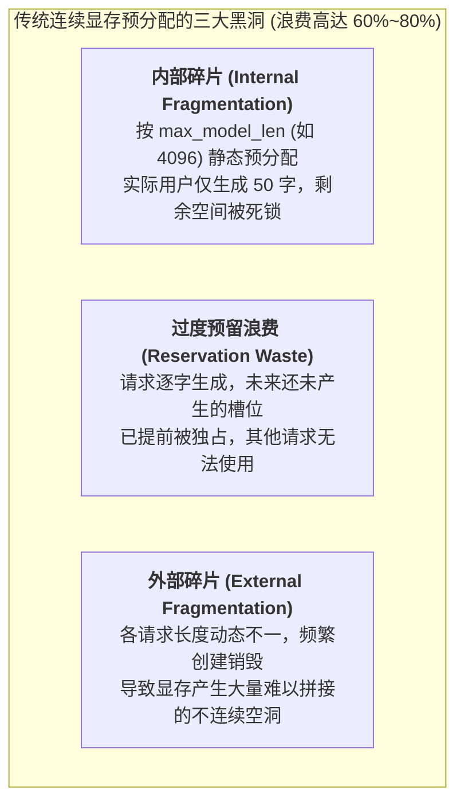
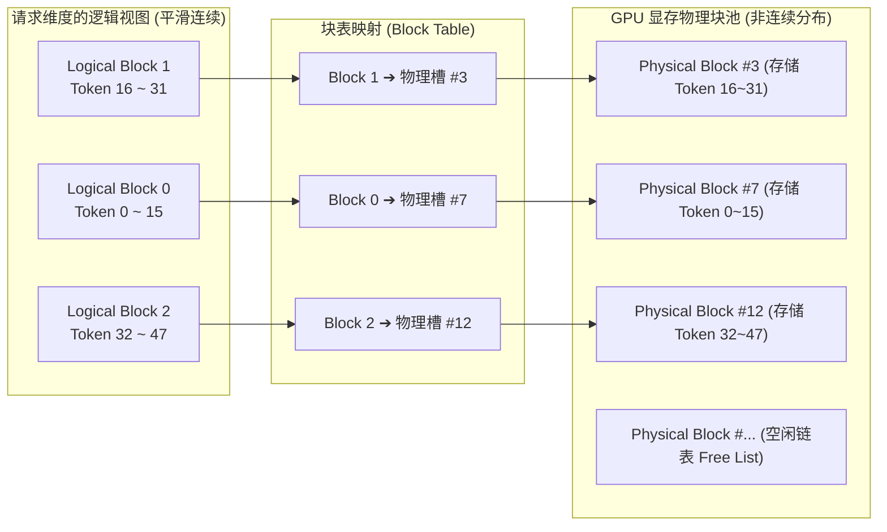
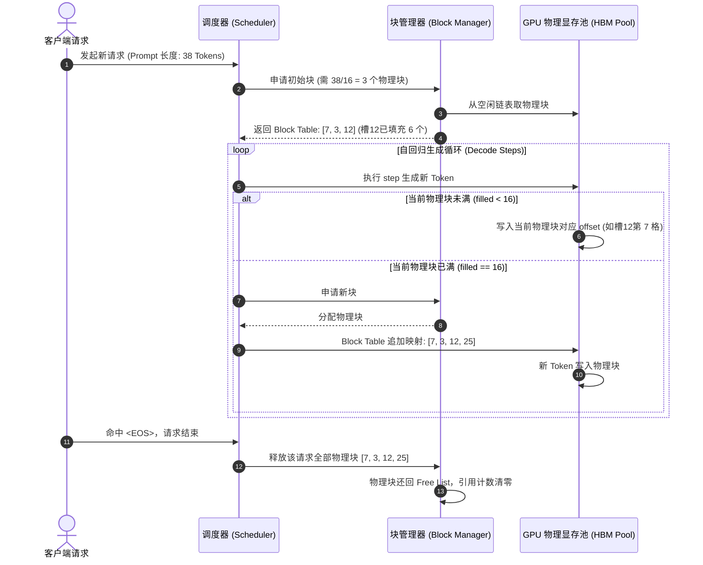
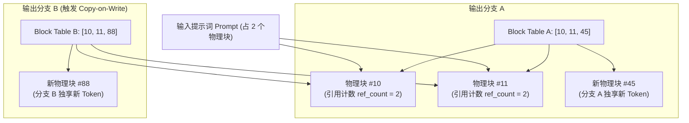

## 引言：被“浪费”的八成显存

在上一讲 [从 model.generate() 说起：Roofline 模型与 Prefill/Decode 的物理撕裂](/articles/inference-roofline-prefill-decode/) 中，我们从第一性原理推导出一个残酷的物理事实：自回归解码（Decode）阶段是极度**访存带宽密集型（Memory-bandwidth bound）**的。为了提升 GPU 的有效利用率，唯一的出路就是尽可能提高并发批大小（Batch Size）。

然而，当早期的推理系统（如初代 FasterTransformer 或基于原生 PyTorch 的服务架构）试图拉大并发时，工程师们遭遇了当头一棒：

**一张标称 80GB 的 A100/H100 显卡，往往并发请求仅仅跑到十几路，系统就抛出致命的 `CUDA Out of Memory (OOM)` 异常。更诡异的是，如果细致统计当前正在生成的实际 Token 数量，这些 Token 对应的 KV Cache 物理体积极限往往还不到 20GB！**

剩下的 60GB 宝贵 HBM 显存到底去哪了？

根据加州大学伯克利分校（UC Berkeley）团队在 SOSP 2023 发布的里程碑论文《Efficient Memory Management for Large Language Model Serving with PagedAttention》，在传统的大模型服务系统中，**高达 60% 至 80% 的 GPU 显存处于纯粹的无效浪费状态**。

为了彻底砸碎这堵无形的显存高墙，**vLLM** 携其开创性的 **PagedAttention** 横空出世。本文将为你深入揭示：**操作系统存在了数十年的“虚拟内存分页机制”，是如何跨界降临到 GPU 显存中，并以近乎优雅的方式重塑现代大模型推理引擎格局的。**

---

## 一、 显存黑洞：传统连续分配的三大原罪

在 PagedAttention 诞生之前，大模型显存管理之所以如此低效，是因为深度学习框架（如 PyTorch、TensorFlow）的底层张量分配哲学是**“物理地址必须强连续（Contiguously Allocated）”**。

在自回归生成场景下，强连续内存模型直接引发了三大致命的“显存黑洞”：



### 1. 内部碎片（Internal Fragmentation）
由于大模型是根据 `<EOS>` 终止符动态停止生成的，系统在收到用户请求时，**根本不可能提前预知模型最终会输出多少个 Token**。
为了防止生成过程中途内存溢出，传统的朴素做法是：按照该模型所支持的最大上下文长度（`max_model_len`，例如 4096 或 8192），为每个请求一次性申请一段能够容纳完整上下文的超大连续显存块。
* 如果用户发起的只是一个简单的单轮问答（例如输入 100 Token，回答 50 Token）；
* 那么系统为该请求预分配的剩余近 4000 个 Token 的显存槽位，在长达数秒的推理过程中**被彻底死锁，谁也用不了**。

### 2. 过度预留浪费（Reservation Waste）
即便系统不按最大长度预分配，而是按照某种估计值（如每生成 128 Token 动态扩容一次），由于张量在内存中必须保持物理连续，系统每次扩容时，往往必须经历昂贵的内存重新分配（Re-allocation）与显存拷贝（Memory Copy）。
为了避免频繁拷贝导致的吞吐暴跌，分配器不得不预留出巨大的安全缓冲带（Buffer），这些缓冲带在绝大部分时间处于空闲待命状态。

### 3. 外部碎片（External Fragmentation）
在多用户高并发生产环境下，请求随时到达，随时终止。请求 A 长度为 256，请求 B 长度为 2048，请求 C 长度为 512。随着不同生命周期的连续显存块被频繁申请与释放，GPU 显存空间会被切割成支离破碎的“内存孤岛”。
明明显存池中剩余总空闲容量还有 15GB，但当一个需要 2GB **连续显存**的新长文本请求到达时，系统却因为找不到一块足尺寸的连续物理空间而被迫抛出 OOM 拒绝服务！

---

## 二、 虚拟内存跨界：PagedAttention 的核心设计

面对碎片化顽疾，计算机科学早在数十年前的操作系统设计中就交出过标准答案 —— **虚拟内存分页（Virtual Memory Paging）**。

在 Linux 操作系统中，进程看到的虚拟地址空间是无限且平滑连续的，但底层的物理内存页框（Page Frames，通常为 4KB）却是散落分布在物理内存条各处的。操作系统的内存管理单元（MMU）通过维护**页表（Page Table）**，在硬件层实现了虚拟地址到离散物理地址的无感透明映射。

vLLM 的作者团队将这一天才思想完美移植到了 GPU KV Cache 的管理上，这就是 **PagedAttention**：



### 1. 核心抽象概念解构

* **块大小（Block Size, $B$）**：
  显存划分的最小物理粒度。一个 Block 负责存储固定数量 Token（业界普遍采用 $B = 16$ 或 $B = 32$）在全模型层上的 Key 和 Value 张量。
* **逻辑块（Logical Block）**：
  面向单个推理请求的虚拟连续抽象。在模型前向传播计算 Attention 时，序列看起来就像是一个从 Token 0 到 Token $L-1$ 连续排列的常规数组。
* **物理块（Physical Block）**：
  在推理服务初始化时，引擎在 GPU HBM 显存中预先开辟的一大片连续物理内存池，将其整齐划分为数千乃至数万个固定尺寸的物理块（Slot）。每一个物理块都具备全局唯一的 `block_number`。
* **块表（Block Table）**：
  每个请求独享的一个轻量级索引数组。记录该请求的第 $i$ 个逻辑块对应显存池中的哪一个物理块编号，以及当前最新物理块中已经填充了多少个 Token（`filled_count`）。

### 2. 碎片消除的数学证据

在 PagedAttention 机制下：
* **外部碎片被彻底归零**：因为所有物理块的尺寸都是完全相同且固定的（例如固定存储 16 个 Token 的 KV 张量）。显存池中永远只有“借出”和“归还”，没有任何大小不一的空洞无法复用；
* **内部碎片被压缩至物理极限**：仅在序列的最后一个逻辑块可能出现未填满的情况。对于块尺寸 $B=16$ 的系统，每个请求最多只浪费不到 16 个 Token 的显存空间，平均内部碎片损失仅为：
  $$\text{Average Waste} = \frac{B}{2} \times \text{Size of 1 Token KV Cache}$$
  对于单请求，显存浪费率直接从过去的 60%~80% 暴跌至 **4% 以下**！

---

## 三、 动态显存池管理机制与生命周期

在 vLLM 等现代推理引擎中，显存的生老病死全部由 CPU 侧高效运行的 **Block Manager（块管理器）** 统一接管。



### 1. 物理张量在 GPU 上的真实内存布局

许多初学者误以为 PagedAttention 是在 Python 里搞很多动态小张量。**绝对不是！**
在 GPU 显存底层，为了确保极致的高速访问，引擎在启动时只调用一次底层内存分配器，为整张显卡创建两个连续的超级物理大张量：`key_cache` 和 `value_cache`。

以半精度（BF16/FP16）且头维度为 $d_{\text{head}}$ 的模型为例，物理张量的真实维度排布通常为：

```python
# vLLM 中单卡物理 Key Cache 张量形态
# 针对 GPU 访存合并（Coalesced Memory Access）进行了维度置换
key_cache = torch.empty(
    size=(num_total_blocks, num_kv_heads, head_size // x, block_size, x),
    dtype=torch.bfloat16,
    device="cuda"
)
# 其中 x = 16 // sizeof(dtype) (对于 16 位浮点，x = 8)
```

每个物理块在连续大张量中占据固定的显存跨度（Stride）。所谓的“分配一个物理块”，在底层不过是 CPU 端将该物理块的整型索引 `block_number` 递给调度表，完全不存在真实的 GPU 显存分配系统调用（`cudaMalloc`），从而实现了**微秒级的零开销分配**。

---

## 四、 共享的魔力：Copy-on-Write 与分叉生成

PagedAttention 最惊艳的工程特性之一，是它天然支持了**跨序列与跨分支的显存零拷贝复用（Copy-on-Write, CoW）**。

在许多生产场景中，同一段前缀往往会被多个请求共享：
1. **Parallel Sampling（并行采样）**：给同一个 Prompt，要求大模型以不同的随机种子同时生成 4 个回答；
2. **Beam Search（束搜索）**：多条候选路径在早期步骤拥有完全相同的祖先历史；
3. **Agent 多分支推理（Tree-of-Thoughts / MCTS）**：智能体在决策树上分叉探索多条工具调用路径。

在传统体系下，同一个 Prompt 的 KV Cache 必须在显存中克隆 4 份，造成 4 倍的显存暴击。而在 PagedAttention 中，这一切由**引用计数（Reference Count）**轻松搞定：



### Copy-on-Write 的执行机制：
1. **初始共享**：当系统由同一个 Prompt 分叉出分支 A 和分支 B 时，分支 A 与分支 B 的 Block Table 前两个条目都同时指向物理块 `#10` 和 `#11`。此时这两个物理块的引用计数变为 `2`；
2. **读时共享**：在计算两者的注意力时，GPU 核心完全可以安全地并发读取物理块 `#10` 和 `#11` 中的 Key/Value 数据；
3. **写时复制（CoW）**：当分支 A 需要向未填满的末尾物理块追加新的 Token 时，Block Manager 检查发现该物理块的引用计数大于 1。为了防止污染分支 B，系统**瞬间申请一个新的物理块 `#45`，将当前块内容深拷贝过去，将分支 A 的指针修改为指向 `#45`，并将原物理块引用计数减 1**。

这种机制为后续 SGLang 研发出颠覆性的 [RadixAttention 树状前缀缓存](/articles/sglang-vs-vllm-architecture/) 奠定了关键的显存架构基础。

---

## 五、 PagedAttention CUDA Kernel 核心实现解密

既然 Key 和 Value 在物理显存上被拆解成了离散分布的碎块，传统的 FlashAttention 或 cuBLAS GEMM 算子根本无法在不连续的地址上直接寻址。

PagedAttention 是如何在 GPU 底层编写 CUDA Kernel，在不引入额外内存搬运的前提下把 Attention 算出来的？

### 1. 块表间接寻址（Indirection Lookups）

在启动 PagedAttention Kernel 时，调度器会将当前批次所有请求的 `block_tables`（以平坦的二维 Int32 Tensor 形式）直接作为入参传入 GPU：

```cpp
// PagedAttention CUDA Kernel 伪代码逻辑核心
template<typename scalar_t, int BLOCK_SIZE>
__global__ void paged_attention_kernel(
    scalar_t* __restrict__ out,               // 输出张量 [num_seqs, num_heads, head_dim]
    const scalar_t* __restrict__ q,           // Query 向量 [num_seqs, num_heads, head_dim]
    const scalar_t* __restrict__ k_cache,     // 物理 Key 显存池
    const scalar_t* __restrict__ v_cache,     // 物理 Value 显存池
    const int* __restrict__ block_tables,     // 块表映射矩阵 [num_seqs, max_blocks_per_seq]
    const int* __restrict__ context_lens,     // 每个请求的当前实际有效长度
    const int max_num_blocks_per_seq
) {
    const int seq_idx = blockIdx.y;           // 当前处理的请求序号
    const int head_idx = blockIdx.x;          // 当前处理的注意力头
    const int cur_context_len = context_lens[seq_idx];
    const int num_blocks = (cur_context_len + BLOCK_SIZE - 1) / BLOCK_SIZE;

    // 1. 加载当前请求在当前头的 Query 向量到片上寄存器
    // 2. 遍历该请求拥有的每一个逻辑块 (Loop over logical blocks)
    for (int block_idx = 0; block_idx < num_blocks; ++block_idx) {
        // 核心解密：通过 block_tables 进行间接内存寻址获取真实物理块编号
        const int physical_block_number = block_tables[seq_idx * max_num_blocks_per_seq + block_idx];
        
        // 计算物理显存中的真实起始指针
        const scalar_t* k_block_ptr = k_cache + physical_block_number * BLOCK_STRIDE;
        
        // 3. 将物理块中的 Key/Value 协同加载进片上共享内存 (SRAM)
        // 4. 执行向量内积点积 QK^T 与 Softmax 局部缩放累计
    }
    // 5. 归一化并将 Attention 输出写回全局显存
}
```

### 2. 为什么间接寻址不会拖慢 GPU 速度？

许多系统优化师最初对 PagedAttention 最大的顾虑是：**每次取内存都要通过 Block Table 转一手，指针跳跃会不会导致 GPU 缓存大量失效（Cache Miss）？**

答案是否定的，原因在于**计算与访存的时空局部性**：
1. **块内高度合并（Coalesced Access）**：一旦通过 Block Table 找到了 `physical_block_number`，在该块内部包含的 16 或 32 个 Token 的所有张量数据，在物理地址上是绝对连续排列的！同一个 Warp 内的 32 个 GPU 线程可以以 128 字节对齐的最佳状态进行合并显存访问；
2. **块表数据极度轻量**：一个包含 100 个 Block 的 4K 长上下文，其 Block Table 仅仅只有 100 个 32-bit 整数（不到 400 字节）。这些元数据在首次访问后便被死死缓存在 GPU 的片上 **L1 / L2 Cache** 中，寻址开销在庞大的 HBM 搬运面前完全可以忽略不计。

---

## 六、 总结与技术全景对齐

通过将操作系统的分页设计引入显存体系，PagedAttention 达成了一系列在当时堪称奇迹的工程突破：
* **显存浪费率从 80% 压低至 4% 以下**；
* **单卡并发承载能力直接翻了 2 到 4 倍**；
* **彻底消灭内存碎片导致的虚假 OOM**；
* **为后续复杂的前缀树缓存（RadixAttention）、流式批处理（Continuous Batching）铺平了底层道路**。

然而，显存管理只是构建高性能推理系统的第一块基石。当我们拥有了高效的显存池之后，如果调度器依然采用粗暴的整批等待策略，长短文本混合依然会导致严重的“排头阻塞”。

在下一讲中，我们将深入探讨大模型并发调度的灵魂枢纽 —— **《高并发批处理演进：从 Continuous Batching 到 Chunked Prefill 消除排头阻塞》**，敬请期待。

---

## 常见问题 (FAQ)

### Q1: 块大小（Block Size）设为 16 还是 32 更好？为什么各大引擎不推荐设为 1 或 128？
Block Size 的选择本质上是**内部碎片率**与**GPU 硬件访存带宽效率**之间的工程博弈：
* **如果设得太小（如 $B=1$ 或 $B=2$）**：虽然内部碎片彻底降到零，但每个物理块太小，无法满足 GPU 全局内存访问的 128 字节内存事务对齐（Coalesced Access）要求，会导致显存带宽有效利用率暴跌；而且 Block Table 规模暴增几十倍，加重 L1 缓存负担；
* **如果设得太大（如 $B=128$）**：末尾未填满带来的平均内部碎片高达 64 个 Token，在短请求主导的高并发 API 场景下，碎片浪费再度抬头；
* **工业界平衡点**：在 A100、H100 等现代 GPU 上，**$B=16$ 或 $B=32$** 恰好能在实现 96% 以上显存利用率的同时，完美贴合 GPU Warp 访存对齐与 Shared Memory 搬运的最佳步长。

### Q2: 既然 PagedAttention 彻底消除了内存碎片，为什么生产中依然可能遭遇 OOM？
PagedAttention 解决的是**“碎片导致的显存虚假耗尽”**，但无法突破**“物理显存总量的绝对上限”**。
在实际高并发场景下，如果涌入的并发请求数量过多，且每个请求都在持续吐字（KV Cache 持续线性膨胀），当整个 GPU 物理池中预先开辟的所有物理块（Physical Blocks）被完全借调一空时，系统依然会面临显存枯竭危机。
此时现代引擎会启动**请求抢占机制（Preemption）**：
1. **Swap（换出机制）**：将处于低优先级的长请求的物理块通过 PCIe 总线换出到 CPU 主机内存（Host DRAM）中，腾出物理块供给活跃请求；
2. **Recompute（重算机制）**：直接中断并释放某个请求的部分生成状态，将其放回等待队列，待显存宽裕时重新 Prefill 并恢复生成。

### Q3: PagedAttention 和模型层面的 GQA / MLA 压缩机制有冲突吗？
完全没有冲突，两者是**底层显存管理与上层算子维度的完美互补**：
* [Kimi KDA 与 DeepSeek MLA](/articles/kimi-kda-deepseek-mla-architecture/) 是在**算法数学层面**，将原本庞大的 KV 向量投影压缩成极小的潜在向量（Latent Vector），从而在源头上将每个 Token 所需的显存字节数砍掉数倍；
* **PagedAttention** 是在**系统存储层面**，负责为这些被压缩后的向量提供无碎片的虚拟分页管理。两者的结合使得 2026 年单台 8 卡服务器并发支撑数十万乃至百万长文本交互成为工程现实。
