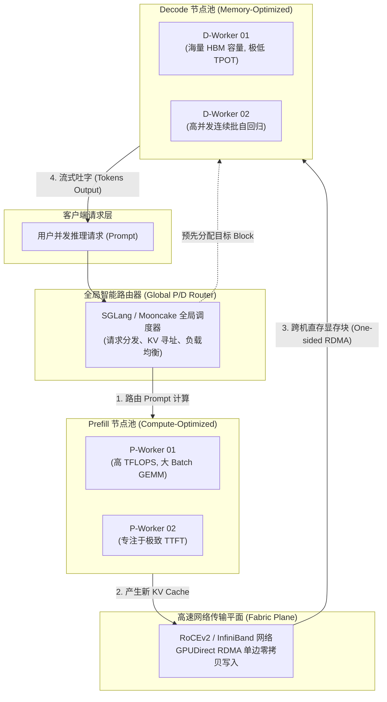
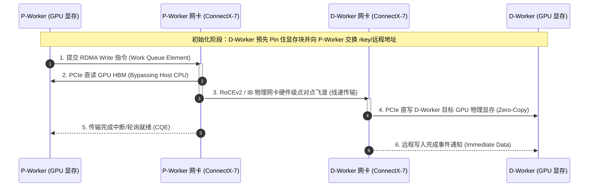
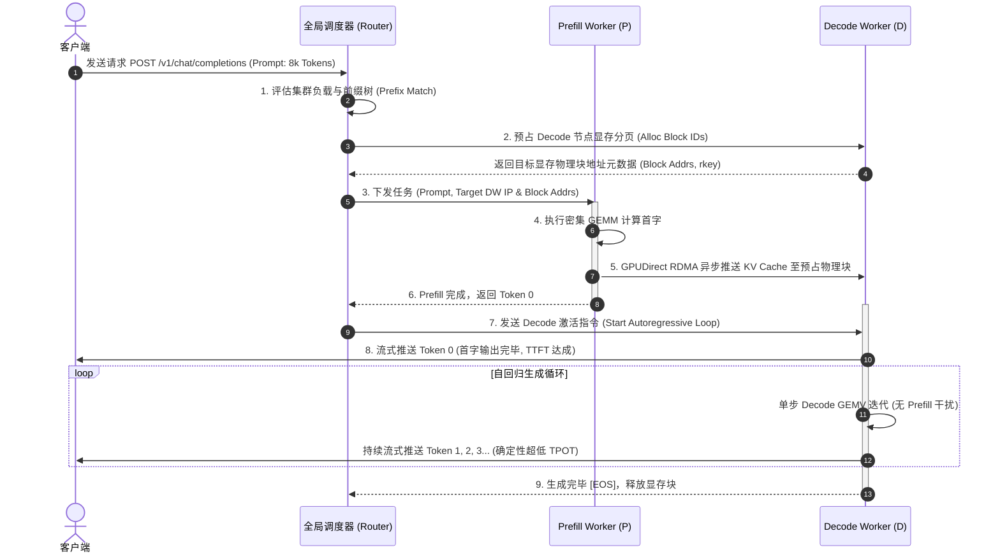
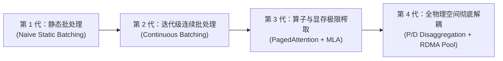

## 引言：单机混合调度的物理终局

在专栏的第一章[《从 model.generate() 说起：Roofline 模型、Prefill 与 Decode 的物理撕裂》](/articles/inference-roofline-prefill-decode/)中，我们从底层硬件的第一性原理出发，推导了自回归大模型推理必须对抗的核心物理矛盾：

- **Prefill（预填充阶段）**：属于严格的**算力受限（Compute-bound）**。Prompt 全量计算拥有高算术强度（Arithmetic Intensity），能够充分填满 GPU Tensor Core，追求极致的算力利用率（Model FLOPs Utilization, MFU）；
- **Decode（增量解码阶段）**：属于典型的**访存受限（Memory-bound）**。每次自回归生成单个 Token 时都需要全量读取庞大的权重矩阵与历史 KV Cache，算术强度断崖式下跌，性能直接被显存带宽（HBM Bandwidth）死死掐住。

在过去的几年中，工业界为了让这两个物理特性截然相反的阶段在同一台物理机甚至同一张 GPU 上和平共处，发明了一系列精妙绝伦的软件工程方案：从[PagedAttention 显存虚拟分页](/articles/pagedattention-memory-virtualization/)消除显存碎片，到[Continuous Batching 迭代级调度与 Chunked Prefill 分块填充](/articles/continuous-batching-chunked-prefill-guide/)削平排头阻塞（Head-of-Line Blocking）。

然而，当模型推理全面迈入 **128k 超长上下文（Long-Context）** 与 **长思维链（Reasoning / Test-Time Compute）** 时代后，这套“时分复用（Time-Sharing）”的单机混合调度范式终于撞上了不可逾越的物理高墙：

1. **算力与访存的同机互斥**：即便开启了 Chunked Prefill，当系统并发涌入长 Prompt 时，GPU 必须在同一个执行步中强行将计算密集的大矩阵乘法（GEMM）与访存密集的小批量矩阵向量乘法（GEMV）拼凑在一起执行。这导致 Tensor Core 无法跑出最高吞吐，而解码阶段的单字时延（Time Per Output Token, TPOT）依然会被严重拖慢；
2. **显存资源配置的天然悖论**：Prefill 需要极少且短暂的显存存放瞬时激活值，却渴望极致的计算密度（FP8 / INT8 TFLOPS）；而 Decode 需要极其庞大的静态显存池来长期驻留数万并发请求的 KV Cache，渴望最大的 HBM 容量与带宽。将两者绑死在同一台服务器上，必然导致算力与显存容量的双重资源浪费；
3. **SLA 服务等级目标的无法解耦**：企业级服务通常要求首字延迟（Time to First Token, TTFT）控制在数百毫秒内，而 TPOT 要求稳定在 30~50 ms/token。在混合部署下，任一侧的突发流量都会引发另一侧 SLA 的灾难性崩溃。

物理现实昭示了一条必然的发展路径：**从时间维度的分时复用，彻底走向空间维度的物理隔离 —— Prefill 与 Decode 彻底解耦（P/D Disaggregation）架构**。

本文作为**《大模型推理引擎：从模型演进、内核架构到未来终局》**专栏第八章，将深入剖析 P/D 分离的架构设计、跨节点分布式 KV Cache 传输协议栈、RDMA 零拷贝底层实现，以及集群规模下的动态池化调度。

---

## 一、 P/D 分离的第一性原理与集群拓扑演进

### 1.1 什么是 P/D 分离架构？

P/D 分离的核心思想极其朴素：**将推理集群在物理上切分为两组异构的专用节点池 —— 专职负责 Prefill 的 P-Worker 节点，与专职负责自回归生成的 D-Worker 节点**。



整个生命周期的控制流与数据流实现完全解耦：
1. **Prompt 分流**：用户请求到达全局路由器后，被派发给负载最适合的 **P-Worker**；
2. **密集 Prefill**：P-Worker 以极高的算力利用率一次性完成整个 Prompt 的注意力计算，生成首个输出 Token；
3. **KV Cache 飞渡**：P-Worker 在计算完毕的瞬间，将该请求在各层生成的历史 KV Cache，通过高速网络直接远程写入 **D-Worker** 预先分配好的显存分页中；
4. **稳定自回归**：D-Worker 接管后续的 Decode 过程，不受任何新进长 Prompt 的算力抢占，以确定性极高的节拍持续流式吐字，直到生成 `[EOS]` 结束标志。

### 1.2 工业界架构演进谱系：从 Splitwise 到 Mooncake

P/D 分离并非一蹴而就，而是经历了一场从学术原型到百万并发大厂基建的残酷演进：

| 架构 / 系统 | 提出时间与出处 | 核心贡献与创新机制 | 典型局限 / 待解决问题 |
| :--- | :--- | :--- | :--- |
| **Splitwise** | ISCA 2024 (微软研究院) | 首次提出将 Prefill 与 Decode 物理节点隔离，利用廉价/旧卡跑 Decode，高性能卡跑 Prefill，证明了成本削减潜力 | 仅验证了理论可行性，网络传输走传统 TCP/IP，传输延迟严重拖垮首字体验 |
| **DistServe** | OSDI 2024 (北京大学 / UCSD) | 首次确立了以 **TTFT SLA 与 TPOT SLA 解耦**为核心的调度目标，引入细粒度张量并行（TP）与流水线（PP）独立配置 | 依赖同机柜高带宽拓扑，面对超长上下文（>32k）时网络带宽成为硬瓶颈 |
| **Mooncake** | 2024~2025 (月之暗面 Kimi) | 提出**以 KVCache 为中心的解耦架构**，将集群 DRAM、SSD、GPU 显存构建为分布式分层存储池，支撑海量长上下文并发 | 系统架构复杂，中心化元数据元节点的高可用要求极高 |
| **vLLM v1 Disaggregated** | 2025 (vLLM 开源社区) | 基于全新 C++ 运行时与零开销调度器，原生支持 P/D 跨进程与跨机数据流，打通 Ray/Nix 分布式后端 | 跨多云环境下的异构网络自适应配置相对繁琐 |
| **SGLang Disaggregated** | 2025 (SGLang 开源社区) | 深度结合 [RadixAttention 树状缓存](/articles/prefix-caching-radix-attention-internals/)，将前缀树路由与跨节点 KV RDMA 传输融为一体 | 需要维护全局多级前缀索引树与路由心跳一致性 |

---

## 二、 核心技术瓶颈：跨节点 KV Cache 传输与网络物理极限
> [!TIP]
> **集群显存与传输量推演**：在规划 Prefill 与 Decode 节点的 GPU 配比前，可通过站内 [LLM 显存与 Token 吞吐计算器](/tools/) 测算单个请求的 KV Cache 字节数与网络带宽吞吐门槛。


P/D 分离的理论收益极其诱人，但在工程实现上，所有系统架构师都会在第一道关卡前倒吸一口凉气：**网络带宽墙（Network Bandwidth Wall）**。

在传统单机架构中，Prefill 计算完毕的 KV Cache 已经天然存在于本地 GPU HBM 中，Decode 节点读取它的代价是 **0（仅为本地显存寻址）**。而在 P/D 分离架构中，**Prefill 生成的海量 KV Cache 必须跨越物理网络网卡完整搬运到另一台物理机上！**

如果跨节点传输耗时超过了单步 Prefill 的执行时间，那么 P/D 分离不仅无法降低延迟，反而会导致首字延迟（TTFT）呈灾难性暴增。

### 2.1 传输数据量数学推导：GQA 与 DeepSeek MLA 的生死时速

我们来严格推导一次 Prefill 结束后，单请求需要向 D-Worker 搬运的数据量大小：

设模型总层数为 $L$，序列上下文长度为 $S$，存储精度为 16-bit（每个浮点数占用 2 字节）。

#### 情况 A：采用标准分组查询注意力（GQA，如 LLaMA-3-70B）
每层拥有 $H_{kv}$ 个 KV 读写头，每个注意力头的维度为 $D_{head}$。单 Token 在单层产生的 Key 和 Value 向量总字节数为：
$$\text{Bytes}_{\text{GQA/token/layer}} = 2 \times H_{kv} \times D_{head} \times 2 = 4 \times H_{kv} \times D_{head} \text{ 字节}$$

以标准 **LLaMA-3-70B** 为例：$L = 80$，$H_{kv} = 8$，$D_{head} = 128$。
单 Token 全量历史 KV Cache 大小为：
$$\text{Bytes}_{\text{LLaMA-70B}} = 80 \times (4 \times 8 \times 128) = 327,680 \text{ 字节} \approx 320 \text{ KB}$$

当处理 **16,384（16k）** 上下文时，单次请求需要传输的 KV Cache 体积为：
$$\text{Size}_{\text{GQA-16k}} = 320 \text{ KB} \times 16,384 \approx 5.24 \text{ GB}$$

如果在 **400 Gbps（约 50 GB/s 理论物理带宽）** 的 InfiniBand / RoCEv2 网络中传输这 5.24 GB 数据，即使网络吞吐打满 $90\%$ 效率（约 45 GB/s），纯网络传输耗时也将达到：
$$T_{\text{net}} \approx \frac{5.24 \text{ GB}}{45 \text{ GB/s}} \approx 116.4 \text{ ms}$$

这是一个极具毁灭性的数字：单请求仅仅在网络传输上就要停滞超过 110 毫秒！如果有 10 个并发请求同时完成 Prefill，网络瞬间被堵塞瘫痪，TTFT 断崖式恶化。

#### 情况 B：采用低秩潜变量吸收的 DeepSeek MLA（如 DeepSeek-V3）
我们在[专栏第六章《模型架构反哺推理系统：DeepSeek MLA 矩阵吸收》](/articles/mha-gqa-mla-matrix-absorption-inference-engine/)中推导过，MLA 将庞大的多头 KV Cache 压缩为低秩联合潜变量向量 $c_t^{KV} \in \mathbb{R}^{d_c}$（其中 $d_c = 512$）以及解耦的 RoPE 位置向量 $k_t^R \in \mathbb{R}^{d_R}$（其中 $d_R = 64$）。

单 Token 单层所需存储与传输的标量仅为 $512 + 64 = 576$ 个浮点数。
以 **DeepSeek-V3** 为例：总层数 $L = 61$。
单 Token 全量历史 KV Cache 传输体积为：
$$\text{Bytes}_{\text{MLA}} = 61 \times (576 \times 2) = 70,272 \text{ 字节} \approx 68.6 \text{ KB}$$

同样在 **16,384（16k）** 上下文下，单次请求需要传输的数据量骤降为：
$$\text{Size}_{\text{MLA-16k}} = 68.6 \text{ KB} \times 16,384 \approx 1.12 \text{ GB}$$

```text
16k 上下文跨机传输数据量断崖式对比：
┌─────────────────────────────────────────────────────────────┐
│ 经典 GQA (LLaMA-3-70B):  ████████████████████ 5.24 GB (116ms)│
│ DeepSeek MLA (671B):     ████ 1.12 GB (25ms, -78.6% 带宽开销)│
└─────────────────────────────────────────────────────────────┘
```

**78.6% 的网络带宽开销被直接砍掉！**
这彻底解释了为什么当前业界的共识是：**没有类似 MLA 的极端注意力架构创新，长文本时代的生产级 P/D 分离就是空中楼阁；而 MLA 与 P/D 分离的结合，才是通往超长上下文推理的终极答案。**

---

### 2.2 传输底座：为什么传统 TCP/IP 必须被淘汰？

在通用互联网服务中，微服务之间通常采用 gRPC 或 RESTful API 通过 TCP/IP 传输。但在千兆/万兆级别的 GPU 显存数据搬运中，TCP/IP 协议栈存在四大致命原罪：

1. **宿主机 CPU 深度卷入（Host CPU Overhead）**：TCP/IP 的报文分片、校验和计算、拥塞控制严重消耗 Host CPU 周期。在数百 Gbps 的吞吐下，数十个 CPU 核心会被网络软中断直接打满；
2. **多重内存复制（Multiple Memory Copies）**：
   - 路径 1：GPU 显存 -> PCIe 传输 -> 主机内核缓冲区（Kernel Buffer）；
   - 路径 2：主机内核缓冲区 -> Socket 缓冲区 -> 网卡硬件 DMA。
   数据在 PCIe 和系统内存中反复倒手，延迟增加 3~5 倍；
3. **内核态/用户态上下文频繁切换**；
4. **尾延迟（P99 / P99.9 Latency）剧烈抖动**。

### 2.3 GPUDirect RDMA (GDR) 单边零拷贝架构

生产级 P/D 推理引擎（如 Mooncake、SGLang 与 vLLM v1）全量采用了 **GPUDirect RDMA（GDR）** 传输底座。



GPUDirect RDMA 的核心精髓在于 **单边操作（One-Sided RDMA Write）** 与 **全链路硬件直通**：
- **绕过 Host CPU 与主机内存**：P-Worker 的网卡（NIC）直接利用 PCIe 总线发起 Peer-to-Peer 传输，读取 P-GPU 显存；数据包穿过光纤到达 D-Worker 的网卡后，D-Worker 网卡同样通过 PCIe 直接将字节流打入 D-GPU 显存；
- **单边操作（One-Sided）**：D-Worker 端的 CPU 和 GPU 在传输过程中完全不需要执行任何接收线程（无需执行 `recv()` 调用）。D-Worker 只需在请求初始化时将目标 PagedAttention 显存物理块注册（Memory Registration）并授权一个远程内存密钥（rkey），P-Worker 即可自行完成“隔空移物”；
- **传输与计算重叠（Overlap）**：在分块流水线模式下，P-Worker 可以在计算第 $i+1$ 层的同时，将第 $i$ 层的 KV Cache 异步交由网卡推向远程 D 节点。

---

## 三、 全局调度流与 P:D 节点最优配比数学模型

### 3.1 端到端请求调度与跨机生命周期时序

在引入 P/D 分离后，整个集群的调度大脑从单机调度器升级为 **全局协调器（Global Coordinator / Router）**：



通过这一流程，P 节点在第 5 步完成搬运后立即将该请求从自身上下文彻底注销，显存瞬间清空并立刻投入下一个并发请求的 Prefill 运算中；而 D 节点接力执行，双方各司其职，互不侵扰。

### 3.2 节点最优配比数学模型：P 节点与 D 节点应该几比几？

在实际机房部署中，集群架构师面临的最核心考量是：**给定 64 台 GPU 服务器，究竟应该切分多少台给 Prefill，多少台给 Decode？**

如果 P 节点过多，D 节点吃不消会导致请求堆积在网络队列；如果 D 节点过多，P 节点算力吃紧会导致排队延迟激增。我们可以建立严格的**排队论流平衡方程（Flow Balance Equation）**：

设：
- 平均请求到达率为 $\lambda$（req/s）；
- 平均输入 Prompt 长度为 $S_{\text{in}}$，平均输出生成长度为 $S_{\text{out}}$；
- 单卡 Prefill 处理吞吐为 $T_P$（tokens/s），单卡 Decode 处理吞吐为 $T_D$（tokens/s）；
- 集群拥有 $N_P$ 张 P 卡与 $N_D$ 张 D 卡。

为了保证整个集群不发生队列雪崩，各子系统的处理容量必须严格匹配输入流：

1. **Prefill 集群每秒需要消化的输入 Token 负荷**：
   $$\Phi_{\text{in}} = \lambda \cdot S_{\text{in}}$$
   因此所需最小 P 卡数量为：
   $$N_P \ge \frac{\lambda \cdot S_{\text{in}}}{T_P}$$

2. **Decode 集群每秒需要消化的输出 Token 负荷**：
   $$\Phi_{\text{out}} = \lambda \cdot S_{\text{out}}$$
   所需最小 D 卡数量为：
   $$N_D \ge \frac{\lambda \cdot S_{\text{out}}}{T_D}$$

两者的最优配比比率 $R$ 即为：
$$R = \frac{N_P}{N_D} \approx \left(\frac{S_{\text{in}}}{S_{\text{out}}}\right) \cdot \left(\frac{T_D}{T_P}\right)$$

#### 工业生产案例实算：
假设我们部署一个企业级知识库助手（RAG 场景）：
- 输入长 Prompt 平均 $S_{\text{in}} = 4000$ tokens；
- 输出回答平均 $S_{\text{out}} = 500$ tokens；
- 输入/输出长度比 $\frac{S_{\text{in}}}{S_{\text{out}}} = \frac{4000}{500} = 8$；
- 硬件吞吐实测：Prefill 凭借大 Batch GEMM 能跑出 $T_P \approx 4000 \text{ tokens/s/GPU}$，而 Decode 受限于显存带宽仅能跑出 $T_D \approx 500 \text{ tokens/s/GPU}$。吞吐比 $\frac{T_D}{T_P} = \frac{500}{4000} = \frac{1}{8}$。

带入公式计算：
$$R = 8 \times \frac{1}{8} = 1.0 \implies N_P : N_D = 1 : 1$$

在此配置下，**Prefill 节点与 Decode 节点各占 $50\%$ 的机器配比是理论最优平衡点！**

但如果场景切换为 **长推理思维链（Reasoning，如类似 o-series 或 DeepSeek-R1）**：
- 输入仅 $S_{\text{in}} = 1000$ tokens，而内部反思自回归输出高达 $S_{\text{out}} = 8000$ tokens；
- 长度比大幅倾斜：$\frac{S_{\text{in}}}{S_{\text{out}}} = \frac{1}{8}$；
- 理论配比比率变为：
  $$R = \frac{1}{8} \times \frac{1}{8} = \frac{1}{64}$$
在此类以深度思考为主的业务中，**集群 $95\%$ 以上的物理算力都必须划拨给 Decode 节点池，Prefill 仅需极少量专用节点即可支撑全局吞吐！**

---

## 四、 生产级落地陷阱与前沿系统权衡

从理论推导走向数千卡集群的生产实战，工程师必须直面以下四大陷阱：

### 4.1 显存分页块对齐（Block Alignment）与跨机内存泄漏

在单机 PagedAttention 中，显存分配由单机 Block Manager 本地闭环处理。但在 P/D 架构下：
- P 节点在 Prefill 过程中采用本地连续或分页内存计算；
- D 节点必须预先将多个非连续的物理 Block ID 暴露给远程；
- 一旦网络在传输中途断联或超时，D 节点必须设计严密的租约超时机制（Lease-based GC），否则远程被锁定的显存页将沦为无法回收的僵尸内存。

### 4.2 动态角色转换（Dynamic Role Switching）

业务流量天然具备波峰波谷：白天有大量高频短交互对话，夜间有批量离线长文档总结。
如果物理集群的 P 节点与 D 节点被静态死板划分，夜间 D 节点会严重空转，而 P 节点队列被打爆。

现代先进架构（如 Mooncake 与 SGLang 动态弹性池）支持 **节点角色的毫秒级热切换**：
- 通过虚拟容器化调度，根据当前队列深度指标（Queue Depth），动态将部分处于空闲的 P 节点重载权重上下文降级为 D 节点，或将 D 节点临时提升为 P 节点，实现弹性削峰填谷。

### 4.3 P 节点内部是否还需要 Chunked Prefill？

一个常见的误区是：“既然已经实现了 P/D 分离，P 节点内就不会影响 Decode 了，那 P 节点还需要 Chunked Prefill 吗？”

**答案是：依然需要！**
因为在 P 节点池内部，同样存在不同客户端并发请求之间的公平性问题。如果客户端 A 涌入了一个 128k 的超长 Prompt，而客户端 B 发送了一个仅 100 字的代码补全请求：
如果不开启 Chunked Prefill，客户端 A 会独占 P 节点的 GPU 数秒之久，导致客户端 B 的首字延迟被严重拖累。P 节点内部依旧需要借助分块计算，让短请求能够快速穿插完成，实现小请求的毫秒级即时穿透。

---

## 五、 总结与推理架构演进路线

P/D 分离架构绝非简单的“拆成两组机器”，它是大模型推理系统演进史上的重要分水岭：



1. 它在**物理本质**上承认了 Prefill 与 Decode 之间不可调和的 Roofline 撕裂，用**空间隔离**彻底终结了单机混合调度的互相伤害；
2. 它在**硬件拓扑**上倒逼了网络协议栈向 GPUDirect RDMA 硬件直通全面升级，使分布式显存池化成为可能；
3. 它在**算法演进**上与 DeepSeek MLA、KDA 等低显存占用注意力机制形成了绝妙的协同互哺。

掌握了 P/D 分离与分布式显存池化，我们便拥有了驾驭成百上千卡大规模集群的核心内功。在接下来的**专栏第九章**中，我们将正式推开生产级推理引擎的源码大门，直面当今开源世界最受瞩目的四座高山：**《主流生产级推理引擎架构横评与调度器内核拆解：vLLM v1 vs SGLang vs TensorRT-LLM vs llama.cpp》**，深度解密它们在 C++ 调度器、执行引擎与运行时设计上的终极对决。

---

## 常见问题 (FAQ)

### Q1: P/D 分离相比单机混合部署，一定会带来更高的整体吞吐（Throughput）吗？
**不一定，P/D 分离的核心价值在于“解耦 SLA”与“大幅降低 P99 尾延迟”，而非无条件的绝对吞吐暴增。**
在传统混合部署中，GPU 始终在被动地将 Prefill 和 Decode 掺杂在一起执行，在特定高并发均质负载下硬件的整体吞吐并不低。P/D 分离引入了跨机 RDMA 传输的额外网络开销，如果网络带宽受限，甚至可能成为新瓶颈。然而，P/D 分离的杀手级优势在于**消除了干扰**：它使得处于严苛 SLA 约束下的 Decode 节点能够以极低的 TPOT 稳定输出，首字延迟（TTFT）也不再会被正在运行的长解码任务打断。此外，它允许针对 P 节点和 D 节点的硬件规格进行异构定制（如 P 节点选用计算卡，D 节点选用高带宽卡），从而在同等总体成本（TCO）下实现综合性能的最优解。

### Q2: 为什么目前多数小型私有化部署（如单机 8 卡）不建议强行采用 P/D 分离？
在只有单台物理机（如单台 8x H100 / A800 节点）的小规模部署场景中，强行切分（如 4 卡 Prefill + 4 卡 Decode）通常是不经济的：
1. **张量并行（TP）粒度受限**：70B 以上的模型通常需要整机 TP=8 才能获得较好的 GEMM 算力利用率。如果将其拆分为 4+4，各节点的 TP 缩小到 4，模型权重放不下或者被迫引入高延迟的流水线并行（PP）；
2. **机内负载抵消能力减弱**：小集群天然缺乏大数定律平滑效应，流量波动剧烈。静态切分后极易出现“P 组空转，D 组排队”的失衡局面；
3. **P/D 分离的最佳甜点区间是大规模集群（数十至数百节点）**：在此规模下，池化效应能够完全对冲流量潮汐，且专用的高速 RoCEv2/IB 网络拓扑能够最大化释放 RDMA 优势。

### Q3: 在跨机 RDMA 传输 KV Cache 时，如果遇到网络丢包或拥塞，推理引擎如何保证高可用？
现代生产级引擎设计了三级高可用保障机制：
1. **网络层 RoCEv2 PFC (Priority Flow Control) 与 DCQCN 拥塞控制**：在交换机与网卡物理层保障无损网络传输（Lossless Ethernet），从根本上避免拥塞丢包；
2. **传输层心跳租约与超时 Fallback**：P 节点在发起 RDMA 写入后启动硬件计时器。若在阈值内（如 200 ms）未收到目标网卡的完成信号（CQE），全局调度器将把请求标记为传输失败，并调度至备用 D 节点直接触发本地快速重新 Prefill，避免客户端长时间无响应；
3. **全局前缀树元数据隔离**：在如 Mooncake 或 SGLang 等系统中，KV Cache 块的注册与全局寻址表是版本化的，未完全校验成功的脏数据块绝不会被释放给下游 Decode 节点消费。
