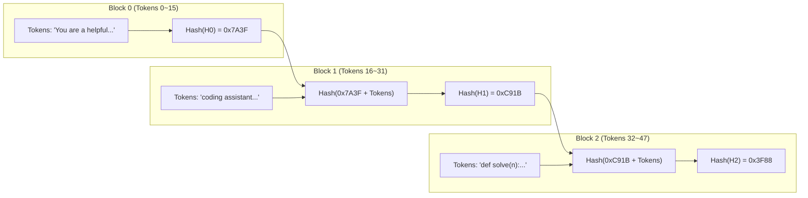
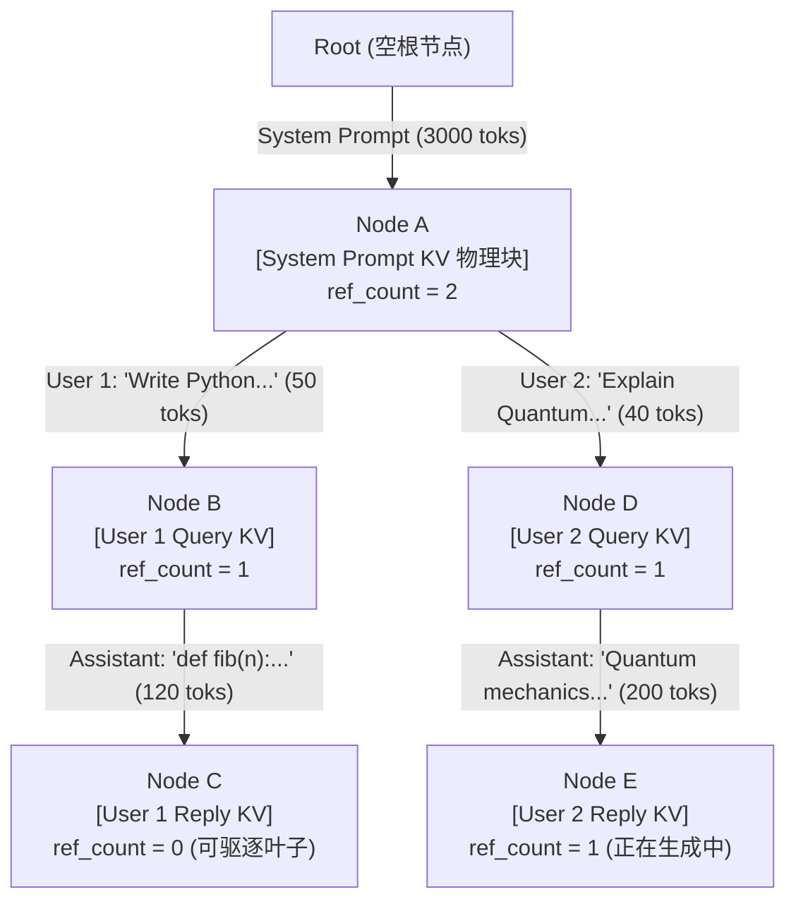
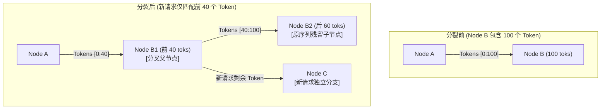
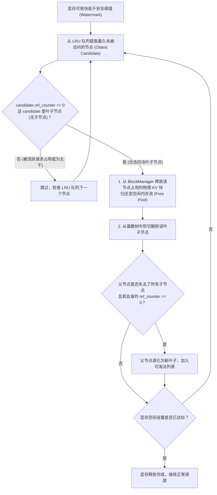
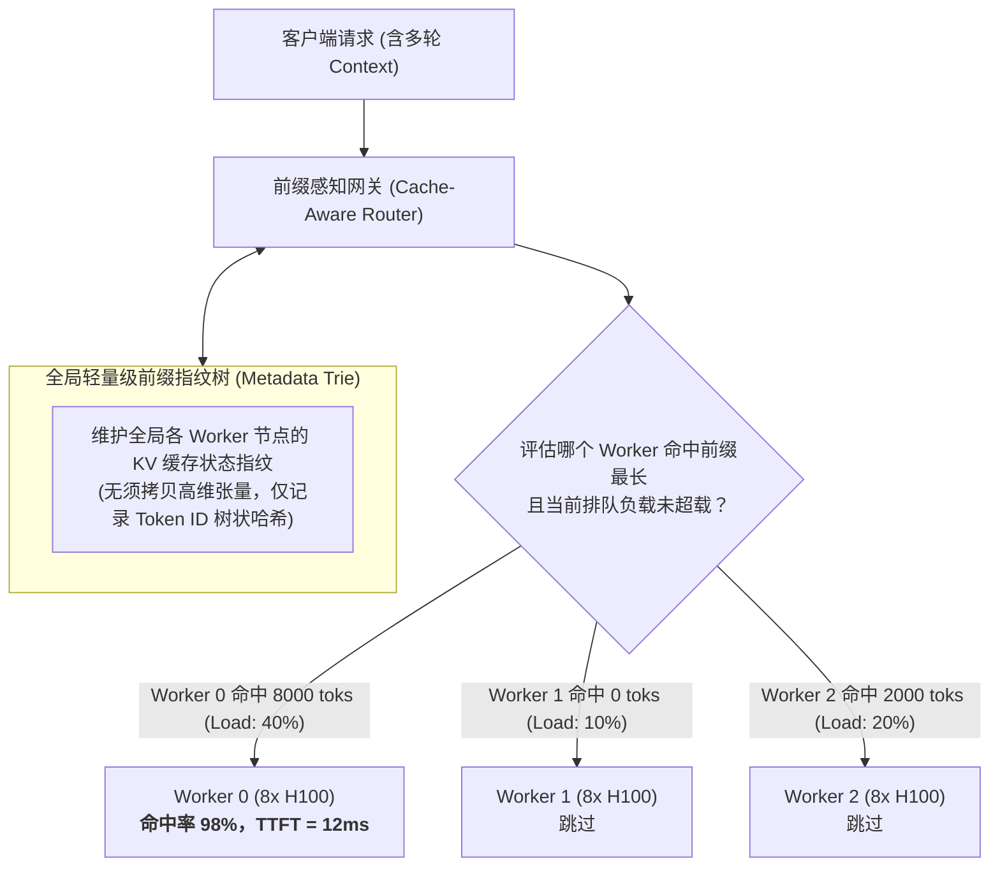

## 引言：为什么大模型总在反复做“无用功”？

在前面的章节中，我们已经逐步搭建起了现代大模型推理系统的基石认知：
- 在 [Roofline 模型与 Prefill/Decode 的物理撕裂](/articles/inference-roofline-prefill-decode/) 中，我们量化了 Prefill 阶段强烈的**计算密集型（Compute-bound）**特征，长上下文的因果矩阵乘计算量呈 $O(L^2)$ 扩张，是压垮首字时延（TTFT）的罪魁祸首；
- 在 [PagedAttention 显存虚拟化](/articles/pagedattention-memory-virtualization/) 中，我们解构了分页内存池如何通过 Copy-on-Write 机制在物理块层面支持张量切片共享；
- 在 [Continuous Batching 与 Chunked Prefill](/articles/continuous-batching-chunked-prefill-guide/) 中，我们解决了并发请求的排头阻塞，通过算力与访存的“动态拼车”抹平了时延尖刺。

然而，在真实生产环境中，尤其是 **AI Agent 智能体工作流、多轮对话（Multi-turn Chat）、代码协同（Coding Copilot）以及长文档检索（RAG）** 爆发的今天，推理系统正面临一个荒谬的算力黑洞：

**在连续的多次请求之间，高达 70% 至 95% 的输入 Prompt 是完全相同的！**

考虑一个经典的 ReAct Agent 交互场景：
- **Turn 1**：系统注入 4,000 Tokens 的 System Prompt（包含背景定义、数十个工具 Schema 及 Few-shot 样例），用户提问 50 Tokens，模型输出 100 Tokens；
- **Turn 2**：Agent 调用工具返回结果，下一轮请求将历史对话和工具返回值拼在一起，总长度达到 4,300 Tokens；
- **Turn 3**：再次追加结果，Prompt 膨胀至 4,600 Tokens……

如果推理引擎缺乏状态复用能力，那么在 Turn 2 和 Turn 3 中，**那份长达 4,000 Tokens 的通用 System Prompt 以及前几轮的历史记录，都必须在 GPU Tensor Cores 上从头到尾重新做一次完整的矩阵乘法！**

这不仅导致集群超过 60% 的算力在进行纯粹的无用功，更使得多轮交互的首字延迟（TTFT）随对话轮次不断恶化。

**前缀缓存（Prefix Caching）**的诞生，正是为了终结这一算力浪费。通过将已经计算完毕的 KV Cache 驻留在显存池中，后续请求如果命中相同前缀，直接跳过昂贵的 Prefill 计算，**将长达数百毫秒（甚至数秒）的 TTFT 垂直降维至几毫秒（纯内存指针检索）**！

本文将带你从 vLLM 的静态 Hash 块寻址出发，深入剖析由伯克利 LMSYS 团队提出的 **SGLang RadixAttention** 核心算法，解构基数树的节点分裂、引用计数与 LRU 驱逐状态机，以及从单机跨越至集群的 Cache-Aware 调度艺术。

---

## 一、 第一代方案：vLLM 的链式 Hash 块级前缀缓存

在 PagedAttention 诞生后，vLLM 最早引入了块级前缀缓存（Automatic Prefix Caching, APC）。

### 1.1 链式哈希（Hash Chaining）的数学必然

在操作系统的虚拟内存中，如果两个文件块内容相同，计算 `md5(data)` 即可判断去重。但在自回归大模型中，**我们绝不能仅仅对当前的 Token 块计算哈希**。

这是由 Transformer 的**因果自注意力（Causal Self-Attention）**物理特性决定的：
一个 Block 内包含的 16 个 Token（例如 `[" the", " capital", " of", ...]`），如果出现在“法国的地理介绍”后，其算出的 Key-Value 向量值，与出现在“某段 Python 代码注释”后所算出的 Key-Value 向量值是**截然不同**的！每个 Token 的 KV 向量都融合了其前面所有历史上下文的注意力投影。

因此，vLLM 借鉴了区块链与 Merkle Tree 的思想，设计了**上下文敏感的链式哈希计算公式**：

对于由多个物理块组成的序列，第 $i$ 个块的哈希值 $H_i$ 定义为：
$$H_0 = \text{Hash}(\text{Tokens}_0)$$
$$H_i = \text{Hash}(H_{i-1}, \text{Tokens}_i) \quad (i \ge 1)$$



调度器维护一个全局的哈希查找表：
$$\text{HashMap}: H_i \longrightarrow \text{Physical Block ID}$$
当新请求到达时，调度器将其 Prompt 按 Block Size（如 16）切分成多个块，从前往后逐块计算链式哈希：
1. 若 $H_i$ 在 HashMap 中命中，且其对应的物理块数据未被驱逐，则直接将该物理块挂入当前请求的 Block Table；
2. 一旦某一块 $H_k$ 未命中，则后续所有块（哪怕内容再相似）全部停止匹配，转入正常的 Prefill 前向计算。

### 1.2 扁平 Hash 块方案的三大工程局限

链式哈希实现简单直接，但在复杂业务场景下暴露出严重的效率瓶颈：

1. **对齐截断惩罚（Block Boundary Waste）**：
   哈希是基于完整物理块（如 16 tokens）计算的。若用户的输入与历史缓存仅在第 15 个 Token 处相差了一个标点符号，那么整个 Block 0 无法形成有效哈希，后序哪怕有 8,000 个完全相同的 Token 也全部无法命中；
2. **扁平映射与树状分支的天然脱节**：
   在多轮对话中，用户会针对同一前置上下文展开多个不同分支（Branching conversations），树搜索（Tree-of-Thought）更会在同一节点下衍生几十个候选节点。扁平的 HashMap 缺乏层次拓扑关系，无法进行祖先回溯和分支剪枝；
3. **显存回收时的脆弱性**：
   在内存紧张触发驱逐时，扁平哈希很难判断“哪些块属于公共主干（Trunk），哪些块属于已经废弃的叶子（Leaf）”，极易误伤高价值的 System Prompt 根节点。

---

## 二、 SGLang 的突破：RadixAttention 基数树前缀缓存

为了从根本上契合大模型上下文的多轮分叉演进特性，加州大学伯克利分校 LMSYS 团队在 2024 年发表了里程碑论文《Fast and Expressive LLM Inference with RadixAttention and SGLang》，正式推出了 **RadixAttention**。

### 2.1 核心思想：将显存池具象化为动态基数树

RadixAttention 的根本创新在于：**抛弃扁平的哈希表，直接在 GPU 显存管理层维护一棵全局的基数树（Radix Tree / Patricia Trie）。**

在基数树中：
- **树的边（Edges）**：保存一段连续的 Token ID 序列（长度可变，不仅限于固定的 16 或 32）；
- **树的节点（Nodes）**：保存这一段 Token 序列在 GPU 显存中所对应的**物理 KV Cache 块列表（`kv_indices`）**；
- **从根节点（Root）到任意节点的路径**：唯一确定了一个完整的前缀上下文。



### 2.2 树状表达带来的降维优势

1. **变长匹配，无视块边界**：
   基数树的边长是动态压缩的。无论匹配长度是 17 个 Token 还是 4,093 个 Token，都能顺着树枝平滑走到底，彻底告别了固定块对齐带来的截断遗憾；
2. **多轮对话拓扑与树结构完美同构**：
   多轮对话和 Agentic 分支执行原生就是树状分叉。公共 System Prompt 天然沉淀在靠近 Root 的顶层主干，不同请求的 Query 自然衍生为下游子分支。

---

## 三、 RadixTree 四大核心原语与状态机演进

要在毫秒级的高并发调度循环中高效管理这棵庞大的基数树，SGLang 设计了四个严密的物理原语：**前缀匹配（Match）、节点分裂（Split）、动态插入（Insert）与 LRU 驱逐（Evict）**。

### 3.1 原语一：前缀匹配（`match_prefix`）

当一个新请求携带着输入序列 `req_tokens` 进入引擎时：
1. 调度器从基数树的 Root 开始自顶向下贪心匹配；
2. 逐层对比子节点边上的 Token 序列，直到某个节点处出现 Token 不匹配，或者 `req_tokens` 已被完全覆盖；
3. 匹配停止点所对应的所有物理 KV Cache 块直接被复用，**该请求的实际 Prefill 计算量被瞬间骤降为剩余的未匹配后缀（Suffix）**！

```python
# RadixTree 匹配逻辑抽象伪代码
def match_prefix(self, req_tokens: List[int]) -> Tuple[List[int], List[int]]:
    curr_node = self.root
    matched_kv_indices = []
    idx = 0
    
    while idx < len(req_tokens):
        matched_child = None
        for child in curr_node.children:
            edge_len = len(child.token_ids)
            # 检查当前子节点边上的 Tokens 是否与请求对应区间完全重合
            if req_tokens[idx : idx + edge_len] == child.token_ids:
                matched_child = child
                break
        
        if matched_child:
            matched_kv_indices.extend(matched_child.kv_indices)
            idx += len(matched_child.token_ids)
            curr_node = matched_child
        else:
            # 无法全量匹配整条边，尝试部分匹配并准备分裂 (Split)
            break
            
    unmatched_suffix = req_tokens[idx:]
    return matched_kv_indices, unmatched_suffix
```

### 3.2 原语二：节点分裂（`split_node`）

现实中，新请求的 Prompt 往往只匹配现有某条边的一部分。此时，基数树必须执行**节点分裂（Node Splitting）**：

假设现有节点 A 到节点 B 包含 100 个 Token，新请求仅匹配了前 40 个 Token：
1. 原节点 B 被拆分为“父节点 B1（包含前 40 个 Token）”和“子节点 B2（包含后 60 个 Token）”；
2. 对应的物理显存块索引按 40/60 比例精确切分给 B1 和 B2；
3. 新请求以 B1 为分叉点，创建属于自己的全新分支节点 C。



### 3.3 原语三：动态插入（`insert`）

当新请求完成了未命中后缀的增量 Prefill，并开始进入自回归 Decode 吐字时，新生成的 Token 以及初始未命中的 Token 都会持续追加到物理块中。
- 每次前向计算产生新物理块时，调度器顺着当前请求挂载的节点向下追加；
- 请求结束（产生 `<eos>`）后，该序列的所有 Token 固化为树中的永久分支，供未来所有可能出现的请求检索复用。

### 3.4 原语四：基于引用计数的动态 LRU 叶子驱逐（`evict`）

显存物理容量是极其有限的。当 GPU 显存池水位触及报警线（例如可用物理块不足以支撑下一个批次的 Decode）时，基数树必须进行显存回收。

**如何保证在淘汰冷数据时，绝对不会破坏正在运行的请求？**

SGLang 引入了双重护城河机制：
1. **引用计数（`ref_counter`）**：
   - 只要有任何活跃的请求正在引用某个节点（无论是正在 Decode 还是在排队准备执行），该节点的 `ref_counter > 0`；
   - 处于被引用状态的节点是**神圣不可侵犯的（Pinned）**，驱逐器严禁触碰；
2. **纯叶子节点淘汰（Leaf-Only Eviction）**：
   - 驱逐器维护一个按照 `last_access_time` 排序的 LRU 链表；
   - 淘汰动作**只能发生在 `ref_counter == 0` 且没有子节点的叶子节点上**！
   - 这一规则构成了绝妙的数学保护：**靠近根节点的公共 System Prompt 拥有大量的活跃子孙分支，其引用计数长期大于 0，且永远不会变成无子叶子节点，因此天然获得了最高优先级的显存驻留豁免权！**



---

## 四、 工业级突破：从单机基数树到集群 Cache-Aware 路由

很多架构师在单机上体验到了 RadixAttention 带来的百倍提速，但在部署到由数十台节点组成的生产推理集群（8x H100 $\times$ 16 台）时，却沮丧地发现前缀缓存命中率**暴跌至 20% 以下**。

问题的症结在于：**集群入口负载均衡器（Load Balancer）是缓存盲目的（Cache-Blind）。**

### 4.1 传统轮询（Round-Robin）引发的缓存雪崩

假设用户正在与一个多轮 Coding 助手对话：
- **Turn 1**：网关采用轮询策略，将请求派发至 **Worker 0**。Worker 0 计算了 8,000 Tokens 的上下文，并在本地 GPU 的 RadixTree 中缓存了 KV blocks；
- **Turn 2**：用户提问，网关将请求轮询分发到了 **Worker 1**。Worker 1 的显存里空空如也，被迫重新完整计算 8,100 Tokens 的 Prefill！
- **Turn 3**：网关再次分发到了 **Worker 2**……

在这种模式下，集群内的每一台 GPU 都在反复重新计算别人早就计算过的上下文，显存池被割裂为一座座孤岛，缓存复用率形同虚设。

### 4.2 Cache-Aware 智能路由调度架构

为了在分布式集群中榨干前缀缓存的红利，现代推理网关（如 SGLang Router / vLLM Router）构建了**前缀感知路由（Cache-Aware Routing）**：



网关层设计要点：
1. **轻量级前缀树副本（Metadata Tree）**：网关层仅以毫秒级开销维护全局 Token ID 级别的基数树拓扑与各节点的显存块分布元数据，完全不涉及实际显存数据的搬运；
2. **两阶段路由打分模型**：
   $$\text{Score}(Worker_i) = \alpha \times \frac{\text{CachedTokens}_i}{\text{TotalPromptTokens}} - \beta \times \text{CurrentQueueDelay}_i$$
   系统优先将请求投递至**缓存命中率最高**的节点；但当该节点的排队积压过于严重时，平滑退化至空闲节点，在“缓存命中收益”与“排队负载均衡”之间实现优雅的帕累托平衡。

在生产实践中，引入 Cache-Aware 路由后，典型多轮对话集群的**整体平均前缀缓存命中率直接从 25% 飙升至 88% 以上**，吞吐量提升高达 2.8 倍！

---

## 五、 技术方案全景横评

| 评估维度 | 无前缀缓存 (Vanilla Serving) | 链式 Hash 块级缓存 (vLLM APC) | 树状 RadixAttention (SGLang) |
| :--- | :--- | :--- | :--- |
| **底层核心数据结构** | 无（每次全量分配与销毁） | 扁平散列表（Hash Map） | 动态压缩基数树（Radix Tree / Patricia Trie） |
| **匹配精度与粒度** | 0% 复用 | 严格对齐至固定 Block 大小（如 16） | **任意 Token 级细粒度变长匹配** |
| **边界修改容忍度** | 不支持 | 极低（修改前序 1 字符导致后续整段失效） | **高（自动沿公共祖先下切，并在分歧点分裂）** |
| **分支会话支持** | 极差 | 中等（大量冗余哈希存储） | **原生支持（天然对应树状分叉结构）** |
| **驱逐控制机制** | 请求结束立即释放 | 粗粒度 LRU 物理块淘汰 | **细粒度引用计数 + 叶子节点优先 LRU 级联回收** |
| **多轮对话 TTFT** | 随轮次线性甚至二次方恶化 | 大幅降低，但受限于块对齐 | **极致削减至 5ms~20ms（仅需前向未命中后缀）** |
| **计算复杂度** | $O(L_{\text{prompt}}^2)$ | $O(\text{Hash}) + O(L_{\text{suffix}}^2)$ | $O(\text{Tree Depth}) + O(L_{\text{suffix}}^2)$ |
| **分布式路由适配** | 轮询即可 | 需要 Consistent Hash 兜底 | **原生配合 Radix-Aware Router 达到极致命中** |

---

## 常见问题 (FAQ)

### Q1: 前缀缓存大幅降低了 Prefill 阶段的计算量，为什么有时反而会导致 GPU 显存占用过高甚至引发 OOM？

前缀缓存的本质是**“用显存空间换计算时间”**。

在未开启前缀缓存时，请求一结束，其所有的 KV Cache 物理块会立刻被 100% 释放归还给系统。而在开启前缀缓存（如 RadixAttention）后，为了供后续可能到来的请求复用，**已结束请求的物理块依然会继续驻留在显存池中，直到系统遭遇内存压力才被动触发 LRU 驱逐**。

这就意味着，在监控面板上，开启前缀缓存的 GPU 显存使用率会**常年处于 90% 以上的高位饱和状态**。很多初学者会误以为这是内存泄漏（Memory Leak）。

真正的风险发生在**突发高并发新请求涌入**时：如果驱逐器（Eviction Engine）在短时间内来不及释放足够多的无用叶子节点，或者由于当前并发流过多导致大部分节点的 `ref_counter > 0` 无法被驱逐，系统就会耗尽物理显存并抛出 OOM。

**解决策略**：在生产部署时，必须设置合理的显存安全水线（如 `--gpu-memory-utilization 0.90`），预留出至少 10% 的显存缓冲带，为突发的动态解码分配提供弹性空间。

### Q2: 如果 Prompt 中存在极微小的动态变量（如动态时间戳、随机生成的 Request ID），会不会导致前缀缓存完全失效？工程上该如何规避？

**会，这会导致极其惨烈的“前缀雪崩”！**

在大模型自回归计算中，自注意力机制会强制依赖当前 Token 之前的所有内容。如果你的 Prompt 模板是这样设计的：
```
[Request ID: 9845123] [Current Time: 2026-09-24 14:30:02]
[System Prompt: You are an enterprise database expert with 20 tools...] (4,000 tokens)
```
由于动态变量位于 Prompt 的**最前端（Root 路径）**，新请求在第 1 个 Token 处就与 RadixTree 中的任何历史分支产生分歧。这会导致树匹配在根节点直接终止，**后续长达 4,000 个 Token 的超长 System Prompt 彻底失去缓存命中机会！**

**工程黄金守则（Prompt Engineering for Prefix Caching）**：
1. **静态内容必须绝对前置**：将系统人设、工具定义、Few-shot 静态范式永远置于 Prompt 的最顶层；
2. **高频易变变量沉底**：动态时间戳、用户 Session ID、随时间变动的环境变量，必须后置拼接到用户 Query 附近；
3. **保持文本与空格的绝对一致性**：确保模板格式化输出时不会因为微小的空格、换行符差异产生不同的 Token ID 序列。

### Q3: 跨多机部署（分布式集群）时，节点重启或者动态扩缩容，RadixTree 缓存丢失了怎么办？业界目前有什么应对方案？

在单机模式下，节点一旦重启，GPU HBM 中的 RadixTree 便化为乌有，必须经历一段冷启动阶段重新积累前缀。但在大规模企业级集群中，业界已经发展出成熟的多级缓存应对方案：

1. **分层分级存储（Tiered Memory Hierarchy）**：
   当 GPU 显存紧张需要驱逐时，并不直接 Drop 掉物理块，而是将高频公共前缀的 KV Cache 通过高带宽 PCIe 异步换出（Offload）到**主机 CPU 内存（Host RAM）**，甚至下刷到**本地高速 NVMe SSD**。当请求再次命中该前缀时，直接通过 CUDA 异步内存拷贝搬回 GPU，耗时依然远低于重新跑一次 GPU Prefill；
2. **分布式 KV 共享存储层（如 Mooncake 架构）**：
   在最新的以 Prefill-Decode 分离（P/D Disaggregation）为代表的架构中，整个数据中心内部搭建了一套基于 RDMA 互联的**分布式内存对象池**。即使某个计算节点重启，新节点也能通过 RoCEv2/InfiniBand 网络以百 GB/s 的带宽从远端内存池瞬间拉取所需的 KV Cache 页面，彻底解耦了缓存生命周期与单机物理节点的生灭。
