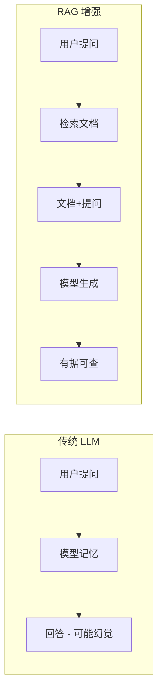
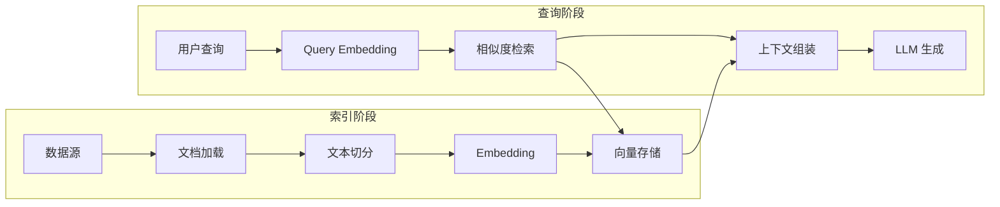

## 什么是 RAG？

RAG（Retrieval-Augmented Generation，检索增强生成）是一种通过**外部知识检索**来增强大模型输出质量的技术范式。简单来说：



在企业场景中，RAG 解决了大模型的两大核心痛点：
- **知识更新**：无需重新训练，只需更新知识库
- **幻觉控制**：回答基于真实文档，可溯源验证

## 系统架构

一个完整的 RAG 系统包含以下流水线：



### 核心组件详解

**1. 文档加载器**

支持多种格式的数据摄入：

```python
from langchain_community.document_loaders import (
    PyPDFLoader,
    UnstructuredMarkdownLoader,
    CSVLoader,
    WebBaseLoader
)

# 加载 PDF
loader = PyPDFLoader("company_report.pdf")
docs = loader.load()

# 加载网页
web_loader = WebBaseLoader("https://docs.example.com")
web_docs = web_loader.load()
```

**2. 文本切分策略 (Chunking)**

切分策略决定了 RAG 的召回上限。2026 年，企业级 RAG 已经放弃了容易切断语境的暴力长度切分，全面转向**语义切分 (Semantic Chunking)**。

其底层算法逻辑是：
1. 先将文档按最小单位（如句子）初步切开。
2. 计算相邻句子的 Embedding 余弦相似度。
3. 如果相似度高于设定的阈值（或低于百分位数断点），则认为语义连贯，合并为一个大 Chunk；否则在此处“断言”切开。

```python
from langchain_experimental.text_splitter import SemanticChunker
from langchain_openai import OpenAIEmbeddings

# 使用基于语义相似度滑窗的切分器
semantic_splitter = SemanticChunker(
    OpenAIEmbeddings(model="text-embedding-3-small"),
    breakpoint_threshold_type="percentile", # 遇到语义突变(前95%差异)的断点时切开
    breakpoint_threshold_amount=95
)
chunks = semantic_splitter.create_documents([raw_text])
```
*这种切分方式确保了每个 Chunk 内部都是一个完整的语义簇，彻底告别了“半句话被切到下一个 Chunk”的灾难。*

**3. Embedding 模型选择**

2026 年主流 Embedding 模型对比：

| 模型 | 维度 | MTEB 得分 | 中文支持 | 成本 |
|------|------|-----------|----------|------|
| OpenAI text-embedding-3-large | 3072 | 64.6 | ✅ 良好 | $0.13/1M |
| Cohere embed-v4 | 1024 | 66.2 | ✅ 优秀 | $0.10/1M |
| BGE-M3 (开源) | 1024 | 63.8 | ✅ 最优 | 免费 |

对于中文场景，推荐使用 **BGE-M3** 或 **Cohere embed-v4**。

## 向量数据库架构与底层调优

在亿级向量的生产环境中，选型只是第一步。真正的硬核能力在于**多层导航小世界 (HNSW) 索引的参数调优**与**乘积量化 (PQ)** 压缩。如果不做调优，全量 Float32 的向量会将昂贵的内存撑爆。

### HNSW 核心参数揭秘与 Trade-off

如果你自托管 Weaviate 或 Milvus，必须精通以下两个底层控制参数：

| 参数 | 物理意义 | 内存及性能影响 | 召回率 (Recall) 影响 |
|------|----------|----------------|----------------------|
| `m` (Max Connections) | 图中每个节点的最大双向连接数。 | **决定内存开销**：`m` 越大，保存的边越多，内存占用呈线性暴增。 | `m` 越大，图越稠密，召回率呈对数级提升（但衰减极快）。 |
| `efConstruction` | 构建索引时，探索邻居的候选队列深度。 | **决定构建时间**：不直接增加内存大小，但翻倍此参数会让数据插入速度慢 4 倍。 | 越高，图的拓扑结构越优化，能显著提升并发查询速度和极限召回率。 |

**企业级最佳实践**：
如果预算受限无法将所有向量放入内存，务必开启 **IVF-PQ (倒排文件 + 乘积量化)**。它将 3072 维的浮点数压缩为 8 bit 的聚类中心 ID，可将内存占用缩减 90%，代价是大约 3-5% 的召回率折损（可通过粗排后的精确 Rerank 弥补）。

### 检索策略

```python
from langchain_community.vectorstores import Weaviate
import weaviate

# 连接向量数据库
client = weaviate.Client(url="http://localhost:8080")

# 创建检索器（混合搜索 = 向量 + BM25 关键词）
retriever = vectorstore.as_retriever(
    search_type="mmr",       # 最大边际相关性
    search_kwargs={
        "k": 5,              # 返回 5 个结果
        "fetch_k": 20,       # 候选集大小
        "lambda_mult": 0.7,  # 相关性 vs 多样性权重
    }
)
```

## 优化技巧

### 1. Query 改写

用户的原始查询往往不够精确，通过 LLM 改写可以提升检索命中率：

```python
# 多查询改写：将一个问题扩展为多个角度
query = "如何优化 RAG 系统？"
rewritten = [
    "RAG 检索质量优化方法",
    "提升向量搜索准确率的技术",
    "RAG 系统 chunking 策略最佳实践",
]
```

### 2. 毫秒级高并发重排 (ColBERT v2 晚期交互架构)

传统的 Reranker（如 BGE-Reranker 或 Cohere）采用的是 **Cross-Encoder（交叉编码器）**。它将用户的 Query 和候选 Document 拼接成一句话塞进 Transformer 计算。这种方式最准，但计算复杂度是 O(N)，如果召回 100 个 Chunk 进行重排，会增加几百毫秒甚至一秒的极端延迟，在生产环境直接超时。

2026 年的标配架构是 **ColBERT v2（如 Flash-Reranker）** 所采用的**晚期交互 (Late Interaction) 架构**：

- 它**预先**将所有 Document 离线计算成 Token 级别的微观多向量 (Multi-vector) 并精准缓存。
- 当 Query 进来时，只需对 Query 和 Document 的微观 Token 矩阵做轻量级的 `MaxSim`（最大余弦相似度累加）超快速点积运算。
- **结果**：保持了极度接近 Cross-Encoder 的高精度，但重排延迟从 300ms 剧降到 15-40ms，使大规模文档的“精排”在生产环境下成为可能。

### 3. 上下文组装

将检索到的文档片段结构化地注入提示：

```text
基于以下参考文档回答用户问题。如果文档中没有相关信息，请明确说明。

--- 参考文档 ---
[1] {chunk_1_content} (来源: report.pdf, 第3页)
[2] {chunk_2_content} (来源: docs.md, 章节2.1)
[3] {chunk_3_content} (来源: faq.html)
--- 文档结束 ---

用户问题：{user_query}
```

### 4. 高阶检索架构 (Advanced RAG)

2026 年的企业级 RAG 早已超越了简单的“文本切块+向量检索”。为了应对复杂长文档和跨文档推理，以下高阶架构成为标配：

- **Multi-Vector Retrieval (多向量检索)**：将文档进行**摘要**，对摘要进行 Embedding 检索，但最终注入 Prompt 的是完整的原始长文档块。这既保证了检索的精准度，也保留了详尽的上下文。
- **HyDE (假设性文档嵌入)**：与其直接用用户的简短 Query 去检索，不如先让 LLM 根据 Query “瞎编”一个大概的答案，然后用这个**假答案的 Embedding** 去检索真实的文档。这极大缓解了 Query 与文档之间词汇不对称（Vocabulary Mismatch）的问题。
- **GraphRAG (知识图谱 RAG)**：面对“请总结公司第三季度所有产品的风险点”这类宏观全局问题，由于答案散落在几百个文档的碎块中，纯向量检索会由于 Top-K 限制而永远失效。
  - **抽取引擎**：使用 `instructor` 或 Pydantic 约束 LLM，强行抽取 `(实体A, 关系, 实体B)` 三元组，存入 Neo4j 等图数据引擎。
  - **社区发现**：调用 Python 的 `NetworkX` 库，运行 **Hierarchical Leiden 算法**。该算法将数万个节点在图谱上根据连通性数学聚类成无数个密集的社区（Community）。
  - **Map-Reduce 宏观推理**：LLM 提前对每个“社区”进行摘要。当遇到全局问题时，直接在这些高层的宏观社区摘要上进行 Map-Reduce 归纳映射，彻底降维打击原有的碎块化检索。

### 5. RAG 自动化量化评估体系

“感觉 RAG 效果不好”是无法指导工程迭代的。企业级落地必须引入量化指标。我们推荐使用 **[Ragas](https://github.com/explodinggradients/ragas)** 或 **TruLens** 框架，利用 LLM-as-a-Judge 从三个维度对 RAG 进行算分：

1. **Context Precision (上下文精度)**：检索出的文档中，有用的信息是否排在最前面？（评测检索组件的排序能力）
2. **Context Recall (上下文召回率)**：检索出的文档，是否完全覆盖了回答该 Query 所需的所有知识？（评测索引与切分策略）
3. **Faithfulness (忠实度/反幻觉指数)**：LLM 最终生成的回答，是否 100% 能够从检索到的上下文中推导出来？（评测生成组件防幻觉能力）

**评估代码示例**：
```python
from ragas import evaluate
from ragas.metrics import faithfulness, answer_relevancy, context_precision, context_recall
from datasets import Dataset

# 准备测试集: 用户问题、RAG给出的答案、提供给RAG的上下文、正确答案(Ground Truth)
data = {
    "question": ["什么是 GraphRAG？"],
    "answer": ["GraphRAG 结合了知识图谱和向量检索..."],
    "contexts": [["文档片段1...", "文档片段2..."]],
    "ground_truth": ["GraphRAG 是一种利用图谱结构增强全局推理的架构..."]
}

# 运行自动化打分
result = evaluate(
    Dataset.from_dict(data),
    metrics=[context_precision, context_recall, faithfulness, answer_relevancy]
)
print(result) # 输出各项指标的具体得分 (0-1 分之间)
```
*在每次修改切分策略或更换 Embedding 模型后，运行该评估脚本。只有各项分数（尤其是 Faithfulness）不降反升，才允许上线。*

## 常见问题

- **检索不准**：优先检查切分策略和 Embedding 模型的匹配性
- **回答幻觉**：在提示中强调「仅基于提供的文档回答」
- **延迟过高**：考虑缓存热门查询的检索结果，使用 Flash-Lite 降低 LLM 延迟
- **成本过高**：对静态文档预计算 Embedding，仅对增量数据实时处理
