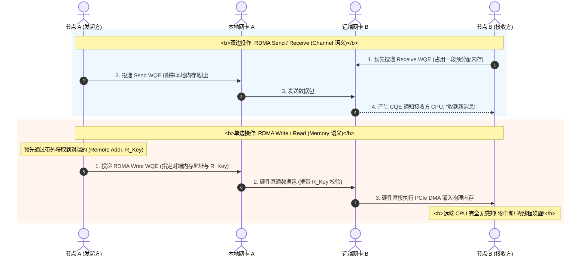
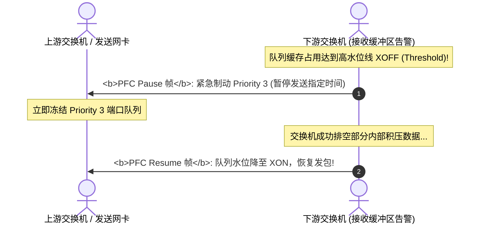
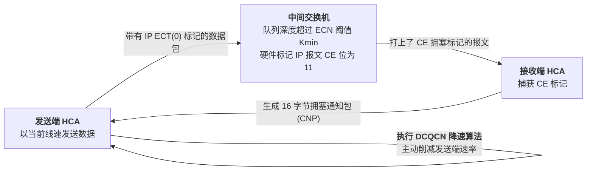

## 引言：400Gbps 吞吐时代的“CPU 内存墙”与延迟危机

在传统的 Linux TCP/IP 协议栈中，数据包从网卡到达应用程序，必须跨越漫长繁琐的链路：
1. 网卡产生硬中断通知 CPU；
2. 内核驱动分配 `sk_buff`，将数据拷贝至操作系统内核空间；
3. CPU 执行协议栈校验（TCP 校验和、解包、重组）；
4. 应用程序调用 `read()` 触发上下文切换，CPU 再次将数据从内核缓冲区拷贝到用户态内存。

在千兆（1Gbps）或万兆（10Gbps）网络时代，这一架构运行得非常稳健。然而，在如今 **400Gbps 甚至 800Gbps 的超大规模 AI 算力与高性能计算（HPC）集群**中，传统机制彻底撞上了**“CPU 瓶颈墙”**：
- **CPU 算力黑洞**：经验公式表明，CPU 每处理 1 Byte 的传统 TCP 数据流，大约需要消耗 1 个 CPU 时钟周期。当网络吞吐达到 400Gbps 时，单机需要占用 **40~50 个顶配 CPU 核心** 纯粹用于搬运数据和响应中断！
- **不可接受的微秒级延迟**：传统 TCP 的端到端通信延迟普遍在 10 ~ 50 微秒（$\mu s$）。在万卡 GPU 协同进行分布式 All-Reduce 通信时，数十微秒的延迟波动会引发严重的木桶效应，使昂贵的 GPU 矩阵全面陷入长尾等待。

为了粉碎 CPU 拷贝瓶颈与内核调度开销，计算机科学家开辟了革命性的通信新纪元 —— **RDMA（Remote Direct Memory Access，远程直接内存访问）**。

---

## 一、 RDMA 第一性原理：内核旁路与零拷贝

RDMA 的设计哲学只有两句话：**绕过内核操作系统（Kernel Bypass），不打扰两端 CPU（Zero-Copy）**。

```mermaid
flowchart TD
    subgraph TraditionalTCP["传统 TCP/IP 通信模式: 两次 CPU 拷贝 + 多次中断"]
        AppA_Mem["用户进程 A 内存"] -->|"CPU 内存拷贝 1"| KernelA["内核 Socket Buffer (sk_buff)"]
        KernelA -->|"PCIe DMA"| NICA["以太网卡 A"]
        NICA -->|"物理以太网"| NICB["以太网卡 B"]
        NICB -->|"硬中断 + PCIe DMA"| KernelB["内核 Socket Buffer"]
        KernelB -->|"CPU 内存拷贝 2"| AppB_Mem["用户进程 B 内存"]
    end

    subgraph RDMAPath["RDMA 高性能通信模式: 零 CPU 介入 + 微秒级直通"]
        RDMA_AppA["用户进程 A 内存"]
        HCA_A["RDMA 网卡 (HCA)"]
        HCA_B["RDMA 网卡 (HCA)"]
        RDMA_AppB["用户进程 B 内存"]

        RDMA_AppA <== "硬件 PCIe DMA 直读 (Zero-Copy)" ==> HCA_A
        HCA_A <== "高速物理光纤链路 (< 1 微秒)" ==> HCA_B
        HCA_B <== "硬件 PCIe DMA 直写 (Zero-Copy)" ==> RDMA_AppB

        RDMA_AppA -. "用户态 Doorbell (Kernel Bypass)" .-> HCA_A
    end
```



### 1.1 内核旁路（Kernel Bypass）
应用程序通过用户态驱动库（如 `libibverbs`）直接与硬件网卡（Host Channel Adapter, HCA）对话。
- 操作系统内核只在**连接建立与内存注册阶段**介入一次；
- 真正传输数据时，用户态应用程序直接向网卡映射的硬件寄存器（Doorbell）写入任务，网卡 ASIC 硬件直接处理传输，**CPU 零上下文切换，零系统调用**！

### 1.2 零拷贝（Zero-Copy）与内存注册（Memory Registration, MR）
网卡硬件通过 PCIe DMA（直接内存访问）直接从主机物理内存（或 GPU 显存 HBM）中抓取或灌入数据，无需在系统内核缓冲区暂存：
- **物理内存锁定（Page Pinning）**：RDMA 驱动调用 `mlock()` 将注册的虚拟内存页锁定在物理 RAM 中，严禁操作系统进行内存换页（Swap Out）；
- **虚拟-物理地址映射写入网卡缓存**：将虚拟地址与物理页帧的映射表（Page Table）预先上传至网卡硬件缓存；
- **安全密钥保护（Protection Keys）**：分配本地密钥 `L_Key`（本地网卡访问鉴权）与远程密钥 `R_Key`（允许对端网卡直接向该内存段执行 DMA 写入的授权凭证）。

---

## 二、 RDMA 软件架构与 Verbs 编程模型

在 RDMA 体系中，通信的基本单元不再是套接字（Socket），而是**队列对（Queue Pair, QP）**。

```
RDMA 核心抽象结构:
+-------------------------------------------------------------+
|                     Host Channel Adapter (HCA)              |
|                                                             |
|   +----------------------- Queue Pair (QP) ---------------+ |
|   |  Send Queue (SQ)   : 发送工作请求 (WQE, Work Request)  | |
|   |  Receive Queue (RQ): 接收工作请求 (WQE)                | |
|   +-------------------------------------------------------+ |
|                                                             |
|   +---------------- Completion Queue (CQ) ----------------+ |
|   |  完成队列元素 (CQE): 记录任务执行成功/失败的硬件通知      | |
|   +-------------------------------------------------------+ |
+-------------------------------------------------------------+
```

### 2.1 双边操作（Two-Sided）vs 单边操作（One-Sided）

RDMA 定义了截然不同的两种通信语义：



1. **双边操作（Send / Receive）**：
   接收方必须**显式预先向 RQ 投递一个接收缓冲（Receive Buffer）**，发送方的数据才能成功写入。接收方 CPU 会收到完成通知（CQE）；
2. **单边操作（RDMA Write / RDMA Read）**：
   发送端只要提前拿到接收端的虚拟地址和 `R_Key`，即可由网卡硬件**直接跨网络把数据刷入接收端内存，远端服务器 CPU 甚至不知道数据已经被写完了！** 这是最极致的超低延迟模式；
3. **原子操作（Atomic Operations）**：
   支持硬件级的 `Compare-and-Swap (CAS)` 与 `Fetch-and-Add (FAA)`，在跨主机的分布式无锁并发控制中具有决定性作用。

---

## 三、 无损以太网 RoCEv2：PFC 与 ECN/DCQCN 拥塞控制

原生 RDMA 是专为 **InfiniBand（IB）硬件**设计的。为了在廉价普惠的以太网交换机上运行 RDMA，业界孵化了 **RoCE（RDMA over Converged Ethernet）** 协议：
- **RoCEv1**：基于二层以太网帧封装，不可跨三层路由器，已被历史淘汰；
- **RoCEv2**：将 RDMA 报文封装在标准 **UDP 报文（目的端口固定为 4791）** 中，支持跨三层 IP 路由。

```
RoCEv2 报文物理封装:
+-------------------+----------------+---------------+--------------------+------------------+
| 以太网头 (14B)    | IPv4 头 (20B)  | UDP 头 (8B)   | RDMA 扩展传输头    | 应用数据有效载荷 |
| EtherType: 0x0800 | ToS/DSCP (CoS) | DstPort: 4791 | (BTH 12B / AETH)   | (0 ~ 4096 字节)  |
+-------------------+----------------+---------------+--------------------+------------------+
```

### 3.1 致命瓶颈：RoCEv2 的丢包敏感性与 Go-Back-N 灾难
与复杂精密的 TCP 协议栈不同，RDMA 网卡 ASIC 的硬件缓存极为精简，**RoCEv2 默认依赖脆弱的 Go-Back-N 重传机制**：
- 一旦网络中丢掉哪怕 1 个数据包，接收端网卡会直接丢弃后续所有按序到达的数据，强迫发送端从丢失的数据包开始全部重发；
- 丢包率仅需达到 0.1%，RoCEv2 的实际吞吐量便会断崖式暴跌 80% 以上！
- **结论**：运行 RoCEv2 的物理以太网，**必须构建为绝对不丢包的“无损网络（Lossless Network）”**！

### 3.2 制造无损：PFC（基于优先级的流量控制，802.1Qbb）

PFC 将单根物理光纤链路抽象为 **8 个独立的虚拟通道（Priority 0 ~ 7）**，通常将 Priority 3 专门分配给 RoCEv2 流量：



#### PFC 隐藏的毒药：死锁与风暴
1. **PFC 死锁（PFC Deadlock）**：
   当网络中存在循环物理拓扑或多路径路由时，交换机 A 暂停交换机 B，交换机 B 暂停交换机 C，交换机 C 又反向暂停交换机 A，形成闭环依赖，**导致全网特定优先级流量瞬间彻底卡死！**
2. **PFC 风暴（PFC Storm）**：
   单个网卡异常或网卡驱动挂死不断发射 Pause 帧，暂停信号逐跳向源端向上漫延倒灌，瘫痪整座数据中心。

### 3.3 拥塞控制闭环：ECN 与 DCQCN 算法

为了在 PFC 暂停机制触发之前，平滑降低端到端发送速率，业界引入了 **DCQCN（Data Center Quantized Congestion Notification）**：



- **交换机侧（ECN 阈值）**：交换机配置 WRED 曲线，当队列长度在 $K_{min}$ 到 $K_{max}$ 之间时，以一定概率将报文 IP 头部的 ECN 字段置为 `11`（Congestion Encountered, CE）；
- **接收网卡（CNP 生成）**：接收端 HCA 发现 CE 报文，立刻生成一个专门的 16 字节 **CNP（Congestion Notification Packet）** 报文直发源端；
- **发送网卡（降速与恢复）**：发送端 HCA 收到 CNP 后，利用内部硬件状态机立即乘法削减当前流的注入速率，并在后续无 CNP 间隔中逐步加法恢复速率。

---

## 四、 生产环境 RDMA 验证实战

在装有 Mellanox/NVIDIA ConnectX 智能网卡的 Linux 服务器上验证 RDMA 状态：

```bash
# 1. 检查 RDMA 物理设备与固件状态
ibv_devinfo

# 2. 检查 RoCE 模式 (确保为 RoCE v2)
cat /sys/class/infiniband/mlx5_0/ports/1/gid_attrs/types/3

# 3. 运行微秒级基准压测 (在一台机器运行服务端，另一台运行客户端)
# 服务端:
ib_write_bw -d mlx5_0 -i 1 -F --report_gbits
# 客户端:
ib_write_bw -d mlx5_0 -i 1 -F --report_gbits 192.168.10.20

# 4. 查看物理网卡 PFC 丢包与暂停帧监控计数器
ethtool -S eth0 | grep -E "pfc|pause"
```

---

## 五、 总结与进阶预告

RDMA 以内核旁路、零拷贝与内存注册三大核心支柱，终结了传统 TCP/IP 协议栈对 CPU 算力的严重剥削；而 RoCEv2 与 PFC/ECN 拥塞控制闭环，则赋予了普通以太网承载无损高性能计算的能力。

然而，在极致的万卡 AI 算力军备竞赛中，基于以太网改造的 RoCEv2 依然面临妥协：
- **PFC 机制治标不治本**：PFC 是逐跳流控，无法从根源上消除死锁风险，网络调优需要平衡数十个极为苛刻的队列水位参数；
- **以太网报文开销与抖动**：以太网的非确定性调度和重传开销，在万卡集群中依然会引入尾部时延；
- **真正为高性能计算而生的原生霸主 —— InfiniBand（IB）**：
  从物理硬件、Credit-based 物理链路流控、切片交换（Cut-Through Switching），到集中式子网管理器（Subnet Manager）全局路径计算，InfiniBand 为何能做到**零死锁、真正的物理级绝对无损与亚微秒级超低时延**？
  从 HDR 200G、NDR 400G 到 2026 年量产的 XDR 800G，InfiniBand 物理信道如何突破极限？

在接下来的**专栏第十讲**中，我们将全面揭开纯血超级算力网络的终极面纱 —— **[InfiniBand 架构第一性原理：物理链路速率演进、Credit-Based 链路级流控与子网管理器 (Subnet Manager) 全局编排](/articles/infiniband-architecture-hardware-rates-credit-flow-subnet-manager/)**！

---

## 常见问题 (FAQ)

### Q1: 什么是 PFC 死锁（PFC Deadlock），现代数据中心无损网络如何根除它？
**根本原因：缓冲区有向无环图（DAG）的破坏与环路依赖。**
当物理网络发生微小环路、或由于多路径路由（ECMP）产生横向流量时，数据包可能在相邻交换机的缓冲区队列中形成闭环依赖。交换机 1 的端口队列满，向上游交换机 2 发送 PFC Pause；交换机 2 暂停交换机 3，而交换机 3 正好把数据发向交换机 1。此时所有交换机都在等待下游释放缓冲区，而自身缓冲区又永远无法排空，形成致命死锁。
**根除方案**：
1. **严格的拓扑无环性保证**：在 Leaf-Spine 组网中严格禁止同级互联（Spine-to-Spine / Leaf-to-Leaf），确保转发路径在有向无环图（DAG）内单向流动；
2. **硬件级 PFC 死锁检测与自动恢复（PFC Deadlock Detection and Recovery, PFD）**：现代网卡与交换机芯片内置看门狗定时器。一旦某个队列处于 Pause 状态超过阈值（如数百毫秒），判定发生死锁，强制临时丢弃该队列的积压数据包并恢复发包，防止全网瘫痪。

### Q2: 在 RDMA 编程中，为什么单边操作（RDMA Write/Read）的端到端吞吐与时延表现通常大幅优于双边操作（Send/Receive）？
**核心差异在于目标端节点 CPU 与软件协议栈的介入深度：**
- **双边操作（Send/Recv）**：接收端 CPU 必须持续介入。应用进程必须实时监控并向 Receive Queue (RQ) 中反复补充新的 WQE 缓冲区块；当消息到达时，接收端网卡必须向内存写入 CQE 并通知应用程序进行处理，两端存在软件锁与内存回收协同开销；
- **单边操作（RDMA Write/Read）**：属于纯硬件行为。发送方在获取目标端的虚拟地址和 `R_Key` 授权后，所有通信全程由两端的网卡 ASIC 硬件通过 PCIe DMA 直接读取/刷入物理内存，**接收端 CPU 完全无感知、零中断、零唤醒、零系统锁争抢**，直接打出纳秒级响应与满线速带宽。

### Q3: RoCEv2 与原生 InfiniBand（IB）在链路层与物理实现上有何本质不同？
1. **流控机制的物理维度不同**：
   - RoCEv2 运行在有损的以太网上，依赖反应式的 **PFC Pause 帧（出现拥塞后反向刹车）**，容易发生死锁与风暴；
   - InfiniBand 采用原生底层的 **Credit-Based 信用度流控**。发送端在发包前必须预先拥有接收端赋予的信用额度（Credit），接收端没有缓冲区就绝对不发，从物理层面 100% 杜绝了缓冲区溢出丢包与死锁；
2. **协议报头开销与转发延迟**：
   - RoCEv2 必须包含完整的以太网帧头、IPv4 报头与 UDP 报头（至少 42 字节开销），交换机转发延迟普遍在数百纳秒；
   - InfiniBand 使用极简的本地路由头（LRH）与基本传输头（BTH），采用超轻量 Cut-through 直通转发，硬件交换延迟通常低于 100 纳秒。
