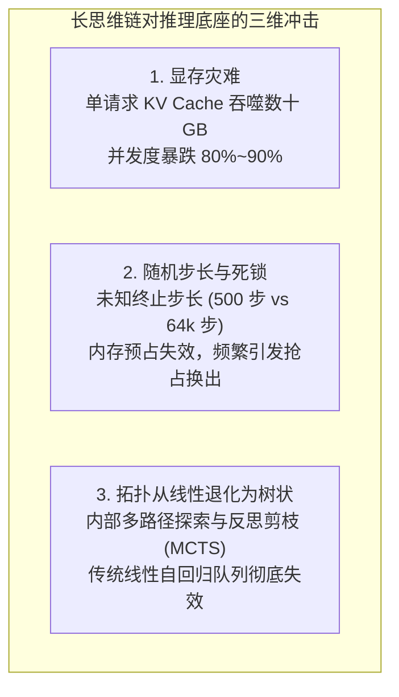
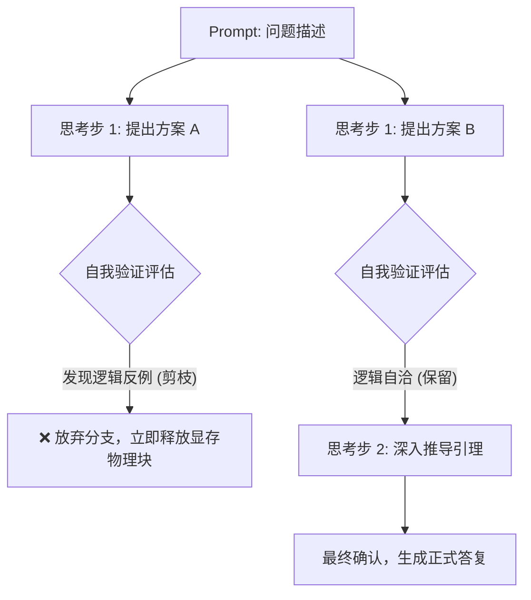
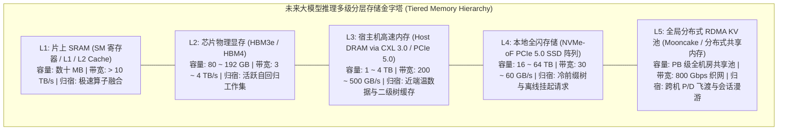
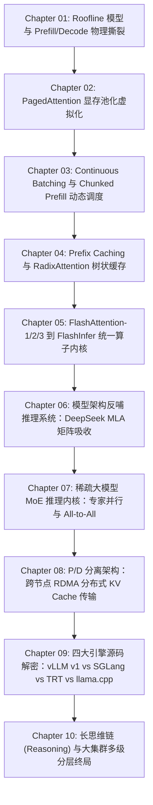

## 引言：自回归推理的历史性拐点 —— 思考时间扩展

在 2024 年之前，全球所有大模型推理系统的架构设计都建立在一个不言自明的隐含假设之上：**“大输入，短输出”**。

在传统的问答、对话、搜索与代码辅助业务中，用户的输入 Prompt 往往包含数百甚至数千字的背景文档（占总 Token 数的 $80\% \sim 95\%$），而模型生成的回答通常只有数十至数百个 Token。因此，推理系统优化的核心主轴始终围绕着 **“如何快速吃掉长 Prompt（极致 Prefill 算力利用率 MFU）”** 以及 **“如何平滑并发承载短 Decode”**。

然而，以 **OpenAI o1/o3/o-series、DeepSeek-R1 以及月之暗面 Kimi K3** 为代表的长推理（Reasoning / Thinking）模型的崛起，彻底粉碎了这一工程根基。

大模型的发展正式跨入了 **推理时计算扩展（Test-Time Compute Scaling）** 的崭新纪元：

```text
大模型范式转移：两条独立的缩放曲线
┌─────────────────────────────────────────────────────────────┐
│ 1. 预训练缩放曲线 (Pre-training Scaling Law):                 │
│    增加参数量、预训练数据与集群算力 -> 逼近数据枯竭与物理耗能墙│
├─────────────────────────────────────────────────────────────┤
│ 2. 推理时缩放曲线 (Test-Time Compute Scaling Law):           │
│    强化学习引导下的自我反思、验证搜索与长思维链 -> 智力无限外推  │
└─────────────────────────────────────────────────────────────┘
```

为了解决一道高难度的数学证明、系统架构设计或复杂的竞赛级代码难题，模型不再急于吐出第一个答案，而是在后台默默展开长达数万步的显式思考链（Thinking Process / Chain of Thought）。模型在内部自回归地提出假设、尝试解题、自我质疑、推翻重构并交叉验证：

- **输入 Prompt**：可能仅有短短 200 个 Token；
- **自回归输出（思考 Token + 最终输出）**：暴涨至 **$16,384 \sim 131,072$（16k ~ 128k）Token**！

**输出长度反超输入长度数百倍！**
这种由算法演进带来的翻天覆地的流量形态倒挂，给当代所有基于 PagedAttention 与 Continuous Batching 的推理系统投下了最具毁灭性的三记重锤。

本文作为**《大模型推理引擎：从模型演进、内核架构到未来终局》**专栏的第十讲 —— **全专栏终局收官之作**，将从长思考链对系统的物理冲击出发，推导面向思考模型的新一代调度范式，并终极描摹多级分层存储与全解耦池化的大集群终局蓝图。

---

## 一、 长思考链对推理系统的三记重锤



### 1.1 显存灾难：KV Cache 的爆炸式雪崩

在[专栏第一讲](/articles/inference-roofline-prefill-decode/)与[专栏第二讲](/articles/pagedattention-memory-virtualization/)中，我们建立了一个基本常识：**Decode 阶段的显存开销随生成步长呈严格的线性扩张**。

我们来计算当单请求生成 **64k（65,536）个思考 Token** 时，推理引擎需要为它维护多大体积的独占 KV Cache：

以常见的 **LLaMA-3-70B**（80 层，8 个 KV 头，128 维度，FP16 精度）为例，单 Token 的全层 KV Cache 占用为 $320 \text{ KB}$。
当单请求思考到 64k 深度时，其独占的显存高达：
$$\text{VRAM}_{\text{req}} = 320 \text{ KB} \times 65,536 \approx 20.97 \text{ GB}!$$

这是一个令人窒息的数字：**仅仅处理一个用户的单次提问，就需要独吞近 21 GB 的宝贵 GPU 显存！**
即使在 8 卡 H100（每卡 80GB，整机 640GB 显存，扣除 140GB 权重后剩余约 500GB）的顶级节点上，系统在过去原本可以轻松承载数百个并发连接；而在长思维链模式下，**整台服务器仅仅塞下 20 多个并发思考请求，显存池就会被当场榨干殆尽！**

并发容量暴跌一个数量级，直接导致集群的服务成本（TCO）以指数级飙升。

### 1.2 随机步长与内存死锁：动态预算的无序性

传统文本补全任务的输出长度相对可预测，调度器可以基于统计分布预估请求的存活周期。

然而，长思考模型具备高度的**随机终止步长（Stochastic Step Length）**：
- 简单的题目：模型思考 500 步后便生成答案并输出 `[EOS]`；
- 复杂的陷阱题：模型在第 15,000 步陷入自相矛盾，触发深入推导，思考步长一路失控膨胀至 64k 甚至 128k 上限。

调度器陷入了两难的死局：
- **如果激进调度**：当显存池水位达到 $90\%$ 时继续接客，一旦正在运行的多个请求同时展开深度思考，显存池将在几十步内瞬间打爆（Out-of-Memory），调度器被迫触发极其痛苦的**抢占与显存换出（Preemption & Swap-out）**，吞吐量断崖式下跌；
- **如果保守调度**：为每个请求预留 64k 显存上限，整台服务器的显存利用率长期只有 $15\% \sim 25\%$，硬件被极度闲置。

### 1.3 从一维线性生成走向高维树状探索（MCTS / Branching）

长思考模型的底层核心不仅仅是简单的“一路自回归到黑”。在前沿的 Test-Time Search（如 Best-of-N 采样、蒙特卡洛树搜索 MCTS、Beam Search 与多分支反思验证）范式下，推理引擎处理的不再是一根单向的一维 Token 序列，而是一棵**动态生长的推理拓扑树**：



如果底层推理引擎依然把每个分支当作独立请求处理，多个分支对公共前缀历史的重复计算与显存副本将成倍爆炸；而如果调度器无法实现分支的**动态分叉、快速回溯与瞬间显存垃圾回收（Pruning GC）**，高阶搜索策略根本无法在生产集群中落地。

---

## 二、 面向思考模型的全新推理系统范式

面对长思考链的严酷挑战，下一代推理底座正在经历一场深层次的架构蜕变：

### 2.1 思考链投机解码（Speculative Decoding for Long CoT）

在长达数万步的思考过程中，模型输出的并不全是高密度的灵感突变，而是夹杂着海量的逻辑公式展开、固定的伪代码结构、反思连接词模板（如 *"Wait, let me double check the previous deduction step..."*）。这些过渡文本的局部熵极低，具有极高的可预测性。

因此，[投机采样（Speculative Decoding）](/articles/speculative-decoding-eagle-guide/)在长思考模型中迎来了二次爆发：
1. **草稿树与思考模式匹配**：采用针对数学与逻辑任务微调过的小尺寸 Draft Model（如 1B~3B），或者基于当前模型隐藏状态的 **EAGLE-3 动态推测树**；
2. **多 Token 投机验证重叠**：大模型单步验证通过 3~5 个思考 Token，将原本耗时数分钟的万字深度思考过程直接压缩 3 到 4 倍！

```text
常规自回归长思考:
[Decode 1] -> [Decode 2] -> [Decode 3] -> ... -> [Decode 64000] (极度耗时)

EAGLE-3 投机树加速长思考:
[Draft 树推测 5 Tokens] -> [主模型单步验证通过 4 Tokens] (速度翻 3x~4x)
```

### 2.2 Branch-and-Prune 分支剪枝树状调度器

为了原生承载 MCTS 与搜索推理，底层的调度器必须全面以[RadixAttention 树状状态机](/articles/prefix-caching-radix-attention-internals/)为核心，演化为 **分支剪枝树状调度器（Branch-and-Prune Scheduler）**：

- **引用计数共享（Reference-Counted Tree Sharing）**：多个探索分支共享同一个父节点的 PagedAttention 显存物理块；
- **微秒级物理块即时回收（Instant Pruning GC）**：一旦验证模块判定某条思考路径陷入错误假死，调度器在数微秒内将该子树全部节点的引用计数减一，被放弃的数千个显存块瞬间无缝归还给全局空闲链表，支撑其他高价值分支继续下潜；
- **写时复制（Copy-on-Write, CoW）**：只有当不同的分支在某一步生成不同 Token 时，才分裂出独立的物理显存块。

### 2.3 动态思考预算控制器（Dynamic Thinking Budget Governor）

在云原生生产环境中，推理服务必须具备 **自我约束能力**。
下一代引擎引入了与模型强化学习策略深度联动的 **动态思考预算控制器**：
- 引擎通过轻量级的内部 Value Head 探针监控每一步思考的熵值与收敛状态；
- 如果监测到模型在某一逻辑循环中陷入无意义的“原地打转（Infinite Thinking Loop）”，控制器将直接在底层拦截并在下一个采样步强制向模型注入控制信号（如提前引导至反思总结），将失控请求强行软着陆，捍卫整个集群的可用性水位。

---

## 三、 集群终局：跨介质多级分层存储与全解耦池化

长思维链彻底揭示了一个残酷的事实：**单纯依赖极其昂贵、容量有限的 GPU HBM 显存来满足所有长文本思考，在经济学与物理学上是不可持续的。**

未曾彻底解构的集群，终将被长思考链淹没。面向未来五到十年的推理基础设施，正在发生一场波澜壮阔的终极范式转移 —— **从“计算密集型集群”，演进为“以数据流动为中心的跨介质多级分层存储池”。**



### 3.1 跨介质五级金字塔

在全新的终局形态中，KV Cache 不再是随生随灭的瞬态张量，而是被分层抽象为具有完整生命周期的数据资产：

1. **L1（片上 SRAM）**：容量极小（数十 MB），依托 FlashInfer 与极致算子融合，承担微秒级单步 Attention 的中间状态暂存；
2. **L2（GPU 物理显存 HBM）**：仅存放当前正在执行自回归计算的 **最热工作集（Working Set，如最近数千个 Token）**；
3. **L3（Host DRAM via CXL 3.0）**：借助新一代 CXL（Compute Express Link）3.0 内存池化技术，单机可低延迟扩展至数 TB 内存空间，作为 HBM 的无感透明二级扩展；
4. **L4（全闪 NVMe-oF SSD）**：存放被广泛共享但访问频次稍低的基础系统前缀树（如企业通用知识库前缀）；
5. **L5（全局 RDMA 分布式 KV 池）**：我们在[第八章 P/D 分离](/articles/pd-disaggregation-distributed-kv-cache/)中讨论的跨机高速 Fabric 平面。整个机房成千上万台服务器的存储介质被彻底打通，任意一台 P-Worker 计算产生的前缀块，可以在数十毫秒内被调度至集群中任意一台空闲的 D-Worker 继续吐字。

### 3.2 计算、存储、网络三层彻底解耦

未来的 AI 数据中心将不再划分“这一台机器是谁的”：
- **算力节点（Compute Slices）**：由搭载极致密度 Tensor Core 的算力芯片组成，芯片上只保留极少量的超高速显存，专职负责极速执行矩阵乘法；
- **内存池节点（Memory Slices）**：由高密度 HBM、CXL 内存条构成的海量独立存储阵列，专注于以最低功耗驻留海量并发的 KV 状态；
- **全光调度交换平面（Optical Interconnect Fabric）**：光电混合交换机在数微秒内完成计算单元与存储单元之间的动态配对。

**大模型推理底座的终局，是一座巨大的全局内存操作系统。**

---

## 四、 全专栏十讲大闭环：十年推理工程史的思维坐标

写到这里，**《大模型推理引擎：从模型演进、内核架构到未来终局》** 专栏的全部十个章节，终于在这一刻完成了宏伟的逻辑大闭环：



回顾整套知识体系的演进足迹：
- 我们从最底层硬件的冷酷现实出发（**第 1 章** Roofline 与物理撕裂）；
- 见证了软件工程对硬件显存碎片的优雅驯服（**第 2 章** PagedAttention 分页）；
- 经历了批处理从静态粗暴走向动态细粒度的调度革命（**第 3 章** Continuous Batching 与 **第 4 章** 前缀树）；
- 探秘了 CUDA 算子与片上 SRAM Tiling 的极限微架构压榨（**第 5 章** FlashAttention 与 FlashInfer）；
- 记录了模型算法结构主动向底层系统妥协反哺的工业智慧（**第 6 章** MLA 矩阵吸收 与 **第 7 章** MoE 稀疏专家并行）；
- 打破了单机物理桎梏，走向跨机线速飞渡与引擎源码深水区（**第 8 章** P/D 分离 与 **第 9 章** 四大引擎源码对决）；
- 最终在此刻，站在长思维链与 Test-Time Compute 的历史潮头，眺望下一代多级分层存储与池化世界的星辰大海（**第 10 章**）。

无论大模型架构在未来如何演进 —— 从 Transformer 到混合架构，从稠密走向稀疏，从单模态跨越至通用多模态 —— **人类对抗物理边界（算力受限与访存受限）、通过软硬件协同设计（Co-design）榨取极致能效的核心哲学，永远不会改变。**

愿这套专栏成为你纵横大模型系统工程世界中最坚实的物理底座与思维罗盘！

---

## 常见问题 (FAQ)

### Q1: 在长思维链（Reasoning）模型下，传统的 Chunked Prefill 策略是否已经彻底失效？
**并没有失效，但它的战略重心发生了转移。**
在传统混合部署中，Chunked Prefill 的核心目标是防止超长 Prompt 阻塞短 Decode。在长思维链模型中，由于输入 Prompt 通常偏短（如 500~2000 tokens），Prefill 阶段引发的时延颠簸大幅减轻。然而，Chunked Prefill 依然具有不可替代的作用：
1. **多轮思考与工具调用**：当 Agent 在思考中途调用本地环境（如运行 Python 代码、执行 Bash 脚本）后，产生的巨大环境反馈（如长报错堆栈、上万行数据表）会作为新的 Prefill 输入回灌给模型，此时依然需要 Chunked Prefill 防止排头阻塞；
2. **P/D 分离下的 P-Worker 内部公平调度**：多个客户端并发进入 Prefill 队列时，细粒度分块仍是保障小请求毫秒级穿透的核心手段。

### Q2: 为什么长思维链场景下，投机解码（Speculative Decoding）的加速比往往远超传统问答场景？
主要源于长思维链独特的**局部信息熵分布**：
在传统生成任务中（如创意写作或发散问答），模型每一步生成的选择空间非常大（Token 熵值较高），小 Draft 模型的预测准确率相对偏低（通常验收率在 $50\% \sim 70\%$）。
而在长思考链中，模型处于严密的数学推导、逻辑论证与反思排错状态。其思考过程大量充斥着高确定性的模板化语言结构、连续符号演绎以及固定语法约束（如 LaTeX 代码、逻辑连接词）。此时，专职调优的小型 Draft 模型拥有极高的命中率（验收率可达 $80\% \sim 90\%$ 以上），使得投机树验证能够以极大步长向前跳跃推进，从而释放出远超传统场景的 $3\times \sim 5\times$ 惊人加速比。

### Q3: CXL 3.0 内存池化技术在推理集群中的普及，是否意味着我们可以不再依赖昂贵的 HBM？
**不能，CXL 内存的作用是“容量扩展（Expansion）”，而非替代 HBM。**
两者的物理定位泾渭分明：
- **HBM 的不可替代性**：目前顶级 HBM3e/HBM4 提供了高达 **$3 \sim 4 \text{ TB/s}$** 的极致吞吐带宽，这是自回归计算中跑满高吞吐 Decode GEMV 的绝对底线；
- **CXL 3.0 的核心价值**：通过 PCIe 5.0/6.0 织网，CXL 提供了数十至数百 GB/s 的带宽与仅约一百多纳秒的访问延迟。这一带宽不足以支撑活跃的最内层自回归计算，但它极其适合存放**“前缀树中深度的历史 KV 块”**以及**“暂时处于等待分支判断的休眠请求”**。
将数据在 HBM 与 CXL 之间毫秒级平滑换入换出，使得系统能以极低成本承载海量长并发，形成了高带宽与大容量的黄金互补。
