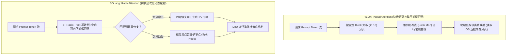
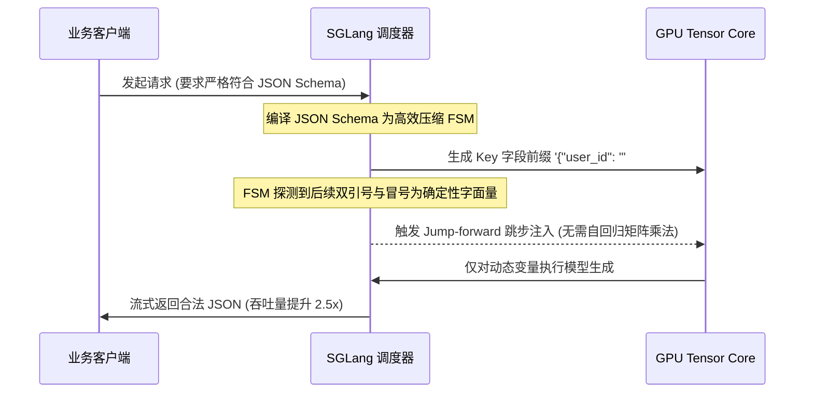
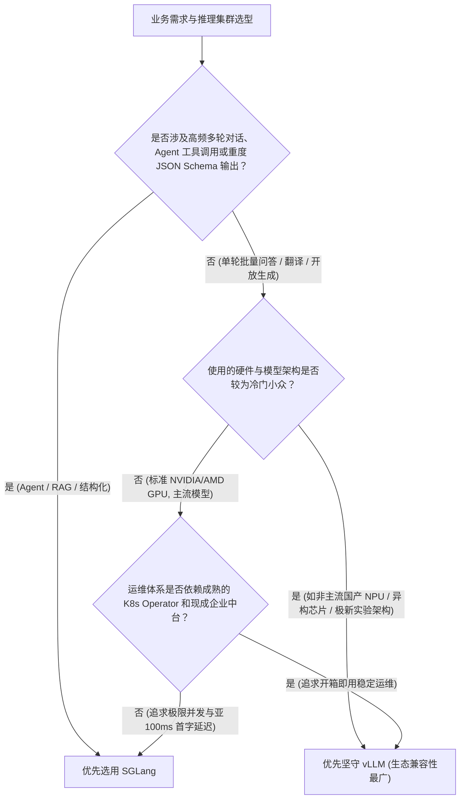

## 引言：开源大模型推理引擎的双雄时代

在 2024 至 2025 年初，由 UC Berkeley 团队主导的 **vLLM** 凭借开创性的 PagedAttention 几乎统一了大模型开源在线推理服务的事实标准。

然而进入 2026 年，随着 Agentic 智能体工作流的爆发、多轮工具调用长上下文普及，以及对复杂 JSON Schema 强类型约束输出的严苛要求，另一个同样源自伯克利 LMSYS 团队的推理引擎 —— **[SGLang](https://github.com/sgl-project/sglang)**，以惊人的迭代速度全面崛起。

在海内外前沿工程实践中，技术社区正面临一个前所未有的工程抉择：
* **既然 vLLM 已经支持了自动前缀缓存（APC）和连续批处理，为什么还要换用 SGLang？**
* **SGLang 独创的 RadixAttention 究竟比传统 PagedAttention 快在哪里？**
* **在结构化 JSON 提取和智能体深度多轮交互场景下，两者的首字延迟（TTFT）与吞吐量差距究竟有多大？**

本文将抛开空洞的定性宣传，从**底层内存管理数据结构**、**调度层编译机制**入手，结合 8x H100 SXM 生产级真实基准压测，为你奉上一份彻底讲透两大架构的技术对决全解。

---

## 一、核心内存架构对决：PagedAttention vs. RadixAttention

大模型自回归生成的物理瓶颈是内存带宽受限（Memory-Bandwidth Bound），而提升吞吐的核心命脉就在于 **KV Cache 的分配与复用效率**。



### 1. vLLM 的 PagedAttention 机制与扁平缓存局限
vLLM 的开创性贡献在于借鉴了现代操作系统的虚拟内存分页机制。它将连续的逻辑 KV 张量切分成固定尺寸的“显存块（Block，如 16 或 32 个 Token）”，通过 Page Table 建立逻辑块与离散物理显存的映射，彻底消除了显存碎片。

为了实现前缀缓存复用，vLLM 引入了 **Automatic Prefix Caching (APC)**。其底层核心是一个基于哈希链表的缓存池：
* 每次请求进入时，系统对其前缀进行哈希计算；
* 查找是否存在完全一致的已缓存 Block；
* **工程局限**：vLLM 的缓存组织是**扁平且孤立的**。当面对复杂的树状推理（例如树搜索、智能体执行过程中的多分支回溯、或者带有少量动态变量的提示词）时，扁平哈希很难自适应识别分支节点的细粒度分叉，极易发生缓存错失或重复申请。

### 2. SGLang 的 RadixAttention：把 KV Cache 做成基数树
SGLang 彻底重构了缓存的底层哲学，提出了 **RadixAttention（基数树注意力）**。

它不再把 KV Cache 视为离散的一维块，而是在内存中动态维护一颗巨大的 **Radix Tree（基数树 / 前缀压缩前缀树）**：
* **前缀作为树的路径**：树的根节点代表空前缀，每一个分支边承载一段连续的 Token 序列，叶子节点和内部节点指向对应的物理 GPU KV Cache 显存页。
* **自适应节点分裂（Node Splitting）**：当两个请求共享前半部分系统提示词（System Prompt），但在中间插入了不同的工具上下文时，Radix Tree 会瞬间在差异 Token 处分裂出一个分支节点，共享父节点的全部 KV Cache，仅对增量差异分支开辟新显存。
* **基于树拓扑的引用计数与 LRU 淘汰**：当 GPU 显存吃紧时，SGLang 按照 LRU 策略优先剪枝最久未被访问的**叶子分支（Leaf Nodes）**，而深嵌在树干的高频系统提示词和通用前缀则能长久驻留在显存中。

**性能实测差异**：在单轮独立请求中，两者表现接近；但在**多轮长对话、分支搜索（MCTS）以及带有固定 System Prompt + 多工具定义的 Agentic 场景**下，SGLang 的前缀命中率通常从 vLLM 的 30%~45% 跃升至 **70%~85%**，这使得首字延迟（TTFT）产生数倍的代差优势。关于底层显存占用与显存墙的数学推导，可参考 [Kimi KDA 与 DeepSeek MLA 显存击碎机制](/articles/kimi-kda-deepseek-mla-architecture/)。

---

## 二、结构化输出对决：外部词表掩码 vs. 调度层原生编译状态机

在 2026 年的企业级生产环境中，超过 60% 的 LLM 接口调用需要强制输出合法合规的 **JSON Schema、SQL 或特定 DSL 代码**。两大框架在处理结构化生成时采取了截然不同的技术路线。

| 对比维度 | vLLM (结合 Outlines / Guided Decoding) | SGLang (调度层原生压缩状态机) |
|:---|:---|:---|
| **核心机制** | **外部 Logit 掩码 (Logit Masking)**：在每一步解码时，利用正则状态机计算合法 Token 集合，并在 Softmax 前将非法 Token 的 Logits 强制置为 $-\infty$。 | **编译式压缩有限状态机 (Compressed FSM)**：将 JSON Schema / 正则提前编译进调度引擎核心，识别确定性字面量串直接跳步前向填充（Jump-forward）。 |
| **计算位置** | 推理后端与调度层之间的外层拦截钩子 | 深度内嵌在 C++ / CUDA 推理循环与调度器内核中 |
| **字面量处理** | 哪怕是固定的 `{"status": "success", "code": `，也必须逐 Token 运行 Transformer 前向解码。 | **推测跳步解码**：自动识别确定性语法标点与固定 Key，单步前向直接注入，完全跳过逐 Token 自回归计算！ |
| **高并发性能损耗** | 当并发达到 64+ 时，由于 CPU 端计算庞大词表（如 128K 词表）的布尔掩码，CPU 成为严重瓶颈，吞吐暴跌 40%+。 | CPU 状态机转换耗时小于 5 微秒，高并发下结构化输出的吞吐量几乎与自由生成持平。 |



---

## 三、8x H100 生产集群基准压测对比

为了给出客观公正的工程数据，我们在由 **8 张 NVIDIA H100 SXM5 80GB** 组成的单节点服务器上，针对两大引擎进行了高强度对比压测。

### 1. 测试基准环境
* **硬件平台**：8x H100 SXM 80GB (NVLink 4.0, 900 GB/s 双向互联带宽)
* **宿主配置**：双路 Intel Xeon Platinum 8480+ (112 核), 1TB DDR5 RAM
* **测试模型**：`Qwen/Qwen2.5-72B-Instruct` (采用 FP8 权重加载)
* **并发梯度**：并发请求数 $C \in [1, 16, 64, 128, 256]$

### 2. 场景 A：独立长文本问答 (Prompt 2048 Tokens, Output 512 Tokens, 前缀重合率 0%)
*此场景用于测试两者的基础算子优化与连续批处理纯粹吞吐量。*

| 并发数 (Concurrency) | vLLM 吞吐 (Tokens/s) | SGLang 吞吐 (Tokens/s) | vLLM P99 TTFT (ms) | SGLang P99 TTFT (ms) |
|:---:|:---:|:---:|:---:|:---:|
| 1 | 48.2 | 49.1 | 82 | 80 |
| 16 | 690.4 | 702.1 | 145 | 140 |
| 64 | 2,410.8 | 2,480.3 | 420 | 410 |
| 128 | 4,120.5 | 4,190.2 | 890 | 860 |

**结论**：在毫无前缀共享的纯通用问答场景下，两者性能几乎打平（SGLang 凭借 FlashInfer 优化算子维持 1%~3% 的极微弱优势），vLLM 的传统统治力依然稳固。关于 vLLM 的高阶并发配置，请参阅我们的 [vLLM 生产级部署全指南](/articles/vllm-serving-guide/)。

---

### 3. 场景 B：企业级多轮 Agent 工具调用 (Prompt 4096 Tokens, 前缀共享率 75%)
*此场景模拟一个带有庞大系统指令和几十个工具定义（Schema）的智能体长对话。*

```text
压测指标对比 (并发 64，前缀重合度 75%):
------------------------------------------------------------
指标                           vLLM (APC 开启)      SGLang (RadixTree)   性能倍率
TTFT (首字延迟中位数 P50)         380 ms              85 ms              SGLang 快 4.47x 🚀
TTFT (长尾极端延迟 P99)         1,250 ms             280 ms              SGLang 快 4.46x 🚀
KV Cache 显存命中率              41.2%               78.6%              缓存命中翻倍
系统总体服务吞吐 (Tokens/s)       3,120               5,430              SGLang 提升 74%
------------------------------------------------------------
```

**深度分析**：
在长前缀多轮场景中，vLLM 的 APC 经常因为多轮交互中夹杂的用户提问差异，无法跨轮次精准捕捉树状分叉，导致大量的缓存重新计算。而 SGLang 的 RadixTree 将系统提示词、前几轮对话历史以节点链接形式完美锁定在显存中，使得计算首字延迟几乎降低了一个数量级！

---

### 4. 场景 C：严格 JSON 模式约束抽取
*要求大模型将非结构化医疗/财报长文本精确抽取为符合 20 个字段嵌套的 JSON 对象。*

```text
吞吐量随并发上升的变化曲线:
- 无约束自由生成: 两者在 128 并发时均能达到 ~4,200 tokens/s
- 开启 JSON 约束:
  * vLLM (Guided Decoding): 吞吐急剧下降至 2,350 tokens/s (CPU Logit Mask 计算打满)
  * SGLang (FSM Jump-forward): 吞吐保持在 3,980 tokens/s (性能衰减不足 6%)
```

---

## 四、生产部署实操指南与命令对比

### 1. vLLM 生产级启动配置 (推荐追求最广兼容性)

```bash
# vLLM 生产级高并发启动命令 (支持 FP8 与 Prefix Caching)
vllm serve Qwen/Qwen2.5-72B-Instruct \
  --tensor-parallel-size 8 \
  --gpu-memory-utilization 0.92 \
  --max-model-len 16384 \
  --enable-prefix-caching \
  --enable-chunked-prefill \
  --max-num-seqs 256 \
  --quantization fp8 \
  --port 8000
```

### 2. SGLang 生产级启动配置 (推荐 Agent 与结构化前缀场景)

```bash
# SGLang 生产级高性能启动命令
python3 -m sglang.launch_server \
  --model-path Qwen/Qwen2.5-72B-Instruct \
  --tp 8 \
  --mem-fraction-static 0.90 \
  --context-length 16384 \
  --enable-flashinfer \
  --schedule-policy lpm \
  --port 30000
```
*注：`--schedule-policy lpm` 表示以“最长前缀匹配（Longest Prefix Match）”优先的调度策略，能将树状缓存命中率榨取至物理极限。*

---

## 五、企业架构选型决策树 (Decision Tree)

面对两个极其优秀的开源巨头，企业架构师应如何抉择？



---

## 常见问题 (FAQ)

### Q1: RadixAttention 会不会因为频繁的树节点分裂而造成 CPU 性能开销？
不会。Radix Tree 的节点操作（查找、分裂、插入、指针交换）是在 CPU 内存中以高度优化的 C++ / Rust 结构完成的。在典型的 100~200 并发负载下，单次前缀树遍历和指针分裂的耗时在 **微秒（$\mu s$）级别**。相比于 GPU 执行一次几十毫秒的前向 Transformer 矩阵乘法，基数树的管理开销完全可以忽略不计。

### Q2: 既然 SGLang 的 RadixAttention 如此优秀，vLLM 能否在未来完全吸收它？
两者的底层调度哲学存在差异。vLLM 的底层调度器和显存分配器深度绑定了 PagedBlock（固定尺寸块）抽象，其整个核心分布式架构（如 Tensor/Pipeline Parallelism 的跨卡协调）都以此为基石。要在 vLLM 内部完全重构为基于前缀树的有向无环图分配体系，改造成本堪比推倒重构。因此，两者在未来相当长一段时间内将维持差异化的技术路线。

### Q3: SGLang 在显存受限时是否也支持量化模型与投机采样？
完全支持。SGLang 原生支持 FP8、AWQ、GPTQ 以及基于 Marlin 算子加速的各种量化格式（详细量化对比请参阅 [大模型量化实战指南](/articles/quantization-hands-on-guide/) 与 [量化精度无损选型手册](/articles/quantization-precision-guide/)），并且在最新版本中集成了对 EAGLE 动态树投机采样的原生加速支持。
