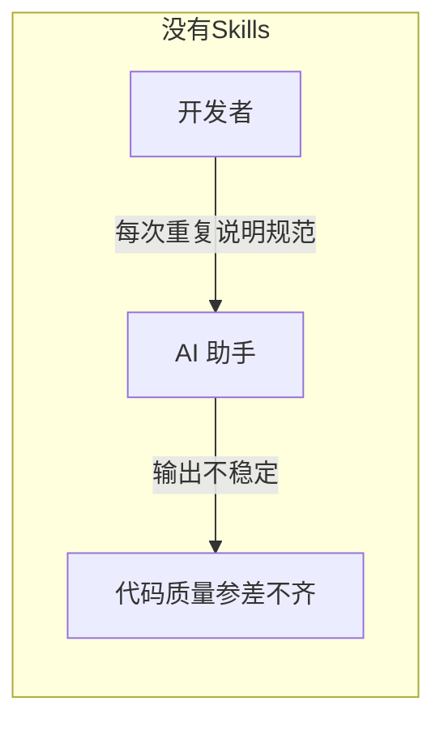
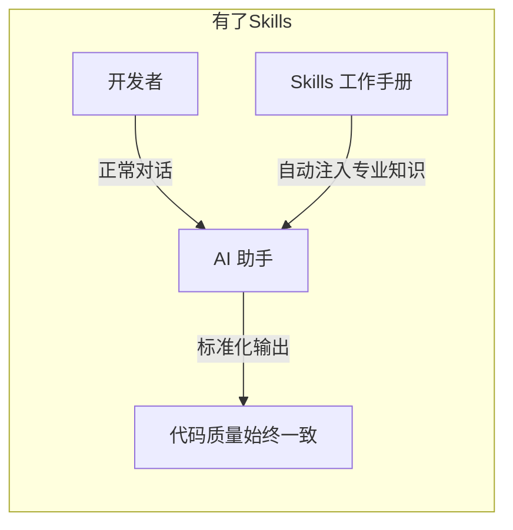
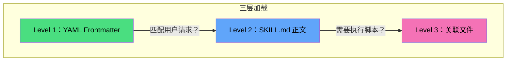
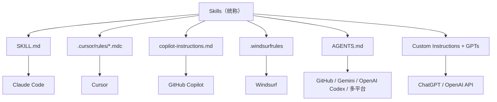
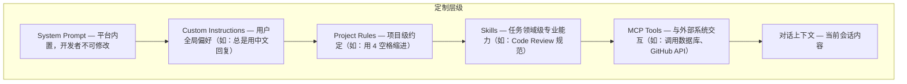
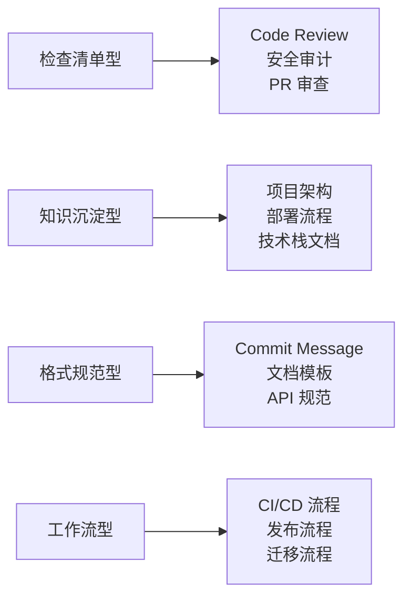
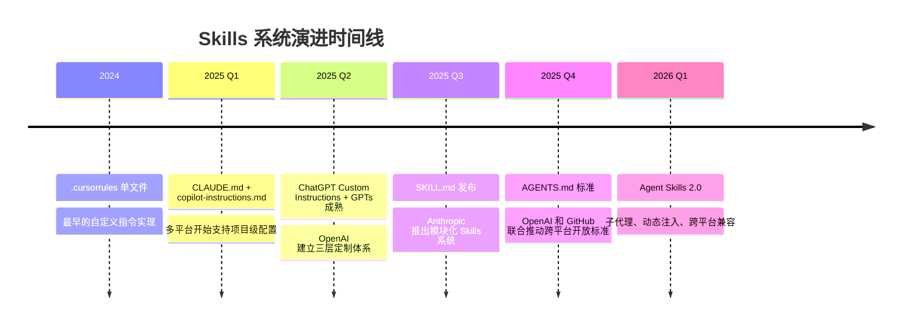
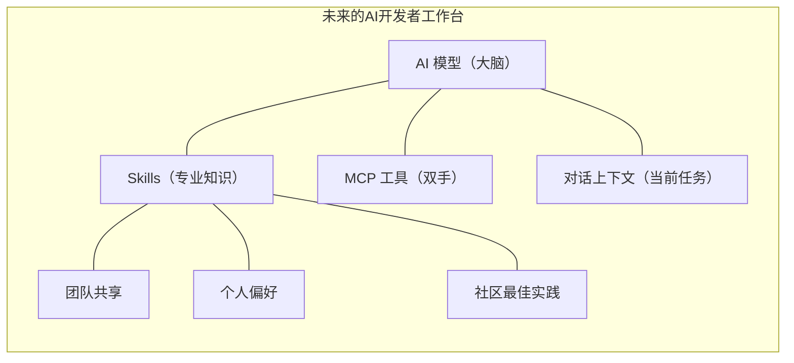

## 什么是 Skills？

假设你招了一个 IQ 极高的新人，他学什么都快，但他**不了解你的项目**——不知道你的代码规范、不熟悉你的技术栈、更不清楚你团队的 Code Review 标准。每次分配任务，你都得从头说一遍。

**Skills 就是你给这个"AI 新人"准备的工作手册**。





Skills 是 **AI 编程助手的模块化能力扩展包**——通过结构化的 Markdown 文件，将团队的编码规范、最佳实践、工作流程「一次编写，永久生效」地注入 AI 的工作上下文。它不改变 AI 的"智商"，但极大提升了它的"专业度"。

## 为什么需要 Skills？

| 痛点 | 没有 Skills | 有了 Skills |
|------|------------|------------|
| **重复指令** | 每次对话都要重复"用 4 空格缩进""函数不超过 50 行" | 写一次  Skills，永久自动遵守 |
| **输出不一致** | 同一个 Code Review 任务，每次给出不同的检查维度 | 严格按照 Skills 定义的清单审查 |
| **上下文遗忘** | AI 不记得你的项目用 FastAPI + PostgreSQL | Skills 自动注入项目技术栈上下文 |
| **团队协作** | 每个人的 AI 都要单独教育 | Skills 随代码仓库共享，全团队一致 |
| **能力局限** | AI 只有通用能力 | Skills 可包含脚本和模板，扩展执行能力 |

## Skills 核心机制：三层渐进式加载

以 Claude Code 的 SKILL.md 为代表，Anthropic 设计了一个优雅的"按需加载"架构。核心设计哲学是 **"Token 就是金钱"**——在保持功能丰富的同时，最大限度地节省上下文窗口资源。



### Level 1：YAML Frontmatter（始终驻留）

AI 启动时读取所有 Skills 的 `name` 和 `description`，仅消耗极少 Token。这层的作用是**快速判断"这个 Skill 跟当前任务有关吗"**。

```yaml
---
name: code-review-assistant
description: 代码审查助手，从安全性、性能、类型安全、测试覆盖等维度审查代码
---
```

### Level 2：SKILL.md 正文（按需加载）

当用户的请求与某个 Skill 的 `description` 匹配时，AI 才加载该 Skill 的完整指令。例如用户说"帮我审查这段代码"，就会触发 `code-review-assistant` 的完整规则加载。

### Level 3：关联文件（深度按需）

Skills 可以包含脚本、参考文档、模板等附属文件，**只有在 SKILL.md 中被引用且确实需要时才会被读取**。

```
skills/
└── code-review/
    ├── SKILL.md           # 必需：核心指令
    ├── scripts/           # 可选：可执行脚本
    │   └── lint-check.sh
    ├── references/        # 可选：参考文档
    │   └── security-checklist.md
    └── assets/            # 可选：模板和资源
        └── report-template.md
```

> **与全量加载的区别**：传统的自定义指令（如 `.cursorrules`）会在每次对话中全量注入所有内容。而 Skills 的三层机制让 AI 只在需要时才加载相关知识，就像图书馆里你只取走需要的那本书，而不是把整个图书馆搬回家。

## SKILL.md 编写实战

### 标准结构

```markdown
---
name: skill-name
description: 一句话描述这个 Skill 的用途和触发场景
---

# Skill 标题

何时使用此 Skill 的说明。

## 核心规则

### 1. 规则一
- 具体的检查项或操作步骤

### 2. 规则二
- ...

## 输出格式

定义 AI 的标准化输出模板。

## 示例

提供至少一个高质量的输入→输出示例。
```

### 实战案例一：代码审查助手

这是一个"检查清单型"Skill，将团队的 Code Review 标准系统化：

```markdown
---
name: code-review-assistant
description: 代码审查助手，从安全性、性能、类型安全、测试覆盖等维度审查代码
---

# Code Review 助手

当用户要求审查代码或 review PR 时使用此技能。

## 审查维度

按以下顺序检查，输出结构化的审查意见：

### 1. 🔴 安全性（Critical）
- SQL 注入：是否使用参数化查询
- XSS：用户输入是否经过转义
- 认证/授权：API 端点是否有适当的权限检查
- 敏感信息：密钥、密码是否硬编码在代码中

### 2. 🟠 性能（High）
- N+1 查询：是否使用 joinedload/selectinload 避免
- 缓存：频繁查询是否利用 Redis 缓存
- 异步：IO 密集操作是否使用 async/await

### 3. 🟡 类型安全（Medium）
- 是否有 `any` 类型可以被更具体的类型替代
- 函数是否有类型注解

### 4. 🟢 代码质量（Low）
- 命名：变量和函数名是否清晰表达意图
- 函数长度：单个函数是否超过 50 行
- DRY：是否有可以复用的重复代码

## 输出格式

## Code Review Summary

### 🔴 Critical
- [文件:行号] 描述问题和修复建议

### 🟠 Suggestions
- [文件:行号] 描述优化建议

### 🟢 Good Practices
- 值得肯定的做法

### 📊 Overall
- 评分: X/10
- 建议: 通过 / 需修改后通过 / 需重新设计
```

这个 Skill 的设计精妙之处在于：**优先级排序**（安全 > 性能 > 类型 > 质量 > 测试）确保 AI 先关注最致命的问题；**强制输出格式**让每次 Code Review 的结果都可比较和追踪。

### 实战案例二：Git Commit 格式化器

这是一个"格式规范型"Skill，强制执行 Conventional Commits 规范：

```markdown
---
name: git-commit-formatter
description: 按照 Conventional Commits 规范格式化 Git 提交信息，支持中英文
---

# Git Commit Formatter

当用户要求提交代码或生成 commit message 时，使用此技能。

## 提交格式

<type>(<scope>): <subject>

<body>

<footer>

## Type 类型

| Type | 说明 | 示例 |
|------|------|------|
| feat | 新功能 | feat(auth): 添加 JWT 刷新令牌 |
| fix | 修复 Bug | fix(api): 修复分页参数解析错误 |
| docs | 文档更新 | docs(readme): 更新部署指南 |
| refactor | 重构 | refactor(ai-service): 拆分模型选择逻辑 |
| perf | 性能优化 | perf(cache): 优化 Redis 缓存命中率 |
| test | 测试相关 | test(api): 添加用户注册集成测试 |
| chore | 构建/工具变更 | chore(deps): 升级 FastAPI 到 0.115 |

## 规则

1. subject 不超过 50 字符，使用祈使句
2. body 说明**为什么**做这个变更，而不是**做了什么**
3. 一次提交只做一件事
```

### 实战案例三：Docker 部署助手

这是一个"知识沉淀型"Skill，将项目容器化架构知识固化：

```markdown
---
name: docker-deploy-assistant
description: Docker 部署助手，指导 Dockerfile 编写、docker-compose 编排和部署流程
---

# Docker 部署助手

当涉及 Docker 容器化、部署、环境编排相关任务时使用此技能。

## 项目容器架构

docker-compose.yml
├── backend    (FastAPI, Python 3.12, port 8001)
├── frontend   (Nginx + React build, port 5174)
├── db         (PostgreSQL, port 5432)
├── redis      (Redis, port 6379)
└── monitoring (Prometheus + Grafana, optional)

## 关键规则

1. **多阶段构建** — 减小镜像体积，分离构建和运行环境
2. **非 root 用户** — 生产镜像应使用非 root 用户运行
3. **健康检查** — 添加 HEALTHCHECK 指令监控容器状态
4. **环境变量** — 敏感信息通过 .env 或 Docker secrets 注入
5. **网络隔离** — 数据库和 Redis 只暴露给内部网络
```

这个 Skill 的价值在于：新人加入团队时，AI 自动获得项目的**完整部署知识**，不需要任何人手动传授。

## 六大平台 Skills 对比

2026 年初，所有主流 AI 编程助手都推出了各自的"Skills"实现。虽然叫法不同，核心思想一致——**通过配置文件让 AI 更懂你的项目**。

### 概念族谱



### 横向对比

| 维度 | Claude (SKILL.md) | Cursor (.mdc) | GitHub Copilot | OpenAI (Codex/GPTs) | Windsurf | Gemini |
|------|-------------------|---------------|----------------|---------------------|----------|--------|
| **配置路径** | `.claude/skills/` | `.cursor/rules/` | `.github/` | `AGENTS.md` / GPT Builder | 项目根目录 | `.gemini/` |
| **文件格式** | YAML + Markdown | YAML + Markdown | 纯 Markdown | Markdown / GUI 配置 | 纯 Markdown | 纯 Markdown |
| **粒度** | 每技能一个文件夹 | 每规则一个文件 | 仓库级 + 路径级 | 仓库级 + GPT 级 | 全局 + 项目级 | 仓库级 |
| **脚本支持** | ✅ | ❌ | ❌ | ⚠️ GPTs 可附带文件 | ❌ | ❌ |
| **智能加载** | ✅ 三层渐进 | ✅ glob 匹配 | ⚠️ 全量 | ⚠️ 全量 | ⚠️ 全量 | ⚠️ 全量 |
| **作用域** | 按技能领域 | 按文件类型 | 按路径模式 | 用户级 / 仓库级 | 全局/项目 | 目录层级 |
| **跨平台** | Claude 专属 | Cursor 专属 | Copilot 专属 | OpenAI 专属 | Windsurf 专属 | Gemini 专属 |

### 各平台详解

#### Claude Code：SKILL.md + CLAUDE.md

Claude Code 的 Skills 系统是目前最成熟的实现。它提供两层配置：

- **CLAUDE.md**：项目根目录的全局配置，定义编码规范、架构约定、技术栈信息
- **SKILL.md**：模块化的能力扩展包，按**任务领域**组织在 `.claude/skills/` 下

**独特优势**：Skills 可以包含可执行脚本（`scripts/` 目录），让 AI 不仅能"指导"，更能"执行"。2026 年初的更新还支持了子代理（Subagent）、动态上下文注入和生命周期钩子。

#### Cursor：Project Rules (.mdc)

Cursor 从早期的单一 `.cursorrules` 文件，演进为 `.cursor/rules/` 目录下的多规则系统：

```yaml
# .cursor/rules/python-style.mdc
---
description: Python 代码风格规则
globs: ["**/*.py"]
---
- 使用 4 空格缩进
- 函数必须包含类型注解
- 使用 f-string 而非 .format()
```

**独特优势**：通过 `globs` 字段实现精细的文件类型匹配——Python 文件自动应用 Python 规则，TypeScript 文件应用 TS 规则。还可通过 `/create-rule` 命令快速创建。

#### GitHub Copilot：copilot-instructions.md + AGENTS.md

Copilot 提供了多层级的指令体系：

- `.github/copilot-instructions.md`：仓库级全局指令
- `.github/instructions/*.instructions.md`：路径级精细控制
- `AGENTS.md`：定义自定义 Agent 角色（如 `@docs-agent`、`@test-agent`）

**独特优势**：支持**组织级指令**，可以在 GitHub 组织层面定义跨仓库共享的编码规范。`/init` 命令还能自动分析代码库并生成配置。

#### OpenAI：Custom Instructions + GPTs + Codex

OpenAI 在 Skills 领域构建了**三层体系**，覆盖从普通用户到专业开发者的全部场景：

**① ChatGPT Custom Instructions（用户级）**

ChatGPT 的自定义指令是最早的"Skills"雏形之一。用户可以在设置中定义持久化的偏好：

- 背景信息："我是一名 Python 后端工程师，主要使用 FastAPI 和 PostgreSQL"
- 回复偏好："回答要简洁，直接给代码，使用中文注释"

这些指令会自动注入每次对话，无需重复描述。虽然不如文件系统级的 Skills 灵活，但它是最低门槛的 AI 定制方式。

**② GPTs（任务级 Skills）**

GPTs 是 OpenAI 的"Skills 包"概念——用户可以创建针对特定任务的自定义 ChatGPT：

- 通过 GPT Builder 无代码创建，指定 Instructions、Knowledge（知识库文件）和 Capabilities（工具权限）
- 可发布到 GPT Store 供社区共享
- 支持上传参考文档、API Schema，让 GPT 具备领域专业知识
- **本质上就是"Skills + 模型 + 工具"的预封装产品**

**③ Codex Agent + AGENTS.md（开发者级）**

OpenAI 的 Codex 是面向专业开发者的 AI 编码代理。Codex 原生支持 `AGENTS.md` 开放标准：

- 在仓库根目录放置 `AGENTS.md`，Codex 自动读取项目结构、编码规范和构建命令
- 支持在 monorepo 中嵌套放置 `AGENTS.md`，子项目获得独立的上下文指导
- OpenAI 也是 `AGENTS.md` 开放标准的联合推动者之一

**独特优势**：OpenAI 的三层体系覆盖面最广——从"不写代码的产品经理用 GPTs"到"硬核开发者用 Codex + AGENTS.md"，适应不同技术水平的用户。

#### Windsurf：.windsurfrules

Windsurf 通过 `.windsurfrules` 文件和 Cascade 系统深度集成：

- 支持全局规则和项目级规则，项目级可覆盖全局
- 与 Write Mode / Chat Mode / Turbo Mode 联动
- 2026 年引入 Code Integrity Layer，在执行前扫描安全漏洞

#### AGENTS.md：新兴的跨平台开放标准

`AGENTS.md` 值得特别关注——它是一个**不绑定任何厂商的开放标准**：

```markdown
# AGENTS.md

## 项目概述
这是一个基于 FastAPI + React 的全栈 Web 应用。

## 构建步骤
- 后端：cd backend && pip install -r requirements.txt
- 前端：cd frontend && npm install && npm run build

## 编码规范
- Python 遵循 PEP 8
- 所有 API 端点必须有类型注解
- 测试覆盖率不低于 80%

## 注意事项
- 永远不要修改 alembic/versions/ 下的迁移文件
- 敏感配置通过环境变量注入
```

已被 GitHub Copilot、OpenAI Codex、Google Gemini、Claude Code 等多个平台同时支持。OpenAI 和 GitHub 是该标准的核心推动者。它的定位是 **"README for AI Agents"**——就像 README.md 是给人类读的项目说明，AGENTS.md 是给 AI 读的项目说明。

## Skills 在 AI 定制体系中的位置

理解 Skills 的定位，需要看到 AI 编程助手的**完整定制层级**：



### Skills vs MCP：互补而非竞争

很多人会混淆 Skills 和 MCP（Model Context Protocol），两者是**完全不同层次**的概念：

| 维度 | Skills | MCP |
|------|--------|-----|
| **本质** | "知道怎么做"（知识和流程） | "能够做什么"（工具和能力） |
| **类比** | 员工手册 / SOP 文档 | 工具箱 / 设备 |
| **内容** | 指令、规范、模板、最佳实践 | API 接口、数据库、文件系统 |
| **执行方式** | 指导 AI 的行为模式 | 让 AI 调用外部工具 |
| **协同方式** | Skills 指导 AI **如何使用** MCP 工具 | MCP 提供 Skills 中引用的**具体能力** |

> **一句话总结**：Skills 是 AI 的"大脑里的知识"，MCP 是 AI 的"手里的工具"。一个完整的 AI 编程工作流需要两者的配合——Skills 告诉 AI "做代码审查时要检查 N+1 查询"，MCP 让 AI 能够"真正连接数据库去验证查询性能"。

### Skills vs 提示工程

Skills 也与提示工程（Prompt Engineering）有本质不同：

| 维度 | 提示工程 | Skills |
|------|---------|--------|
| **时效性** | 单次对话生效 | 持久化，跨会话生效 |
| **粒度** | 整段提示词 | 模块化，按需组合 |
| **维护方式** | 嵌入代码或手动输入 | 版本控制，团队共享 |
| **专业度** | 需要深入理解 LLM | 写 Markdown 即可 |

## 编写 Skills 的最佳实践

### 六大核心原则

**1. 单一职责**

一个 Skill 只解决一个领域的问题。不要把 Code Review、Git Commit、部署流程塞进同一个文件。

**2. 清晰的触发条件**

在 SKILL.md 开头明确说明"什么时候用这个 Skill"：

```markdown
当用户要求审查代码、review PR、或检查代码质量时使用此技能。
```

**3. 具体而非抽象**

❌ "写出高质量的代码"

✅ "函数不超过 50 行，使用 4 空格缩进，所有公共方法必须有 docstring"

**4. 提供输出模板**

定义 AI 的结构化输出格式，确保每次输出可预测、可比较。

**5. 至少一个完整示例**

人类看文档需要示例，AI 也一样。一个高质量的输入→输出示例胜过十段规则描述。

**6. 版本控制与迭代**

Skills 应纳入 Git 仓库管理。根据实际使用反馈持续优化——如果 AI 经常忽略某条规则，说明规则写得不够清晰。

### 四种 Skill 设计模式



| 模式 | 适用场景 | 核心特征 |
|------|---------|---------|
| **检查清单型** | Code Review、安全审计 | 有优先级排序的检查项列表 |
| **知识沉淀型** | 项目架构、部署文档 | 固化团队知识，降低新人学习成本 |
| **格式规范型** | Commit Message、API 设计 | 表格驱动，格式严格 |
| **工作流型** | CI/CD、发布流程 | 多步骤有序操作 |

### 反模式（应避免）

- ❌ **巨无霸 Skill**：一个文件覆盖所有场景，导致 Token 浪费且指令冲突
- ❌ **模糊描述**：`description` 写成"帮助编程"，AI 无法判断何时触发
- ❌ **缺少示例**：纯规则无示例，AI 容易理解偏差
- ❌ **没有输出格式**：AI 每次输出格式不同，无法标准化流程
- ❌ **职责重叠**：多个 Skills 覆盖相同领域，导致指令冲突

## 企业级 Skills 架构

当团队规模扩大，Skills 的管理需要上升到架构层面：

### 1. 分层组织策略

```
项目根目录/
├── AGENTS.md              # 跨平台通用的项目上下文
├── CLAUDE.md              # Claude Code 全局配置
├── .github/
│   └── copilot-instructions.md  # GitHub Copilot 配置
├── .cursor/
│   └── rules/             # Cursor 规则目录
│       ├── python.mdc
│       └── typescript.mdc
└── .claude/
    └── skills/            # Claude Skills 目录
        ├── code-review/
        │   └── SKILL.md
        ├── git-commit/
        │   └── SKILL.md
        └── deploy/
            ├── SKILL.md
            └── scripts/
                └── deploy.sh
```

### 2. 多平台兼容策略

如果团队成员使用不同的 AI 工具，可以采用 **AGENTS.md 为公共层 + 各平台专有配置** 的策略：

- `AGENTS.md` 定义所有工具通用的项目上下文和编码规范（OpenAI Codex、GitHub Copilot、Gemini 等均支持）
- 各平台特有的配置文件定义工具专属的高级功能
- 通过 Git 版本控制确保全团队同步

### 3. 团队 Skills 治理

- **定期审计**：每季度审查 Skills 的有效性，删除过时规则
- **使用 metrics**：跟踪 Skills 的触发频次和输出质量
- **分级管理**：核心规则（安全相关）由 Tech Lead 审批，一般规则由团队成员自主维护

## 发展趋势与展望

### 2025-2026 关键演进



### 未来形态

1. **标准化融合**：`AGENTS.md` 正在成为跨平台事实标准，未来可能出现类似 MCP 的统一 Skills 协议
2. **从指令到执行**：Skills 从纯文本指令进化为可包含脚本、MCP 工具引用和自动化流程的完整执行包
3. **AI 自生成 Skills**：AI 可以从开发者的工作模式中自动提炼和生成 Skills，形成"越用越聪明"的正向循环
4. **Skills 市场**：类似 VS Code 扩展市场和 OpenAI GPT Store，社区驱动的 Skills 共享平台正在兴起
5. **与 MCP 深度整合**：Skills 作为 MCP 工具的"使用说明书"，两者协同构建完整的 AI 开发生态



## 常见问题

- **Skills 和 System Prompt 有什么区别？** System Prompt 是平台内置的、开发者无法修改的底层指令。Skills 是开发者自定义的、针对特定任务领域的专业知识扩展。
- **使用 Skills 会消耗额外的 Token 吗？** 是的，Skills 的内容会被注入到 AI 的上下文窗口中，占用 Token 额度。但三层渐进式加载机制确保只有相关的 Skills 才会被加载，最大限度减少浪费。
- **如何选择该用 Skills 还是 MCP？** 如果你需要**教 AI 怎么做事**（规范、流程、模板），用 Skills；如果你需要**让 AI 连接外部系统**（API、数据库、文件系统），用 MCP。两者是互补关系。
- **Skills 可以跨平台通用吗？** 目前大部分 Skills 格式是平台专属的。但 `AGENTS.md` 作为开放标准已被 OpenAI、GitHub、Google、Anthropic 等多平台支持，是目前最好的跨平台方案。
- **OpenAI 的 GPTs 算不算 Skills？** GPTs 本质上是"Skills + 模型 + 工具"的预封装产品。它将 Instructions（指令）、Knowledge（知识库）和 Capabilities（工具权限）打包在一起，可以看作更高级的 Skills 表现形式。
- **一个项目应该有多少个 Skills？** 没有固定数量。遵循"单一职责"原则，每个 Skill 解决一个具体领域的问题。通常 3-8 个 Skills 即可覆盖一个中型项目的主要需求。
