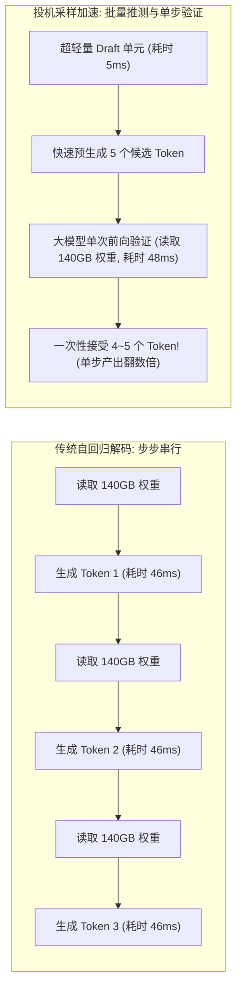
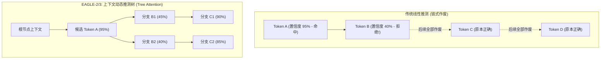
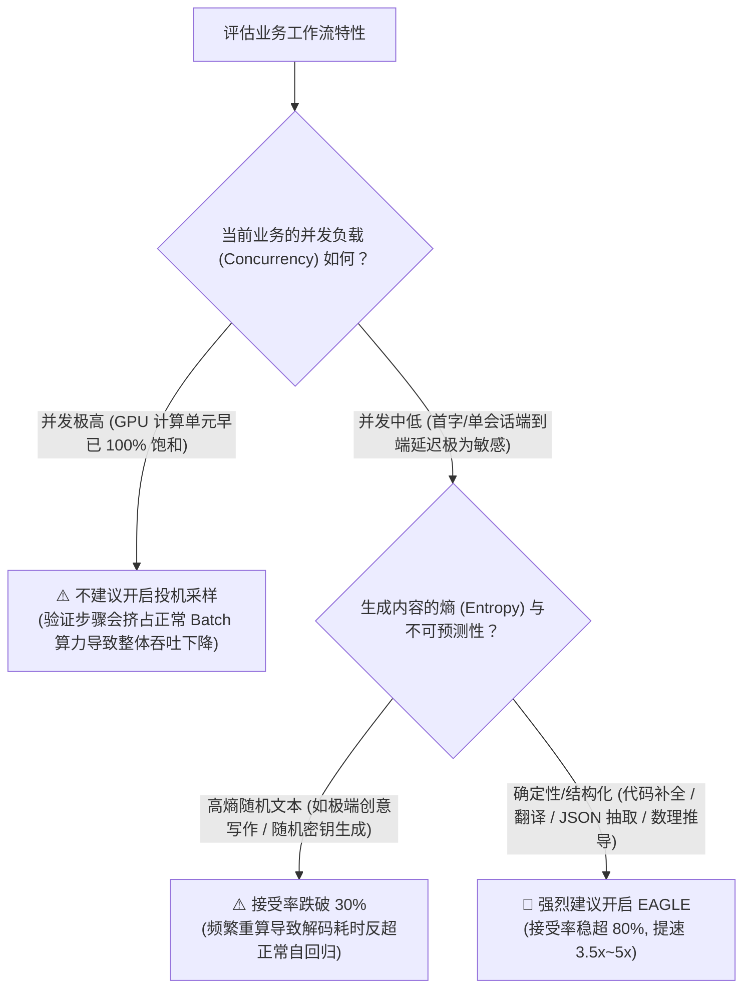

## 引言：自回归生成的内存带宽诅咒

在深入了解任何加速算法之前，我们必须直面大模型推理的最底层物理铁律：**自回归解码（Autoregressive Decoding）是极端受限于显存带宽（Memory-Bandwidth Bound）的计算过程。**

以单并发（Batch Size = 1）运行一个 FP16 精度的 70B 模型为例：
* 模型的静态权重高达 **140 GB**；
* 生成每一个新 Token，GPU 都必须将整整 140 GB 的权重从 HBM（高带宽显存）完整读取搬运至 GPU 的 SRAM 与计算核心中；
* 假定一张高端 GPU 的显存带宽为 3 TB/s，搬运一次 140 GB 权重需要耗时约 **46 毫秒**；
* 在这 46 毫秒内，GPU 的 Tensor Core 仅对一个 Token 进行了微不足道的浮点运算（算术强度极低），**超过 95% 的时间，昂贵的 GPU 计算单元都在空转等待显存数据传输！**



为了彻底击碎这一显存带宽瓶颈，**投机采样（Speculative Decoding）** 应运而生。它的核心哲学非常纯粹：**将原本低效的串行访存，转换为利用 GPU 剩余算力进行高并发验证，在单次主模型前向传播中，一次性吐出多个 Token！**

---

## 一、数学奠基：为什么投机采样能够做到“绝对无损”？

许多工程师在初次接触投机采样时往往心存顾虑：“由轻量模型猜测生成的 Token，会不会导致生成文本的智商下滑或概率分布偏移？”

答案是：**在数学上，投机采样的输出概率分布与原始目标模型严格 100% 一致，属于数学证明意义上的绝对无损（Lossless）！**

### 1. 投机验证与拒绝采样（Rejection Sampling）
设目标大模型为 $M_p$（目标概率分布为 $p(x)$），辅助猜测草稿机制为 $M_q$（推测概率分布为 $q(x)$）。

假设草稿机制依次推测出了 $K$ 个候选 Token：$(x_1, x_2, \dots, x_K)$。目标模型 $M_p$ 仅执行**一次并行前向计算**，同时获取这 $K$ 个位置在主模型下的条件概率：$p(x_1), p(x_2), \dots, p(x_K)$。

对于第 $k$ 个候选 Token $x_k$，系统执行以下基于**改进拒绝采样**的准入判决：

1. **计算接受概率**：
   $$\alpha = \min\left(1, \frac{p(x_k)}{q(x_k)}\right)$$
2. **生成均匀随机数** $r \sim \text{Uniform}(0, 1)$：
   * 若 $r \le \alpha$，则**接受（Accept）**该 Token $x_k$；
   * 若 $r > \alpha$，则**拒绝（Reject）**该 Token，并终止后续候选序列的验证。
3. **拒绝时的残差重采样（Residual Resampling）**：
   一旦在第 $k$ 个位置发生拒绝，系统立即根据调整后的“正残差分布”重新采样一个替代 Token：
   $$P_{resample}(x) = \frac{\max(0, p(x) - q(x))}{\sum_x \max(0, p(x) - q(x))}$$

**数学定理保证**：根据 Leviathan 等人在 2023 年严格给出的全概率公式展开，经过上述拒绝与重采样机制所产生的边缘分布 $P(X)$ 严格等于原始大模型的先验分布 $p(x)$。无论是贪婪解码（Greedy Decoding）还是温度采样（Temperature Sampling），**模型输出都不会产生任何质量劣化**。

---

## 二、投机采样技术演进四部曲

从最初的理论构想，到如今在生产集群中斩获 3x~5x 的极端加速，投机采样经历了四代深刻的技术范式演变：

| 演进代际 | 核心架构原理 | 核心优势 | 致命软肋与工程阻碍 | 代表技术/论文 |
|:---|:---|:---|:---|:---|
| **第一代：独立双模型投机 (Draft-Target)** | 使用一个同系列小模型（如 Llama-3.2-1B）作为草稿生成器，大模型（70B）负责并行验证。 | 概念直观，直接使用预训练模型开箱即用。 | 草稿模型本身仍是完整 Transformer，频繁访问自身显存；在低端 GPU 上抢占珍贵的 HBM 资源与带宽。 | Leviathan et al. (2023) |
| **第二代：多头并行推测 (Medusa)** | 摒弃独立草稿模型，直接在大模型最后一层 Transformer 并联多个轻量 MLP 预测头（Head 1, Head 2, ...）。 | 零显存搬运开销，无需独立维护草稿底座。 | 顶层各 Head 之间缺乏注意力自回归上下文依赖，推测长度超过 3 时接受率（Acceptance Rate）呈断崖式下跌。 | Medusa (2024) |
| **第三代：特征外推与动态树 (EAGLE-1 / EAGLE-2)** | 在次顶层隐藏特征向量（Feature Space）上进行自回归外推，并引入**上下文自适应推测树（Dynamic Draft Tree）**。 | 特征层表征平滑易预测，接受率突破 80%，加速倍率提升至 3x 以上。 | 静态训练需要对特定大模型提取特征缓存微调专用轻量自回归解码头。 | SafeAILab / 清华 (2024) |
| **第四代：多尺度语义融合 (EAGLE-3)** | 跨越低层、中层与高层，将不同抽象尺度的语义特征注入自适应推测网络中。 | 对罕见词汇、复杂代码符号的预测置信度大幅飙升，达成 **4x~5.6x** 的无损吞吐提升。 | 训练草稿头需要多节点分布式特征合成语料。 | EAGLE-3 (2025/2026) |

---

## 三、EAGLE 核心架构拆解：动态推测树为什么能封神？

在众多开源投机采样方案中，清华大学团队开源的 **[EAGLE (SafeAILab/EAGLE)](https://github.com/SafeAILab/EAGLE)** 凭借无损性与工业级加速比，成为 vLLM 与 SGLang 官方首选的标准配置。其封神的关键在于攻克了传统线性推测的致命痛点。

### 1. 从“线性链”到“动态树”：消灭概率短板效应
传统的推测采样假设模型生成一条线性的序列：$Token_1 \to Token_2 \to Token_3$。

**线性推测的致命死穴**：假设第 1 个 Token 的推测置信度为 95%，但第 2 个 Token 是一个极具歧义的分支词，置信度仅为 40%。在线性结构下，只要第 2 个 Token 被主模型拒绝，后续已经推测正确的第 3、第 4 个 Token 将被**全盘无情作废**！



### 2. Tree Attention（树状注意力掩码）机制
EAGLE 将这颗包含多个候选分支的推测树，扁平化展开为一个 Sequence，通过特殊的 **2D 树状注意力掩码（Tree-Attention Mask）**，允许目标主模型在**单次前向传播中同时对树上的所有多路径分支进行并行验证**！
* 如果主模型判定分支 $B_1$ 错误但分支 $B_2$ 正确，系统顺着 $B_2 \to C_2$ 路径一举采纳；
* 配合动态剪枝算法，根据草稿头在当前上下文的实时置信度动态调整树的宽度与深度，使得单步平均接受 Token 数（Average Accepted Tokens）稳定维持在 **3.5 ~ 4.8** 之间。

---

## 四、工业级实战：在 vLLM 与 SGLang 中部署 EAGLE

下面我们以工业界最常见的 `Qwen/Qwen2.5-72B-Instruct` 为例，手把手演示如何在生产容器中接入官方预训练好的 EAGLE 草稿头权重。

### 1. 在 vLLM 中启用 EAGLE 投机采样

vLLM 原生支持 `--speculative-model` 参数接入 EAGLE 权重：

```bash
# 启动 vLLM + EAGLE-2 投机采样服务
vllm serve Qwen/Qwen2.5-72B-Instruct \
  --tensor-parallel-size 4 \
  --gpu-memory-utilization 0.90 \
  --max-model-len 8192 \
  --speculative-model yuhuili/EAGLE-Qwen2.5-72B-Instruct \
  --num-speculative-tokens 5 \
  --speculative-draft-tensor-parallel-size 1 \
  --port 8000
```

**关键生产参数深度解析**：
* `--speculative-model`：指定匹配的 EAGLE 专用轻量草稿头模型路径（从 HuggingFace 下载，体积通常仅数百 MB 至 1GB 左右）；
* `--num-speculative-tokens 5`：单步推测的 Token 长度。对于结构化代码与通用文本，5 是延迟与算力开销的最佳黄金平衡点；
* `--speculative-draft-tensor-parallel-size 1`：草稿头参数极小，无需跨卡分布式通信，单张卡独立运行可消除多卡同步开销。

### 2. 在 SGLang 中启用 EAGLE 动态树加速

SGLang 结合自身的高性能算子，对 EAGLE 的推测树提供了极佳的加速支持（关于 SGLang 与 vLLM 的深度架构对比，可参阅我们的 [SGLang vs vLLM 架构对决](/articles/sglang-vs-vllm-architecture/)）：

```bash
# 启动 SGLang + EAGLE 投机采样服务
python3 -m sglang.launch_server \
  --model-path Qwen/Qwen2.5-72B-Instruct \
  --speculative-algorithm EAGLE \
  --speculative-draft yuhuili/EAGLE-Qwen2.5-72B-Instruct \
  --speculative-num-steps 5 \
  --speculative-eagle-topk 4 \
  --speculative-num-draft-tokens 16 \
  --tp 4 \
  --port 30000
```
*注：`--speculative-eagle-topk 4` 与 `--speculative-num-draft-tokens 16` 启用了树状搜索机制，在单次校验中向 GPU 提交深度为 5、节点总量为 16 的动态推测树，最大化榨取接受率。*

---

## 五、何时生效与何时失效？投机采样的“反向减速”陷阱

投机采样并非放之四海皆准的免费午餐。在特定的生产负载下，它可能引发**性能负优化（Slowdown）**。



### 1. 显存带宽与算力饱和的临界点（The Saturation Trap）
* **单请求或低并发（Concurrency $\le 16$）**：GPU 的 Tensor Core 严重空闲，此时开启投机采样，利用空闲算力并行推测验证，端到端延迟（ITL，Inter-Token Latency）立竿见影缩减 60%~75%；
* **超高并发批处理（Concurrency $\ge 128$）**：当请求队列已经把 GPU 的 Tensor Core 喂得非常饱满（算术强度已经进入 Compute-bound 区间）时，推测验证阶段增加的额外前向计算会反噬正常请求的调度，此时**系统整体吞吐量可能反而下跌 10%~15%**。

---

## 常见问题 (FAQ)

### Q1: 投机采样是否需要重新训练原始大模型？
完全不需要。无论是双模型投机还是最新的 EAGLE-2/3，原始基座大模型的全部权重保持 100% 冻结不变。EAGLE 仅需在大模型冻结的输出特征层之上，利用合成语料训练一个参数量仅占大模型 0.5%~1% 的极轻量 Decoder-only 预测头（在几张单卡上训练数小时即可完成）。

### Q2: 投机采样能否与 FP8 权重量化结合使用？
完全可以，且这是 2026 年工业界最强大的黄金组合！目标大模型通过 FP8 或 AWQ 压缩驻留在 GPU 显存中以最大化节省显存容量（可参阅 [大模型量化实战手册](/articles/quantization-hands-on-guide/)），同时挂载 EAGLE 草稿头开启投机加速。这样既解决了显存容量不够的“显存墙”，又击碎了访存带宽不足的“延迟墙”。

### Q3: 为什么有时测出的 EAGLE 加速比达不到论文标称的 4 倍？
实际加速比严格取决于**当前业务 Prompt 的接受率 $\alpha$**。在编程语言生成（Python/Java 具有极强的语法结构规律）和结构化 JSON 提取中，接受率通常高达 85% 以上，加速可达 4x 甚至更高；但在文学创作、高温度（Temperature $\ge 1.0$）的开放式对话中，文本熵极高，接受率可能跌至 50% 甚至更低，此时实际加速比通常在 1.8x~2.2x 之间。
